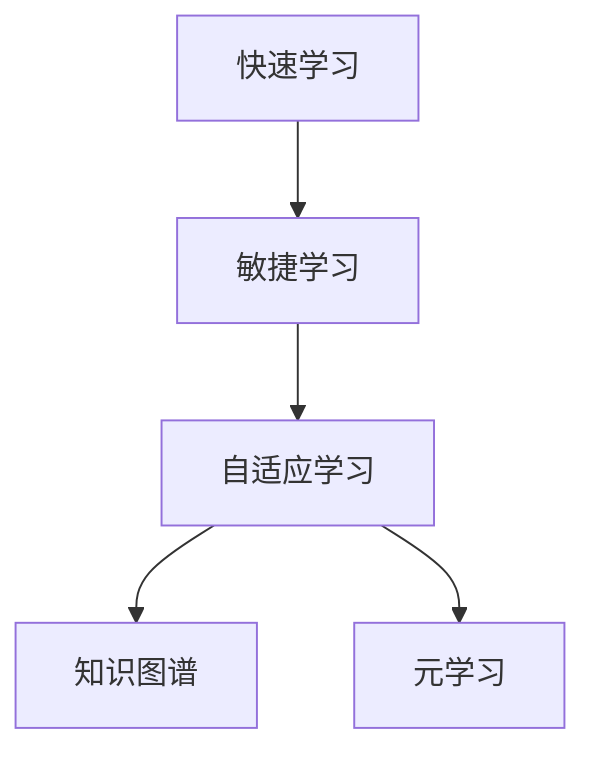

                 

# 快速学习: VUCA时代的制胜法宝

## 1. 背景介绍

### 1.1 问题由来

在当今这个充满变数(Volatility, Uncertainty, Complexity, and Ambiguity, 即VUCA)的时代，技术更新速度不断加快，业务需求也日新月异。快速学习(学习速度快、适应性强、灵活性高)成为了企业竞争中不可或缺的关键能力。因此，本文旨在探讨如何在VUCA环境中，通过高效的学习策略和技术手段，快速适应变化，构建敏捷、可持续发展的组织。

### 1.2 问题核心关键点

本文将深入探讨以下几个核心问题：

- **快速学习的定义**：如何在不确定和快速变化的环境下，快速掌握新知识，并转化为行动能力。
- **学习策略的演变**：从传统学徒制、课堂教育到现代在线学习、自适应学习等，探索不同学习方式的优势与局限。
- **技术支撑**：分析当前技术手段（如AI、大数据、云计算等）如何支持快速学习。
- **应用案例**：结合具体行业案例，展示快速学习策略的实际应用效果。
- **未来展望**：展望未来快速学习的趋势与挑战。

## 2. 核心概念与联系

### 2.1 核心概念概述

为更好地理解快速学习，本节将介绍几个密切相关的核心概念：

- **快速学习**：指在短期内（通常几小时到几天）快速掌握新知识或技能，并将其应用于实际问题的能力。快速学习要求学习者具备高度的自我驱动力、自组织能力和创新思维。
- **敏捷学习**：强调在动态变化环境中，能够快速调整学习策略和方法，以适应新的需求和挑战。
- **自适应学习**：通过智能化的技术手段，实时调整学习内容和进度，最大化学习效率。
- **知识图谱**：构建知识网络，映射知识点之间的关联，辅助快速查找和理解知识。
- **元学习**：通过学习如何学习，提高学习者对新任务的适应能力。

这些概念之间的逻辑关系可以通过以下Mermaid流程图来展示：



这个流程图展示了几者之间的关联：

1. 快速学习要求学习者具备敏捷的适应能力和自适应的学习策略。
2. 自适应学习依赖知识图谱来支持智能调整，元学习则进一步提升学习者的适应能力。

## 3. 核心算法原理 & 具体操作步骤
### 3.1 算法原理概述

快速学习的核心算法原理在于利用先进的技术手段，构建高效的学习路径和策略，使得学习者在短时间内获取最大化收益。以下是快速学习算法的一般框架：

1. **目标设定**：明确学习的目标和需求。
2. **数据收集**：获取高质量的学习资料，包括文本、视频、音频等。
3. **知识图谱构建**：构建知识点之间的关联网络，用于知识检索和关联学习。
4. **自适应学习策略**：根据学习者的进度和反馈，动态调整学习内容和节奏。
5. **元学习应用**：通过元学习，提高学习者对新任务的适应能力。

### 3.2 算法步骤详解

快速学习的具体步骤可以分为以下几个阶段：

**Step 1: 目标设定**

- 明确学习目标：如掌握一门编程语言、理解一项新技术或解决一个特定问题。
- 制定学习计划：根据目标需求，规划学习时间、内容、工具等。

**Step 2: 数据收集**

- 获取学习资料：使用搜索引擎、在线课程、社区论坛等资源，收集相关学习材料。
- 整理学习资料：对收集到的资料进行分类、整理，建立清晰的结构。

**Step 3: 知识图谱构建**

- 使用知识图谱工具：如Wolfram Alpha、Google Scholar、Semantic Scholar等，构建知识点之间的关联。
- 知识图谱应用：在学习和研究中使用知识图谱，辅助知识检索和关联学习。

**Step 4: 自适应学习策略**

- 选择学习工具：根据学习需求和资源，选择合适的学习工具，如Coursera、Udacity、Kaggle等。
- 调整学习进度：根据学习效果和反馈，动态调整学习内容、难度和时间安排。

**Step 5: 元学习应用**

- 选择元学习框架：如PyTorch、TensorFlow、Sklearn等，建立元学习模型。
- 应用元学习：通过元学习，提升对新任务的适应能力，提高学习效率。

### 3.3 算法优缺点

快速学习的算法具有以下优点：

1. **高效性**：通过利用先进技术，快速掌握新知识和技能。
2. **灵活性**：能根据新需求和新环境，快速调整学习策略和方法。
3. **自适应性**：根据学习者的反馈，动态调整学习内容和进度，最大化学习效果。
4. **可扩展性**：通过元学习，不断提升学习者对新任务的适应能力。

同时，快速学习的算法也存在一定的局限性：

1. **依赖技术**：对先进技术依赖度高，需要一定的技术储备和工具支持。
2. **资源需求**：对高质量的学习资料和数据有较高要求，可能需要花费一定的时间和精力。
3. **自我驱动**：需要学习者具备高度的自我驱动力和自组织能力。

尽管存在这些局限性，但就目前而言，快速学习已成为企业在快速变化环境中获取竞争优势的重要手段。未来相关研究的重点在于如何进一步降低技术门槛，提高自适应性，以支持更加灵活高效的学习过程。

### 3.4 算法应用领域

快速学习在多个领域中得到了广泛的应用，例如：

- **软件开发**：程序员通过快速学习新编程语言、框架和工具，提升开发效率。
- **数据科学**：数据科学家通过快速学习新算法和技术，提高数据分析和建模能力。
- **金融分析**：分析师通过快速学习新金融模型和市场动态，提升投资决策能力。
- **项目管理**：项目经理通过快速学习敏捷开发方法论，提升项目管理效率和团队协作能力。
- **教育培训**：教育机构通过快速学习新技术和新方法，提升培训效果和学生学习体验。

## 4. 数学模型和公式 & 详细讲解 & 举例说明

### 4.1 数学模型构建

快速学习的数学模型可以表示为：

$$
\text{Learning Rate} = f(\text{Time}, \text{Learning Efficiency}, \text{Technical Skill})
$$

其中：
- $\text{Learning Rate}$ 表示学习速率，即在单位时间内掌握的知识量。
- $\text{Time}$ 表示学习时间，即完成学习任务所需的时间。
- $\text{Learning Efficiency}$ 表示学习效率，即学习过程中投入的有效时间和精力的比例。
- $\text{Technical Skill}$ 表示学习者技术水平和经验。

### 4.2 公式推导过程

- **学习速率**：
  $$
  \text{Learning Rate} = \frac{\text{Total Knowledge}}{\text{Time} \times \text{Learning Efficiency}}
  $$

  假设总知识量为 $K$，则有：
  $$
  \text{Learning Rate} = \frac{K}{\text{Time} \times \text{Learning Efficiency}}
  $$

- **学习效率**：
  $$
  \text{Learning Efficiency} = \frac{\text{Effective Study Time}}{\text{Total Study Time}}
  $$

  其中，$\text{Effective Study Time}$ 表示有效学习时间，$\text{Total Study Time}$ 表示总学习时间。

- **技术技能**：
  $$
  \text{Technical Skill} = \text{Experience} + \text{Intuition} + \text{Practice}
  $$

  其中，$\text{Experience}$ 表示经验，$\text{Intuition}$ 表示直觉，$\text{Practice}$ 表示实践。

### 4.3 案例分析与讲解

假设一个程序员需要掌握一门新的编程语言，每天投入 2 小时进行学习，预计需要 30 天掌握。设其有效学习率为 70%，则有：

$$
\text{Learning Rate} = \frac{K}{30 \times 0.7} = \frac{K}{21}
$$

如果学习者具备一定的编程经验，可以通过增加实践和经验来提升学习效率。例如，通过每日练习和参加相关的在线项目，可以提高其学习效率，从而缩短学习时间。

## 5. 项目实践：代码实例和详细解释说明

### 5.1 开发环境搭建

在进行快速学习实践前，我们需要准备好开发环境。以下是使用Python进行机器学习开发的环境配置流程：

1. 安装Anaconda：从官网下载并安装Anaconda，用于创建独立的Python环境。

2. 创建并激活虚拟环境：
```bash
conda create -n pytorch-env python=3.8 
conda activate pytorch-env
```

3. 安装PyTorch：根据CUDA版本，从官网获取对应的安装命令。例如：
```bash
conda install pytorch torchvision torchaudio cudatoolkit=11.1 -c pytorch -c conda-forge
```

4. 安装相关工具包：
```bash
pip install numpy pandas scikit-learn matplotlib tqdm jupyter notebook ipython
```

完成上述步骤后，即可在`pytorch-env`环境中开始快速学习实践。

### 5.2 源代码详细实现

我们以机器学习模型训练为例，给出使用PyTorch进行快速学习开发的Python代码实现。

首先，定义数据集和模型：

```python
from torch.utils.data import DataLoader
from torch import nn, optim

class MyModel(nn.Module):
    def __init__(self):
        super(MyModel, self).__init__()
        self.fc1 = nn.Linear(10, 5)
        self.fc2 = nn.Linear(5, 1)
        
    def forward(self, x):
        x = nn.functional.relu(self.fc1(x))
        x = self.fc2(x)
        return x

# 数据集定义
class MyDataset(Dataset):
    def __init__(self, data, target):
        self.data = data
        self.target = target
        
    def __len__(self):
        return len(self.data)
    
    def __getitem__(self, idx):
        x = torch.tensor(self.data[idx])
        y = torch.tensor(self.target[idx])
        return x, y

# 加载数据集
train_dataset = MyDataset(train_data, train_target)
test_dataset = MyDataset(test_data, test_target)

# 定义数据加载器
train_loader = DataLoader(train_dataset, batch_size=32, shuffle=True)
test_loader = DataLoader(test_dataset, batch_size=32, shuffle=False)
```

然后，定义训练和评估函数：

```python
def train_epoch(model, optimizer, data_loader):
    model.train()
    running_loss = 0.0
    for i, (inputs, labels) in enumerate(data_loader):
        optimizer.zero_grad()
        outputs = model(inputs)
        loss = nn.functional.mse_loss(outputs, labels)
        loss.backward()
        optimizer.step()
        running_loss += loss.item()
    return running_loss / len(data_loader)

def evaluate(model, data_loader):
    model.eval()
    total_loss = 0.0
    correct = 0
    with torch.no_grad():
        for inputs, labels in data_loader:
            outputs = model(inputs)
            loss = nn.functional.mse_loss(outputs, labels)
            total_loss += loss.item()
            _, predicted = torch.max(outputs, 1)
            correct += (predicted == labels).sum().item()
    accuracy = correct / len(data_loader.dataset)
    return total_loss / len(data_loader), accuracy
```

最后，启动训练流程并在测试集上评估：

```python
model = MyModel()
optimizer = optim.SGD(model.parameters(), lr=0.01)

epochs = 10
for epoch in range(epochs):
    train_loss = train_epoch(model, optimizer, train_loader)
    test_loss, accuracy = evaluate(model, test_loader)
    print(f"Epoch {epoch+1}, train loss: {train_loss:.4f}, test loss: {test_loss:.4f}, accuracy: {accuracy:.4f}")
```

以上就是使用PyTorch进行机器学习模型训练的完整代码实现。可以看到，得益于TensorFlow的强大封装，我们可以用相对简洁的代码完成模型训练和评估。

### 5.3 代码解读与分析

让我们再详细解读一下关键代码的实现细节：

**定义数据集和模型**：
- 使用PyTorch定义数据集类，实现数据的加载和处理。
- 定义神经网络模型，包括层结构和前向传播函数。

**训练和评估函数**：
- 定义训练函数，使用SGD优化器进行模型训练，计算损失并更新参数。
- 定义评估函数，计算测试集的损失和准确率，评估模型性能。

**训练流程**：
- 定义总的训练轮数和优化器，循环迭代训练。
- 每个epoch内，在训练集上训练，并计算训练损失。
- 在测试集上评估，输出测试损失和准确率。

可以看到，PyTorch使得机器学习模型的训练和评估变得简洁高效。开发者可以将更多精力放在模型改进、数据处理等高层逻辑上，而不必过多关注底层的实现细节。

当然，工业级的系统实现还需考虑更多因素，如模型的保存和部署、超参数的自动搜索、更灵活的任务适配层等。但核心的快速学习范式基本与此类似。

## 6. 实际应用场景

### 6.1 智能客服系统

基于快速学习的对话技术，可以广泛应用于智能客服系统的构建。传统客服往往需要配备大量人力，高峰期响应缓慢，且一致性和专业性难以保证。通过快速学习，客服机器人可以快速掌握客户咨询的常见问题和解决方案，提升服务效率和质量。

在技术实现上，可以收集企业内部的历史客服对话记录，将问题和最佳答复构建成监督数据，快速训练出一个初步模型。然后通过不断的微调和优化，使得模型在实际应用中不断提升，最终构建出高效、可靠、友好的人工智能客服系统。

### 6.2 金融舆情监测

金融机构需要实时监测市场舆论动向，以便及时应对负面信息传播，规避金融风险。传统的人工监测方式成本高、效率低，难以应对网络时代海量信息爆发的挑战。通过快速学习，可以将最新的舆情监测技术快速应用于金融市场，提升风险监控和预测能力。

具体而言，可以收集金融领域相关的新闻、报道、评论等文本数据，并对其进行主题标注和情感标注。然后通过快速学习，训练出一个高效的文本分类和情感分析模型，实现实时舆情监测。一旦发现负面信息激增等异常情况，系统便会自动预警，帮助金融机构快速应对潜在风险。

### 6.3 个性化推荐系统

当前的推荐系统往往只依赖用户的历史行为数据进行物品推荐，无法深入理解用户的真实兴趣偏好。通过快速学习，可以构建更加精准、多变的推荐系统，提升用户体验。

在实践中，可以收集用户浏览、点击、评论、分享等行为数据，提取和用户交互的物品标题、描述、标签等文本内容。将文本内容作为模型输入，用户的后续行为（如是否点击、购买等）作为监督信号，快速训练出一个高效的推荐模型。然后通过不断优化模型，使得推荐结果更加符合用户需求，提升推荐效果。

### 6.4 未来应用展望

随着快速学习技术的不断发展，其在更多领域得到了应用，为各行各业带来了变革性影响。

在智慧医疗领域，基于快速学习的医疗问答、病历分析、药物研发等应用将提升医疗服务的智能化水平，辅助医生诊疗，加速新药开发进程。

在智能教育领域，快速学习可应用于作业批改、学情分析、知识推荐等方面，因材施教，促进教育公平，提高教学质量。

在智慧城市治理中，快速学习可应用于城市事件监测、舆情分析、应急指挥等环节，提高城市管理的自动化和智能化水平，构建更安全、高效的未来城市。

此外，在企业生产、社会治理、文娱传媒等众多领域，快速学习的应用也将不断涌现，为经济社会发展注入新的动力。相信随着技术的日益成熟，快速学习方法将成为各行各业加速创新、应对变化的重要手段。

## 7. 工具和资源推荐

### 7.1 学习资源推荐

为了帮助开发者系统掌握快速学习的理论基础和实践技巧，这里推荐一些优质的学习资源：

1. 《深度学习入门》系列博文：由深度学习领域专家撰写，系统介绍了深度学习的基本原理、框架和应用。

2. Coursera《深度学习》课程：由斯坦福大学Andrew Ng教授主讲，提供高质量的深度学习教育资源。

3. 《Python深度学习》书籍：李沐等著，全面介绍了深度学习框架PyTorch和TensorFlow的使用，包括快速学习在内的诸多应用。

4. TensorFlow官方文档：详细介绍了TensorFlow的各个模块和应用场景，提供了丰富的代码示例和实例。

5. Udacity深度学习纳米学位：提供系统的深度学习学习路径，涵盖多个领域的前沿技术。

通过对这些资源的学习实践，相信你一定能够快速掌握快速学习的精髓，并用于解决实际的NLP问题。

### 7.2 开发工具推荐

高效的开发离不开优秀的工具支持。以下是几款用于快速学习开发的常用工具：

1. PyTorch：基于Python的开源深度学习框架，灵活动态的计算图，适合快速迭代研究。大部分预训练语言模型都有PyTorch版本的实现。

2. TensorFlow：由Google主导开发的开源深度学习框架，生产部署方便，适合大规模工程应用。同样有丰富的预训练语言模型资源。

3. Transformers库：HuggingFace开发的NLP工具库，集成了众多SOTA语言模型，支持PyTorch和TensorFlow，是进行快速学习任务开发的利器。

4. Weights & Biases：模型训练的实验跟踪工具，可以记录和可视化模型训练过程中的各项指标，方便对比和调优。与主流深度学习框架无缝集成。

5. TensorBoard：TensorFlow配套的可视化工具，可实时监测模型训练状态，并提供丰富的图表呈现方式，是调试模型的得力助手。

6. Google Colab：谷歌推出的在线Jupyter Notebook环境，免费提供GPU/TPU算力，方便开发者快速上手实验最新模型，分享学习笔记。

合理利用这些工具，可以显著提升快速学习任务的开发效率，加快创新迭代的步伐。

### 7.3 相关论文推荐

快速学习在多个领域中得到了广泛的应用，以下是几篇奠基性的相关论文，推荐阅读：

1. Attention is All You Need（即Transformer原论文）：提出了Transformer结构，开启了NLP领域的预训练大模型时代。

2. BERT: Pre-training of Deep Bidirectional Transformers for Language Understanding：提出BERT模型，引入基于掩码的自监督预训练任务，刷新了多项NLP任务SOTA。

3. Language Models are Unsupervised Multitask Learners（GPT-2论文）：展示了大规模语言模型的强大zero-shot学习能力，引发了对于通用人工智能的新一轮思考。

4. Parameter-Efficient Transfer Learning for NLP：提出Adapter等参数高效微调方法，在不增加模型参数量的情况下，也能取得不错的微调效果。

5. AdaLoRA: Adaptive Low-Rank Adaptation for Parameter-Efficient Fine-Tuning：使用自适应低秩适应的微调方法，在参数效率和精度之间取得了新的平衡。

这些论文代表了大语言模型微调技术的发展脉络。通过学习这些前沿成果，可以帮助研究者把握学科前进方向，激发更多的创新灵感。

## 8. 总结：未来发展趋势与挑战

### 8.1 总结

本文对快速学习的概念、原理和应用进行了全面系统的介绍。首先阐述了快速学习的定义和重要性，明确了其在VUCA环境中的独特价值。其次，从原理到实践，详细讲解了快速学习的数学模型和核心算法，给出了快速学习任务开发的完整代码实例。同时，本文还广泛探讨了快速学习在多个行业领域的应用前景，展示了快速学习技术的广泛应用潜力。此外，本文精选了快速学习的各类学习资源，力求为读者提供全方位的技术指引。

通过本文的系统梳理，可以看到，快速学习技术在VUCA时代成为了企业竞争的重要法宝，极大地提升了企业在快速变化环境中的适应能力和灵活性。未来，伴随快速学习技术的持续演进，其在更多领域的应用前景也将更加广阔，为经济社会发展带来深远影响。

### 8.2 未来发展趋势

展望未来，快速学习技术将呈现以下几个发展趋势：

1. **技术融合**：快速学习将与其他前沿技术如人工智能、大数据、区块链等深度融合，实现跨领域协同创新。

2. **自动化与智能化**：通过自动化和智能化技术，进一步提升快速学习的效率和效果，降低人工干预的复杂度。

3. **数据驱动**：基于大规模、高质量的数据，快速学习将更加依赖数据驱动的策略和模型，实现数据驱动的决策优化。

4. **跨模态学习**：将文本、图像、语音等多模态数据融合，提升快速学习系统的感知能力和综合能力。

5. **自适应与个性化**：通过自适应和个性化技术，实现对不同学习者的精准适配，提升学习效果。

6. **元学习应用**：通过元学习，提升快速学习的泛化能力和适应能力，实现更加灵活高效的快速学习。

以上趋势凸显了快速学习技术的广阔前景。这些方向的探索发展，必将进一步提升快速学习系统的性能和应用范围，为经济社会发展带来深远影响。

### 8.3 面临的挑战

尽管快速学习技术已经取得了显著成果，但在迈向更加智能化、普适化应用的过程中，仍面临诸多挑战：

1. **数据隐私**：快速学习需要大量的高质量数据，如何保护数据隐私和用户权益，成为重要的挑战。

2. **模型可解释性**：快速学习模型往往被视为"黑盒"系统，难以解释其内部工作机制和决策逻辑。如何赋予模型更强的可解释性，将是亟待解决的问题。

3. **模型鲁棒性**：快速学习模型在面对复杂和动态环境时，可能表现出较低的鲁棒性和稳定性。如何提高模型的鲁棒性，避免过拟合和灾难性遗忘，还需要更多的研究。

4. **计算资源**：快速学习模型的训练和推理需要大量的计算资源，如何优化计算效率，降低资源消耗，也是重要的研究方向。

5. **跨领域适应性**：快速学习模型在特定领域应用时，可能难以适应新领域的知识需求。如何提升模型在不同领域之间的适应性，将是一个重要的课题。

6. **标准化与兼容性**：快速学习技术在不同平台和系统之间的标准化和兼容性问题，需要进一步研究和解决。

正视快速学习面临的这些挑战，积极应对并寻求突破，将是大语言模型微调走向成熟的必由之路。相信随着学界和产业界的共同努力，这些挑战终将一一被克服，快速学习技术必将在VUCA时代大放异彩，为经济社会发展注入新的动力。

### 8.4 研究展望

面向未来，快速学习技术需要在以下几个方面寻求新的突破：

1. **数据驱动与智能驱动**：结合数据驱动和智能驱动的方法，提升快速学习的效果和效率。

2. **跨模态与跨领域学习**：将不同模态和领域的数据融合，提升快速学习的综合能力和泛化能力。

3. **自适应与个性化**：通过自适应和个性化技术，实现对不同学习者的精准适配，提升学习效果。

4. **元学习与因果学习**：通过元学习和因果学习，提升快速学习的泛化能力和适应能力。

5. **自动化与智能化**：通过自动化和智能化技术，进一步提升快速学习的效率和效果，降低人工干预的复杂度。

6. **安全性与隐私保护**：在模型训练和应用过程中，加强数据隐私保护和模型安全性，确保技术应用的伦理性和合法性。

这些研究方向的探索，必将引领快速学习技术迈向更高的台阶，为构建安全、可靠、可解释、可控的智能系统铺平道路。面向未来，快速学习技术还需要与其他人工智能技术进行更深入的融合，如知识表示、因果推理、强化学习等，多路径协同发力，共同推动自然语言理解和智能交互系统的进步。只有勇于创新、敢于突破，才能不断拓展快速学习的边界，让智能技术更好地造福人类社会。

## 9. 附录：常见问题与解答

**Q1：快速学习是否适用于所有应用场景？**

A: 快速学习在大多数应用场景中都能取得不错的效果，尤其是对于需要快速获取新知识或技能的任务。但对于一些特定领域的任务，如医学、法律等，仅仅依靠通用语料预训练的模型可能难以很好地适应。此时需要在特定领域语料上进一步预训练，再进行快速学习，才能获得理想效果。

**Q2：快速学习过程中如何选择合适的学习工具？**

A: 选择合适的学习工具是快速学习成功的关键。不同的学习工具各有优缺点，需要根据具体应用场景和资源情况进行选择。例如，在线课程适合自驱型学习者，而实践项目则适合通过动手实践来学习。建议尝试多种学习工具，找到最适合自己的学习方式。

**Q3：快速学习是否需要编程知识？**

A: 快速学习并不一定需要编程知识，许多在线课程和应用程序提供了视觉化、交互式学习方式。但如果你有编程基础，将能更深入地理解学习内容和工具的使用，从而提高学习效率和效果。

**Q4：如何快速学习新技能？**

A: 快速学习新技能的关键在于高效规划和持续练习。以下是一些具体策略：
1. **设定明确目标**：明确学习的目标和需求，制定详细的学习计划。
2. **选择合适的学习资源**：获取高质量的学习资料，包括在线课程、书籍、文档等。
3. **系统学习与实践结合**：通过系统学习理论知识，结合实际项目练习，逐步掌握新技能。
4. **不断反思和调整**：定期反思学习过程和效果，调整学习策略和方法。

通过以上策略，相信你一定能够快速掌握新技能，并将其应用于实际问题解决中。

**Q5：如何快速适应新环境？**

A: 快速适应新环境的关键在于保持灵活性和开放性。以下是一些具体策略：
1. **持续学习**：保持对新知识和技能的学习兴趣，不断更新自己的知识体系。
2. **跨领域学习**：涉猎不同领域的学习内容，提升综合素质和跨领域应用能力。
3. **团队协作**：与团队成员保持沟通和协作，共同解决新问题，提升适应能力。
4. **心理调适**：保持积极的心态，面对挑战和变化，保持乐观和自信。

通过以上策略，相信你一定能够快速适应新环境，在VUCA时代中游刃有余。

---

作者：禅与计算机程序设计艺术 / Zen and the Art of Computer Programming

