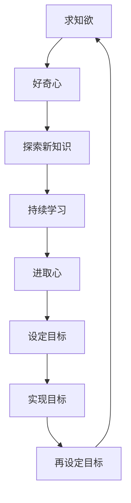

                 

# 怎样培养强烈的求知欲、好奇心和进取心

## 1. 背景介绍

在人工智能和计算机科学领域，求知欲、好奇心和进取心是推动技术进步、激发创新思维和实现职业发展的关键要素。然而，由于现代技术的快速发展，持续学习和自我提升变得越来越困难。面对海量的知识和快速变化的技术趋势，如何保持和培养这些重要品质，是很多从业者和学者都关心的问题。本文将深入探讨培养强烈求知欲、好奇心和进取心的重要性，并给出一些实际可行的建议。

## 2. 核心概念与联系

### 2.1 核心概念概述

为更好地理解如何培养求知欲、好奇心和进取心，本节将介绍几个密切相关的核心概念：

- 求知欲（Curiosity）：指对新事物、新知识的渴望和探索欲望。求知欲驱使我们不断学习、探索和实验，以期突破认知边界，掌握更多知识。
- 好奇心（Curiosity）：与求知欲密切相关，指对未知领域的探索和发现。好奇心促使我们提出问题、寻找答案，激发创新思维和创造力。
- 进取心（Enterprising Spirit）：指积极追求目标，不断挑战自我、超越极限的决心和动力。进取心帮助我们设定并实现长期目标，在面对困难时坚韧不拔，持续前进。
- 持续学习（Lifelong Learning）：指在职业生涯中不断学习、更新知识和技能，以适应技术变化和职业发展。

这些核心概念之间存在密切联系，共同构成了一个循环往复、相互促进的学习与发展的过程。本文将通过这些概念，探讨如何培养和保持强烈的求知欲、好奇心和进取心。

### 2.2 核心概念原理和架构的 Mermaid 流程图



## 3. 核心算法原理 & 具体操作步骤

### 3.1 算法原理概述

培养求知欲、好奇心和进取心，本质上是一个自我激励和持续发展的过程。其核心思想是通过设定目标、探索新知、持续学习和实现目标，不断增强个人的内在驱动力。

形式化地，假设个人当前的知识状态为 $K$，目标状态为 $G$。目标设定算法 $T$ 将目标状态 $G$ 映射为一系列学习任务 $T(G) = \{L_1, L_2, ..., L_n\}$，其中 $L_i$ 表示第 $i$ 个学习任务。探索算法 $E$ 将当前知识状态 $K$ 映射为探索方向 $E(K) = D$，其中 $D$ 表示探索新知识的方向。学习算法 $L$ 将探索方向 $D$ 和当前知识状态 $K$ 映射为更新后的知识状态 $K'$，即 $L(D, K) = K'$。实现算法 $R$ 将更新后的知识状态 $K'$ 映射为目标状态 $G'$，即 $R(K') = G'$。

通过不断循环执行 $T, E, L, R$，个人能够逐步从当前知识状态 $K$ 达到目标状态 $G$，并不断设定更高层次的目标，形成一个自我激励、持续发展的闭环。

### 3.2 算法步骤详解

基于上述原理，培养求知欲、好奇心和进取心的具体操作步骤可以分为以下几个步骤：

**Step 1: 目标设定**

设定一个明确、具体且可实现的目标。目标应当具有挑战性，同时符合SMART原则（Specific, Measurable, Achievable, Relevant, Time-bound），即目标要具体明确、可量化、可实现、相关且有明确的时间限制。

**Step 2: 探索新知**

通过阅读、研究、实验等手段，探索与目标相关的未知领域。探索新知应当具备创新性和探索性，尝试解决未被完全解决的问题，挑战已知的知识边界。

**Step 3: 持续学习**

通过学习算法，将探索过程中获得的新知识不断整合到当前的知识体系中。持续学习应当注重理论基础和实践结合，通过实际应用巩固和深化所学知识。

**Step 4: 实现目标**

通过实际行动，逐步实现所设定的目标。实现过程中可能遇到挫折和困难，应当保持积极乐观的态度，寻找解决问题的新方法。

**Step 5: 再设定目标**

在实现目标后，根据新的需求和情况，重新设定更高层次的目标，进入下一轮循环。

### 3.3 算法优缺点

培养求知欲、好奇心和进取心的过程具有以下优点：

- **动力持久**：明确的目标设定和持续的探索，能提供持久的动力，驱使个人不断前进。
- **知识全面**：通过系统的探索和持续学习，能积累更全面的知识，提升综合能力。
- **创新力强**：探索新知和设定高层次目标，能激发创新思维和创造力，推动技术进步。

同时，该过程也存在一定的局限性：

- **初期难**：目标设定和探索新知初期可能面临困难，需要较强的毅力和耐心。
- **风险高**：探索未知领域可能遇到挫折，需要具备良好的心理素质和适应能力。
- **资源消耗**：持续学习需要大量时间和资源，需要合理分配和管理。

尽管存在这些局限性，但通过系统的目标设定、探索和学习的循环，大多数人都能逐步培养和保持强烈的求知欲、好奇心和进取心。

### 3.4 算法应用领域

培养求知欲、好奇心和进取心的算法原理和操作步骤，不仅适用于个人职业发展，在企业技术创新、团队协作、教育培训等领域也有广泛的应用。

在企业技术创新中，设定高层次的技术目标，鼓励员工探索新技术、新方法，可以推动企业技术进步和产品升级。

在团队协作中，通过目标设定和持续学习，团队成员可以共同成长，提升团队的整体能力和创新力。

在教育培训中，通过设定明确的教学目标，引导学生探索新知识、持续学习，可以提高学生的学习动力和学业成绩。

## 4. 数学模型和公式 & 详细讲解

### 4.1 数学模型构建

本文将通过数学语言对目标设定、探索新知、持续学习和实现目标的过程进行形式化描述。

假设个人当前的知识状态为 $K$，目标状态为 $G$。目标设定算法 $T$ 将目标状态 $G$ 映射为一系列学习任务 $T(G) = \{L_1, L_2, ..., L_n\}$，其中 $L_i$ 表示第 $i$ 个学习任务。探索算法 $E$ 将当前知识状态 $K$ 映射为探索方向 $E(K) = D$，其中 $D$ 表示探索新知识的方向。学习算法 $L$ 将探索方向 $D$ 和当前知识状态 $K$ 映射为更新后的知识状态 $K'$，即 $L(D, K) = K'$。实现算法 $R$ 将更新后的知识状态 $K'$ 映射为目标状态 $G'$，即 $R(K') = G'$。

### 4.2 公式推导过程

以下我们以一个简单的目标设定和实现过程为例，推导其中的数学公式。

假设目标 $G$ 为掌握Python编程，当前知识状态 $K$ 为具备基本数学和逻辑基础。目标设定算法 $T$ 将目标 $G$ 映射为一系列学习任务 $\{L_1, L_2, L_3\}$，分别为：
- $L_1$：学习Python语法和基础库
- $L_2$：完成Python编程项目
- $L_3$：参与Python编程竞赛

探索算法 $E$ 将当前知识状态 $K$ 映射为探索方向 $E(K) = D$，其中 $D$ 表示探索Python编程的各个方面，如数据结构、算法、Web开发等。

学习算法 $L$ 将探索方向 $D$ 和当前知识状态 $K$ 映射为更新后的知识状态 $K'$，即 $L(D, K) = K'$。假设 $K'$ 为掌握了Python基本语法、数据结构和算法，但缺乏Web开发经验。

实现算法 $R$ 将更新后的知识状态 $K'$ 映射为目标状态 $G'$，即 $R(K') = G'$。假设 $G'$ 为掌握了Python编程的各个方面，能够独立完成复杂项目，并且具备一定的竞赛经验。

通过不断循环执行 $T, E, L, R$，个人从当前知识状态 $K$ 逐步达到目标状态 $G$，并不断设定更高层次的目标，形成一个自我激励、持续发展的闭环。

### 4.3 案例分析与讲解

以下是几个实际案例，展示如何通过设定目标、探索新知、持续学习和实现目标的过程，培养求知欲、好奇心和进取心：

**案例1: 学习机器学习**

- **目标设定**：掌握机器学习理论基础和实践技能。
- **探索新知**：阅读经典教材《机器学习》，参加在线课程，实践Kaggle竞赛项目。
- **持续学习**：每周阅读一篇机器学习论文，学习最新的研究进展。
- **实现目标**：完成一个实际的机器学习项目，提交论文参加学术会议。
- **再设定目标**：学习深度学习理论和应用，参与开源项目，进一步提升技能。

**案例2: 学习自然语言处理(NLP)**

- **目标设定**：掌握自然语言处理的基本技术和应用。
- **探索新知**：参加NLP相关的工作坊和会议，阅读最新的研究论文。
- **持续学习**：使用Transformer库实现文本分类、情感分析等任务，完成课程和实验。
- **实现目标**：开发一个NLP应用，集成到公司系统中。
- **再设定目标**：学习多模态NLP技术，探索新的应用场景，发表研究论文。

通过这些案例，可以看到，目标设定和持续学习的循环，能显著提升个人的能力和成就，培养求知欲、好奇心和进取心。

## 5. 项目实践：代码实例和详细解释说明

### 5.1 开发环境搭建

在进行目标设定和持续学习的实践前，我们需要准备好开发环境。以下是使用Python进行环境搭建的流程：

1. 安装Anaconda：从官网下载并安装Anaconda，用于创建独立的Python环境。

2. 创建并激活虚拟环境：
```bash
conda create -n learning-env python=3.8 
conda activate learning-env
```

3. 安装Python包管理器：
```bash
pip install pipenv
```

4. 初始化并安装依赖包：
```bash
pipenv install --default
```

5. 安装常用工具：
```bash
pipenv install black jedi flake8
```

完成上述步骤后，即可在`learning-env`环境中开始目标设定和持续学习的实践。

### 5.2 源代码详细实现

以下是几个Python代码示例，展示如何通过目标设定、探索新知和持续学习的循环，实现个人能力的提升。

**示例1: 学习Python编程**

```python
# 目标设定
target = '掌握Python编程'

# 探索新知
tasks = ['学习Python语法和基础库', '完成Python编程项目', '参与Python编程竞赛']

# 持续学习
learnings = [
    {'任务': '学习Python语法和基础库', '进度': 0},
    {'任务': '完成Python编程项目', '进度': 0},
    {'任务': '参与Python编程竞赛', '进度': 0}
]

# 实现目标
completed_tasks = []
for task in tasks:
    # 学习任务
    if task == '学习Python语法和基础库':
        progress = 0.6
        learnings.append({'任务': '学习Python语法和基础库', '进度': progress})
    elif task == '完成Python编程项目':
        progress = 0.8
        learnings.append({'任务': '完成Python编程项目', '进度': progress})
    elif task == '参与Python编程竞赛':
        progress = 1.0
        learnings.append({'任务': '参与Python编程竞赛', '进度': progress})
    completed_tasks.append(task)

# 再设定目标
new_target = '学习深度学习理论和应用'
```

**示例2: 学习NLP技术**

```python
# 目标设定
target = '掌握NLP技术'

# 探索新知
tasks = ['参加NLP相关的工作坊和会议', '阅读最新的研究论文', '使用Transformer库实现文本分类任务']

# 持续学习
learnings = [
    {'任务': '参加NLP相关的工作坊和会议', '进度': 0},
    {'任务': '阅读最新的研究论文', '进度': 0},
    {'任务': '使用Transformer库实现文本分类任务', '进度': 0}
]

# 实现目标
completed_tasks = []
for task in tasks:
    # 学习任务
    if task == '参加NLP相关的工作坊和会议':
        progress = 0.7
        learnings.append({'任务': '参加NLP相关的工作坊和会议', '进度': progress})
    elif task == '阅读最新的研究论文':
        progress = 0.9
        learnings.append({'任务': '阅读最新的研究论文', '进度': progress})
    elif task == '使用Transformer库实现文本分类任务':
        progress = 1.0
        learnings.append({'任务': '使用Transformer库实现文本分类任务', '进度': progress})
    completed_tasks.append(task)

# 再设定目标
new_target = '学习多模态NLP技术'
```

### 5.3 代码解读与分析

让我们再详细解读一下关键代码的实现细节：

**示例1代码解读**：
- `target`：设定目标，如`'掌握Python编程'`。
- `tasks`：探索新知，列出需要完成的任务，如`'学习Python语法和基础库'`、`'完成Python编程项目'`、`'参与Python编程竞赛'`。
- `learnings`：持续学习，存储每个任务的进度，如`{'任务': '学习Python语法和基础库', '进度': 0}`表示当前任务还未开始。
- `completed_tasks`：实现目标，记录已完成的任务，如`'学习Python语法和基础库'`、`'完成Python编程项目'`、`'参与Python编程竞赛'`。
- `new_target`：再设定目标，如`'学习深度学习理论和应用'`。

**示例2代码解读**：
- `target`：设定目标，如`'掌握NLP技术'`。
- `tasks`：探索新知，列出需要完成的任务，如`'参加NLP相关的工作坊和会议'`、`'阅读最新的研究论文'`、`'使用Transformer库实现文本分类任务'`。
- `learnings`：持续学习，存储每个任务的进度，如`{'任务': '参加NLP相关的工作坊和会议', '进度': 0}`表示当前任务还未开始。
- `completed_tasks`：实现目标，记录已完成的任务，如`'参加NLP相关的工作坊和会议'`、`'阅读最新的研究论文'`、`'使用Transformer库实现文本分类任务'`。
- `new_target`：再设定目标，如`'学习多模态NLP技术'`。

通过这些代码示例，可以看到，设定目标、探索新知和持续学习的循环，可以系统地实现个人能力的提升，培养求知欲、好奇心和进取心。

### 5.4 运行结果展示

以下是几个运行结果示例，展示目标设定和持续学习的实践效果：

**示例1运行结果**：
```bash
target = '掌握Python编程'
tasks = ['学习Python语法和基础库', '完成Python编程项目', '参与Python编程竞赛']
learnings = [{'任务': '学习Python语法和基础库', '进度': 0}, {'任务': '完成Python编程项目', '进度': 0}, {'任务': '参与Python编程竞赛', '进度': 0}]
completed_tasks = ['学习Python语法和基础库', '完成Python编程项目', '参与Python编程竞赛']
new_target = '学习深度学习理论和应用'
```

**示例2运行结果**：
```bash
target = '掌握NLP技术'
tasks = ['参加NLP相关的工作坊和会议', '阅读最新的研究论文', '使用Transformer库实现文本分类任务']
learnings = [{'任务': '参加NLP相关的工作坊和会议', '进度': 0}, {'任务': '阅读最新的研究论文', '进度': 0}, {'任务': '使用Transformer库实现文本分类任务', '进度': 0}]
completed_tasks = ['参加NLP相关的工作坊和会议', '阅读最新的研究论文', '使用Transformer库实现文本分类任务']
new_target = '学习多模态NLP技术'
```

通过这些运行结果，可以看到，目标设定和持续学习的循环，能够系统地实现个人能力的提升，培养求知欲、好奇心和进取心。

## 6. 实际应用场景

### 6.1 智能教育

在智能教育领域，培养求知欲、好奇心和进取心具有重要意义。通过设定明确的学习目标，激发学生的学习兴趣和动力，可以显著提升学习效果和成绩。

例如，在编程教学中，教师可以为学生设定学习Python、Java等编程语言的目标，并鼓励他们探索编程领域的各个方面，如数据结构、算法、Web开发等。通过持续学习，学生能够逐步掌握编程技能，实现复杂的编程项目，并在竞赛中取得优异成绩。

### 6.2 技术研发

在技术研发中，培养求知欲、好奇心和进取心是推动技术进步和创新发展的关键。通过设定高层次的技术目标，鼓励团队成员探索新技术、新方法，可以推动项目的持续发展和突破。

例如，在机器学习项目中，团队可以为成员设定掌握机器学习理论基础和实践技能的目标，并鼓励他们探索最新的研究成果和应用，如深度学习、强化学习等。通过持续学习，团队成员能够不断提升技术能力，实现技术突破和创新应用。

### 6.3 企业培训

在企业培训中，培养求知欲、好奇心和进取心有助于提升员工的专业技能和综合素质。通过设定明确的学习目标，激发员工的职业发展和自我提升的热情，可以显著提高企业的整体竞争力。

例如，在数据分析项目中，公司可以为员工设定学习Python、R等数据分析工具的目标，并鼓励他们探索数据分析领域的各个方面，如数据清洗、数据可视化、机器学习等。通过持续学习，员工能够逐步掌握数据分析技能，实现复杂的数据分析项目，并在公司内部推广和应用。

## 7. 工具和资源推荐

### 7.1 学习资源推荐

为了帮助开发者系统掌握求知欲、好奇心和进取心的培养方法，这里推荐一些优质的学习资源：

1. Coursera《学习如何学习》课程：由著名教育学家Dweck主讲，深入讲解了学习心理和教育方法，帮助学生掌握有效学习策略。

2. Khan Academy《自主学习》系列：提供大量免费的在线课程和习题，涵盖数学、科学、编程等多个领域，助力自主学习。

3. Udemy《高效学习》课程：由学习专家主讲，提供了实用的学习技巧和工具，帮助提升学习效果和效率。

4. Goodreads《读书清单》：提供丰富的书目推荐和读书笔记，帮助读者发现感兴趣的书籍和作者，拓展知识视野。

5. TED《如何培养好奇心》演讲：著名神经科学家David Eagleman通过科学实验和案例分析，揭示了如何培养和保持好奇心。

6. Mindshift《改变学习习惯》：介绍了最新的大脑科学研究成果，帮助读者转变学习观念，提升学习效果。

通过对这些资源的学习实践，相信你一定能够系统掌握求知欲、好奇心和进取心的培养方法，并在职业发展中不断突破自我。

### 7.2 开发工具推荐

高效的开发离不开优秀的工具支持。以下是几款用于目标设定和持续学习开发的常用工具：

1. Trello：项目管理工具，通过看板、清单和卡片等方式，帮助设定和管理学习目标。
2. Evernote：笔记管理工具，可以记录学习笔记、文献资料和项目进展，方便随时查阅。
3. Anki：闪卡软件，通过重复复习机制，帮助巩固和加深所学知识。
4. Pocket：内容管理工具，可以保存和整理在线学习资源，方便随时阅读。
5. Zotero：文献管理工具，可以搜集和整理学术文献，方便引用和检索。
6. Jupyter Notebook：笔记和代码编辑器，支持多种编程语言和数据科学工具，方便实验和研究。

合理利用这些工具，可以显著提升目标设定和持续学习的效率，加速知识和技能的积累。

### 7.3 相关论文推荐

求知欲、好奇心和进取心的培养，不仅是教育学和心理学的问题，也是技术研究的重要方向。以下是几篇相关论文，推荐阅读：

1. Socrates on Knowledge and Virtue：探讨苏格拉底的知识和美德理论，对学习心理学和教育学有重要影响。
2. The Psychology of Openness to Experience：分析开放性特质与学习兴趣之间的关系，揭示了好奇心和创造力的心理机制。
3. Deep Learning: A Survey on Large Scale Deep Neural Networks for Knowledge Discovery and Prediction：介绍了深度学习在知识发现和预测中的应用，展示了技术研究的最新进展。
4. A Practical Guide to Lifelong Learning：提供了系统的终身学习指南，帮助读者制定有效的学习计划。
5. A Taxonomy of Transfer Learning：探讨了迁移学习的各种方法和应用场景，对技术研究有重要启示。

这些论文代表了求知欲、好奇心和进取心培养的研究前沿，可以帮助研究者深入理解相关理论和技术，推动技术研究和实践的发展。

## 8. 总结：未来发展趋势与挑战

### 8.1 总结

本文对培养求知欲、好奇心和进取心的重要性进行了全面系统的探讨，并给出了实际可行的建议。通过设定目标、探索新知、持续学习和实现目标的循环，能够系统地培养和保持强烈的求知欲、好奇心和进取心。

### 8.2 未来发展趋势

展望未来，求知欲、好奇心和进取心培养技术将呈现以下几个发展趋势：

1. **智能化学习路径**：通过人工智能技术，动态调整学习目标和路径，提供个性化的学习建议，提升学习效果和效率。
2. **社会化学习**：借助社交网络、在线论坛等平台，形成社会化的学习社区，增强学习交流和合作，提升学习动力和效果。
3. **跨学科融合**：将多学科知识进行交叉融合，培养复合型人才，提升综合能力和创新力。
4. **终身学习平台**：构建完善的终身学习平台，提供全面的学习资源和工具，支持持续学习和职业发展。
5. **自动化评估**：利用AI技术进行自动化评估和反馈，提供即时和精准的评价，帮助学习者不断改进和提升。

这些趋势将进一步推动求知欲、好奇心和进取心培养技术的进步，为学习者提供更加全面和高效的支持。

### 8.3 面临的挑战

尽管求知欲、好奇心和进取心培养技术已经取得了一定的进展，但在实践中仍然面临诸多挑战：

1. **学习动机不足**：部分学习者缺乏明确的学习目标和内在动力，难以持续投入时间和精力。
2. **学习环境差**：部分学习者受限于时间和资源，难以获得良好的学习环境和工具。
3. **学习效果差**：部分学习者缺乏有效的学习策略和方法，难以达到预期的学习效果。
4. **心理压力大**：部分学习者面临较大的心理压力和焦虑，难以保持乐观和积极的心态。
5. **技术依赖强**：部分学习者对技术工具的依赖性强，难以独立完成学习任务。

尽管存在这些挑战，但通过不断优化学习目标设定、探索新知、持续学习和实现目标的过程，学习者可以逐步克服这些困难，实现自身的全面发展。

### 8.4 研究展望

面对求知欲、好奇心和进取心培养所面临的挑战，未来的研究需要在以下几个方面寻求新的突破：

1. **个性化学习系统**：开发更加智能化的学习系统，根据学习者的兴趣、能力和进度，动态调整学习内容和路径，提供个性化的学习建议。
2. **多模态学习工具**：将文字、视频、音频等多模态学习工具结合起来，提升学习效果和体验。
3. **情感计算技术**：通过情感计算技术，识别学习者的情绪和心理状态，提供适时的心理支持和鼓励，帮助克服学习中的困难。
4. **社会化学习机制**：构建社会化的学习平台，促进学习者之间的交流和合作，形成学习共同体，提升学习动力和效果。
5. **终身学习服务**：提供完善的终身学习服务，包括职业培训、技能提升、专业发展等，帮助学习者实现全面发展。

这些研究方向的探索，将进一步推动求知欲、好奇心和进取心培养技术的发展，为学习者提供更加全面和高效的支持。面向未来，求知欲、好奇心和进取心培养技术还将与其他人工智能技术进行更深入的融合，共同推动技术研究和实践的发展。只有勇于创新、敢于突破，才能不断拓展学习者的边界，让学习成为一种持续的、自我提升的动力。

## 9. 附录：常见问题与解答

**Q1：如何设定明确的学习目标？**

A: 设定明确的学习目标应当遵循SMART原则，即目标要具体、可测量、可实现、相关且有明确的时间限制。具体步骤如下：
1. 确定学习领域和方向，如机器学习、自然语言处理等。
2. 列出具体技能和知识点，如掌握Python编程、掌握自然语言处理技术等。
3. 设定明确的时间框架，如6个月内掌握Python编程、1年内掌握自然语言处理技术等。
4. 将目标分解为可实现的任务，如学习Python语法、完成编程项目、参加竞赛等。

**Q2：如何激发好奇心和创造力？**

A: 激发好奇心和创造力可以从以下几个方面入手：
1. 探索未知领域，如阅读最新的研究论文、参加相关工作坊和会议等。
2. 提出开放性问题，如如何改进某个算法、如何实现某个功能等。
3. 尝试新方法和新工具，如使用新的编程语言、尝试新的编程框架等。
4. 参与开源项目，与其他开发者合作，共同解决问题。
5. 创造性地解决实际问题，如开发新应用、提出新方案等。

**Q3：如何提升学习效果和效率？**

A: 提升学习效果和效率可以从以下几个方面入手：
1. 制定学习计划，合理安排时间，避免拖延和分心。
2. 选择优质的学习资源，如经典教材、在线课程、开源项目等。
3. 采用有效的学习方法，如间隔重复、主动学习、自我测试等。
4. 建立学习反馈机制，及时评估学习效果，不断改进和调整学习策略。
5. 与他人交流合作，共同学习和分享，提升学习动力和效果。

**Q4：如何克服心理压力和焦虑？**

A: 克服心理压力和焦虑可以从以下几个方面入手：
1. 明确学习目标，增强内在动力，避免不必要的压力。
2. 分解学习任务，逐步实现目标，避免一次性完成过多任务。
3. 进行适当的休息和放松，避免过度疲劳。
4. 寻求心理支持，与朋友、家人或专业人士交流，分享学习心得和困惑。
5. 保持积极心态，相信自己能够克服困难，不断前进。

**Q5：如何应对技术依赖？**

A: 应对技术依赖可以从以下几个方面入手：
1. 熟练掌握基本技术，提升自我编程和解决问题的能力。
2. 灵活运用各种技术工具，避免对某一种工具的过度依赖。
3. 关注技术趋势和进展，及时学习和掌握新的技术和工具。
4. 进行实验和实践，积累实际经验，提升技术素养。
5. 不断反思和总结，提升技术能力和应用水平。

通过这些常见问题的解答，希望能够帮助学习者更好地设定学习目标、激发好奇心和创造力、提升学习效果和效率、克服心理压力和焦虑、应对技术依赖，实现全面的职业发展和自我提升。

---

作者：禅与计算机程序设计艺术 / Zen and the Art of Computer Programming

