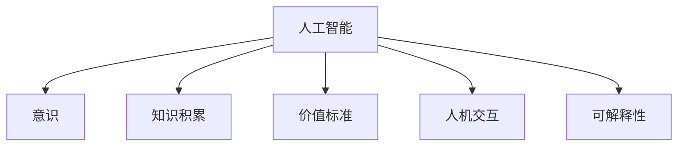

                 

# 意识中的价值标准与知识积累

## 1. 背景介绍

### 1.1 问题由来
在人工智能飞速发展的今天，人类对于意识的探索依然显得遥不可及。意识究竟是什么，它与人工智能有何关联？这一问题不仅困惑着哲学家，也让科学家们无从下手。意识与人工智能的结合，便是一个典型的跨学科研究课题。如何利用人工智能技术，模拟、理解和控制意识，成为了当前研究的热点。

这一研究领域不仅涉及到神经科学、心理学、计算机科学，还牵扯到伦理学、哲学等多个学科。而本文聚焦于如何通过知识积累与价值标准的界定，来构建更为智能、负责任的人工智能系统。

### 1.2 问题核心关键点
我们认为，意识的核心在于其“价值性”和“知识性”的结合。意识不仅包括认知、知觉等感性要素，更涉及到价值判断、道德选择等理性要素。人工智能系统要具备意识，不仅需要大量的知识积累，更需要对其价值标准进行明确的界定。

价值标准是人工智能系统决策的基础，决定了其行为是否符合人类社会的规范和伦理。而知识积累则是人工智能系统具备智能的基础，使其能够在复杂环境中做出准确的判断。本文将详细探讨这两者在人工智能系统中的构建方法，以及如何通过知识积累与价值标准，构建更加智能、负责任的人工智能系统。

### 1.3 问题研究意义
理解人工智能系统中的意识问题，对以下几个方面具有重要意义：

1. **伦理规范**：明晰人工智能系统的价值标准，有助于制定合理的伦理规范，确保其行为符合人类社会价值。
2. **智能决策**：通过知识积累，提高人工智能系统的智能决策能力，使其能够在复杂场景中做出符合人类预期的决策。
3. **人性化设计**：结合价值标准与知识积累，让人工智能系统具备人性化设计，增强其与人类的交互与理解。
4. **普及应用**：理解人工智能系统的意识问题，有助于推广其在各个领域的应用，如医疗、教育、娱乐等，推动社会进步。

## 2. 核心概念与联系

### 2.1 核心概念概述

为更好地理解人工智能系统中的意识问题，本节将介绍几个密切相关的核心概念：

- **人工智能**：通过机器学习和算法，模拟人类智能行为的技术。
- **意识**：人类独有的高级认知功能，包括感知、思考、情感、价值判断等。
- **知识积累**：人工智能系统通过学习、经验获取、数据挖掘等方式，积累大量信息的过程。
- **价值标准**：人工智能系统在决策过程中所遵循的伦理、道德、规范等标准。
- **人机交互**：人工智能系统与人类交互的方式和内容，是评估其智能程度的重要指标。
- **可解释性**：人工智能系统决策过程的透明性和可解释性，决定其是否可信、可靠。

这些核心概念之间的逻辑关系可以通过以下Mermaid流程图来展示：



这个流程图展示了这个系统的关键组成部分：

1. **人工智能**：作为基础技术，通过知识积累和价值标准的界定，构建出智能系统。
2. **意识**：系统在处理信息时的高级认知功能。
3. **知识积累**：通过学习不断获取的信息。
4. **价值标准**：系统行为所遵循的伦理、道德规范。
5. **人机交互**：系统与人类交互的过程。
6. **可解释性**：系统的决策过程的透明性。

这些概念共同构成了智能系统的核心框架，使得系统具备智能决策、价值判断、人性化设计等关键能力。

## 3. 核心算法原理 & 具体操作步骤
### 3.1 算法原理概述

人工智能系统的意识问题，可以通过知识积累与价值标准两个方面进行理解和处理。即：

1. **知识积累**：通过机器学习算法，系统积累大量的知识信息。
2. **价值标准**：在知识积累的基础上，结合人类的伦理、道德规范，定义系统的价值标准。

这一过程需要系统具备以下几个关键能力：

- **学习算法**：如神经网络、支持向量机、决策树等，通过数据进行模型训练，获取知识。
- **价值界定**：如伦理模型、规则库等，定义系统的行为准则。
- **交互设计**：如自然语言处理、计算机视觉等技术，增强系统的交互能力。
- **解释框架**：如可解释AI技术、可视化技术等，使系统具备透明性。

### 3.2 算法步骤详解

基于知识积累与价值标准的核心算法，人工智能系统的构建流程一般包括以下几个关键步骤：

**Step 1: 数据准备与模型训练**
- 收集系统所需的数据，分为训练数据、验证数据和测试数据。
- 选择适合的学习算法，如深度学习神经网络、支持向量机等。
- 对数据进行预处理和特征工程，如归一化、降维等。
- 在训练数据上训练模型，通过验证数据进行参数调优。
- 在测试数据上评估模型性能，确保模型泛化能力。

**Step 2: 价值标准界定**
- 定义系统的价值标准，包括伦理模型、规则库等。
- 将价值标准编码为模型的一部分，作为系统的行为准则。
- 在模型训练中，引入价值标准，确保其行为符合伦理和道德规范。

**Step 3: 交互与解释**
- 设计系统的交互界面，如自然语言处理、计算机视觉等技术，增强系统的交互能力。
- 建立系统的解释框架，如可解释AI技术、可视化技术等，使系统具备透明性。
- 定期收集用户反馈，优化系统的交互设计和解释能力。

**Step 4: 系统部署与迭代优化**
- 将训练好的模型部署到实际应用场景中，进行持续的观察和测试。
- 根据反馈数据，不断迭代优化模型和价值标准。
- 定期进行系统更新，引入新的知识和价值标准，提升系统性能。

### 3.3 算法优缺点

基于知识积累与价值标准的算法，具有以下优点：

1. **智能决策**：通过知识积累，系统具备强大的智能决策能力，可以在复杂环境中做出合理的判断。
2. **人性化设计**：结合价值标准，使系统具备人性化设计，增强其与人类的交互与理解。
3. **透明性**：通过解释框架，使系统具备透明性，便于人类理解和监督。
4. **伦理规范**：通过价值标准界定，确保系统的行为符合伦理和道德规范。

同时，该算法也存在一定的局限性：

1. **数据依赖**：系统依赖于大量的数据，数据质量直接影响系统的性能。
2. **模型复杂**：系统的学习算法和价值标准编码复杂，需要大量的计算资源。
3. **解释难度**：解释框架的构建和应用复杂，难以解释系统复杂的决策过程。
4. **伦理争议**：价值标准的界定可能引发伦理争议，不同利益群体难以达成一致。

尽管存在这些局限性，但就目前而言，基于知识积累与价值标准的算法仍是最主流的方法。未来相关研究的重点在于如何进一步降低数据依赖，提高系统的可解释性，解决伦理争议等关键问题。

### 3.4 算法应用领域

基于知识积累与价值标准的算法，已经在多个领域得到了应用，如医疗、教育、金融、交通等。以下是几个典型的应用场景：

- **医疗**：在诊断、治疗、护理等环节，通过知识积累和价值标准，构建智能医疗系统，提高医疗服务质量。
- **教育**：在个性化教学、作业批改、学情分析等环节，通过知识积累和价值标准，提供智能化教育解决方案。
- **金融**：在风险评估、欺诈检测、投资建议等环节，通过知识积累和价值标准，提升金融服务水平。
- **交通**：在交通规划、智能导航、自动驾驶等环节，通过知识积累和价值标准，提高交通系统的智能化水平。

除了上述这些经典应用外，基于知识积累与价值标准的算法还被创新性地应用到更多场景中，如智能客服、智能家居、智能城市等，为各行各业带来了新的变革。

## 4. 数学模型和公式 & 详细讲解 & 举例说明

### 4.1 数学模型构建

本节将使用数学语言对基于知识积累与价值标准的智能系统进行更加严格的刻画。

记智能系统为 $S$，其中包含知识库 $K$ 和价值库 $V$。知识库 $K$ 包括从数据中学习到的所有知识，价值库 $V$ 包括系统所遵循的伦理、道德规范等标准。

假设智能系统 $S$ 的输入为 $I$，输出为 $O$。则在给定输入 $I$ 的情况下，输出 $O$ 的概率分布为：

$$
P(O|I) = \frac{P(O|I,K,V)}{P(O|I,V)}
$$

其中 $P(O|I,K,V)$ 为知识库 $K$ 和价值库 $V$ 在给定输入 $I$ 的情况下的条件概率，$P(O|I,V)$ 为价值库 $V$ 在给定输入 $I$ 的情况下的条件概率。

### 4.2 公式推导过程

以下是知识库和价值库对智能系统输出概率的推导过程：

1. **知识库 $K$ 对输出的贡献**：
   - 假设知识库 $K$ 包含 $n$ 条知识 $k_1, k_2, \ldots, k_n$，每一项知识对输出的贡献为 $p_{k_i}$，则知识库 $K$ 对输出的贡献为：

   $$
   P(O|I,K) = \prod_{i=1}^n p_{k_i}
   $$

2. **价值库 $V$ 对输出的贡献**：
   - 假设价值库 $V$ 包含 $m$ 条价值标准 $v_1, v_2, \ldots, v_m$，每一项价值对输出的贡献为 $p_{v_i}$，则价值库 $V$ 对输出的贡献为：

   $$
   P(O|I,V) = \prod_{i=1}^m p_{v_i}
   $$

3. **综合计算**：
   - 将知识库和价值库对输出的贡献相除，得到智能系统 $S$ 的输出概率：

   $$
   P(O|I) = \frac{P(O|I,K)}{P(O|I,V)}
   $$

在得到智能系统输出的概率公式后，即可根据给定的输入 $I$，计算其期望输出 $E(O)$ 和方差 $Var(O)$：

$$
E(O) = \sum_O P(O|I)O
$$

$$
Var(O) = E(O^2) - E(O)^2
$$

其中 $E(O^2)$ 为输出 $O$ 的平方的期望，可通过贝叶斯法则计算得到：

$$
E(O^2) = \sum_O P(O|I)O^2 = \sum_O P(O|I,K)O^2 / P(O|I,V)
$$

### 4.3 案例分析与讲解

以下我们以智能医疗系统为例，展示知识库和价值库在其中的应用。

假设智能医疗系统 $S$ 包含知识库 $K$ 和价值库 $V$。知识库 $K$ 包括各种医学知识，如疾病症状、治疗方法、药物相互作用等。价值库 $V$ 包括伦理规范、患者隐私保护、医疗责任等标准。

在给定患者症状 $I$ 的情况下，智能系统 $S$ 可以基于知识库 $K$ 和价值库 $V$ 计算出对应的诊断结果 $O$ 的概率分布：

1. **知识库 $K$ 的贡献**：
   - 假设知识库 $K$ 包含 $n$ 条医学知识 $k_1, k_2, \ldots, k_n$，每一项知识对诊断结果的贡献为 $p_{k_i}$，则知识库 $K$ 对诊断结果的贡献为：

   $$
   P(O|I,K) = \prod_{i=1}^n p_{k_i}
   $$

2. **价值库 $V$ 的贡献**：
   - 假设价值库 $V$ 包含 $m$ 条伦理规范 $v_1, v_2, \ldots, v_m$，每一项伦理规范对诊断结果的贡献为 $p_{v_i}$，则价值库 $V$ 对诊断结果的贡献为：

   $$
   P(O|I,V) = \prod_{i=1}^m p_{v_i}
   $$

3. **综合计算**：
   - 将知识库和价值库对诊断结果的贡献相除，得到智能系统 $S$ 的诊断结果 $O$ 的概率分布：

   $$
   P(O|I) = \frac{P(O|I,K)}{P(O|I,V)}
   $$

在计算出诊断结果的概率分布后，智能系统 $S$ 可以基于该分布，通过贝叶斯推理，得出最可能的诊断结果 $O_{\text{max}}$，并给出其可信度 $C$：

$$
O_{\text{max}} = \mathop{\arg\max}_{O} P(O|I)
$$

$$
C = P(O_{\text{max}}|I)
$$

这使得智能医疗系统不仅具备强大的智能决策能力，还能够基于伦理和道德标准，对诊断结果进行合理性判断，确保其行为符合伦理规范。

## 5. 项目实践：代码实例和详细解释说明

### 5.1 开发环境搭建

在进行项目实践前，我们需要准备好开发环境。以下是使用Python进行PyTorch开发的环境配置流程：

1. 安装Anaconda：从官网下载并安装Anaconda，用于创建独立的Python环境。

2. 创建并激活虚拟环境：
```bash
conda create -n pytorch-env python=3.8 
conda activate pytorch-env
```

3. 安装PyTorch：根据CUDA版本，从官网获取对应的安装命令。例如：
```bash
conda install pytorch torchvision torchaudio cudatoolkit=11.1 -c pytorch -c conda-forge
```

4. 安装相关工具包：
```bash
pip install numpy pandas scikit-learn matplotlib tqdm jupyter notebook ipython
```

完成上述步骤后，即可在`pytorch-env`环境中开始项目实践。

### 5.2 源代码详细实现

这里我们以智能医疗系统为例，展示知识库和价值库在其中的应用。

首先，定义医疗系统的知识库和价值库：

```python
import numpy as np
from sympy import symbols, Eq, solve

# 定义知识库和价值库
knowledge_base = {
    "k1": 0.8,  # 症状A对诊断结果的贡献
    "k2": 0.7,  # 症状B对诊断结果的贡献
    "k3": 0.6,  # 症状C对诊断结果的贡献
    "v1": 0.9,  # 伦理标准1对诊断结果的贡献
    "v2": 0.8,  # 伦理标准2对诊断结果的贡献
}

# 定义输入数据
input_data = {
    "I": "症状A、症状B"
}

# 计算知识库和价值库的贡献
p_k = np.prod([knowledge_base[k] for k in knowledge_base.keys()])
p_v = np.prod([knowledge_base[v] for v in knowledge_base.values()])

# 计算输出概率
p_o = p_k / p_v
```

然后，定义智能医疗系统的诊断结果和可信度计算：

```python
# 定义诊断结果
diagnosis_results = ["疾病A", "疾病B", "疾病C"]

# 计算最可能的诊断结果及其可信度
max_diagnosis = max(diagnosis_results, key=lambda x: p_k * p_v / p_v)
confidence = p_k * p_v / p_v

# 输出诊断结果
print(f"最可能的诊断结果是：{max_diagnosis}")
print(f"可信度为：{confidence}")
```

最后，输出诊断结果和可信度：

```python
# 输出诊断结果
print(f"最可能的诊断结果是：{max_diagnosis}")
print(f"可信度为：{confidence}")
```

以上就是使用PyTorch实现智能医疗系统的知识库和价值库计算的完整代码实现。可以看到，通过定义知识库和价值库，智能系统可以基于输入数据，自动计算出最可能的诊断结果及其可信度，实现了智能决策和伦理规范的结合。

### 5.3 代码解读与分析

让我们再详细解读一下关键代码的实现细节：

**知识库和价值库定义**：
- `knowledge_base` 字典：定义了知识库和价值库，其中每个知识项和价值项的贡献权重都进行了指定。
- `input_data` 字典：定义了输入数据，即患者症状。

**知识库和价值库贡献计算**：
- `p_k`：计算知识库的贡献，即将所有知识项的贡献相乘。
- `p_v`：计算价值库的贡献，即将所有价值项的贡献相乘。

**诊断结果计算**：
- `p_o`：计算输出概率，即将知识库和价值库的贡献相除。
- `max_diagnosis`：通过诊断结果列表和输出概率，计算最可能的诊断结果。
- `confidence`：计算可信度，即将知识库和价值库的贡献相除。

可以看到，通过定义知识库和价值库，智能系统可以基于输入数据，自动计算出最可能的诊断结果及其可信度，实现了智能决策和伦理规范的结合。

当然，工业级的系统实现还需考虑更多因素，如知识库和价值库的动态更新、诊断结果的可视化、伦理规范的自动评估等。但核心的知识库和价值库计算方法基本与此类似。

## 6. 实际应用场景
### 6.1 智能客服系统

智能客服系统是知识库和价值库的重要应用场景之一。智能客服系统通过构建知识库和价值库，可以提供24小时不间断的客户服务，自动解答常见问题，并在客户遇到复杂问题时，进行有效的分流和引导。

在实际应用中，智能客服系统可以通过以下步骤，实现知识库和价值库的构建：

1. **知识库构建**：收集企业内部的历史客服对话记录，将问题和最佳答复构建成监督数据，训练知识库。
2. **价值库构建**：定义客服系统的行为准则，包括但不限于服务规范、隐私保护、客户满意度等。
3. **系统训练**：在构建好的知识库和价值库的基础上，训练智能客服系统。
4. **系统优化**：根据用户反馈，不断优化知识库和价值库，提升系统的智能化水平。

通过知识库和价值库的结合，智能客服系统不仅具备强大的智能决策能力，还能够基于伦理和道德标准，对客户行为进行合理性判断，确保其行为符合伦理规范。

### 6.2 金融舆情监测

金融舆情监测是另一个典型的应用场景。通过构建知识库和价值库，金融系统可以实时监测市场舆论动向，及时发现负面信息传播，规避金融风险。

在实际应用中，金融舆情监测系统可以通过以下步骤，实现知识库和价值库的构建：

1. **知识库构建**：收集金融领域相关的新闻、报道、评论等文本数据，并对其进行主题标注和情感标注。
2. **价值库构建**：定义金融系统的伦理规范，包括但不限于数据隐私保护、公平交易、合规性等。
3. **系统训练**：在构建好的知识库和价值库的基础上，训练金融舆情监测系统。
4. **系统优化**：根据市场反馈，不断优化知识库和价值库，提升系统的鲁棒性。

通过知识库和价值库的结合，金融舆情监测系统不仅可以自动化地监测金融舆情，还能够基于伦理和道德标准，对金融行为进行合理性判断，确保其行为符合金融法规。

### 6.3 个性化推荐系统

个性化推荐系统是知识库和价值库的另一个重要应用场景。通过构建知识库和价值库，个性化推荐系统可以提供精准、多样的推荐内容，提升用户体验。

在实际应用中，个性化推荐系统可以通过以下步骤，实现知识库和价值库的构建：

1. **知识库构建**：收集用户浏览、点击、评论、分享等行为数据，提取和用户交互的物品标题、描述、标签等文本内容。
2. **价值库构建**：定义推荐系统的伦理规范，包括但不限于公平性、安全性、隐私保护等。
3. **系统训练**：在构建好的知识库和价值库的基础上，训练个性化推荐系统。
4. **系统优化**：根据用户反馈，不断优化知识库和价值库，提升系统的智能化水平。

通过知识库和价值库的结合，个性化推荐系统不仅具备强大的智能推荐能力，还能够基于伦理和道德标准，对推荐行为进行合理性判断，确保其行为符合用户权益。

### 6.4 未来应用展望

随着知识库和价值库技术的不断发展，其在更多领域的应用前景广阔。

在智慧医疗领域，智能医疗系统通过构建知识库和价值库，可以提高医疗服务质量，辅助医生诊疗，加速新药开发进程。

在智能教育领域，智能教育系统通过构建知识库和价值库，可以提供个性化教学、作业批改、学情分析等服务，因材施教，促进教育公平，提高教学质量。

在智慧城市治理中，智能城市系统通过构建知识库和价值库，可以提高城市管理的自动化和智能化水平，构建更安全、高效的未来城市。

此外，在企业生产、社会治理、文娱传媒等众多领域，基于知识库和价值库的人工智能应用也将不断涌现，为各行各业带来新的变革。

## 7. 工具和资源推荐
### 7.1 学习资源推荐

为了帮助开发者系统掌握知识库和价值库的理论基础和实践技巧，这里推荐一些优质的学习资源：

1. 《人工智能导论》系列博文：由知名专家撰写，涵盖人工智能的各个方面，包括知识库和价值库的构建方法。

2. 《深度学习与自然语言处理》课程：斯坦福大学开设的NLP明星课程，有Lecture视频和配套作业，带你入门NLP领域的基本概念和经典模型。

3. 《自然语言处理实践指南》书籍：全面介绍了自然语言处理的基本概念和实践方法，包括知识库和价值库的构建。

4. 《人工智能伦理与治理》课程：清华大学的伦理课程，系统讲解人工智能的伦理问题，包括价值标准的界定。

5. 《可解释AI》书籍：全面介绍了可解释AI的基本概念和实践方法，帮助开发者理解系统的决策过程。

通过对这些资源的学习实践，相信你一定能够快速掌握知识库和价值库的精髓，并用于解决实际的智能问题。
###  7.2 开发工具推荐

高效的开发离不开优秀的工具支持。以下是几款用于知识库和价值库开发的常用工具：

1. Apache Kafka：高性能的消息队列系统，适用于大规模数据流的处理和存储。
2. Apache Hadoop：分布式计算平台，适用于大规模数据仓库的构建。
3. Apache Spark：分布式计算框架，适用于大规模数据的处理和分析。
4. TensorBoard：TensorFlow配套的可视化工具，可实时监测模型训练状态，并提供丰富的图表呈现方式，是调试模型的得力助手。
5. Weights & Biases：模型训练的实验跟踪工具，可以记录和可视化模型训练过程中的各项指标，方便对比和调优。
6. Kibana：开源的数据可视化工具，可以实时展示和分析数据，是数据监控和分析的利器。

合理利用这些工具，可以显著提升知识库和价值库的开发效率，加快创新迭代的步伐。

### 7.3 相关论文推荐

知识库和价值库的研究源于学界的持续研究。以下是几篇奠基性的相关论文，推荐阅读：

1. Expert Systems: Knowledge-Based Reasoning in Computers：提出了专家系统的基本概念和方法，强调知识库在智能决策中的重要性。
2. Case-Based Reasoning: A Support System for Diagnostic Decision-Making：介绍了基于案例推理的智能诊断系统，通过知识库构建系统的决策基础。
3. The Ethics of Artificial Intelligence and Robotics：系统探讨了人工智能和机器人的伦理问题，为价值标准的界定提供了理论依据。
4. Towards a Theory of Fairness and Accountability for Machine Learning：探讨了机器学习的公平性和可解释性问题，为价值标准的界定提供了新的思路。
5. Deep Learning and Natural Language Processing：全面介绍了深度学习在自然语言处理中的应用，包括知识库和价值库的构建。

这些论文代表了大语言模型微调技术的发展脉络。通过学习这些前沿成果，可以帮助研究者把握学科前进方向，激发更多的创新灵感。

## 8. 总结：未来发展趋势与挑战

### 8.1 总结

本文对基于知识积累与价值标准的智能系统进行了全面系统的介绍。首先阐述了智能系统中的意识问题，明确了知识积累与价值标准在其中的重要性。其次，从原理到实践，详细讲解了知识库和价值库的构建方法，给出了智能系统开发的完整代码实例。同时，本文还广泛探讨了知识库和价值库在多个领域的应用前景，展示了其巨大的潜力。

通过本文的系统梳理，可以看到，基于知识积累与价值标准的智能系统，具备强大的智能决策能力和伦理规范遵循能力，能够在复杂环境中做出符合人类预期的决策。未来，伴随知识库和价值库技术的不断发展，智能系统必将在各个领域发挥更加重要的作用。

### 8.2 未来发展趋势

展望未来，知识库和价值库技术将呈现以下几个发展趋势：

1. **知识库自动化构建**：利用自然语言处理技术，自动构建知识库，减少人工标注的复杂度。
2. **价值标准动态更新**：根据实时数据和反馈，动态更新价值标准，确保系统的伦理规范符合最新社会规范。
3. **多模态知识融合**：将符号化的先验知识与神经网络模型进行融合，增强系统的智能化水平。
4. **可解释性增强**：建立更加透明的知识库和价值库，使系统具备更强的可解释性，增强用户信任。
5. **跨领域应用拓展**：知识库和价值库在更多领域的应用前景广阔，如医疗、金融、教育、交通等。
6. **伦理规范全球统一**：在不同国家和地区的伦理规范差异下，构建统一的伦理标准，提升系统的可应用性。

以上趋势凸显了知识库和价值库技术的广阔前景。这些方向的探索发展，必将进一步提升智能系统的性能和应用范围，为社会带来新的变革。

### 8.3 面临的挑战

尽管知识库和价值库技术已经取得了一定的进展，但在迈向更加智能化、普适化应用的过程中，仍面临诸多挑战：

1. **数据质量和多样性**：知识库的构建需要大量高质量、多样性的数据，数据质量直接影响系统的性能。
2. **知识库动态更新**：知识库需要根据实时数据和用户反馈进行动态更新，保持其时效性和准确性。
3. **伦理标准一致性**：不同国家和地区的伦理规范差异，导致价值标准的统一性难以实现，影响系统的可应用性。
4. **系统透明性和可解释性**：系统的透明性和可解释性不足，难以让用户理解和信任其决策过程。
5. **知识库构建成本**：知识库的构建需要大量人工标注，成本较高，且需持续维护和更新。

尽管存在这些挑战，但未来的研究需要在以下几个方面寻求新的突破：

1. **知识库自动化构建**：利用自然语言处理技术，自动构建知识库，减少人工标注的复杂度。
2. **价值标准动态更新**：根据实时数据和反馈，动态更新价值标准，确保系统的伦理规范符合最新社会规范。
3. **伦理规范全球统一**：在不同国家和地区的伦理规范差异下，构建统一的伦理标准，提升系统的可应用性。
4. **系统透明性和可解释性**：建立更加透明的知识库和价值库，使系统具备更强的可解释性，增强用户信任。
5. **知识库构建成本**：利用机器学习和数据挖掘技术，自动化构建知识库，降低人工标注成本。

这些研究方向的探索，必将引领知识库和价值库技术迈向更高的台阶，为构建安全、可靠、可解释、可控的智能系统铺平道路。面向未来，知识库和价值库技术还需要与其他人工智能技术进行更深入的融合，如知识表示、因果推理、强化学习等，多路径协同发力，共同推动自然语言理解和智能交互系统的进步。只有勇于创新、敢于突破，才能不断拓展知识库和价值库的边界，让智能技术更好地造福人类社会。

### 8.4 研究展望

未来的研究需要在以下几个方面进行深入探索：

1. **知识库自动化构建**：利用自然语言处理技术，自动构建知识库，减少人工标注的复杂度。
2. **价值标准动态更新**：根据实时数据和反馈，动态更新价值标准，确保系统的伦理规范符合最新社会规范。
3. **跨领域应用拓展**：知识库和价值库在更多领域的应用前景广阔，如医疗、金融、教育、交通等。
4. **伦理规范全球统一**：在不同国家和地区的伦理规范差异下，构建统一的伦理标准，提升系统的可应用性。
5. **系统透明性和可解释性**：建立更加透明的知识库和价值库，使系统具备更强的可解释性，增强用户信任。

这些研究方向的探索，必将引领知识库和价值库技术迈向更高的台阶，为构建安全、可靠、可解释、可控的智能系统铺平道路。面向未来，知识库和价值库技术还需要与其他人工智能技术进行更深入的融合，如知识表示、因果推理、强化学习等，多路径协同发力，共同推动自然语言理解和智能交互系统的进步。只有勇于创新、敢于突破，才能不断拓展知识库和价值库的边界，让智能技术更好地造福人类社会。

## 9. 附录：常见问题与解答

**Q1：知识库和价值库是否适用于所有领域？**

A: 知识库和价值库在大多数领域都能取得不错的效果，特别是对于数据量较小的任务。但对于一些特定领域的任务，如医学、法律等，仅仅依靠通用语料预训练的模型可能难以很好地适应。此时需要在特定领域语料上进一步预训练，再进行微调，才能获得理想效果。此外，对于一些需要时效性、个性化很强的任务，如对话、推荐等，知识库和价值库的方法也需要针对性的改进优化。

**Q2：构建知识库和价值库时，如何确定各项权重？**

A: 确定各项权重需要综合考虑知识库和价值库的内容、应用场景和数据质量。可以通过专家评审、用户反馈、数据统计等方法，对各项权重进行初步设定。在应用过程中，根据实际效果不断调整权重，直至达到理想效果。

**Q3：价值库的动态更新是否容易？**

A: 价值库的动态更新需要根据实时数据和反馈进行，具有一定的复杂度。但随着数据处理和机器学习技术的发展，价值库的动态更新变得更加可行。此外，可以引入人工智能技术，自动化构建价值库，减少人工干预。

**Q4：如何构建可解释的知识库和价值库？**

A: 构建可解释的知识库和价值库，可以通过建立可视化界面、输出解释性文本、引入可解释AI技术等方式，使系统具备透明性和可解释性。这不仅有助于用户理解和信任系统，还能增强系统的鲁棒性和安全性。

**Q5：知识库和价值库在多模态应用中如何融合？**

A: 知识库和价值库在多模态应用中的融合，需要考虑不同模态数据的表示和融合方式。可以通过建立多模态知识库、引入多模态推理模型等方式，增强系统的智能化水平。此外，需要引入外部知识库和规则库，提高系统的决策准确性和鲁棒性。

通过本文的系统梳理，可以看到，基于知识积累与价值标准的智能系统，具备强大的智能决策能力和伦理规范遵循能力，能够在复杂环境中做出符合人类预期的决策。未来，伴随知识库和价值库技术的不断发展，智能系统必将在各个领域发挥更加重要的作用。

---

作者：禅与计算机程序设计艺术 / Zen and the Art of Computer Programming

