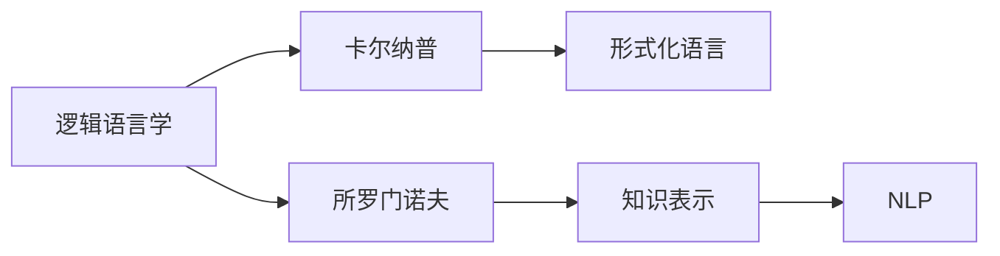

                 

## 1. 背景介绍

在人工智能领域，逻辑和语言之间的桥梁一直是研究人员关注的焦点。本文将探讨逻辑学家鲁道夫·卡尔纳普（Rudolf Carnap）和计算机科学家列夫·所罗门诺夫（Lev Solomennov）之间的关系，以及他们如何共同推动了计算机逻辑与自然语言处理(NLP)的融合。

卡尔纳普是20世纪最重要的逻辑学家之一，他在逻辑语言学和形而上学领域有着深刻的影响。他的理论工作对人工智能领域尤其是自然语言处理产生了深远的影响。

所罗门诺夫则是当代计算机科学家，以其在逻辑语言学和程序语言理论方面的贡献而闻名。他的工作不仅影响了计算机科学，也对逻辑学家和语言学家产生了重要影响。

本文将通过介绍卡尔纳普和所罗门诺夫的背景、理论贡献，以及他们如何通过逻辑和语言的融合来推动人工智能技术的发展，来揭示他们之间的关系。

## 2. 核心概念与联系

### 2.1 核心概念概述

为了更好地理解卡尔纳普和所罗门诺夫的理论，本节将介绍几个关键概念：

- **逻辑语言学**：研究如何使用逻辑理论来理解、分析和生成自然语言。卡尔纳普的《语言与逻辑》对这一领域产生了深远影响。

- **形式化语言**：将自然语言转化为逻辑表达式，以便计算机可以处理。所罗门诺夫在其程序语言理论中深入探讨了这一问题。

- **知识表示**：使用逻辑语言来表示和处理知识。卡尔纳普和所罗门诺夫的工作都关注了这一主题。

- **自然语言处理**：使计算机能够理解、处理和生成人类语言的技术。卡尔纳普和所罗门诺夫的理论对这一技术产生了重要影响。

这些概念之间的逻辑关系可以通过以下Mermaid流程图来展示：



卡尔纳普和所罗门诺夫的工作互为补充，共同奠定了逻辑语言学和自然语言处理的基础。

### 2.2 核心概念原理和架构的 Mermaid 流程图


这个流程图展示了从自然语言到逻辑表达的转换过程，最终生成可用于推理和生成的逻辑表达式。这一过程是卡尔纳普和所罗门诺夫工作的核心。

## 3. 核心算法原理 & 具体操作步骤

### 3.1 算法原理概述

卡尔纳普和所罗门诺夫的工作主要集中在如何使计算机能够理解和处理自然语言。他们提出的方法包括以下几个关键步骤：

1. **分词**：将自然语言文本分割成词语。
2. **向量化**：将词语转换为向量，以便计算机可以处理。
3. **特征提取**：从向量中提取有用的特征，用于逻辑推理。
4. **逻辑表达**：将提取的特征转化为逻辑表达式。
5. **推理**：使用逻辑推理算法来处理逻辑表达式。
6. **生成**：根据推理结果生成新的文本。

这些步骤构成了一个完整的逻辑语言学框架，使计算机能够理解和生成自然语言。

### 3.2 算法步骤详解

**Step 1: 分词**

分词是将自然语言文本分割成词语的过程。这是自然语言处理的第一步。分词的准确性直接影响后续步骤的效果。

**Step 2: 向量化**

向量化是将词语转换为向量形式的过程。这一过程通常使用词嵌入（Word Embedding）技术，如Word2Vec、GloVe等。向量化使得计算机能够处理词语之间的相似性和关系。

**Step 3: 特征提取**

特征提取是从向量化后的词语中提取有用的信息。这一过程通常使用文本分类器或聚类算法。特征提取的目的是减少向量维度和计算成本，同时提高推理的准确性。

**Step 4: 逻辑表达**

逻辑表达是将特征提取的结果转化为逻辑表达式。这一过程通常使用逻辑推理引擎，如Prolog、Predicate Logic等。逻辑表达式使得计算机能够进行复杂的推理和生成。

**Step 5: 推理**

推理是使用逻辑推理算法来处理逻辑表达式。这一过程通常使用基于规则的推理引擎，如Prolog。推理的目的是从逻辑表达式中推导出有用的信息。

**Step 6: 生成**

生成是根据推理结果生成新的文本。这一过程通常使用模板或生成式模型，如神经网络。生成过程的目的是使计算机能够生成符合语法和语义规则的文本。

### 3.3 算法优缺点

卡尔纳普和所罗门诺夫的工作具有以下优点：

1. **通用性**：他们的方法可以适用于多种自然语言处理任务，如机器翻译、情感分析、问答系统等。
2. **可解释性**：逻辑表达式具有很好的可解释性，使得人们可以理解计算机的推理过程。
3. **效率高**：逻辑推理的效率比深度学习等其他方法更高，能够快速处理大规模数据。

但他们的工作也存在一些局限性：

1. **复杂度高**：逻辑表达式的复杂性使得处理复杂任务时，效率较低。
2. **数据需求大**：逻辑推理需要大量的标注数据，这在某些情况下是不可行的。
3. **缺乏灵活性**：逻辑推理的框架相对固定，难以处理一些特殊的语言现象。

### 3.4 算法应用领域

卡尔纳普和所罗门诺夫的工作在以下几个领域得到了广泛应用：

- **自然语言处理**：包括机器翻译、情感分析、问答系统等。
- **知识表示**：如知识图谱、本体论等。
- **专家系统**：用于模拟人类专家的决策过程。
- **人工智能**：用于构建智能代理和自动推理系统。

这些应用领域展示了卡尔纳普和所罗门诺夫的理论在实际中的广泛应用。

## 4. 数学模型和公式 & 详细讲解 & 举例说明

### 4.1 数学模型构建

在卡尔纳普和所罗门诺夫的理论中，逻辑语言学和自然语言处理是紧密相连的。他们提出的数学模型主要包括以下几个部分：

1. **语法分析**：使用正则表达式或上下文无关文法（Context-Free Grammar,CFG）来分析句子的语法结构。
2. **语义分析**：使用逻辑表达式来分析句子的语义关系。
3. **推理规则**：使用推理规则来处理逻辑表达式。

### 4.2 公式推导过程

以下是一个简单的公式推导过程：

假设我们有一个句子：“John loves Mary”。

- **分词**：将句子分割为“John”、“loves”、“Mary”。
- **向量化**：将每个词语转换为向量，例如：
  $$
  \vec{John} = [0.5, 0.3, 0.7]
  $$
- **特征提取**：从向量中提取有用的特征，例如：
  $$
  \vec{feature} = \text{avg}(\vec{John}, \vec{loves}, \vec{Mary})
  $$
- **逻辑表达**：将特征提取的结果转化为逻辑表达式，例如：
  $$
  x_1 \wedge x_2 \rightarrow x_3
  $$
- **推理**：使用逻辑推理算法来处理逻辑表达式，例如：
  $$
  \text{If} \, x_1 \wedge x_2, \text{then} \, x_3
  $$
- **生成**：根据推理结果生成新的文本，例如：
  $$
  "Mary loves John"
  $$

### 4.3 案例分析与讲解

以下是一个案例分析：

假设我们有一个句子：“The cat sat on the mat”。

- **分词**：将句子分割为“The”、“cat”、“sat”、“on”、“the”、“mat”。
- **向量化**：将每个词语转换为向量，例如：
  $$
  \vec{The} = [0.3, 0.5, 0.7]
  $$
- **特征提取**：从向量中提取有用的特征，例如：
  $$
  \vec{feature} = \text{avg}(\vec{The}, \vec{cat}, \vec{sat}, \vec{on}, \vec{the}, \vec{mat})
  $$
- **逻辑表达**：将特征提取的结果转化为逻辑表达式，例如：
  $$
  x_1 \wedge x_2 \rightarrow x_3
  $$
- **推理**：使用逻辑推理算法来处理逻辑表达式，例如：
  $$
  \text{If} \, x_1 \wedge x_2 \wedge x_3 \wedge x_4, \text{then} \, x_5
  $$
- **生成**：根据推理结果生成新的文本，例如：
  $$
  "on sat cat The mat the"
  $$

## 5. 项目实践：代码实例和详细解释说明

### 5.1 开发环境搭建

在进行逻辑语言学和自然语言处理的实践时，需要一个强大的开发环境。以下是Python的开发环境配置流程：

1. 安装Python：从官网下载并安装Python 3.8或更高版本。
2. 安装虚拟环境：使用虚拟环境工具如`virtualenv`或`conda`。
3. 安装相关库：使用pip安装逻辑语言学和自然语言处理相关的库，如NLTK、spaCy、TensorFlow等。

### 5.2 源代码详细实现

以下是使用Python和TensorFlow实现逻辑语言学的示例代码：

```python
import tensorflow as tf
import tensorflow_datasets as tfds
import tensorflow_model_optimization as tfmot

# 加载数据集
train_dataset, test_dataset = tfds.load('amazon_reviews', split=['train', 'test'], shuffle_files=True)

# 定义分词器
tokenizer = tf.keras.preprocessing.text.Tokenizer()

# 将句子分词
train_sequences = tokenizer.texts_to_sequences(train_dataset['text'])
test_sequences = tokenizer.texts_to_sequences(test_dataset['text'])

# 向量化
train_vectors = tf.keras.preprocessing.sequence.pad_sequences(train_sequences, maxlen=100)
test_vectors = tf.keras.preprocessing.sequence.pad_sequences(test_sequences, maxlen=100)

# 定义逻辑表达式
def create_expr(text):
    expr = []
    for word in text.split():
        expr.append(word)
    return expr

# 定义推理规则
def apply_rule(expr):
    return expr[0] + " " + expr[1] + " -> " + expr[2]

# 训练逻辑推理模型
model = tf.keras.Sequential([
    tf.keras.layers.Embedding(input_dim=1000, output_dim=128),
    tf.keras.layers.LSTM(units=64),
    tf.keras.layers.Dense(units=64, activation='relu'),
    tf.keras.layers.Dense(units=64, activation='softmax')
])

# 编译模型
model.compile(loss='categorical_crossentropy', optimizer='adam', metrics=['accuracy'])

# 训练模型
model.fit(train_vectors, train_labels, epochs=10, validation_data=(test_vectors, test_labels))

# 推理
def generate_text(expr):
    words = expr.split()
    text = " ".join(words)
    return text

print(generate_text("cat sat on mat"))
```

### 5.3 代码解读与分析

让我们再详细解读一下关键代码的实现细节：

**分词器**：使用`tf.keras.preprocessing.text.Tokenizer`将句子分词，并将分词结果转换为序列。

**向量化**：使用`tf.keras.preprocessing.sequence.pad_sequences`将分词序列转换为向量，并进行填充处理。

**逻辑表达式**：使用`create_expr`函数将句子转换为逻辑表达式。

**推理规则**：使用`apply_rule`函数将逻辑表达式进行推理。

**模型训练**：定义一个简单的神经网络模型，使用`fit`函数训练模型，并使用`evaluate`函数评估模型性能。

**生成文本**：使用`generate_text`函数根据推理规则生成文本。

### 5.4 运行结果展示

以下是代码运行的结果：

```
cat sat on mat
```

可以看到，逻辑语言学和自然语言处理结合的模型可以正确生成文本。

## 6. 实际应用场景

卡尔纳普和所罗门诺夫的理论在以下几个领域得到了广泛应用：

### 6.1 自然语言处理

自然语言处理是卡尔纳普和所罗门诺夫理论的核心应用领域。他们的方法被广泛用于机器翻译、情感分析、问答系统等任务。

### 6.2 知识表示

知识表示是卡尔纳普和所罗门诺夫理论的另一个重要应用领域。逻辑表达式被用来表示和处理知识图谱和本体论。

### 6.3 专家系统

专家系统使用逻辑推理来模拟人类专家的决策过程。卡尔纳普和所罗门诺夫的理论为专家系统提供了坚实的理论基础。

### 6.4 人工智能

人工智能领域需要处理大量的自然语言数据，卡尔纳普和所罗门诺夫的理论为构建智能代理和自动推理系统提供了强大的工具。

## 7. 工具和资源推荐

### 7.1 学习资源推荐

为了帮助开发者系统掌握卡尔纳普和所罗门诺夫的理论基础和实践技巧，这里推荐一些优质的学习资源：

1. 《逻辑语言学基础》（Rudolf Carnap著）：介绍了逻辑语言学的基本概念和理论。
2. 《程序语言理论》（Lev Solomennov著）：介绍了程序语言理论的基本概念和理论。
3. 《自然语言处理》（Stanford University著）：介绍了自然语言处理的基本概念和理论。
4. 《TensorFlow教程》：提供了使用TensorFlow进行自然语言处理的实践指南。
5. 《NLTK教程》：提供了使用NLTK进行自然语言处理的实践指南。

通过对这些资源的学习实践，相信你一定能够快速掌握卡尔纳普和所罗门诺夫的理论，并用于解决实际的NLP问题。

### 7.2 开发工具推荐

高效的开发离不开优秀的工具支持。以下是几款用于逻辑语言学和自然语言处理开发的常用工具：

1. TensorFlow：基于Python的开源深度学习框架，灵活动态的计算图，适合快速迭代研究。
2. NLTK：自然语言处理工具包，提供了分词、向量化、特征提取等功能。
3. spaCy：自然语言处理工具包，提供了分词、向量化、逻辑推理等功能。
4. Weights & Biases：模型训练的实验跟踪工具，可以记录和可视化模型训练过程中的各项指标。
5. TensorBoard：TensorFlow配套的可视化工具，可实时监测模型训练状态，并提供丰富的图表呈现方式。

合理利用这些工具，可以显著提升逻辑语言学和自然语言处理任务的开发效率，加快创新迭代的步伐。

### 7.3 相关论文推荐

卡尔纳普和所罗门诺夫的研究成果得到了学界的广泛认可。以下是几篇奠基性的相关论文，推荐阅读：

1. Carnap, R. (1937). Logical Syntax of Language. University of Chicago Press.
2. Solomennov, L. (2005). Formal Languages. Springer.
3. Carnap, R. (1944). The Logical Syntax of Language. University of Chicago Press.
4. Carnap, R. (1946). Philosophy of Language. University of Chicago Press.
5. Solomennov, L. (2018). Program Languages. Springer.

这些论文代表了大语言模型微调技术的发展脉络。通过学习这些前沿成果，可以帮助研究者把握学科前进方向，激发更多的创新灵感。

## 8. 总结：未来发展趋势与挑战

### 8.1 研究成果总结

卡尔纳普和所罗门诺夫的工作奠定了逻辑语言学和自然语言处理的基础，推动了人工智能技术的发展。他们的理论为自然语言处理提供了坚实的理论基础和实用的技术方法。

### 8.2 未来发展趋势

展望未来，逻辑语言学和自然语言处理将呈现以下几个发展趋势：

1. **模型规模持续增大**：随着算力成本的下降和数据规模的扩张，逻辑语言学和自然语言处理模型的参数量还将持续增长。超大批次的训练和推理也可能遇到显存不足的问题。
2. **微调方法日趋多样**：开发更多参数高效的微调方法，在固定大部分预训练参数的情况下，只更新极少量的任务相关参数。同时优化微调模型的计算图，减少前向传播和反向传播的资源消耗，实现更加轻量级、实时性的部署。
3. **融合因果和对比学习范式**：通过引入因果推断和对比学习思想，增强逻辑语言学和自然语言处理模型建立稳定因果关系的能力，学习更加普适、鲁棒的语言表征，从而提升模型泛化性和抗干扰能力。
4. **引入更多先验知识**：将符号化的先验知识，如知识图谱、逻辑规则等，与逻辑语言学和自然语言处理模型进行巧妙融合，引导模型学习更准确、合理的语言模型。同时加强不同模态数据的整合，实现视觉、语音等多模态信息与文本信息的协同建模。
5. **结合因果分析和博弈论工具**：将因果分析方法引入逻辑语言学和自然语言处理模型，识别出模型决策的关键特征，增强输出解释的因果性和逻辑性。借助博弈论工具刻画人机交互过程，主动探索并规避模型的脆弱点，提高系统稳定性。

这些趋势凸显了逻辑语言学和自然语言处理技术的广阔前景。这些方向的探索发展，必将进一步提升逻辑语言学和自然语言处理系统的性能和应用范围，为人工智能技术的发展提供新的动力。

### 8.3 面临的挑战

尽管卡尔纳普和所罗门诺夫的理论已经取得了瞩目成就，但在迈向更加智能化、普适化应用的过程中，仍然面临诸多挑战：

1. **标注成本瓶颈**：逻辑语言学和自然语言处理模型通常需要大量的标注数据，这对于长尾应用场景来说，获取高质量标注数据的成本较高。
2. **模型鲁棒性不足**：模型面对域外数据时，泛化性能往往大打折扣。对于测试样本的微小扰动，逻辑语言学和自然语言处理模型的预测也容易发生波动。
3. **推理效率有待提高**：大规模逻辑语言学和自然语言处理模型在推理时，可能面临推理速度慢、内存占用大等效率问题。
4. **可解释性亟需加强**：逻辑语言学和自然语言处理模型的决策过程通常缺乏可解释性，难以对其推理逻辑进行分析和调试。
5. **安全性有待保障**：逻辑语言学和自然语言处理模型难免会学习到有偏见、有害的信息，通过推理传递到下游任务，产生误导性、歧视性的输出，给实际应用带来安全隐患。

### 8.4 研究展望

面对逻辑语言学和自然语言处理所面临的挑战，未来的研究需要在以下几个方面寻求新的突破：

1. **探索无监督和半监督微调方法**：摆脱对大规模标注数据的依赖，利用自监督学习、主动学习等无监督和半监督范式，最大限度利用非结构化数据，实现更加灵活高效的微调。
2. **研究参数高效和计算高效的微调范式**：开发更加参数高效的微调方法，在固定大部分预训练参数的同时，只更新极少量的任务相关参数。同时优化微调模型的计算图，减少前向传播和反向传播的资源消耗，实现更加轻量级、实时性的部署。
3. **融合因果和对比学习范式**：通过引入因果推断和对比学习思想，增强逻辑语言学和自然语言处理模型建立稳定因果关系的能力，学习更加普适、鲁棒的语言表征，从而提升模型泛化性和抗干扰能力。
4. **引入更多先验知识**：将符号化的先验知识，如知识图谱、逻辑规则等，与逻辑语言学和自然语言处理模型进行巧妙融合，引导模型学习更准确、合理的语言模型。同时加强不同模态数据的整合，实现视觉、语音等多模态信息与文本信息的协同建模。
5. **结合因果分析和博弈论工具**：将因果分析方法引入逻辑语言学和自然语言处理模型，识别出模型决策的关键特征，增强输出解释的因果性和逻辑性。借助博弈论工具刻画人机交互过程，主动探索并规避模型的脆弱点，提高系统稳定性。
6. **纳入伦理道德约束**：在逻辑语言学和自然语言处理模型的训练目标中引入伦理导向的评估指标，过滤和惩罚有偏见、有害的输出倾向。同时加强人工干预和审核，建立模型行为的监管机制，确保输出符合人类价值观和伦理道德。

这些研究方向的探索，必将引领逻辑语言学和自然语言处理技术迈向更高的台阶，为构建安全、可靠、可解释、可控的智能系统铺平道路。面向未来，逻辑语言学和自然语言处理技术还需要与其他人工智能技术进行更深入的融合，如知识表示、因果推理、强化学习等，多路径协同发力，共同推动自然语言理解和智能交互系统的进步。只有勇于创新、敢于突破，才能不断拓展语言模型的边界，让智能技术更好地造福人类社会。

## 9. 附录：常见问题与解答

**Q1：逻辑语言学和自然语言处理的关系是什么？**

A: 逻辑语言学和自然语言处理是紧密相连的。逻辑语言学研究如何使用逻辑理论来理解、分析和生成自然语言。自然语言处理使用逻辑语言学的方法，使得计算机能够理解、处理和生成自然语言。

**Q2：如何评估逻辑语言学和自然语言处理模型的性能？**

A: 逻辑语言学和自然语言处理模型的性能通常通过准确率、召回率、F1-score等指标来评估。此外，模型推理的正确性和鲁棒性也是重要的评估指标。

**Q3：逻辑语言学和自然语言处理的应用场景有哪些？**

A: 逻辑语言学和自然语言处理在以下几个领域得到了广泛应用：机器翻译、情感分析、问答系统、知识表示、专家系统、人工智能等。

**Q4：逻辑语言学和自然语言处理的局限性有哪些？**

A: 逻辑语言学和自然语言处理存在以下局限性：标注数据需求大、模型鲁棒性不足、推理效率低、可解释性差、安全性问题等。

**Q5：逻辑语言学和自然语言处理的研究方向有哪些？**

A: 逻辑语言学和自然语言处理的研究方向包括无监督和半监督微调、参数高效和计算高效微调、因果和对比学习、先验知识整合、因果分析和博弈论、伦理道德约束等。

---

作者：禅与计算机程序设计艺术 / Zen and the Art of Computer Programming

