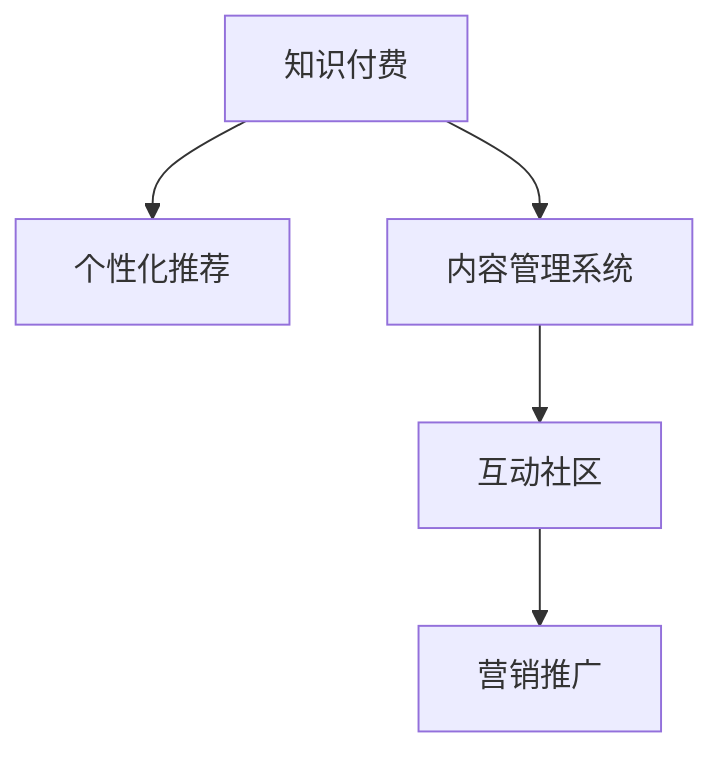

                 

## 1. 背景介绍

### 1.1 问题由来

随着信息爆炸和知识壁垒的降低，知识付费成为新时期的一种重要消费模式。用户对于优质、高效、个性化的知识内容需求日益增长，而知识付费平台如何在海量信息中精准定位、高效产出，同时提升用户体验，成为当前亟待解决的难题。

当前知识付费行业正处于蓬勃发展期，各大平台通过内容订阅、课程定制、线上直播等多种形式，不断满足用户多样化需求。然而，如何设计一个爆款知识付费产品，成为平台在激烈竞争中脱颖而出的关键。这不仅仅是一个产品设计问题，更是一个系统性、全方位的综合工程，需要在内容策略、技术架构、用户体验等多个维度进行精心设计。

### 1.2 问题核心关键点

打造爆款知识付费产品，需要从用户需求出发，通过精准定位、内容创新、技术赋能、营销推广等多方面进行综合优化。具体来说，核心关键点包括：

1. **精准定位用户需求**：理解用户真正的知识痛点和兴趣点，提供有价值的内容。
2. **个性化内容定制**：根据用户行为数据，推荐个性化内容，提升用户体验。
3. **高效内容生成**：利用技术手段提高内容生产效率，缩短内容生产周期。
4. **高质量内容产出**：确保内容质量高、信息密度大，满足用户学习需求。
5. **互动社区构建**：建立用户与内容创作者之间的互动社区，形成内容生态。
6. **多渠道推广运营**：通过多元化的推广手段，提升产品曝光度和用户参与度。

## 2. 核心概念与联系

### 2.1 核心概念概述

为了更好地理解如何打造爆款知识付费产品，本节将介绍几个密切相关的核心概念：

- **知识付费**：用户为获取有价值的知识内容而付费的一种消费模式。知识付费平台通过提供高质量、高价值的内容，满足用户对知识、技能提升的需求。
- **个性化推荐**：通过用户行为数据，推荐与用户兴趣相匹配的内容，提升用户体验和满意度。
- **内容管理系统(CMS)**：用于高效管理和生成知识内容的技术平台，支持内容的发布、编辑、审核、分发等全流程操作。
- **互动社区**：用户与内容创作者之间的交流平台，通过评论、问答、直播等多种形式，促进知识分享和互动。
- **营销推广**：通过多种渠道和手段，提升产品曝光度和用户参与度的过程，包括SEO、社交媒体、广告投放等。

这些核心概念之间的逻辑关系可以通过以下Mermaid流程图来展示：



这个流程图展示了知识付费产品的核心组件和它们之间的关系：

1. 知识付费是整个产品的目标和核心功能，个性化推荐和内容管理系统都是为实现这一目标服务的。
2. 互动社区和营销推广则是知识付费产品的辅助功能，它们能够进一步提升用户粘性和产品曝光度。

## 3. 核心算法原理 & 具体操作步骤

### 3.1 算法原理概述

打造爆款知识付费产品的核心在于通过技术手段提升内容质量和用户体验，实现个性化推荐和高效内容生成。以下是几个核心算法的原理概述：

- **个性化推荐算法**：通过用户行为数据（如浏览、点击、搜索、学习时长等），构建用户兴趣模型，从而推荐与用户兴趣相匹配的内容。
- **内容管理系统(CMS)算法**：设计高效的内容生成和发布流程，支持快速迭代和多样化内容形式的生成。
- **互动社区算法**：建立用户与内容创作者之间的互动模型，通过评论、问答、直播等方式促进内容共享和互动。
- **营销推广算法**：通过SEO、社交媒体、广告投放等手段，提升产品曝光度和用户参与度。

这些算法构成了知识付费产品的技术支撑，帮助产品在不同阶段实现特定的功能目标。

### 3.2 算法步骤详解

**个性化推荐算法步骤**：

1. **用户画像构建**：收集用户行为数据，构建用户兴趣模型，包括用户的浏览历史、偏好类别、行为时间等。
2. **内容特征提取**：提取内容特征，如关键词、主题、结构等，构建内容特征向量。
3. **相似度计算**：利用余弦相似度、Jaccard相似度等方法，计算用户与内容之间的相似度。
4. **推荐结果排序**：基于相似度排序，选择与用户兴趣最匹配的内容，推荐给用户。

**内容管理系统(CMS)算法步骤**：

1. **内容类型设计**：根据不同内容类型设计相应的内容生成和发布流程，如文章、视频、音频、直播等。
2. **内容生成工具**：提供高效的内容生成工具，如Markdown编辑器、视频剪辑工具、音频录制工具等。
3. **版本控制与发布**：实现内容的版本控制与发布流程，支持内容的预览、审核、发布等。
4. **多渠道分发**：提供内容分发渠道，如自有平台、第三方平台、社交媒体等，支持内容的跨平台分发。

**互动社区算法步骤**：

1. **社区模型构建**：构建用户与内容创作者之间的互动模型，记录用户的评论、点赞、关注、问答等行为。
2. **互动关系分析**：分析用户与内容创作者之间的互动关系，识别关键用户和创作者。
3. **互动行为引导**：通过激励机制、推荐算法等方式，引导用户进行互动行为，如评论、点赞、分享等。
4. **互动内容展示**：展示社区中的互动内容，如精选评论、问答、直播等，提升用户参与度。

**营销推广算法步骤**：

1. **渠道选择与优化**：选择适合的营销渠道，如SEO、社交媒体、广告投放等，进行多渠道推广。
2. **数据监测与分析**：监测推广效果，分析数据，优化推广策略。
3. **用户增长策略**：设计用户增长策略，如邀请好友、裂变营销等，提升用户数量和参与度。

### 3.3 算法优缺点

**个性化推荐算法**：

- **优点**：提升用户体验和满意度，增加用户粘性，提高转化率。
- **缺点**：依赖用户行为数据，可能存在数据隐私问题；过度个性化可能导致信息茧房。

**内容管理系统(CMS)算法**：

- **优点**：支持快速迭代和多样化内容形式的生成，提高内容生产效率。
- **缺点**：内容管理系统复杂度较高，开发和维护成本较高。

**互动社区算法**：

- **优点**：促进内容共享和互动，提升用户参与度和满意度。
- **缺点**：社区管理难度较大，需要持续维护和优化。

**营销推广算法**：

- **优点**：提升产品曝光度和用户参与度，增加用户数量。
- **缺点**：推广成本较高，需要持续优化推广策略。

### 3.4 算法应用领域

个性化推荐、内容管理系统、互动社区、营销推广等算法广泛应用于多个领域，如电商平台、社交媒体、在线教育等，帮助这些平台提升用户体验、提高内容生产效率、增加用户参与度和满意度。

## 4. 数学模型和公式 & 详细讲解 & 举例说明

### 4.1 数学模型构建

本节将使用数学语言对打造爆款知识付费产品的核心算法进行更加严格的刻画。

**个性化推荐算法**：

设用户兴趣模型为 $U$，内容特征模型为 $C$，用户与内容之间的相似度为 $S_{uc}$。则推荐算法可以表示为：

$$
R = \mathop{\arg\max}_{(c)} S_{uc}
$$

其中，$R$ 为推荐结果，$S_{uc}$ 为相似度计算函数。

**内容管理系统(CMS)算法**：

设内容 $X$ 与用户 $U$ 之间的关系为 $P(X|U)$，则内容管理系统算法可以表示为：

$$
X_{output} = \mathop{\arg\max}_{(x)} P(X|U)
$$

其中，$X_{output}$ 为推荐内容。

**互动社区算法**：

设用户 $U$ 与内容创作者 $A$ 之间的关系为 $I(U|A)$，则互动社区算法可以表示为：

$$
I_{output} = \mathop{\arg\max}_{(i)} I(U|A)
$$

其中，$I_{output}$ 为用户与创作者之间的互动关系。

**营销推广算法**：

设推广渠道 $C$ 与用户 $U$ 之间的关系为 $M(C|U)$，则营销推广算法可以表示为：

$$
C_{output} = \mathop{\arg\max}_{(c)} M(C|U)
$$

其中，$C_{output}$ 为推荐的推广渠道。

### 4.2 公式推导过程

以下我们以个性化推荐算法为例，推导推荐函数 $S_{uc}$ 的计算公式。

设用户兴趣模型 $U$ 由多个特征 $u_1, u_2, ..., u_n$ 组成，内容特征模型 $C$ 由多个特征 $c_1, c_2, ..., c_m$ 组成。则用户与内容之间的相似度 $S_{uc}$ 可以表示为：

$$
S_{uc} = \frac{u_1 \cdot c_1 + u_2 \cdot c_2 + ... + u_n \cdot c_n}{\sqrt{(\sum_{i=1}^n u_i^2) \cdot (\sum_{j=1}^m c_j^2)}}
$$

其中，$\cdot$ 表示向量的点积操作。

将上述公式应用于推荐算法，可以表示为：

$$
R = \mathop{\arg\max}_{(c)} \frac{u_1 \cdot c_1 + u_2 \cdot c_2 + ... + u_n \cdot c_n}{\sqrt{(\sum_{i=1}^n u_i^2) \cdot (\sum_{j=1}^m c_j^2)}}
$$

在实际应用中，$u$ 和 $c$ 可以根据不同的特征提取方法（如TF-IDF、词嵌入等）进行构建和计算。

### 4.3 案例分析与讲解

**案例：知识付费平台的个性化推荐**

某知识付费平台收集了用户的历史浏览、点击、学习时长等行为数据，构建了用户兴趣模型 $U$。同时，平台的内容库包含大量课程、文章、视频等，提取了关键词、主题、结构等特征，构建了内容特征模型 $C$。

平台使用余弦相似度作为相似度计算函数 $S_{uc}$，对每个内容 $c$ 和用户 $u$ 计算相似度得分，最终选择得分最高的 $k$ 个内容作为推荐结果。

平台根据推荐结果，将相关内容推送给用户，提升用户满意度和粘性。同时，平台还定期收集用户反馈数据，优化推荐算法，确保推荐的准确性和相关性。

## 5. 项目实践：代码实例和详细解释说明

### 5.1 开发环境搭建

在进行知识付费产品的开发前，我们需要准备好开发环境。以下是使用Python进行Flask开发的环境配置流程：

1. 安装Anaconda：从官网下载并安装Anaconda，用于创建独立的Python环境。

2. 创建并激活虚拟环境：
```bash
conda create -n flask-env python=3.8 
conda activate flask-env
```

3. 安装Flask：
```bash
pip install flask
```

4. 安装相关扩展库：
```bash
pip install flask-restful flask-sqlalchemy flask-wtf flask-migrate psycopg2-binary
```

5. 安装数据库：
```bash
brew install postgresql
```

6. 安装开发工具：
```bash
pip install pre-commit
```

完成上述步骤后，即可在`flask-env`环境中开始知识付费产品的开发。

### 5.2 源代码详细实现

下面以构建知识付费平台的个性化推荐系统为例，给出Flask框架下的代码实现。

首先，定义推荐系统相关的数据模型：

```python
from flask_sqlalchemy import SQLAlchemy

db = SQLAlchemy()

class User(db.Model):
    id = db.Column(db.Integer, primary_key=True)
    name = db.Column(db.String(100), nullable=False)
    profile = db.Column(db.String(500), nullable=False)
    interests = db.Column(db.String(500), nullable=False)

class Content(db.Model):
    id = db.Column(db.Integer, primary_key=True)
    title = db.Column(db.String(200), nullable=False)
    description = db.Column(db.String(1000), nullable=False)
    keywords = db.Column(db.String(500), nullable=False)
    tags = db.Column(db.String(500), nullable=False)
    author_id = db.Column(db.Integer, db.ForeignKey('user.id'), nullable=False)
    views = db.Column(db.Integer, nullable=False)
    votes = db.Column(db.Integer, nullable=False)

class Vote(db.Model):
    id = db.Column(db.Integer, primary_key=True)
    user_id = db.Column(db.Integer, db.ForeignKey('user.id'), nullable=False)
    content_id = db.Column(db.Integer, db.ForeignKey('content.id'), nullable=False)
    vote = db.Column(db.Integer, nullable=False)
```

然后，定义推荐系统相关的API接口：

```python
from flask import Flask, request
from flask_restful import Resource, Api

app = Flask(__name__)
api = Api(app)

class Recommendation(Resource):
    def get(self):
        user_id = request.args.get('user_id')
        content_ids = User.query.get(user_id).interests.split(',')
        recommendations = Content.query.filter(Content.id.in_(content_ids)).order_by(Content.views.desc()).all()
        return {'recommendations': [content.title for content in recommendations]}

api.add_resource(Recommendation, '/recommendation')
```

最后，启动Flask应用并测试API：

```python
if __name__ == '__main__':
    app.run(debug=True)
```

运行Flask应用，访问`/recommendation?user_id=1`，即可获取用户ID为1的个性化推荐内容。

### 5.3 代码解读与分析

让我们再详细解读一下关键代码的实现细节：

**User和Content模型**：
- `User`模型表示用户，包含用户ID、姓名、简介、兴趣等属性。
- `Content`模型表示内容，包含内容ID、标题、描述、关键词、标签、作者ID、浏览量、点赞数等属性。

**Recommendation类**：
- `get`方法：从URL参数中获取用户ID，从数据库中获取该用户的兴趣内容ID列表，从数据库中查询与这些内容ID对应的内容，并按浏览量降序排列。
- `return`方法：将推荐内容列表转换为JSON格式，返回给前端。

**Flask应用启动**：
- `app.run(debug=True)`：启动Flask应用，设置调试模式为True，方便调试。

可以看到，Flask框架下构建的个性化推荐系统，代码结构简洁清晰，易于理解和维护。通过Flask的RESTful风格API设计，可以方便地与前端进行数据交互。

## 6. 实际应用场景

### 6.1 智能在线教育

知识付费平台的个性化推荐系统在智能在线教育中具有重要应用价值。在线教育平台可以通过个性化推荐，帮助学生找到适合自己的课程，提升学习效果。

具体而言，平台可以收集学生的学习记录、评分数据、互动行为等，构建学生兴趣模型。同时，平台提供大量优质的在线课程资源，根据学生兴趣推荐相关课程。通过个性化推荐，学生可以更加高效地学习，平台也可以提升课程订阅率和用户满意度。

### 6.2 远程办公工具

知识付费平台的个性化推荐系统同样适用于远程办公工具。远程办公平台通过个性化推荐，帮助用户找到适合的工作和学习资源，提升工作效率和生产力。

平台可以收集用户的搜索历史、点击行为、反馈数据等，构建用户兴趣模型。同时，平台提供各种工具、课程、文档等资源，根据用户兴趣推荐相关内容。通过个性化推荐，用户可以快速找到所需资源，提升远程办公效率。

### 6.3 企业培训平台

知识付费平台的个性化推荐系统在企业培训平台中也有广泛应用。企业通过个性化推荐，帮助员工找到适合自己职业发展的培训课程，提升员工技能水平，推动企业发展。

平台可以收集员工的学习记录、考核数据、反馈数据等，构建员工兴趣模型。同时，平台提供大量的培训课程资源，根据员工兴趣推荐相关课程。通过个性化推荐，员工可以更加高效地学习，企业也可以提升培训效果和员工满意度。

## 7. 工具和资源推荐

### 7.1 学习资源推荐

为了帮助开发者系统掌握知识付费产品的开发技巧，这里推荐一些优质的学习资源：

1. **《Flask Web开发实战》**：详细介绍Flask框架的开发技巧，涵盖API设计、数据库操作、用户管理等多个方面。
2. **《Python Web开发实战》**：全面介绍Python Web开发的技术栈和开发方法，包括Flask、Django、Tornado等框架。
3. **《Web开发实战教程》**：提供多平台、多语言、多框架的Web开发教程，帮助开发者全面掌握Web开发技能。
4. **《知识付费平台技术架构》**：详细讲解知识付费平台的技术架构和开发流程，涵盖前端、后端、数据库等多个方面。
5. **《知识付费平台最佳实践》**：介绍知识付费平台的最佳实践，涵盖用户管理、内容推荐、互动社区等多个方面。

通过对这些资源的学习实践，相信你一定能够快速掌握知识付费产品的开发技巧，并用于解决实际的业务问题。

### 7.2 开发工具推荐

高效的开发离不开优秀的工具支持。以下是几款用于知识付费产品开发的常用工具：

1. **Flask**：基于Python的开源Web框架，轻量级、灵活性高，适合快速迭代研究。
2. **SQLAlchemy**：Python的ORM框架，支持多种关系型数据库，方便进行数据库操作。
3. **Gunicorn**：基于Python的Web服务器，支持多线程、多进程、热重载等特性。
4. **Redis**：高性能的内存数据库，支持缓存、消息队列等特性，适合分布式应用。
5. **Flask-RESTful**：基于Flask的RESTful API框架，方便构建RESTful风格的API。

合理利用这些工具，可以显著提升知识付费产品的开发效率，加快创新迭代的步伐。

### 7.3 相关论文推荐

知识付费产品的开发源于学界的持续研究。以下是几篇奠基性的相关论文，推荐阅读：

1. **《个性化推荐系统综述》**：综述了个性化推荐系统的理论和技术，涵盖了协同过滤、基于内容的推荐、混合推荐等方法。
2. **《内容管理系统架构设计》**：介绍了内容管理系统的架构设计和关键技术，涵盖内容生成、发布、审核、分发等流程。
3. **《互动社区的算法设计》**：详细讲解了互动社区的算法设计和关键技术，涵盖用户行为分析、互动关系引导、内容展示等流程。
4. **《营销推广的策略优化》**：介绍了营销推广的策略优化方法和关键技术，涵盖SEO、社交媒体、广告投放等手段。

这些论文代表了大语言模型微调技术的发展脉络。通过学习这些前沿成果，可以帮助研究者把握学科前进方向，激发更多的创新灵感。

## 8. 总结：未来发展趋势与挑战

### 8.1 总结

本文对打造爆款知识付费产品的核心算法进行了全面系统的介绍。首先阐述了知识付费产品的背景和核心关键点，明确了个性化推荐、内容管理系统、互动社区、营销推广等技术的重要性。其次，从原理到实践，详细讲解了这些核心算法的数学模型和具体实现。同时，本文还广泛探讨了知识付费产品在多个行业领域的应用前景，展示了技术创新和业务应用的巨大潜力。

通过本文的系统梳理，可以看到，知识付费产品的开发需要在用户需求、技术架构、用户体验等多个维度进行综合优化，才能得到用户的认可和市场的成功。未来的知识付费平台，将不仅仅是提供内容的工具，更是一个集知识、技能、社交于一体的综合性平台。

### 8.2 未来发展趋势

展望未来，知识付费产品的开发将呈现以下几个发展趋势：

1. **AI驱动的内容生成**：利用AI技术进行内容自动生成，缩短内容生产周期，提升内容生成效率。
2. **多模态内容融合**：结合文本、图像、视频、音频等多种内容形式，丰富知识表达方式，提升用户体验。
3. **知识图谱的应用**：利用知识图谱技术，提供知识关联和推荐，提升内容推荐效果。
4. **社交网络与知识融合**：将社交网络与知识推荐结合，提升用户互动和知识分享。
5. **个性化推荐优化**：引入因果推断、强化学习等技术，提升个性化推荐算法的效果和鲁棒性。
6. **智能客服与互动社区**：利用智能客服和互动社区技术，提升用户满意度，增加用户粘性。

以上趋势凸显了知识付费产品的广阔前景。这些方向的探索发展，必将进一步提升产品的用户体验和内容质量，为知识付费行业的持续发展提供强大动力。

### 8.3 面临的挑战

尽管知识付费产品取得了不少成功，但在迈向更加智能化、普适化应用的过程中，仍面临诸多挑战：

1. **用户数据隐私**：用户数据的收集和使用需要严格遵守隐私法规，确保用户数据安全。
2. **内容质量控制**：需要建立严格的内容审核机制，确保内容质量高、信息密度大。
3. **用户行为引导**：需要设计有效的激励机制，引导用户进行互动行为，提升用户参与度。
4. **推广成本控制**：推广成本较高，需要优化推广策略，提升投资回报率。
5. **用户体验优化**：需要持续优化产品界面和用户体验，提升用户满意度。
6. **技术架构优化**：需要优化技术架构，提高系统的稳定性和扩展性。

这些挑战需要通过技术创新和业务优化来解决，只有不断迭代和优化产品，才能实现知识付费产品的持续发展和用户增长。

### 8.4 研究展望

面对知识付费产品面临的诸多挑战，未来的研究需要在以下几个方面寻求新的突破：

1. **AI驱动的内容生成**：开发更加智能化的内容生成技术，如自然语言生成、图像生成、视频生成等，提升内容生成效率和质量。
2. **多模态内容的融合**：利用多模态技术，结合文本、图像、视频、音频等多种内容形式，提升用户的多感官体验。
3. **知识图谱的应用**：将知识图谱技术引入推荐算法，提升内容推荐效果和用户满意度。
4. **社交网络与知识融合**：利用社交网络技术，建立知识分享和互动社区，提升用户互动和知识共享。
5. **个性化推荐优化**：引入因果推断、强化学习等技术，提升个性化推荐算法的效果和鲁棒性。
6. **智能客服与互动社区**：利用智能客服和互动社区技术，提升用户满意度和互动体验。

这些研究方向的探索，必将引领知识付费产品的创新发展，为知识付费行业带来新的突破和机遇。面向未来，知识付费产品需要综合利用多种技术手段，提升产品功能和服务质量，推动知识付费行业的持续进步和用户增长。

## 9. 附录：常见问题与解答

**Q1：知识付费产品如何收集用户行为数据？**

A: 知识付费产品可以通过前端页面和后端API获取用户行为数据。具体来说，可以通过用户在平台上的浏览、点击、搜索、学习时长等行为，收集用户的行为数据，用于构建用户兴趣模型。

**Q2：如何优化个性化推荐算法？**

A: 个性化推荐算法的优化可以从以下几个方面入手：
1. **数据质量提升**：收集更多高质量的用户行为数据，提升模型的准确性和鲁棒性。
2. **模型优化**：使用先进的推荐算法，如基于深度学习的协同过滤、矩阵分解等方法，提升推荐效果。
3. **实时推荐**：通过实时数据分析，动态调整推荐策略，提升推荐效果。
4. **多维推荐**：结合用户画像、内容特征、时间因素等多个维度，进行多维度推荐。
5. **用户反馈收集**：通过用户反馈数据，不断优化推荐算法，提升推荐效果。

**Q3：如何选择适合的营销渠道？**

A: 选择合适的营销渠道需要综合考虑多个因素，如用户画像、推广预算、平台特点等。具体来说，可以从以下几方面入手：
1. **用户画像分析**：分析用户的行为和兴趣，选择适合用户的推广渠道。
2. **平台特点**：根据平台的特性和用户行为，选择适合的推广渠道。
3. **推广预算**：根据推广预算和目标效果，选择适合的推广渠道。
4. **效果评估**：通过效果评估，选择效果最佳的推广渠道。

**Q4：如何构建用户兴趣模型？**

A: 构建用户兴趣模型需要从用户行为数据中提取特征，并构建模型。具体来说，可以从以下几方面入手：
1. **特征提取**：从用户行为数据中提取关键特征，如浏览历史、点击行为、搜索关键词等。
2. **模型选择**：选择合适的模型，如协同过滤、内容推荐、混合推荐等，构建用户兴趣模型。
3. **模型训练**：利用用户行为数据，训练用户兴趣模型，提升模型的准确性。
4. **模型优化**：不断优化用户兴趣模型，提升模型的泛化性和鲁棒性。

**Q5：如何设计互动社区功能？**

A: 设计互动社区功能需要从用户行为和内容生成两个方面入手，具体来说，可以从以下几方面入手：
1. **用户行为分析**：分析用户的行为和兴趣，引导用户进行互动行为，如评论、点赞、分享等。
2. **内容生成工具**：提供丰富的内容生成工具，方便用户进行内容创作和互动。
3. **互动关系分析**：分析用户与内容创作者之间的互动关系，识别关键用户和创作者。
4. **互动内容展示**：展示社区中的互动内容，如精选评论、问答、直播等，提升用户参与度。

---

作者：禅与计算机程序设计艺术 / Zen and the Art of Computer Programming

