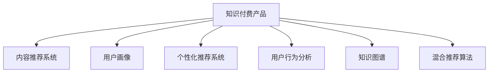

                 

# 打造爆款知识付费产品的秘诀

> 关键词：知识付费、内容推荐、用户画像、个性化推荐系统、用户行为分析

## 1. 背景介绍

### 1.1 问题由来

随着知识经济和互联网的快速发展，知识付费市场迎来了新的发展机遇。人们开始追求高效、系统的知识获取方式，以节省时间和精力，提升自我价值。知识付费产品的兴起，为内容创作者和用户之间的连接提供了新路径，同时也带来了巨大的商业价值。然而，面对市场竞争激烈、用户需求多变的环境，如何打造爆款知识付费产品，吸引用户持续订阅，成为摆在内容创作者和平台面前的巨大挑战。

### 1.2 问题核心关键点

打造爆款知识付费产品的核心在于对用户需求的深度挖掘，内容质量和推荐的精准度，以及产品体验的优化。

1. **用户需求分析**：了解用户画像，分析用户的知识需求和学习行为，为用户提供最贴合其需求的课程内容。
2. **内容质量控制**：确保课程内容的专业性、权威性和实用性，满足用户的学习需求。
3. **个性化推荐系统**：通过推荐算法，精准推送符合用户兴趣和需求的内容，提升用户满意度。
4. **用户行为分析**：利用数据挖掘和机器学习技术，分析用户行为数据，优化课程推荐和平台界面，提升用户体验。
5. **产品体验优化**：设计简洁易用的界面，提供高效的交互方式，确保用户在使用过程中能感受到高质量的服务。

### 1.3 问题研究意义

打造爆款知识付费产品，不仅能为内容创作者带来丰厚的回报，还能为平台带来稳定用户流量和商业收益。更重要的是，高品质的知识付费产品能够提升用户的学习效率和生活质量，推动社会的知识进步和创新。

## 2. 核心概念与联系

### 2.1 核心概念概述

为更好地理解打造爆款知识付费产品的过程，本节将介绍几个密切相关的核心概念：

- **知识付费产品**：指通过在线平台为用户提供有偿知识服务的形式，如视频课程、音频讲座、电子书等。
- **内容推荐系统**：利用算法对用户行为数据进行分析，将最符合用户兴趣和需求的内容推荐给用户，提高用户满意度和平台活跃度。
- **用户画像**：根据用户的在线行为数据，构建用户的基本属性、兴趣偏好、学习习惯等信息，帮助内容创作者和平台更好地理解用户需求。
- **个性化推荐系统**：通过分析用户的历史行为和兴趣标签，采用算法推荐最相关的内容，提升用户体验和粘性。
- **用户行为分析**：利用数据挖掘和机器学习技术，分析用户在平台上的行为数据，如学习时长、浏览内容、点击率等，为产品优化提供依据。
- **知识图谱**：构建知识的结构化表示，帮助用户快速找到相关知识，提升学习效率。
- **混合推荐算法**：结合基于内容的推荐和基于用户的推荐，提供更全面、准确的内容推荐。

这些核心概念之间的逻辑关系可以通过以下Mermaid流程图来展示：



这个流程图展示了几大核心概念及其之间的关系：

1. 知识付费产品以内容为核心，通过推荐系统、用户画像、行为分析、知识图谱、混合推荐算法等技术手段，提升用户满意度。
2. 内容推荐系统通过个性化推荐算法，根据用户画像和行为数据，精准推送内容。
3. 用户画像和行为分析通过数据挖掘和机器学习技术，构建用户画像，分析用户行为。
4. 知识图谱构建知识的结构化表示，帮助用户快速定位和获取知识。
5. 混合推荐算法结合多种推荐方式，提供全面、准确的内容推荐。

这些概念共同构成了知识付费产品的技术和应用框架，为其成功运营奠定了坚实的基础。

## 3. 核心算法原理 & 具体操作步骤

### 3.1 算法原理概述

打造爆款知识付费产品，其核心在于内容推荐系统的设计和优化。内容推荐系统主要包含以下步骤：

1. **用户画像构建**：通过用户行为数据和内容互动数据，构建用户的基本属性和兴趣偏好，生成用户画像。
2. **内容特征提取**：从课程内容中提取关键特征，如课程标题、描述、标签、章节结构等，构建课程的特征向量。
3. **推荐算法设计**：选择适合的推荐算法，结合用户画像和课程特征，生成推荐结果。
4. **模型评估与优化**：通过评估模型性能，不断调整和优化推荐算法，提升推荐效果。
5. **用户体验优化**：根据用户反馈和行为数据，优化推荐算法和产品界面，提升用户粘性。

基于监督学习的推荐算法，通过大量标注数据训练推荐模型，能够有效提升推荐准确性和用户体验。本文将重点介绍基于协同过滤和深度学习的推荐算法。

### 3.2 算法步骤详解

#### 3.2.1 基于协同过滤的推荐算法

协同过滤算法基于用户的兴趣和行为数据，通过相似度计算推荐内容。主要分为基于用户的协同过滤和基于物品的协同过滤。

**基于用户的协同过滤**：
1. 构建用户-物品评分矩阵，将用户对课程的评分作为矩阵元素。
2. 计算用户之间的相似度，通常使用余弦相似度或皮尔逊相关系数。
3. 推荐相似度较高的用户评分高的课程。

**基于物品的协同过滤**：
1. 构建物品-用户评分矩阵，将用户对课程的评分作为矩阵元素。
2. 计算物品之间的相似度，通常使用余弦相似度或欧氏距离。
3. 推荐与用户历史行为相似的课程。

**推荐算法步骤**：
1. 初始化用户画像和课程特征。
2. 根据用户画像，选择适当的协同过滤算法。
3. 计算用户和课程的相似度，生成推荐列表。
4. 返回推荐结果，并根据用户反馈调整算法参数。

#### 3.2.2 基于深度学习的推荐算法

基于深度学习的推荐算法，通过神经网络模型学习用户行为和课程特征的复杂关系，生成推荐结果。主要分为基于用户行为的深度学习推荐和基于内容特征的深度学习推荐。

**基于用户行为的深度学习推荐**：
1. 构建用户行为序列，将用户历史行为记录作为输入。
2. 使用RNN或LSTM等序列模型，捕捉用户行为的时序特征。
3. 输出预测的下一个课程ID。

**基于内容特征的深度学习推荐**：
1. 构建课程特征向量，将课程内容、结构、标签等特征作为输入。
2. 使用CNN或MLP等神经网络模型，捕捉课程特征的复杂关系。
3. 输出预测的下一个课程ID。

**推荐算法步骤**：
1. 初始化用户画像和课程特征。
2. 选择适当的深度学习模型，并设定超参数。
3. 训练深度学习模型，生成推荐列表。
4. 返回推荐结果，并根据用户反馈调整模型参数。

### 3.3 算法优缺点

基于监督学习的推荐算法具有以下优点：
1. 高效快速。协同过滤算法和深度学习算法都能快速生成推荐结果，满足实时性要求。
2. 准确性高。深度学习模型通过神经网络结构，能够捕捉用户行为和课程特征的复杂关系，提升推荐准确性。
3. 可解释性强。协同过滤算法简单易懂，容易解释推荐结果的来源。

然而，这些算法也存在一些缺点：
1. 数据需求高。协同过滤算法和深度学习模型需要大量的用户行为数据和课程特征数据，数据获取难度较大。
2. 冷启动问题。新用户和未交互课程的推荐效果较差，需要进一步优化算法。
3. 多样性问题。推荐系统容易产生过度个性化，导致用户接触到的内容过于单一。
4. 可解释性不足。深度学习模型较为复杂，难以解释推荐结果的内部逻辑。

### 3.4 算法应用领域

基于监督学习的推荐算法在知识付费产品的推荐系统中得到了广泛应用，具体如下：

1. **课程推荐**：根据用户的学习历史和兴趣偏好，推荐相关课程。
2. **专题推荐**：根据用户的浏览记录，推荐相关的专题内容，如热门课程、最新图书等。
3. **用户个性化推荐**：根据用户画像和行为数据，生成个性化推荐内容，提升用户粘性。
4. **热门课程推荐**：根据热门课程的点击率和评分，推荐热门内容，吸引新用户注册。
5. **排行榜推荐**：根据用户评价和热度，生成排行榜内容，引导用户关注和学习热门内容。

除了上述这些经典应用外，基于推荐算法的知识付费产品还可以创新性地应用于更多场景中，如智能客服、学习路径规划、个性化学习方案推荐等，为知识付费用户提供更个性化、高效的学习体验。

## 4. 数学模型和公式 & 详细讲解 & 举例说明

### 4.1 数学模型构建

在推荐系统中，我们通常使用以下数学模型来描述推荐过程：

**协同过滤模型**：
设用户-物品评分矩阵为 $R \in \mathbb{R}^{U \times I}$，其中 $U$ 为用户数，$I$ 为物品数。用户 $u$ 对物品 $i$ 的评分记为 $r_{ui}$。

协同过滤算法中，用户 $u$ 对物品 $i$ 的评分预测值为：

$$
\hat{r}_{ui} = \sum_{j \in N(u)} \alpha_{uj} r_{ji}
$$

其中 $N(u)$ 为用户 $u$ 的邻域，通常使用余弦相似度或皮尔逊相关系数计算用户之间的相似度，$\alpha_{uj}$ 为邻域权重。

**深度学习模型**：
设课程特征向量为 $x_i \in \mathbb{R}^d$，用户行为序列为 $y_{t-1}, y_{t-2}, ..., y_0$，其中 $y_t$ 为时间 $t$ 的用户行为。

基于用户行为的深度学习推荐模型通常使用LSTM或GRU，输出预测的下一个课程ID $c_{t+1}$：

$$
h_t = \text{LSTM}(x_t, h_{t-1})
$$
$$
c_{t+1} = \text{softmax}(W^1h_t + b^1)
$$

其中 $W^1$ 和 $b^1$ 为模型参数。

### 4.2 公式推导过程

**协同过滤模型公式推导**：
1. 用户 $u$ 对物品 $i$ 的评分预测值：

$$
\hat{r}_{ui} = \sum_{j \in N(u)} \alpha_{uj} r_{ji}
$$

2. 计算用户 $u$ 对物品 $i$ 的评分误差：

$$
e_{ui} = r_{ui} - \hat{r}_{ui}
$$

3. 通过误差最小化，更新邻域权重 $\alpha_{uj}$：

$$
\alpha_{uj} \leftarrow \alpha_{uj} + \eta \cdot \frac{r_{ui} - \hat{r}_{ui}}{||e_{ui}||}
$$

**深度学习模型公式推导**：
1. 用户行为序列通过LSTM模型计算：

$$
h_t = \text{LSTM}(x_t, h_{t-1})
$$

2. 输出预测的下一个课程ID：

$$
c_{t+1} = \text{softmax}(W^1h_t + b^1)
$$

3. 计算预测的课程ID与实际ID的误差：

$$
e_{t+1} = c_{t+1} - \hat{c}_{t+1}
$$

4. 通过误差最小化，更新模型参数 $W^1$ 和 $b^1$：

$$
W^1 \leftarrow W^1 - \eta \cdot \nabla_{W^1}e_{t+1}
$$
$$
b^1 \leftarrow b^1 - \eta \cdot \nabla_{b^1}e_{t+1}
$$

其中 $\eta$ 为学习率，$\nabla_{W^1}e_{t+1}$ 和 $\nabla_{b^1}e_{t+1}$ 分别为参数 $W^1$ 和 $b^1$ 的梯度。

### 4.3 案例分析与讲解

**案例分析**：
假设某知识付费平台有1000名用户，200门课程。某用户 $u$ 学习了课程 $i_1, i_2, i_3$，对课程 $i_1$ 和 $i_2$ 分别给出了5和4分，对课程 $i_3$ 未评分。根据协同过滤算法，计算用户 $u$ 对课程 $i_4$ 的评分预测值：

1. 计算用户 $u$ 的邻域 $N(u)$：
   - 余弦相似度：$N(u) = \{u_1, u_2, u_3, u_4\}$

2. 计算用户 $u$ 对课程 $i_4$ 的评分预测值：

$$
\hat{r}_{u4} = \alpha_{u1} \cdot r_{14} + \alpha_{u2} \cdot r_{24} + \alpha_{u3} \cdot r_{34} + \alpha_{u4} \cdot r_{44}
$$

3. 通过误差最小化，更新邻域权重 $\alpha_{uj}$：

$$
\alpha_{u1} \leftarrow \alpha_{u1} + \eta \cdot \frac{r_{u4} - \hat{r}_{u4}}{||e_{u4}||}
$$
$$
\alpha_{u2} \leftarrow \alpha_{u2} + \eta \cdot \frac{r_{u4} - \hat{r}_{u4}}{||e_{u4}||}
$$
$$
\alpha_{u3} \leftarrow \alpha_{u3} + \eta \cdot \frac{r_{u4} - \hat{r}_{u4}}{||e_{u4}||}
$$
$$
\alpha_{u4} \leftarrow \alpha_{u4} + \eta \cdot \frac{r_{u4} - \hat{r}_{u4}}{||e_{u4}||}
$$

**举例说明**：
某用户浏览了课程 $A, B, C$，对课程 $A$ 和 $B$ 分别给出了5和4分，对课程 $C$ 未评分。根据基于用户行为的深度学习推荐模型，生成用户下一个可能浏览的课程推荐：

1. 用户行为序列 $y_{t-1}, y_{t-2}, ..., y_0 = \{A, B, C\}$，课程特征向量 $x_A, x_B, x_C$。

2. 使用LSTM模型计算：

$$
h_1 = \text{LSTM}(x_A, h_0)
$$
$$
h_2 = \text{LSTM}(x_B, h_1)
$$
$$
h_3 = \text{LSTM}(x_C, h_2)
$$

3. 输出预测的下一个课程ID $c_{t+1}$：

$$
c_{t+1} = \text{softmax}(W^1h_3 + b^1)
$$

4. 根据用户反馈调整模型参数，提升推荐精度。

## 5. 项目实践：代码实例和详细解释说明

### 5.1 开发环境搭建

在进行推荐系统开发前，我们需要准备好开发环境。以下是使用Python进行TensorFlow开发的环境配置流程：

1. 安装Anaconda：从官网下载并安装Anaconda，用于创建独立的Python环境。

2. 创建并激活虚拟环境：
```bash
conda create -n tf-env python=3.8 
conda activate tf-env
```

3. 安装TensorFlow：根据CUDA版本，从官网获取对应的安装命令。例如：
```bash
conda install tensorflow -c pytorch -c conda-forge
```

4. 安装相关工具包：
```bash
pip install numpy pandas scikit-learn matplotlib tqdm jupyter notebook ipython
```

完成上述步骤后，即可在`tf-env`环境中开始推荐系统开发。

### 5.2 源代码详细实现

下面我们以基于协同过滤的推荐系统为例，给出使用TensorFlow实现的内容推荐系统的Python代码实现。

首先，定义协同过滤算法的用户-物品评分矩阵：

```python
import tensorflow as tf
from tensorflow.keras.layers import Dense, Embedding, Dot, DotProduct, BatchNormalization
from tensorflow.keras.models import Sequential

# 构建用户-物品评分矩阵
U = 1000
I = 200
R = tf.random.normal(shape=(U, I), mean=0, stddev=1)

# 构建用户画像和课程特征向量
user_profiles = tf.random.normal(shape=(U, 10), mean=0, stddev=1)
item_features = tf.random.normal(shape=(I, 10), mean=0, stddev=1)
```

然后，定义协同过滤算法的模型：

```python
# 构建协同过滤模型的神经网络
model = Sequential([
    Embedding(input_dim=U, output_dim=10, input_length=1),
    DotProduct(),
    Dense(1)
])
```

接着，定义模型的损失函数和优化器：

```python
# 定义损失函数和优化器
loss = tf.keras.losses.MSE()
optimizer = tf.keras.optimizers.Adam(lr=0.001)

# 训练模型
for epoch in range(100):
    for i in range(U):
        # 计算邻域权重
        alpha = tf.reduce_sum(R[i] * user_profiles[i:i+1], axis=0) / tf.reduce_sum(R[i:i+1])
        
        # 计算评分预测值
        y_pred = model(tf.ones(shape=(1, 10))) * alpha
        
        # 计算误差
        y_true = tf.reshape(R[i:i+1, i], shape=(1, 1))
        y_true = y_true + tf.random.normal(shape=(1, 1), mean=0, stddev=0.1)
        error = y_true - y_pred
        
        # 更新模型参数
        loss_value = loss(y_true, y_pred)
        optimizer.apply_gradients(zip(model.trainable_variables, tf.gradients(loss_value, model.trainable_variables)))
```

最后，定义推荐系统的输出：

```python
# 生成推荐结果
def recommend(u, k):
    alpha = tf.reduce_sum(R[u] * user_profiles[u:u+k], axis=0) / tf.reduce_sum(R[u:u+k])
    y_pred = model(tf.ones(shape=(1, 10))) * alpha
    return tf.reshape(y_pred.numpy(), shape=(-1,))

# 推荐用户u的前k个课程ID
recommend_ids = recommend(0, 5)
print(recommend_ids)
```

以上就是使用TensorFlow对协同过滤推荐系统进行开发的完整代码实现。可以看到，TensorFlow的API设计简洁高效，使得推荐系统的实现变得相对容易。

### 5.3 代码解读与分析

让我们再详细解读一下关键代码的实现细节：

**协同过滤模型代码**：
- `user_profiles`和`item_features`：定义用户画像和课程特征向量，使用随机数生成。
- `model`：构建协同过滤模型的神经网络，包含嵌入层、点积层和全连接层。
- `loss`和`optimizer`：定义损失函数和优化器，使用均方误差和Adam优化器。
- `for`循环：遍历用户画像，计算邻域权重、评分预测值和误差，更新模型参数。

**推荐系统输出代码**：
- `recommend`函数：根据用户ID和推荐数量，生成推荐结果。
- `recommend_ids`：调用`recommend`函数，生成前5个课程ID的推荐列表。

可以看到，TensorFlow提供的高级API和工具函数，使得推荐系统的代码实现变得简洁高效。开发者可以将更多精力放在模型优化和算法改进上，而不必过多关注底层细节。

当然，工业级的系统实现还需考虑更多因素，如模型的保存和部署、超参数的自动搜索、更灵活的任务适配层等。但核心的协同过滤推荐算法基本与此类似。

## 6. 实际应用场景

### 6.1 智能推荐系统

基于协同过滤的推荐系统，已经在各大电商平台上得到了广泛应用，如亚马逊、淘宝等。通过推荐系统，电商平台能够精准推送符合用户兴趣和需求的商品，提升用户购物体验和平台转化率。

在知识付费领域，推荐系统同样不可或缺。用户可以根据之前的学习记录，推荐相关的课程和专题内容，提升学习效果。平台可以通过推荐系统，吸引新用户注册，提升用户粘性和平台活跃度。

### 6.2 个性化学习路径规划

推荐系统不仅限于商品推荐，还能应用于个性化学习路径规划。根据学生的学习历史和兴趣偏好，推荐合适的课程和资源，帮助学生制定个性化的学习计划，提升学习效率。

在智能教育平台中，推荐系统能够分析学生的学习行为和成绩数据，推荐适合其学习能力和兴趣的课程和习题，提供个性化的学习支持。推荐系统还能根据学习进度和反馈，动态调整推荐内容，优化学习路径。

### 6.3 用户行为分析

推荐系统还能用于用户行为分析，帮助平台了解用户需求，优化产品功能和服务体验。通过对用户行为数据的分析，平台可以识别出用户兴趣和行为模式，进行用户分群，制定有针对性的营销策略。

在金融、电商等行业中，推荐系统能够分析用户行为，识别潜在的购买意愿和需求，提供个性化的营销和服务，提升用户体验和满意度。

### 6.4 未来应用展望

随着推荐算法的不断演进，基于协同过滤和深度学习的推荐系统将得到更广泛的应用。未来，推荐系统将更加智能化、个性化和实时化，能够更好地满足用户需求，提升平台价值。

1. **个性化推荐**：推荐系统将更加注重个性化，结合用户画像和行为数据，生成更加符合用户需求的推荐结果。
2. **实时推荐**：推荐系统将具备实时推荐能力，根据用户当前行为实时调整推荐内容，提升用户体验。
3. **多模态推荐**：推荐系统将融合多种模态数据，如图像、视频、语音等，提供更全面、准确的内容推荐。
4. **混合推荐**：推荐系统将结合多种推荐方式，如协同过滤和深度学习，提供更全面、准确的推荐结果。
5. **场景推荐**：推荐系统将结合用户场景和需求，提供更加贴合实际的应用推荐，如出行推荐、健康管理等。

这些趋势将使得推荐系统更加智能和高效，为用户带来更好的使用体验和价值。

## 7. 工具和资源推荐

### 7.1 学习资源推荐

为了帮助开发者系统掌握推荐系统的理论基础和实践技巧，这里推荐一些优质的学习资源：

1. 《推荐系统实践》系列博文：由推荐系统专家撰写，深入浅出地介绍了推荐系统的核心算法和应用案例。

2. CS474《推荐系统》课程：斯坦福大学开设的推荐系统课程，有Lecture视频和配套作业，带你入门推荐系统领域的基本概念和经典模型。

3. 《推荐系统》书籍：结合实际案例，系统讲解了推荐系统的设计、开发和优化方法，适合深入学习。

4. KDD开源项目：包含多种推荐算法和数据集，适合进行推荐系统的研究和实践。

5. TensorFlow官方文档：TensorFlow的推荐系统工具库，提供了丰富的推荐算法实现和样例代码。

通过对这些资源的学习实践，相信你一定能够快速掌握推荐系统的精髓，并用于解决实际问题。

### 7.2 开发工具推荐

高效的开发离不开优秀的工具支持。以下是几款用于推荐系统开发的常用工具：

1. TensorFlow：基于Python的开源深度学习框架，灵活动态的计算图，适合快速迭代研究。推荐系统的大多数算法都有TensorFlow版本的实现。

2. PyTorch：基于Python的开源深度学习框架，灵活性高，适合科研和实验开发。

3. Scikit-learn：基于Python的机器学习库，包含多种常用的推荐算法实现，如协同过滤、基于内容的推荐等。

4. Spark MLlib：Apache Spark的机器学习库，支持分布式计算，适合大数据推荐系统开发。

5. Weights & Biases：模型训练的实验跟踪工具，可以记录和可视化模型训练过程中的各项指标，方便对比和调优。与主流深度学习框架无缝集成。

6. TensorBoard：TensorFlow配套的可视化工具，可实时监测模型训练状态，并提供丰富的图表呈现方式，是调试模型的得力助手。

合理利用这些工具，可以显著提升推荐系统的开发效率，加快创新迭代的步伐。

### 7.3 相关论文推荐

推荐系统的研究源于学界的持续努力。以下是几篇奠基性的相关论文，推荐阅读：

1. ALS: The Alternating Least Squares Method for Online Matrix Factorization：提出交替最小二乘法，解决协同过滤模型中的稀疏性和计算复杂性问题。

2. Matrix Factorization Techniques for Recommender Systems：系统讲解了矩阵分解、奇异值分解等推荐算法，为推荐系统提供了坚实的数学基础。

3. Deep Rank：A Deep Learning Approach for Ranking Problems：提出Deep Rank模型，结合深度学习和特征工程技术，提升了推荐系统的性能。

4. Neural Collaborative Filtering：基于神经网络的推荐算法，通过神经网络模型学习用户行为和物品特征的复杂关系，提升推荐效果。

5. LightFM：A Hybrid Recommender System with Exotic Feature Interactions：提出LightFM模型，结合深度学习和传统推荐算法，提升了推荐系统的表现。

这些论文代表了大规模推荐系统的研究进展，通过学习这些前沿成果，可以帮助研究者把握学科前进方向，激发更多的创新灵感。

## 8. 总结：未来发展趋势与挑战

### 8.1 总结

本文对打造爆款知识付费产品的推荐系统进行了全面系统的介绍。首先阐述了推荐系统在知识付费产品中的核心作用，明确了推荐系统对用户需求分析、内容质量控制、个性化推荐系统、用户行为分析等功能的依赖。其次，从原理到实践，详细讲解了协同过滤和深度学习推荐算法的数学原理和关键步骤，给出了推荐系统开发的完整代码实例。同时，本文还广泛探讨了推荐系统在智能推荐、个性化学习路径规划、用户行为分析等多个场景中的应用前景，展示了推荐系统的巨大潜力。此外，本文精选了推荐系统的各类学习资源，力求为开发者提供全方位的技术指引。

通过本文的系统梳理，可以看到，推荐系统在知识付费产品的成功运营中发挥了重要作用。基于协同过滤和深度学习的推荐算法，能够精准推送符合用户兴趣和需求的内容，提升用户满意度和平台活跃度。未来，随着推荐算法的不断演进和优化，推荐系统将更加智能化、个性化和实时化，为用户带来更好的使用体验和价值。

### 8.2 未来发展趋势

展望未来，推荐系统的发展将呈现以下几个趋势：

1. **个性化推荐**：推荐系统将更加注重个性化，结合用户画像和行为数据，生成更加符合用户需求的推荐结果。
2. **实时推荐**：推荐系统将具备实时推荐能力，根据用户当前行为实时调整推荐内容，提升用户体验。
3. **多模态推荐**：推荐系统将融合多种模态数据，如图像、视频、语音等，提供更全面、准确的内容推荐。
4. **混合推荐**：推荐系统将结合多种推荐方式，如协同过滤和深度学习，提供更全面、准确的推荐结果。
5. **场景推荐**：推荐系统将结合用户场景和需求，提供更加贴合实际的应用推荐，如出行推荐、健康管理等。
6. **跨平台推荐**：推荐系统将打破平台限制，实现跨平台内容推荐，提升用户覆盖率和平台粘性。

这些趋势将使得推荐系统更加智能和高效，为用户带来更好的使用体验和价值。

### 8.3 面临的挑战

尽管推荐系统已经取得了显著的进展，但在迈向更加智能化、普适化应用的过程中，它仍面临着诸多挑战：

1. **数据需求高**：推荐系统需要大量的用户行为数据和物品特征数据，数据获取难度较大，且数据质量对推荐效果有重要影响。
2. **冷启动问题**：新用户和未交互物品的推荐效果较差，需要进一步优化算法，提高冷启动性能。
3. **多样性问题**：推荐系统容易产生过度个性化，导致用户接触到的内容过于单一，需要更多地关注多样性推荐。
4. **可解释性不足**：深度学习模型较为复杂，难以解释推荐结果的内部逻辑，需要更多地关注模型的可解释性。
5. **公平性问题**：推荐系统容易产生偏差，导致某些用户或物品被不公平地忽视或推荐，需要更多地关注公平性问题。

### 8.4 研究展望

面对推荐系统面临的挑战，未来的研究需要在以下几个方面寻求新的突破：

1. **数据收集与处理**：通过数据收集和清洗技术，获取高质量的用户行为数据和物品特征数据，提升推荐系统的数据质量。
2. **冷启动技术**：开发新的冷启动算法，提升新用户和未交互物品的推荐效果，提高推荐系统的覆盖率。
3. **多样性推荐**：结合用户画像和行为数据，生成多样化、均衡化的推荐内容，提升用户体验。
4. **可解释性增强**：通过模型可视化、特征重要性分析等技术，增强推荐系统的可解释性，让用户理解推荐结果的来源。
5. **公平性保障**：设计公平推荐算法，减少推荐系统中的偏见和歧视，提升推荐系统的公平性。

这些研究方向的探索，将推动推荐系统向更高的台阶发展，为用户带来更好的使用体验和价值。相信随着学界和产业界的共同努力，推荐系统必将在更多领域得到应用，为知识付费产品的发展贡献力量。

## 9. 附录：常见问题与解答

**Q1：推荐系统如何处理新用户和未交互物品的冷启动问题？**

A: 推荐系统处理冷启动问题的方法有很多，以下是几种常用的技术：

1. **基于物品的协同过滤**：利用已存在的数据，预测新物品的评分，生成推荐列表。
2. **基于内容的推荐**：利用物品的特征，生成推荐列表，解决冷启动问题。
3. **混合推荐算法**：结合多种推荐方式，提升冷启动性能，如协同过滤和基于内容的推荐。

**Q2：推荐系统如何提高推荐内容的多样性？**

A: 推荐系统可以通过以下方法提高推荐内容的多样性：

1. **内容多样化**：在推荐列表中加入不同种类的内容，如文章、视频、音频等。
2. **时间多样化**：根据用户的时间分布，推荐不同时间段的物品，如日间和夜间的推荐。
3. **交互多样化**：结合用户的交互历史，推荐不同类型的互动内容，如点赞、评论、分享等。

**Q3：推荐系统如何增强推荐结果的可解释性？**

A: 推荐系统可以通过以下方法增强推荐结果的可解释性：

1. **模型可视化**：通过特征重要性分析、模型可视化等技术，展示推荐结果的生成过程。
2. **用户反馈机制**：建立用户反馈机制，让用户对推荐结果进行评价和反馈，进一步优化推荐系统。
3. **推荐规则透明化**：制定推荐规则，让用户了解推荐算法的内部逻辑。

**Q4：推荐系统如何减少推荐中的偏差和歧视？**

A: 推荐系统可以通过以下方法减少推荐中的偏差和歧视：

1. **公平推荐算法**：设计公平推荐算法，确保推荐过程不偏向某些用户或物品。
2. **多样性约束**：在推荐过程中加入多样性约束，避免过度个性化。
3. **用户反馈机制**：建立用户反馈机制，及时调整推荐算法，消除偏见和歧视。

这些技术手段将帮助推荐系统更好地应对冷启动、多样性、可解释性、公平性等挑战，提升推荐系统的性能和用户体验。

---

作者：禅与计算机程序设计艺术 / Zen and the Art of Computer Programming

