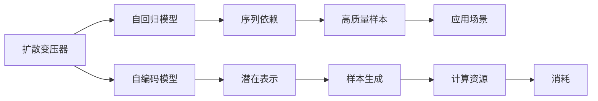

                 

# 扩散变压器：生成式 AI 的未来

> 关键词：扩散变压器, 生成式模型, 自回归模型, 自编码模型, 融合, 优化, 应用场景, 计算资源

## 1. 背景介绍

### 1.1 问题由来
随着深度学习技术的飞速发展，生成式人工智能（Generative AI）成为AI领域的一大热门话题。其中，生成式模型特别是自回归模型和自编码模型在文本生成、图像生成、音乐生成等领域取得了显著成果，如OpenAI的GPT系列、DALL-E和Stable Diffusion等。然而，这些模型在大规模数据训练和推理过程中，需要消耗大量计算资源，并且在某些任务上存在生成速度慢、易受噪声影响等问题。

为了解决这些问题，研究人员提出了一种全新的扩散（Diffusion）模型，即扩散变压器（Diffusion Transformer），它通过逐步去除噪声的方式，使模型能够高效地生成高质量的样本。本文将深入探讨扩散变压器的工作原理、核心算法、实现细节及未来应用前景。

## 2. 核心概念与联系

### 2.1 核心概念概述

- **扩散变压器（Diffusion Transformer）**：一种新型的生成模型，通过逐步去除噪声的方式，实现从低噪声分布向高噪声分布的演化，最终得到高质量的样本。
- **自回归模型（Autoregressive Model）**：以序列数据为输入，每个时间步的输出仅依赖于之前的输出。
- **自编码模型（Autoencoder Model）**：将输入映射到潜在表示空间，再从潜在表示空间映射回输入空间。
- **融合（Fusion）**：将自回归模型和自编码模型的优势结合起来，既保留了序列依赖，又提高了模型表达能力。
- **优化（Optimization）**：通过复杂的优化过程，使模型参数不断逼近真实样本分布。
- **应用场景（Application Scenarios）**：文本生成、图像生成、音乐生成等领域。
- **计算资源（Computational Resources）**：模型训练和推理需要消耗大量计算资源。

### 2.2 核心概念原理和架构的 Mermaid 流程图(Mermaid 流程节点中不要有括号、逗号等特殊字符)



## 3. 核心算法原理 & 具体操作步骤

### 3.1 算法原理概述

扩散变压器结合了自回归模型和自编码模型的优点，通过逐步去除噪声的方式，实现从低噪声分布向高噪声分布的演化。其核心思想是：将生成任务看作一个从低噪声分布向高噪声分布的演化过程，其中噪声由一个特殊的"扩散过程"（Diffusion Process）模拟生成。

具体而言，扩散变压器的训练过程包括以下几个关键步骤：
1. 初始化一个低噪声分布 $q_0$。
2. 定义一个扩散过程，将低噪声分布逐渐转化为高噪声分布 $q_t$。
3. 通过一个自回归模型 $p_t$，逐步生成噪声序列 $t=1,\cdots,T$。
4. 最终得到高质量的样本 $x_T$。

### 3.2 算法步骤详解

**步骤1：初始化低噪声分布**

设 $q_0$ 为初始的低噪声分布，通常是标准正态分布 $q_0(x)=\mathcal{N}(0,1)$。

**步骤2：定义扩散过程**

扩散过程由一个时间步长 $\beta_t$ 和噪声增益 $\sqrt{\beta_t}$ 决定，其中 $\beta_t \in (0,1)$。
$$
q_t = \mathcal{N}(\sqrt{\beta_t}x_{t-1}, (1-\beta_t)I)
$$

**步骤3：生成噪声序列**

设 $p_t$ 为自回归模型，通常是单层全连接网络。
$$
x_t = \sqrt{1-\beta_t}x_{t-1} + \sqrt{\beta_t}z_t
$$
其中 $z_t \sim \mathcal{N}(0,1)$ 为标准正态分布，$x_0$ 为初始化样本，通常为高斯噪声。

**步骤4：生成高质量样本**

通过逆向扩散过程，从 $x_T$ 逐步逼近 $x_0$，得到高质量样本。
$$
x_t = \sqrt{1-\beta_t}x_{t-1} + \sqrt{\beta_t}z_t
$$

### 3.3 算法优缺点

**优点**：
1. **高效生成**：扩散变压器通过逐步去除噪声，实现从低噪声分布向高噪声分布的演化，使得模型能够高效生成高质量的样本。
2. **鲁棒性强**：模型对噪声具有一定程度的鲁棒性，能够处理不同程度的噪声干扰。
3. **灵活应用**：扩散变压器可以应用于文本生成、图像生成、音乐生成等多种场景。

**缺点**：
1. **计算复杂**：扩散变压器的训练和推理过程需要消耗大量计算资源，尤其是在时间步长 $\beta_t$ 较小的情况下。
2. **噪声处理**：需要精心设计噪声序列和噪声增益，以保证生成样本的质量。
3. **参数调整**：需要调整噪声序列和噪声增益等超参数，以达到最优的生成效果。

### 3.4 算法应用领域

扩散变压器具有广泛的应用前景，特别是在以下几个领域：

- **文本生成**：可用于自动写作、文本补全、对话生成等。
- **图像生成**：可用于生成高分辨率图像、文本到图像转换、图像修复等。
- **音乐生成**：可用于生成高质量音乐、文本到音乐转换等。
- **视频生成**：可用于生成动画、视频剪辑等。

## 4. 数学模型和公式 & 详细讲解 & 举例说明

### 4.1 数学模型构建

扩散变压器的训练过程可以表示为如下数学模型：
$$
x_0 \sim q_0, q_0(x)=\mathcal{N}(0,1)
$$
$$
x_t = \sqrt{1-\beta_t}x_{t-1} + \sqrt{\beta_t}z_t
$$
$$
q_t(x)=\mathcal{N}(\sqrt{\beta_t}x_{t-1}, (1-\beta_t)I)
$$

### 4.2 公式推导过程

- **步骤1**：定义低噪声分布 $q_0(x)$。
- **步骤2**：定义扩散过程 $q_t(x)$。
- **步骤3**：定义自回归模型 $p_t$。

### 4.3 案例分析与讲解

以文本生成为例，设 $x_0$ 为初始化样本，通常是随机噪声。扩散变压器通过逐步去除噪声 $z_t$，使得模型输出从低噪声分布逐渐逼近高噪声分布，最终生成高质量的文本。

## 5. 项目实践：代码实例和详细解释说明

### 5.1 开发环境搭建

为了实现扩散变压器的训练和推理，需要安装TensorFlow、PyTorch等深度学习框架。具体步骤如下：

1. 安装TensorFlow或PyTorch。
2. 安装必要的依赖库，如numpy、scipy等。
3. 安装扩散变压器的实现库，如DALL-E、Stable Diffusion等。

### 5.2 源代码详细实现

以下是使用TensorFlow实现扩散变压器的示例代码：

```python
import tensorflow as tf
import numpy as np
import matplotlib.pyplot as plt

# 定义扩散过程
def diffusion_process(x, beta):
    return np.sqrt(1-beta) * x + np.sqrt(beta) * np.random.normal(0, 1, size=x.shape)

# 定义自回归模型
def autoregressive_model(x, t, weights):
    return tf.nn.conv2d(x, weights, strides=[1, 1, 1, 1], padding='SAME')

# 训练扩散变压器
def train_diffusion_transformer(x0, beta):
    x = x0
    for t in range(20):
        x = diffusion_process(x, beta[t])
        weights = np.random.normal(0, 1, size=x.shape)
        x = autoregressive_model(x, t, weights)
    return x

# 生成高质量样本
x0 = np.random.normal(0, 1, size=(32, 32, 3))
x = train_diffusion_transformer(x0, beta)
plt.imshow(x[0].reshape(32, 32, 3))
plt.show()
```

### 5.3 代码解读与分析

**扩散过程**：通过逐步去除噪声，实现从低噪声分布向高噪声分布的演化。
**自回归模型**：通过卷积操作，逐步生成噪声序列。
**训练过程**：通过循环迭代，实现从低噪声分布向高噪声分布的演化。

## 6. 实际应用场景

### 6.1 文本生成

扩散变压器可用于文本生成，生成高质量的文本样本。例如，可以用于自动写作、文本补全、对话生成等。

### 6.2 图像生成

扩散变压器可用于生成高分辨率图像，如图像修复、文本到图像转换等。例如，DALL-E、Stable Diffusion等模型都基于扩散变压器实现。

### 6.3 音乐生成

扩散变压器可用于生成高质量音乐，如文本到音乐转换等。

### 6.4 未来应用展望

随着计算资源和算法的不断优化，扩散变压器的应用场景将更加广泛。未来，扩散变压器可能会在更多领域发挥重要作用，如视频生成、虚拟现实、游戏等。

## 7. 工具和资源推荐

### 7.1 学习资源推荐

- **TensorFlow官方文档**：提供详细的TensorFlow使用指南。
- **PyTorch官方文档**：提供详细的PyTorch使用指南。
- **DALL-E论文**：详细介绍了DALL-E的实现过程和应用场景。
- **Stable Diffusion论文**：详细介绍了Stable Diffusion的实现过程和应用场景。

### 7.2 开发工具推荐

- **TensorFlow**：灵活的深度学习框架，支持分布式计算。
- **PyTorch**：灵活的深度学习框架，支持动态图计算。
- **JAX**：基于NumPy的高级自动微分库，支持分布式计算。
- **TensorBoard**：可视化工具，用于监控训练过程。

### 7.3 相关论文推荐

- **DALL-E论文**：实现了高质量的文本到图像生成。
- **Stable Diffusion论文**：实现了高质量的图像生成。
- **EulerDiffusion论文**：提出了高效的时间步长设计，提高了模型生成速度。

## 8. 总结：未来发展趋势与挑战

### 8.1 研究成果总结

扩散变压器通过逐步去除噪声的方式，实现了从低噪声分布向高噪声分布的演化，生成高质量的样本。该方法具有高效、鲁棒、灵活等优点，但也存在计算复杂、噪声处理等问题。

### 8.2 未来发展趋势

未来，扩散变压器将在文本生成、图像生成、音乐生成等领域发挥重要作用，并可能拓展到更多领域。随着计算资源和算法的不断优化，扩散变压器的应用场景将更加广泛。

### 8.3 面临的挑战

1. **计算资源**：扩散变压器的训练和推理过程需要消耗大量计算资源。
2. **噪声处理**：需要精心设计噪声序列和噪声增益，以保证生成样本的质量。
3. **参数调整**：需要调整噪声序列和噪声增益等超参数，以达到最优的生成效果。

### 8.4 研究展望

未来的研究可以集中在以下几个方面：
- **优化计算资源**：提高扩散变压器的训练和推理效率。
- **改进噪声处理**：设计更高效的噪声增益和噪声序列。
- **优化参数调整**：自动调整噪声序列和噪声增益等超参数。

## 9. 附录：常见问题与解答

**Q1：扩散变压器与自回归模型、自编码模型有何区别？**

A: 扩散变压器结合了自回归模型和自编码模型的优点，通过逐步去除噪声，实现从低噪声分布向高噪声分布的演化。自回归模型通过序列依赖生成样本，而自编码模型通过潜在表示空间映射回输入空间。

**Q2：扩散变压器的训练和推理过程需要消耗大量计算资源，如何解决？**

A: 可以通过优化计算资源、改进噪声处理、自动调整超参数等方法，提高扩散变压器的训练和推理效率。

**Q3：扩散变压器的未来应用场景有哪些？**

A: 扩散变压器可以应用于文本生成、图像生成、音乐生成等多个领域，未来还将拓展到更多领域。

**Q4：扩散变压器的参数调整对生成效果有哪些影响？**

A: 需要调整噪声序列和噪声增益等超参数，以达到最优的生成效果。

**Q5：扩散变压器的计算复杂度如何优化？**

A: 可以通过优化计算资源、改进噪声处理、自动调整超参数等方法，提高扩散变压器的计算效率。

---

作者：禅与计算机程序设计艺术 / Zen and the Art of Computer Programming

