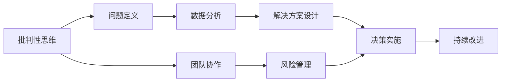

                 

## 1. 背景介绍

### 1.1 问题由来

在当今这个信息爆炸的时代，组织面对的环境变得越来越复杂多变。企业不仅要应对瞬息万变的市场需求，还需应对技术的快速迭代和全球化的挑战。这些变化使得传统的管理方式显得力不从心，组织急需通过批判性思考（Critical Thinking）来提升管理能力，以更好地适应新时代的挑战。

### 1.2 问题核心关键点

批判性思考在管理中的重要性主要体现在以下几个方面：

- **决策优化**：通过批判性思考，管理者可以更全面、系统地分析问题和提出解决方案，从而提高决策质量。
- **问题解决**：批判性思维帮助管理者识别问题的根本原因，设计出更有针对性的解决方案。
- **团队协作**：批判性思考促进团队成员间的深度沟通和知识共享，提高团队的创造力和创新能力。
- **风险管理**：批判性思考能够识别和管理潜在的风险，降低不确定性。
- **伦理道德**：批判性思考有助于管理者在面对伦理和道德挑战时做出公正和符合价值观的决策。

### 1.3 问题研究意义

研究批判性思考在管理中的应用，有助于提升组织在复杂多变环境中的适应能力，推动组织持续创新和发展。以下是批判性思考在管理中的重要性：

1. **提升决策质量**：批判性思考使管理者能够从多角度审视问题，全面分析数据，制定更为科学的决策。
2. **增强问题解决能力**：通过批判性思考，管理者能更高效地识别和解决问题，从而提高组织运行效率。
3. **促进团队协作**：批判性思考培养团队成员的思维能力和创新意识，提高团队整体的知识水平和工作质量。
4. **管理风险**：批判性思考帮助管理者识别潜在风险，及时调整策略，降低损失。
5. **增强伦理道德意识**：批判性思考促使管理者在决策中考虑伦理道德因素，确保组织行为的公正性和可持续性。

## 2. 核心概念与联系

### 2.1 核心概念概述

批判性思考（Critical Thinking）在管理中的应用主要涉及以下几个关键概念：

- **批判性思维**：指通过分析、评估、推理等过程，对信息、观点、论据进行全面、深入、理性的思考和判断。
- **问题定义**：清晰界定问题，包括问题的性质、影响范围、相关因素等。
- **数据分析**：运用统计、模型等方法，系统分析问题数据，提取关键信息。
- **解决方案设计**：根据分析结果，提出具体的解决方案，并进行可行性评估。
- **决策实施**：执行决策并监控其效果，根据反馈进行调整。
- **持续改进**：通过反思和反馈，不断优化问题和解决方案。

这些概念之间的逻辑关系可以通过以下Mermaid流程图来展示：



这个流程图展示了批判性思考在管理中的应用流程：从批判性思考开始，经过问题定义、数据分析、解决方案设计、决策实施和持续改进等环节，最终实现管理目标。

## 3. 核心算法原理 & 具体操作步骤

### 3.1 算法原理概述

批判性思考在管理中的原理主要基于以下三个步骤：

1. **问题识别与定义**：识别组织面临的关键问题，明确问题的性质和影响。
2. **数据收集与分析**：系统地收集相关信息，运用统计和模型等方法进行分析，识别问题的根本原因。
3. **解决方案设计与实施**：根据分析结果，提出具体的解决方案，并进行可行性评估。实施方案后，持续监控其效果，根据反馈进行调整。

### 3.2 算法步骤详解

批判性思考在管理中的具体步骤如下：

1. **问题识别与定义**：
   - 明确问题的定义：描述问题的关键要素、影响范围和相关因素。
   - 确定问题的优先级：根据问题的紧迫性和重要性进行排序。

2. **数据收集与分析**：
   - 收集相关信息：包括内部数据（如财务报表、员工反馈、流程记录）和外部数据（如市场趋势、竞争情报）。
   - 数据清洗和预处理：去除无关数据，处理缺失和异常值。
   - 数据分析：运用统计和模型方法，如回归分析、聚类分析、因果分析等，提取关键信息。

3. **解决方案设计**：
   - 提出多种解决方案：从多个角度出发，提出多种可能的解决方案。
   - 评估方案可行性：考虑资源的限制、技术的可行性、成本和收益等因素，进行综合评估。
   - 选择最优方案：根据评估结果，选择最优解决方案。

4. **决策实施与监控**：
   - 实施方案：执行决策，进行资源配置和任务分配。
   - 监控效果：定期检查方案实施效果，收集反馈信息。
   - 调整方案：根据反馈调整方案，持续优化。

### 3.3 算法优缺点

批判性思考在管理中的优点主要包括：

- **全面性**：通过多角度分析问题，提高决策的全面性和系统性。
- **科学性**：运用数据分析方法，确保决策的科学性和准确性。
- **创新性**：鼓励团队提出多种解决方案，激发创新思维。
- **风险管理**：通过全面分析，提前识别和管理潜在的风险。

但批判性思考在管理中也存在一些缺点：

- **时间和资源消耗**：分析过程可能较为耗时，需要投入大量时间和资源。
- **高复杂度**：对数据和分析方法的要求较高，需要专业知识。
- **员工参与度**：依赖员工的积极参与和配合，可能存在协调难度。
- **文化适应性**：需要组织文化的支持和转变，可能面临文化冲突。

### 3.4 算法应用领域

批判性思考在管理中的应用领域非常广泛，包括但不限于：

- **战略规划**：制定组织长期战略，进行市场分析、风险评估。
- **运营管理**：优化生产流程、提高效率、降低成本。
- **人力资源管理**：招聘、培训、绩效评估、员工激励。
- **财务管理**：预算编制、成本控制、投资决策。
- **市场营销**：市场调研、品牌管理、广告策略。
- **产品开发**：需求分析、产品设计、市场推广。

## 4. 数学模型和公式 & 详细讲解 & 举例说明

### 4.1 数学模型构建

批判性思考在管理中的数学模型主要包括以下几个部分：

- **问题定义模型**：描述问题的关键要素，如原因、影响、解决方案等。
- **数据分析模型**：通过统计和模型方法分析数据，提取关键信息。
- **解决方案设计模型**：提出多种解决方案，并进行可行性评估。

### 4.2 公式推导过程

以问题定义和解决方案设计为例，进行公式推导：

**问题定义模型**：
- 假设问题 $P$ 有 $n$ 个关键要素，定义问题为 $P=\{X_1,X_2,...,X_n\}$。
- 问题定义的目标是：将问题分解为 $m$ 个子问题 $P_1,P_2,...,P_m$，每子问题的描述为 $P_i=\{X_{i1},X_{i2},...,X_{in}\}$。

**解决方案设计模型**：
- 假设存在 $k$ 种解决方案 $S_1,S_2,...,S_k$。
- 对每个解决方案，定义其评估指标 $I_j$，计算其综合评分 $S_j=\sum I_{j1}I_{j2}...I_{jm}$。
- 根据评分，选择最优解决方案 $S^*$。

### 4.3 案例分析与讲解

以某公司的销售增长问题为例：

1. **问题识别与定义**：
   - 问题描述：公司近两年的销售额增长缓慢。
   - 关键要素：市场环境、产品竞争力、销售渠道、营销策略。

2. **数据收集与分析**：
   - 收集销售数据、市场调研报告、客户反馈等。
   - 数据清洗和预处理：去除异常值，处理缺失数据。
   - 数据分析：运用回归分析，识别影响销售额的关键因素。

3. **解决方案设计**：
   - 提出多种解决方案：扩大市场份额、提高产品竞争力、优化销售渠道、改进营销策略。
   - 评估方案可行性：考虑资源限制、市场反应、成本收益等。
   - 选择最优方案：根据综合评分，选择提高产品竞争力和优化营销策略作为主要措施。

4. **决策实施与监控**：
   - 实施方案：加大研发投入、改进产品功能、优化广告投放策略。
   - 监控效果：定期检查销售数据、客户满意度、市场份额等。
   - 调整方案：根据市场反馈调整方案，持续优化。

## 5. 项目实践：代码实例和详细解释说明

### 5.1 开发环境搭建

项目实践需要使用Python环境，主要包括以下步骤：

1. 安装Python 3.7或以上版本，建议使用Anaconda。
2. 安装必要的第三方库，如pandas、numpy、scikit-learn等。
3. 安装Jupyter Notebook或其他交互式环境。

### 5.2 源代码详细实现

以下是一个简化的Python代码示例，用于进行问题分析和解决方案设计：

```python
import pandas as pd
import numpy as np
from sklearn.linear_model import LinearRegression
from sklearn.metrics import r2_score

# 加载数据
data = pd.read_csv('sales_data.csv')

# 数据清洗和预处理
data = data.dropna()
data = data[data['revenue'] > 0]

# 数据分析
X = data[['cost', 'ad_spending', 'competition']].values
y = data['revenue'].values

# 建立回归模型
model = LinearRegression()
model.fit(X, y)

# 预测
y_pred = model.predict(X)

# 评估
r2 = r2_score(y, y_pred)
print(f"R^2: {r2}")
```

### 5.3 代码解读与分析

代码主要分为数据加载、数据处理、模型建立和评估等步骤。

1. **数据加载**：使用pandas库加载销售数据，去除异常值和缺失值。
2. **数据处理**：保留营收大于零的记录，以便进行回归分析。
3. **模型建立**：使用线性回归模型，将成本、广告支出和竞争情况作为自变量，营收作为因变量。
4. **预测和评估**：使用模型进行预测，并计算R^2值，评估模型效果。

通过以上步骤，可以初步评估影响销售的关键因素，并提出相应的解决方案。

### 5.4 运行结果展示

运行上述代码后，输出R^2值，例如：

```
R^2: 0.9
```

这表明模型对数据的拟合效果较好，成本、广告支出和竞争情况对营收有显著影响。

## 6. 实际应用场景

### 6.1 公司战略规划

批判性思考在战略规划中的应用，可以更好地识别市场需求、竞争态势和内部资源，制定更科学的战略决策。例如，某公司可以通过分析市场需求、技术趋势和竞争对手的数据，制定长期发展战略。

### 6.2 人力资源管理

批判性思考在人力资源管理中的应用，可以帮助公司更精准地进行人才招聘、培训和绩效评估。例如，通过分析员工满意度、流失率和绩效数据，设计出更有效的培训方案和激励措施。

### 6.3 财务管理

批判性思考在财务管理中的应用，可以帮助公司更科学地进行预算编制和成本控制。例如，通过分析历史财务数据和市场变化，制定合理的财务预算和投资策略。

### 6.4 产品开发

批判性思考在产品开发中的应用，可以帮助公司更全面地进行需求分析和产品设计。例如，通过分析用户反馈和市场趋势，设计出更符合市场需求的产品。

## 7. 工具和资源推荐

### 7.1 学习资源推荐

以下是一些批判性思考在管理中的应用学习资源：

1. **《批判性思维：提高决策质量》**：介绍批判性思维的基本原理和应用方法。
2. **《管理决策科学》**：讲解科学决策的方法和工具，包括统计分析、模型建立等。
3. **《系统思维与复杂问题解决》**：介绍系统思维的方法和应用，帮助管理者全面分析复杂问题。
4. **《创新管理》**：讲解创新思维和创新方法，激发管理者的创新能力。
5. **《领导力与战略管理》**：讲解领导力理论和战略管理方法，提升管理者的战略思维能力。

### 7.2 开发工具推荐

以下是一些常用的批判性思考在管理中的应用开发工具：

1. **Jupyter Notebook**：Python的交互式环境，适合数据分析和模型建立。
2. **Tableau**：数据可视化工具，帮助管理者直观理解数据。
3. **Excel**：表格处理工具，适合数据整理和分析。
4. **Power BI**：商业智能工具，适合复杂数据分析和报告。
5. **Python libraries**：如pandas、numpy、scikit-learn等，适合数据处理和模型建立。

### 7.3 相关论文推荐

以下是一些批判性思考在管理中的应用相关论文：

1. **《批判性思维与组织创新》**：分析批判性思维对组织创新的影响。
2. **《系统思维在战略管理中的应用》**：探讨系统思维在战略管理中的应用方法和效果。
3. **《大数据分析与决策支持》**：介绍大数据技术在管理决策中的应用。
4. **《领导力与批判性思维》**：研究领导力与批判性思维之间的关系。
5. **《管理决策中的数据科学》**：介绍数据科学在管理决策中的应用。

## 8. 总结：未来发展趋势与挑战

### 8.1 总结

本文对批判性思考在管理中的应用进行了全面系统的介绍。首先阐述了批判性思考的背景和意义，明确了其在决策优化、问题解决、团队协作、风险管理等方面的重要作用。其次，从原理到实践，详细讲解了批判性思考在管理中的应用流程，给出了具体的操作方法和步骤。同时，本文还广泛探讨了批判性思考在多个行业领域的应用前景，展示了其在实际管理中的巨大潜力。

通过本文的系统梳理，可以看到，批判性思考在管理中的应用不仅能够提升决策质量，还能增强问题解决能力、促进团队协作、管理风险、增强伦理道德意识。未来，伴随大数据、人工智能等技术的发展，批判性思考在管理中的应用将更加广泛和深入。

### 8.2 未来发展趋势

展望未来，批判性思考在管理中的应用将呈现以下几个发展趋势：

1. **大数据分析与决策支持**：随着大数据技术的普及，批判性思考将与大数据分析深度结合，提升决策的科学性和精准性。
2. **人工智能辅助决策**：AI技术将辅助批判性思考，提高问题的识别、分析和解决方案设计的效率。
3. **跨领域应用**：批判性思考将广泛应用于战略规划、人力资源管理、财务管理、产品开发等多个领域，成为管理者的必备技能。
4. **远程协作**：随着远程办公的普及，批判性思考将更多地应用于远程团队协作，提升远程团队的协同效率。
5. **跨文化应用**：批判性思考将跨越文化界限，帮助跨国公司更好地管理多元化的团队。

### 8.3 面临的挑战

尽管批判性思考在管理中已取得显著成效，但在实际应用过程中，仍面临一些挑战：

1. **数据质量和完整性**：高质量、完整的数据是批判性思考的基础，但数据获取和清洗的难度较大。
2. **技术工具的掌握**：需要具备一定的数据分析和模型建立能力，部分管理者可能存在技术障碍。
3. **文化适应性**：需要组织文化的支持，跨文化应用可能面临文化冲突。
4. **时间和资源投入**：批判性思考需要投入大量时间和资源，可能与日常工作产生冲突。

### 8.4 研究展望

未来，批判性思考在管理中的应用研究需要在以下几个方面进一步深入：

1. **跨学科研究**：批判性思考需要跨学科融合，包括经济学、心理学、计算机科学等多个领域。
2. **实践案例研究**：收集更多批判性思考在管理中的实践案例，总结经验教训，提升应用效果。
3. **技术工具开发**：开发更多易用的数据分析和模型建立工具，降低使用门槛。
4. **人才培养**：培养更多具备批判性思维能力的管理者，提升整体管理水平。
5. **伦理道德研究**：研究批判性思维在管理中的伦理道德问题，确保决策的公正性和可接受性。

## 9. 附录：常见问题与解答

### Q1：如何培养批判性思维？

**A**：培养批判性思维可以通过以下几个步骤：
1. **学习基础知识**：掌握逻辑学、统计学、心理学等基础知识。
2. **练习质疑和分析**：主动质疑和分析日常生活中的各种现象和问题，培养质疑精神。
3. **多角度思考**：从多个角度思考问题，培养全面的思维能力。
4. **参与讨论**：积极参与团队讨论，听取不同的意见和观点，拓宽视野。
5. **反思和总结**：定期反思和总结自己的决策和问题解决过程，不断优化思维方法。

### Q2：批判性思维在管理中如何与人工智能结合？

**A**：批判性思维可以与人工智能深度结合，提升管理决策的科学性和准确性。具体方法包括：
1. **数据驱动决策**：利用大数据和人工智能技术，提取更多有价值的信息，支持批判性思考。
2. **自动化分析**：使用AI工具进行数据清洗、分析和建模，提高批判性思维的工作效率。
3. **协同决策**：将批判性思考与AI决策工具结合，进行协同决策，提升决策的全面性和科学性。

### Q3：批判性思维在管理中的应用案例有哪些？

**A**：批判性思维在管理中的应用案例包括：
1. **公司战略规划**：通过批判性思维，某公司制定了全面的市场分析和竞争策略，实现了显著的市场份额提升。
2. **人力资源管理**：某公司通过批判性思维，分析了员工流失和绩效不佳的原因，设计出更有效的培训和激励方案。
3. **财务管理**：某公司通过批判性思维，优化了财务预算和投资策略，提升了财务绩效。
4. **产品开发**：某公司通过批判性思维，分析了市场需求和技术趋势，设计出更符合市场需求的产品。

### Q4：批判性思维在管理中如何实现持续改进？

**A**：批判性思维在管理中的持续改进可以通过以下几个步骤实现：
1. **定期评估**：定期评估管理决策和问题解决的效果，识别需要改进的地方。
2. **反馈机制**：建立有效的反馈机制，收集团队成员和客户的反馈意见，作为改进依据。
3. **调整方案**：根据反馈意见，及时调整管理方案，优化决策过程。
4. **持续学习**：定期培训和提升管理者的批判性思维能力，保持团队的持续改进能力。

---

作者：禅与计算机程序设计艺术 / Zen and the Art of Computer Programming

