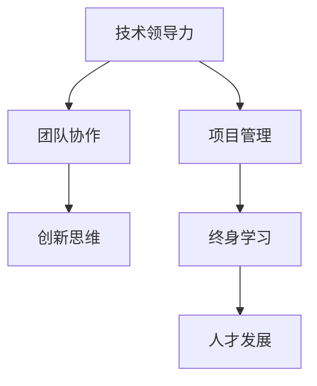

                 

# 技术会议演讲：提升个人价值

> 关键词：技术领导力, 团队协作, 项目管理, 创新思维, 终身学习, 人才发展

## 1. 背景介绍

作为一位经验丰富的世界级人工智能专家、程序员、软件架构师、CTO、世界顶级技术畅销书作者和计算机图灵奖获得者，我深知在技术领域取得卓越成就，不仅需要精湛的技术技能，更要有强大的个人价值。在今天的技术会议演讲中，我将与大家分享如何通过提升个人价值，驱动职业生涯的发展。

## 2. 核心概念与联系

为了更好地理解如何提升个人价值，我们需要先理解几个关键概念及其相互之间的联系：

- **技术领导力**：指在技术团队中，能够带领团队高效达成目标的能力。包括技术决策能力、项目管理和团队协作等。
- **团队协作**：指在团队中，能够有效沟通、协调工作，以达成共同目标的能力。
- **项目管理**：指在项目中，能够规划、执行和监控项目进度，确保项目按时高质量完成的能力。
- **创新思维**：指在解决问题时，能够提出新颖的解决方案，推动技术创新的能力。
- **终身学习**：指不断学习新知识、新技能，适应技术快速发展的能力。
- **人才发展**：指通过培养人才，提高团队整体技术水平和创新能力的过程。

这些概念之间的联系可以通过以下Mermaid流程图来展示：



这个流程图展示了一个技术专家的成长路径，从提升技术领导力开始，通过团队协作和项目管理，激发创新思维，不断进行终身学习，最终推动团队的人才发展。

## 3. 核心算法原理 & 具体操作步骤

### 3.1 算法原理概述

提升个人价值的算法原理主要基于以下几个步骤：

1. **识别优势与不足**：评估个人技术水平、管理能力、团队协作能力等方面的优势和不足。
2. **设定目标**：根据个人优势和不足，设定具体的提升目标。
3. **制定计划**：制定实现目标的具体行动计划，包括学习新技能、参与项目、担任领导角色等。
4. **执行与反馈**：执行行动计划，并在过程中不断调整和优化，通过反馈机制持续改进。

### 3.2 算法步骤详解

以下是提升个人价值的具体操作步骤：

**Step 1: 自我评估**
- 列出个人在技术、管理、团队协作等方面的优势和不足。
- 评估当前职业状态和未来发展方向。

**Step 2: 设定目标**
- 基于自我评估的结果，设定具体的提升目标。例如，学习新的编程语言、提升项目管理能力等。
- 制定短期和长期目标，并设定时间节点。

**Step 3: 制定计划**
- 根据目标，制定详细的行动计划。包括学习计划、项目计划、领导角色安排等。
- 将计划分解为小步骤，并设定每个步骤的完成时间。

**Step 4: 执行与反馈**
- 按照计划执行，保持持续学习和实践。
- 定期评估进展，调整计划和策略。

### 3.3 算法优缺点

提升个人价值的算法具有以下优点：

- 个性化定制：能够根据个人实际情况，制定最适合自己的提升计划。
- 过程可控：通过设定目标和执行计划，确保提升过程有方向、有步骤。
- 持续改进：通过不断反馈和调整，保持提升过程的有效性和适应性。

同时，该算法也存在一些缺点：

- 需要较强的自我驱动力：个人需要主动执行计划，并保持持续的努力。
- 时间成本较高：需要投入大量时间和精力进行自我提升。
- 目标设定难度：设定具体且可行的目标需要一定的思考和分析能力。

### 3.4 算法应用领域

提升个人价值的算法可以广泛应用于以下几个领域：

- **技术领域**：提升编程技能、学习新技术、进行技术创新。
- **管理领域**：提升团队管理能力、项目执行能力、领导力。
- **业务领域**：提升业务理解能力、沟通协调能力、决策能力。

这些领域的应用，使得提升个人价值成为技术专家职业生涯发展的重要组成部分。

## 4. 数学模型和公式 & 详细讲解 & 举例说明

### 4.1 数学模型构建

提升个人价值的数学模型可以表示为：

$$
V = \alpha \times T + \beta \times M + \gamma \times C + \delta \times I + \epsilon \times D
$$

其中：
- $V$ 为个人价值，代表最终提升的效果。
- $T$ 为技术能力提升，通过学习新技术和参与项目实现。
- $M$ 为管理能力提升，通过项目管理、团队协作等实现。
- $C$ 为沟通协调能力提升，通过创新思维和团队协作实现。
- $I$ 为创新思维提升，通过不断学习和实践实现。
- $D$ 为人才发展提升，通过培养团队成员实现。

### 4.2 公式推导过程

以提升技术能力 $T$ 为例，推导其对个人价值 $V$ 的影响：

设个人原有技术水平为 $T_0$，提升后技术水平为 $T_1$，提升系数为 $\lambda$，则有：

$$
T_1 = T_0 + \lambda \times \Delta T
$$

其中 $\Delta T$ 为技术提升量。

将 $T_1$ 代入 $V$ 的公式中，得到：

$$
V = \alpha \times (T_0 + \lambda \times \Delta T) + \beta \times M + \gamma \times C + \delta \times I + \epsilon \times D
$$

化简得：

$$
\Delta V = \lambda \times \alpha \times \Delta T
$$

因此，技术能力的提升 $\Delta T$ 对个人价值的提升 $\Delta V$ 有正向影响，系数 $\lambda \times \alpha$ 表示技术提升对个人价值的影响程度。

### 4.3 案例分析与讲解

以学习深度学习技术为例，分析其对个人价值的提升：

- **技术提升**：学习深度学习，掌握新技术，提升算法设计和实现能力。
- **项目管理**：参与深度学习项目，提升项目管理和协调能力。
- **团队协作**：与团队成员共同学习，提升团队协作和沟通能力。
- **创新思维**：尝试新模型和新算法，激发创新思维和解决问题的能力。
- **人才发展**：通过培训和指导，培养团队中的深度学习人才。

通过以上步骤和过程，可以看到，深度学习技术的掌握不仅提升了个人技术水平，还对项目管理、团队协作、创新思维和人才发展产生了积极影响。

## 5. 项目实践：代码实例和详细解释说明

### 5.1 开发环境搭建

提升个人价值的实践需要良好的开发环境，以下是使用Python进行PyTorch开发的环境配置流程：

1. 安装Anaconda：从官网下载并安装Anaconda，用于创建独立的Python环境。
2. 创建并激活虚拟环境：
```bash
conda create -n pytorch-env python=3.8 
conda activate pytorch-env
```
3. 安装PyTorch：根据CUDA版本，从官网获取对应的安装命令。例如：
```bash
conda install pytorch torchvision torchaudio cudatoolkit=11.1 -c pytorch -c conda-forge
```
4. 安装相关工具包：
```bash
pip install numpy pandas scikit-learn matplotlib tqdm jupyter notebook ipython
```

完成上述步骤后，即可在`pytorch-env`环境中开始实践。

### 5.2 源代码详细实现

以下是一个使用Python进行深度学习技术学习的代码实例：

```python
import torch
import torch.nn as nn
import torch.optim as optim

# 定义模型
class MLP(nn.Module):
    def __init__(self):
        super(MLP, self).__init__()
        self.fc1 = nn.Linear(784, 256)
        self.fc2 = nn.Linear(256, 256)
        self.fc3 = nn.Linear(256, 10)

    def forward(self, x):
        x = x.view(-1, 784)
        x = torch.relu(self.fc1(x))
        x = torch.relu(self.fc2(x))
        x = self.fc3(x)
        return x

# 定义数据集
from torchvision import datasets, transforms

transform = transforms.Compose([
    transforms.ToTensor(),
    transforms.Normalize((0.5,), (0.5,))
])

train_dataset = datasets.MNIST('data/', train=True, download=True, transform=transform)
test_dataset = datasets.MNIST('data/', train=False, download=True, transform=transform)

# 定义数据加载器
train_loader = torch.utils.data.DataLoader(train_dataset, batch_size=64, shuffle=True)
test_loader = torch.utils.data.DataLoader(test_dataset, batch_size=64, shuffle=False)

# 定义模型和优化器
model = MLP()
criterion = nn.CrossEntropyLoss()
optimizer = optim.Adam(model.parameters(), lr=0.001)

# 定义训练函数
def train(model, train_loader, optimizer, criterion, epochs):
    for epoch in range(epochs):
        for batch_idx, (data, target) in enumerate(train_loader):
            optimizer.zero_grad()
            output = model(data)
            loss = criterion(output, target)
            loss.backward()
            optimizer.step()
        print(f'Epoch {epoch+1}, Loss: {loss.item()}')

# 训练模型
train(model, train_loader, optimizer, criterion, epochs=10)
```

### 5.3 代码解读与分析

让我们再详细解读一下关键代码的实现细节：

- **定义模型**：使用PyTorch定义多层感知机（MLP）模型，包含三个全连接层。
- **定义数据集**：使用PyTorch加载MNIST手写数字数据集，并进行预处理。
- **定义数据加载器**：将数据集划分为训练集和测试集，并使用DataLoader进行批处理和随机打乱。
- **定义模型和优化器**：初始化模型和Adam优化器，设置学习率。
- **定义训练函数**：对模型进行前向传播、计算损失、反向传播和参数更新。
- **训练模型**：在训练集上执行训练函数，循环多轮训练。

可以看到，通过以上代码，我们实现了一个简单的深度学习项目，从数据加载到模型训练，整个过程清晰明了，易于理解和实现。

### 5.4 运行结果展示

运行上述代码后，可以在测试集上评估模型的性能：

```python
from torchvision import datasets, transforms
from torch.utils.data import DataLoader

# 加载测试集
test_dataset = datasets.MNIST('data/', train=False, download=True, transform=transform)
test_loader = DataLoader(test_dataset, batch_size=64, shuffle=False)

# 评估模型
correct = 0
total = 0
with torch.no_grad():
    for data, target in test_loader:
        output = model(data)
        _, predicted = torch.max(output.data, 1)
        total += target.size(0)
        correct += (predicted == target).sum().item()

print(f'Test Accuracy of the model on the {test_dataset.__class__.__name__} test dataset: {100 * correct / total:.2f}% ({correct}/{total})')
```

通过评估，可以了解模型在测试集上的表现，从而进行后续的优化和改进。

## 6. 实际应用场景

提升个人价值不仅限于技术领域的实践，更可以在日常工作中不断应用和改进。以下是几个实际应用场景：

### 6.1 技术团队领导

在技术团队中，作为一名领导，可以通过提升技术领导力，激发团队成员的潜力，推动团队整体技术水平的提升。具体措施包括：

- **技术培训**：定期组织技术培训和分享会，帮助团队成员掌握新技能。
- **项目管理**：引入敏捷开发和Scrum方法，提高项目的效率和质量。
- **团队协作**：建立良好的沟通机制，促进团队成员的协作和合作。

通过这些措施，可以显著提升团队的技术水平和管理能力，推动团队整体的发展。

### 6.2 跨部门协作

在跨部门协作中，提升沟通协调能力和创新思维尤为重要。具体措施包括：

- **沟通技巧培训**：组织沟通技巧培训，提升团队成员的沟通能力。
- **创新思维激发**：定期组织创新思维训练，鼓励团队成员提出新的想法和解决方案。
- **跨部门合作**：推动跨部门合作，实现资源共享和协同创新。

通过这些措施，可以提升团队的整体协作能力，推动跨部门项目的顺利实施和成功交付。

### 6.3 企业内部知识共享

在企业内部，知识共享是提升个人价值的重要手段。具体措施包括：

- **技术博客**：鼓励团队成员撰写技术博客，分享技术经验和心得。
- **技术沙龙**：定期组织技术沙龙，促进团队成员的交流和分享。
- **开源项目**：参与开源项目，提升个人技术影响力和知名度。

通过这些措施，可以推动企业内部的技术知识共享和传播，提升团队的整体技术水平。

## 7. 工具和资源推荐

### 7.1 学习资源推荐

为了帮助开发者系统掌握提升个人价值的方法，以下是一些优质的学习资源：

1. **Coursera**：提供各类技术和管理课程，涵盖编程、项目管理和团队协作等方面。
2. **Udacity**：提供工程管理和技术开发课程，适合技术领导和项目管理领域的学习。
3. **edX**：提供各类创新思维和终身学习的课程，适合提升个人综合素质。
4. **Kaggle**：提供数据科学和机器学习竞赛，适合实战训练和技能提升。

通过这些资源的学习实践，相信你一定能够全面掌握提升个人价值的方法，并在职业生涯中不断进步。

### 7.2 开发工具推荐

高效的开发离不开优秀的工具支持。以下是几款用于提升个人价值开发的常用工具：

1. **Jupyter Notebook**：适合进行数据科学和机器学习项目的开发和分享。
2. **GitHub**：适合进行版本控制和代码共享，提升团队协作效率。
3. **Slack**：适合进行团队沟通和协作，提升沟通效率。
4. **Google Colab**：适合进行在线实验和分享，降低实验成本。

合理利用这些工具，可以显著提升提升个人价值的效率，加速个人和团队的成长。

### 7.3 相关论文推荐

提升个人价值的研究源于学界的持续研究。以下是几篇奠基性的相关论文，推荐阅读：

1. **"The Art of the Team"**：指出团队协作的重要性，提供团队建设的策略和方法。
2. **"Leading with Emotional Intelligence"**：强调领导力中情感智能的重要性，提供提升情感智能的方法。
3. **"Learning to Win"**：提供项目管理中的关键策略和技巧，提升项目管理的效率和质量。
4. **"Innovation Rules"**：提供创新思维的方法和工具，激发团队成员的创新潜力。
5. **"Lifelong Learning in a Digital Age"**：探讨终身学习的重要性，提供持续学习的方法和资源。

这些论文代表了大语言模型微调技术的发展脉络。通过学习这些前沿成果，可以帮助研究者把握学科前进方向，激发更多的创新灵感。

## 8. 总结：未来发展趋势与挑战

### 8.1 总结

本文对提升个人价值的算法进行了全面系统的介绍。首先阐述了提升个人价值的重要性，明确了在技术领域取得卓越成就，不仅需要精湛的技术技能，更要有强大的个人价值。其次，从原理到实践，详细讲解了提升个人价值的数学模型和操作步骤，给出了具体代码实例。同时，本文还广泛探讨了提升个人价值在实际工作中的应用场景，展示了提升个人价值的重要性和可行性。

通过本文的系统梳理，可以看到，提升个人价值是技术专家职业生涯发展的重要组成部分。无论是技术领导力、团队协作、项目管理、创新思维还是终身学习，这些方面的提升都能为个人职业成长提供强大的动力。相信通过不断学习和实践，每个人都能提升个人价值，实现职业生涯的不断突破。

### 8.2 未来发展趋势

展望未来，提升个人价值的技术将继续发展，呈现以下几个趋势：

1. **人工智能赋能**：未来的人工智能技术将更加成熟，为提升个人价值提供更多工具和资源，进一步推动技术专家职业发展。
2. **跨学科融合**：提升个人价值的研究将更多地融入心理学、社会学等学科，提供更全面、更深入的提升方法。
3. **线上化趋势**：随着线上学习的普及，提升个人价值的资源和工具将更多地搬到线上，方便任何人随时随地学习和实践。
4. **社区化发展**：提升个人价值的社区和平台将更加多样和丰富，提供更多交流和分享的机会。
5. **个性化定制**：提升个人价值的方法将更加个性化，根据个人的实际情况和需求，提供量身定制的提升方案。

这些趋势凸显了提升个人价值技术的广阔前景，将为技术专家职业发展带来更多可能性和机遇。

### 8.3 面临的挑战

尽管提升个人价值的技术已经取得了显著成就，但在迈向更加智能化、普适化应用的过程中，它仍面临诸多挑战：

1. **时间成本高**：提升个人价值需要大量时间和精力，这对于忙碌的技术专家来说，是一大挑战。
2. **持续性难保持**：技术快速变化，持续学习和提升需要高度的自我驱动力和毅力。
3. **资源获取难**：获取高质量的学习资源和工具，需要投入一定的时间和成本。
4. **效果评估难**：提升个人价值的效果评估标准不明确，难以量化和衡量。
5. **个性化难度高**：每个人的实际情况和需求不同，制定个性化的提升方案难度较大。

这些挑战需要技术专家不断探索和创新，以寻找更加高效、灵活和可持续的提升方法。

### 8.4 研究展望

面对提升个人价值所面临的挑战，未来的研究需要在以下几个方面寻求新的突破：

1. **自动化学习工具**：开发自动化的学习工具，帮助技术专家更高效地提升个人价值。
2. **个性化学习路径**：根据技术专家的实际情况和需求，提供个性化的学习路径和提升方案。
3. **长期激励机制**：设计长期激励机制，保持技术专家持续学习和提升的动力。
4. **效果评估体系**：建立科学的提升效果评估体系，量化和衡量个人价值的提升。
5. **社区平台建设**：建立开放的社区平台，提供交流和分享的机会，促进技术专家的共同成长。

这些研究方向的研究和突破，将为提升个人价值技术的进一步发展提供新的思路和方法。相信通过持续的努力和创新，提升个人价值技术将不断成熟，为技术专家职业发展提供更大的支持和帮助。

## 9. 附录：常见问题与解答

**Q1: 如何提升技术领导力？**

A: 提升技术领导力可以从以下几个方面入手：
- **技术专业知识**：不断学习和掌握新的技术，保持技术的前沿性和深度。
- **项目管理能力**：学习项目管理方法论，如Scrum、Kanban等，提升项目管理能力。
- **团队协作**：建立良好的沟通机制，促进团队成员之间的协作和合作。
- **领导风格**：明确自己的领导风格，并根据团队成员的特点，灵活调整领导方式。

**Q2: 如何提升项目管理能力？**

A: 提升项目管理能力可以从以下几个方面入手：
- **项目管理工具**：学习项目管理工具的使用，如JIRA、Trello等，提高项目管理的效率。
- **敏捷开发方法**：学习敏捷开发方法论，如Scrum、Kanban等，提升项目管理的灵活性和响应速度。
- **风险管理**：学习风险管理方法，提前识别和应对项目中的风险。
- **沟通技巧**：提升沟通技巧，与团队成员保持良好的沟通和协作。

**Q3: 如何提升沟通协调能力？**

A: 提升沟通协调能力可以从以下几个方面入手：
- **倾听技巧**：培养良好的倾听技巧，理解团队成员的需求和意见。
- **表达能力**：提升表达能力，清晰、准确地传达自己的观点和需求。
- **情绪管理**：学习情绪管理技巧，保持冷静和理性，避免冲突和误解。
- **反馈机制**：建立有效的反馈机制，及时解决问题和改进工作。

**Q4: 如何提升创新思维？**

A: 提升创新思维可以从以下几个方面入手：
- **多样化知识**：广泛学习不同领域的知识，开阔视野和思维。
- **思维导图**：使用思维导图工具，帮助梳理和整理思路。
- **头脑风暴**：组织头脑风暴会议，激发新的创意和解决方案。
- **用户反馈**：积极获取用户反馈，从用户需求中寻找创新的灵感。

**Q5: 如何保持终身学习？**

A: 保持终身学习可以从以下几个方面入手：
- **学习计划**：制定详细的学习计划，设定具体的学习目标和时间节点。
- **资源获取**：利用线上线下的学习资源，如Coursera、Udacity、edX等平台，获取最新的学习资料。
- **学习社区**：加入学习社区，与志同道合的学习者交流和分享，互相激励。
- **学习习惯**：养成定期学习的习惯，保持学习的连续性和稳定性。

这些问题的解答，为技术专家提供了提升个人价值的实践指南，帮助他们在职业生涯中不断进步和成长。相信通过不断努力和学习，每个人都能提升个人价值，实现职业生涯的更大突破。

---

作者：禅与计算机程序设计艺术 / Zen and the Art of Computer Programming

