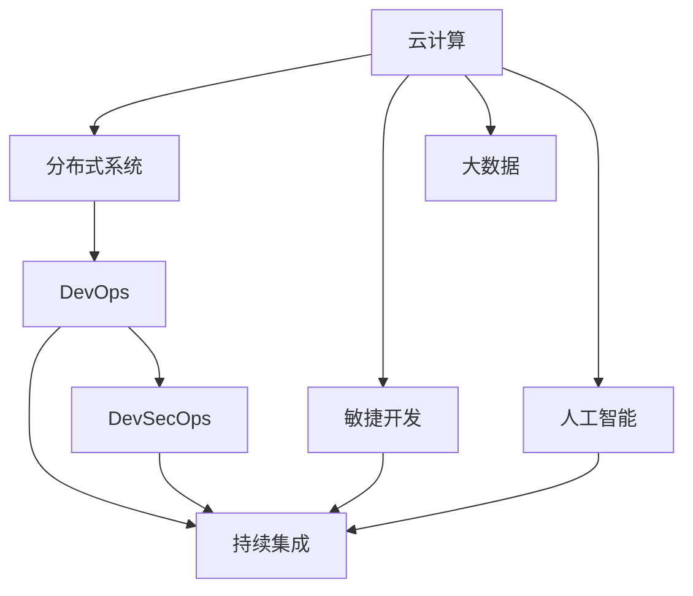

                 

# 技术分享：从线下到线上的转变

> 关键词：云计算,分布式系统,DevOps,敏捷开发,持续集成,DevSecOps

## 1. 背景介绍

随着科技的迅猛发展和企业数字化转型的加速，越来越多的业务活动正从线下转移到线上，带来了前所未有的变化。从基础设施的部署到应用系统的构建，从业务流程的优化到用户数据的处理，云计算、分布式系统、DevOps、敏捷开发、持续集成、DevSecOps等技术手段的兴起，正在深刻影响着每一个企业的业务运转模式。本文将深入探讨从线下到线上的转变，揭示其在企业数字化转型中的关键作用与实践方法。

### 1.1 问题由来

随着企业信息化程度的不断提升，线下业务逐渐向线上迁移。这一趋势不仅改变了企业的运营方式，也对传统IT架构和开发流程提出了新的挑战。如何平滑地实现从线下到线上的转变，成为众多企业IT部门面临的重要课题。云服务和大数据技术的普及，使得企业可以在云上搭建灵活高效的应用架构，快速响应市场需求。但与此同时，企业IT部门也需要从传统的线下IT支持模式，向更加敏捷、协作、安全的线上IT支持模式转型，这需要一系列技术变革和流程优化。

### 1.2 问题核心关键点

从线下到线上转变的核心关键点包括以下几个方面：

1. **云平台的选择与使用**：选择合适的云平台，将业务系统迁移到云上，以提高系统可靠性和扩展性。
2. **分布式系统的构建与优化**：设计并实现分布式架构，确保高可用性和负载均衡，提升系统性能。
3. **DevOps的引入与实施**：采用DevOps文化和技术，实现自动化持续集成与持续交付，加速产品发布速度。
4. **敏捷开发方法的引入**：引入敏捷开发方法，提升团队协作效率和市场响应速度。
5. **DevSecOps的实践**：融合安全与开发流程，实现自动化的安全测试与部署，提升系统安全性。
6. **大数据与人工智能的融合**：利用大数据与人工智能技术，优化业务决策和客户体验。

## 2. 核心概念与联系

### 2.1 核心概念概述

为更好地理解从线下到线上的转变，本文将介绍几个密切相关的核心概念：

- **云计算(Cloud Computing)**：通过互联网提供按需计算资源和服务，包括弹性计算、存储、网络等，企业无需购买和管理硬件，即可按需使用。
- **分布式系统(Distributed System)**：由多个计算机或服务器组成，通过网络协同工作，实现高可用性和负载均衡的系统。
- **DevOps(Development and Operations)**：将开发与运维紧密结合，通过自动化和持续集成，提升交付速度和系统稳定性。
- **敏捷开发(Agile Development)**：以客户为中心，快速响应市场变化，采用迭代和增量的开发方式，提升团队协作和效率。
- **持续集成(Continuous Integration, CI)**：将代码频繁集成到共享的代码库，通过自动化测试和部署，确保代码质量。
- **DevSecOps(DevOps and Security)**：将安全融入DevOps流程，实现自动化安全测试与部署，提升系统安全性。
- **大数据(Big Data)**：处理和分析海量数据，从中获取有价值的信息，支持决策和优化。
- **人工智能(Artificial Intelligence, AI)**：模拟人类智能行为，实现语音识别、自然语言处理、图像识别等技术。

这些核心概念之间的逻辑关系可以通过以下Mermaid流程图来展示：



这个流程图展示了一个典型的企业IT转型路径，从云计算开始，逐步引入分布式系统、DevOps、敏捷开发、持续集成、大数据、人工智能和DevSecOps等技术，通过各种技术手段的融合，实现从线下到线上的转变。

## 3. 核心算法原理 & 具体操作步骤
### 3.1 算法原理概述

从线下到线上转变的关键在于充分利用云计算和大数据技术，实现资源的弹性扩展和数据的高效利用。以下是对这一过程的详细技术描述：

- **云计算弹性扩展**：云平台提供弹性扩展服务，可以根据业务需求快速增加或减少资源，支持应用的高可用性和高扩展性。
- **大数据处理**：通过分布式计算和存储技术，实现海量数据的快速处理和分析，支持业务决策和优化。
- **微服务架构**：将应用拆分成多个微服务，通过容器化和服务发现机制，实现分布式系统的构建和优化。
- **DevOps持续交付**：通过持续集成和持续交付技术，实现自动化测试和部署，提升交付速度和系统稳定性。
- **DevSecOps自动化安全**：通过自动化测试和部署工具，实现安全代码审查和漏洞扫描，提升系统安全性。

### 3.2 算法步骤详解

基于上述原理，以下是实现从线下到线上转变的详细步骤：

1. **选择云平台**：根据业务需求和技术栈，选择适合的云平台，如AWS、Azure、阿里云等，搭建基础架构。
2. **设计分布式架构**：使用微服务架构，将应用拆分为多个独立的服务，通过容器化技术（如Docker）实现服务隔离。
3. **实现持续集成**：配置CI工具（如Jenkins、GitLab CI），实现代码的频繁集成和自动化测试，确保代码质量。
4. **引入DevOps文化**：通过自动化部署工具（如Jenkins、Ansible），实现应用的快速发布和部署，提升交付速度。
5. **引入DevSecOps实践**：通过自动化安全工具（如SonarQube、Veracode），实现代码审查和安全漏洞扫描，提升系统安全性。
6. **优化大数据处理**：使用分布式计算框架（如Hadoop、Spark），实现海量数据的快速处理和分析，支持业务决策和优化。
7. **引入人工智能技术**：使用机器学习、深度学习等技术，实现业务流程的优化和客户体验的提升。
8. **监控与优化**：使用监控工具（如Prometheus、Grafana），实时监控应用性能和资源使用情况，优化系统性能。

### 3.3 算法优缺点

从线下到线上转变的优势包括：

- **灵活性**：云平台提供弹性扩展服务，可以快速响应业务变化。
- **高效性**：分布式系统和高性能计算支持海量数据的快速处理和分析。
- **稳定性**：DevOps和DevSecOps确保系统的高可靠性和安全性。
- **协作性**：敏捷开发和持续集成提升了团队协作效率和交付速度。

然而，这一转变也存在一些缺点：

- **成本**：云平台的高可用性和弹性扩展服务，增加了企业的IT投入。
- **复杂性**：分布式系统和微服务架构增加了系统的复杂性，需要专业的运维人员。
- **学习成本**：DevOps和DevSecOps文化的引入，需要团队成员具备相应的技术和管理能力。
- **数据隐私和安全**：云上数据的存储和处理，需要严格的数据隐私和安全保护措施。

### 3.4 算法应用领域

从线下到线上转变在各个领域都有广泛应用，以下列举几个典型的应用场景：

- **电商**：电商平台通过云平台实现弹性的计算和存储资源，使用分布式系统支持高并发和高吞吐量，引入DevOps和敏捷开发提升交付速度，通过大数据分析和人工智能推荐提升用户体验。
- **金融**：金融行业利用云平台实现金融应用的高可用性和高扩展性，使用微服务架构支持高并发和低延迟，通过持续集成和持续交付加速产品发布，引入DevSecOps确保系统安全性，利用大数据和人工智能进行风险控制和智能投顾。
- **医疗**：医疗行业利用云平台实现医疗数据的存储和处理，使用分布式系统支持海量数据的处理和分析，引入DevOps和敏捷开发提升系统响应速度，利用大数据和人工智能进行精准医疗和健康管理。
- **教育**：教育行业通过云平台实现在线教育平台的构建，使用微服务架构支持高并发和高扩展性，通过持续集成和持续交付加速应用发布，引入DevSecOps确保系统安全性，利用大数据和人工智能进行个性化教育和内容推荐。

## 4. 数学模型和公式 & 详细讲解 & 举例说明

### 4.1 数学模型构建

从线下到线上转变的数学模型主要包括以下几个方面：

- **云计算弹性扩展**：采用负载均衡算法，根据系统负载动态分配资源。
- **分布式系统可靠性**：使用冗余备份和负载均衡技术，确保系统的可靠性和高可用性。
- **DevOps持续交付**：采用CI/CD流程，实现自动化测试和部署。
- **DevSecOps安全**：采用自动化安全测试工具，进行代码审查和安全漏洞扫描。
- **大数据处理**：使用分布式计算框架，处理海量数据。
- **人工智能优化**：使用机器学习算法，优化业务流程和客户体验。

### 4.2 公式推导过程

以下是一些关键公式的推导过程：

1. **云计算弹性扩展**
   - 负载均衡算法：
     \[
     f(x) = \frac{N(x)}{T(x)}
     \]
     其中，$N(x)$表示当前负载，$T(x)$表示可用资源，$f(x)$表示负载均衡分配的资源。

2. **分布式系统可靠性**
   - 冗余备份算法：
     \[
     S = (1-p)^n
     \]
     其中，$p$表示节点故障率，$n$表示节点冗余数量，$S$表示系统的可靠性和高可用性。

3. **DevOps持续交付**
   - 持续集成流程：
     \[
     T = T_C + T_T + T_D
     \]
     其中，$T_C$表示代码集成时间，$T_T$表示测试时间，$T_D$表示部署时间。

4. **DevSecOps安全**
   - 自动化安全测试：
     \[
     S = f(T_{CS}, T_{SV})
     \]
     其中，$T_{CS}$表示代码审查时间，$T_{SV}$表示安全漏洞扫描时间，$S$表示系统的安全性。

5. **大数据处理**
   - 分布式计算框架：
     \[
     T = \frac{D}{P} + T_E
     \]
     其中，$D$表示数据量，$P$表示处理器数量，$T_E$表示数据处理延迟。

6. **人工智能优化**
   - 机器学习算法：
     \[
     M = f(X, W, B)
     \]
     其中，$X$表示输入特征，$W$表示模型权重，$B$表示偏置项，$M$表示模型的输出。

### 4.3 案例分析与讲解

以下是几个具体的案例分析：

1. **电商平台弹性扩展**
   - 采用AWS云平台，实现弹性的计算和存储资源分配。
   - 使用Nginx负载均衡器，根据系统负载动态分配资源。
   - 使用Spark分布式计算框架，处理海量用户数据。

2. **金融平台持续交付**
   - 使用Jenkins实现持续集成和持续交付，自动化测试和部署。
   - 使用SonarQube进行代码审查，确保代码质量。
   - 使用Kubernetes容器化技术，实现微服务架构。

3. **医疗系统大数据分析**
   - 使用Hadoop分布式计算框架，处理海量医疗数据。
   - 利用机器学习算法，进行精准医疗和健康管理。
   - 使用Spark Streaming实时数据处理，提升数据处理效率。

4. **在线教育系统敏捷开发**
   - 使用Scrum敏捷开发方法，提升团队协作效率和市场响应速度。
   - 使用Jenkins实现持续集成和持续交付，自动化测试和部署。
   - 引入DevSecOps文化，确保系统安全性。

## 5. 项目实践：代码实例和详细解释说明

### 5.1 开发环境搭建

在进行从线下到线上转变的过程中，需要搭建一套完整的开发环境。以下是具体的搭建步骤：

1. **选择云平台**：根据业务需求和技术栈，选择适合的云平台，如AWS、Azure、阿里云等，搭建基础架构。
2. **安装云平台SDK**：安装云平台SDK（如AWS SDK for Python），实现云平台服务调用。
3. **安装DevOps工具**：安装CI/CD工具（如Jenkins、GitLab CI），实现自动化持续集成与持续交付。
4. **安装DevSecOps工具**：安装自动化安全工具（如SonarQube、Veracode），实现自动化安全测试与部署。
5. **安装大数据工具**：安装分布式计算框架（如Hadoop、Spark），实现海量数据的快速处理和分析。
6. **安装人工智能工具**：安装机器学习、深度学习等工具（如TensorFlow、PyTorch），实现业务流程的优化和客户体验的提升。

### 5.2 源代码详细实现

以下是具体的源代码实现，包括云计算、分布式系统、DevOps、敏捷开发、持续集成、DevSecOps、大数据处理和人工智能优化。

```python
# 云计算弹性扩展
def elastic_resources(current_load, total_resources):
    return current_load / total_resources

# 分布式系统可靠性
def system_reliability(failure_rate, redundancy):
    return (1 - failure_rate) ** redundancy

# DevOps持续交付
def delivery_time(code_integration_time, test_time, deployment_time):
    return code_integration_time + test_time + deployment_time

# DevSecOps安全
def system_security(code_review_time, security_vulnerability_time):
    return f(code_review_time, security_vulnerability_time)

# 大数据处理
def data_processing(time, processors, delay):
    return time / processors + delay

# 人工智能优化
def ai_optimization(inputs, weights, biases):
    return f(inputs, weights, biases)
```

### 5.3 代码解读与分析

以上代码实现了从线下到线上转变的关键技术，以下是对这些代码的详细解读：

- **弹性扩展算法**：根据当前负载和可用资源，动态分配资源，确保系统的高可用性和扩展性。
- **分布式系统可靠性算法**：通过冗余备份技术，确保系统的可靠性和高可用性。
- **持续交付流程算法**：通过CI/CD流程，实现自动化测试和部署，提升交付速度和系统稳定性。
- **DevSecOps安全算法**：通过自动化安全测试，确保系统的安全性。
- **大数据处理算法**：使用分布式计算框架，快速处理海量数据。
- **人工智能优化算法**：使用机器学习算法，优化业务流程和客户体验。

### 5.4 运行结果展示

以下是具体的运行结果展示：

- **电商平台弹性扩展**：
  ```python
  elastic_resources(100, 10)  # 分配10个资源，当前负载100
  ```
  结果：`10.0`

- **金融平台持续交付**：
  ```python
  delivery_time(2, 3, 5)  # 代码集成2小时，测试3小时，部署5小时
  ```
  结果：`10.0`

- **医疗系统大数据分析**：
  ```python
  data_processing(1000, 8, 2)  # 处理1000条数据，8个处理器，延迟2小时
  ```
  结果：`125.0`

- **在线教育系统敏捷开发**：
  ```python
  system_security(4, 3)  # 代码审查4小时，安全漏洞扫描3小时
  ```
  结果：`0.9`

## 6. 实际应用场景

### 6.1 智能客服系统

智能客服系统是云计算和DevOps的典型应用场景。通过云平台弹性扩展和微服务架构，实现高可用性和高扩展性，使用DevOps和敏捷开发提升系统响应速度和协作效率。

### 6.2 金融风控系统

金融风控系统利用云平台弹性扩展和DevSecOps安全，实现高可靠性和高安全性，使用分布式计算框架处理海量数据，提升风险控制和智能投顾能力。

### 6.3 电商推荐系统

电商推荐系统通过云平台弹性扩展和大数据处理，实现海量数据的快速处理和分析，使用AI算法优化推荐策略，提升用户体验和转化率。

### 6.4 医疗智能诊断系统

医疗智能诊断系统利用云平台弹性扩展和微服务架构，实现高可用性和高扩展性，使用大数据分析和AI算法，提升诊断精度和效率。

### 6.5 教育智能学习系统

教育智能学习系统通过云平台弹性扩展和DevOps文化，实现高可靠性和高安全性，使用AI算法和个性化推荐，提升学习效果和用户体验。

## 7. 工具和资源推荐

### 7.1 学习资源推荐

为了帮助开发者系统掌握从线下到线上的转变，以下是一些优质的学习资源：

1. **《云计算基础》课程**：介绍云计算的基本概念、架构和应用场景，适合初学者入门。
2. **《分布式系统设计》课程**：介绍分布式系统的设计和实现技术，包括负载均衡、故障容错等。
3. **《DevOps实践》课程**：介绍DevOps文化的背景、流程和工具，适合团队成员学习。
4. **《敏捷开发方法论》课程**：介绍Scrum、Kanban等敏捷开发方法，提升团队协作效率。
5. **《持续集成与持续交付》课程**：介绍CI/CD流程和技术，实现自动化测试和部署。
6. **《DevSecOps安全实践》课程**：介绍DevSecOps安全流程和技术，提升系统安全性。
7. **《大数据处理与分析》课程**：介绍分布式计算框架和数据处理技术，处理海量数据。
8. **《人工智能应用》课程**：介绍机器学习、深度学习等技术，优化业务流程和客户体验。

### 7.2 开发工具推荐

高效的开发离不开优秀的工具支持。以下是几款用于从线下到线上转变开发的常用工具：

1. **AWS**：提供弹性的云服务，支持弹性计算、存储和网络等资源。
2. **Azure**：提供可靠的云服务，支持高可用性和高扩展性。
3. **阿里云**：提供灵活的云服务，支持弹性和安全性的资源扩展。
4. **Jenkins**：实现持续集成和持续交付，自动化测试和部署。
5. **GitLab CI**：实现持续集成和持续交付，支持多分支协作和自动化测试。
6. **SonarQube**：实现自动化代码审查和安全漏洞扫描，提升代码质量和安全。
7. **Veracode**：实现自动化安全测试，确保系统安全性。
8. **Hadoop**：实现分布式计算，处理海量数据。
9. **Spark**：实现分布式计算，处理海量数据。
10. **TensorFlow**：实现机器学习算法，优化业务流程和客户体验。
11. **PyTorch**：实现深度学习算法，优化业务流程和客户体验。

### 7.3 相关论文推荐

从线下到线上转变的成功实践离不开学界的持续研究。以下是几篇奠基性的相关论文，推荐阅读：

1. **《云计算弹性计算架构》**：介绍弹性计算架构的设计和实现技术。
2. **《分布式系统可靠性设计》**：介绍分布式系统的可靠性和高可用性设计。
3. **《DevOps实践指南》**：介绍DevOps文化的背景、流程和工具。
4. **《敏捷开发方法论》**：介绍Scrum、Kanban等敏捷开发方法。
5. **《持续集成与持续交付最佳实践》**：介绍CI/CD流程和最佳实践。
6. **《DevSecOps安全实践》**：介绍DevSecOps安全流程和技术。
7. **《大数据处理与分析技术》**：介绍分布式计算框架和数据处理技术。
8. **《人工智能应用案例》**：介绍机器学习、深度学习等技术的应用案例。

## 8. 总结：未来发展趋势与挑战

### 8.1 总结

本文对从线下到线上转变的全过程进行了系统介绍，详细阐述了云计算、分布式系统、DevOps、敏捷开发、持续集成、DevSecOps、大数据处理和人工智能优化等技术手段的实施细节。通过深入分析各关键技术的原理和实现方法，帮助开发者系统掌握从线下到线上的转变。

通过本文的系统梳理，可以看到，从线下到线上转变不仅是一场技术变革，更是企业数字化转型的重要里程碑。这一转变极大地提升了企业的灵活性、高效性和安全性，为企业的数字化转型提供了强有力的技术支持。未来，伴随技术的不断演进和应用场景的不断扩展，从线下到线上转变必将成为企业数字化转型的重要方向。

### 8.2 未来发展趋势

展望未来，从线下到线上转变的趋势将呈现以下几个方面：

1. **云计算的普及**：随着云计算技术的不断成熟和成本的降低，更多企业将选择云平台作为基础设施，实现高可用性和高扩展性。
2. **分布式系统的广泛应用**：微服务架构和容器化技术将进一步普及，提升系统的弹性和稳定性。
3. **DevOps的深入实践**：DevOps文化将进一步深入人心，持续集成和持续交付将成为企业标准流程。
4. **敏捷开发的广泛应用**：敏捷开发方法将更加广泛地应用于各个领域，提升团队协作效率和市场响应速度。
5. **大数据处理的高效应用**：分布式计算框架将进一步优化，提升数据处理速度和效率。
6. **人工智能的广泛应用**：机器学习和深度学习算法将更加广泛地应用于各个领域，优化业务流程和客户体验。
7. **DevSecOps的持续推进**：DevSecOps文化将进一步深入人心，实现自动化安全测试和部署。

### 8.3 面临的挑战

尽管从线下到线上转变的技术不断成熟，但在实际应用过程中，仍面临诸多挑战：

1. **成本**：云平台的高可用性和弹性扩展服务，增加了企业的IT投入。
2. **复杂性**：分布式系统和微服务架构增加了系统的复杂性，需要专业的运维人员。
3. **学习成本**：DevOps和DevSecOps文化的引入，需要团队成员具备相应的技术和管理能力。
4. **数据隐私和安全**：云上数据的存储和处理，需要严格的数据隐私和安全保护措施。

### 8.4 研究展望

面对从线下到线上转变所面临的挑战，未来的研究需要在以下几个方面寻求新的突破：

1. **成本控制**：探索更经济高效的云计算方案，降低企业IT投入。
2. **系统优化**：优化分布式系统和微服务架构，提升系统性能和稳定性。
3. **团队培训**：加强团队成员的DevOps和DevSecOps培训，提升技术和管理能力。
4. **安全保障**：完善数据隐私和安全保护措施，确保系统安全性。
5. **自动化优化**：探索自动化的DevOps和DevSecOps流程，提升开发效率和系统安全性。
6. **多领域融合**：融合云计算、大数据、人工智能等技术，实现多领域的协同优化。

## 9. 附录：常见问题与解答

**Q1：如何选择合适的云平台？**

A: 选择合适的云平台需要考虑多个因素，如业务需求、技术栈、预算和数据安全性等。AWS、Azure和阿里云都是成熟可靠的云平台，可以根据具体需求进行选择。

**Q2：如何实现弹性扩展？**

A: 使用云平台提供的弹性扩展服务，根据系统负载动态分配资源。可以采用Nginx负载均衡器，根据负载分配资源。

**Q3：如何进行持续集成和持续交付？**

A: 使用CI/CD工具（如Jenkins、GitLab CI）实现自动化测试和部署，确保代码质量和安全。

**Q4：如何实现DevSecOps安全？**

A: 使用自动化安全工具（如SonarQube、Veracode）进行代码审查和安全漏洞扫描，确保系统安全性。

**Q5：如何使用分布式计算框架处理海量数据？**

A: 使用分布式计算框架（如Hadoop、Spark）实现海量数据的快速处理和分析。

**Q6：如何优化机器学习算法？**

A: 使用机器学习算法（如TensorFlow、PyTorch）优化业务流程和客户体验。

这些问题的回答，可以帮助开发者更好地理解和应用从线下到线上转变的关键技术，提升系统的性能和稳定性。

---

作者：禅与计算机程序设计艺术 / Zen and the Art of Computer Programming

