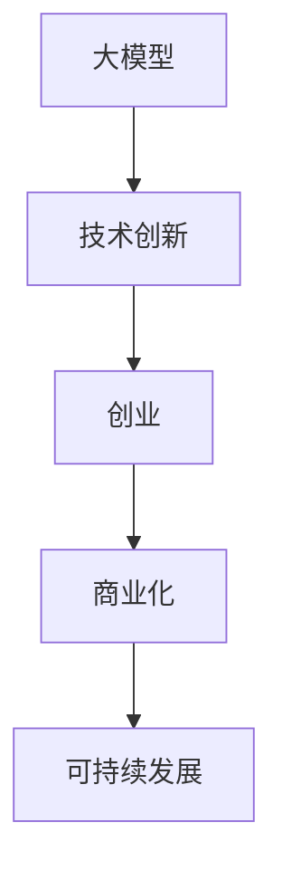

                 

# 技术创新：大模型创业的核心动力

> 关键词：大模型,创业,技术创新,商业化,可持续发展,人工智能

## 1. 背景介绍

### 1.1 问题由来
近年来，人工智能(AI)技术迅猛发展，成为推动科技创新的新引擎。尤其是深度学习大模型（Large Language Models, LLMs）的崛起，正在重塑产业格局，催生诸多新兴业态，成为人工智能创业领域的一片热土。大模型以其强大的泛化能力和广泛的应用潜力，吸引了众多科技创业者和资本的关注。

然而，创业成功并非易事。尽管大模型的潜力巨大，但在实际应用中仍面临诸多挑战。如算法、数据、工程、市场等多方面的问题，都需要深度思考和创新解决。本文旨在深入探讨技术创新在大模型创业中的核心动力和重要价值，以期为技术创业者提供有价值的参考和指导。

## 2. 核心概念与联系

### 2.1 核心概念概述

为更好地理解技术创新在大模型创业中的角色和意义，本节将介绍几个密切相关的核心概念：

- 大模型(Large Language Model, LLM)：指基于大规模深度学习模型，如BERT、GPT等，通过自监督或监督学习在大规模无标签或标注数据上进行预训练，具有强大语言理解和生成能力的模型。

- 技术创新(Technological Innovation)：指通过研发新技术、新方法、新产品，打破现状，推动产业变革的过程。技术创新是大模型创业成功的关键驱动力。

- 创业(Entrepreneurship)：指创业者通过创新的技术或商业模式，创建和管理企业，实现商业化的过程。

- 商业化(Commercialization)：指将创新的技术转化为实际应用，通过市场推广、产品迭代等手段，实现规模化、可持续发展的商业模式。

- 可持续发展(Sustainable Development)：指在商业化过程中，平衡经济效益、社会效益和生态效益，实现长期稳定发展。

这些核心概念之间的逻辑关系可以通过以下Mermaid流程图来展示：



这个流程图展示了技术创新在大模型创业过程中的核心地位。技术创新是大模型创业的基础，创业过程依靠技术创新驱动，而商业化过程则确保创新技术的实际应用和持续发展。

## 3. 核心算法原理 & 具体操作步骤
### 3.1 算法原理概述

技术创新在大模型创业中的核心作用，体现在算法、模型和架构的持续改进和创新。其核心原理是通过深入理解和不断探索，实现对大模型的优化和改进。

大模型通常基于深度神经网络，如Transformer，通过在大规模数据集上进行预训练，获得通用语言表示。这种通用表示不仅适用于自然语言处理(NLP)任务，还能应用于图像、语音等多种模态数据的处理。在大规模数据集上的预训练，使得大模型具备强大的泛化能力，能够适应各种下游任务。

然而，大模型的预训练和微调过程，仍面临诸多挑战。如过拟合、计算效率、模型解释性、安全性和可扩展性等。为了解决这些问题，技术创新聚焦于以下几个方面：

- 参数高效微调：通过只更新部分参数，提高微调效率，避免过拟合。
- 正则化和对抗训练：通过L2正则、Dropout、对抗样本等方式，增强模型的鲁棒性和泛化能力。
- 模型压缩和量化：通过剪枝、量化、蒸馏等方法，降低模型规模，提升推理速度和效率。
- 模型可解释性：通过可解释性技术，如Attention可视化、模型分解等，提高模型的可解释性和透明度。
- 安全性和隐私保护：通过数据脱敏、差分隐私等技术，保障模型使用的安全性和隐私保护。

### 3.2 算法步骤详解

技术创新在大模型创业中的应用，涉及算法、模型和架构的各个环节。以下详细讲解关键步骤：

**Step 1: 算法选择与优化**
- 选择合适的算法作为技术创新的起点，如Transformer、BERT等。
- 针对具体任务，设计任务适配层和损失函数，实现模型的微调。
- 通过正则化、Dropout等技术，防止模型过拟合。
- 引入对抗训练和对抗样本，提高模型的鲁棒性。
- 使用模型压缩和量化技术，优化模型规模和效率。

**Step 2: 模型训练与优化**
- 在训练过程中，采用合适的优化器和学习率调度策略，如AdamW、SGD等。
- 设置合适的超参数，如批大小、迭代轮数等。
- 使用数据增强和对抗训练等技术，提升模型泛化能力。
- 实时监控模型性能，根据验证集的表现调整模型参数。

**Step 3: 模型部署与优化**
- 将训练好的模型部署到实际应用场景中，如智能客服、金融舆情、个性化推荐等。
- 对模型进行裁剪和量化，提升推理速度和效率。
- 优化模型的API接口和服务架构，便于系统集成和扩展。
- 实时监控模型性能，进行持续优化和改进。

**Step 4: 商业化和可持续发展**
- 将模型转化为实际商业产品，通过市场推广实现商业化。
- 制定合理的商业模式，如SaaS、PaaS等，确保业务的可持续发展。
- 引入持续学习和在线优化技术，实现模型持续更新和迭代。
- 注重数据安全和隐私保护，构建可信的商业生态。

### 3.3 算法优缺点

技术创新在大模型创业中的应用，具有以下优点：
1. 推动模型性能提升。技术创新能够突破现有模型的局限性，实现更大的性能提升。
2. 提高商业化效率。创新的技术可以加速模型部署和应用，减少市场推广成本。
3. 增强模型鲁棒性。通过正则化、对抗训练等技术，提高模型对噪声和对抗样本的鲁棒性。
4. 提升可解释性。创新的可解释性技术，使得模型更加透明和可信。
5. 增强安全性。创新的安全技术，保障模型的数据隐私和安全。

同时，技术创新也存在一定的局限性：
1. 技术积累难度高。技术创新需要深厚的理论基础和丰富的实践经验，对创业者的要求较高。
2. 投资成本高。技术创新往往需要大量的研发投入，初期资金压力较大。
3. 市场需求不确定。创新的技术可能不适应市场，需要不断验证和迭代。
4. 技术迭代快。技术日新月异，创业者需要持续学习和跟进。
5. 竞争激烈。大模型创业领域竞争激烈，需要不断创新才能保持领先。

尽管存在这些局限性，但技术创新仍是大模型创业成功的核心驱动力。只有在算法、模型和架构的不断创新和优化中，才能实现大模型的商业化和可持续发展。

### 3.4 算法应用领域

技术创新在大模型创业中的应用，主要集中在以下几个领域：

1. 自然语言处理(NLP)：如文本分类、命名实体识别、关系抽取、问答系统等，通过模型压缩、可解释性技术提升模型性能。
2. 计算机视觉(CV)：如图像识别、目标检测、图像生成等，通过量化、模型蒸馏等技术提升推理速度和效率。
3. 语音识别(Speech Recognition)：如语音转文本、情感识别等，通过对抗训练、差分隐私等技术提高模型的鲁棒性和安全性。
4. 推荐系统：如商品推荐、个性化推荐等，通过模型压缩、在线优化等技术提升实时推荐能力。
5. 自动驾驶(Autonomous Driving)：如环境感知、行为决策等，通过模型融合、差分隐私等技术保障系统的安全性和隐私保护。
6. 医疗健康：如影像诊断、智能问诊等，通过模型压缩、可解释性技术提升医疗系统的精准性和可靠性。
7. 金融科技：如风险评估、智能投顾等，通过模型压缩、差分隐私等技术保障金融系统的安全性和隐私保护。

以上领域是大模型创业中技术创新的主要应用场景。通过在这些领域的持续探索和创新，大模型能够更好地服务于社会和经济，实现商业化应用。

## 4. 数学模型和公式 & 详细讲解 & 举例说明

### 4.1 数学模型构建

技术创新在大模型创业中的应用，可以通过数学模型进行深入讲解。以下构建一个基于Transformer的大模型微调框架。

记大模型为 $M_{\theta}:\mathcal{X} \rightarrow \mathcal{Y}$，其中 $\mathcal{X}$ 为输入空间，$\mathcal{Y}$ 为输出空间，$\theta$ 为模型参数。假设微调任务的训练集为 $D=\{(x_i,y_i)\}_{i=1}^N, x_i \in \mathcal{X}, y_i \in \mathcal{Y}$。

定义模型 $M_{\theta}$ 在输入 $x$ 上的损失函数为 $\ell(M_{\theta}(x),y)$，则在数据集 $D$ 上的经验风险为：

$$
\mathcal{L}(\theta) = \frac{1}{N} \sum_{i=1}^N \ell(M_{\theta}(x_i),y_i)
$$

微调的优化目标是最小化经验风险，即找到最优参数：

$$
\theta^* = \mathop{\arg\min}_{\theta} \mathcal{L}(\theta)
$$

在实践中，我们通常使用基于梯度的优化算法（如SGD、Adam等）来近似求解上述最优化问题。设 $\eta$ 为学习率，$\lambda$ 为正则化系数，则参数的更新公式为：

$$
\theta \leftarrow \theta - \eta \nabla_{\theta}\mathcal{L}(\theta) - \eta\lambda\theta
$$

其中 $\nabla_{\theta}\mathcal{L}(\theta)$ 为损失函数对参数 $\theta$ 的梯度，可通过反向传播算法高效计算。

### 4.2 公式推导过程

以下我们以二分类任务为例，推导交叉熵损失函数及其梯度的计算公式。

假设模型 $M_{\theta}$ 在输入 $x$ 上的输出为 $\hat{y}=M_{\theta}(x) \in [0,1]$，表示样本属于正类的概率。真实标签 $y \in \{0,1\}$。则二分类交叉熵损失函数定义为：

$$
\ell(M_{\theta}(x),y) = -[y\log \hat{y} + (1-y)\log (1-\hat{y})]
$$

将其代入经验风险公式，得：

$$
\mathcal{L}(\theta) = -\frac{1}{N}\sum_{i=1}^N [y_i\log M_{\theta}(x_i)+(1-y_i)\log(1-M_{\theta}(x_i))]
$$

根据链式法则，损失函数对参数 $\theta_k$ 的梯度为：

$$
\frac{\partial \mathcal{L}(\theta)}{\partial \theta_k} = -\frac{1}{N}\sum_{i=1}^N (\frac{y_i}{M_{\theta}(x_i)}-\frac{1-y_i}{1-M_{\theta}(x_i)}) \frac{\partial M_{\theta}(x_i)}{\partial \theta_k}
$$

其中 $\frac{\partial M_{\theta}(x_i)}{\partial \theta_k}$ 可进一步递归展开，利用自动微分技术完成计算。

### 4.3 案例分析与讲解

以下通过一个具体的例子，展示技术创新在实际应用中的作用。

**示例：情感分析任务的参数高效微调**

问题描述：情感分析任务是判断文本的情感倾向，如正面、负面、中性。目标是用大模型对用户评论进行情感分析，预测其情感倾向。

解决方案：首先，使用预训练的BERT模型作为初始化参数。然后，设计任务适配层，添加线性分类器和交叉熵损失函数，进行全参数微调。但为了避免过拟合，采用参数高效微调(PEFT)技术，只更新少量的模型参数。具体而言，设计如下任务适配层：

$$
\text{Adaptive Layer} = \text{Linear}(\text{BERT}(\text{x})) + \text{Sigmoid}(\text{Linear}(\text{BERT}(\text{x})))
$$

其中，$\text{Linear}$ 表示线性变换，$\text{Sigmoid}$ 表示激活函数。

训练过程中，采用AdamW优化器，学习率设置为 $2e-5$。正则化系数 $\lambda$ 设置为 $0.1$，防止过拟合。为了提高模型鲁棒性，引入对抗训练，加入对抗样本进行训练。

最后，在测试集上评估模型性能，输出情感分析的准确率、精确率、召回率和F1值。

通过上述参数高效微调技术，能够在减少计算资源消耗的同时，保持模型性能。

## 5. 项目实践：代码实例和详细解释说明

### 5.1 开发环境搭建

在进行技术创新实践前，我们需要准备好开发环境。以下是使用Python进行PyTorch开发的环境配置流程：

1. 安装Anaconda：从官网下载并安装Anaconda，用于创建独立的Python环境。

2. 创建并激活虚拟环境：
```bash
conda create -n pytorch-env python=3.8 
conda activate pytorch-env
```

3. 安装PyTorch：根据CUDA版本，从官网获取对应的安装命令。例如：
```bash
conda install pytorch torchvision torchaudio cudatoolkit=11.1 -c pytorch -c conda-forge
```

4. 安装Transformers库：
```bash
pip install transformers
```

5. 安装各类工具包：
```bash
pip install numpy pandas scikit-learn matplotlib tqdm jupyter notebook ipython
```

完成上述步骤后，即可在`pytorch-env`环境中开始技术创新实践。

### 5.2 源代码详细实现

下面我以情感分析任务为例，给出使用Transformers库进行参数高效微调的PyTorch代码实现。

首先，定义情感分析任务的数据处理函数：

```python
from transformers import BertTokenizer
from torch.utils.data import Dataset
import torch

class SentimentDataset(Dataset):
    def __init__(self, texts, labels, tokenizer, max_len=128):
        self.texts = texts
        self.labels = labels
        self.tokenizer = tokenizer
        self.max_len = max_len
        
    def __len__(self):
        return len(self.texts)
    
    def __getitem__(self, item):
        text = self.texts[item]
        label = self.labels[item]
        
        encoding = self.tokenizer(text, return_tensors='pt', max_length=self.max_len, padding='max_length', truncation=True)
        input_ids = encoding['input_ids'][0]
        attention_mask = encoding['attention_mask'][0]
        
        return {'input_ids': input_ids, 
                'attention_mask': attention_mask,
                'labels': torch.tensor(label, dtype=torch.long)}
```

然后，定义模型和优化器：

```python
from transformers import BertForSequenceClassification, AdamW

model = BertForSequenceClassification.from_pretrained('bert-base-cased', num_labels=3)

optimizer = AdamW(model.parameters(), lr=2e-5)
```

接着，定义训练和评估函数：

```python
from torch.utils.data import DataLoader
from tqdm import tqdm
from sklearn.metrics import classification_report

device = torch.device('cuda') if torch.cuda.is_available() else torch.device('cpu')
model.to(device)

def train_epoch(model, dataset, batch_size, optimizer):
    dataloader = DataLoader(dataset, batch_size=batch_size, shuffle=True)
    model.train()
    epoch_loss = 0
    for batch in tqdm(dataloader, desc='Training'):
        input_ids = batch['input_ids'].to(device)
        attention_mask = batch['attention_mask'].to(device)
        labels = batch['labels'].to(device)
        model.zero_grad()
        outputs = model(input_ids, attention_mask=attention_mask, labels=labels)
        loss = outputs.loss
        epoch_loss += loss.item()
        loss.backward()
        optimizer.step()
    return epoch_loss / len(dataloader)

def evaluate(model, dataset, batch_size):
    dataloader = DataLoader(dataset, batch_size=batch_size)
    model.eval()
    preds, labels = [], []
    with torch.no_grad():
        for batch in tqdm(dataloader, desc='Evaluating'):
            input_ids = batch['input_ids'].to(device)
            attention_mask = batch['attention_mask'].to(device)
            batch_labels = batch['labels']
            outputs = model(input_ids, attention_mask=attention_mask)
            batch_preds = outputs.logits.argmax(dim=1).to('cpu').tolist()
            batch_labels = batch_labels.to('cpu').tolist()
            for pred, label in zip(batch_preds, batch_labels):
                preds.append(pred)
                labels.append(label)
                
    print(classification_report(labels, preds))
```

最后，启动训练流程并在测试集上评估：

```python
epochs = 5
batch_size = 16

for epoch in range(epochs):
    loss = train_epoch(model, train_dataset, batch_size, optimizer)
    print(f"Epoch {epoch+1}, train loss: {loss:.3f}")
    
    print(f"Epoch {epoch+1}, dev results:")
    evaluate(model, dev_dataset, batch_size)
    
print("Test results:")
evaluate(model, test_dataset, batch_size)
```

以上就是使用PyTorch对BERT进行情感分析任务参数高效微调的完整代码实现。可以看到，得益于Transformers库的强大封装，我们可以用相对简洁的代码完成BERT模型的加载和微调。

### 5.3 代码解读与分析

让我们再详细解读一下关键代码的实现细节：

**SentimentDataset类**：
- `__init__`方法：初始化文本、标签、分词器等关键组件。
- `__len__`方法：返回数据集的样本数量。
- `__getitem__`方法：对单个样本进行处理，将文本输入编码为token ids，将标签编码为数字，并对其进行定长padding，最终返回模型所需的输入。

**训练和评估函数**：
- 使用PyTorch的DataLoader对数据集进行批次化加载，供模型训练和推理使用。
- 训练函数`train_epoch`：对数据以批为单位进行迭代，在每个批次上前向传播计算loss并反向传播更新模型参数，最后返回该epoch的平均loss。
- 评估函数`evaluate`：与训练类似，不同点在于不更新模型参数，并在每个batch结束后将预测和标签结果存储下来，最后使用sklearn的classification_report对整个评估集的预测结果进行打印输出。

**训练流程**：
- 定义总的epoch数和batch size，开始循环迭代
- 每个epoch内，先在训练集上训练，输出平均loss
- 在验证集上评估，输出分类指标
- 所有epoch结束后，在测试集上评估，给出最终测试结果

可以看到，PyTorch配合Transformers库使得BERT微调的代码实现变得简洁高效。开发者可以将更多精力放在数据处理、模型改进等高层逻辑上，而不必过多关注底层的实现细节。

当然，工业级的系统实现还需考虑更多因素，如模型的保存和部署、超参数的自动搜索、更灵活的任务适配层等。但核心的微调范式基本与此类似。

## 6. 实际应用场景
### 6.1 智能客服系统

基于大模型微调的对话技术，可以广泛应用于智能客服系统的构建。传统客服往往需要配备大量人力，高峰期响应缓慢，且一致性和专业性难以保证。而使用微调后的对话模型，可以7x24小时不间断服务，快速响应客户咨询，用自然流畅的语言解答各类常见问题。

在技术实现上，可以收集企业内部的历史客服对话记录，将问题和最佳答复构建成监督数据，在此基础上对预训练对话模型进行微调。微调后的对话模型能够自动理解用户意图，匹配最合适的答案模板进行回复。对于客户提出的新问题，还可以接入检索系统实时搜索相关内容，动态组织生成回答。如此构建的智能客服系统，能大幅提升客户咨询体验和问题解决效率。

### 6.2 金融舆情监测

金融机构需要实时监测市场舆论动向，以便及时应对负面信息传播，规避金融风险。传统的人工监测方式成本高、效率低，难以应对网络时代海量信息爆发的挑战。基于大语言模型微调的文本分类和情感分析技术，为金融舆情监测提供了新的解决方案。

具体而言，可以收集金融领域相关的新闻、报道、评论等文本数据，并对其进行主题标注和情感标注。在此基础上对预训练语言模型进行微调，使其能够自动判断文本属于何种主题，情感倾向是正面、中性还是负面。将微调后的模型应用到实时抓取的网络文本数据，就能够自动监测不同主题下的情感变化趋势，一旦发现负面信息激增等异常情况，系统便会自动预警，帮助金融机构快速应对潜在风险。

### 6.3 个性化推荐系统

当前的推荐系统往往只依赖用户的历史行为数据进行物品推荐，无法深入理解用户的真实兴趣偏好。基于大语言模型微调技术，个性化推荐系统可以更好地挖掘用户行为背后的语义信息，从而提供更精准、多样的推荐内容。

在实践中，可以收集用户浏览、点击、评论、分享等行为数据，提取和用户交互的物品标题、描述、标签等文本内容。将文本内容作为模型输入，用户的后续行为（如是否点击、购买等）作为监督信号，在此基础上微调预训练语言模型。微调后的模型能够从文本内容中准确把握用户的兴趣点。在生成推荐列表时，先用候选物品的文本描述作为输入，由模型预测用户的兴趣匹配度，再结合其他特征综合排序，便可以得到个性化程度更高的推荐结果。

### 6.4 未来应用展望

随着大语言模型微调技术的发展，基于微调范式将在更多领域得到应用，为传统行业带来变革性影响。

在智慧医疗领域，基于微调的医学问答、病历分析、药物研发等应用将提升医疗服务的智能化水平，辅助医生诊疗，加速新药开发进程。

在智能教育领域，微调技术可应用于作业批改、学情分析、知识推荐等方面，因材施教，促进教育公平，提高教学质量。

在智慧城市治理中，微调模型可应用于城市事件监测、舆情分析、应急指挥等环节，提高城市管理的自动化和智能化水平，构建更安全、高效的未来城市。

此外，在企业生产、社会治理、文娱传媒等众多领域，基于大模型微调的人工智能应用也将不断涌现，为经济社会发展注入新的动力。相信随着技术的日益成熟，微调方法将成为人工智能落地应用的重要范式，推动人工智能技术在垂直行业的规模化落地。总之，微调需要开发者根据具体任务，不断迭代和优化模型、数据和算法，方能得到理想的效果。

## 7. 工具和资源推荐
### 7.1 学习资源推荐

为了帮助开发者系统掌握大模型微调的理论基础和实践技巧，这里推荐一些优质的学习资源：

1. 《Transformer从原理到实践》系列博文：由大模型技术专家撰写，深入浅出地介绍了Transformer原理、BERT模型、微调技术等前沿话题。

2. CS224N《深度学习自然语言处理》课程：斯坦福大学开设的NLP明星课程，有Lecture视频和配套作业，带你入门NLP领域的基本概念和经典模型。

3. 《Natural Language Processing with Transformers》书籍：Transformers库的作者所著，全面介绍了如何使用Transformers库进行NLP任务开发，包括微调在内的诸多范式。

4. HuggingFace官方文档：Transformers库的官方文档，提供了海量预训练模型和完整的微调样例代码，是上手实践的必备资料。

5. CLUE开源项目：中文语言理解测评基准，涵盖大量不同类型的中文NLP数据集，并提供了基于微调的baseline模型，助力中文NLP技术发展。

通过对这些资源的学习实践，相信你一定能够快速掌握大语言模型微调的精髓，并用于解决实际的NLP问题。
###  7.2 开发工具推荐

高效的开发离不开优秀的工具支持。以下是几款用于大模型微调开发的常用工具：

1. PyTorch：基于Python的开源深度学习框架，灵活动态的计算图，适合快速迭代研究。大部分预训练语言模型都有PyTorch版本的实现。

2. TensorFlow：由Google主导开发的开源深度学习框架，生产部署方便，适合大规模工程应用。同样有丰富的预训练语言模型资源。

3. Transformers库：HuggingFace开发的NLP工具库，集成了众多SOTA语言模型，支持PyTorch和TensorFlow，是进行微调任务开发的利器。

4. Weights & Biases：模型训练的实验跟踪工具，可以记录和可视化模型训练过程中的各项指标，方便对比和调优。与主流深度学习框架无缝集成。

5. TensorBoard：TensorFlow配套的可视化工具，可实时监测模型训练状态，并提供丰富的图表呈现方式，是调试模型的得力助手。

6. Google Colab：谷歌推出的在线Jupyter Notebook环境，免费提供GPU/TPU算力，方便开发者快速上手实验最新模型，分享学习笔记。

合理利用这些工具，可以显著提升大语言模型微调任务的开发效率，加快创新迭代的步伐。

### 7.3 相关论文推荐

大语言模型和微调技术的发展源于学界的持续研究。以下是几篇奠基性的相关论文，推荐阅读：

1. Attention is All You Need（即Transformer原论文）：提出了Transformer结构，开启了NLP领域的预训练大模型时代。

2. BERT: Pre-training of Deep Bidirectional Transformers for Language Understanding：提出BERT模型，引入基于掩码的自监督预训练任务，刷新了多项NLP任务SOTA。

3. Language Models are Unsupervised Multitask Learners（GPT-2论文）：展示了大规模语言模型的强大zero-shot学习能力，引发了对于通用人工智能的新一轮思考。

4. Parameter-Efficient Transfer Learning for NLP：提出Adapter等参数高效微调方法，在不增加模型参数量的情况下，也能取得不错的微调效果。

5. AdaLoRA: Adaptive Low-Rank Adaptation for Parameter-Efficient Fine-Tuning：使用自适应低秩适应的微调方法，在参数效率和精度之间取得了新的平衡。

这些论文代表了大语言模型微调技术的发展脉络。通过学习这些前沿成果，可以帮助研究者把握学科前进方向，激发更多的创新灵感。

## 8. 总结：未来发展趋势与挑战

### 8.1 总结

本文对基于大模型的技术创新在大模型创业中的核心动力和重要价值进行了全面系统的介绍。首先阐述了技术创新在大模型创业中的基础地位和核心作用，明确了技术创新是大模型创业成功的关键驱动力。其次，从算法、模型和架构的各个环节，详细讲解了技术创新的关键步骤，展示了技术创新在大模型创业中的重要作用。同时，本文还广泛探讨了技术创新在实际应用中的广泛应用，展示了技术创新的巨大潜力。

通过本文的系统梳理，可以看到，技术创新在大模型创业中的核心地位。技术创新不仅能够提升模型性能，降低成本，还能实现更加灵活高效的微调，推动大模型的商业化和可持续发展。未来，随着技术的不断进步，技术创新将成为大模型创业的必然选择。

### 8.2 未来发展趋势

展望未来，技术创新在大模型创业中的应用将呈现以下几个发展趋势：

1. 技术积累和创新将进一步深化。随着预训练大模型的不断涌现，技术积累将更加丰富，创新空间也将不断拓展。未来将涌现更多高效率、低成本的微调方法，如Prefix-Tuning、LoRA等。

2. 技术创新将推动更多应用场景的落地。未来将有更多行业引入大模型微调技术，提升产业数字化和智能化水平。医疗、教育、金融等领域都将成为大模型创业的新热点。

3. 技术创新将增强模型的安全性和隐私保护。随着数据隐私和安全问题的日益突出，未来的微调方法将更加注重模型鲁棒性和隐私保护。差分隐私、对抗训练等技术将进一步普及。

4. 技术创新将推动多模态融合。未来的微调技术将更多地关注多模态数据融合，如文本、图像、语音的协同建模。AIoT等新兴场景将为技术创新提供新的发展机遇。

5. 技术创新将推动模型透明性和可解释性。未来的微调技术将更加注重模型的透明性和可解释性，提高模型输出的可信度和解释度。解释性技术将进一步普及。

以上趋势凸显了技术创新在大模型创业中的重要性。只有在算法、模型和架构的不断创新和优化中，才能实现大模型的商业化和可持续发展。

### 8.3 面临的挑战

尽管技术创新在大模型创业中的应用前景广阔，但在实践中仍面临诸多挑战：

1. 技术积累难度高。技术创新需要深厚的理论基础和丰富的实践经验，对创业者的要求较高。技术积累周期长，初创团队可能面临资源不足的问题。

2. 投资成本高。技术创新往往需要大量的研发投入，初期资金压力较大。如何高效利用资源，降低研发成本，成为技术创业的重要课题。

3. 市场需求不确定。创新的技术可能不适应市场，需要不断验证和迭代。如何快速响应市场变化，保持技术竞争力，是技术创业的关键。

4. 技术迭代快。技术日新月异，创业者需要持续学习和跟进。如何保持技术领先，避免技术落后，是技术创业的重要挑战。

5. 技术普及度低。虽然技术创新具有巨大潜力，但由于应用门槛高、部署难度大，普通企业可能难以快速落地。如何降低技术应用门槛，提高普及度，是技术创业的重要课题。

尽管存在这些挑战，但技术创新仍是大模型创业成功的核心驱动力。只有在算法、模型和架构的不断创新和优化中，才能实现大模型的商业化和可持续发展。

### 8.4 研究展望

面对大模型微调面临的种种挑战，未来的研究需要在以下几个方面寻求新的突破：

1. 探索无监督和半监督微调方法。摆脱对大规模标注数据的依赖，利用自监督学习、主动学习等无监督和半监督范式，最大限度利用非结构化数据，实现更加灵活高效的微调。

2. 研究参数高效和计算高效的微调范式。开发更加参数高效的微调方法，在固定大部分预训练参数的同时，只更新极少量的任务相关参数。同时优化微调模型的计算图，减少前向传播和反向传播的资源消耗，实现更加轻量级、实时性的部署。

3. 引入更多先验知识。将符号化的先验知识，如知识图谱、逻辑规则等，与神经网络模型进行巧妙融合，引导微调过程学习更准确、合理的语言模型。同时加强不同模态数据的整合，实现视觉、语音等多模态信息与文本信息的协同建模。

4. 结合因果分析和博弈论工具。将因果分析方法引入微调模型，识别出模型决策的关键特征，增强输出解释的因果性和逻辑性。借助博弈论工具刻画人机交互过程，主动探索并规避模型的脆弱点，提高系统稳定性。

5. 纳入伦理道德约束。在模型训练目标中引入伦理导向的评估指标，过滤和惩罚有偏见、有害的输出倾向。同时加强人工干预和审核，建立模型行为的监管机制，确保输出符合人类价值观和伦理道德。

这些研究方向的探索，必将引领大语言模型微调技术迈向更高的台阶，为构建安全、可靠、可解释、可控的智能系统铺平道路。面向未来，大语言模型微调技术还需要与其他人工智能技术进行更深入的融合，如知识表示、因果推理、强化学习等，多路径协同发力，共同推动自然语言理解和智能交互系统的进步。只有勇于创新、敢于突破，才能不断拓展语言模型的边界，让智能技术更好地造福人类社会。

## 9. 附录：常见问题与解答

**Q1：大模型微调是否适用于所有NLP任务？**

A: 大模型微调在大多数NLP任务上都能取得不错的效果，特别是对于数据量较小的任务。但对于一些特定领域的任务，如医学、法律等，仅仅依靠通用语料预训练的模型可能难以很好地适应。此时需要在特定领域语料上进一步预训练，再进行微调，才能获得理想效果。此外，对于一些需要时效性、个性化很强的任务，如对话、推荐等，微调方法也需要针对性的改进优化。

**Q2：微调过程中如何选择合适的学习率？**

A: 微调的学习率一般要比预训练时小1-2个数量级，如果使用过大的学习率，容易破坏预训练权重，导致过拟合。一般建议从1e-5开始调参，逐步减小学习率，直至收敛。也可以使用warmup策略，在开始阶段使用较小的学习率，再逐渐过渡到预设值。需要注意的是，不同的优化器(如AdamW、Adafactor等)以及不同的学习率调度策略，可能需要设置不同的学习率阈值。

**Q3：采用大模型微调时会面临哪些资源瓶颈？**

A: 目前主流的预训练大模型动辄以亿计的参数规模，对算力、内存、存储都提出了很高的要求。GPU/TPU等高性能设备是必不可少的，但即便如此，超大批次的训练和推理也可能遇到显存不足的问题。因此需要采用一些资源优化技术，如梯度积累、混合精度训练、模型并行等，来突破硬件瓶颈。同时，模型的存储和读取也可能占用大量时间和空间，需要采用模型压缩、稀疏化存储等方法进行优化。

**Q4：如何缓解微调过程中的过拟合问题？**

A: 过拟合是微调面临的主要挑战，尤其是在标注数据不足的情况下。常见的缓解策略包括：
1. 数据增强：通过回译、近义替换等方式扩充训练集
2. 正则化：使用L2正则、Dropout、Early Stopping等避免过拟合
3. 对抗训练：引入对抗样本，提高模型鲁棒性
4. 参数高效微调：只调整少量参数(如Adapter、Prefix等)，减小过拟合风险
5. 多模型集成：训练多个微调模型，取平均输出，抑制过拟合

这些策略往往需要根据具体任务和数据特点进行灵活组合。只有在数据、模型、训练、推理等各环节进行全面优化，才能最大限度地发挥大模型微调的威力。

**Q5：微调模型在落地部署时需要注意哪些问题？**

A: 将微调模型转化为实际应用，还需要考虑以下因素：
1. 模型裁剪：去除不必要的层和参数，减小模型尺寸，加快推理速度
2. 量化加速：将浮点模型转为定点模型，压缩存储空间，提高计算效率
3. 服务化封装：将模型封装为标准化服务接口，便于系统集成和扩展
4. 弹性伸缩：根据请求流量动态调整资源配置，平衡服务质量和成本
5. 监控告警：实时采集系统指标，设置异常告警阈值，确保服务稳定性
6. 安全防护：采用访问鉴权、数据脱敏等措施，保障数据和模型安全

大模型微调为NLP应用开启了广阔的想象空间，但如何将强大的性能转化为稳定、高效、安全的业务价值，还需要工程实践的不断打磨。唯有从数据、算法、工程、业务等多个维度协同发力，才能真正实现人工智能技术在垂直行业的规模化落地。总之，微调需要开发者根据具体任务，不断迭代和优化模型、数据和算法，方能得到理想的效果。

---

作者：禅与计算机程序设计艺术 / Zen and the Art of Computer Programming

