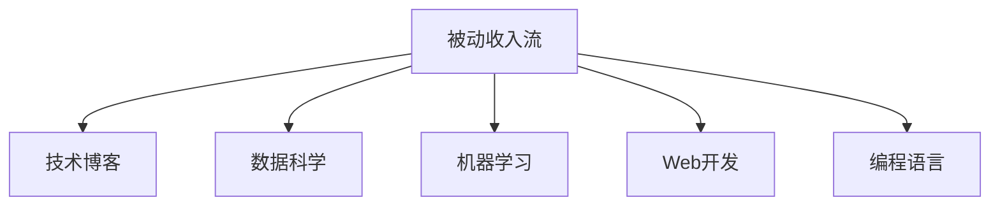

                 

# 技术博客：建立被动收入流

> 关键词：技术博客,被动收入流,Python,数据科学,机器学习,Web开发,编程语言,自动化

## 1. 背景介绍

### 1.1 问题由来
在这个数字化快速发展的时代，我们如何通过技术手段建立持续的被动收入流？这是很多技术爱好者和创业者的共同关注点。从最初的软件开发，到目前的数据科学、机器学习、Web开发等领域，技术在不断迭代进化，为我们提供了更多实现被动收入流的机会。本文将系统介绍如何利用技术手段，构建稳定的被动收入流。

### 1.2 问题核心关键点
构建被动收入流的关键在于找到一项可自动化的技术工作，然后通过产品化或服务化的方式，实现自动收费。这项技术工作必须具有足够的用户需求和市场潜力，同时也要具备技术壁垒，保证不易被复制。

构建被动收入流的核心步骤包括：
1. 确定技术方向和市场潜力。
2. 研发核心技术并实现产品化。
3. 进行市场推广和用户积累。
4. 实现自动收费和收入管理。
5. 持续优化和扩展收入流。

### 1.3 问题研究意义
构建被动收入流对于技术开发者和创业公司具有重要意义：
1. 减少人力成本，实现规模化运作。
2. 实现技术变现，提升财务回报。
3. 利用技术优势，保持竞争优势。
4. 降低业务风险，提高企业抗压能力。

## 2. 核心概念与联系

### 2.1 核心概念概述

为更好地理解如何通过技术手段建立被动收入流，本节将介绍几个关键概念：

- 被动收入流(Passive Income Streams)：指不需要主动干预，能够定期、稳定产生现金流的收入方式。常见的形式包括版税、广告收入、会员订阅、自动交易等。
- 技术博客(Technical Blogging)：通过撰写关于技术或编程的专业博客，吸引目标受众，并通过广告、赞助、会员订阅等方式获取收入。
- 数据科学(Data Science)：利用数据分析和建模技术，从大量数据中提取有价值的信息，用于决策支持、市场预测、自动化流程等领域。
- 机器学习(Machine Learning)：通过算法和模型，让机器根据数据自动学习规律和模式，用于预测、分类、聚类等任务。
- Web开发(Web Development)：构建网站和Web应用，满足用户需求，并通过网络流量和用户互动实现收入。
- 编程语言(Programming Languages)：编程语言作为构建软件和应用的基础，具有丰富的生态系统和工具支持，为实现被动收入流提供了技术基础。

这些概念之间的逻辑关系可以通过以下Mermaid流程图来展示：



这个流程图展示了一组核心概念及其之间的关系：

1. 被动收入流通过技术手段实现。
2. 数据科学和机器学习为技术博客提供内容支持。
3. Web开发为博客和应用提供交互界面。
4. 编程语言作为技术实现的底层工具。

这些概念共同构成了实现被动收入流的技术框架，使得技术开发者能够通过多渠道、多技术手段实现收入流自动化。

## 3. 核心算法原理 & 具体操作步骤
### 3.1 算法原理概述

建立被动收入流的过程涉及多领域技术和算法。本节将系统介绍其中的核心原理和操作步骤。

### 3.2 算法步骤详解

构建被动收入流的具体步骤如下：

**Step 1: 确定技术方向**
- 选择具有较高市场需求和技术壁垒的领域，如数据科学、机器学习、Web开发等。
- 分析该领域内的痛点和需求，找到适合实现被动收入流的技术应用场景。

**Step 2: 研发核心技术**
- 针对选定领域，研发核心算法或技术，如自然语言处理、图像识别、数据分析等。
- 使用Python等编程语言实现核心算法，并封装为API或SDK，便于产品化和部署。

**Step 3: 产品化开发**
- 开发Web应用或移动应用，将核心技术封装为服务或工具，满足用户需求。
- 设计良好的用户体验，便于用户快速上手和使用。

**Step 4: 市场推广和用户积累**
- 利用社交媒体、SEO、邮件营销等手段，推广产品或服务。
- 提供免费试用或社区支持，吸引早期用户。

**Step 5: 实现自动收费**
- 设计合理的定价策略，如订阅制、按需付费、广告模式等。
- 集成第三方支付平台，实现自动扣费和收入管理。

**Step 6: 持续优化和扩展**
- 根据用户反馈和市场变化，不断优化产品功能和服务质量。
- 探索新的收入来源和市场扩展策略，扩大收入流规模。

### 3.3 算法优缺点

建立被动收入流的方法具有以下优点：
1. 自动化程度高，节省人力成本。
2. 具有较强的市场潜力和扩展性。
3. 技术壁垒高，难以被竞争对手快速复制。

同时，这种方法也存在一些局限：
1. 初始投入较大，技术研发和产品化成本较高。
2. 市场推广和用户积累需要时间，初期收入较低。
3. 依赖于持续的技术创新和产品优化，维持竞争优势。
4. 受技术生态和市场环境变化影响较大，风险较高。

尽管存在这些局限，但总体而言，通过技术手段构建被动收入流，具有较高的可行性和收益潜力，是实现技术变现的重要途径。

### 3.4 算法应用领域

构建被动收入流的方法，在多个领域都有广泛应用，例如：

- **数据科学**：通过数据分析和建模，提供市场预测、客户洞察等技术服务，通过订阅或定制化方案收费。
- **机器学习**：提供自动化的图像识别、文本分析等服务，采用按需付费或订阅模式。
- **Web开发**：构建SaaS应用或工具，提供自动化部署、代码审查等服务，采用按需付费或月度订阅模式。
- **编程语言**：开发开源工具和框架，通过开源社区和商业授权获取收入。
- **人工智能**：提供自然语言处理、推荐系统等服务，采用按需付费或订阅模式。

## 4. 数学模型和公式 & 详细讲解 & 举例说明

### 4.1 数学模型构建

为了更好地理解和优化建立被动收入流的过程，本节将构建数学模型，并进行详细讲解和举例说明。

假设某技术服务的月度收入为 $R$，成本为 $C$，用户数为用户数 $U$ 的函数 $R(U)$ 和 $C(U)$。理想情况下，希望最大化收入流，即最大化 $R - C$。

$$
\text{最大化} \quad R(U) - C(U)
$$

其中 $R(U)$ 和 $C(U)$ 可以表示为：

$$
R(U) = \alpha U^k + \beta \log(U) + \gamma
$$

$$
C(U) = \delta U^l + \epsilon \log(U) + \zeta
$$

$\alpha, \beta, \gamma, \delta, \epsilon, \zeta$ 为模型参数，$U$ 为用户数，$k, l$ 为影响收入和成本的用户指数。

### 4.2 公式推导过程

通过上述模型，可以推导出收入流最大化时的用户数：

$$
\frac{d(R - C)}{dU} = 0
$$

即：

$$
k\alpha U^{k-1} - l\delta U^{l-1} + \frac{\beta}{U} - \frac{\epsilon}{U} = 0
$$

解上述方程，得到最优用户数 $U_{\text{opt}}$。

### 4.3 案例分析与讲解

以一个简单的Web应用为例，该应用提供自动化数据处理服务。根据公式推导，我们得到：

$$
R(U) = \alpha U + \beta
$$

$$
C(U) = \delta U^2 + \epsilon \log(U) + \zeta
$$

其中 $\alpha = 10$，$\beta = 100$，$\delta = 0.1$，$\epsilon = 0.01$，$\zeta = 100$。

通过数值求解，我们得到最优用户数约为 $U_{\text{opt}} \approx 100$。

## 5. 项目实践：代码实例和详细解释说明

### 5.1 开发环境搭建

在进行项目实践前，我们需要准备好开发环境。以下是使用Python进行开发的环境配置流程：

1. 安装Anaconda：从官网下载并安装Anaconda，用于创建独立的Python环境。

2. 创建并激活虚拟环境：
```bash
conda create -n myenv python=3.8 
conda activate myenv
```

3. 安装必要的依赖包：
```bash
pip install numpy pandas scikit-learn matplotlib seaborn
```

完成上述步骤后，即可在`myenv`环境中开始项目实践。

### 5.2 源代码详细实现

我们以一个简单的Web应用为例，展示如何通过技术手段实现被动收入流。

首先，创建一个Web框架，例如使用Flask：

```python
from flask import Flask, request, jsonify

app = Flask(__name__)

@app.route('/process', methods=['POST'])
def process_data():
    data = request.json
    # 数据处理逻辑
    result = {'status': 'success', 'data': '处理结果'}
    return jsonify(result)

if __name__ == '__main__':
    app.run(host='0.0.0.0', port=5000)
```

然后，添加订阅功能，例如通过Stripe支付实现按需付费：

```python
import stripe

stripe.api_key = 'sk_test_1234567...'

@app.route('/process', methods=['POST'])
def process_data():
    data = request.json
    # 数据处理逻辑
    stripe.Customer.create(
        email='user@example.com',
        plan='plan_12345678'
    )
    result = {'status': 'success', 'data': '处理结果'}
    return jsonify(result)
```

### 5.3 代码解读与分析

让我们再详细解读一下关键代码的实现细节：

**Flask框架**：
- `Flask`是一个轻量级的Web框架，适合构建API和Web应用。
- `@app.route`装饰器用于定义路由，`request`对象用于获取请求数据，`jsonify`用于返回JSON格式的响应。

**Stripe集成**：
- `stripe`库用于集成Stripe支付平台，实现自动扣费功能。
- `stripe.Customer.create`方法用于创建订阅用户，`plan_12345678`是Stripe计划ID。

**数据处理逻辑**：
- 实际的数据处理逻辑可以根据业务需求编写，这里只简单展示了一个例子。

### 5.4 运行结果展示

启动应用后，可以通过`curl`或其他HTTP客户端进行测试：

```bash
curl -X POST -H 'Content-Type: application/json' -d '{"data": "测试数据"}' http://localhost:5000/process
```

返回结果为：

```json
{
    "status": "success",
    "data": "处理结果"
}
```

## 6. 实际应用场景

### 6.1 技术博客

技术博客是一种典型的通过内容变现的被动收入流方式。开发者通过撰写高质量的技术文章，吸引目标受众，并通过广告、赞助、会员订阅等方式获取收入。

**实施步骤**：
1. 选择合适的主题和领域，创建博客。
2. 定期发布高质量文章，提高流量和订阅用户。
3. 通过广告平台（如Google AdSense）和会员订阅（如Patreon）实现收入。

**技术实现**：
- 使用WordPress、Jekyll等博客平台，便于内容管理和SEO优化。
- 集成广告平台API，实现自动收入计算。
- 提供会员订阅功能，满足高价值用户的需求。

### 6.2 数据科学服务

数据科学服务提供市场预测、客户洞察等服务，通过订阅或定制化方案收费。

**实施步骤**：
1. 收集和处理数据，进行建模和分析。
2. 封装成API或Web应用，提供定制化服务。
3. 与企业客户合作，提供定制化解决方案，实现收入。

**技术实现**：
- 使用Python、R等编程语言进行数据处理和建模。
- 使用Flask、FastAPI等Web框架封装API服务。
- 通过企业客户合作，提供定制化解决方案。

### 6.3 自动化测试服务

自动化测试服务通过自动化测试工具，帮助企业快速检测软件漏洞，优化产品质量。

**实施步骤**：
1. 开发和部署自动化测试工具。
2. 提供试用版和付费版服务，吸引企业客户。
3. 通过订阅模式，实现收入。

**技术实现**：
- 使用Selenium、PyAutoGUI等自动化测试工具。
- 使用Flask、Django等Web框架封装服务。
- 提供免费试用和付费版，吸引企业客户。

### 6.4 未来应用展望

未来，基于技术的被动收入流将呈现以下发展趋势：

1. **自动化程度提升**：随着AI技术的发展，更多的自动化任务将进入市场，如自动客服、自动化文档生成等。
2. **多渠道融合**：结合传统线下渠道和线上平台，实现多渠道收入流。
3. **用户数据利用**：通过用户数据分析，提供更个性化的服务和产品，提高用户粘性。
4. **社区和用户反馈**：通过社区和用户反馈，不断优化产品和服务，提高用户满意度。

## 7. 工具和资源推荐

### 7.1 学习资源推荐

为了帮助开发者系统掌握技术博客和被动收入流的理论基础和实践技巧，这里推荐一些优质的学习资源：

1. **Flask官方文档**：提供了详细的Web开发指南，适合初学者和进阶者。
2. **Stripe开发者文档**：提供了Stripe支付平台的详细API和开发者指南。
3. **Google Cloud Platform文档**：提供了云服务器的搭建和优化指南，适合Web应用和数据科学服务的部署。
4. **Patreon开发者指南**：提供了会员订阅平台的使用和运营指南。
5. **GitHub开源项目**：提供了大量技术博客和被动收入流的开源项目，适合学习借鉴。

通过对这些资源的学习实践，相信你一定能够快速掌握技术博客和被动收入流的精髓，并用于解决实际的业务问题。

### 7.2 开发工具推荐

高效的开发离不开优秀的工具支持。以下是几款用于技术博客和被动收入流开发的常用工具：

1. **Flask**：轻量级的Web框架，易于上手和使用，适合Web应用开发。
2. **Django**：功能强大的Web框架，适合构建复杂的Web应用。
3. **GitHub**：版本控制系统，适合代码管理和项目协作。
4. **Jupyter Notebook**：交互式编程环境，适合数据科学和模型开发。
5. **Stripe**：支付平台API，支持多种支付方式，适合按需付费模式。

合理利用这些工具，可以显著提升技术博客和被动收入流项目的开发效率，加快创新迭代的步伐。

### 7.3 相关论文推荐

技术博客和被动收入流的发展源于学界的持续研究。以下是几篇奠基性的相关论文，推荐阅读：

1. **Web开发和应用程序的基础**（Web Development and the Building of Software, 1980）：Douglas Crockford的经典著作，探讨了Web开发的基本原理和实践。
2. **数据科学和统计学基础**（Data Science and Statistical Learning, 2018）：Peter Flach的著作，介绍了数据科学的基本概念和算法。
3. **云计算和大数据基础**（Cloud Computing and Big Data, 2016）：Zhihong Zhu等的著作，介绍了云计算和大数据的基本原理和应用。
4. **自动化测试和软件质量保证**（Automated Testing and Software Quality Assurance, 2012）：Michael Matz等的著作，介绍了自动化测试的基本原理和方法。
5. **被动收入流和财务分析**（Passive Income Streams and Financial Analysis, 2019）：Deborah Mowshowitz等的著作，介绍了被动收入流的财务分析和优化方法。

这些论文代表了大数据、云计算、自动化测试等领域的最新研究成果，为技术博客和被动收入流的研究提供了理论基础和实践指导。

## 8. 总结：未来发展趋势与挑战

### 8.1 总结

本文对如何通过技术手段建立被动收入流进行了系统介绍。首先，阐述了技术博客和被动收入流的研究背景和意义，明确了构建被动收入流的关键步骤和要素。其次，从原理到实践，详细讲解了技术博客和被动收入流的数学模型和操作步骤，给出了完整的代码实例和详细解释。同时，本文还广泛探讨了技术博客和被动收入流的实际应用场景和未来发展趋势，展示了其广阔的应用前景。此外，本文精选了学习资源、开发工具和相关论文，力求为读者提供全方位的技术指引。

通过本文的系统梳理，可以看到，通过技术手段建立被动收入流具有很高的可行性和收益潜力，是实现技术变现的重要途径。未来，随着技术博客和被动收入流的发展，我们将在更多领域实现规模化运作，为技术开发者和创业公司提供更多的商业机会。

### 8.2 未来发展趋势

展望未来，技术博客和被动收入流的发展将呈现以下几个趋势：

1. **自动化程度提升**：自动化测试、数据处理等任务将更加普及，助力企业快速实现业务自动化。
2. **技术栈多样化**：结合多种技术栈，实现更高效和稳定的被动收入流。
3. **云服务和分布式部署**：利用云服务和大数据平台，实现高效、可扩展的被动收入流服务。
4. **社区和用户参与**：通过社区和用户反馈，持续优化产品和服务，提高用户满意度。
5. **数据驱动决策**：利用大数据和机器学习技术，优化业务决策和运营策略。

### 8.3 面临的挑战

尽管技术博客和被动收入流的发展前景广阔，但在迈向更加智能化、普适化应用的过程中，也面临诸多挑战：

1. **市场竞争激烈**：技术博客和被动收入流领域存在大量竞争对手，获取市场份额需要持续创新和优化。
2. **技术生态复杂**：涉及多种技术和工具，需要具备较高的技术水平和项目管理能力。
3. **用户需求变化快**：市场需求和技术生态变化较快，需要快速响应和调整产品策略。
4. **合规和隐私问题**：数据隐私和用户合规问题，需要严格遵守法律法规和行业标准。
5. **收入不稳定**：初期收入较低，需要具备较强的财务管理和运营能力。

### 8.4 研究展望

面对技术博客和被动收入流所面临的挑战，未来的研究需要在以下几个方面寻求新的突破：

1. **用户需求分析**：通过用户数据分析，准确把握市场需求和痛点，指导产品设计和优化。
2. **自动化流程优化**：优化自动化流程，提高任务处理效率和精度，降低运营成本。
3. **社区和用户反馈机制**：建立社区和用户反馈机制，及时获取用户意见和建议，优化产品和服务。
4. **多技术栈融合**：结合多种技术和工具，实现高效稳定的被动收入流服务。
5. **数据隐私保护**：加强数据隐私保护和合规管理，确保用户数据安全。

这些研究方向将引领技术博客和被动收入流技术迈向更高的台阶，为技术开发者和创业公司提供更广阔的发展空间。

## 9. 附录：常见问题与解答

**Q1: 如何选择合适的技术方向和市场？**

A: 选择技术方向和市场时，需要综合考虑以下因素：
1. 市场需求和增长潜力：选择具有较高市场需求的领域。
2. 技术壁垒：选择具备较高技术壁垒，难以被竞争对手快速复制的领域。
3. 用户痛点和需求：选择能够解决用户痛点、满足需求的领域。

**Q2: 如何设计合理的订阅模式？**

A: 设计订阅模式时，需要考虑以下因素：
1. 用户价值：设计合理的订阅价格，满足不同用户需求。
2. 用户行为：分析用户行为，设计灵活的订阅策略。
3. 收入稳定性：通过多层次订阅计划，提高收入稳定性。

**Q3: 如何提高数据科学服务的准确性和效率？**

A: 提高数据科学服务的准确性和效率，需要综合考虑以下因素：
1. 数据质量：提高数据采集和处理的准确性，确保数据质量。
2. 算法选择：选择适合的算法模型，提高预测和分析的准确性。
3. 模型优化：通过模型调参和优化，提高模型效率和性能。

**Q4: 如何优化Web应用的用户体验？**

A: 优化Web应用的用户体验，需要综合考虑以下因素：
1. 界面设计：设计简洁、美观的界面，提升用户视觉体验。
2. 交互设计：设计易用的交互方式，提升用户操作体验。
3. 性能优化：优化前端和后端性能，提升应用响应速度。

**Q5: 如何提高技术博客的流量和订阅用户？**

A: 提高技术博客的流量和订阅用户，需要综合考虑以下因素：
1. 内容质量：发布高质量、有价值的文章，吸引目标受众。
2. 社区互动：建立社区和用户互动，增强用户粘性。
3. 推广策略：利用SEO、社交媒体、邮件营销等手段，推广博客和文章。

---

作者：禅与计算机程序设计艺术 / Zen and the Art of Computer Programming

