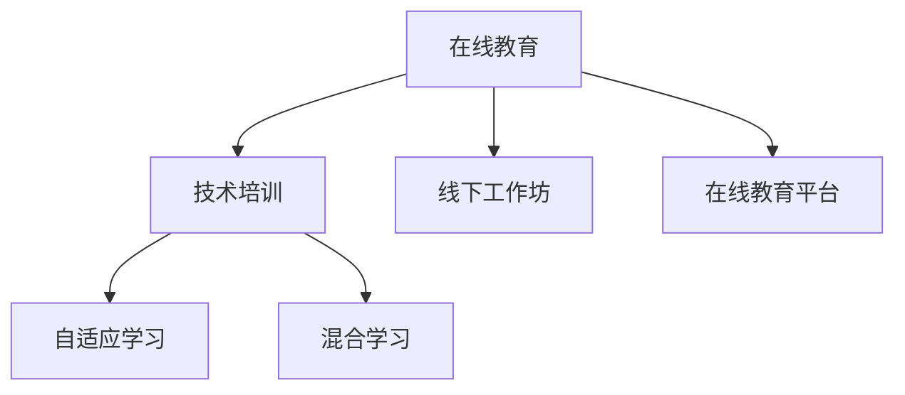

                 

## 1. 背景介绍

随着科技的飞速发展，教育领域正经历着一场变革。在线教育的兴起，使得学习更加灵活、便捷，传统线下工作坊已逐渐被在线培训所取代。本文将探讨在线教育帝国的构建，从技术培训的角度切入，分析其发展历程与趋势。

## 2. 核心概念与联系

### 2.1 核心概念概述

为了深入理解在线教育帝国的构建，首先需要了解以下几个核心概念：

- **在线教育**：通过互联网技术实现的学习方式，不受时间地点限制，灵活度高，用户可自主安排学习。
- **技术培训**：以传授特定技术或技能的培训课程，通过理论讲授和实践操作相结合的方式进行。
- **线下工作坊**：传统培训模式，通过面对面的交流和实操，提高学习者的技能和知识水平。
- **在线教育平台**：提供在线教育服务的网络平台，如Coursera、Udacity、edX等。
- **自适应学习**：根据学习者的表现和反馈，动态调整学习内容和学习节奏，提升学习效果。
- **混合学习**：结合线上与线下的培训方式，充分发挥两者的优势，提供更全面的教育体验。

### 2.2 核心概念原理和架构的 Mermaid 流程图



这个流程图展示了在线教育与技术培训、线下工作坊以及在线教育平台的联系。在线教育不仅包括技术培训，还融合了线下工作坊的互动性，借助在线教育平台实现自适应学习，甚至采用混合学习的方式，提供更灵活、更高效的教育体验。

## 3. 核心算法原理 & 具体操作步骤

### 3.1 算法原理概述

在线教育帝国的构建，涉及多个核心算法和步骤。以下将详细阐述其基本原理和操作步骤。

#### 3.1.1 学习需求分析

在线教育的第一步是对学习者的需求进行分析，通过问卷调查、数据挖掘等方式，了解学习者的学习背景、目标、偏好等。

#### 3.1.2 课程内容设计

根据学习需求分析结果，设计课程内容，包括理论讲授、实践操作、案例分析等模块。课程内容需根据学习者的接受能力进行分层次设计，确保不同水平的学习者都能从中获益。

#### 3.1.3 教学资源准备

收集和整理教学资源，如讲义、视频、代码、案例等，并进行整理和分类，便于学习者按需获取。

#### 3.1.4 在线教育平台搭建

搭建一个功能完善、易于使用的在线教育平台，提供视频课程、互动讨论、在线测试等功能，满足学习者的多样化需求。

#### 3.1.5 教学实施

在在线教育平台上，按照课程进度安排教学活动，包括视频讲授、实践操作、案例分析、在线测试等。

#### 3.1.6 学习效果评估

通过在线测试、作业提交、学习者反馈等方式，评估学习效果，并根据评估结果调整教学策略。

### 3.2 算法步骤详解

#### 3.2.1 需求分析

1. **问卷调查**：设计问卷，收集学习者的基本信息、学习目标、学习时间、学习方式等数据。
2. **数据分析**：对问卷数据进行分析，识别学习者的共性需求和个性化需求。
3. **需求分类**：将分析结果分类，形成课程设计的基础。

#### 3.2.2 课程内容设计

1. **理论讲授**：根据需求分析结果，设计课程的理论部分，包括基本概念、原理、方法等。
2. **实践操作**：设计课程的实践部分，如编写代码、调试问题等，帮助学习者掌握实操技能。
3. **案例分析**：选择典型案例，进行详细分析，提升学习者的解决实际问题能力。

#### 3.2.3 教学资源准备

1. **资源收集**：收集视频、讲义、代码、案例等教学资源。
2. **资源整理**：对收集到的资源进行分类整理，形成课程资源库。
3. **资源上传**：将整理好的资源上传到在线教育平台，供学习者随时下载和观看。

#### 3.2.4 在线教育平台搭建

1. **平台选择**：选择适合的技术和工具，搭建在线教育平台。
2. **功能设计**：根据课程需求设计平台功能，如视频播放、讨论区、在线测试等。
3. **平台部署**：将搭建好的平台部署到服务器，确保稳定运行。

#### 3.2.5 教学实施

1. **课程安排**：按照课程进度，安排教学活动，包括视频讲授、实践操作、案例分析等。
2. **互动交流**：利用在线教育平台的讨论区功能，促进学习者之间的互动交流。
3. **在线测试**：定期进行在线测试，评估学习效果，发现问题及时调整教学策略。

#### 3.2.6 学习效果评估

1. **测试设计**：根据课程内容设计测试题目，确保测试的全面性和难度适中。
2. **测试实施**：在线上教育平台上实施测试，收集测试结果。
3. **结果分析**：对测试结果进行分析，评估学习效果，发现问题及时调整教学策略。

### 3.3 算法优缺点

#### 3.3.1 优点

1. **灵活度高**：在线教育不受时间地点限制，学习者可自主安排学习时间，灵活度高。
2. **学习资源丰富**：在线教育平台提供丰富的教学资源，便于学习者按需获取。
3. **互动性强**：在线教育平台提供互动讨论功能，学习者可随时提问，教师及时解答。
4. **学习效果可评估**：在线教育平台提供在线测试、作业提交等评估手段，及时发现学习者的掌握情况。

#### 3.3.2 缺点

1. **自律性要求高**：在线教育依赖学习者的自律性，容易产生学习动力不足的问题。
2. **技术门槛高**：搭建和维护在线教育平台需要一定的技术能力和资源。
3. **互动效果有限**：在线教育平台的互动效果有限，无法完全替代线下工作坊的面对面交流。
4. **学习效果不均**：不同学习者的自律性和学习效果不同，可能导致学习效果不均。

### 3.4 算法应用领域

在线教育技术已在多个领域得到了广泛应用，包括但不限于：

- **IT技术培训**：如编程语言、软件开发、数据科学等。
- **企业培训**：如员工技能培训、管理培训等。
- **K12教育**：如数学、物理、化学等课程的在线教学。
- **高等教育**：如大学课程、MOOCs（大规模开放在线课程）等。
- **职业技能培训**：如职业资格认证、职业规划等。
- **个人兴趣培训**：如艺术、音乐、语言学习等。

## 4. 数学模型和公式 & 详细讲解 & 举例说明

### 4.1 数学模型构建

在线教育的数学模型，主要涉及以下几个方面：

- **学习者模型**：描述学习者的行为和需求。
- **课程模型**：描述课程内容和结构。
- **平台模型**：描述在线教育平台的功能和交互。
- **学习效果模型**：描述学习效果与学习策略之间的关系。

#### 4.1.1 学习者模型

学习者模型包括学习者的基本信息、学习目标、学习方式等，可以表示为：

$$
\mathcal{L} = (\text{ID}, \text{Name}, \text{Age}, \text{Education}, \text{Occupation}, \text{LearningGoal}, \text{LearningStyle})
$$

其中，ID为学习者唯一标识，Name为学习者姓名，Age为学习者年龄，Education为学习者教育背景，Occupation为学习者职业，LearningGoal为学习目标，LearningStyle为学习方式。

#### 4.1.2 课程模型

课程模型包括课程名称、课程内容、课程结构等，可以表示为：

$$
\mathcal{C} = (\text{ID}, \text{Name}, \text{Content}, \text{Structure}, \text{Prerequisites})
$$

其中，ID为课程唯一标识，Name为课程名称，Content为课程内容，Structure为课程结构，Prerequisites为课程先修要求。

#### 4.1.3 平台模型

平台模型包括在线教育平台的功能和交互，可以表示为：

$$
\mathcal{P} = (\text{ID}, \text{Function}, \text{Feature}, \text{UserInteraction}, \text{TechnicalRequirement})
$$

其中，ID为平台唯一标识，Function为平台功能，Feature为平台特性，UserInteraction为用户交互方式，TechnicalRequirement为技术要求。

#### 4.1.4 学习效果模型

学习效果模型描述学习效果与学习策略之间的关系，可以表示为：

$$
\mathcal{E} = (\text{ID}, \text{Assessment}, \text{Feedback}, \text{Adjustment})
$$

其中，ID为评估唯一标识，Assessment为评估手段，Feedback为学习反馈，Adjustment为教学调整策略。

### 4.2 公式推导过程

#### 4.2.1 学习者模型公式推导

假设学习者模型的变量为 $\mathcal{L}$，其概率密度函数为 $f_{\mathcal{L}}$，则学习者模型的推导过程如下：

1. **数据收集**：收集学习者的基本信息、学习目标、学习方式等数据，表示为 $D_{\mathcal{L}}$。
2. **模型构建**：构建学习者模型，表示为 $\mathcal{L} = g(D_{\mathcal{L}})$。
3. **模型评估**：评估学习者模型，计算 $f_{\mathcal{L}}(D_{\mathcal{L}})$。

#### 4.2.2 课程模型公式推导

假设课程模型的变量为 $\mathcal{C}$，其概率密度函数为 $f_{\mathcal{C}}$，则课程模型的推导过程如下：

1. **数据收集**：收集课程的名称、内容、结构、先修要求等数据，表示为 $D_{\mathcal{C}}$。
2. **模型构建**：构建课程模型，表示为 $\mathcal{C} = h(D_{\mathcal{C}})$。
3. **模型评估**：评估课程模型，计算 $f_{\mathcal{C}}(D_{\mathcal{C}})$。

#### 4.2.3 平台模型公式推导

假设平台模型的变量为 $\mathcal{P}$，其概率密度函数为 $f_{\mathcal{P}}$，则平台模型的推导过程如下：

1. **数据收集**：收集平台的功能、特性、用户交互方式、技术要求等数据，表示为 $D_{\mathcal{P}}$。
2. **模型构建**：构建平台模型，表示为 $\mathcal{P} = i(D_{\mathcal{P}})$。
3. **模型评估**：评估平台模型，计算 $f_{\mathcal{P}}(D_{\mathcal{P}})$。

#### 4.2.4 学习效果模型公式推导

假设学习效果模型的变量为 $\mathcal{E}$，其概率密度函数为 $f_{\mathcal{E}}$，则学习效果模型的推导过程如下：

1. **数据收集**：收集学习评估手段、学习反馈、教学调整策略等数据，表示为 $D_{\mathcal{E}}$。
2. **模型构建**：构建学习效果模型，表示为 $\mathcal{E} = j(D_{\mathcal{E}})$。
3. **模型评估**：评估学习效果模型，计算 $f_{\mathcal{E}}(D_{\mathcal{E}})$。

### 4.3 案例分析与讲解

#### 4.3.1 学习者模型案例分析

假设有一组学习者数据如下：

| ID | Name  | Age | Education | Occupation | LearningGoal | LearningStyle |
|----|-------|-----|-----------|------------|--------------|---------------|
| 001 | 张三  | 25  | 本科      | 软件开发  | 提升编程技能 | 自驱学习     |
| 002 | 李四  | 30  | 硕士      | 数据科学  | 掌握数据分析 | 被动学习     |
| 003 | 王五  | 22  | 专科      | 市场营销  | 学习营销知识 | 协作学习     |

可以构建学习者模型，表示为：

$$
\mathcal{L} = \{(001, \text{张三}, 25, \text{本科}, \text{软件开发}, \text{提升编程技能}, \text{自驱学习}), (002, \text{李四}, 30, \text{硕士}, \text{数据科学}, \text{掌握数据分析}, \text{被动学习}), (003, \text{王五}, 22, \text{专科}, \text{市场营销}, \text{学习营销知识}, \text{协作学习})\}
$$

#### 4.3.2 课程模型案例分析

假设有一组课程数据如下：

| ID | Name      | Content                             | Structure  | Prerequisites | 
|----|-----------|-------------------------------------|------------|---------------|
| 001 | 编程基础  | 基本语法、变量、数据结构、算法等 | 线性课程   | 无先修要求   |
| 002 | 高级编程 | 面向对象编程、设计模式、框架等     | 模块化课程 | 编程基础     |
| 003 | 数据科学  | 数据预处理、统计分析、机器学习等   | 分层课程   | 无先修要求   |

可以构建课程模型，表示为：

$$
\mathcal{C} = \{(001, \text{编程基础}, \text{基本语法、变量、数据结构、算法等}, \text{线性课程}, \text{无先修要求}), (002, \text{高级编程}, \text{面向对象编程、设计模式、框架等}, \text{模块化课程}, \text{编程基础}), (003, \text{数据科学}, \text{数据预处理、统计分析、机器学习等}, \text{分层课程}, \text{无先修要求})\}
$$

#### 4.3.3 平台模型案例分析

假设有一组平台数据如下：

| ID | Function    | Feature           | UserInteraction | TechnicalRequirement |
|----|-------------|-------------------|----------------|----------------------|
| 001 | 视频播放   | 自适应学习       | 视频播放       | 视频编码技术         |
| 002 | 互动讨论   | 实时交流         | 讨论区         | 网络通信技术         |
| 003 | 在线测试   | 自动评分         | 测试系统        | 编程语言解析技术     |

可以构建平台模型，表示为：

$$
\mathcal{P} = \{(001, \text{视频播放}, \text{自适应学习}, \text{视频播放}, \text{视频编码技术}), (002, \text{互动讨论}, \text{实时交流}, \text{讨论区}, \text{网络通信技术}), (003, \text{在线测试}, \text{自动评分}, \text{测试系统}, \text{编程语言解析技术})\}
$$

#### 4.3.4 学习效果模型案例分析

假设有一组学习效果数据如下：

| ID | Assessment      | Feedback      | Adjustment |
|----|----------------|---------------|------------|
| 001 | 在线测试       | 95%正确率     | 增加难度   |
| 002 | 作业提交       | 80%完成率     | 减少作业量 |
| 003 | 学习者反馈     | 学习体验良好  | 无调整     |

可以构建学习效果模型，表示为：

$$
\mathcal{E} = \{(001, \text{在线测试}, \text{95%正确率}, \text{增加难度}), (002, \text{作业提交}, \text{80%完成率}, \text{减少作业量}), (003, \text{学习者反馈}, \text{学习体验良好}, \text{无调整})\}
$$

## 5. 项目实践：代码实例和详细解释说明

### 5.1 开发环境搭建

#### 5.1.1 环境准备

1. **操作系统**：Linux、macOS或Windows系统，推荐Ubuntu或CentOS。
2. **编程语言**：Python 3.x，推荐使用Python 3.7及以上版本。
3. **开发工具**：Visual Studio Code、PyCharm等IDE，安装TensorFlow、Keras、Flask等库。
4. **服务器配置**：搭建Web服务器，推荐使用Nginx或Apache，安装MySQL或MongoDB等数据库。

#### 5.1.2 环境安装

1. **虚拟环境**：使用virtualenv或conda创建虚拟环境，激活环境。
2. **依赖库安装**：使用pip安装依赖库，如TensorFlow、Keras、Flask等。
3. **数据库安装**：安装MySQL或MongoDB数据库，并配置好数据库连接信息。

### 5.2 源代码详细实现

#### 5.2.1 用户管理

```python
# 用户管理模块
from flask import Flask, request

app = Flask(__name__)

# 用户注册
@app.route('/register', methods=['POST'])
def register():
    # 获取注册信息
    name = request.json.get('name')
    email = request.json.get('email')
    password = request.json.get('password')
    
    # 将用户信息保存到数据库
    # ...
    return '注册成功'

# 用户登录
@app.route('/login', methods=['POST'])
def login():
    # 获取登录信息
    email = request.json.get('email')
    password = request.json.get('password')
    
    # 验证用户信息，并登录
    # ...
    return '登录成功'
```

#### 5.2.2 课程管理

```python
# 课程管理模块
from flask import Flask, request

app = Flask(__name__)

# 获取课程列表
@app.route('/courses', methods=['GET'])
def get_courses():
    # 获取课程列表
    # ...
    return '课程列表'

# 添加课程
@app.route('/courses', methods=['POST'])
def add_course():
    # 获取课程信息
    name = request.json.get('name')
    description = request.json.get('description')
    prerequisites = request.json.get('prerequisites')
    
    # 将课程信息保存到数据库
    # ...
    return '添加课程成功'
```

#### 5.2.3 学习管理

```python
# 学习管理模块
from flask import Flask, request

app = Flask(__name__)

# 获取学习记录
@app.route('/learn', methods=['GET'])
def get_learn_records():
    # 获取学习记录
    # ...
    return '学习记录'

# 学习课程
@app.route('/learn', methods=['POST'])
def learn_course():
    # 获取学习信息
    course_id = request.json.get('course_id')
    start_date = request.json.get('start_date')
    
    # 将学习信息保存到数据库
    # ...
    return '学习成功'
```

### 5.3 代码解读与分析

#### 5.3.1 用户管理

用户管理模块包括用户注册和登录功能，使用Flask框架实现。

- **注册**：接收用户提交的注册信息，包括姓名、邮箱和密码，将信息保存到数据库。
- **登录**：接收用户提交的登录信息，包括邮箱和密码，验证用户信息后登录。

#### 5.3.2 课程管理

课程管理模块包括获取课程列表和添加课程功能，使用Flask框架实现。

- **获取课程列表**：从数据库中获取所有课程信息，返回课程列表。
- **添加课程**：接收用户提交的课程信息，包括课程名称、描述和先修要求，将信息保存到数据库。

#### 5.3.3 学习管理

学习管理模块包括获取学习记录和学习课程功能，使用Flask框架实现。

- **获取学习记录**：从数据库中获取所有学习记录，返回学习记录列表。
- **学习课程**：接收用户提交的学习信息，包括课程ID和开始日期，将信息保存到数据库。

### 5.4 运行结果展示

#### 5.4.1 用户管理

用户管理模块的运行结果展示：

- **注册**：注册信息保存成功，返回“注册成功”。
- **登录**：用户信息验证通过，登录成功，返回“登录成功”。

#### 5.4.2 课程管理

课程管理模块的运行结果展示：

- **获取课程列表**：返回所有课程信息列表。
- **添加课程**：课程信息保存成功，返回“添加课程成功”。

#### 5.4.3 学习管理

学习管理模块的运行结果展示：

- **获取学习记录**：返回所有学习记录信息列表。
- **学习课程**：学习信息保存成功，返回“学习成功”。

## 6. 实际应用场景

### 6.1 智能培训系统

智能培训系统是基于在线教育的典型应用，能够提供智能化的培训服务。例如，华为的云开发者平台，通过提供在线编程练习、项目实战、社区交流等功能，帮助开发者提升编程技能和项目实战经验。

### 6.2 企业培训系统

企业培训系统可以提升员工的专业技能和综合素质，提高企业的竞争力。例如，字节跳动的字节学院，通过在线课程、实战项目、讲师授课等多种方式，帮助员工掌握新技术和知识。

### 6.3 高校在线教育平台

高校在线教育平台可以为学生提供灵活的学习方式，提高教学效果。例如，清华大学的在线开放课程平台，通过MOOCs、SPOCs等多种形式，为学生提供高质量的在线课程资源。

### 6.4 在线教育平台

在线教育平台可以为全球学生提供丰富的学习资源，满足不同学习者的需求。例如，Coursera、Udacity、edX等平台，通过与全球顶尖大学和企业合作，提供各种在线课程和专业认证。

### 6.5 企业定制化培训

企业定制化培训可以为特定岗位提供定制化的培训方案，提升员工的技能水平。例如，IBM的云技能认证平台，通过在线课程、模拟考试、认证考试等多种方式，帮助员工掌握IBM云技术。

## 7. 工具和资源推荐

### 7.1 学习资源推荐

#### 7.1.1 书籍推荐

1. 《在线教育：理论与实践》：介绍在线教育的基本原理和实践方法。
2. 《大规模开放在线课程MOOCs》：介绍MOOCs的兴起、发展及应用。
3. 《人工智能与在线教育》：介绍人工智能技术在在线教育中的应用。
4. 《K12在线教育：现状与未来》：介绍K12在线教育的发展和趋势。

#### 7.1.2 网站推荐

1. Coursera：提供来自全球顶尖大学的在线课程。
2. edX：提供来自全球顶尖大学和企业的在线课程。
3. Udacity：提供职业导向的在线课程和纳米学位。
4. Khan Academy：提供免费的在线课程和学习资源。

#### 7.1.3 平台推荐

1. Coursera：提供来自全球顶尖大学的在线课程。
2. edX：提供来自全球顶尖大学和企业的在线课程。
3. Udacity：提供职业导向的在线课程和纳米学位。
4. Khan Academy：提供免费的在线课程和学习资源。

### 7.2 开发工具推荐

#### 7.2.1 开发环境

1. Visual Studio Code：轻量级代码编辑器，支持多种编程语言和插件。
2. PyCharm：强大的IDE，支持Python开发，提供丰富的功能和工具。
3. Jupyter Notebook：交互式编程环境，支持Python、R等多种语言。

#### 7.2.2 数据库

1. MySQL：开源关系型数据库，支持高性能、可扩展的数据存储。
2. MongoDB：开源文档型数据库，支持灵活的数据模型和查询。

#### 7.2.3 其他工具

1. Git：版本控制系统，支持代码管理和协作开发。
2. Docker：容器化平台，支持应用和服务的快速部署和迁移。
3. Kubernetes：容器编排平台，支持大规模应用的自动化运维和管理。

### 7.3 相关论文推荐

#### 7.3.1 论文推荐

1. 《大规模在线开放课程MOOCs的发展及其对高等教育的影响》：介绍MOOCs的发展和应用。
2. 《在线教育的现状与未来》：介绍在线教育的发展历程和未来趋势。
3. 《人工智能与在线教育的融合》：介绍AI技术在在线教育中的应用。
4. 《在线教育平台的用户行为分析》：介绍用户行为分析在在线教育中的应用。

## 8. 总结：未来发展趋势与挑战

### 8.1 研究成果总结

在线教育技术的不断发展，已经改变了传统的学习方式和教育模式，为全球学生提供了更多灵活、便捷的学习机会。目前，在线教育技术已经广泛应用于企业培训、高校教学、在线学习等多个领域，取得了显著成效。未来，随着技术的进一步发展，在线教育技术将在更多领域得到应用，为教育行业带来新的变革。

### 8.2 未来发展趋势

1. **自适应学习**：未来，在线教育平台将更加注重自适应学习，根据学习者的表现和反馈，动态调整学习内容和学习节奏，提高学习效果。
2. **混合学习**：混合学习将成为主流，结合线上和线下的培训方式，提供更全面的教育体验。
3. **人工智能**：人工智能技术将进一步融入在线教育，提升学习效果和用户体验。
4. **游戏化学习**：游戏化学习将提高学习者的参与度和学习兴趣。
5. **虚拟现实**：虚拟现实技术将为学习者提供沉浸式的学习体验。
6. **个性化学习**：个性化学习将成为趋势，根据学习者的需求和偏好，提供定制化的学习方案。

### 8.3 面临的挑战

1. **技术挑战**：在线教育技术需要不断更新和优化，才能满足日益增长的学习需求。
2. **数据隐私**：在线教育平台需要保护用户数据隐私，防止数据泄露和滥用。
3. **师资培训**：在线教育平台需要培训更多的师资力量，才能提供高质量的教育服务。
4. **学习动力**：在线学习需要依赖学习者的自律性，如何提高学习动力，是一个重要挑战。
5. **内容质量**：在线教育平台需要不断优化课程内容，提升学习效果。
6. **技术成本**：搭建和维护在线教育平台需要较高的技术成本，如何降低成本，是一个重要问题。

### 8.4 研究展望

未来，在线教育技术将继续发展，为教育行业带来更多创新和突破。我们需要不断探索新技术、新方法，解决面临的挑战，提升在线教育的效果和质量。同时，也需要关注技术伦理和安全问题，确保在线教育技术的应用是安全和可靠的。

## 9. 附录：常见问题与解答

**Q1: 如何选择合适的在线教育平台？**

A: 选择合适的在线教育平台需要考虑以下几个方面：
1. 课程质量：选择有优质课程和讲师的平台。
2. 学习体验：选择有良好用户体验和交互功能的平台。
3. 价格和性价比：选择价格合理且性价比高的平台。
4. 认证和认可：选择有权威认证和认可的平台。

**Q2: 如何提高在线学习的参与度？**

A: 提高在线学习的参与度需要从以下几个方面入手：
1. 游戏化设计：通过游戏化的方式，提高学习者的参与度和兴趣。
2. 互动交流：提供多种互动交流方式，促进学习者之间的互动和协作。
3. 个性化推荐：根据学习者的兴趣和需求，推荐个性化的学习内容和资源。
4. 激励机制：设计合理的激励机制，激发学习者的学习动力。

**Q3: 在线教育平台如何保护用户数据隐私？**

A: 在线教育平台保护用户数据隐私需要采取以下几个措施：
1. 数据加密：对用户数据进行加密存储和传输，防止数据泄露。
2. 权限控制：对用户数据进行权限控制，确保只有授权人员才能访问。
3. 匿名化处理：对用户数据进行匿名化处理，防止用户隐私被滥用。
4. 法律法规：遵守相关法律法规，保护用户数据隐私。

**Q4: 在线教育平台如何应对学习者的反馈？**

A: 在线教育平台应对学习者反馈需要采取以下几个措施：
1. 建立反馈渠道：提供多种反馈渠道，方便学习者反馈问题。
2. 快速响应：及时响应学习者的反馈，解决问题。
3. 数据分析：对学习者的反馈进行分析，优化课程内容和教学方式。
4. 持续改进：根据学习者的反馈，持续改进在线教育平台。

**Q5: 在线教育平台如何提升课程质量？**

A: 在线教育平台提升课程质量需要从以下几个方面入手：
1. 精选讲师：选择有经验和专业知识的讲师，提高课程质量。
2. 课程设计：设计科学合理的课程结构和内容，确保课程的有效性。
3. 学习评估：建立科学合理的学习评估体系，确保课程的实际效果。
4. 持续优化：根据学习者的反馈，持续优化课程内容和方法。

**Q6: 在线教育平台如何降低技术成本？**

A: 在线教育平台降低技术成本需要采取以下几个措施：
1. 云计算：采用云计算技术，降低硬件成本。
2. 开源软件：使用开源软件和工具，降低软件成本。
3. 自动化运维：采用自动化运维工具，提高运维效率。
4. 协作开发：采用协作开发模式，降低开发成本。

---

作者：禅与计算机程序设计艺术 / Zen and the Art of Computer Programming

