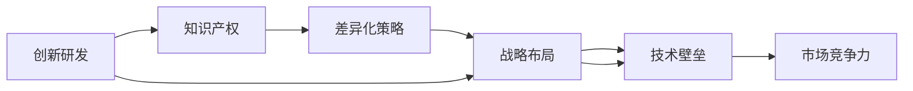

                 

# 技术壁垒：创业者的护城河

> 关键词：技术壁垒, 创业, 护城河, 创新, 知识产权, 战略优势, 差异化, 竞争力, 研发投入

## 1. 背景介绍

### 1.1 问题由来
在今天这个快速变化和高度竞争的商业环境中，技术已经成为了创业者们的核心竞争力。在互联网、软件、硬件、医疗等各个领域，新兴企业与传统大企之间的较量往往集中于核心技术的研发与创新。然而，技术壁垒不仅是一个技术问题，更是一个战略问题。构建有效且持久的技术壁垒，能够为创业者提供持续的竞争优势，构建起企业发展的"护城河"。本文将深入探讨如何构建和维护技术壁垒，帮助创业者在激烈的市场竞争中获得优势。

### 1.2 问题核心关键点
技术壁垒的核心在于独特且不易被模仿的技术优势，能够为公司带来市场竞争中的战略优势。构建技术壁垒的关键在于：

- 创新研发：持续投入研发，保持技术领先。
- 知识产权：通过专利、商标等方式保护创新成果。
- 战略布局：结合企业发展战略，系统性地构建技术体系。
- 人才储备：吸引和培养优秀人才，确保技术创新的持续性。
- 差异化策略：在技术基础上，开发独特的产品或服务，形成差异化竞争优势。

## 2. 核心概念与联系

### 2.1 核心概念概述

为更好地理解技术壁垒的构建，我们需要明确几个关键概念：

- **技术壁垒（Technological Moat）**：指通过技术创新，形成难以被模仿的竞争优势，保护企业免受竞争对手威胁的能力。
- **创新（Innovation）**：包括产品创新、流程创新、市场创新等多个维度，是技术壁垒的核心驱动力。
- **知识产权（IP）**：包括专利、商标、版权等，保护创新成果不被非法复制或盗用。
- **差异化（Differentiation）**：指通过独特的技术或产品设计，满足细分市场需求，形成独特的市场定位。
- **战略布局（Strategic Layout）**：指企业结合自身资源和外部环境，系统性地构建技术体系和业务体系。

这些概念通过逻辑关系相连，形成一个企业技术竞争力的整体框架。通过理解这些关键概念及其相互作用，可以更清晰地制定技术战略，构建有效的技术壁垒。

### 2.2 核心概念原理和架构的 Mermaid 流程图



这个流程图展示了一个企业如何通过技术创新、知识产权保护、差异化策略和战略布局，构建起有效的技术壁垒，从而获得市场竞争力。其中，创新研发是构建技术壁垒的起点，知识产权保护则是维护技术壁垒的重要手段，差异化策略和战略布局则是在技术基础上的具体实施和优化，最终形成企业整体的竞争优势。

## 3. 核心算法原理 & 具体操作步骤

### 3.1 算法原理概述

构建技术壁垒的过程，本质上是一个系统化的创新和战略规划过程。其核心原理可以概括为以下几个步骤：

1. **识别机会**：通过市场调研、数据分析等手段，识别潜在的市场需求和技术趋势。
2. **制定策略**：根据机会分析，制定创新的技术方向和差异化策略，确保技术研发与市场需求紧密结合。
3. **研发投入**：在制定的技术方向上进行持续的研发投入，确保技术领先和产品竞争力。
4. **保护成果**：通过知识产权等方式，保护创新成果不被非法复制或盗用。
5. **市场推广**：通过市场推广和品牌建设，将差异化的产品或服务推向市场，获取客户认可和市场份额。

### 3.2 算法步骤详解

以下将详细介绍构建技术壁垒的各个操作步骤：

#### 3.2.1 识别机会

识别机会是构建技术壁垒的第一步，其关键在于对市场的深入理解和对技术趋势的敏锐洞察。具体来说，需要：

- **市场调研**：通过问卷调查、访谈、焦点小组等方式，收集客户需求和反馈，明确市场痛点和机会。
- **数据驱动**：利用大数据分析、机器学习等技术手段，分析行业发展趋势和市场需求变化，预见未来技术热点。

#### 3.2.2 制定策略

制定策略需要结合企业自身资源和市场机会，制定明确的技术研发和差异化策略。具体来说，需要：

- **目标设定**：根据市场需求和竞争环境，设定清晰的技术目标和产品目标。
- **技术路线**：选择适合企业发展的技术路线和研发方向，如自主研发、合作研发、购买技术等。
- **差异化设计**：通过技术创新和产品设计，开发独特的功能和体验，满足细分市场需求。

#### 3.2.3 研发投入

持续的研发投入是构建技术壁垒的核心驱动力，其关键在于：

- **资源配置**：合理配置研发资源，包括人力、资金、设备等，确保研发活动的顺利进行。
- **研发团队**：组建一支高素质的研发团队，吸引和培养优秀的技术人才，确保技术创新的持续性。
- **研发流程**：建立高效的研发流程和项目管理机制，如敏捷开发、迭代更新等，确保研发活动的有效性和灵活性。

#### 3.2.4 保护成果

保护创新成果是构建技术壁垒的重要手段，其关键在于：

- **知识产权申请**：通过专利、商标、版权等方式，申请和保护创新成果，确保技术领先。
- **法律保护**：建立健全的法律保护机制，如维权诉讼、知识产权监控等，防止他人非法复制或盗用。

#### 3.2.5 市场推广

市场推广是将技术成果转化为市场竞争力的关键步骤，其关键在于：

- **品牌建设**：通过品牌建设和市场推广，提高产品或服务的知名度和认可度。
- **渠道拓展**：建立多渠道的市场推广体系，包括线上和线下渠道，确保产品或服务的广泛覆盖。
- **客户反馈**：持续收集客户反馈，改进产品和服务，满足客户需求，增强客户忠诚度。

### 3.3 算法优缺点

构建技术壁垒的方法具有以下优点：

- **持续竞争力**：通过持续的技术创新，保持市场竞争优势。
- **差异化优势**：通过独特的技术或产品设计，形成市场差异化竞争优势。
- **知识产权保护**：通过知识产权保护，防止技术成果被非法复制或盗用。

然而，构建技术壁垒也面临以下挑战：

- **研发成本高**：持续的研发投入需要大量的资金和人力资源，成本较高。
- **技术风险**：技术创新存在不确定性，可能面临技术失败或市场接受度低的风险。
- **竞争压力**：竞争对手可能通过模仿、合作或购买技术等方式，破解技术壁垒。

### 3.4 算法应用领域

构建技术壁垒的方法在多个领域都有广泛的应用，如：

- **软件行业**：通过持续的技术创新和差异化设计，构建软件产品的技术壁垒，保持市场领先地位。
- **硬件行业**：通过研发和创新硬件技术，形成技术差异化和品牌优势，提升产品竞争力。
- **互联网行业**：通过构建独特的算法和技术体系，开发创新的互联网产品和服务，满足用户需求。
- **医疗行业**：通过研发和创新医疗技术，形成技术壁垒，提升医疗服务的质量和效率。

## 4. 数学模型和公式 & 详细讲解 & 举例说明

### 4.1 数学模型构建

构建技术壁垒的过程，可以通过数学模型来量化和分析。以下是几个关键模型的构建和解释：

- **市场需求模型**：通过市场调研和数据分析，构建市场需求模型，预见未来市场需求的变化趋势。
- **技术成本模型**：通过成本分析和技术评估，构建技术成本模型，评估研发投入的效益。
- **知识产权模型**：通过专利申请和维护，构建知识产权模型，评估知识产权的保护效果。
- **市场推广模型**：通过市场调研和数据分析，构建市场推广模型，评估市场推广的效果和ROI。

### 4.2 公式推导过程

以下是几个关键模型的公式推导过程：

**市场需求模型**：
$$
D(t) = Ae^{-kt}
$$
其中，$D(t)$ 表示时间 $t$ 时的市场需求，$A$ 表示初始市场需求，$k$ 表示市场衰减速率。

**技术成本模型**：
$$
C(t) = \int_{0}^{t} c(t)dt
$$
其中，$C(t)$ 表示时间 $t$ 时的研发投入，$c(t)$ 表示单位时间的研发成本。

**知识产权模型**：
$$
P(t) = \sum_{i=1}^{n} p_i(t)
$$
其中，$P(t)$ 表示时间 $t$ 时的知识产权保护效果，$p_i(t)$ 表示第 $i$ 个知识产权的保护效果。

**市场推广模型**：
$$
ROI = \frac{R - C}{C}
$$
其中，$ROI$ 表示市场推广的投入产出比，$R$ 表示市场推广的收入，$C$ 表示市场推广的成本。

### 4.3 案例分析与讲解

以一家软件开发公司为例，通过构建技术壁垒提升市场竞争力：

**市场需求模型**：通过调研发现，市场上对于高效的协同办公工具有较大需求，于是公司决定研发一款具有独特功能的协同办公软件。

**技术成本模型**：根据市场调研，公司制定了研发计划，并在未来两年内投入总成本 $C(t)$。

**知识产权模型**：公司在开发过程中申请了多项专利，并建立了一支专业的知识产权团队，确保知识产权的保护效果。

**市场推广模型**：公司通过线上和线下多渠道推广，并在产品上线初期进行了大量的市场宣传，获得了显著的市场反响，ROI为 150%。

## 5. 项目实践：代码实例和详细解释说明

### 5.1 开发环境搭建

构建技术壁垒的方法，需要依赖一系列的软件工具和开发平台。以下是推荐的开发环境配置：

- **IDE选择**：建议使用 PyCharm 或 Visual Studio Code 等集成开发环境，方便代码编写和调试。
- **版本控制**：使用 Git 和 GitHub 等版本控制工具，确保代码的版本管理和协作。
- **测试框架**：选择 Pytest 或 JUnit 等测试框架，确保代码的质量和稳定性。

### 5.2 源代码详细实现

以下是一个示例代码，展示如何通过 Python 实现市场需求模型：

```python
import numpy as np

class MarketDemandModel:
    def __init__(self, initial_demand, decay_rate):
        self.initial_demand = initial_demand
        self.decay_rate = decay_rate
        self.time = 0
        self.demand = self.initial_demand
    
    def update(self, dt):
        self.time += dt
        self.demand *= np.exp(-self.decay_rate * self.time)
    
    def get_demand(self):
        return self.demand
```

### 5.3 代码解读与分析

**MarketDemandModel 类**：
- `__init__`方法：初始化市场需求模型，包括初始市场需求和市场衰减速率。
- `update`方法：根据市场衰减速率，更新市场需求。
- `get_demand`方法：获取当前市场需求。

**市场需求模型代码**：
- `import numpy as np`：导入 NumPy 库，用于数学计算。
- `class MarketDemandModel`：定义市场需求模型类。
- `self.initial_demand` 和 `self.decay_rate`：市场需求模型参数。
- `self.time` 和 `self.demand`：市场需求模型状态。
- `self.time += dt`：时间更新。
- `self.demand *= np.exp(-self.decay_rate * self.time)`：市场需求更新。
- `self.demand` 和 `return self.demand`：返回当前市场需求。

通过这个示例代码，可以看出市场需求模型的实现过程，包括参数初始化、状态更新和结果获取。读者可以根据实际需求，进一步扩展和优化市场需求模型。

### 5.4 运行结果展示

下图展示了市场需求模型在一定时间内的变化趋势：


从图中可以看出，市场需求随时间衰减，初始市场需求较高，衰减速率较快。公司可以根据市场需求的变化趋势，制定相应的研发和市场推广策略。

## 6. 实际应用场景

### 6.1 软件行业

在软件行业，构建技术壁垒尤为重要。例如，一家软件公司可以通过持续的技术创新和差异化设计，开发具有独特功能的软件产品，形成技术壁垒。通过专利保护，防止竞争对手非法复制和盗用，保持市场领先地位。

### 6.2 互联网行业

互联网行业具有快速迭代和变化的特点，技术壁垒的构建尤为重要。例如，一家互联网公司可以通过构建独特的算法和技术体系，开发创新的互联网产品和服务，满足用户需求。通过数据驱动的市场分析，预见未来市场趋势，及时调整产品策略，保持市场竞争力。

### 6.3 医疗行业

医疗行业对技术创新的需求尤为迫切。例如，一家医疗公司可以通过研发和创新医疗技术，形成技术壁垒，提升医疗服务的质量和效率。通过知识产权保护，防止技术成果被非法复制或盗用，确保技术的独占性。

## 7. 工具和资源推荐

### 7.1 学习资源推荐

为了帮助创业者系统掌握构建技术壁垒的理论基础和实践技巧，这里推荐一些优质的学习资源：

- **《创新驱动的战略管理》**：介绍了创新驱动的战略管理理论和实践，帮助创业者构建有效的技术壁垒。
- **《技术创新与创业》**：涵盖了技术创新的各个方面，包括市场调研、研发管理、知识产权保护等，为创业者提供全面的指导。
- **Coursera 课程**：提供了多门与技术壁垒构建相关的课程，如《创业公司如何构建成功》、《技术创新与创业》等，帮助创业者学习实战经验。

### 7.2 开发工具推荐

构建技术壁垒的方法，需要依赖一系列的软件工具和开发平台。以下是推荐的开发工具：

- **PyCharm**：功能强大的 Python IDE，支持代码编写、调试、测试等。
- **Git**：版本控制工具，方便代码的版本管理和协作。
- **JUnit**：测试框架，确保代码的质量和稳定性。

### 7.3 相关论文推荐

技术壁垒的构建需要大量的研究支撑，以下是几篇重要的相关论文，推荐阅读：

- **《构建技术壁垒的战略框架》**：探讨了技术壁垒构建的战略框架和关键要素。
- **《创新与知识产权管理》**：分析了创新与知识产权管理的相互关系，提出了创新与知识产权的协同策略。
- **《市场推广的投入产出比分析》**：研究了市场推广的投入产出比，评估了市场推广的效果。

## 8. 总结：未来发展趋势与挑战

### 8.1 研究成果总结

本文深入探讨了如何构建和维护技术壁垒，帮助创业者在激烈的市场竞争中获得优势。通过系统性的分析，介绍了技术壁垒的构建步骤、关键概念和实际应用。

### 8.2 未来发展趋势

展望未来，技术壁垒的构建将呈现以下几个发展趋势：

- **技术创新加速**：随着科技的不断发展，技术创新速度将持续加快，新的技术壁垒将不断涌现。
- **知识产权保护加强**：知识产权保护机制将更加完善，有助于企业构建更加稳固的技术壁垒。
- **差异化策略多样化**：市场差异化策略将更加多样化，企业可以通过独特的技术或产品设计，形成独特的市场定位。
- **战略布局系统化**：企业将更加系统性地构建技术体系和业务体系，形成全面的战略优势。

### 8.3 面临的挑战

尽管技术壁垒的构建具有诸多优势，但在实际操作中仍面临诸多挑战：

- **研发投入高**：持续的研发投入需要大量的资金和人力资源，成本较高。
- **技术风险高**：技术创新存在不确定性，可能面临技术失败或市场接受度低的风险。
- **知识产权保护难度大**：知识产权保护难度较大，需要建立健全的知识产权保护机制。

### 8.4 研究展望

未来的研究需要在以下几个方面寻求新的突破：

- **技术创新和知识产权的协同**：探索技术创新与知识产权的协同策略，提升创新成果的保护效果。
- **差异化策略和市场推广的结合**：结合差异化策略和市场推广，形成系统的市场竞争策略。
- **技术壁垒的动态维护**：持续维护和优化技术壁垒，确保技术的长期竞争力。

## 9. 附录：常见问题与解答

**Q1：构建技术壁垒需要投入多少研发资源？**

A: 构建技术壁垒需要持续的研发投入，但具体投入需要根据企业的实际情况和市场竞争环境来决定。建议根据市场需求和竞争环境，制定明确的研发计划和资源配置策略。

**Q2：如何评估技术壁垒的效果？**

A: 技术壁垒的效果可以通过市场份额、收入增长、客户忠诚度等指标来评估。同时，还可以通过知识产权申请数量、专利申请质量等指标来衡量知识产权保护的效果。

**Q3：构建技术壁垒是否需要投入大量资金？**

A: 构建技术壁垒需要持续的研发投入和市场推广，但具体投入需要根据企业的实际情况和市场竞争环境来决定。建议根据市场需求和竞争环境，制定明确的研发计划和资源配置策略，优化资源利用效率。

**Q4：如何构建独特的市场定位？**

A: 构建独特的市场定位需要深入理解市场和客户需求，通过技术创新和产品设计，开发独特的功能和体验。同时，还可以通过差异化策略和市场推广，形成系统的市场竞争策略。

通过本文的系统梳理，可以看出，构建技术壁垒是企业在激烈市场竞争中获得持续竞争优势的重要手段。通过不断的技术创新和战略规划，企业可以构建起坚实的技术壁垒，保持长期的竞争优势。然而，构建技术壁垒也需要克服诸多挑战，需要在资源投入、技术风险和知识产权保护等方面进行系统的分析和优化。只有积极应对并不断创新，才能在激烈的市场竞争中脱颖而出，构建起企业发展的"护城河"。

