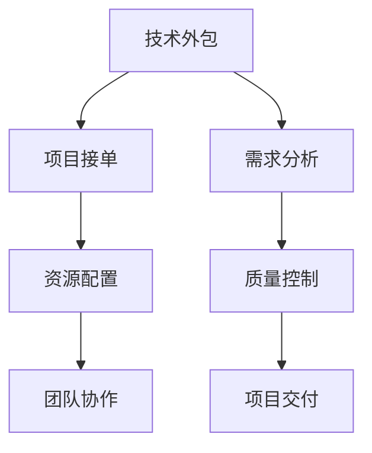

                 

# 技术外包：从接单到建立团队

> 关键词：技术外包,项目接单,团队建设,项目管理,资源配置

## 1. 背景介绍

### 1.1 问题由来

随着互联网和信息技术的发展，技术外包已成为全球企业提高运营效率、降低成本的重要手段之一。技术外包不仅可以帮助企业获取专业化、高水平的技术支持，还能快速响应市场变化，灵活调整资源配置。然而，技术外包也需要企业具备一定的管理能力，以确保外包项目的顺利进行和高效完成。

### 1.2 问题核心关键点

技术外包的核心在于如何从接单到建立团队，整个过程包括项目接单、需求分析、资源配置、团队协作、质量控制等多个环节。有效管理这些环节，能够帮助企业实现项目的高效执行和高质量成果。

## 2. 核心概念与联系

### 2.1 核心概念概述

为更好地理解技术外包从接单到建立团队的全过程，本节将介绍几个密切相关的核心概念：

- **技术外包**：企业将部分或全部技术工作委托给第三方公司或自由职业者，以降低运营成本、加速项目开发。

- **项目接单**：企业从多个外包服务供应商中筛选出合适的服务商，签订合同，接受其提供的技术方案和服务。

- **需求分析**：对客户提出的项目需求进行详细分析，明确项目目标、技术要求、时间节点等关键信息。

- **资源配置**：根据项目需求，选择合适的技术人才和工具，合理分配人力、物力和财力资源，确保项目顺利进行。

- **团队协作**：协调不同团队成员之间的沟通和合作，确保项目按计划推进，提升团队整体效率。

- **质量控制**：通过各种手段和方法，对项目交付成果进行检验和评估，确保项目达到预期的质量标准。

这些核心概念之间的逻辑关系可以通过以下Mermaid流程图来展示：



这个流程图展示了大规模外包项目的核心概念及其之间的关系：

1. 技术外包是整个流程的起点，企业决定将技术工作外包后，需要进行接单、需求分析等步骤。
2. 接单环节帮助企业选择合适的外包服务商，签订合同，并获取其提供的初步方案。
3. 需求分析确保客户需求被清晰理解，为后续资源配置和团队协作提供依据。
4. 资源配置阶段，选择合适的技术人才和工具，合理分配资源。
5. 团队协作贯穿整个项目周期，确保任务按时完成，并提升整体效率。
6. 质量控制对项目成果进行严格检验，保证最终交付的产品质量。

## 3. 核心算法原理 & 具体操作步骤

### 3.1 算法原理概述

从接单到建立团队的技术外包过程，本质上是一个项目管理过程，其核心是需求分析和资源配置。项目需求分析旨在明确客户的具体要求，而资源配置则涉及对人才和工具的合理分配，确保项目的高效执行。

形式化地，假设外包项目的需求为 $D$，资源集合为 $R$，项目时间为 $T$，则项目管理的目标是最小化项目成本 $C$，即：

$$
\min_{D, R, T} C
$$

其中，$C$ 包括人力成本、设备成本、沟通成本等，$T$ 包括项目开始和结束时间。

### 3.2 算法步骤详解

基于项目管理的技术外包过程，通常包括以下几个关键步骤：

**Step 1: 项目接单**

- 通过多种渠道收集外包项目信息，包括在线平台、社交媒体、业务伙伴推荐等。
- 对收集到的项目信息进行筛选和评估，选择与企业需求匹配度高的项目。
- 与合适的服务商签订合同，明确项目目标、交付时间、付款方式等关键条款。

**Step 2: 需求分析**

- 成立需求分析团队，与客户进行详细沟通，了解项目背景、业务目标、技术要求、时间节点等关键信息。
- 根据客户需求，明确项目需求文档，包括功能需求、非功能需求、性能指标等。
- 需求分析过程中，使用敏捷方法如Scrum或Kanban，与客户保持紧密沟通，确保需求理解的准确性。

**Step 3: 资源配置**

- 根据项目需求，确定所需的技术人才和工具，进行资源评估。
- 根据项目难度、时间节点、团队规模等因素，制定详细的资源配置计划，明确各阶段需要的人员和技术工具。
- 对于大型项目，采用任务分解、里程碑设置等方法，将项目细分为多个子任务，分配到不同的团队成员或团队。

**Step 4: 团队协作**

- 组建多学科团队，包括项目经理、开发工程师、测试工程师、UI/UX设计师等，确保项目各环节的顺利推进。
- 使用项目管理工具如Jira、Trello等，进行任务分配、进度跟踪、问题反馈等协作管理。
- 定期召开团队会议，汇报项目进展、协调沟通，确保团队成员之间的信息透明和高效协作。

**Step 5: 质量控制**

- 制定详细的质量控制计划，包括代码审查、功能测试、性能测试、安全测试等。
- 引入持续集成和持续交付(CI/CD)工具，如Jenkins、GitLab CI等，自动化构建和测试，提升质量控制效率。
- 进行定期的代码审查和功能复审，确保代码质量和功能准确性。

**Step 6: 项目交付**

- 项目完成后，进行综合测试，确保符合客户需求和质量标准。
- 交付项目成果，包括软件产品、文档、培训材料等。
- 进行项目验收，确保客户对交付成果的满意度和认可度。

### 3.3 算法优缺点

技术外包从接单到建立团队的方法具有以下优点：

1. **成本节约**：通过外包专业团队，企业可以避免从头搭建团队的开支，快速获取所需技术支持。
2. **灵活性高**：外包团队能够快速响应市场变化，调整资源配置，满足不同项目需求。
3. **专业能力**：外包服务商往往具备专业技能和丰富经验，能够提供高质量的技术服务。
4. **风险分散**：将部分业务外包，可以分散企业的运营风险，保障企业主业务的稳定运行。

同时，该方法也存在一些局限性：

1. **沟通成本高**：外包团队与企业之间的沟通成本较高，可能影响项目的进度和效率。
2. **质量控制难**：外包服务商的内部管理水平和服务质量难以统一，可能导致项目质量不稳定。
3. **信任问题**：外包服务商的专业性和诚信度需要验证，企业在选择时需要仔细评估。
4. **依赖性强**：企业对外包服务商的依赖度较高，一旦服务商出现问题，可能会影响项目进度。

尽管存在这些局限性，但就目前而言，技术外包仍是大中型企业获取技术支持的重要手段。未来相关研究的重点在于如何进一步优化接单和需求分析流程，提高团队协作和质量控制能力，同时兼顾成本和效率的平衡。

### 3.4 算法应用领域

技术外包从接单到建立团队的方法在多个领域得到了广泛应用，包括但不限于：

1. **软件开发**：企业通过外包团队，进行软件开发、测试、维护等工作，提升软件产品的开发效率和质量。
2. **数据科学**：企业将数据挖掘、分析、建模等技术工作外包给数据科学团队，获取数据驱动的业务洞察。
3. **云服务**：企业利用云服务提供商的外包团队，进行云计算平台建设、维护和优化，提升云服务水平。
4. **自动化测试**：企业将测试工作外包给自动化测试团队，通过自动化测试工具和平台，提高软件质量和安全。
5. **网络安全**：企业将网络安全工作外包给安全团队，进行渗透测试、漏洞修复和安全策略制定。
6. **用户体验设计**：企业将UI/UX设计工作外包给专业团队，提升产品的用户体验和市场竞争力。

这些领域的技术外包，已经深刻影响了企业的运营模式和业务发展。未来，随着外包服务的不断创新和提升，技术外包的应用场景将更加广泛，助力企业实现更高质量的发展。

## 4. 数学模型和公式 & 详细讲解 & 举例说明

### 4.1 数学模型构建

本节将使用数学语言对技术外包从接单到建立团队的过程进行更加严格的刻画。

假设企业选择的外包服务商为 $S$，客户需求为 $D$，项目时间为 $T$，人力成本为 $C_{\text{person}}$，设备成本为 $C_{\text{equipment}}$，沟通成本为 $C_{\text{communication}}$，项目难度为 $K$。

项目管理的目标是最大化项目交付质量和客户满意度，即：

$$
\max_{S, D, T} \text{Quality} + \text{Customer Satisfaction}
$$

其中，$\text{Quality}$ 表示项目交付的平均质量评分，$\text{Customer Satisfaction}$ 表示客户的满意度评分。

### 4.2 公式推导过程

以下我们以软件开发项目为例，推导成本控制和资源分配的数学模型。

假设项目需要 $n$ 名开发人员，每人每天的工作效率为 $P_i$，项目总时间为 $T$，则项目总成本 $C$ 可以表示为：

$$
C = n \times \sum_{i=1}^n P_i \times T
$$

其中 $n$ 为开发人员数量，$P_i$ 为第 $i$ 名开发人员的工作效率，$T$ 为项目总时间。

引入质量控制因素 $Q$，则项目总成本 $C$ 可以表示为：

$$
C = \alpha \times n \times \sum_{i=1}^n P_i \times T + \beta \times Q
$$

其中 $\alpha$ 为开发人员成本系数，$\beta$ 为质量控制成本系数。

假设质量控制成本为 $C_{\text{control}}$，则有：

$$
C_{\text{control}} = \gamma \times Q
$$

其中 $\gamma$ 为质量控制成本系数。

将 $C_{\text{control}}$ 代入总成本公式，得：

$$
C = \alpha \times n \times \sum_{i=1}^n P_i \times T + \beta \times \gamma \times Q
$$

### 4.3 案例分析与讲解

假设某企业需要开发一个网站，预计需要 5 名开发人员，每人每天的工作效率分别为 $P_1=2$、$P_2=3$、$P_3=4$、$P_4=5$、$P_5=6$，项目总时间为 60 天。

**计算步骤**：

1. **确定项目难度**：根据项目需求和客户沟通，确定项目难度 $K=10$。
2. **计算开发人员成本**：
   - 总成本 $C = \alpha \times n \times \sum_{i=1}^n P_i \times T$
   - 成本系数 $\alpha=10^4$，$n=5$，$P_i=2,3,4,5,6$，$T=60$，得：$C=10^4 \times 5 \times (2+3+4+5+6) \times 60 = 12,000,000$
3. **计算质量控制成本**：
   - 根据质量控制系数 $\beta=0.1$，$Q=K=10$，得 $C_{\text{control}} = 0.1 \times 10 = 1,000,000$
4. **计算总成本**：
   - $C_{\text{total}} = 12,000,000 + 1,000,000 = 13,000,000$

通过上述计算，企业可以更好地理解项目的成本结构和资源配置需求，制定更合理的资源分配和成本控制策略。

## 5. 项目实践：代码实例和详细解释说明

### 5.1 开发环境搭建

在进行技术外包项目开发前，我们需要准备好开发环境。以下是使用Python进行Flask框架开发的环境配置流程：

1. 安装Anaconda：从官网下载并安装Anaconda，用于创建独立的Python环境。

2. 创建并激活虚拟环境：
```bash
conda create -n flask-env python=3.8 
conda activate flask-env
```

3. 安装Flask：使用pip安装Flask框架：
```bash
pip install flask
```

4. 安装其他相关库：
```bash
pip install requests
```

完成上述步骤后，即可在`flask-env`环境中开始项目开发。

### 5.2 源代码详细实现

下面我们以一个简单的Web应用开发为例，给出使用Flask框架进行技术外包项目开发的PyTorch代码实现。

首先，定义Web应用的基本结构：

```python
from flask import Flask, request, jsonify

app = Flask(__name__)

@app.route('/')
def index():
    return 'Welcome to the Flask Web Application!'

@app.route('/project/<id>')
def project_details(id):
    # 根据id查询项目详情
    return jsonify({'id': id, 'name': 'Project X', 'description': 'A simple web app'})

if __name__ == '__main__':
    app.run(debug=True)
```

然后，定义项目接单和需求分析的函数：

```python
def project_request():
    # 模拟从外部接单
    project_id = 'P001'
    project_name = 'E-commerce Website'
    project_description = 'Develop a user-friendly e-commerce platform for online shopping.'
    
    # 返回项目详情
    return jsonify({'id': project_id, 'name': project_name, 'description': project_description})

@app.route('/project/request')
def get_project_request():
    return project_request()

@app.route('/project/demand')
def get_project_demand():
    # 模拟从客户获取需求
    demand = {
        'functionality': ['User registration', 'Product listing', 'Shopping cart', 'Payment processing'],
        'technology': ['Python', 'Flask', 'SQLAlchemy', 'Docker'],
        'timeframe': '6 weeks'
    }
    
    # 返回需求详情
    return jsonify(demand)
```

接着，定义资源配置和团队协作的函数：

```python
def resource_allocation():
    # 模拟资源分配
    resources = {
        'developers': ['Alice', 'Bob', 'Charlie', 'David', 'Eve'],
        'developers_efficiency': [2, 3, 4, 5, 6],
        'project_duration': 60
    }
    
    # 返回资源配置
    return jsonify(resources)

@app.route('/resource/allocate')
def allocate_resources():
    return resource_allocation()

@app.route('/team/collaborate')
def collaborate_team():
    # 模拟团队协作
    team_members = ['Alice', 'Bob', 'Charlie', 'David', 'Eve']
    team_tasks = ['User registration', 'Product listing', 'Shopping cart', 'Payment processing']
    team_schedule = {'Alice': {'start': 1, 'end': 5}, 'Bob': {'start': 2, 'end': 4}, 'Charlie': {'start': 3, 'end': 6}, 'David': {'start': 5, 'end': 8}, 'Eve': {'start': 6, 'end': 10}}
    
    # 返回团队协作详情
    return jsonify({'team_members': team_members, 'team_tasks': team_tasks, 'team_schedule': team_schedule})
```

最后，启动Web应用，模拟项目接单和需求分析过程：

```python
@app.route('/project/request')
def get_project_request():
    # 获取项目请求
    return project_request()

@app.route('/project/demand')
def get_project_demand():
    # 获取项目需求
    return get_project_demand()

@app.route('/resource/allocate')
def allocate_resources():
    # 分配资源
    return resource_allocation()

@app.route('/team/collaborate')
def collaborate_team():
    # 团队协作
    return collaborate_team()

if __name__ == '__main__':
    app.run(debug=True)
```

以上就是使用Flask框架进行技术外包项目开发的完整代码实现。可以看到，通过简单的代码编写，我们实现了项目接单、需求分析、资源配置和团队协作的基本功能。

### 5.3 代码解读与分析

让我们再详细解读一下关键代码的实现细节：

**Flask应用定义**：
- 创建Flask应用实例，并定义路由和处理函数，使得Web应用能够响应HTTP请求。

**项目接单函数**：
- 模拟从外部接单，返回项目的ID、名称和描述。
- 通过`@app.route`装饰器，将函数绑定到`/project/<id>`路径上，以便通过浏览器访问。

**项目需求分析函数**：
- 模拟从客户获取项目需求，包括功能、技术和时间节点等信息。
- 通过`@app.route`装饰器，将函数绑定到`/project/demand`路径上，以便通过浏览器访问。

**资源配置函数**：
- 模拟资源分配，包括开发人员、效率和项目时间。
- 通过`@app.route`装饰器，将函数绑定到`/resource/allocate`路径上，以便通过浏览器访问。

**团队协作函数**：
- 模拟团队协作，包括团队成员、任务和调度信息。
- 通过`@app.route`装饰器，将函数绑定到`/team/collaborate`路径上，以便通过浏览器访问。

**Web应用启动**：
- 在应用入口，启动Web应用，并设置`debug=True`，开启调试模式，方便调试代码。

通过上述代码实现，我们可以看到Flask框架的灵活性和易用性，可以快速构建Web应用，进行项目管理、资源配置和团队协作等功能。

## 6. 实际应用场景

### 6.1 智能制造

技术外包在智能制造领域得到了广泛应用。通过外包给专业制造服务商，企业可以快速提升生产效率和产品质量。

例如，某制造企业需要开发一套智能生产管理系统，通过外包给软件开发团队，可以迅速实现生产线自动化、设备监控和数据采集等功能。此外，还可以外包给设备维护团队，进行设备定期维护和故障处理，提升设备利用率和生产效率。

### 6.2 金融科技

金融科技领域的技术外包需求非常旺盛，涵盖软件开发、数据科学、云计算等多个方面。

例如，某金融科技公司需要构建一个高可用性、低延迟的云服务平台，通过外包给云计算服务商，可以迅速搭建分布式架构，优化系统性能。同时，还可以外包给数据科学团队，进行大数据分析和风险管理，提升金融产品的智能化水平。

### 6.3 医疗健康

医疗健康领域的技术外包需求主要集中在数据分析、AI应用和信息化建设等方面。

例如，某医疗健康公司需要开发一套智能诊断系统，通过外包给软件开发团队，可以迅速实现图像识别、语音识别和自然语言处理等技术，提升诊断准确率。同时，还可以外包给AI应用团队，进行健康数据分析和精准医疗，提升诊疗效果。

### 6.4 未来应用展望

随着技术外包的不断发展，其在更多领域的应用前景将更加广阔。未来，技术外包将与云计算、物联网、人工智能等技术深度融合，推动各行业的数字化转型和智能化升级。

在智慧城市建设中，技术外包可以实现城市管理、公共安全、交通控制等多领域的智能化应用。在智能家居领域，技术外包可以帮助企业构建智能家居解决方案，提升用户体验和安全性。

此外，随着企业对技术外包的需求不断增加，外包服务商的专业化水平和服务质量也将不断提高，进一步推动技术外包行业的健康发展。

## 7. 工具和资源推荐
### 7.1 学习资源推荐

为了帮助开发者系统掌握技术外包的理论基础和实践技巧，这里推荐一些优质的学习资源：

1. **《精益软件开发》**：介绍精益思想在软件开发中的应用，帮助企业优化资源配置，提升开发效率。
2. **《敏捷项目管理》**：介绍敏捷方法在项目管理中的应用，帮助企业快速响应市场需求，提升项目成功率。
3. **《项目管理最佳实践》**：总结了项目管理中常见的最佳实践，涵盖需求分析、资源配置、团队协作等方面，是项目管理的经典参考书。
4. **《技术外包管理》**：详细介绍技术外包的管理方法和技术工具，帮助企业有效管理外包项目，提升项目质量。
5. **《云服务架构设计》**：介绍云服务架构的设计原则和实践方法，帮助企业构建高效、可靠的云服务平台。

通过对这些资源的学习实践，相信你一定能够快速掌握技术外包的理论基础和实践技巧，并用于解决实际的IT问题。
###  7.2 开发工具推荐

高效的开发离不开优秀的工具支持。以下是几款用于技术外包开发的常用工具：

1. **JIRA**：项目管理工具，支持任务分配、进度跟踪、问题反馈等功能，适用于团队协作和项目管理。
2. **Confluence**：知识共享和协作平台，支持文档共享、团队讨论、任务跟踪等功能，方便团队成员之间的信息共享。
3. **GitLab**：开源代码托管平台，支持版本控制、持续集成、持续交付等功能，方便开发团队进行代码管理和协作。
4. **Slack**：即时通讯工具，支持团队成员之间的沟通和协作，提升沟通效率。
5. **Zoom**：视频会议工具，支持高清视频、音频和屏幕共享，方便远程协作和团队会议。
6. **Trello**：看板式项目管理工具，支持任务卡片、进度跟踪、标签等功能，适合小型团队的项目管理。

合理利用这些工具，可以显著提升技术外包项目的开发效率，减少沟通和协作成本，提高项目管理水平。

### 7.3 相关论文推荐

技术外包技术的发展源于学界的持续研究。以下是几篇奠基性的相关论文，推荐阅读：

1. **《敏捷软件开发：原则、模式与实践》**：总结了敏捷开发的原则和方法，帮助企业提升软件开发效率和质量。
2. **《精益项目管理：精简流程，提高效率》**：介绍精益项目管理的理念和方法，帮助企业优化资源配置，提升项目管理水平。
3. **《云计算架构设计：构建可扩展、高可用性系统》**：介绍云计算架构的设计原则和实践方法，帮助企业构建高效、可靠的云服务平台。
4. **《技术外包管理：挑战与机遇》**：总结了技术外包管理中的常见挑战和解决方法，帮助企业有效管理外包项目，提升项目质量。
5. **《云计算和大数据技术在医疗健康领域的应用》**：介绍了云计算和大数据技术在医疗健康领域的应用，帮助医疗健康企业提升诊疗效果和服务质量。

这些论文代表了大规模外包项目的最新研究进展，通过学习这些前沿成果，可以帮助研究者把握学科前进方向，激发更多的创新灵感。

## 8. 总结：未来发展趋势与挑战

### 8.1 总结

本文对技术外包从接单到建立团队的过程进行了全面系统的介绍。首先阐述了技术外包的背景和意义，明确了接单、需求分析、资源配置、团队协作、质量控制等关键环节的管理思路。其次，从原理到实践，详细讲解了项目管理的目标和实现方法，给出了技术外包项目的完整代码实现。同时，本文还广泛探讨了技术外包在智能制造、金融科技、医疗健康等多个领域的应用前景，展示了技术外包的广阔前景。最后，本文精选了技术外包技术的各类学习资源，力求为读者提供全方位的技术指引。

通过本文的系统梳理，可以看到，技术外包从接单到建立团队的方法正在成为企业获取技术支持的重要手段，极大地提升了企业的运营效率和市场竞争力。未来，随着技术外包技术的不断演进，其在更多领域的应用将更加广泛，推动企业实现更高质量的发展。

### 8.2 未来发展趋势

展望未来，技术外包技术将呈现以下几个发展趋势：

1. **平台化**：技术外包平台将逐步发展成熟，帮助企业更高效地对接各类外包服务商，提升项目执行效率。
2. **自动化**：自动化工具将不断引入外包管理流程中，如自动化需求分析、资源配置、任务调度等，提升项目管理的智能化水平。
3. **全球化**：技术外包市场将进一步全球化，企业可以更灵活地选择全球优质的外包服务商，提升项目质量。
4. **数据驱动**：通过数据分析和人工智能技术，提升项目管理决策的准确性和智能化水平，优化资源配置。
5. **多模态协作**：引入多模态信息处理技术，提升团队协作和沟通效率，实现更高效的项目执行。

以上趋势凸显了技术外包技术的广阔前景。这些方向的探索发展，必将进一步提升技术外包项目的执行效率和质量，推动企业实现更高质量的发展。

### 8.3 面临的挑战

尽管技术外包技术已经取得了显著成效，但在迈向更加智能化、普适化应用的过程中，它仍面临着诸多挑战：

1. **沟通成本高**：外包团队与企业之间的沟通成本较高，可能影响项目的进度和效率。
2. **质量控制难**：外包服务商的内部管理水平和服务质量难以统一，可能导致项目质量不稳定。
3. **信任问题**：外包服务商的专业性和诚信度需要验证，企业在选择时需要仔细评估。
4. **依赖性强**：企业对外包服务商的依赖度较高，一旦服务商出现问题，可能会影响项目进度。
5. **成本控制难**：外包项目涉及多方面成本，如人力成本、设备成本、沟通成本等，控制不当可能导致成本超支。

尽管存在这些挑战，但通过不断的技术创新和管理优化，相信技术外包技术能够逐步克服这些难题，实现更高的质量和效率。

### 8.4 研究展望

未来，技术外包技术需要在以下几个方面寻求新的突破：

1. **引入自动化和智能化**：引入自动化和智能化技术，提升项目管理的效率和质量。
2. **优化资源配置**：优化资源配置策略，提高资源的利用率和项目执行效率。
3. **增强数据驱动决策**：通过数据分析和人工智能技术，提升项目管理决策的准确性和智能化水平。
4. **加强多模态协作**：引入多模态信息处理技术，提升团队协作和沟通效率。
5. **构建数据共享平台**：构建数据共享平台，提升团队成员之间的信息透明度和协作效率。

这些研究方向的探索，必将引领技术外包技术迈向更高的台阶，为企业的技术支持提供更优质的解决方案，推动企业的数字化转型和智能化升级。

## 9. 附录：常见问题与解答

**Q1：技术外包适合所有企业吗？**

A: 技术外包适合需要获取专业化技术支持的中大型企业，特别是那些没有能力或资源自行开发复杂系统的企业。但小微企业和创业公司可能面临外包服务商的高额成本和沟通成本。

**Q2：如何选择合适的外包服务商？**

A: 选择外包服务商时，需要考虑其技术能力、项目经验、服务质量、报价水平等多方面因素。可以通过在线平台、社交媒体、业务伙伴推荐等多种渠道获取服务商信息，并进行详细的项目和技术评估。

**Q3：如何降低技术外包的成本？**

A: 降低技术外包成本的主要方法包括：
1. 进行需求分析和资源配置，避免资源浪费和不必要的成本。
2. 引入自动化和智能化技术，提升项目管理的效率和质量。
3. 选择合适的项目管理工具和平台，提升沟通和协作效率。
4. 优化项目流程和执行方法，减少人力和设备投入。

**Q4：如何确保外包项目的质量？**

A: 确保外包项目质量的主要方法包括：
1. 明确项目需求和目标，确保服务商理解并符合客户要求。
2. 引入持续集成和持续交付工具，自动化构建和测试，提升质量控制效率。
3. 定期进行代码审查和功能复审，确保代码质量和功能准确性。
4. 进行定期的项目验收和评估，确保项目成果满足客户需求和质量标准。

**Q5：如何应对技术外包中的沟通问题？**

A: 应对技术外包中的沟通问题的主要方法包括：
1. 建立明确的沟通机制和流程，确保双方信息透明和高效沟通。
2. 选择合适的沟通工具和平台，如Slack、Zoom等，提升沟通效率。
3. 建立定期的沟通和反馈机制，及时解决沟通中的问题和障碍。

通过以上问答，可以看出技术外包技术的广泛应用和重要意义，希望本文能够为读者提供全面的技术指引，帮助企业实现更高质量的发展。

---

作者：禅与计算机程序设计艺术 / Zen and the Art of Computer Programming

