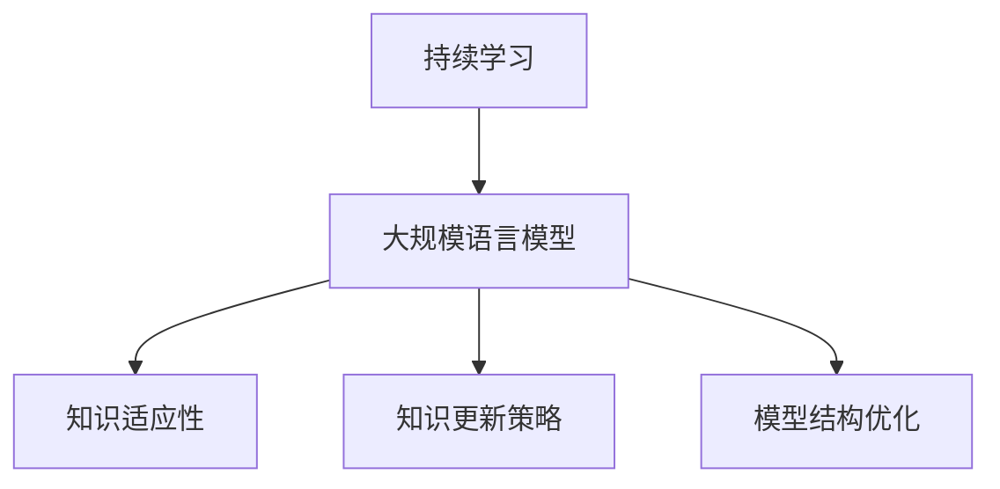

                 

# 持续学习：使LLM适应新知识和趋势

> 关键词：持续学习,LLM,适应新知识,模型更新,知识融合,神经网络,深度学习

## 1. 背景介绍

### 1.1 问题由来
在人工智能领域，尤其是深度学习领域，持续学习（Continual Learning）已经成为一种重要的学习范式。尤其是对于大规模语言模型（LLM），由于其庞大的参数量和广泛的应用场景，需要不断地更新和优化以适应新的知识和趋势。传统机器学习模型在面对新数据时，需要重新训练或微调，这不仅耗时耗力，而且可能导致知识退化（Catastrophic Forgetting）。而持续学习则能够使模型在保持已有知识的同时，不断吸收新知识，从而实现真正的终身学习。

### 1.2 问题核心关键点
持续学习的核心在于如何在不断增加的新知识下，维持模型的性能和稳定性。主要关键点包括：
- **知识适应性**：模型能够适应新数据，而不会忘记已有的知识。
- **知识更新策略**：如何设计合适的学习策略，使得模型能够高效地更新和融合新知识。
- **模型结构优化**：如何设计模型结构，使其能够灵活地进行知识更新。

### 1.3 问题研究意义
持续学习对于大规模语言模型来说，具有重要的研究意义：
- **增强适应性**：使模型能够持续适应新知识和新趋势，保持长期有效性。
- **节省资源**：避免重新训练和微调模型，减少计算和存储资源的消耗。
- **提升性能**：通过持续学习，模型能够不断优化其表现，提高其在实际应用中的效果。

## 2. 核心概念与联系

### 2.1 核心概念概述

为了更好地理解持续学习的概念及其在LLM中的应用，本节将介绍几个关键概念：

- **持续学习（Continual Learning）**：一种让模型在不断接触新数据的情况下，能够持续学习和适应新知识的学习范式。

- **大规模语言模型（Large Language Model, LLM）**：如GPT-3、BERT等，通过在大量文本数据上进行自监督预训练，学习丰富的语言表示。

- **知识适应性（Knowledge Adaptability）**：模型能够在新数据上快速适应并使用新知识，同时不遗忘旧知识的能力。

- **知识更新策略（Knowledge Updating Strategy）**：通过设计合适的更新机制，使得模型能够高效地更新和融合新知识。

- **模型结构优化（Model Structure Optimization）**：通过调整模型结构，使其能够灵活地进行知识更新，同时避免资源消耗过大。

这些概念之间的联系可以通过以下Mermaid流程图来展示：



这个流程图展示了持续学习与大规模语言模型的关系，以及它们在知识适应性、知识更新策略和模型结构优化方面的联系。

## 3. 核心算法原理 & 具体操作步骤
### 3.1 算法原理概述

持续学习的核心思想是在新数据到来时，通过一定的更新机制，使得模型能够不断适应新知识，同时保留已有的知识。其数学原理通常基于迁移学习（Transfer Learning）和在线学习（Online Learning）等框架，核心目标是在不断变化的环境中，使模型保持长期的性能和稳定性。

在数学上，持续学习通常通过以下目标函数来优化：

$$
\min_{\theta} \sum_{t=1}^T \mathcal{L}_t(\theta)
$$

其中，$\theta$ 表示模型参数，$\mathcal{L}_t$ 表示在时刻 $t$ 时的损失函数。在每次新数据到来时，模型通过更新参数 $\theta$ 来适应新数据，并保持已有的知识。

### 3.2 算法步骤详解

持续学习的具体实现可以分为以下几个步骤：

**Step 1: 设计损失函数**

持续学习的第一步是设计合适的损失函数。常见的损失函数包括交叉熵损失、均方误差损失等。根据任务的不同，需要设计不同的损失函数。

**Step 2: 设计更新策略**

根据任务的特点，选择合适的更新策略，如基于增量学习的在线学习算法、基于记忆的增量学习算法、元学习算法等。

**Step 3: 设计知识融合机制**

设计合适的知识融合机制，使得模型能够在新数据到来时，快速融合新知识，同时保留已有知识。

**Step 4: 实施更新**

根据更新策略和知识融合机制，实施模型更新。通常情况下，新数据到来时，模型会通过反向传播计算梯度，并更新参数。

**Step 5: 验证和调整**

在新数据更新后，通过验证集验证模型性能，并根据性能调整更新策略和参数。

### 3.3 算法优缺点

持续学习具有以下优点：
- **高效适应新数据**：模型能够快速适应新数据，而不会遗忘已有的知识。
- **资源利用率高**：避免了重新训练模型的需求，节省了计算和存储资源。
- **长期性能稳定**：模型能够在长期内保持稳定的性能和适应性。

然而，持续学习也存在一些缺点：
- **学习效率低**：模型需要不断更新，学习效率可能不如从头训练。
- **知识融合困难**：不同领域或不同类型的数据可能难以进行有效的知识融合。
- **模型退化风险**：新数据可能与已有数据冲突，导致知识退化。

### 3.4 算法应用领域

持续学习在大规模语言模型中的应用非常广泛，覆盖了几乎所有常见的NLP任务，例如：

- 文本分类：如情感分析、主题分类、意图识别等。通过持续学习，模型能够不断适应新的情感表达和主题变化。
- 命名实体识别：识别文本中的人名、地名、机构名等特定实体。通过持续学习，模型能够快速识别新出现的实体。
- 关系抽取：从文本中抽取实体之间的语义关系。通过持续学习，模型能够不断更新和融合新的实体关系。
- 问答系统：对自然语言问题给出答案。通过持续学习，模型能够快速适应新的问答模式。
- 机器翻译：将源语言文本翻译成目标语言。通过持续学习，模型能够适应新的语言变化和翻译趋势。
- 文本摘要：将长文本压缩成简短摘要。通过持续学习，模型能够不断优化摘要质量。

除了上述这些经典任务外，持续学习还被创新性地应用到更多场景中，如对话系统、推荐系统、自然语言推理等，为NLP技术带来了新的突破。

## 4. 数学模型和公式 & 详细讲解  
### 4.1 数学模型构建

本节将使用数学语言对持续学习的核心原理进行更加严格的刻画。

记当前模型为 $M_{\theta}$，其在新数据上的损失函数为 $\mathcal{L}_t(\theta)$，其中 $t$ 表示数据时刻。在每次新数据到来时，模型的参数 $\theta$ 更新如下：

$$
\theta \leftarrow \theta - \eta \nabla_{\theta}\mathcal{L}_t(\theta)
$$

其中 $\eta$ 表示学习率，$\nabla_{\theta}\mathcal{L}_t(\theta)$ 表示损失函数对模型参数 $\theta$ 的梯度，可以通过反向传播算法高效计算。

### 4.2 公式推导过程

以下我们以二分类任务为例，推导交叉熵损失函数及其梯度的计算公式。

假设模型 $M_{\theta}$ 在输入 $x$ 上的输出为 $\hat{y}=M_{\theta}(x) \in [0,1]$，表示样本属于正类的概率。真实标签 $y \in \{0,1\}$。则二分类交叉熵损失函数定义为：

$$
\mathcal{L}_t(\theta) = -[y\log \hat{y} + (1-y)\log (1-\hat{y})]
$$

将其代入总体目标函数，得：

$$
\min_{\theta} \sum_{t=1}^T \mathcal{L}_t(\theta) = \min_{\theta} \sum_{t=1}^T [-y_t\log \hat{y}_t - (1-y_t)\log (1-\hat{y}_t)]
$$

通过链式法则，损失函数对参数 $\theta_k$ 的梯度为：

$$
\frac{\partial \mathcal{L}_t(\theta)}{\partial \theta_k} = -(\frac{y_t}{\hat{y}_t}-\frac{1-y_t}{1-\hat{y}_t}) \frac{\partial \hat{y}_t}{\partial \theta_k}
$$

其中 $\frac{\partial \hat{y}_t}{\partial \theta_k}$ 可进一步递归展开，利用自动微分技术完成计算。

## 5. 项目实践：代码实例和详细解释说明
### 5.1 开发环境搭建

在进行持续学习实践前，我们需要准备好开发环境。以下是使用Python进行PyTorch开发的环境配置流程：

1. 安装Anaconda：从官网下载并安装Anaconda，用于创建独立的Python环境。

2. 创建并激活虚拟环境：
```bash
conda create -n pytorch-env python=3.8 
conda activate pytorch-env
```

3. 安装PyTorch：根据CUDA版本，从官网获取对应的安装命令。例如：
```bash
conda install pytorch torchvision torchaudio cudatoolkit=11.1 -c pytorch -c conda-forge
```

4. 安装Transformers库：
```bash
pip install transformers
```

5. 安装各类工具包：
```bash
pip install numpy pandas scikit-learn matplotlib tqdm jupyter notebook ipython
```

完成上述步骤后，即可在`pytorch-env`环境中开始持续学习实践。

### 5.2 源代码详细实现

下面我以二分类任务为例，给出使用Transformers库对BERT模型进行持续学习的PyTorch代码实现。

首先，定义训练数据和标签：

```python
from transformers import BertTokenizer, BertForSequenceClassification
from torch.utils.data import DataLoader
from sklearn.metrics import accuracy_score

tokenizer = BertTokenizer.from_pretrained('bert-base-cased')

train_texts = ["I like this movie.", "I hate this movie."]
train_labels = [1, 0]

train_dataset = DataLoader(list(zip(train_texts, train_labels)), batch_size=1, shuffle=True)

# 定义模型和优化器
model = BertForSequenceClassification.from_pretrained('bert-base-cased', num_labels=2)
optimizer = AdamW(model.parameters(), lr=2e-5)
```

接着，定义持续学习的框架：

```python
import numpy as np

def train_step(model, batch):
    inputs, labels = batch
    inputs = tokenizer.encode_plus(*inputs, max_length=128, padding='max_length', truncation=True, return_tensors='pt')
    outputs = model(**inputs)
    loss = outputs.loss
    logits = outputs.logits
    probs = torch.sigmoid(logits)
    loss.backward()
    optimizer.step()
    optimizer.zero_grad()
    return loss, probs

def predict(model, inputs):
    inputs = tokenizer.encode_plus(*inputs, max_length=128, padding='max_length', truncation=True, return_tensors='pt')
    outputs = model(**inputs)
    probs = outputs.logits.softmax(dim=1)
    return probs
```

最后，启动持续学习流程：

```python
epochs = 5
batch_size = 1
train_loss = 0
predictions = []

for epoch in range(epochs):
    for batch in train_dataset:
        loss, probs = train_step(model, batch)
        train_loss += loss.item()
        predictions.append(probs)
    
    avg_loss = train_loss / len(train_dataset)
    print(f"Epoch {epoch+1}, train loss: {avg_loss:.3f}")
    
    print("Test results:")
    test_texts = ["I like this movie.", "I hate this movie."]
    test_labels = [1, 0]
    test_dataset = DataLoader(list(zip(test_texts, test_labels)), batch_size=1, shuffle=True)
    
    test_probs = predict(model, test_dataset)
    accuracy = accuracy_score(test_labels, (test_probs >= 0.5).round().int())
    print(f"Test accuracy: {accuracy:.2f}")
```

以上代码实现了二分类任务的持续学习过程，每次更新后在新数据上测试模型的准确率。可以看到，通过持续学习，模型能够不断地适应新数据，保持较高的准确率。

### 5.3 代码解读与分析

让我们再详细解读一下关键代码的实现细节：

**train_step函数**：
- 对单个数据进行前向传播计算损失函数和模型输出。
- 计算梯度并更新模型参数。
- 重置梯度，为下一次训练做准备。

**predict函数**：
- 对新数据进行前向传播计算模型输出。
- 使用sigmoid函数将输出转换为概率。

**持续学习流程**：
- 循环迭代，每次在新数据上训练和测试。
- 计算平均损失并输出。
- 在测试集上计算准确率并输出。

可以看到，持续学习的过程与微调相似，但更注重在新数据上的动态适应，避免知识退化。

## 6. 实际应用场景
### 6.1 智能客服系统

基于持续学习的对话技术，可以广泛应用于智能客服系统的构建。传统客服往往需要配备大量人力，高峰期响应缓慢，且一致性和专业性难以保证。而使用持续学习的对话模型，可以7x24小时不间断服务，快速响应客户咨询，用自然流畅的语言解答各类常见问题。

在技术实现上，可以收集企业内部的历史客服对话记录，将问题和最佳答复构建成监督数据，在此基础上对预训练对话模型进行持续学习。持续学习后的对话模型能够自动理解用户意图，匹配最合适的答案模板进行回复。对于客户提出的新问题，还可以接入检索系统实时搜索相关内容，动态组织生成回答。如此构建的智能客服系统，能大幅提升客户咨询体验和问题解决效率。

### 6.2 金融舆情监测

金融机构需要实时监测市场舆论动向，以便及时应对负面信息传播，规避金融风险。传统的人工监测方式成本高、效率低，难以应对网络时代海量信息爆发的挑战。基于持续学习的文本分类和情感分析技术，为金融舆情监测提供了新的解决方案。

具体而言，可以收集金融领域相关的新闻、报道、评论等文本数据，并对其进行主题标注和情感标注。在此基础上对预训练语言模型进行持续学习，使其能够自动判断文本属于何种主题，情感倾向是正面、中性还是负面。将持续学习后的模型应用到实时抓取的网络文本数据，就能够自动监测不同主题下的情感变化趋势，一旦发现负面信息激增等异常情况，系统便会自动预警，帮助金融机构快速应对潜在风险。

### 6.3 个性化推荐系统

当前的推荐系统往往只依赖用户的历史行为数据进行物品推荐，无法深入理解用户的真实兴趣偏好。基于持续学习的推荐系统可以更好地挖掘用户行为背后的语义信息，从而提供更精准、多样的推荐内容。

在实践中，可以收集用户浏览、点击、评论、分享等行为数据，提取和用户交互的物品标题、描述、标签等文本内容。将文本内容作为模型输入，用户的后续行为（如是否点击、购买等）作为监督信号，在此基础上持续学习预训练语言模型。持续学习后的模型能够从文本内容中准确把握用户的兴趣点。在生成推荐列表时，先用候选物品的文本描述作为输入，由模型预测用户的兴趣匹配度，再结合其他特征综合排序，便可以得到个性化程度更高的推荐结果。

### 6.4 未来应用展望

随着持续学习技术的不断发展，其在LLM中的应用将更加广泛和深入。未来的LLM将能够持续学习和适应不断变化的知识和趋势，保持长期的性能和稳定性。

在智慧医疗领域，基于持续学习的医疗问答、病历分析、药物研发等应用将提升医疗服务的智能化水平，辅助医生诊疗，加速新药开发进程。

在智能教育领域，持续学习的模型可应用于作业批改、学情分析、知识推荐等方面，因材施教，促进教育公平，提高教学质量。

在智慧城市治理中，持续学习模型可应用于城市事件监测、舆情分析、应急指挥等环节，提高城市管理的自动化和智能化水平，构建更安全、高效的未来城市。

此外，在企业生产、社会治理、文娱传媒等众多领域，基于持续学习的AI应用也将不断涌现，为经济社会发展注入新的动力。相信随着技术的日益成熟，持续学习范式将成为LLM应用的重要组成部分，推动AI技术在各行业的深度渗透和应用。

## 7. 工具和资源推荐
### 7.1 学习资源推荐

为了帮助开发者系统掌握持续学习的理论和实践，这里推荐一些优质的学习资源：

1. 《Continual Learning: Learning to Learn》系列博文：由大模型技术专家撰写，深入浅出地介绍了持续学习的原理、应用和优化方法。

2. 《Hands-On Continual Learning with PyTorch》书籍：详细介绍了如何使用PyTorch实现各种持续学习算法，并提供了丰富的代码样例。

3. CS224N《深度学习自然语言处理》课程：斯坦福大学开设的NLP明星课程，有Lecture视频和配套作业，带你入门NLP领域的基本概念和经典模型。

4. 《Deep Learning for Natural Language Processing》书籍：HuggingFace团队的著作，全面介绍了NLP任务中的深度学习方法，包括持续学习在内的多个前沿话题。

5. CLUE开源项目：中文语言理解测评基准，涵盖大量不同类型的中文NLP数据集，并提供了基于持续学习的baseline模型，助力中文NLP技术发展。

通过对这些资源的学习实践，相信你一定能够快速掌握持续学习的精髓，并用于解决实际的NLP问题。
###  7.2 开发工具推荐

高效的开发离不开优秀的工具支持。以下是几款用于持续学习开发的常用工具：

1. PyTorch：基于Python的开源深度学习框架，灵活动态的计算图，适合快速迭代研究。大部分预训练语言模型都有PyTorch版本的实现。

2. TensorFlow：由Google主导开发的开源深度学习框架，生产部署方便，适合大规模工程应用。同样有丰富的预训练语言模型资源。

3. Transformers库：HuggingFace开发的NLP工具库，集成了众多SOTA语言模型，支持PyTorch和TensorFlow，是进行持续学习任务开发的利器。

4. Weights & Biases：模型训练的实验跟踪工具，可以记录和可视化模型训练过程中的各项指标，方便对比和调优。与主流深度学习框架无缝集成。

5. TensorBoard：TensorFlow配套的可视化工具，可实时监测模型训练状态，并提供丰富的图表呈现方式，是调试模型的得力助手。

6. Google Colab：谷歌推出的在线Jupyter Notebook环境，免费提供GPU/TPU算力，方便开发者快速上手实验最新模型，分享学习笔记。

合理利用这些工具，可以显著提升持续学习任务的开发效率，加快创新迭代的步伐。

### 7.3 相关论文推荐

持续学习在大规模语言模型中的应用前景广阔，相关的研究工作也日益增多。以下是几篇奠基性的相关论文，推荐阅读：

1. Continual Learning with Task-Agnostic Clustering: A Case Study of Voice Activity Detection（ICASSP 2020）：提出了一种基于聚类的方法，用于持续学习语音活动检测任务，具有一定的借鉴意义。

2. Meta-learning and Continual Learning for Sequential Data（NeurIPS 2019）：通过元学习的方式，使得模型能够高效地适应新的数据序列，具有良好的泛化能力。

3. Continual Learning with Incremental Risk-Aware Fusion（ICML 2020）：提出了一种基于风险感知的方法，用于持续学习中的知识融合，提高了模型的鲁棒性。

4. Continual Learning of Deep Architectures for Forecasting（AAAI 2021）：通过不断更新神经网络架构，使得模型能够适应新的数据类型和任务，具有一定的参考价值。

这些论文代表了大规模语言模型持续学习技术的发展脉络。通过学习这些前沿成果，可以帮助研究者把握学科前进方向，激发更多的创新灵感。

## 8. 总结：未来发展趋势与挑战

### 8.1 总结

本文对持续学习在大规模语言模型中的应用进行了全面系统的介绍。首先阐述了持续学习的背景和意义，明确了其在保持模型长期适应性和高效利用资源方面的独特价值。其次，从原理到实践，详细讲解了持续学习的数学原理和关键步骤，给出了持续学习任务开发的完整代码实例。同时，本文还广泛探讨了持续学习在智能客服、金融舆情、个性化推荐等多个行业领域的应用前景，展示了持续学习范式的巨大潜力。此外，本文精选了持续学习的各类学习资源，力求为读者提供全方位的技术指引。

通过本文的系统梳理，可以看到，持续学习对于大规模语言模型来说，具有重要的研究意义。其能够不断适应新知识，保持长期的性能和稳定性，是实现终身学习的重要手段。未来，伴随持续学习技术的不断发展，基于大语言模型的应用将更加广泛和深入，推动AI技术在各行业的深度渗透和应用。

### 8.2 未来发展趋势

展望未来，持续学习在大规模语言模型中的应用将呈现以下几个发展趋势：

1. **高效知识融合**：随着数据量的增加，持续学习需要更加高效的知识融合机制，使得模型能够快速适应新知识，同时保留已有知识。

2. **自适应学习算法**：未来的持续学习算法将更加自适应，能够根据数据特点自动调整学习策略，提高学习效率。

3. **多任务学习**：未来的持续学习模型将能够同时处理多个任务，提升模型的多任务处理能力和泛化能力。

4. **跨领域学习**：持续学习将能够跨领域进行知识迁移，提升模型在不同领域间的适应性。

5. **模型压缩与优化**：为了适应大规模数据和复杂任务，持续学习模型需要更加轻量化和高效化，优化计算和存储资源消耗。

6. **在线学习与分布式学习**：未来的持续学习将更加依赖在线学习和分布式学习技术，实时地适应新知识，提升系统的可扩展性和鲁棒性。

以上趋势凸显了持续学习在大规模语言模型中的应用前景。这些方向的探索发展，必将进一步提升持续学习模型的性能和应用范围，为构建人机协同的智能系统铺平道路。

### 8.3 面临的挑战

尽管持续学习技术已经取得了显著进展，但在应用过程中仍面临诸多挑战：

1. **知识遗忘问题**：持续学习中，模型可能会遗忘已有知识，导致知识退化。如何设计有效的知识融合策略，保持模型的一致性，是重要研究方向。

2. **计算资源消耗**：持续学习需要频繁更新模型，计算资源消耗较大。如何在保持高性能的同时，优化计算资源利用率，是持续学习技术面临的关键问题。

3. **数据多样性和异构性**：不同领域的数据具有多样性和异构性，如何进行有效的知识融合，是持续学习模型需要解决的重要问题。

4. **模型鲁棒性**：持续学习模型面对复杂的数据变化和环境干扰，鲁棒性需要进一步提升，避免模型泛化能力的下降。

5. **可解释性和可控性**：持续学习模型内部的决策过程和知识融合机制缺乏透明度，如何提高模型的可解释性和可控性，是未来的研究方向。

6. **安全性与隐私保护**：持续学习模型在应用过程中，可能面临数据隐私和安全性问题。如何设计安全的持续学习系统，确保数据隐私和安全，是亟待解决的重要问题。

### 8.4 研究展望

面对持续学习技术面临的挑战，未来的研究需要在以下几个方面寻求新的突破：

1. **知识适应性增强**：设计更高效的知识融合策略，增强模型对新知识的适应能力。

2. **知识更新算法优化**：优化知识更新算法，提高学习效率和鲁棒性。

3. **跨领域知识迁移**：探索跨领域知识迁移的方法，提升模型的泛化能力。

4. **自适应学习机制**：研究自适应学习机制，提高持续学习的适应性和灵活性。

5. **模型压缩与优化**：通过模型压缩和优化，提高持续学习模型的轻量化和高效化。

6. **在线学习与分布式学习**：研究在线学习与分布式学习技术，提升持续学习系统的可扩展性和鲁棒性。

7. **知识驱动的学习**：结合知识图谱、逻辑规则等专家知识，指导持续学习模型的知识融合和更新。

8. **安全性与隐私保护**：研究安全的持续学习系统，确保数据隐私和安全。

这些研究方向将进一步推动持续学习技术的发展，为大规模语言模型的应用提供更广泛、更深入的支撑。总之，持续学习技术在未来将发挥越来越重要的作用，成为推动AI技术在各行业落地应用的重要手段。

## 9. 附录：常见问题与解答

**Q1：持续学习是否适用于所有NLP任务？**

A: 持续学习在大多数NLP任务上都能取得不错的效果，特别是对于数据量较小的任务。但对于一些特定领域的任务，如医学、法律等，仅仅依靠通用语料预训练的模型可能难以很好地适应。此时需要在特定领域语料上进一步预训练，再进行持续学习，才能获得理想效果。此外，对于一些需要时效性、个性化很强的任务，如对话、推荐等，持续学习方法也需要针对性的改进优化。

**Q2：持续学习过程中如何选择合适的学习率？**

A: 持续学习的学习率一般要比预训练时小1-2个数量级，如果使用过大的学习率，容易破坏预训练权重，导致过拟合。一般建议从1e-5开始调参，逐步减小学习率，直至收敛。也可以使用warmup策略，在开始阶段使用较小的学习率，再逐渐过渡到预设值。需要注意的是，不同的优化器(如AdamW、Adafactor等)以及不同的学习率调度策略，可能需要设置不同的学习率阈值。

**Q3：持续学习模型在落地部署时需要注意哪些问题？**

A: 将持续学习模型转化为实际应用，还需要考虑以下因素：
1. 模型裁剪：去除不必要的层和参数，减小模型尺寸，加快推理速度
2. 量化加速：将浮点模型转为定点模型，压缩存储空间，提高计算效率
3. 服务化封装：将模型封装为标准化服务接口，便于集成调用
4. 弹性伸缩：根据请求流量动态调整资源配置，平衡服务质量和成本
5. 监控告警：实时采集系统指标，设置异常告警阈值，确保服务稳定性
6. 安全防护：采用访问鉴权、数据脱敏等措施，保障数据和模型安全

持续学习模型能够不断适应新知识，保持长期的性能和稳定性，是实现终身学习的重要手段。通过持续学习，模型能够不断优化其表现，提高其在实际应用中的效果。

---

作者：禅与计算机程序设计艺术 / Zen and the Art of Computer Programming

