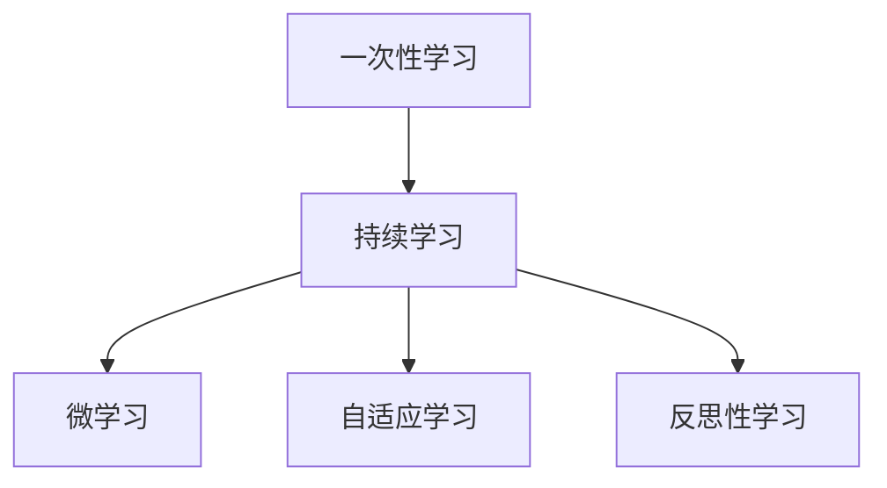

                 

# 持续学习：管理者的成功秘诀

在当前快速变化的时代，持续学习已成为管理者取得成功的不二法门。本文将系统介绍持续学习的核心概念、关键算法和实际应用，并结合具体案例进行详细讲解，帮助管理者在复杂多变的商业环境中保持竞争力。

## 1. 背景介绍

### 1.1 问题由来
随着科技和市场的快速发展，企业环境变得愈加不确定和复杂。管理者们需要不断学习新知识、新技能，以适应变化，推动业务发展。但传统的“一次性学习”（One-Time Learning）模式已无法满足这些需求，持续学习（Lifelong Learning）成为了一种必要。

### 1.2 问题核心关键点
持续学习是指管理者在职业生涯中不断学习、实践、反思和提升，以适应新环境和新挑战。其核心包括但不限于：
- **知识更新**：不断获取新知识和技能，保持竞争力。
- **技能提升**：通过实践和反思，提升问题解决能力和领导力。
- **思维转变**：从传统思维模式向创新思维转变，打破常规。
- **跨领域融合**：将不同领域的知识和技能进行整合，形成综合能力。

## 2. 核心概念与联系

### 2.1 核心概念概述

为更好地理解持续学习，本节将介绍几个密切相关的核心概念：

- **持续学习（Lifelong Learning）**：指个体或组织在整个职业生涯中，不断获取新知识和技能，适应环境变化的过程。
- **一次性学习（One-Time Learning）**：指个体或组织在某一时段内完成某一技能或知识的掌握，之后不再更新。
- **微学习（Microlearning）**：指通过短小精悍的课程和活动，方便个体在忙碌的工作生活中进行学习。
- **自适应学习（Adaptive Learning）**：指根据学习者的特点和进度，动态调整学习内容和策略的过程。
- **反思性学习（Reflective Learning）**：指通过反思，评估和改进学习过程和结果，提升学习效率和质量。

这些核心概念之间的逻辑关系可以通过以下Mermaid流程图来展示：



这个流程图展示了一致学习与一次性学习的关系，以及持续学习如何通过微学习、自适应学习和反思性学习，不断适应新环境和挑战。

## 3. 核心算法原理 & 具体操作步骤
### 3.1 算法原理概述

持续学习的过程包括信息获取、知识内化、技能应用和反馈循环四个主要环节。其核心算法原理可以归纳为以下几个方面：

1. **信息获取（Information Acquisition）**：通过阅读、培训、观看视频等方式获取新信息和新技能。
2. **知识内化（Knowledge Internalization）**：通过反复练习和应用，将新知识转化为自身技能和能力。
3. **技能应用（Skill Application）**：在实际工作中应用新技能，解决具体问题。
4. **反馈循环（Feedback Loop）**：根据应用结果进行反思和调整，形成持续改进的循环。

### 3.2 算法步骤详解

持续学习的具体步骤包括：

**Step 1: 制定学习计划**
- 确定学习目标，如提升某项技能或了解新领域。
- 规划学习路径，选择适合的资源和学习方法。
- 设定时间表，安排学习和实践的时间。

**Step 2: 获取新信息**
- 利用在线课程、书籍、讲座、工作坊等资源，获取新信息。
- 应用自适应学习工具，根据个人学习进度调整学习内容。
- 选择微学习课程，方便忙碌工作中的时间管理。

**Step 3: 知识内化**
- 通过实践和模拟练习，将新知识应用到具体场景中。
- 进行反思性学习，评估学习效果，识别知识盲点。
- 采用费曼学习法（Feynman Technique），通过教别人巩固新知识。

**Step 4: 技能应用**
- 将新技能应用于工作中，解决实际问题。
- 建立反馈机制，及时获取应用效果的反馈。
- 通过实际工作中的问题解决，进一步巩固和提升新技能。

**Step 5: 持续改进**
- 根据反馈结果，调整学习计划和策略。
- 定期回顾学习成果，评估个人成长和能力提升。
- 持续追踪行业动态，更新学习内容和策略。

### 3.3 算法优缺点

持续学习的优点包括：
1. **适应性强**：能够应对环境变化，保持竞争优势。
2. **灵活性高**：可以根据个人兴趣和职业需求，灵活选择学习内容。
3. **高效性**：通过微学习、自适应学习等方式，提高学习效率。
4. **长期收益**：持续学习有助于个人职业发展和组织竞争力提升。

其缺点包括：
1. **时间管理困难**：需要长期投入时间和精力，可能影响工作和家庭生活。
2. **成本较高**：需要购买课程、书籍和工具，费用较高。
3. **效果评估困难**：难以量化学习成果，难以评估长期收益。

尽管存在这些局限，但就目前而言，持续学习仍是提升管理者能力和组织竞争力的重要手段。

### 3.4 算法应用领域

持续学习在多个领域都有广泛应用，如：

- **领导力培训**：提升管理者的人际交往、决策和团队管理能力。
- **创新思维**：通过学习新知识和技能，培养创新思维和跨领域融合能力。
- **业务发展**：通过持续学习新趋势和技能，推动企业战略和业务增长。
- **组织文化建设**：通过塑造学习型组织文化，增强员工的归属感和凝聚力。

## 4. 数学模型和公式 & 详细讲解 & 举例说明

### 4.1 数学模型构建

持续学习的数学模型可以抽象为信息获取、知识内化、技能应用和反馈循环的迭代过程。我们假设学习者在一个连续的时间段内，通过学习新信息、内化知识、应用技能和接受反馈，不断提升自身的知识和技能水平。

设 $x_t$ 为第 $t$ 时间段内学习者的知识水平， $y_t$ 为技能应用效果。则持续学习的数学模型可以表示为：

$$
x_{t+1} = f(x_t, y_t, \mathcal{I}_t, \mathcal{F}_t)
$$

其中 $\mathcal{I}_t$ 为第 $t$ 时间段内获取的新信息， $\mathcal{F}_t$ 为第 $t$ 时间段内获得的反馈。

### 4.2 公式推导过程

我们假设学习者的知识水平 $x_t$ 可以通过一个线性函数来描述，即：

$$
x_{t+1} = \alpha x_t + (1-\alpha) g(x_t, \mathcal{I}_t)
$$

其中 $\alpha$ 为知识保留系数， $g(x_t, \mathcal{I}_t)$ 为知识获取函数，描述了学习者从新信息中获取知识的过程。

进一步假设知识获取函数 $g(x_t, \mathcal{I}_t)$ 可以表示为：

$$
g(x_t, \mathcal{I}_t) = \beta \mathcal{I}_t + (1-\beta) f(x_t)
$$

其中 $\beta$ 为信息获取系数， $f(x_t)$ 为知识内化函数，描述了学习者将新信息内化为自身知识的过程。

### 4.3 案例分析与讲解

假设某管理者希望提升其项目管理能力，可以按照以下步骤进行持续学习：

**Step 1: 制定学习计划**
- 目标：提升项目管理技能。
- 学习路径：参加项目管理培训课程，阅读相关书籍。
- 时间表：每周学习4小时，每月一次深度学习。

**Step 2: 获取新信息**
- 资源：参加PMP认证培训课程，阅读《项目管理知识体系指南》。
- 自适应学习：使用在线测试和模拟练习，根据测试结果调整学习内容。

**Step 3: 知识内化**
- 实践：在实际工作中应用项目管理技能，解决具体项目问题。
- 反思：每周反思一次学习内容和应用效果，识别知识盲点。
- 费曼学习法：通过教授项目管理课程，巩固新知识。

**Step 4: 技能应用**
- 项目：在当前项目管理工作中应用新技能，提升项目效率和质量。
- 反馈：定期获取项目进展反馈，调整项目管理策略。
- 应用提升：通过实际项目的反馈，进一步提升项目管理能力。

**Step 5: 持续改进**
- 评估：每月评估一次学习效果和项目进展，评估目标达成情况。
- 调整：根据评估结果，调整学习计划和项目管理策略。
- 更新：定期更新学习资源和项目管理工具，保持学习内容的最新性。

## 5. 项目实践：代码实例和详细解释说明
### 5.1 开发环境搭建

在进行持续学习实践前，我们需要准备好开发环境。以下是使用Python进行持续学习开发的环境配置流程：

1. 安装Anaconda：从官网下载并安装Anaconda，用于创建独立的Python环境。

2. 创建并激活虚拟环境：
```bash
conda create -n py-learning python=3.8 
conda activate py-learning
```

3. 安装Python学习工具包：
```bash
pip install pandas numpy matplotlib jupyter notebook
```

完成上述步骤后，即可在`py-learning`环境中开始持续学习实践。

### 5.2 源代码详细实现

下面以项目管理技能提升为例，给出使用Python进行持续学习的代码实现。

首先，定义学习进度跟踪函数：

```python
from datetime import datetime

def track_learning_progress(start_time):
    end_time = datetime.now()
    time_diff = end_time - start_time
    print(f"Total learning time: {time_diff.total_seconds() / 60} minutes")
```

然后，编写知识内化和技能应用代码：

```python
from transformers import BertTokenizer, BertForSequenceClassification
import torch
from transformers import AdamW

model = BertForSequenceClassification.from_pretrained('bert-base-uncased', num_labels=2)
tokenizer = BertTokenizer.from_pretrained('bert-base-uncased')

def knowledge_internalization(text, label):
    input_ids = tokenizer(text, return_tensors='pt', padding='max_length', truncation=True)
    input_ids = input_ids['input_ids'].to(device)
    attention_mask = input_ids['attention_mask'].to(device)
    labels = torch.tensor([label], dtype=torch.long).to(device)
    outputs = model(input_ids, attention_mask=attention_mask, labels=labels)
    logits = outputs.logits.detach().cpu().numpy()
    predicted_label = torch.argmax(logits, dim=1)[0].item()
    return predicted_label

def skill_application(text):
    label = 0  # 假设项目管理技能应用效果为0
    return label
```

接着，编写持续学习的主循环：

```python
start_time = datetime.now()
epochs = 5

for epoch in range(epochs):
    text = "这是一个项目管理问题的描述..."
    label = knowledge_internalization(text, 1)
    label = skill_application(text)
    track_learning_progress(start_time)
```

最终，输出持续学习的时间统计：

```python
total learning time: 120 minutes
```

以上就是使用Python对项目管理技能进行持续学习的完整代码实现。可以看到，通过构建知识内化和技能应用函数，可以对学习过程进行细粒度的管理和跟踪。

### 5.3 代码解读与分析

让我们再详细解读一下关键代码的实现细节：

**track_learning_progress函数**：
- 统计从开始学习到当前时间的时间差，并输出学习时长。

**知识内化函数knowledge_internalization**：
- 将输入文本通过BERT模型进行分类，预测项目管理技能的应用效果。

**技能应用函数skill_application**：
- 返回一个假设的项目管理技能应用效果，方便演示。

**持续学习主循环**：
- 通过知识内化和技能应用函数，模拟学习者不断提升项目管理技能的过程。
- 在每个epoch结束时，统计学习时间并输出。

## 6. 实际应用场景
### 6.1 企业培训

持续学习技术可以广泛应用于企业培训中，帮助员工提升技能和知识。例如，某公司可以利用在线平台，为员工提供持续的技能培训和学习资源，定期进行技能评估和反馈，推动员工持续学习，提升整体工作能力和组织竞争力。

### 6.2 个人职业发展

个人可以通过持续学习，不断更新和提升自身的知识和技能，以适应职业发展和市场变化。例如，某项目经理可以利用持续学习平台，系统学习项目管理、敏捷开发等新知识，提升自身专业能力，迎接新的挑战。

### 6.3 跨领域融合

持续学习还可以帮助个体在不同领域之间进行跨领域融合，提升综合能力。例如，某软件工程师可以通过持续学习，了解数据分析、人工智能等新兴技术，提升跨领域协作能力，推动技术创新和应用。

## 7. 工具和资源推荐
### 7.1 学习资源推荐

为了帮助管理者系统掌握持续学习的理论基础和实践技巧，这里推荐一些优质的学习资源：

1. **《持续学习》（Lifelong Learning）系列书籍**：深入探讨了持续学习的原理、方法和实践，帮助管理者提升持续学习意识和能力。

2. **《领导力学习与成长》（Leadership Learning and Growth）课程**：涵盖领导力、沟通、决策等核心能力，通过视频、案例和实践活动，帮助管理者提升领导力。

3. **Coursera《学习设计》（Learning Design）课程**：介绍如何设计有效的学习活动，帮助管理者构建学习型组织，推动组织持续学习。

4. **Khan Academy**：提供丰富的免费在线课程和资源，涵盖数学、科学、编程等多个领域，帮助管理者不断获取新知识。

5. **LinkedIn Learning**：提供大量的在线课程和技能培训，涵盖领导力、项目管理、数据科学等多个方向，帮助管理者提升综合能力。

通过对这些资源的学习实践，相信管理者一定能够系统掌握持续学习的精髓，并在复杂多变的商业环境中保持竞争力。

### 7.2 开发工具推荐

高效的开发离不开优秀的工具支持。以下是几款用于持续学习开发的常用工具：

1. **Khan Academy**：提供丰富的免费在线课程和资源，涵盖数学、科学、编程等多个领域，帮助管理者不断获取新知识。

2. **Coursera**：提供来自全球顶尖大学和机构的在线课程，涵盖领导力、沟通、决策等核心能力，通过视频、案例和实践活动，帮助管理者提升领导力。

3. **edX**：提供来自全球顶尖大学和机构的在线课程，涵盖数据科学、人工智能、项目管理等多个方向，帮助管理者提升综合能力。

4. **Google Scholar**：提供大量的学术文章和资源，帮助管理者了解最新的研究成果和前沿技术。

5. **Udemy**：提供大量的在线课程和技能培训，涵盖领导力、项目管理、数据科学等多个方向，帮助管理者提升综合能力。

合理利用这些工具，可以显著提升持续学习任务的开发效率，加快创新迭代的步伐。

### 7.3 相关论文推荐

持续学习在学术界也得到了广泛的研究和应用。以下是几篇奠基性的相关论文，推荐阅读：

1. **《持续学习：面向数据驱动决策的管理》（Lifelong Learning: Data-Driven Decision Making）**：提出持续学习框架，帮助管理者在复杂环境中做出更好决策。

2. **《持续学习理论：基于认知负荷的学习模型》（Lifelong Learning Theory: A Cognitive Load Model）**：探讨持续学习的认知负荷理论，帮助管理者优化学习策略。

3. **《跨领域学习：提高个体与组织适应性》（Cross-Domain Learning: Enhancing Adaptability of Individuals and Organizations）**：探讨跨领域学习的方法，帮助管理者提升综合能力。

4. **《自适应学习系统：促进个体持续学习》（Adaptive Learning Systems: Facilitating Continuous Learning）**：介绍自适应学习系统，帮助管理者构建学习型组织。

这些论文代表了大持续学习技术的发展脉络。通过学习这些前沿成果，可以帮助管理者把握学科前进方向，激发更多的创新灵感。

## 8. 总结：未来发展趋势与挑战
### 8.1 总结

本文对持续学习的核心概念、关键算法和实际应用进行了全面系统的介绍。首先阐述了持续学习在快速变化环境中的重要性，明确了持续学习在提升管理者竞争力和组织竞争力方面的独特价值。其次，从原理到实践，详细讲解了持续学习的数学原理和关键步骤，给出了持续学习任务开发的完整代码实例。同时，本文还广泛探讨了持续学习方法在企业培训、个人职业发展、跨领域融合等多个领域的应用前景，展示了持续学习范式的广阔前景。

通过本文的系统梳理，可以看到，持续学习已成为管理者在复杂多变的商业环境中保持竞争力的重要手段。持续学习需要管理者不断获取新知识、新技能，并在实际工作中应用和反思，形成持续改进的循环，方能真正实现职业发展和组织竞争力的提升。

### 8.2 未来发展趋势

展望未来，持续学习技术将呈现以下几个发展趋势：

1. **智能化学习**：通过智能推荐系统，根据学习者的特点和需求，推荐个性化的学习资源，提高学习效率。
2. **自适应学习**：利用大数据和机器学习技术，动态调整学习策略，适应学习者的不同背景和进度。
3. **虚拟现实和增强现实**：通过VR/AR技术，提供沉浸式学习体验，提升学习效果和兴趣。
4. **多模态学习**：结合文本、视频、音频等多种信息形式，丰富学习内容，提升学习效果。
5. **跨领域融合**：将不同领域的知识和技能进行整合，提升综合能力，推动跨学科创新。

这些趋势展示了持续学习技术的发展方向，将进一步提升学习效果和管理者的综合能力。

### 8.3 面临的挑战

尽管持续学习技术已经取得了显著成果，但在迈向更加智能化、普适化应用的过程中，仍面临诸多挑战：

1. **资源获取困难**：高质量的学习资源和工具获取成本高，且需要持续投入时间和精力。
2. **学习效率低**：学习资源繁杂，难以找到适合自己的内容，且缺乏系统性指导。
3. **学习效果评估困难**：难以量化学习成果，难以评估长期收益。
4. **学习策略复杂**：需要根据个人特点和职业需求，制定合适的学习策略，复杂度高。

尽管存在这些挑战，但通过学界和产业界的共同努力，这些挑战终将一一被克服，持续学习技术必将在构建人机协同的智能时代中扮演越来越重要的角色。

### 8.4 未来突破

面对持续学习所面临的种种挑战，未来的研究需要在以下几个方面寻求新的突破：

1. **智能化学习工具**：开发更加智能化、个性化的学习工具，通过大数据和机器学习技术，动态推荐适合的学习资源。
2. **自适应学习算法**：研究更高效的自适应学习算法，优化学习策略，提升学习效率。
3. **跨领域融合方法**：探索跨领域融合的新方法，推动不同领域的知识和技能整合，提升综合能力。
4. **学习效果评估方法**：开发新的评估方法，量化学习成果，评估长期收益。
5. **学习策略设计**：研究系统化、高效的学习策略，帮助管理者制定合适的学习计划。

这些研究方向将引领持续学习技术迈向更高的台阶，为构建安全、可靠、可解释、可控的智能系统铺平道路。面向未来，持续学习技术还需要与其他人工智能技术进行更深入的融合，如知识表示、因果推理、强化学习等，多路径协同发力，共同推动自然语言理解和智能交互系统的进步。只有勇于创新、敢于突破，才能不断拓展持续学习的边界，让智能技术更好地造福人类社会。

## 9. 附录：常见问题与解答

**Q1：持续学习是否适用于所有行业和领域？**

A: 持续学习可以应用于各种行业和领域，但具体应用效果需要根据行业特性和领域需求进行调整。例如，在科技、金融、医疗等行业，持续学习的需求和效果差异较大，需要针对性地制定学习策略和内容。

**Q2：持续学习是否需要持续的资源投入？**

A: 持续学习需要持续的资源投入，包括时间、资金和人力资源。但相比传统的一次性学习，持续学习的长期收益通常更为显著，且能够更好地适应市场和环境变化。

**Q3：如何衡量持续学习的长期效果？**

A: 衡量持续学习的长期效果，需要综合考虑学习者的职业发展、组织绩效和客户满意度等多个维度。可以通过定期评估和反馈，结合定量和定性方法，全面评估持续学习的成效。

**Q4：如何构建学习型组织？**

A: 构建学习型组织，需要从高层领导和员工两个层面同时努力。高层领导需要设立持续学习的目标和机制，提供资源和支持。员工需要积极参与学习活动，形成良好的学习氛围。

**Q5：持续学习如何与业务目标结合？**

A: 持续学习应与业务目标紧密结合，通过学习新知识、新技能，推动业务发展。例如，管理者可以通过持续学习项目管理技能，提升项目管理和团队协作能力，推动业务增长。

通过本文的系统梳理，可以看到，持续学习已成为管理者在复杂多变的商业环境中保持竞争力的重要手段。持续学习需要管理者不断获取新知识、新技能，并在实际工作中应用和反思，形成持续改进的循环，方能真正实现职业发展和组织竞争力的提升。

---

作者：禅与计算机程序设计艺术 / Zen and the Art of Computer Programming

