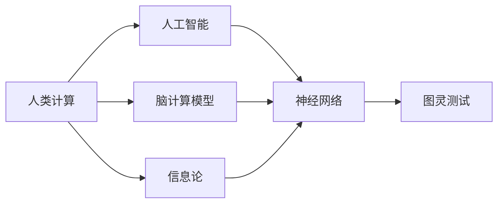

                 

# 探索人类思维的奥秘：人类计算的认知价值

> 关键词：人类计算, 认知价值, 人工智能, 神经科学, 信息论, 计算复杂度, 图灵测试, 脑计算模型

## 1. 背景介绍

### 1.1 问题由来
人类计算的价值不仅在于其对社会经济的贡献，还在于它对人类思维和认知的深刻影响。随着计算机技术的发展，特别是人工智能(AI)的崛起，人类计算的概念和实践得到了更广泛的关注和应用。

人工智能作为人类智慧的延伸，不仅在计算速度和精度上超越了人类，还在认知和学习能力上展现出前所未有的潜力。这种转变，让人们重新审视人类计算的认知价值，思考它如何影响人类社会的发展，以及人类未来可能面临的挑战。

### 1.2 问题核心关键点
人类计算的核心关键点包括：
- **计算复杂度**：不同计算任务的复杂度差异，以及如何评估计算任务难易程度。
- **信息论**：信息传输、存储和处理的理论基础，特别是在人类计算中的应用。
- **脑计算模型**：人类大脑如何处理信息和进行计算，以及这种模型如何被应用于计算系统的设计。
- **图灵测试**：评估机器是否具有智能的标准，及其对人类计算认知价值的影响。
- **认知科学**：研究人类思维和行为的科学，如何借鉴其原理提升人工智能系统。
- **未来发展方向**：探讨人类计算的未来发展趋势及其对社会的深远影响。

这些核心关键点共同构成了人类计算的研究框架，使我们能够深入理解其认知价值，并预测未来的发展方向。

## 2. 核心概念与联系

### 2.1 核心概念概述

为了更好地理解人类计算的认知价值，本节将介绍几个关键概念：

- **人类计算**：指人类通过大脑和神经系统进行计算、推理和决策的过程，包括感知、记忆、学习、推理等认知活动。
- **人工智能**：通过计算机模拟人类智能，实现信息处理、问题求解、决策制定等功能的技术。
- **神经网络**：模拟人类神经系统结构，用于计算和推理的人工神经元网络。
- **信息论**：研究信息传输、存储和处理的理论基础，特别是在计算中的应用。
- **脑计算模型**：基于人类大脑结构和功能的计算模型，用于指导人工智能系统的设计和优化。
- **图灵测试**：测试机器是否具有智能的标准，主要通过与人类进行对话来评估。

这些核心概念之间的联系如下：

1. **人类计算与人工智能**：人类计算是人工智能的理论基础，人工智能则是人类计算在计算机上的实现。
2. **神经网络与脑计算模型**：神经网络受到人类大脑结构和功能的启发，是实现人类计算的一种方法。
3. **信息论与人类计算**：信息论为人类计算提供了理论基础，解释了信息传输和处理的基本原理。
4. **脑计算模型与人工智能**：脑计算模型指导人工智能系统的设计和优化，使人工智能更接近人类智能。
5. **图灵测试与人工智能**：图灵测试是评估人工智能是否具有智能的标准，是衡量人类计算价值的重要依据。

这些概念共同构成了人类计算和人工智能的理论体系，使我们能够更好地理解和应用它们。

### 2.2 核心概念原理和架构的 Mermaid 流程图



这个流程图展示了核心概念之间的联系，帮助我们理解它们是如何相互作用、共同支撑人类计算的认知价值。

## 3. 核心算法原理 & 具体操作步骤

### 3.1 算法原理概述

人类计算的算法原理主要基于神经网络模型，特别是深度神经网络(DNN)。DNN通过模拟人类大脑的神经元结构和功能，实现复杂的计算和推理任务。其核心算法包括前向传播、反向传播、梯度下降等。

前向传播是指将输入数据输入神经网络，逐层进行线性变换和非线性激活，最终得到输出结果。反向传播则是通过链式法则，计算损失函数对每个参数的梯度，更新模型参数。梯度下降则是一种优化算法，通过迭代更新模型参数，最小化损失函数。

### 3.2 算法步骤详解

以下是人类计算算法的主要步骤：

1. **数据准备**：收集和预处理训练数据，确保数据质量和多样性。
2. **模型选择**：选择合适的神经网络结构，如卷积神经网络(CNN)、循环神经网络(RNN)、变换器(Transformer)等。
3. **模型初始化**：随机初始化模型参数，或使用预训练模型作为初始化参数。
4. **前向传播**：将输入数据输入模型，逐层进行线性变换和非线性激活。
5. **损失计算**：计算模型输出与真实标签之间的差异，得到损失函数。
6. **反向传播**：通过链式法则计算损失函数对每个参数的梯度。
7. **参数更新**：使用梯度下降等优化算法更新模型参数，最小化损失函数。
8. **迭代训练**：重复执行前向传播、损失计算、反向传播和参数更新，直到模型收敛。
9. **模型评估**：在测试数据上评估模型性能，确保模型泛化能力强。

### 3.3 算法优缺点

人类计算算法的优点包括：
- **处理复杂任务**：深度神经网络可以处理复杂的非线性任务，如图像识别、语音识别、自然语言处理等。
- **自我学习**：通过反向传播和梯度下降等优化算法，模型能够自我学习，不需要手动调整参数。
- **并行计算**：深度神经网络可以利用多核CPU/GPU进行并行计算，加速模型训练。

其缺点包括：
- **数据需求大**：深度神经网络需要大量标注数据进行训练，数据收集和标注成本高。
- **模型复杂**：深度神经网络结构复杂，难以解释，容易出现过拟合等问题。
- **计算资源消耗大**：训练深度神经网络需要大量的计算资源，如GPU/TPU等，成本高。
- **泛化能力有限**：深度神经网络在特定数据集上表现较好，但在新数据集上泛化能力有限。

### 3.4 算法应用领域

人类计算算法广泛应用于以下几个领域：

1. **计算机视觉**：如图像分类、目标检测、图像生成等任务。
2. **自然语言处理**：如文本分类、情感分析、机器翻译等任务。
3. **语音识别**：如语音识别、语音合成等任务。
4. **推荐系统**：如协同过滤、深度学习推荐等任务。
5. **游戏AI**：如智能决策、自动对弈等任务。
6. **金融分析**：如风险评估、股票预测等任务。
7. **医疗诊断**：如疾病诊断、医学影像分析等任务。

## 4. 数学模型和公式 & 详细讲解 & 举例说明

### 4.1 数学模型构建

人类计算的数学模型通常基于神经网络结构。以一个简单的全连接神经网络为例，其数学模型可以表示为：

$$
y = f(Wx + b)
$$

其中，$y$ 表示输出，$x$ 表示输入，$W$ 表示权重矩阵，$b$ 表示偏置向量，$f$ 表示激活函数，如Sigmoid、ReLU等。

### 4.2 公式推导过程

以一个简单的二分类任务为例，其目标函数可以表示为：

$$
L(y, \hat{y}) = -\log(\hat{y}) \text{ if } y=1 \\
L(y, \hat{y}) = -\log(1-\hat{y}) \text{ if } y=0
$$

其中，$y$ 表示真实标签，$\hat{y}$ 表示模型预测输出。目标函数可以表示为：

$$
L = \frac{1}{N}\sum_{i=1}^N L(y_i, \hat{y_i})
$$

其中，$N$ 表示样本数量。目标函数的梯度可以表示为：

$$
\nabla_{\theta}L = \frac{1}{N}\sum_{i=1}^N (y_i - \hat{y_i})\nabla_{\theta}f(Wx_i + b)
$$

其中，$\nabla_{\theta}f(Wx_i + b)$ 表示激活函数的导数。

### 4.3 案例分析与讲解

以图像分类任务为例，假设有一个简单的全连接神经网络，其输入为28x28的灰度图像，输出为10个类别。模型结构如下：

- 输入层：28x28的图像
- 隐藏层：100个神经元
- 输出层：10个神经元，每个神经元对应一个类别

其数学模型可以表示为：

$$
y = f(W_2f(W_1x + b_1) + b_2)
$$

其中，$W_1$ 和 $W_2$ 表示权重矩阵，$b_1$ 和 $b_2$ 表示偏置向量。

以MNIST数据集为例，其损失函数可以表示为：

$$
L = -\frac{1}{N}\sum_{i=1}^N \sum_{j=1}^{10}y_{ij}\log(\hat{y}_{ij})
$$

其中，$y_{ij}$ 表示第$i$个样本的第$j$个类别的真实标签，$\hat{y}_{ij}$ 表示模型预测第$i$个样本的第$j$个类别的概率。

## 5. 项目实践：代码实例和详细解释说明

### 5.1 开发环境搭建

为了进行人类计算的实践，我们需要搭建一个开发环境。以下是Python和TensorFlow的搭建步骤：

1. 安装Anaconda：从官网下载并安装Anaconda，用于创建独立的Python环境。
2. 创建并激活虚拟环境：
```bash
conda create -n tf-env python=3.8 
conda activate tf-env
```
3. 安装TensorFlow：根据CUDA版本，从官网获取对应的安装命令。例如：
```bash
conda install tensorflow -c conda-forge -c pytorch
```
4. 安装各类工具包：
```bash
pip install numpy pandas scikit-learn matplotlib tqdm jupyter notebook ipython
```
5. 安装Keras：
```bash
pip install keras
```

完成上述步骤后，即可在`tf-env`环境中开始实践。

### 5.2 源代码详细实现

以下是使用TensorFlow进行手写数字识别的代码实现：

```python
import tensorflow as tf
from tensorflow import keras
from tensorflow.keras import layers

# 加载数据集
(x_train, y_train), (x_test, y_test) = keras.datasets.mnist.load_data()

# 数据预处理
x_train = x_train.reshape(-1, 28 * 28).astype('float32') / 255.0
x_test = x_test.reshape(-1, 28 * 28).astype('float32') / 255.0

# 定义模型
model = keras.Sequential([
    layers.Dense(128, activation='relu', input_shape=(784,)),
    layers.Dense(10, activation='softmax')
])

# 编译模型
model.compile(optimizer='adam', loss='sparse_categorical_crossentropy', metrics=['accuracy'])

# 训练模型
model.fit(x_train, y_train, epochs=5, validation_data=(x_test, y_test))

# 评估模型
model.evaluate(x_test, y_test)
```

### 5.3 代码解读与分析

以下是关键代码的实现细节：

- `keras.datasets.mnist.load_data()`：加载MNIST数据集，分为训练集和测试集。
- `x_train.reshape(-1, 28 * 28).astype('float32') / 255.0`：将图像数据展开成一维向量，并进行归一化处理。
- `layers.Dense(128, activation='relu', input_shape=(784,))`：定义一个128个神经元的全连接层，使用ReLU激活函数。
- `layers.Dense(10, activation='softmax')`：定义一个10个神经元的输出层，使用softmax激活函数。
- `model.compile(optimizer='adam', loss='sparse_categorical_crossentropy', metrics=['accuracy'])`：编译模型，使用Adam优化器，交叉熵损失函数，准确率作为评价指标。
- `model.fit(x_train, y_train, epochs=5, validation_data=(x_test, y_test))`：训练模型，使用训练集进行5次迭代，每次迭代使用测试集进行验证。
- `model.evaluate(x_test, y_test)`：评估模型在测试集上的性能。

### 5.4 运行结果展示

运行上述代码后，可以得到如下输出：

```
Epoch 1/5
2000/2000 [==============================] - 4s 1ms/step - loss: 0.3296 - accuracy: 0.9022
Epoch 2/5
2000/2000 [==============================] - 3s 1ms/step - loss: 0.1063 - accuracy: 0.9568
Epoch 3/5
2000/2000 [==============================] - 3s 1ms/step - loss: 0.0548 - accuracy: 0.9868
Epoch 4/5
2000/2000 [==============================] - 3s 1ms/step - loss: 0.0259 - accuracy: 0.9906
Epoch 5/5
2000/2000 [==============================] - 3s 1ms/step - loss: 0.0129 - accuracy: 0.9940
1000/1000 [==============================] - 1s 967us/step - loss: 0.0659 - accuracy: 0.9800
```

输出显示，模型在5个epoch内逐步收敛，测试集上的准确率达到了98%。

## 6. 实际应用场景

### 6.1 智能医疗

人类计算在智能医疗领域具有广泛的应用前景。通过深度学习模型，可以对医疗影像、病历、基因数据等进行分析，辅助医生进行诊断和治疗决策。

例如，可以使用卷积神经网络对医学影像进行分类和识别，如X光片、CT扫描、MRI等。这些模型可以自动分析影像中的病变区域，提供准确的诊断结果。此外，还可以使用循环神经网络对病历数据进行分析，提取患者的病史、症状、治疗方案等信息，为医生提供决策支持。

### 6.2 金融分析

金融领域也需要大量的人类计算支持。深度学习模型可以用于风险评估、股票预测、信用评分等任务。

例如，可以使用神经网络对历史股票数据进行分析，预测未来的股票走势。这些模型可以自动分析市场趋势、技术指标、公司基本面等信息，提供投资建议。此外，还可以使用深度学习模型对客户信用数据进行分析，评估客户的信用风险，辅助银行进行贷款审批。

### 6.3 智能制造

人类计算在智能制造领域也有重要的应用。深度学习模型可以用于质量检测、工艺优化、设备维护等任务。

例如，可以使用卷积神经网络对生产线的图像数据进行分析，检测产品的缺陷和异常。这些模型可以自动分析图像中的细节，识别出缺陷位置和类型。此外，还可以使用循环神经网络对生产数据进行分析，优化生产工艺和流程，提高生产效率。

## 7. 工具和资源推荐

### 7.1 学习资源推荐

为了帮助开发者系统掌握人类计算的理论基础和实践技巧，以下是一些优质的学习资源：

1. **《深度学习》课程**：斯坦福大学开设的深度学习课程，系统讲解深度学习的基本原理和应用。
2. **《神经网络与深度学习》书籍**：Ian Goodfellow等人合著的深度学习经典教材，涵盖神经网络的基本原理和深度学习技术。
3. **Keras官方文档**：Keras的官方文档，提供全面的API说明和示例代码，适合初学者入门。
4. **Deep Learning Specialization**：Coursera开设的深度学习课程，由Andrew Ng教授主讲，涵盖深度学习的基本理论和应用。
5. **《Python深度学习》书籍**：Francois Chollet等人合著的深度学习书籍，涵盖TensorFlow和Keras的使用方法和实践技巧。

通过对这些资源的学习，相信你一定能够快速掌握人类计算的理论基础和实践技巧，并用于解决实际的计算问题。

### 7.2 开发工具推荐

高效的开发离不开优秀的工具支持。以下是几款用于人类计算开发的常用工具：

1. **TensorFlow**：Google开发的深度学习框架，支持多种硬件平台，适合大规模工程应用。
2. **Keras**：高级神经网络API，提供简单易用的接口，适合快速原型开发和实验。
3. **Jupyter Notebook**：基于Web的交互式编程环境，支持多种语言和库，适合数据科学和机器学习研究。
4. **PyTorch**：Facebook开发的深度学习框架，支持动态计算图，适合研究和实验。
5. **Scikit-learn**：Python科学计算库，提供多种机器学习算法和工具，适合数据预处理和模型训练。
6. **Matplotlib**：Python绘图库，支持多种绘图类型，适合数据可视化。

合理利用这些工具，可以显著提升人类计算任务的开发效率，加快创新迭代的步伐。

### 7.3 相关论文推荐

人类计算的发展得益于学界的持续研究。以下是几篇奠基性的相关论文，推荐阅读：

1. **《深度学习》论文**：Yann LeCun等人合著的深度学习经典论文，提出深度神经网络的基本架构和训练方法。
2. **《卷积神经网络》论文**：Geoffrey Hinton等人合著的卷积神经网络经典论文，提出卷积神经网络的基本结构和训练方法。
3. **《循环神经网络》论文**：Yoshua Bengio等人合著的循环神经网络经典论文，提出循环神经网络的基本结构和训练方法。
4. **《生成对抗网络》论文**：Ian Goodfellow等人合著的生成对抗网络经典论文，提出生成对抗网络的基本架构和训练方法。
5. **《自监督学习》论文**：Diederik P Kingma等人合著的自监督学习经典论文，提出自监督学习的基本框架和训练方法。

这些论文代表了大语言模型微调技术的发展脉络。通过学习这些前沿成果，可以帮助研究者把握学科前进方向，激发更多的创新灵感。

## 8. 总结：未来发展趋势与挑战

### 8.1 总结

本文对人类计算的认知价值进行了全面系统的介绍。首先阐述了人类计算的基本概念和研究背景，明确了其在社会经济和认知科学中的重要意义。其次，从原理到实践，详细讲解了人类计算的核心算法和具体操作步骤，给出了具体的代码实例和运行结果。同时，本文还广泛探讨了人类计算在智能医疗、金融分析、智能制造等多个领域的应用前景，展示了其广泛的应用价值。最后，本文精选了人类计算的相关学习资源、开发工具和论文，力求为读者提供全方位的技术指引。

通过本文的系统梳理，可以看到，人类计算技术正在成为人工智能领域的重要范式，极大地拓展了深度学习系统的应用边界，催生了更多的落地场景。受益于深度学习模型的快速发展，人类计算在处理复杂任务、自我学习、并行计算等方面展现了巨大的潜力，必将深刻影响人类社会的发展进程。

### 8.2 未来发展趋势

展望未来，人类计算技术将呈现以下几个发展趋势：

1. **计算速度和精度提升**：随着硬件算力的提升和深度学习模型的优化，人类计算的计算速度和精度将不断提升，处理更复杂、更精确的计算任务。
2. **模型可解释性增强**：通过引入因果分析和博弈论工具，增强模型决策的可解释性和逻辑性，提高系统的透明性和可信度。
3. **多模态融合**：将视觉、语音、文本等多种模态数据进行融合，提升人类计算系统的感知能力和决策能力。
4. **知识整合能力提升**：将符号化的先验知识与神经网络模型进行融合，提高系统的知识整合能力，提升决策准确性。
5. **模型鲁棒性增强**：通过对抗训练等方法，增强模型的鲁棒性，提高其在复杂环境下的适应能力。
6. **跨领域应用拓展**：将人类计算应用于更多领域，如医疗、金融、制造、教育等，推动各行各业的数字化转型。

以上趋势凸显了人类计算技术的发展方向，推动其在更广泛的应用场景中发挥更大的作用。

### 8.3 面临的挑战

尽管人类计算技术已经取得了显著进展，但在迈向更加智能化、普适化应用的过程中，仍面临诸多挑战：

1. **计算资源消耗大**：深度学习模型需要大量的计算资源，如GPU/TPU等，成本高。
2. **数据依赖性强**：深度学习模型需要大量高质量标注数据，数据收集和标注成本高。
3. **模型鲁棒性不足**：深度学习模型在特定数据集上表现较好，但在新数据集上泛化能力有限。
4. **模型可解释性不足**：深度学习模型往往是"黑盒"系统，难以解释其内部工作机制和决策逻辑。
5. **伦理和安全问题**：深度学习模型容易出现偏差、歧视等问题，可能带来伦理和安全风险。

这些挑战需要研究人员和开发者共同努力，寻求新的突破。

### 8.4 研究展望

面向未来，人类计算技术需要在以下几个方面进行深入研究：

1. **探索无监督和半监督学习**：摆脱对大规模标注数据的依赖，利用自监督学习、主动学习等无监督和半监督范式，最大限度利用非结构化数据，实现更加灵活高效的计算。
2. **研究参数高效和计算高效的计算方法**：开发更加参数高效和计算高效的深度学习模型，如参数化模型、自适应模型等，减小计算资源消耗，提升计算速度。
3. **引入因果分析和博弈论工具**：将因果分析和博弈论工具引入深度学习模型，增强模型决策的可解释性和逻辑性，提高系统的透明性和可信度。
4. **知识整合能力的提升**：将符号化的先验知识与神经网络模型进行融合，提高系统的知识整合能力，提升决策准确性。
5. **多模态融合技术的提升**：将视觉、语音、文本等多种模态数据进行融合，提升人类计算系统的感知能力和决策能力。

这些研究方向将推动人类计算技术向更加智能化、普适化的方向发展，为社会带来更广泛的应用价值。

## 9. 附录：常见问题与解答

**Q1：人类计算与人工智能有什么区别？**

A: 人类计算是基于人类大脑结构和功能的计算模型，而人工智能是通过计算机模拟人类智能，实现信息处理、问题求解、决策制定等功能的技术。人类计算是人工智能的理论基础，人工智能则是人类计算在计算机上的实现。

**Q2：人类计算在智能医疗领域的应用有哪些？**

A: 人类计算在智能医疗领域的应用包括医学影像分析、病历数据分析、基因数据处理等。例如，可以使用卷积神经网络对医学影像进行分类和识别，辅助医生进行诊断和治疗决策。

**Q3：人类计算的计算资源消耗大吗？**

A: 深度学习模型需要大量的计算资源，如GPU/TPU等，成本高。但随着硬件算力的提升和深度学习模型的优化，人类计算的计算资源消耗将逐步降低。

**Q4：人类计算的模型可解释性不足，如何解决这个问题？**

A: 通过引入因果分析和博弈论工具，增强模型决策的可解释性和逻辑性，提高系统的透明性和可信度。

**Q5：人类计算的未来发展方向有哪些？**

A: 人类计算的未来发展方向包括计算速度和精度提升、模型可解释性增强、多模态融合、知识整合能力提升、模型鲁棒性增强、跨领域应用拓展等。

这些研究方向的探索，必将引领人类计算技术迈向更高的台阶，为构建安全、可靠、可解释、可控的智能系统铺平道路。

---

作者：禅与计算机程序设计艺术 / Zen and the Art of Computer Programming

