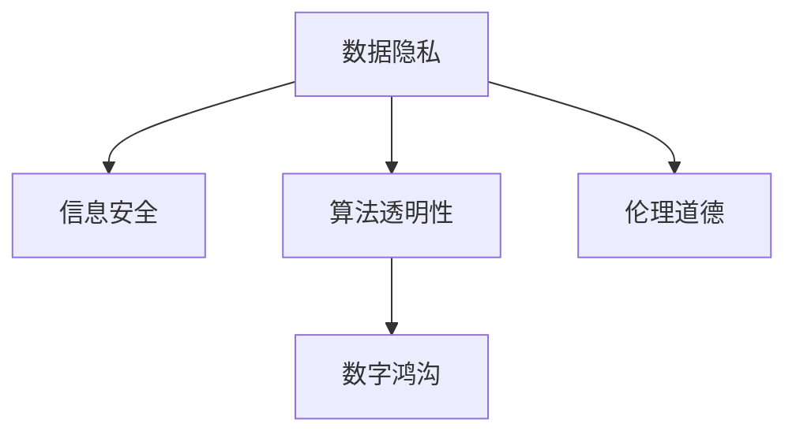

                 

# 政策与监管：引导人类计算的健康发展

## 1. 背景介绍

### 1.1 问题由来
在信息技术日新月异发展的今天，计算技术的强大能力在推动社会进步的同时，也给数据隐私、信息安全、数字鸿沟等社会问题带来了挑战。计算技术在医疗、教育、金融、政府等领域的应用，极大地提高了效率，但同时也引入了新的风险和伦理问题。这些问题不仅需要技术层面的解决，更需要相应的政策与监管框架来引导和规范。

### 1.2 问题核心关键点
当前，计算技术的健康发展离不开良好的政策与监管环境。良好的政策与监管框架能够促进技术的公平、公正、透明应用，同时保障公众利益和隐私安全。以下是政策与监管领域的主要问题点：

- **数据隐私**：计算技术依赖大量的数据进行训练和优化，如何保护这些数据的隐私成为了关键问题。
- **信息安全**：随着计算技术在各个领域的应用，信息安全问题愈发凸显，如何有效防范信息泄露、网络攻击等成为重要议题。
- **算法透明性**：计算模型的复杂性和黑箱特性带来了算法的透明性问题，用户和监管机构需要了解模型决策的依据。
- **数字鸿沟**：计算技术的普及不均衡，加剧了社会经济上的差距。如何缩小数字鸿沟，提升普惠性，是政策与监管的重要目标。
- **伦理道德**：计算技术可能带来伦理道德上的挑战，如偏见、歧视等。如何在政策与监管中融入伦理道德考量，是一个复杂而重要的问题。

## 2. 核心概念与联系

### 2.1 核心概念概述

为更好地理解政策与监管框架的构建，本节将介绍几个密切相关的核心概念：

- **数据隐私**：指保护数据不被未经授权的第三方获取和使用，确保数据主体对其信息的控制权。
- **信息安全**：指保护计算机系统和网络免受威胁和攻击，确保信息的安全性。
- **算法透明性**：指算法工作原理的可解释性和决策依据的透明性，以便用户和监管机构理解。
- **数字鸿沟**：指不同社会经济群体之间在获取、使用和享受信息技术能力方面的差异。
- **伦理道德**：指在计算技术应用中遵循的道德规范和伦理准则，确保技术的应用符合社会公共利益和价值观。

这些概念之间的逻辑关系可以通过以下Mermaid流程图来展示：



这个流程图展示了几项政策与监管核心概念之间的联系：

1. **数据隐私与信息安全**：数据隐私和信息安全共同构成了计算技术应用的基础，保障数据在传输和存储过程中的安全。
2. **算法透明性与伦理道德**：算法透明性和伦理道德保障了计算技术应用的可信度和公正性。
3. **数字鸿沟**：数字鸿沟问题需要在政策与监管中予以特别关注，以促进公平公正的信息技术应用。

这些概念共同构成了政策与监管的框架，旨在通过一系列政策、法律和规范，确保计算技术的健康发展，服务于社会公共利益。

## 3. 核心算法原理 & 具体操作步骤
### 3.1 算法原理概述

政策与监管框架的构建，本质上是对计算技术的应用进行规范和约束。其核心思想是：通过政策与监管手段，确保计算技术的应用符合公共利益，同时保障数据隐私、信息安全等基本原则。

形式化地，假设计算技术的应用为 $T$，其中 $T$ 包括了数据的收集、处理、分析等环节。政策与监管的目标是找到最优的政策与监管方案 $\pi$，使得：

$$
\pi^* = \mathop{\arg\min}_{\pi} \mathcal{L}(T, \pi)
$$

其中 $\mathcal{L}$ 为政策与监管目标函数，用于衡量政策与监管对计算技术应用的影响。常见的目标包括：

- 最小化数据隐私泄露风险。
- 最大程度提升信息安全水平。
- 增强算法的透明性和可解释性。
- 缩小数字鸿沟，提升普惠性。
- 融入伦理道德考量，确保技术应用的公正性和安全性。

### 3.2 算法步骤详解

政策与监管的制定和执行，通常遵循以下步骤：

**Step 1: 需求调研与政策目标设定**
- 识别计算技术应用可能带来的主要风险和问题。
- 明确政策与监管的总体目标和具体目标。
- 制定相关的政策与监管方案，明确责任主体和执行方式。

**Step 2: 政策与监管的制定**
- 制定具体的法规、标准和指南，如数据保护法、网络安全法、算法透明性标准等。
- 通过立法、行政、司法等多种手段，确保政策与监管的有效实施。

**Step 3: 政策与监管的执行与评估**
- 实施政策与监管方案，如建立监管机构、进行监督检查等。
- 定期评估政策与监管的效果，根据反馈进行调整和优化。

**Step 4: 反馈与改进**
- 收集政策与监管实施过程中的反馈信息，包括企业和公众的意见。
- 分析反馈信息，评估政策与监管的实际效果，进行改进和优化。

### 3.3 算法优缺点

政策与监管框架的构建，具有以下优点：
1. 保障公共利益。通过规范计算技术的应用，政策与监管可以确保技术应用符合社会公共利益。
2. 促进公平公正。政策与监管能够缩小数字鸿沟，提升技术应用的普惠性。
3. 提高透明度。政策与监管促进了算法的透明性和可解释性，增加了公众信任。
4. 保障隐私和安全。政策与监管可以有效保护数据隐私和信息安全，降低社会风险。

同时，该框架也存在一些局限性：
1. 政策与监管滞后。政策与法规的制定和执行可能滞后于技术发展的速度，难以及时应对新兴问题。
2. 实施难度较大。政策与监管的实施需要跨部门、跨行业的协调，执行成本较高。
3. 制约创新。过于严格的政策与监管可能限制企业的创新空间，影响技术的发展。

尽管存在这些局限性，但就目前而言，政策与监管框架仍是大规模计算技术应用不可或缺的引导和规范手段。未来相关研究的重点在于如何进一步优化政策与监管，平衡创新与约束，实现技术应用与社会价值的双赢。

### 3.4 算法应用领域

政策与监管框架的构建和执行，已经在多个领域得到了广泛应用，包括：

- 数据隐私保护：如GDPR（通用数据保护条例）、CCPA（加州消费者隐私法）等法规，保护个人信息不被滥用。
- 网络安全：如ISO 27001、NIST SP 800-53等标准，指导组织建立和维护网络安全管理体系。
- 算法透明性：如EU《人工智能法案》、美国《人工智能责任法草案》，要求算法的透明性和可解释性。
- 数字鸿沟缩小：如中国《数字鸿沟消减行动计划》、印度《数字印度计划》，提升数字普惠性。
- 伦理道德：如IEEE《人工智能与自动化系统伦理设计指南》、联合国《人工智能伦理指导原则》，确保技术应用的伦理道德性。

这些政策与监管措施，不仅为计算技术的应用提供了明确的规范和指导，还对相关领域的法律法规体系进行了完善，具有重要的实践意义。

## 4. 数学模型和公式 & 详细讲解 & 举例说明
### 4.1 数学模型构建

本节将使用数学语言对政策与监管框架的构建过程进行更加严格的刻画。

记计算技术的应用为 $T$，其风险函数为 $R(T)$，包含数据隐私泄露风险、信息安全风险等。政策与监管的目标函数为 $\mathcal{L}(T, \pi)$，包括数据隐私泄露风险、信息安全水平、算法透明性、数字鸿沟、伦理道德等因素。则政策与监管的目标为最小化风险函数和优化目标函数的综合值，即：

$$
\pi^* = \mathop{\arg\min}_{\pi} \mathcal{L}(T, \pi) + \lambda R(T)
$$

其中 $\lambda$ 为风险权重，用于平衡不同的政策与监管目标。

### 4.2 公式推导过程

以下我们以数据隐私保护为例，推导最小化数据隐私泄露风险的数学公式。

假设数据隐私泄露风险为 $R(T)$，包含数据泄露的概率 $P_{leak}$ 和泄露数据的敏感度 $S$。则风险函数可表示为：

$$
R(T) = P_{leak} \times S
$$

根据政策与监管的目标函数，我们可以构建如下优化问题：

$$
\pi^* = \mathop{\arg\min}_{\pi} \mathcal{L}(T, \pi) + \lambda P_{leak} \times S
$$

通过优化算法，最小化目标函数和风险函数的综合值，找到最优政策与监管方案 $\pi^*$。

### 4.3 案例分析与讲解

假设某医院使用计算技术分析患者医疗数据，以提高诊断和治疗效果。在数据隐私保护方面，医院面临以下风险：

- 数据泄露风险：由于医疗数据高度敏感，一旦泄露，可能对患者隐私造成严重影响。
- 数据访问控制：需要确保只有授权人员才能访问患者数据，防止未经授权的数据访问。

医院可以采取以下政策与监管措施：

- 数据加密：对医疗数据进行加密存储和传输，防止数据泄露。
- 访问控制：制定严格的访问控制策略，确保只有授权人员才能访问数据。
- 数据匿名化：对敏感数据进行匿名化处理，降低泄露风险。

通过这些政策与监管措施，可以有效地降低数据隐私泄露的风险，保护患者隐私。

## 5. 项目实践：代码实例和详细解释说明
### 5.1 开发环境搭建

在进行政策与监管框架构建和执行的实践前，我们需要准备好开发环境。以下是使用Python进行政策与监管框架构建的开发环境配置流程：

1. 安装Python：从官网下载并安装Python，创建虚拟环境。

2. 安装相关库：
   - 安装政策与法规相关的库，如`policyguard`、`regulator`等。
   - 安装网络安全相关的库，如`pyOpenSSL`、`paramiko`等。
   - 安装算法透明性相关的库，如`model-interpretability`等。
   - 安装数据隐私保护相关的库，如`py Privacy`、`privacytools`等。

3. 配置环境变量：配置环境变量，如路径、库依赖等。

完成上述步骤后，即可在虚拟环境中开始政策与监管框架的构建和执行实践。

### 5.2 源代码详细实现

下面我们以数据隐私保护为例，给出使用Python构建政策与监管框架的代码实现。

首先，定义数据隐私风险评估函数：

```python
from pyPrivacy import PrivacyRisk

def calculate_privacy_risk(data):
    risk = PrivacyRisk(data)
    return risk.risk_score()
```

然后，定义数据加密和访问控制函数：

```python
from pyOpenSSL import crypto

def encrypt_data(data):
    key = crypto.Key.generate(256)
    iv = crypto.Random.random_bytes(16)
    cipher = crypto.AES.new(key, crypto.MODE_CBC, iv)
    encrypted_data = cipher.encrypt(data)
    return encrypted_data, iv

def control_access(data, user):
    if user.is_authenticated():
        return True
    else:
        return False
```

接着，定义数据匿名化函数：

```python
from privacytools import anonymize

def anonymize_data(data):
    anonymized_data = anonymize(data)
    return anonymized_data
```

最后，集成这些函数，构建数据隐私保护框架：

```python
from policyguard import PolicyGuard

def protect_data(data, user):
    encrypted_data, iv = encrypt_data(data)
    if control_access(encrypted_data, user):
        anonymized_data = anonymize_data(encrypted_data)
        return anonymized_data
    else:
        return None
```

以上就是使用Python构建数据隐私保护政策与监管框架的完整代码实现。可以看到，通过封装和集成相关库和函数，可以快速构建复杂的安全保护机制。

### 5.3 代码解读与分析

让我们再详细解读一下关键代码的实现细节：

**calculate_privacy_risk函数**：
- 使用`pyPrivacy`库计算数据隐私风险得分，评估数据泄露的概率和敏感度。

**encrypt_data函数**：
- 使用`pyOpenSSL`库对数据进行AES加密，确保数据在传输和存储过程中的安全。

**control_access函数**：
- 使用`pyOpenSSL`库中的认证机制，判断用户是否具有访问权限，防止未经授权的数据访问。

**anonymize_data函数**：
- 使用`privacytools`库对敏感数据进行匿名化处理，降低数据泄露的风险。

**protect_data函数**：
- 集成数据加密、访问控制和数据匿名化功能，构建数据隐私保护政策与监管框架。

在实际应用中，政策与监管框架的构建还需要考虑更多的细节，如风险评估模型的选择、数据访问控制的细粒度控制、加密算法的选择等。但核心的实现流程与此类似。

## 6. 实际应用场景
### 6.1 数据隐私保护

在信息技术广泛应用的医疗、金融、政府等领域，数据隐私保护是首要考虑的问题。传统的数据保护手段往往依赖于本地存储和本地保护，难以应对跨地区、跨企业的复杂数据流动场景。

基于政策与监管框架，可以构建跨企业和跨地区的协同数据保护机制。例如，医疗保险公司可以通过构建跨地区的隐私保护联盟，在数据分析、共享过程中，采用多方安全计算、差分隐私等技术，保护患者隐私。政府部门可以通过多部门、多层次的协同监管，确保数据在各环节的安全保护。

### 6.2 网络安全

随着信息技术在社会各个领域的深入应用，网络安全问题日益突出。传统的防火墙、入侵检测等措施难以应对复杂的攻击手段和不断演变的威胁。

基于政策与监管框架，可以构建网络安全防护体系。例如，金融机构可以通过建立多层次的安全防护机制，包括硬件防火墙、网络监控、入侵检测、异常流量分析等，全面提升网络安全防护水平。政府部门可以通过构建跨部门的网络安全监管体系，及时发现和应对网络安全威胁，保障公共网络安全。

### 6.3 算法透明性

算法透明性是计算技术应用中的重要议题，尤其是在金融、医疗、司法等高风险领域。算法的黑箱特性，增加了用户和监管机构对决策结果的理解难度。

基于政策与监管框架，可以构建算法透明性保障体系。例如，金融机构可以通过构建算法透明性评估和监管机制，要求算法决策过程的可解释性，确保决策的公正性和透明度。医疗保险公司可以通过构建算法透明性审核机制，确保算法的公平性和有效性。

### 6.4 数字鸿沟缩小

数字鸿沟问题不仅影响信息技术应用的普及，还加剧了社会经济上的差距。传统的信息技术普及方式难以达到普惠性目标。

基于政策与监管框架，可以构建数字普惠政策与监管体系。例如，政府可以通过构建数字鸿沟消减行动计划，提升农村和欠发达地区的数字化基础设施建设，缩小数字鸿沟。企业可以通过构建数字普惠产品和服务，提升普惠性应用水平。

### 6.5 伦理道德

伦理道德问题在计算技术应用中愈发凸显，如算法偏见、数据歧视等。如何确保技术的公正性和安全性，是政策与监管的重要课题。

基于政策与监管框架，可以构建伦理道德保障体系。例如，金融机构可以通过构建伦理道德评估和监管机制，确保算法的公平性和公正性。医疗保险公司可以通过构建伦理道德审核机制，确保数据使用的公正性和安全性。

## 7. 工具和资源推荐
### 7.1 学习资源推荐

为了帮助开发者系统掌握政策与监管的理论基础和实践技巧，这里推荐一些优质的学习资源：

1. 《信息安全与隐私保护》系列博文：由信息安全专家撰写，深入浅出地介绍了信息安全、数据隐私保护等前沿话题。

2. 《政策与法规基础》课程：北京大学开设的公共管理课程，系统讲解政策与法规的基本概念和应用。

3. 《算法透明性评估与监管》书籍：算法透明性评估与监管领域的前沿著作，详细介绍了算法透明性的评估方法和监管框架。

4. 政府部门相关网站：如美国联邦贸易委员会（FTC）、欧盟委员会（EC）等，提供最新的政策与法规信息。

5. 开源项目：如`privacytools`、`model-interpretability`等，提供实际应用中的政策与监管框架实现案例。

通过对这些资源的学习实践，相信你一定能够快速掌握政策与监管的精髓，并用于解决实际的计算技术应用问题。

### 7.2 开发工具推荐

高效的开发离不开优秀的工具支持。以下是几款用于政策与监管框架开发的常用工具：

1. Python：作为计算技术开发的主流语言，Python提供了丰富的库和框架，适合进行复杂的政策与监管框架构建。

2. Visual Studio Code：一款强大的代码编辑器，支持多种语言和框架，具有丰富的插件和扩展功能，适合开发和调试政策与监管框架。

3. Docker：一个轻量级容器化平台，可以快速构建和部署政策与监管框架，方便多环境下的测试和部署。

4. GitLab：一个开源代码托管平台，支持团队协作、版本控制、持续集成等功能，适合多人协作开发政策与监管框架。

5. GitHub：一个全球最大的代码托管平台，提供丰富的开源项目和社区支持，适合学习和借鉴政策与监管框架的实现。

合理利用这些工具，可以显著提升政策与监管框架的开发效率，加快创新迭代的步伐。

### 7.3 相关论文推荐

政策与监管领域的研究源于学界的持续研究。以下是几篇奠基性的相关论文，推荐阅读：

1. "Data Privacy by Design: Privacy as an Architectural Principle"（《数据保护设计：隐私作为架构原则》）：Pietra等提出的数据保护设计原则，强调隐私保护的架构设计。

2. "Practical Privacy-Preserving Data Analysis"（《实用的隐私保护数据分析》）：Zhang等提出的基于差分隐私和同态加密的隐私保护数据分析方法。

3. "Algorithmic Fairness: Ensuring Non-Discrimination in Data Models"（《算法公平性：确保数据模型中的非歧视》）：Chouldechova等提出的算法公平性评估方法，确保算法决策的公正性。

4. "Public AI Ethics Frameworks: State of the Art and Research Gaps"（《公共AI伦理框架：现状和研究缺口》）：Biesanz等提出的公共AI伦理框架，为AI伦理治理提供指导。

这些论文代表了大规模计算技术政策与监管的发展脉络。通过学习这些前沿成果，可以帮助研究者把握学科前进方向，激发更多的创新灵感。

## 8. 总结：未来发展趋势与挑战
### 8.1 总结

本文对政策与监管框架的构建和执行进行了全面系统的介绍。首先阐述了政策与监管框架的构建背景和意义，明确了政策与监管在保障计算技术应用中的重要性。其次，从原理到实践，详细讲解了政策与监管的数学原理和关键步骤，给出了政策与监管框架构建和执行的完整代码实例。同时，本文还广泛探讨了政策与监管在数据隐私保护、网络安全、算法透明性、数字鸿沟缩小、伦理道德等方面的应用前景，展示了政策与监管范式的广阔潜力。

通过本文的系统梳理，可以看到，政策与监管框架的构建和执行在大规模计算技术应用中起到了至关重要的作用。它不仅保障了计算技术的健康发展，还为社会公共利益提供了有力保障。未来，伴随计算技术的持续演进，政策与监管框架也需要不断优化和升级，以应对新的挑战和问题。

### 8.2 未来发展趋势

展望未来，政策与监管框架将呈现以下几个发展趋势：

1. 法律与技术的深度融合。政策与监管框架的构建将更加依赖于法律技术的进步，如区块链技术、智能合约等，提升政策的执行效率和透明性。

2. 国际协同与标准化。面对全球化的计算技术应用，国际协同与标准化将变得更加重要。国际政策与监管框架的制定和实施，将推动全球技术标准的统一。

3. 人工智能伦理的深入研究。随着AI技术的广泛应用，人工智能伦理将成为政策与监管框架的重要组成部分，确保AI技术的公正性和安全性。

4. 算法透明性与解释性。政策与监管框架将更加重视算法的透明性与解释性，通过法规和标准，要求算法决策过程的可解释性，提升公众信任。

5. 多领域协同监管。政策与监管框架将更多地关注跨领域、跨行业的协同监管，确保计算技术应用的公平性和公正性。

以上趋势凸显了政策与监管框架的广阔前景。这些方向的探索发展，必将进一步推动计算技术的健康发展，为社会公共利益提供更坚实的保障。

### 8.3 面临的挑战

尽管政策与监管框架已经取得了显著成果，但在迈向更加智能化、普惠化应用的过程中，它仍面临着诸多挑战：

1. 法规的适应性。法规的制定往往滞后于技术的快速发展，难以及时应对新兴问题。如何在法规的制定和执行过程中保持灵活性，是一个重要挑战。

2. 执行的复杂性。政策与监管的实施需要跨部门、跨行业的协调，执行成本较高。如何简化执行流程，提升执行效率，是一个重要任务。

3. 技术的复杂性。政策与监管框架的构建涉及多学科知识，如法律、计算机、经济学等。如何整合不同领域的知识，形成统一的框架，是一个复杂的问题。

4. 国际协同的困难。不同国家和地区在政策与监管框架上的差异，可能影响国际协同和标准化进程。如何推动国际协同，是一个重要挑战。

5. 伦理道德的复杂性。计算技术应用中的伦理道德问题复杂多样，如何制定合理的伦理道德规范，是一个重要问题。

6. 公众的认知难度。政策与监管的实施需要公众的配合和支持，但公众对政策与监管的理解和接受度可能存在差异。如何增强公众认知，是一个重要任务。

正视政策与监管面临的这些挑战，积极应对并寻求突破，将是大规模计算技术应用健康发展的重要保障。相信随着学界和产业界的共同努力，这些挑战终将一一被克服，政策与监管框架必将在构建健康发展的计算技术中扮演越来越重要的角色。

### 8.4 研究展望

面对政策与监管面临的挑战，未来的研究需要在以下几个方面寻求新的突破：

1. 加强国际协同与标准化研究。推动国际政策与监管框架的协同与标准化，确保计算技术应用的全球一致性和互操作性。

2. 深化人工智能伦理研究。深入研究AI伦理问题，制定合理的伦理道德规范，确保AI技术的公正性和安全性。

3. 构建算法透明性评估体系。构建算法透明性评估和监管机制，确保算法决策过程的可解释性，提升公众信任。

4. 推动法规技术的融合。推动法律技术与计算技术的融合，提升法规的适应性和执行效率。

5. 探索多领域协同监管模式。构建跨领域、跨行业的协同监管体系，确保计算技术应用的公平性和公正性。

6. 增强公众认知与参与。增强公众对政策与监管的理解和接受度，推动公众参与政策与监管的制定和执行。

这些研究方向的探索，必将引领政策与监管框架的不断优化和升级，为计算技术健康发展提供坚实的保障。面向未来，政策与监管框架需要与计算技术的应用协同发展，共同推动社会公共利益的实现。

## 9. 附录：常见问题与解答
----------------------------------------------------------------
**Q1: 政策与监管框架的构建是否会影响计算技术的发展？**

A: 政策与监管框架的构建，旨在确保计算技术的健康发展，保护公共利益。在政策与法规的规范下，计算技术的应用更加公平、公正、透明，有助于提升技术应用的广泛性和社会认可度。因此，政策与监管框架的构建不仅不会阻碍计算技术的发展，反而会推动技术应用的健康发展。

**Q2: 如何平衡政策与监管与技术创新之间的关系？**

A: 政策与监管与技术创新的平衡，是一个复杂但重要的问题。可以通过以下方式实现：
- 法规与技术的融合：在政策与法规中融入最新的技术发展，确保法规的适应性和先进性。
- 法规的灵活性：制定灵活的政策与法规，适应技术快速发展的现实，保持法规的灵活性和适应性。
- 公众参与：通过公众参与政策与法规的制定和执行，增强法规的公平性和可接受度。
- 持续评估和改进：定期评估政策与法规的效果，根据反馈进行调整和改进，保持政策的灵活性和适应性。

**Q3: 政策与监管框架在跨行业应用中的难点是什么？**

A: 政策与监管框架在跨行业应用中的难点主要体现在：
- 行业差异：不同行业的业务特点和风险管理需求不同，政策与法规需要针对不同行业进行定制化设计。
- 利益协调：跨行业应用需要协调不同行业、不同利益方的利益诉求，达成一致的监管目标。
- 标准统一：不同行业在政策与法规上的标准差异，可能导致跨行业应用的复杂性。

**Q4: 政策与监管框架的构建和执行需要哪些关键要素？**

A: 政策与监管框架的构建和执行需要以下关键要素：
- 法规和标准：制定明确的法规和标准，规范计算技术的应用。
- 监管机构：建立独立的监管机构，负责政策与法规的制定、执行和监督。
- 数据保护：采取严格的数据保护措施，确保数据的隐私和安全。
- 技术支持：提供技术支持，确保政策与法规的有效实施。
- 公众参与：增强公众对政策与法规的理解和接受度，推动公众参与政策与法规的制定和执行。

**Q5: 如何应对计算技术应用中的伦理道德问题？**

A: 应对计算技术应用中的伦理道德问题，可以从以下方面进行：
- 制定伦理道德规范：制定合理的伦理道德规范，确保技术应用的公正性和安全性。
- 伦理审查机制：建立伦理审查机制，对技术应用进行伦理审查和评估。
- 透明性与可解释性：确保算法的透明性和可解释性，增强公众对技术应用的信任。
- 公众教育：增强公众对伦理道德问题的认识，提升公众对技术应用的监督和参与能力。

这些关键要素和问题点，为政策与监管框架的构建和执行提供了基本思路和参考方向。在实际应用中，需要根据具体行业和应用场景，灵活调整和优化政策与监管措施。

