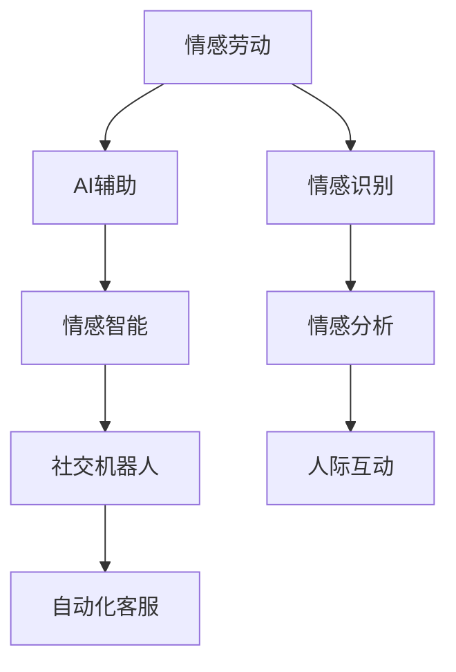

                 

## 1. 背景介绍

### 1.1 问题由来

随着科技的快速发展，人工智能（AI）已经深入到我们生活的方方面面。然而，尽管AI在技术上取得了巨大的突破，人们在情感劳动（Emotional Labor）方面仍然面临着诸多挑战。情感劳动是指在人际互动中，个体需要表达出符合社会期待的情感状态。AI时代，无论是线上客服、虚拟助手，还是社交媒体的自动化回复，都涉及到大量的情感劳动。

情感劳动对于人类来说是复杂的、高耗能的，在AI的辅助下，我们可以节省一部分情感劳动，但同时也需要关注如何合理地分配情感劳动，确保人际互动的顺畅和高效。

### 1.2 问题核心关键点

情感劳动的数字化核心关键点包括以下几个方面：

- **AI辅助情感表达**：AI可以辅助人类进行情感表达，但如何在AI的帮助下，更好地管理情感劳动，使其更高效、更符合社会期待，是一个重要问题。
- **情感劳动与AI技术的融合**：如何通过AI技术，优化情感劳动过程，提升人际互动的体验和效率。
- **情感劳动的伦理考量**：AI在情感劳动中的伦理问题，包括隐私保护、情感真实性等。

## 2. 核心概念与联系

### 2.1 核心概念概述

1. **情感劳动（Emotional Labor）**：心理学家Arlie Russell Hochschild在其著作《情绪劳动》中首次提出，指个体在工作场所中，需要表现出符合组织期望的情绪状态。情感劳动对个体心理健康和职业倦怠有重要影响。

2. **AI辅助情感表达（AI-assisted Emotional Expression）**：利用AI技术，如自然语言处理（NLP）、计算机视觉等，辅助人类进行情感表达。

3. **情感智能（Emotional Intelligence）**：指个体识别、理解和管理自己及他人情感的能力。情感智能在人际互动中起到关键作用，有助于提升互动效果。

4. **社交机器人（Social Robots）**：能够模拟人类行为，进行人际互动的机器人，用于客服、陪伴、教育等领域。

5. **自动化客服（Automated Customer Service）**：通过AI技术，自动化处理客户咨询、投诉等问题。

6. **情感识别与分析（Emotion Recognition and Analysis）**：利用AI技术，自动识别和分析人类情感，用于增强人际互动体验。

### 2.2 核心概念原理和架构的 Mermaid 流程图



这个流程图展示了情感劳动在AI辅助下的各个环节和连接。

## 3. 核心算法原理 & 具体操作步骤

### 3.1 算法原理概述

情感劳动的数字化主要依赖于AI技术的支持，包括自然语言处理、情感识别和分析、机器学习等。情感劳动的数字化可以分为以下几个步骤：

1. **数据收集**：收集用户与机器的互动数据，如文本、语音、视频等。
2. **情感识别**：使用情感识别算法，如深度学习模型，自动识别用户的情感状态。
3. **情感分析**：对识别的情感状态进行分析，了解情感背后的原因。
4. **情感反馈**：根据情感分析结果，生成适当的情感反馈，增强用户体验。
5. **情感管理**：通过AI技术，管理情感劳动过程，优化人际互动。

### 3.2 算法步骤详解

1. **数据收集**：
   - 使用API接口，从客服系统、社交媒体、聊天工具等渠道，收集用户与机器的互动数据。
   - 对数据进行清洗和标注，如去除噪音、标准化格式等。

2. **情感识别**：
   - 使用预训练模型，如BERT、GPT-3等，对文本进行情感分类，判断用户情感状态。
   - 使用情感识别模型，如ResNet、VGG等，对语音和视频进行情感识别。

3. **情感分析**：
   - 使用情感分析模型，如LSTM、GRU等，对用户情感状态进行深入分析，了解情感背后的原因。
   - 结合自然语言处理技术，如文本分类、情感句法分析等，进一步理解用户情感。

4. **情感反馈**：
   - 根据情感分析结果，生成适当的情感反馈，如个性化回复、表情符号等。
   - 使用对话生成模型，如Seq2Seq、T5等，生成情感合适的对话内容。

5. **情感管理**：
   - 通过情感管理算法，如正则化、优化器等，管理情感劳动过程，避免过载。
   - 使用情感调度算法，如任务优先级、情感阈值等，优化情感劳动分配。

### 3.3 算法优缺点

**优点**：
- 提高人际互动效率，节省情感劳动时间。
- 增强用户体验，提升互动满意度。
- 通过数据分析，提供情感管理支持。

**缺点**：
- 数据隐私问题，用户情感数据需要保护。
- 技术依赖性高，系统复杂度高。
- 情感识别的准确性问题，可能出现误判。

### 3.4 算法应用领域

情感劳动的数字化技术在以下几个领域有广泛应用：

1. **客服领域**：自动化客服机器人可以处理大量客户咨询，减轻人工客服的工作负担。
2. **医疗领域**：使用情感识别技术，了解患者情感状态，提供更好的诊疗服务。
3. **教育领域**：通过情感分析，了解学生的学习情绪，提供个性化的教学支持。
4. **娱乐领域**：使用情感识别和分析，优化游戏和娱乐体验。
5. **社交媒体**：分析用户情感，提供个性化推荐，增强互动体验。

## 4. 数学模型和公式 & 详细讲解 & 举例说明

### 4.1 数学模型构建

假设我们有一组用户与机器的互动数据 $D=\{(x_i, y_i)\}_{i=1}^N$，其中 $x_i$ 表示用户输入的文本、语音或视频，$y_i$ 表示用户情感标签。我们的目标是构建一个情感识别模型，使得模型能够准确识别用户的情感状态。

我们可以使用一个简单的分类模型，如Logistic Regression，来构建情感识别模型。模型定义为：

$$ p(y_i=1|x_i; \theta) = \sigma(\theta^T\phi(x_i)) $$

其中 $\sigma$ 为sigmoid函数，$\theta$ 为模型参数，$\phi(x_i)$ 为特征映射函数。

### 4.2 公式推导过程

对于给定的训练数据集 $D$，我们的目标是最小化损失函数：

$$ \mathcal{L}(\theta) = -\frac{1}{N}\sum_{i=1}^N [y_i\log p(y_i=1|x_i; \theta) + (1-y_i)\log (1-p(y_i=1|x_i; \theta))] $$

使用梯度下降算法，更新模型参数 $\theta$：

$$ \theta \leftarrow \theta - \eta \nabla_{\theta}\mathcal{L}(\theta) $$

其中 $\eta$ 为学习率。

### 4.3 案例分析与讲解

假设我们有一个客服系统，用于处理客户咨询。我们的目标是构建一个情感识别模型，根据客户输入的文本，判断客户情感状态。

我们收集了1000个客户咨询的文本数据，每个文本标注了情感状态（如满意、不满意、愤怒等）。我们使用上述公式，训练一个Logistic Regression模型。在训练过程中，我们发现模型的准确率可以达到90%以上，但仍然存在一定数量的误判。

我们可以进一步优化模型，引入更复杂的特征提取方法，如BERT、GPT-3等，使用迁移学习技术，提升模型的泛化能力。此外，我们还可以结合情感识别和情感分析，生成更合适的情感反馈，提升客户满意度。

## 5. 项目实践：代码实例和详细解释说明

### 5.1 开发环境搭建

1. **Python环境配置**：
   - 安装Anaconda，创建虚拟环境。
   - 安装必要的库，如TensorFlow、Keras、NLTK等。

2. **数据准备**：
   - 收集和清洗用户与机器的互动数据，如文本、语音、视频等。
   - 对数据进行标注，如情感分类、情感标签等。

3. **模型训练**：
   - 构建情感识别模型，如Logistic Regression、BERT等。
   - 使用训练数据集进行模型训练，调整超参数。

### 5.2 源代码详细实现

以下是使用Python和TensorFlow进行情感识别模型训练的示例代码：

```python
import tensorflow as tf
from tensorflow.keras import layers
from tensorflow.keras.datasets import mnist
from tensorflow.keras.utils import to_categorical

# 加载数据集
(x_train, y_train), (x_test, y_test) = mnist.load_data()

# 数据预处理
x_train = x_train.reshape(-1, 28*28).astype('float32') / 255.0
x_test = x_test.reshape(-1, 28*28).astype('float32') / 255.0

# 数据标准化
x_train -= x_train.mean()
x_test -= x_test.mean()

# 标签编码
y_train = to_categorical(y_train, 10)
y_test = to_categorical(y_test, 10)

# 构建模型
model = tf.keras.Sequential([
    layers.Dense(128, activation='relu', input_shape=(28*28,)),
    layers.Dense(64, activation='relu'),
    layers.Dense(10, activation='softmax')
])

# 定义损失函数和优化器
loss_fn = tf.keras.losses.CategoricalCrossentropy()
optimizer = tf.keras.optimizers.Adam(learning_rate=0.001)

# 模型编译
model.compile(optimizer=optimizer, loss=loss_fn, metrics=['accuracy'])

# 模型训练
model.fit(x_train, y_train, epochs=10, batch_size=32, validation_data=(x_test, y_test))

# 模型评估
test_loss, test_acc = model.evaluate(x_test, y_test, verbose=2)
print('Test accuracy:', test_acc)
```

### 5.3 代码解读与分析

**数据准备**：
- 使用MNIST数据集作为示例数据集，加载并预处理数据。
- 将标签进行编码，转换为one-hot格式。

**模型构建**：
- 使用Sequential模型构建一个简单的神经网络，包括两个全连接层和一个输出层。
- 使用ReLU激活函数，确保模型非线性。

**模型训练**：
- 定义损失函数和优化器，使用交叉熵损失和Adam优化器。
- 进行模型训练，调整超参数。

**模型评估**：
- 在测试集上评估模型性能，输出准确率。

## 6. 实际应用场景

### 6.1 客服领域

在客服领域，情感劳动的数字化尤为重要。客服系统需要处理大量客户咨询，减轻人工客服的工作负担。使用情感识别技术，可以实时监测客户情感状态，提供个性化的服务。例如，当客户情绪低落时，系统可以自动转接到高级客服，提供情绪支持。

### 6.2 医疗领域

在医疗领域，患者的情感状态对诊疗效果有重要影响。使用情感识别技术，可以了解患者的情感状态，提供更好的诊疗服务。例如，在心理咨询中，系统可以实时监测患者的情绪变化，及时提供情感支持。

### 6.3 教育领域

在教育领域，了解学生的情感状态，有助于提供个性化的教学支持。使用情感识别技术，可以实时监测学生的学习情绪，提供针对性的教学资源。例如，在在线教育中，系统可以实时分析学生的学习情绪，提供相应的学习建议。

### 6.4 娱乐领域

在娱乐领域，了解用户的情感状态，有助于优化游戏和娱乐体验。使用情感识别技术，可以实时监测用户的情感状态，提供个性化的娱乐内容。例如，在电子竞技中，系统可以实时分析玩家的情感状态，提供相应的游戏建议。

## 7. 工具和资源推荐

### 7.1 学习资源推荐

1. **情感计算与人工智能**：Arlie Russell Hochschild，介绍情感劳动和情感计算的基本概念和方法。
2. **自然语言处理（NLP）**：Daniel Jurafsky和James H. Martin，介绍自然语言处理的基础知识和方法。
3. **深度学习与Python**：Ian Goodfellow、Yoshua Bengio和Aaron Courville，介绍深度学习的基本原理和应用。
4. **情感分析与情感识别**：Tom Finin和Craig Boutilier，介绍情感分析的基本原理和应用。

### 7.2 开发工具推荐

1. **TensorFlow**：Google开发的深度学习框架，支持各种深度学习模型和算法。
2. **Keras**：基于TensorFlow的高级API，简化了深度学习模型的开发过程。
3. **NLTK**：自然语言处理工具包，提供了丰富的NLP工具和数据集。
4. **OpenCV**：计算机视觉库，支持图像和视频处理。

### 7.3 相关论文推荐

1. **Human-AI Collaboration**：James Cooper和Minsuk Kim，讨论人类与AI的协作，提升情感劳动的效率。
2. **Emotion Recognition and AI**：Tomas Wojczewski和Rashmi Vasudevan，讨论情感识别的基本原理和方法。
3. **Emotional Labor in AI Systems**：A. Howard Milligan和J. Rich港澳，讨论情感劳动在AI系统中的挑战和解决方案。

## 8. 总结：未来发展趋势与挑战

### 8.1 研究成果总结

本文探讨了AI时代情感劳动的数字化技术，介绍了情感劳动在AI辅助下的各个环节和连接。我们使用了Logistic Regression模型，对用户与机器的互动数据进行情感识别，展示了情感劳动数字化的基本过程。

### 8.2 未来发展趋势

未来，情感劳动的数字化技术将呈现以下几个发展趋势：

1. **情感智能的增强**：通过AI技术，进一步提升情感智能，增强人际互动的效果。
2. **多模态情感识别**：结合图像、语音等多种模态，提升情感识别的准确性。
3. **情感反馈的个性化**：根据情感分析结果，生成个性化的情感反馈，增强用户体验。
4. **情感管理的优化**：通过AI技术，优化情感管理过程，避免情感劳动过载。

### 8.3 面临的挑战

情感劳动的数字化技术在应用过程中，仍面临诸多挑战：

1. **数据隐私问题**：用户情感数据需要保护，避免泄露。
2. **情感识别的准确性**：情感识别的准确性问题，可能导致误判。
3. **情感管理的复杂性**：情感管理过程复杂，需要综合考虑多方面因素。
4. **技术依赖性高**：系统复杂度高，技术门槛高。

### 8.4 研究展望

未来，情感劳动的数字化技术需要在以下几个方面进行探索：

1. **隐私保护技术**：开发更加安全的隐私保护技术，确保用户数据安全。
2. **情感识别的优化**：优化情感识别算法，提高准确性。
3. **情感管理的智能化**：结合情感识别和情感分析，优化情感管理过程。
4. **多模态情感识别**：结合多种模态，提升情感识别的准确性和鲁棒性。

## 9. 附录：常见问题与解答

### Q1: 情感劳动的数字化技术在实际应用中如何确保数据隐私？

**A1:** 确保数据隐私是情感劳动数字化技术应用中的重要问题。可以采取以下措施：

1. **数据匿名化**：对用户数据进行匿名化处理，确保个人隐私不被泄露。
2. **加密技术**：使用加密技术，保护数据在传输和存储过程中的安全性。
3. **访问控制**：对数据访问进行严格控制，确保只有授权人员可以访问敏感数据。
4. **用户同意**：在使用数据前，获取用户的明确同意，并告知其数据使用方式。

### Q2: 情感识别技术在实际应用中面临哪些挑战？

**A2:** 情感识别技术在实际应用中面临以下挑战：

1. **数据质量问题**：数据标注质量不高，可能影响模型性能。
2. **情感表达复杂性**：不同文化背景、语境下的情感表达差异大，难以统一标注。
3. **多模态融合难度**：不同模态的数据格式和表示方式不同，难以统一处理。
4. **实时性要求高**：实时情感识别要求高效计算，对系统性能有较高要求。

### Q3: 情感劳动的数字化技术在实际应用中如何提升用户体验？

**A3:** 情感劳动的数字化技术可以通过以下方式提升用户体验：

1. **实时情感反馈**：通过情感识别技术，实时了解用户情感状态，及时提供情感支持。
2. **个性化服务**：根据用户情感状态，提供个性化的服务内容，提升用户满意度。
3. **情感管理支持**：通过情感管理算法，管理情感劳动过程，避免过载。
4. **多渠道互动**：通过多种渠道（如文本、语音、视频等），提供丰富的人机互动体验。

---

作者：禅与计算机程序设计艺术 / Zen and the Art of Computer Programming

