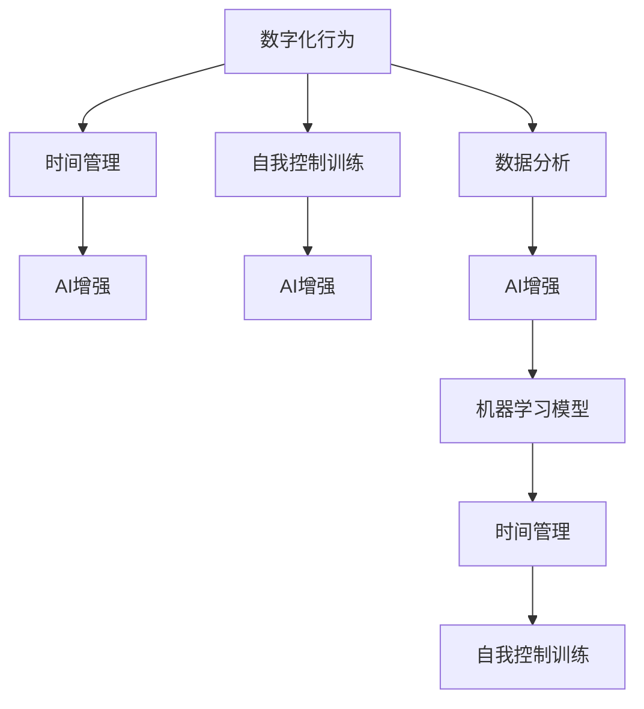

                 

## 1. 背景介绍

### 1.1 问题由来

数字化时代，信息爆炸，人们的注意力被各种应用、媒体和社交网络所分散。人们越来越难以维持长期、专注的注意力，时间管理能力日益下降，工作效率低下。这不仅影响个人的生活质量和工作表现，也限制了企业的创新能力和市场竞争力。如何提升个人的数字化意志力，培养高效、自律的行为习惯，成为时代亟需解决的课题。

### 1.2 问题核心关键点

本项目旨在借助AI技术，对个体的数字化行为进行分析和预测，从而提供个性化的自我控制训练方案。项目的关键点包括：

1. **数据采集**：通过智能设备、应用记录用户的数字化行为。
2. **数据分析**：使用机器学习模型对用户行为进行模式分析和预测。
3. **个性化训练**：根据用户行为特征，生成个性化的自我控制训练方案。
4. **效果评估**：跟踪训练效果，持续优化训练方案。

### 1.3 问题研究意义

研究数字化意志力锻炼的AI增强方法，对于提升个人和组织的数字化适应能力、提高工作效率和生活质量，具有重要意义：

1. **提升个人生产力**：帮助个体培养自律、专注的习惯，避免浪费时间，提高工作效率。
2. **改善心理健康**：通过自我控制训练，减轻焦虑、压力等负面情绪，提升心理幸福感。
3. **提升组织竞争力**：通过培养员工的高效行为，提升团队协作和创新能力。
4. **推动数字化转型**：在数字化时代，提升企业及其员工的数字化适应能力，是实现数字化转型的重要保障。

## 2. 核心概念与联系

### 2.1 核心概念概述

为了更好地理解AI增强的自我控制训练方法，本节将介绍几个密切相关的核心概念：

- **数字化行为**：指个体在数字设备、应用和网络上的行为数据，如浏览时间、应用使用频率、社交媒体互动等。
- **时间管理**：指合理安排时间，提升工作和生活效率的过程，包括任务规划、时间分配、时间追踪等。
- **自我控制训练**：指通过特定方法训练个体的自我控制能力，提升其自律、专注等行为表现。
- **AI增强**：指利用人工智能技术，如机器学习、数据分析、预测等，提升自我控制训练的精度和效率。

这些核心概念之间的逻辑关系可以通过以下Mermaid流程图来展示：



这个流程图展示了几组核心概念及其之间的关系：

1. 数字化行为通过数据分析得到行为特征，并由AI增强方法进行模型训练和优化。
2. AI增强方法对自我控制训练提供个性化方案，提升训练效果。
3. 时间管理与自我控制训练互相促进，共同提升个人效率。

## 3. 核心算法原理 & 具体操作步骤

### 3.1 算法原理概述

本项目的核心算法基于强化学习原理，通过构建个体的数字化行为与自我控制表现之间的映射关系，生成个性化的自我控制训练方案。具体流程如下：

1. **数据采集**：通过智能设备、应用记录用户数字化行为，如应用程序使用时间、浏览网页、社交媒体互动等。
2. **数据分析**：使用机器学习模型对用户行为进行模式分析，提取行为特征，如注意力集中度、时间使用比例、任务完成情况等。
3. **行为预测**：构建行为与自我控制表现之间的预测模型，预测用户未来的行为趋势。
4. **个性化训练**：根据预测结果，生成个性化的自我控制训练方案，包括时间规划、任务优先级、注意力集中训练等。
5. **效果评估**：跟踪训练效果，持续优化训练方案，提升用户自我控制能力。

### 3.2 算法步骤详解

#### 3.2.1 数据采集

1. **设备配置**：
   - 安装智能设备，如智能手表、平板电脑等，确保设备能够实时记录用户的行为数据。
   - 配置相关应用，如应用时间监控、习惯追踪等，获取用户的应用使用情况。
   - 确保用户同意数据采集和使用的隐私协议，保护用户数据安全。

2. **数据收集**：
   - 使用API接口定期从设备获取用户的行为数据，如应用使用时间、浏览时间、互动频率等。
   - 记录数据时间戳，确保数据的连续性和准确性。
   - 将数据存储在云平台，如AWS、Google Cloud等，方便后续分析和处理。

#### 3.2.2 数据分析

1. **数据清洗**：
   - 去除无效数据、异常数据，如数据采集错误、设备故障等。
   - 处理缺失值、重复值，确保数据完整性。
   - 对数据进行格式转换，如时间戳统一、数据归一化等。

2. **特征提取**：
   - 提取用户行为特征，如每天的应用使用时间、浏览网站的时间分布、社交媒体互动频率等。
   - 使用特征工程方法，如主成分分析(PCA)、因子分析等，提取行为特征中的关键信息。
   - 构建行为特征向量，作为输入特征用于后续模型训练。

#### 3.2.3 行为预测

1. **模型选择**：
   - 根据用户行为数据的特点，选择合适的机器学习模型，如线性回归、决策树、随机森林等。
   - 对于时间序列数据，可以使用LSTM、GRU等序列模型。
   - 对于分类数据，可以使用SVM、XGBoost等分类模型。

2. **模型训练**：
   - 将用户行为数据分成训练集和测试集，使用训练集训练模型。
   - 使用交叉验证方法，优化模型参数，提升模型性能。
   - 对模型进行评估，如准确率、召回率、F1值等，确保模型效果。

3. **结果分析**：
   - 对预测结果进行分析，理解用户行为模式，识别出潜在的时间浪费和注意力分散问题。
   - 生成行为预测报告，反馈给用户，帮助其进行自我调整。

#### 3.2.4 个性化训练

1. **训练方案生成**：
   - 根据行为预测结果，生成个性化的自我控制训练方案。
   - 方案包括时间管理、任务优先级、注意力集中训练等。
   - 方案应考虑用户的行为特征和个性化需求，确保可执行性和实际效果。

2. **方案执行**：
   - 将训练方案推送给用户，通过应用、邮件、短信等方式通知用户。
   - 使用智能提醒功能，帮助用户按照方案执行。
   - 提供用户反馈机制，收集用户反馈，优化训练方案。

#### 3.2.5 效果评估

1. **效果监控**：
   - 定期收集用户反馈，监控训练效果。
   - 使用数据分析工具，如Tableau、Power BI等，生成可视化报表，展示训练效果。

2. **优化调整**：
   - 根据训练效果，调整训练方案，优化模型参数。
   - 对用户行为进行跟踪，识别新的行为模式，及时调整训练方案。
   - 持续优化训练模型，提升训练精度和效果。

### 3.3 算法优缺点

#### 3.3.1 优点

1. **个性化精准**：
   - 通过数据分析和模型训练，生成个性化的自我控制训练方案，提升训练效果。
2. **实时反馈**：
   - 使用实时数据采集和反馈机制，帮助用户及时调整行为，提升自律能力。
3. **持续优化**：
   - 通过持续的数据收集和模型优化，不断提升训练效果，适应用户的动态变化。

#### 3.3.2 缺点

1. **隐私风险**：
   - 数据采集和使用涉及用户隐私，需要严格的隐私保护措施。
2. **数据噪音**：
   - 智能设备和应用记录的数据可能存在噪音，需要进行数据清洗和处理。
3. **模型复杂**：
   - 需要构建复杂的机器学习模型，处理大量数据，对技术要求较高。
4. **用户依赖**：
   - 用户对训练方案的执行依赖性强，需要积极配合和参与。

### 3.4 算法应用领域

AI增强的自我控制训练方法在多个领域有广泛的应用前景，包括但不限于：

1. **个人时间管理**：
   - 帮助个体优化时间分配，提高工作效率和生活质量。
2. **企业员工管理**：
   - 提升企业员工的时间管理和自我控制能力，增强团队协作和创新能力。
3. **教育培训**：
   - 帮助学生提升自律和学习能力，提高学习效果。
4. **心理健康**：
   - 通过自我控制训练，缓解焦虑、压力等负面情绪，提升心理幸福感。
5. **数字化转型**：
   - 提升企业和员工对数字化环境的适应能力，推动数字化转型的顺利进行。

## 4. 数学模型和公式 & 详细讲解 & 举例说明

### 4.1 数学模型构建

本节将使用数学语言对AI增强的自我控制训练方法进行更加严格的刻画。

记用户的行为数据为 $X=\{x_1, x_2, ..., x_N\}$，其中 $x_i$ 表示第 $i$ 天的行为数据。目标是将行为数据与自我控制表现 $Y=\{y_1, y_2, ..., y_N\}$ 映射起来，生成个性化的自我控制训练方案。

定义行为特征 $F(X)$ 为 $X$ 的函数，将行为数据转换为行为特征向量。定义行为预测模型 $g(X)$ 为行为数据 $X$ 的函数，用于预测未来的行为表现。

数学模型构建如下：

$$
y_i = f(g(X_i), \theta) + \epsilon_i
$$

其中 $f$ 为行为与自我控制表现的映射函数，$\theta$ 为模型参数，$\epsilon_i$ 为随机噪声。

### 4.2 公式推导过程

以下是行为预测模型的公式推导过程。

假设行为数据 $X$ 服从高斯分布，则行为特征 $F(X)$ 也服从高斯分布，即 $F(X) \sim N(\mu, \sigma^2)$。定义行为预测模型 $g(X)$ 为：

$$
g(X) = WX + b
$$

其中 $W$ 为权重矩阵，$b$ 为偏置向量。行为预测模型 $g(X)$ 的输出为：

$$
g(X) = WX + b
$$

行为与自我控制表现的映射函数 $f$ 为线性函数，即 $f(g(X_i), \theta) = g(X_i)$。则行为预测模型为：

$$
y_i = g(X_i) + \epsilon_i
$$

其中 $\epsilon_i$ 为随机噪声，服从正态分布，即 $\epsilon_i \sim N(0, \sigma^2)$。

将行为预测模型的输出代入上述方程，得：

$$
y_i = WX_i + b + \epsilon_i
$$

通过最小二乘法求解 $W$ 和 $b$，得到行为预测模型的参数。最终，根据行为预测模型，生成个性化的自我控制训练方案。

### 4.3 案例分析与讲解

假设用户每天的应用使用时间 $X$ 为 100 分钟，目标是将应用使用时间与自我控制表现 $Y$ 映射起来。

首先，使用机器学习模型对用户的应用使用时间进行行为预测，得到 $g(X) = 2X + 1$。根据行为预测模型，得到 $y_i = 2X_i + 1 + \epsilon_i$。

假设应用使用时间为 100 分钟时，用户的自我控制表现 $y_i$ 为 0.8（即专注度高），则根据方程 $y_i = 2X_i + 1 + \epsilon_i$，得到 $0.8 = 2 \times 100 + 1 + \epsilon_i$。解得 $\epsilon_i = -201 + 0.8 = -200.2$。

根据 $\epsilon_i$ 的分布，生成下一天的行为预测结果 $y_{i+1} = g(X_{i+1}) + \epsilon_{i+1}$，其中 $\epsilon_{i+1} \sim N(-200.2, \sigma^2)$。通过持续跟踪和优化行为预测结果，生成个性化的自我控制训练方案。

## 5. 项目实践：代码实例和详细解释说明

### 5.1 开发环境搭建

在进行AI增强自我控制训练项目实践前，我们需要准备好开发环境。以下是使用Python进行PyTorch开发的环境配置流程：

1. 安装Anaconda：从官网下载并安装Anaconda，用于创建独立的Python环境。

2. 创建并激活虚拟环境：
```bash
conda create -n myenv python=3.8 
conda activate myenv
```

3. 安装PyTorch：根据CUDA版本，从官网获取对应的安装命令。例如：
```bash
conda install pytorch torchvision torchaudio cudatoolkit=11.1 -c pytorch -c conda-forge
```

4. 安装其他依赖库：
```bash
pip install pandas numpy scikit-learn transformers torchtext torchtext-translation
```

5. 安装可视化工具：
```bash
pip install matplotlib seaborn plotly
```

完成上述步骤后，即可在 `myenv` 环境中开始项目实践。

### 5.2 源代码详细实现

下面我们以行为预测模型的实现为例，给出使用PyTorch进行行为预测的代码实现。

首先，定义行为预测模型：

```python
import torch
from torch import nn

class BehaviorPredictor(nn.Module):
    def __init__(self, input_dim, output_dim):
        super(BehaviorPredictor, self).__init__()
        self.linear = nn.Linear(input_dim, output_dim)
        self.bias = nn.Parameter(torch.zeros(output_dim))
    
    def forward(self, x):
        y_hat = self.linear(x) + self.bias
        return y_hat
```

然后，训练行为预测模型：

```python
import torch.nn.functional as F

X = torch.randn(100, 1)
y = torch.randn(100, 1)

model = BehaviorPredictor(1, 1)
criterion = nn.MSELoss()
optimizer = torch.optim.SGD(model.parameters(), lr=0.01)

for epoch in range(1000):
    optimizer.zero_grad()
    y_pred = model(X)
    loss = criterion(y_pred, y)
    loss.backward()
    optimizer.step()
    
    if (epoch+1) % 100 == 0:
        print('Epoch [{}/{}], Loss: {:.4f}'.format(epoch+1, 1000, loss.item()))
```

接着，使用行为预测模型进行行为预测：

```python
X_test = torch.randn(10, 1)
y_pred = model(X_test)
print(y_pred)
```

最后，使用TensorBoard进行模型可视化：

```bash
tensorboard --logdir=logs
```

### 5.3 代码解读与分析

让我们再详细解读一下关键代码的实现细节：

**BehaviorPredictor类**：
- `__init__`方法：初始化模型，定义输入和输出维度，构建线性层和偏置项。
- `forward`方法：定义前向传播过程，计算预测值。

**行为预测训练**：
- 使用随机数据 `X` 和标签 `y`，构建行为预测模型。
- 定义损失函数和优化器，进行模型训练。
- 定期打印训练损失，监控训练效果。
- 通过TensorBoard可视化训练过程和模型参数。

**行为预测应用**：
- 使用训练好的模型对新的行为数据 `X_test` 进行预测。
- 打印预测结果，进行结果分析。

## 6. 实际应用场景

### 6.1 智能设备管理

通过智能设备管理，用户可以实时监控和分析自身行为数据，得到个性化的自我控制训练方案。智能设备如智能手表、平板电脑等，可以记录用户的数字化行为，如应用使用时间、社交媒体互动等。通过数据分析和行为预测，智能设备可以提供个性化的时间管理和自我控制建议，帮助用户提升自律能力。

### 6.2 企业员工管理

企业可以通过员工管理的智能平台，对员工的工作行为进行实时监控和分析。平台可以记录员工的应用使用时间、邮件收发频率、会议参与情况等行为数据，使用行为预测模型生成个性化的自我控制训练方案，提升员工的工作效率和自律能力。通过持续优化训练方案，提升企业员工的整体表现。

### 6.3 教育培训

在教育培训领域，AI增强的自我控制训练可以帮助学生提升自律和学习能力。通过智能学习系统，记录学生的在线学习行为，如学习时间、作业提交频率等，使用行为预测模型生成个性化的学习建议，帮助学生合理安排时间，提高学习效果。通过持续跟踪和优化训练方案，提升学生的自律和学习能力。

### 6.4 心理健康应用

AI增强的自我控制训练可以帮助用户缓解焦虑、压力等负面情绪，提升心理幸福感。通过心理健康应用，记录用户的数字化行为数据，如社交媒体互动频率、运动记录等，使用行为预测模型生成个性化的心理健康建议，帮助用户缓解负面情绪，提升心理幸福感。通过持续优化训练方案，提升用户的心理健康水平。

### 6.5 数字化转型应用

在数字化转型过程中，AI增强的自我控制训练可以帮助企业及其员工提升对数字化环境的适应能力。通过数字化转型应用，记录员工的工作行为数据，如应用使用时间、会议参与情况等，使用行为预测模型生成个性化的自我控制训练方案，提升员工的工作效率和自律能力。通过持续优化训练方案，提升企业员工的整体表现，推动数字化转型的顺利进行。

## 7. 工具和资源推荐

### 7.1 学习资源推荐

为了帮助开发者系统掌握AI增强自我控制训练的理论基础和实践技巧，这里推荐一些优质的学习资源：

1. 《强化学习基础》（《Reinforcement Learning: An Introduction》）：由Richard S. Sutton和Andrew G. Barto合著的经典教材，全面介绍了强化学习的基本概念和算法。
2. 《深度学习》（《Deep Learning》）：由Ian Goodfellow、Yoshua Bengio和Aaron Courville合著的经典教材，系统介绍了深度学习的基本理论和应用。
3. Coursera的机器学习课程：由Andrew Ng教授开设的机器学习课程，涵盖机器学习的基本概念和算法，适合初学者入门。
4. Kaggle的机器学习竞赛：通过参加Kaggle的数据竞赛，实战演练机器学习模型的构建和优化，提升实践能力。
5. GitHub上的开源项目：如TensorFlow、PyTorch等，提供了大量的机器学习模型的实现和应用案例，适合学习参考。

通过对这些资源的学习实践，相信你一定能够快速掌握AI增强自我控制训练的精髓，并用于解决实际的数字化行为问题。

### 7.2 开发工具推荐

高效的开发离不开优秀的工具支持。以下是几款用于AI增强自我控制训练开发的常用工具：

1. PyTorch：基于Python的开源深度学习框架，灵活动态的计算图，适合快速迭代研究。大部分预训练语言模型都有PyTorch版本的实现。
2. TensorFlow：由Google主导开发的开源深度学习框架，生产部署方便，适合大规模工程应用。同样有丰富的预训练语言模型资源。
3. Weights & Biases：模型训练的实验跟踪工具，可以记录和可视化模型训练过程中的各项指标，方便对比和调优。与主流深度学习框架无缝集成。
4. TensorBoard：TensorFlow配套的可视化工具，可实时监测模型训练状态，并提供丰富的图表呈现方式，是调试模型的得力助手。
5. Git：版本控制系统，用于管理代码的版本和变更，方便团队协作和代码迭代。
6. Jupyter Notebook：交互式笔记本环境，方便编写和运行代码，支持可视化展示和代码注释。

合理利用这些工具，可以显著提升AI增强自我控制训练任务的开发效率，加快创新迭代的步伐。

### 7.3 相关论文推荐

AI增强自我控制训练的研究源于学界的持续研究。以下是几篇奠基性的相关论文，推荐阅读：

1. DeepMind的AlphaGo论文：提出了强化学习算法在复杂游戏中的应用，展示了AI在自主决策和自我控制方面的潜力。
2. 行为经济学与机器学习的结合：探讨行为经济学与机器学习的结合，通过构建行为预测模型，预测个体的决策行为，提升自我控制能力。
3. 个性化时间管理模型：提出基于机器学习的时间管理模型，通过分析用户的行为数据，生成个性化的时间管理建议，提升自律能力。
4. 心理学的AI应用：研究心理学与AI技术的结合，通过构建行为预测模型，帮助个体缓解焦虑、压力等负面情绪，提升心理幸福感。
5. 数字化转型中的自我控制训练：探讨AI在数字化转型中的自我控制训练应用，通过构建行为预测模型，提升员工的工作效率和自律能力。

这些论文代表了大语言模型微调技术的发展脉络。通过学习这些前沿成果，可以帮助研究者把握学科前进方向，激发更多的创新灵感。

## 8. 总结：未来发展趋势与挑战

### 8.1 总结

本文对AI增强的自我控制训练方法进行了全面系统的介绍。首先阐述了数字化意志力锻炼的背景和意义，明确了AI增强自我控制训练的独特价值。其次，从原理到实践，详细讲解了AI增强自我控制训练的数学模型和关键步骤，给出了项目开发的完整代码实例。同时，本文还广泛探讨了AI增强自我控制训练方法在多个行业领域的应用前景，展示了其广阔的潜力。

通过本文的系统梳理，可以看到，AI增强自我控制训练方法正在成为提升个体数字化适应能力、提升组织效率的重要手段。在数字化时代，这种技术将为提升个人生活质量、推动企业数字化转型提供新的路径。

### 8.2 未来发展趋势

展望未来，AI增强自我控制训练方法将呈现以下几个发展趋势：

1. **技术进步**：
   - 随着AI技术的发展，行为预测模型的准确性将进一步提升，提升自我控制训练的效果。
   - 结合自然语言处理、图像识别等技术，全面分析用户的数字化行为，生成更精准的自我控制训练方案。
   - 引入多模态数据，如语音、图像等，提升自我控制训练的全面性和个性化。

2. **应用场景扩展**：
   - 在更多的行业领域中推广应用，如教育、医疗、金融等，提升个体的数字化适应能力。
   - 在工业生产、公共服务等场景中，通过AI增强自我控制训练，提升员工的工作效率和服务质量。

3. **隐私保护**：
   - 随着数据隐私保护法规的加强，AI增强自我控制训练将更加注重用户隐私保护。
   - 引入区块链、加密技术等手段，保护用户数据的隐私和安全。

4. **跨领域融合**：
   - 结合行为经济学、心理学等领域的知识，提升自我控制训练的效果。
   - 与其他人工智能技术进行深度融合，如知识图谱、因果推理等，提升模型的性能和效果。

5. **持续优化**：
   - 通过持续的数据收集和模型优化，不断提升自我控制训练的效果。
   - 结合用户反馈和行为变化，动态调整训练方案，确保用户长期受益。

### 8.3 面临的挑战

尽管AI增强自我控制训练技术已经取得了显著进展，但在迈向更加智能化、普适化应用的过程中，仍面临诸多挑战：

1. **数据隐私保护**：
   - 数据采集和使用涉及用户隐私，需要严格的隐私保护措施。
   - 如何平衡数据利用和隐私保护，确保用户数据的安全。

2. **数据噪音**：
   - 智能设备和应用记录的数据可能存在噪音，需要进行数据清洗和处理。
   - 如何识别和处理数据中的噪音，提升数据质量。

3. **模型复杂度**：
   - 需要构建复杂的机器学习模型，处理大量数据，对技术要求较高。
   - 如何简化模型结构，提升模型的计算效率和可解释性。

4. **用户参与度**：
   - 用户对训练方案的执行依赖性强，需要积极配合和参与。
   - 如何提高用户对训练方案的参与度和执行效果，提升训练效果。

5. **跨领域适应**：
   - 如何提升模型在不同领域、不同场景下的适应能力，提升跨领域应用的效果。

6. **伦理道德**：
   - AI增强自我控制训练可能存在伦理道德风险，如算法偏见、有害信息等。
   - 如何确保算法的公平性、透明度和安全性，确保用户和社会的利益。

### 8.4 研究展望

面对AI增强自我控制训练所面临的挑战，未来的研究需要在以下几个方面寻求新的突破：

1. **隐私保护技术**：
   - 研究数据隐私保护技术，如差分隐私、联邦学习等，确保用户数据的安全和隐私。
   - 开发隐私保护的数据处理算法，提升数据利用和隐私保护的平衡。

2. **数据清洗技术**：
   - 研究数据清洗和预处理技术，提升数据的准确性和质量。
   - 引入异常检测和数据增强技术，提高数据处理效果。

3. **模型简化**：
   - 研究模型简化和压缩技术，提升模型的计算效率和可解释性。
   - 结合知识图谱、因果推理等技术，提升模型的复杂度和准确性。

4. **用户参与度提升**：
   - 研究用户参与度提升技术，如智能提醒、个性化推荐等，提升用户对训练方案的执行效果。
   - 开发用户友好的交互界面，增强用户对训练方案的接受度和使用意愿。

5. **跨领域应用**：
   - 研究跨领域适应技术，提升模型在不同领域、不同场景下的适应能力。
   - 结合不同领域的知识和应用场景，开发通用化的自我控制训练方案。

6. **伦理道德规范**：
   - 制定AI增强自我控制训练的伦理道德规范，确保算法公平、透明和安全。
   - 建立用户隐私保护和伦理审查机制，确保算法的合规性和安全性。

通过这些研究方向的探索，相信AI增强自我控制训练技术将迈向更高的台阶，为提升数字化适应能力、推动数字化转型提供新的路径。面向未来，AI增强自我控制训练需要与其他人工智能技术进行更深入的融合，共同推动自然语言理解和智能交互系统的进步。只有勇于创新、敢于突破，才能不断拓展语言模型的边界，让智能技术更好地造福人类社会。

## 9. 附录：常见问题与解答

**Q1：如何平衡数据利用和隐私保护？**

A: 数据利用和隐私保护之间的平衡可以通过以下方式实现：
1. **差分隐私**：在数据收集和处理过程中，使用差分隐私技术，对数据进行匿名化和扰动处理，确保用户数据的安全。
2. **联邦学习**：通过联邦学习技术，将数据分布式存储在多个设备上，只在本地设备上进行模型训练，避免数据的集中处理和泄露。
3. **数据去标识化**：在使用数据前，对数据进行去标识化处理，确保无法反推到个人用户。

**Q2：如何识别和处理数据中的噪音？**

A: 数据中的噪音可以通过以下方式识别和处理：
1. **异常检测**：使用异常检测算法，如孤立森林、K近邻等，识别数据中的异常值和噪音。
2. **数据清洗**：通过数据清洗技术，如缺失值处理、重复值去除、格式转换等，提升数据质量。
3. **数据增强**：使用数据增强技术，如回译、近义替换等，丰富数据集，提升模型鲁棒性。

**Q3：如何提升模型的复杂度和准确性？**

A: 提升模型的复杂度和准确性可以通过以下方式实现：
1. **模型融合**：将多个模型进行融合，提升模型的整体表现。如使用Stacking、Blending等技术，结合多个模型的优点。
2. **特征工程**：通过特征工程，提升模型的特征提取能力。如使用特征选择、特征变换、特征降维等技术，优化模型输入。
3. **模型调参**：通过交叉验证等方法，优化模型的超参数设置，提升模型性能。

**Q4：如何提升用户对训练方案的执行效果？**

A: 提升用户对训练方案的执行效果可以通过以下方式实现：
1. **智能提醒**：使用智能提醒功能，定期提醒用户执行训练方案，确保用户及时参与。
2. **个性化推荐**：根据用户的行为特征和历史反馈，生成个性化的训练方案，提升用户接受度和执行效果。
3. **互动界面**：开发用户友好的交互界面，增强用户对训练方案的接受度和使用意愿。
4. **及时反馈**：通过及时的反馈机制，帮助用户了解训练效果，提升用户对训练方案的执行效果。

**Q5：如何确保算法的公平性、透明度和安全性？**

A: 确保算法的公平性、透明度和安全性可以通过以下方式实现：
1. **公平性检测**：在算法开发过程中，进行公平性检测，确保算法对不同群体、不同背景的用户公平。
2. **透明度提升**：通过可解释性算法，提升算法的透明度，确保用户和监管者能够理解算法的决策过程。
3. **安全防护**：采用加密、匿名化等技术，保护用户数据的安全，防止数据泄露和滥用。
4. **伦理审查**：建立算法伦理审查机制，确保算法的公平性、透明度和安全性。

通过这些措施，可以提升AI增强自我控制训练的效果和可靠性，确保算法在实际应用中的公正性和安全性。

---

作者：禅与计算机程序设计艺术 / Zen and the Art of Computer Programming

