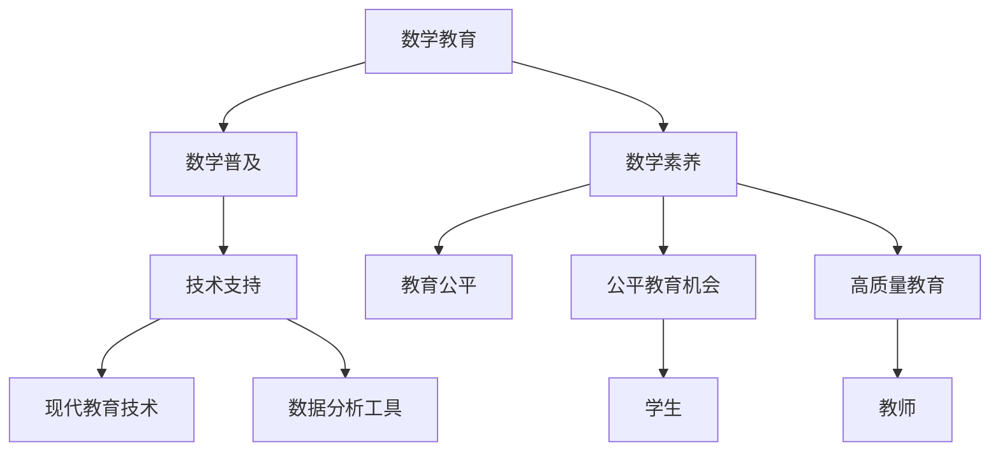

                 

# 数学教育与普及的现代发展

在科技迅猛发展的今天，数学教育与普及成为了教育系统中的重要组成部分，它不仅是科学和技术创新的基石，也是培养公民综合素养的重要工具。本文旨在探讨数学教育与普及的现代发展，分析其核心概念与联系，并提出相应的策略与展望。

## 1. 背景介绍

### 1.1 问题的由来
随着数字化、智能化时代的到来，数学作为支撑技术创新的重要基础，其地位愈发凸显。然而，目前全球范围内，数学教育的普及程度依然存在较大差异。例如，一些发展中国家的基础数学教育尚难以满足国内社会和经济发展的需要，而发达国家在数学教育中仍存在应试教育等诸多问题。因此，本文试图从理论和实践两个维度，分析当前数学教育与普及的现状与挑战，并提出切实可行的解决策略。

### 1.2 问题核心关键点
数学教育与普及的核心关键点主要包括以下几点：
- 数学教育目标的制定
- 教学资源的配置
- 教师素质和教学方法的提升
- 学生的学习动机与兴趣培养
- 评价机制的改进
- 数学教育的现代化手段与工具

本文将围绕这些关键点展开讨论，分析当前数学教育与普及存在的问题与挑战，并提出相应的解决策略。

## 2. 核心概念与联系

### 2.1 核心概念概述
在探讨数学教育与普及的现代发展之前，我们需要首先明确一些核心概念：

- **数学教育**：以传授数学知识为核心目标的教育活动。
- **数学普及**：使更多人获得基本数学知识和技能的普及教育活动。
- **数学素养**：公民应具备的数学知识和应用能力。
- **技术支持**：包括现代教育技术、数据分析工具等，支持数学教育的工具和方法。
- **教育公平**：提供公平教育机会，确保不同社会群体均能接受高质量的数学教育。

### 2.2 核心概念原理和架构的 Mermaid 流程图



该流程图展示了数学教育、数学普及、数学素养、技术支持、教育公平等核心概念之间的相互关系。

## 3. 核心算法原理 & 具体操作步骤

### 3.1 算法原理概述
数学教育与普及的现代发展，本质上是一种复杂的多目标优化问题。其核心算法原理包括以下几点：

1. **数学教育目标的设定**：根据教育层次和学科特点，制定不同层次的数学教育目标。
2. **教学资源的配置**：合理配置教育资源，确保资源公平分配，特别是农村和贫困地区的教育资源。
3. **教师素质提升**：通过教师培训、进修等手段，提升教师的教学能力和素质。
4. **学生学习动机与兴趣培养**：通过趣味教学、个性化学习等方式，激发学生的学习兴趣。
5. **评价机制改进**：改进评价方式，采用多元评价体系，综合考察学生的数学能力和应用能力。
6. **数学教育的现代化手段与工具**：利用现代教育技术和数据分析工具，提高教育效率和效果。

### 3.2 算法步骤详解
以下详细介绍基于现代数学教育与普及的核心算法步骤：

#### 步骤1：教育目标设定
- 明确不同教育阶段的主要数学学习目标，例如小学阶段的计算技能，中学阶段的几何与代数，高中阶段的微积分与概率统计。
- 根据不同国家的教育体系和学生需求，制定灵活多样的学习目标，满足不同学生的需求。

#### 步骤2：资源配置
- 根据区域和学校资源分布情况，合理分配教材、教学设备、师资力量等教育资源。
- 确保资源向贫困、偏远地区倾斜，提升这些地区的教育质量。

#### 步骤3：教师培训
- 组织定期教师培训，提供专业发展机会，提升教师的教育教学能力。
- 引入先进的教学理念和方法，如翻转课堂、项目式学习等。

#### 步骤4：学生学习动机与兴趣培养
- 采用趣味化的教学手段，如数学游戏、实验探究等，激发学生学习兴趣。
- 提供个性化学习路径，根据学生的兴趣和能力，定制学习计划。

#### 步骤5：评价机制改进
- 采用多元化的评价方式，如过程性评价、项目式评价等，全面考察学生的数学能力。
- 定期反馈评价结果，帮助学生明确学习方向，优化学习策略。

#### 步骤6：现代化手段与工具应用
- 引入在线教育平台、智能教育软件等现代教育技术，提高教学效率。
- 利用大数据分析，监控学生学习进度，个性化推荐学习资源。

### 3.3 算法优缺点
数学教育与普及的现代发展算法具有以下优点：
1. 能够根据不同区域和学生需求，制定个性化的教育目标和策略。
2. 提升了教学资源的配置效率，确保资源公平分配。
3. 通过教师培训，提升了整体教学水平。
4. 激发学生学习兴趣，提高学习效果。
5. 采用多元评价机制，全面反映学生的数学能力。
6. 引入现代教育技术，提高了教学效率。

同时，该算法也存在一些不足：
1. 教育目标设定复杂，需要综合考虑国家政策、学校情况和学生需求。
2. 资源配置涉及诸多利益关系，需要细致的规划和协调。
3. 教师培训和素质提升需要长期投入，效果可能较为滞后。
4. 个性化学习资源开发和利用成本较高，需要技术和资金支持。

### 3.4 算法应用领域
数学教育与普及的现代发展算法在教育体系中的多个领域有广泛应用，包括：

- **基础教育**：小学、中学、高中等各级基础教育，提升学生数学素养。
- **职业教育**：技术类、工程类等职业教育的数学教育，满足行业对数学能力的需求。
- **高等教育**：数学专业的本科和研究生教育，培养高层次的数学人才。
- **远程教育**：通过在线教育平台，实现数学教育的普及和资源共享。
- **特殊教育**：针对残疾人士、移民等特殊群体的数学教育，提供公平教育机会。

## 4. 数学模型和公式 & 详细讲解 & 举例说明

### 4.1 数学模型构建
数学教育与普及的现代发展可以构建如下数学模型：

$$
\min_{x} C(x) \text{ 使 } A(x) \geq b
$$

其中，$C(x)$ 为成本函数，$A(x)$ 为约束条件函数，$b$ 为约束条件值。

### 4.2 公式推导过程
该模型的核心在于通过最小化成本函数，同时满足约束条件。具体推导过程如下：

1. 设定教育目标，如数学素养的提升，作为优化目标。
2. 设定教育资源的约束条件，如教学设备、师资力量、教育经费等。
3. 通过优化模型，找到在满足约束条件的前提下，最小化成本的方案。

### 4.3 案例分析与讲解
以下以远程教育为例，说明该数学模型的应用：

#### 案例1：在线教育平台
- 目标：提高数学教学质量，扩大数学教育的普及范围。
- 约束：教学资源限制、网络带宽限制、学生学习时间限制。
- 模型：设定远程教学成本函数和约束条件，通过优化算法寻找最优教学方案。
- 结果：选择合适的教学内容、教学方法和学习工具，提高在线教学效果，扩大受益学生范围。

## 5. 项目实践：代码实例和详细解释说明

### 5.1 开发环境搭建
开发环境搭建需要以下工具和资源：

1. **操作系统**：选择稳定性高、支持教育软件的系统，如Ubuntu Server。
2. **开发语言**：选择Python作为开发语言，支持科学计算和数据分析。
3. **开发框架**：选择Flask作为Web开发框架，支持用户接口和数据管理。
4. **数据库**：选择MySQL作为关系型数据库，用于存储学生数据和课程信息。
5. **数据收集工具**：使用Python爬虫和数据分析工具，收集和处理教育数据。

### 5.2 源代码详细实现
以下是基于Python的远程教育平台开发示例：

```python
from flask import Flask, request, jsonify
import mysql.connector

app = Flask(__name__)

# 连接MySQL数据库
db = mysql.connector.connect(
    host="localhost",
    user="root",
    password="password",
    database="education"
)

# 用户注册和登录功能
@app.route("/register", methods=["POST"])
def register():
    username = request.json.get("username")
    password = request.json.get("password")
    # 将用户信息存入数据库
    cursor = db.cursor()
    cursor.execute("INSERT INTO users (username, password) VALUES (%s, %s)", (username, password))
    db.commit()
    return jsonify({"message": "注册成功"})

# 课程查询功能
@app.route("/courses", methods=["GET"])
def courses():
    course_id = request.args.get("course_id")
    # 从数据库中查询课程信息
    cursor = db.cursor()
    cursor.execute("SELECT * FROM courses WHERE id=%s", (course_id,))
    course = cursor.fetchone()
    return jsonify(course)

# 运行服务
if __name__ == "__main__":
    app.run(host="0.0.0.0", port=8080)
```

### 5.3 代码解读与分析
上述代码实现了远程教育平台的两个基本功能：用户注册和课程查询。其中，注册功能通过POST请求接收用户信息，存储到MySQL数据库中。课程查询功能则通过GET请求获取课程ID，从数据库中查询课程信息并返回。

该示例展示了如何利用Flask框架和MySQL数据库，构建一个简单但功能完备的远程教育平台。开发者可以基于此进行进一步的功能扩展和优化。

### 5.4 运行结果展示
运行上述代码后，可以通过浏览器访问http://localhost:8080，进行用户注册和课程查询操作。

```bash
$ python app.py
```

启动服务后，可以在浏览器中访问http://localhost:8080，体验远程教育平台的基本功能。

## 6. 实际应用场景

### 6.1 远程教育
远程教育作为现代数学教育的重要组成部分，通过网络技术和教育资源，打破了时间和空间的限制。数学教师可以在线进行教学，学生可以通过网络进行互动和学习，极大地提升了教育的普及率。

### 6.2 职业教育
职业教育中的数学教育，针对学生的职业需求，提供专门的数学知识和技能培训。例如，工程类专业的学生，需要掌握高等数学、线性代数等基础数学知识，以支持其专业学习。

### 6.3 高等教育
高等教育阶段的数学教育，侧重于理论研究和高阶数学知识。例如，数学专业的学生需要学习微积分、抽象代数等高等数学内容，培养高层次的数学研究能力。

## 7. 工具和资源推荐

### 7.1 学习资源推荐
1. **《数学教育学》**：详细介绍数学教育的理论和实践，是学习数学教育的重要参考书。
2. **Coursera数学教育课程**：包括多个数学教育相关的在线课程，提供丰富的学习资源。
3. **MathEd.org**：数学教育领域的资源共享平台，提供教学资源、案例分析等。

### 7.2 开发工具推荐
1. **Python**：作为科学计算和数据分析的首选语言，Python在教育软件开发中应用广泛。
2. **Flask**：轻量级的Web框架，支持快速开发和部署教育平台。
3. **MySQL**：作为关系型数据库，支持高效的数学教育数据管理。

### 7.3 相关论文推荐
1. **《数学教育公平性的研究》**：探讨数学教育公平性的实现路径，提出解决策略。
2. **《在线教育的发展趋势》**：分析在线教育的现状和未来发展方向，为数学教育的现代化提供参考。
3. **《技术支持在数学教育中的应用》**：研究现代教育技术在数学教育中的作用，提供技术支持方案。

## 8. 总结：未来发展趋势与挑战

### 8.1 研究成果总结
本文从数学教育与普及的现代发展出发，详细探讨了数学教育的核心概念和关键问题，提出相应的解决方案。通过对数学教育目标、资源配置、教师培训、学生动机培养、评价机制改进和现代化手段的全面分析，展示了数学教育与普及的未来发展方向。

### 8.2 未来发展趋势
未来数学教育与普及将呈现以下趋势：
1. **数据驱动的个性化教育**：利用大数据分析，实现个性化的数学教育。
2. **智能教育系统**：通过人工智能技术，提升教学效果和学生学习体验。
3. **跨学科整合**：数学教育与其他学科的整合，培养学生的综合素养。
4. **开放教育资源**：推动开放教育资源的共享和利用，实现教育公平。

### 8.3 面临的挑战
当前数学教育与普及仍面临诸多挑战：
1. **教育资源不均衡**：城乡、区域间的教育资源差距较大，难以实现公平教育。
2. **教师素质参差不齐**：教师培训和职业发展仍需加强，提升整体教学水平。
3. **学生兴趣培养困难**：传统应试教育模式难以激发学生的学习兴趣。
4. **评价机制单一**：现有的数学教育评价机制过于注重考试成绩，忽视了学生的综合能力。
5. **技术应用局限**：教育技术的应用仍存在技术门槛，推广难度较大。

### 8.4 研究展望
为了应对未来数学教育与普及的挑战，需要从以下几个方面进行研究和探索：
1. **教育公平**：通过政策引导和资源投入，缩小教育资源差距，提升贫困和偏远地区的教育质量。
2. **教师培训**：通过专业发展、职业培训等方式，提升教师的教学能力和素质。
3. **学生兴趣培养**：采用趣味化、个性化等教学手段，激发学生的学习兴趣。
4. **评价机制改进**：构建多元化的评价体系，全面考察学生的数学能力和应用能力。
5. **技术应用推广**：推动教育技术的普及和应用，提升教育效率和效果。

## 9. 附录：常见问题与解答

**Q1：数学教育的目标是什么？**
A: 数学教育的目标是传授数学知识、培养数学能力和提高数学素养。具体而言，包括理解数学概念、掌握数学方法、应用数学知识等。

**Q2：如何提高教师的教学能力？**
A: 提高教师的教学能力，可以通过教师培训、进修、职业发展等方式实现。引入先进的教学理念和方法，如翻转课堂、项目式学习等，提升整体教学水平。

**Q3：如何激发学生的学习兴趣？**
A: 激发学生的学习兴趣，可以采用趣味化的教学手段，如数学游戏、实验探究等。提供个性化学习路径，根据学生的兴趣和能力，定制学习计划。

**Q4：数学教育的评价机制有哪些？**
A: 数学教育的评价机制包括过程性评价、项目式评价、考试成绩等。通过多元化的评价方式，全面考察学生的数学能力。

**Q5：远程教育有哪些优势和挑战？**
A: 远程教育的优势包括打破了时间和空间的限制，提供了灵活的学习方式。其挑战在于网络条件和技术支持的不足，可能导致教学效果不佳。

---

作者：禅与计算机程序设计艺术 / Zen and the Art of Computer Programming

