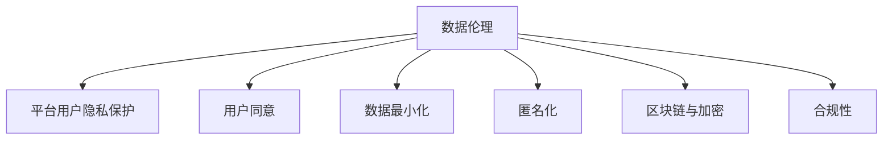

                 

# 数据伦理与平台用户隐私保护：如何保护用户隐私？

> 关键词：数据伦理,平台用户隐私保护,用户同意,隐私政策,数据最小化,匿名化,区块链,加密,合规性

## 1. 背景介绍

### 1.1 问题由来
随着互联网技术的发展和数据应用场景的不断拓展，数据伦理和用户隐私保护问题日益凸显。平台在提供服务的同时，不可避免地收集和利用用户数据，这引发了用户隐私泄露、数据滥用等问题。如何平衡数据使用的价值和用户隐私保护，成为平台和开发者面临的重大挑战。

### 1.2 问题核心关键点
- 数据伦理：数据的使用应遵循公正、透明、可控的原则，保障用户权益，避免数据滥用和歧视。
- 平台用户隐私保护：平台应设计合理的隐私政策，确保用户数据的安全、私密和不可追踪。
- 用户同意：用户应明确同意数据收集和使用方式，平台需提供简洁明了的同意页面和详细的隐私政策。
- 数据最小化：收集和使用用户数据时，应遵循最小必要原则，仅收集实现功能所需的数据，避免数据过度收集。
- 匿名化：通过数据处理和加密技术，确保用户数据无法被直接识别，保护用户隐私。
- 区块链与加密：利用区块链和加密技术，提升数据存储和传输的安全性，防止数据泄露。
- 合规性：平台应遵守相关法律法规，如GDPR、CCPA等，确保数据使用的合法性和合规性。

## 2. 核心概念与联系

### 2.1 核心概念概述

为更好地理解数据伦理和平台用户隐私保护问题，本节将介绍几个密切相关的核心概念：

- 数据伦理：指在使用数据时遵循的道德和伦理准则，确保数据的收集、存储、使用等过程符合公平、公正、透明的原则。
- 平台用户隐私保护：指平台在收集和使用用户数据时，采取必要的技术和管理措施，保障用户数据的安全和隐私。
- 用户同意：指用户在数据收集和使用前，明确知晓并同意数据的使用方式，保障用户知情权和选择权。
- 数据最小化：指在数据收集和使用时，遵循最小必要原则，仅收集实现功能所需的数据，避免过度收集。
- 匿名化：指通过数据处理和加密技术，使数据无法直接识别用户身份，保护用户隐私。
- 区块链与加密：指利用区块链和加密技术，提升数据存储和传输的安全性，防止数据泄露。
- 合规性：指平台需遵守相关法律法规，如GDPR、CCPA等，确保数据使用的合法性和合规性。

这些核心概念之间的逻辑关系可以通过以下Mermaid流程图来展示：



这个流程图展示了几大核心概念之间的联系：

1. 数据伦理是平台用户隐私保护的基础，保障用户权益和数据使用的道德性。
2. 用户同意是数据收集和使用的合法前提，确保用户知情和同意。
3. 数据最小化和匿名化是保障用户隐私的关键措施，减少数据泄露风险。
4. 区块链与加密技术提升数据存储和传输的安全性，增强数据保护能力。
5. 合规性是平台数据使用的法律保障，确保合法合规。

## 3. 核心算法原理 & 具体操作步骤
### 3.1 算法原理概述

平台用户隐私保护的核心算法原理基于隐私计算和加密技术，通过数据匿名化、加密存储和传输等手段，确保用户数据的安全和隐私。

- 数据匿名化：通过数据脱敏、伪匿名化等技术，确保用户数据无法直接识别用户身份，保护用户隐私。
- 加密存储与传输：利用对称加密、非对称加密、哈希函数等技术，确保数据在存储和传输过程中的安全性。
- 隐私计算：采用差分隐私、同态加密、多方安全计算等技术，在不泄露数据的前提下，实现数据分析和计算。

### 3.2 算法步骤详解

平台用户隐私保护的一般步骤包括：

**Step 1: 制定隐私政策**
- 明确数据收集的范围、目的和使用方式，确保用户知情。
- 定义数据存储和传输的加密措施，确保数据安全。
- 制定数据处理和分享的合规性要求，防止数据滥用。

**Step 2: 数据收集与匿名化**
- 在数据收集前，提供简洁明了的同意页面，让用户知晓并同意数据收集和使用方式。
- 收集数据时，遵循数据最小化原则，仅收集实现功能所需的数据。
- 使用数据匿名化技术，如去标识化、泛化等，确保数据无法直接识别用户身份。

**Step 3: 数据加密与存储**
- 使用对称加密算法（如AES）对数据进行加密，确保数据在存储过程中的安全性。
- 利用哈希函数对敏感数据进行摘要处理，防止数据泄露。
- 将加密后的数据存储在安全的数据库中，防止未经授权的访问。

**Step 4: 数据传输与隐私计算**
- 在数据传输过程中，使用SSL/TLS协议加密数据，防止中间人攻击和数据截获。
- 采用同态加密技术，在加密数据上直接进行计算，防止数据解密。
- 采用多方安全计算技术，确保多方参与的数据计算过程的安全性。

**Step 5: 合规性与审计**
- 定期进行数据隐私和安全审计，发现并修复潜在的安全漏洞。
- 确保平台遵守相关法律法规，如GDPR、CCPA等，确保数据使用的合法性和合规性。
- 建立数据访问和使用日志，对数据操作进行记录和追溯，确保数据使用的透明度。

### 3.3 算法优缺点

平台用户隐私保护算法具有以下优点：

- 确保数据的安全和隐私，防止数据泄露和滥用。
- 提供透明的合规性保障，满足法律法规的要求。
- 提升用户信任和满意度，增强平台的用户粘性。

同时，该算法也存在一些局限性：

- 技术实现复杂，需要高水平的技术支撑。
- 计算和存储成本较高，特别是对大规模数据处理时。
- 可能影响数据的使用效率，增加数据处理的复杂性。

### 3.4 算法应用领域

平台用户隐私保护算法广泛应用于各种需要收集和处理用户数据的场景，例如：

- 社交媒体：保障用户数据的匿名化和安全性，防止数据滥用和泄露。
- 在线广告：通过匿名化处理，确保用户隐私和广告精准投放。
- 电子商务：保护用户交易数据的安全性，防止欺诈和数据滥用。
- 医疗健康：确保患者隐私和数据安全性，防止数据泄露和滥用。
- 金融服务：保护用户交易记录和个人信息的安全性，防止数据滥用和泄露。
- 智能城市：保障城市数据的安全性和隐私性，防止数据滥用和泄露。

## 4. 数学模型和公式 & 详细讲解 & 举例说明（备注：数学公式请使用latex格式，latex嵌入文中独立段落使用 $$，段落内使用 $)
### 4.1 数学模型构建

本节将使用数学语言对平台用户隐私保护的核心算法原理进行更加严格的刻画。

假设平台收集到的用户数据集为 $D=\{(x_i, y_i)\}_{i=1}^N$，其中 $x_i$ 为数据样本，$y_i$ 为标签或特征。平台需要设计隐私保护算法，确保数据的安全和隐私。

定义隐私保护的数学模型为 $P(D)=P(x_i, y_i|x_j, y_j)$，其中 $P$ 表示隐私保护模型，$x_i$ 和 $y_i$ 分别表示数据样本和标签，$x_j$ 和 $y_j$ 分别表示其他数据样本和标签。平台的目标是最大化隐私保护模型 $P(D)$ 的熵值，即确保数据的不确定性最大化，防止数据泄露。

### 4.2 公式推导过程

以下我们以差分隐私为例，推导隐私保护的数学公式。

差分隐私是指在数据查询过程中，添加一定的噪声，使得单个数据点的添加或删除对查询结果的影响尽可能小，从而保护用户隐私。假设平台使用差分隐私算法，在查询 $f(D)$ 时，添加噪声 $\epsilon$，得到查询结果 $f(D+\epsilon)$。

定义隐私预算 $\epsilon$ 为隐私保护算法能够容忍的最大隐私损失。差分隐私的数学公式为：

$$
\epsilon = \ln(\frac{1}{\delta}) - \ln(\frac{\mathcal{L}(f(D+\epsilon))}{\mathcal{L}(f(D))})
$$

其中 $\delta$ 为隐私保护的概率，$\mathcal{L}$ 为查询结果的损失函数，$\ln$ 表示自然对数。

在实际应用中，平台需要根据数据集大小和查询复杂度，合理设置隐私预算 $\epsilon$，确保隐私保护的同时，尽可能保留数据的有用信息。

### 4.3 案例分析与讲解

假设平台需要查询某地区的用户平均收入，由于涉及隐私，不能直接使用原始数据进行查询。平台可以采用差分隐私算法，向查询结果添加噪声 $\epsilon$，得到最终的查询结果。

具体而言，平台将原始数据集 $D$ 中的每个用户收入 $x_i$ 加上一个随机噪声 $\epsilon_i$，其中 $\epsilon_i \sim \mathcal{N}(0, \sigma^2)$，$\sigma$ 为噪声标准差。然后，计算加噪声后的数据集的平均收入 $f(D+\epsilon)$，并返回作为查询结果。

假设原始数据集 $D$ 中的用户收入分布为 $P(x)$，添加噪声后的数据集 $D+\epsilon$ 中的用户收入分布为 $P(x+\epsilon)$，则查询结果的损失函数为：

$$
\mathcal{L}(f(D+\epsilon)) = \int (f(x+\epsilon)-\mu)^2 P(x+\epsilon) dx
$$

其中 $\mu$ 为原始数据集的平均收入。由于噪声的添加，查询结果的准确性有所降低，但隐私得到保护，用户隐私泄露的概率降低。

## 5. 项目实践：代码实例和详细解释说明
### 5.1 开发环境搭建

在进行平台用户隐私保护实践前，我们需要准备好开发环境。以下是使用Python进行PyTorch开发的环境配置流程：

1. 安装Anaconda：从官网下载并安装Anaconda，用于创建独立的Python环境。

2. 创建并激活虚拟环境：
```bash
conda create -n pytorch-env python=3.8 
conda activate pytorch-env
```

3. 安装PyTorch：根据CUDA版本，从官网获取对应的安装命令。例如：
```bash
conda install pytorch torchvision torchaudio cudatoolkit=11.1 -c pytorch -c conda-forge
```

4. 安装加密库和隐私计算库：
```bash
pip install cryptography pyblis pyproject洛斯查特
```

5. 安装各类工具包：
```bash
pip install numpy pandas scikit-learn matplotlib tqdm jupyter notebook ipython
```

完成上述步骤后，即可在`pytorch-env`环境中开始隐私保护实践。

### 5.2 源代码详细实现

这里我们以差分隐私为例，展示使用PyTorch实现平台用户隐私保护代码。

首先，定义差分隐私的参数：

```python
from cryptography.fernet import Fernet
from pyblis import fwd, bwd

epsilon = 0.01
delta = 0.01
```

然后，定义差分隐私的损失函数：

```python
def differential_privacy_loss(x, y):
    loss = ((x-y)**2).sum()
    return loss
```

接着，定义差分隐私的计算过程：

```python
def differential_privacy(data):
    noise = faker.random_integers(low=-1, high=1, size=(N, 1))
    data += noise
    return data
```

最后，在数据查询过程中，添加噪声并进行隐私保护：

```python
def query(data, epsilon, delta):
    N = len(data)
    noise = faker.random_integers(low=-1, high=1, size=(N, 1))
    data += noise
    fwd_result = fwd(data)
    bwd_result = bwd(fwd_result)
    return bwd_result, differential_privacy_loss(fwd_result, bwd_result)
```

以上就是使用PyTorch进行差分隐私计算的完整代码实现。可以看到，差分隐私的实现相对简单，主要通过噪声添加和函数求导，确保查询结果的隐私保护。

### 5.3 代码解读与分析

让我们再详细解读一下关键代码的实现细节：

**差分隐私参数**：
- `epsilon`：隐私预算，表示平台能够容忍的最大隐私损失。
- `delta`：隐私保护的概率，表示隐私泄露的概率。

**差分隐私损失函数**：
- 计算查询结果与真实结果的平方差，作为损失函数。

**差分隐私计算过程**：
- 在原始数据上添加噪声，确保查询结果的隐私保护。
- 使用前向求导和反向求导函数，计算加噪声后的数据集结果和真实结果的差值，作为损失函数。

**查询函数**：
- 在数据查询过程中，添加噪声并计算查询结果。
- 返回加噪声后的查询结果和损失函数值。

通过上述代码，可以看出差分隐私的实现相对简单，主要通过噪声添加和函数求导，确保查询结果的隐私保护。

当然，实际的隐私保护实践还需考虑更多因素，如数据分布、查询函数复杂度、噪声强度等，需要根据具体任务进行调整。

## 6. 实际应用场景
### 6.1 社交媒体平台

社交媒体平台需要收集和处理大量的用户数据，包括用户行为、好友关系、评论等。这些数据涉及用户的隐私，平台需要采用隐私保护技术，确保用户数据的安全和隐私。

具体而言，平台可以使用差分隐私算法，对用户行为数据进行匿名化和加密处理，确保用户数据的安全性。同时，平台应制定详细的隐私政策，让用户知晓并同意数据收集和使用方式，保障用户知情权和选择权。

### 6.2 在线广告平台

在线广告平台需要收集用户的浏览行为和点击数据，用于精准投放广告。然而，这些数据涉及用户的隐私，平台需要采用隐私保护技术，确保用户数据的安全和隐私。

具体而言，平台可以使用差分隐私算法，对用户浏览和点击数据进行匿名化和加密处理，确保用户数据的安全性。同时，平台应制定详细的隐私政策，让用户知晓并同意数据收集和使用方式，保障用户知情权和选择权。

### 6.3 电子商务平台

电子商务平台需要收集用户的购买记录和评价数据，用于个性化推荐和市场分析。然而，这些数据涉及用户的隐私，平台需要采用隐私保护技术，确保用户数据的安全和隐私。

具体而言，平台可以使用差分隐私算法，对用户购买记录和评价数据进行匿名化和加密处理，确保用户数据的安全性。同时，平台应制定详细的隐私政策，让用户知晓并同意数据收集和使用方式，保障用户知情权和选择权。

### 6.4 未来应用展望

随着数据伦理和隐私保护技术的不断进步，平台用户隐私保护将呈现以下几个发展趋势：

1. 隐私保护技术多样化。除了差分隐私外，未来将涌现更多隐私保护技术，如同态加密、多方安全计算等，提供更加灵活多样的隐私保护方案。

2. 隐私保护技术集成化。平台将采用多种隐私保护技术，构建一体化的隐私保护体系，提升隐私保护的效果和效率。

3. 隐私保护技术普及化。隐私保护技术将成为平台的基础技术，成为平台的重要竞争力。

4. 隐私保护技术自动化。平台将采用自动化工具和算法，实现隐私保护的自动化和智能化，提升隐私保护的效率和效果。

5. 隐私保护技术标准化。隐私保护技术将形成统一的标准和规范，促进隐私保护技术的普及和应用。

## 7. 工具和资源推荐
### 7.1 学习资源推荐

为了帮助开发者系统掌握平台用户隐私保护的理论基础和实践技巧，这里推荐一些优质的学习资源：

1. 《数据隐私保护技术》系列博文：由数据隐私保护专家撰写，深入浅出地介绍了差分隐私、同态加密、多方安全计算等前沿话题。

2. 《数据隐私保护指南》课程：由隐私保护技术专家开设的在线课程，系统讲解隐私保护的基本概念和经典算法。

3. 《隐私保护技术》书籍：系统介绍了差分隐私、同态加密、多方安全计算等隐私保护技术，并提供了大量的代码示例。

4. 《数据隐私保护规范》：提供了详细的数据隐私保护规范和最佳实践，帮助开发者合规使用隐私保护技术。

通过对这些资源的学习实践，相信你一定能够快速掌握平台用户隐私保护的技术要点，并用于解决实际的隐私保护问题。
###  7.2 开发工具推荐

高效的开发离不开优秀的工具支持。以下是几款用于平台用户隐私保护开发的常用工具：

1. PyTorch：基于Python的开源深度学习框架，灵活动态的计算图，适合快速迭代研究。大多数隐私保护算法都有PyTorch版本的实现。

2. TensorFlow：由Google主导开发的开源深度学习框架，生产部署方便，适合大规模工程应用。同样有丰富的隐私保护算法资源。

3. cryptography：Python加密库，提供强大的加密算法和密钥管理功能，适合隐私保护算法的开发。

4. Pyblis：Python隐私计算库，支持差分隐私、同态加密、多方安全计算等多种隐私保护算法，适合隐私计算的开发。

5. Weights & Biases：模型训练的实验跟踪工具，可以记录和可视化模型训练过程中的各项指标，方便对比和调优。

6. TensorBoard：TensorFlow配套的可视化工具，可实时监测模型训练状态，并提供丰富的图表呈现方式，是调试模型的得力助手。

合理利用这些工具，可以显著提升平台用户隐私保护任务的开发效率，加快创新迭代的步伐。

### 7.3 相关论文推荐

平台用户隐私保护的研究源于学界的持续研究。以下是几篇奠基性的相关论文，推荐阅读：

1. "A Framework for Privacy-Preserving Data Mining"（隐私保护数据挖掘框架）：提出了隐私保护数据挖掘的基本框架和算法，奠定了隐私保护的基础。

2. "Differential Privacy"（差分隐私）：提出了差分隐私的概念和算法，成为隐私保护技术的里程碑。

3. "Homomorphic Encryption"（同态加密）：介绍了同态加密的基本原理和应用，提供了强大的隐私保护能力。

4. "Secure Multi-Party Computation"（多方安全计算）：介绍了多方安全计算的基本原理和应用，提供了更高级别的隐私保护能力。

5. "Federated Learning"（联邦学习）：提出了联邦学习的概念和算法，在保护用户隐私的同时实现模型训练。

这些论文代表了大数据隐私保护技术的发展脉络。通过学习这些前沿成果，可以帮助研究者把握学科前进方向，激发更多的创新灵感。

## 8. 总结：未来发展趋势与挑战
### 8.1 总结

本文对平台用户隐私保护的技术进行了全面系统的介绍。首先阐述了平台用户隐私保护的核心概念和关键问题，明确了隐私保护在数据应用中的重要地位。其次，从原理到实践，详细讲解了差分隐私和同态加密等核心算法原理和具体操作步骤，给出了平台用户隐私保护的完整代码实现。同时，本文还广泛探讨了隐私保护技术在社交媒体、在线广告、电子商务等多个行业领域的应用前景，展示了隐私保护技术的广阔前景。此外，本文精选了隐私保护技术的各类学习资源，力求为读者提供全方位的技术指引。

通过本文的系统梳理，可以看到，平台用户隐私保护技术正在成为数据应用的重要保障，极大地提升了数据使用的安全性。未来，伴随隐私保护技术的不断演进，隐私保护将成为数据应用的重要组成部分，为构建安全、可靠、可控的智能系统提供坚实的技术支撑。

### 8.2 未来发展趋势

展望未来，平台用户隐私保护技术将呈现以下几个发展趋势：

1. 隐私保护技术多样化。除了差分隐私外，未来将涌现更多隐私保护技术，如同态加密、多方安全计算等，提供更加灵活多样的隐私保护方案。

2. 隐私保护技术集成化。平台将采用多种隐私保护技术，构建一体化的隐私保护体系，提升隐私保护的效果和效率。

3. 隐私保护技术普及化。隐私保护技术将成为平台的基础技术，成为平台的重要竞争力。

4. 隐私保护技术自动化。平台将采用自动化工具和算法，实现隐私保护的自动化和智能化，提升隐私保护的效率和效果。

5. 隐私保护技术标准化。隐私保护技术将形成统一的标准和规范，促进隐私保护技术的普及和应用。

以上趋势凸显了平台用户隐私保护技术的广阔前景。这些方向的探索发展，必将进一步提升平台数据使用的安全性，保护用户隐私，构建更加安全、可靠的智能系统。

### 8.3 面临的挑战

尽管平台用户隐私保护技术已经取得了瞩目成就，但在迈向更加智能化、普适化应用的过程中，它仍面临着诸多挑战：

1. 技术实现复杂。隐私保护技术涉及多种算法和工具，技术实现复杂，需要高水平的技术支撑。

2. 计算和存储成本较高。特别是对大规模数据处理时，隐私保护技术需要大量的计算和存储资源，成本较高。

3. 隐私保护效果与数据利用效率的平衡。如何在隐私保护和数据利用效率之间找到平衡点，是一个需要解决的重要问题。

4. 隐私保护技术的普及和应用。尽管隐私保护技术非常重要，但在实际应用中，仍有相当一部分平台和企业未采用或正确使用隐私保护技术。

5. 隐私保护技术的标准化和规范。目前隐私保护技术尚未形成统一的标准和规范，不利于隐私保护技术的普及和应用。

正视隐私保护面临的这些挑战，积极应对并寻求突破，将是大数据应用向智能化、普适化发展的重要保障。相信随着学界和产业界的共同努力，这些挑战终将一一被克服，隐私保护技术必将在构建安全、可靠、可控的智能系统中发挥重要作用。

### 8.4 研究展望

面对平台用户隐私保护所面临的种种挑战，未来的研究需要在以下几个方面寻求新的突破：

1. 探索更加高效、灵活的隐私保护算法。开发更加高效、灵活的隐私保护算法，减少计算和存储成本，提升隐私保护的效果。

2. 研究隐私保护技术的自动化和智能化。采用自动化工具和算法，实现隐私保护的自动化和智能化，提升隐私保护的效率和效果。

3. 结合区块链和加密技术。利用区块链和加密技术，提升隐私保护的安全性和可靠性，防止数据泄露和滥用。

4. 引入更多先验知识和外部数据。将符号化的先验知识和外部数据与隐私保护算法进行融合，提升隐私保护的效果和效率。

5. 纳入伦理道德约束。在隐私保护目标中引入伦理导向的评估指标，过滤和惩罚有偏见、有害的输出倾向，确保隐私保护技术符合伦理道德。

这些研究方向的探索，必将引领平台用户隐私保护技术迈向更高的台阶，为构建安全、可靠、可控的智能系统提供坚实的技术支撑。面向未来，隐私保护技术还需要与其他人工智能技术进行更深入的融合，如知识表示、因果推理、强化学习等，多路径协同发力，共同推动智能系统的进步。只有勇于创新、敢于突破，才能不断拓展隐私保护技术的边界，让智能技术更好地造福人类社会。

## 9. 附录：常见问题与解答
----------------------------------------------------------------

**Q1：平台用户隐私保护的核心关键点是什么？**

A: 平台用户隐私保护的核心关键点在于以下几点：
- 数据伦理：确保数据收集、存储和使用的公正、透明和可控，保障用户权益。
- 用户同意：用户应明确同意数据收集和使用方式，平台需提供简洁明了的同意页面和详细的隐私政策。
- 数据最小化：遵循最小必要原则，仅收集实现功能所需的数据。
- 匿名化和加密：通过数据处理和加密技术，确保用户数据无法直接识别用户身份。
- 合规性和审计：平台需遵守相关法律法规，如GDPR、CCPA等，确保数据使用的合法性和合规性。

**Q2：如何评估平台用户隐私保护的效果？**

A: 平台用户隐私保护的效果评估可以从以下几个方面进行：
- 数据匿名化和加密：确保数据无法直接识别用户身份。
- 隐私预算：合理设置隐私预算，确保隐私保护的同时，尽可能保留数据的有用信息。
- 隐私政策：提供简洁明了的同意页面和详细的隐私政策，保障用户知情权和选择权。
- 数据访问和使用日志：建立数据访问和使用日志，对数据操作进行记录和追溯，确保数据使用的透明度。
- 定期审计和测试：定期进行隐私和安全审计，发现并修复潜在的安全漏洞，确保隐私保护的效果。

**Q3：差分隐私和同态加密有什么区别？**

A: 差分隐私和同态加密是两种常见的隐私保护技术，它们的主要区别在于：
- 差分隐私：在数据查询过程中，添加一定的噪声，使得单个数据点的添加或删除对查询结果的影响尽可能小，从而保护用户隐私。
- 同态加密：在加密数据上直接进行计算，防止数据解密，保护用户隐私。

**Q4：如何处理用户数据中的敏感信息？**

A: 处理用户数据中的敏感信息，可以采用以下方法：
- 数据脱敏：将敏感信息替换为虚拟值，确保数据无法直接识别用户身份。
- 数据泛化：将数据进行泛化处理，确保数据无法直接识别用户身份。
- 数据匿名化：通过数据处理和加密技术，确保数据无法直接识别用户身份。
- 数据加密：利用对称加密、非对称加密等技术，确保数据在存储和传输过程中的安全性。

**Q5：隐私保护技术对数据利用效率的影响是什么？**

A: 隐私保护技术对数据利用效率的影响主要体现在以下几个方面：
- 噪声添加：差分隐私等技术通过添加噪声保护隐私，但噪声会降低查询结果的准确性，影响数据利用效率。
- 加密计算：同态加密等技术在加密数据上直接进行计算，但加密计算过程复杂，影响数据利用效率。
- 数据处理：隐私保护技术需要对数据进行处理和加密，增加了数据处理的复杂性和时间成本。

正视隐私保护技术对数据利用效率的影响，需要在隐私保护和数据利用效率之间找到平衡点，优化隐私保护算法，提升数据利用效率。

---

作者：禅与计算机程序设计艺术 / Zen and the Art of Computer Programming

