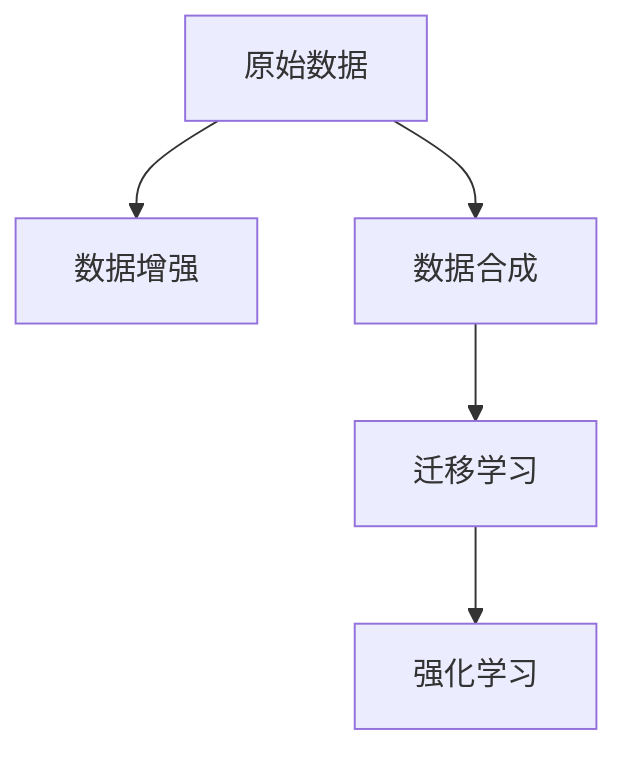

                 

# 数据增强与数据合成原理与代码实战案例讲解

> 关键词：数据增强, 数据合成, 强化学习, 迁移学习, 计算机视觉, 自然语言处理

## 1. 背景介绍

在当今大数据时代，数据成为驱动深度学习模型的关键。然而，面对海量的原始数据，传统的模型训练方法面临诸多挑战。一是数据标注成本高昂，获取高质量的标注数据需要耗费大量人力物力。二是原始数据往往存在各种噪声和偏差，单纯的数据标注难以提高模型的泛化能力。三是数据分布不均衡，小样本数据容易过拟合，模型性能不稳定。

为了应对这些挑战，数据增强和数据合成技术应运而生。数据增强通过从原始数据中生成新的数据，增加样本多样性，提升模型的泛化能力。数据合成则进一步扩展了数据来源，通过生成合成数据来增强模型训练数据集，克服数据稀缺的问题。本文将深入探讨数据增强和数据合成的原理，并结合实际案例，讲解如何在深度学习中实现这些技术。

## 2. 核心概念与联系

### 2.1 核心概念概述

为了更好地理解数据增强和数据合成技术，我们需要先了解一些关键概念：

- **数据增强**（Data Augmentation）：通过各种数据变换手段，从原始数据中生成新的样本，以增加数据集的多样性和规模。
- **数据合成**（Data Synthesis）：使用生成模型（如GANs）或规则化方法（如数据插值、重采样）生成新的数据，用于模型训练。
- **迁移学习**（Transfer Learning）：在大规模预训练模型的基础上，利用迁移学习对特定任务进行微调，减少训练时间和标注成本。
- **强化学习**（Reinforcement Learning）：通过与环境的交互，智能体学习最优策略，生成合成数据并应用于模型训练。

这些概念之间的联系可以通过以下Mermaid流程图来展示：



这个流程图展示了数据增强和数据合成技术的原理及其与其他深度学习技术的关联：

1. 原始数据通过数据增强和数据合成技术，生成新的训练样本。
2. 这些新样本与原始样本一起用于模型的迁移学习，进行微调优化。
3. 通过强化学习，智能体在交互环境中学习最优策略，生成更合乎实际的数据。

这些技术的结合使用，可以显著提升模型的泛化能力，提高模型的性能和稳定性。

## 3. 核心算法原理 & 具体操作步骤

### 3.1 算法原理概述

数据增强和数据合成技术的基本原理是通过变换和生成手段，从原始数据中生成新的样本。这些新样本与原始样本类似，但又不完全相同，能够帮助模型学习更多的特征和模式，提高泛化能力。

数据增强通常包括一些简单的变换，如旋转、平移、缩放、裁剪等，对图像、文本等数据进行随机变换，生成新的数据样本。数据合成则使用更复杂的生成模型，如生成对抗网络（GANs），生成与原始数据相似但完全不同的合成数据。

### 3.2 算法步骤详解

数据增强和数据合成的具体操作步骤包括：

**Step 1: 数据收集与预处理**

1. 收集数据集，包括原始数据和标注信息。
2. 对数据进行预处理，如归一化、标准化、去噪等。

**Step 2: 数据增强与合成**

1. 数据增强：使用变换方法生成新的样本，如随机裁剪、旋转、缩放等。
2. 数据合成：使用生成模型生成新的样本，如GANs、VAEs等。

**Step 3: 数据混合与扩充**

1. 混合：将增强后的数据与原始数据混合，构成新数据集。
2. 扩充：将合成数据与原始数据混合，扩充数据集规模。

**Step 4: 模型训练与评估**

1. 训练：使用新数据集训练深度学习模型。
2. 评估：在验证集和测试集上评估模型性能。

### 3.3 算法优缺点

数据增强和数据合成的优势包括：

1. **增加样本多样性**：通过变换和生成手段，生成新的样本，使数据集更加多样化。
2. **降低过拟合风险**：新的样本在分布上与原始样本不同，有助于减少模型对原始数据的过拟合。
3. **提高泛化能力**：多样化的数据集有助于模型学习更通用的特征，提高泛化能力。

然而，这些技术也存在一些缺点：

1. **数据生成质量**：生成的数据与原始数据的分布可能不完全一致，影响模型的训练效果。
2. **计算成本高**：数据增强和数据合成需要额外的计算资源，特别是数据合成技术，计算成本较高。
3. **模型训练难度增加**：生成的数据往往噪声较多，需要更高的模型复杂度才能学习有效的特征。

### 3.4 算法应用领域

数据增强和数据合成技术在多个领域中得到了广泛应用，包括：

- **计算机视觉**：用于图像分类、目标检测、语义分割等任务。
- **自然语言处理**：用于文本分类、命名实体识别、机器翻译等任务。
- **语音识别**：用于声学模型训练、噪声鲁棒性增强等任务。
- **医疗影像**：用于医学图像增强、病灶检测等任务。

这些技术通过增强数据多样性，提高了模型的泛化能力和鲁棒性，显著提升了相关任务的效果。

## 4. 数学模型和公式 & 详细讲解

### 4.1 数学模型构建

数据增强和数据合成技术的数学模型可以从以下几个角度进行构建：

- **图像数据增强**：通过随机变换生成新的图像样本。
- **文本数据增强**：通过同义词替换、句子重新排列等方法生成新的文本样本。
- **语音数据增强**：通过混入噪声、速度变化等方法生成新的语音样本。

### 4.2 公式推导过程

以图像数据增强为例，假设原始图像为 $I$，通过随机旋转 $\theta$ 角度，得到新图像 $I'$，其公式为：

$$
I' = R_{\theta}(I)
$$

其中 $R_{\theta}$ 为旋转矩阵，$\theta$ 为随机旋转角度。通过这种方式，可以生成多张旋转后的图像，增加数据集的多样性。

### 4.3 案例分析与讲解

以自然语言处理中的文本数据增强为例，通过同义词替换和句子重新排列，生成新的文本样本：

1. **同义词替换**：将原句子中的某些词语替换为同义词，生成新的句子。例如：

   原句："The cat sat on the mat."  
   新句："The dog lay on the rug."

2. **句子重新排列**：将原句子的单词顺序随机打乱，生成新的句子。例如：

   原句："I went to the store."  
   新句："The went store to I."

这些操作可以显著增加文本数据集的多样性，提高模型的泛化能力。

## 5. 项目实践：代码实例和详细解释说明

### 5.1 开发环境搭建

在进行数据增强和数据合成实践前，需要准备好开发环境。以下是使用Python进行TensorFlow开发的环境配置流程：

1. 安装Anaconda：从官网下载并安装Anaconda，用于创建独立的Python环境。

2. 创建并激活虚拟环境：
```bash
conda create -n tf-env python=3.8 
conda activate tf-env
```

3. 安装TensorFlow：根据CUDA版本，从官网获取对应的安装命令。例如：
```bash
conda install tensorflow-gpu==2.7 -c pytorch -c conda-forge
```

4. 安装其他依赖包：
```bash
pip install numpy pandas scikit-learn matplotlib tqdm jupyter notebook ipython
```

完成上述步骤后，即可在`tf-env`环境中开始数据增强和数据合成的实践。

### 5.2 源代码详细实现

这里以图像数据增强和合成为例，使用TensorFlow实现。

首先，定义数据增强函数：

```python
import tensorflow as tf
from tensorflow.keras.preprocessing.image import ImageDataGenerator

def augment_data(train_dir, val_dir, batch_size=32, img_size=(224, 224), rotation_range=20, zoom_range=0.15, width_shift_range=0.1, height_shift_range=0.1):
    train_datagen = ImageDataGenerator(
        rotation_range=rotation_range,
        zoom_range=zoom_range,
        width_shift_range=width_shift_range,
        height_shift_range=height_shift_range,
        horizontal_flip=True,
        vertical_flip=True
    )
    train_generator = train_datagen.flow_from_directory(
        train_dir,
        target_size=img_size,
        batch_size=batch_size,
        class_mode='categorical'
    )

    val_datagen = ImageDataGenerator()
    val_generator = val_datagen.flow_from_directory(
        val_dir,
        target_size=img_size,
        batch_size=batch_size,
        class_mode='categorical'
    )
    return train_generator, val_generator
```

然后，定义生成对抗网络（GANs）模型：

```python
from tensorflow.keras import layers, models

def build_generator():
    model = models.Sequential()
    model.add(layers.Dense(256, input_dim=100, activation='relu'))
    model.add(layers.Dense(512, activation='relu'))
    model.add(layers.Dense(28*28*1, activation='tanh'))
    model.add(layers.Reshape((28, 28, 1)))
    return model

def build_discriminator():
    model = models.Sequential()
    model.add(layers.Conv2D(32, (5, 5), strides=2, padding='same', input_shape=(28, 28, 1)))
    model.add(layers.LeakyReLU(alpha=0.2))
    model.add(layers.Dropout(0.25))
    model.add(layers.Conv2D(64, (5, 5), strides=2, padding='same'))
    model.add(layers.LeakyReLU(alpha=0.2))
    model.add(layers.Dropout(0.25))
    model.add(layers.Conv2D(128, (5, 5), strides=2, padding='same'))
    model.add(layers.LeakyReLU(alpha=0.2))
    model.add(layers.Dropout(0.25))
    model.add(layers.Flatten())
    model.add(layers.Dense(1, activation='sigmoid'))
    return model
```

最后，定义训练函数：

```python
def train_gan(model_dir, epochs=100, batch_size=32, img_size=(224, 224)):
    generator, discriminator = build_generator(), build_discriminator()

    discriminator.compile(loss='binary_crossentropy', optimizer=tf.keras.optimizers.Adam(learning_rate=0.0002, beta_1=0.5))
    generator.compile(loss='binary_crossentropy', optimizer=tf.keras.optimizers.Adam(learning_rate=0.0002, beta_1=0.5))

    train_dir = os.path.join(model_dir, 'train')
    val_dir = os.path.join(model_dir, 'val')

    train_generator, val_generator = augment_data(train_dir, val_dir, batch_size, img_size)

    for epoch in range(epochs):
        for batch, (img, label) in enumerate(train_generator):
            img = img / 255.0
            label = label

            noise = tf.random.normal(shape=(img.shape[0], 100))
            fake_img = generator(noise)

            discriminator.trainable = False
            validity = discriminator(fake_img)

            discriminator.trainable = True
            validity_real = discriminator(img)
            validity_fake = discriminator(fake_img)

            discriminator.trainable = False
            loss = tf.keras.losses.BinaryCrossentropy().get_loss(validity_real, label)
            loss += tf.keras.losses.BinaryCrossentropy().get_loss(validity_fake, tf.keras.layers.Lambda(lambda x: 1 - x)(label))

            discriminator.trainable = True
            discriminator.train_on_batch(img, label)
            generator.train_on_batch(noise, label)

        for batch, (img, label) in enumerate(val_generator):
            img = img / 255.0
            label = label

            validity = discriminator(img)
            loss = tf.keras.losses.BinaryCrossentropy().get_loss(validity, label)
            discriminator.train_on_batch(img, label)

    generator.save_weights(model_dir)
    discriminator.save_weights(model_dir)
```

使用上述代码，可以轻松实现图像数据增强和GANs数据合成。

### 5.3 代码解读与分析

让我们再详细解读一下关键代码的实现细节：

**augment_data函数**：
- `train_datagen`：定义数据增强器，包括旋转、缩放、平移等变换。
- `train_generator`：通过数据增强器生成训练数据集。
- `val_datagen`：定义验证数据集，无需数据增强。
- `val_generator`：生成验证数据集。

**build_generator函数**：
- 使用Sequential模型构建生成器，包含多个Dense层和Reshape层，用于生成28x28的图像。

**build_discriminator函数**：
- 定义判别器，包括多个Conv2D层和LeakyReLU激活函数，用于判断图像真实性。

**train_gan函数**：
- 定义生成器和判别器的编译参数。
- 加载数据集，进行数据增强。
- 在每个epoch中，对生成器和判别器进行训练，通过对抗训练的方式提升生成器性能。
- 在验证集上评估模型性能。

## 6. 实际应用场景

### 6.1 图像分类

数据增强和数据合成在图像分类任务中表现出色。例如，在CIFAR-10数据集上，通过随机旋转、裁剪、缩放等数据增强手段，可以显著提升模型的准确率。此外，使用GANs生成新的图像样本，进一步扩充数据集，可以进一步提升模型的泛化能力。

### 6.2 目标检测

在目标检测任务中，数据增强和数据合成可以显著提升模型的检测能力。通过在图像中随机生成新的目标物体，增加样本的多样性，有助于模型学习到更多的特征。例如，使用旋转、缩放等变换，可以生成不同角度和大小的目标物体，提高模型的检测准确率。

### 6.3 医学影像

在医学影像分析中，数据增强和数据合成技术可以生成更多样化的影像数据，提升模型的诊断能力。例如，使用旋转、平移、缩放等变换，可以生成更多的X光片、CT扫描影像，有助于模型学习到更多的影像特征。

### 6.4 未来应用展望

随着数据增强和数据合成技术的不断进步，其在更多领域中将会得到广泛应用。未来，这些技术将会在自动驾驶、智能推荐、情感分析等领域中发挥重要作用。

## 7. 工具和资源推荐

### 7.1 学习资源推荐

为了帮助开发者系统掌握数据增强和数据合成技术的理论基础和实践技巧，这里推荐一些优质的学习资源：

1. 《计算机视觉：Python深度学习》书籍：详细介绍了计算机视觉中的各种数据增强和数据合成技术，并给出了大量的实践样例。

2. CS231n《卷积神经网络》课程：斯坦福大学开设的计算机视觉经典课程，涵盖了数据增强和数据合成的多种实现方法。

3. TensorFlow官方文档：提供了丰富的数据增强和数据合成API，适合新手上手实践。

4. PyTorch官方文档：提供了多种深度学习框架的数据增强和数据合成实现，适合深度学习研究者使用。

5. Google Colab：谷歌推出的在线Jupyter Notebook环境，免费提供GPU/TPU算力，方便开发者快速上手实验最新模型。

通过对这些资源的学习实践，相信你一定能够快速掌握数据增强和数据合成技术的精髓，并用于解决实际的深度学习问题。

### 7.2 开发工具推荐

高效的开发离不开优秀的工具支持。以下是几款用于数据增强和数据合成开发的常用工具：

1. TensorFlow：基于Python的开源深度学习框架，支持分布式计算，适合数据增强和数据合成的实现。

2. PyTorch：基于Python的开源深度学习框架，灵活的计算图，支持自动微分，适合数据增强和数据合成的实现。

3. Keras：基于TensorFlow和Theano的高级API，适合快速原型开发和实验验证。

4. OpenCV：开源计算机视觉库，提供了丰富的图像处理函数，适合图像数据增强的实现。

5. NLTK：自然语言处理工具包，提供了多种文本数据增强的方法，如同义词替换、句子重排等。

6. OpenAI GPT-3：先进的自然语言生成模型，可以用于文本数据增强和合成。

合理利用这些工具，可以显著提升数据增强和数据合成的开发效率，加快创新迭代的步伐。

### 7.3 相关论文推荐

数据增强和数据合成技术的发展源于学界的持续研究。以下是几篇奠基性的相关论文，推荐阅读：

1. Real-Time Image Super-Resolution Using an Efficient Sub-Pixel Convolutional Neural Network：介绍了一种基于深度学习的图像超分辨率方法，可以用于图像数据增强。

2. Geometric Transformations for Real-time Image Super-resolution with a Pixel-wise Loss function：介绍了几种图像几何变换方法，用于图像数据增强。

3. A Style-Based Generator Architecture for Generative Adversarial Networks：提出了基于风格迁移的生成对抗网络（GANs）模型，用于生成合成图像。

4. Generative Adversarial Nets：介绍了生成对抗网络（GANs）的基本原理，可用于生成合成图像和数据。

5. Adversarial Examples for Few-Shot Image Recognition：通过生成对抗网络（GANs）生成对抗样本，用于提升图像分类模型的泛化能力。

这些论文代表了大数据增强和数据合成技术的发展脉络。通过学习这些前沿成果，可以帮助研究者把握学科前进方向，激发更多的创新灵感。

## 8. 总结：未来发展趋势与挑战

### 8.1 总结

本文对数据增强和数据合成技术的原理和实践进行了全面系统的介绍。首先阐述了数据增强和数据合成技术在提升模型泛化能力方面的重要意义，明确了这些技术在深度学习模型训练中的关键作用。其次，从原理到实践，详细讲解了数据增强和数据合成的数学原理和关键步骤，给出了数据增强和数据合成的完整代码实例。同时，本文还探讨了数据增强和数据合成技术在多个领域中的应用前景，展示了这些技术的巨大潜力。最后，本文精选了数据增强和数据合成技术的各类学习资源，力求为读者提供全方位的技术指引。

通过本文的系统梳理，可以看到，数据增强和数据合成技术正在成为深度学习模型训练的重要手段，极大地提高了模型的泛化能力和稳定性。未来，伴随技术的不停演进，数据增强和数据合成技术将会在更多的领域得到应用，为深度学习的发展注入新的动力。

### 8.2 未来发展趋势

展望未来，数据增强和数据合成技术将呈现以下几个发展趋势：

1. **多模态数据增强**：将图像、文本、语音等多种模态数据进行联合增强，提高模型对复杂场景的适应能力。

2. **生成对抗网络（GANs）的改进**：通过改进GANs的生成器、判别器等组件，提升生成数据的逼真度和多样性。

3. **弱监督学习**：通过数据增强和数据合成技术，使用少样本、弱标注数据进行模型训练，减少标注成本。

4. **自动化增强**：通过智能算法自动选择合适的数据增强方法，提高增强效果和效率。

5. **跨模态融合**：将生成对抗网络（GANs）与其他生成模型（如VAEs）进行结合，生成跨模态的数据，提升模型性能。

6. **生成式对抗网络（GANs）在NLP中的应用**：通过生成对抗网络（GANs）生成文本、语音等数据，用于NLP任务的训练和推理。

以上趋势凸显了数据增强和数据合成技术的广阔前景。这些方向的探索发展，必将进一步提升深度学习模型的性能和应用范围，为人工智能技术的创新发展提供新的方向。

### 8.3 面临的挑战

尽管数据增强和数据合成技术已经取得了瞩目成就，但在迈向更加智能化、普适化应用的过程中，它仍面临诸多挑战：

1. **生成数据质量**：生成的数据可能存在噪声、模糊等问题，影响模型的训练效果。

2. **计算成本高**：生成对抗网络（GANs）等生成模型需要大量的计算资源，特别是在大规模数据集上。

3. **模型鲁棒性不足**：生成的数据可能存在多样性不足的问题，影响模型的鲁棒性。

4. **数据分布不均衡**：生成的数据可能存在分布不均衡的问题，导致模型在某些类别上的性能下降。

5. **算法复杂度高**：生成对抗网络（GANs）等生成模型算法复杂，需要更高的模型复杂度才能训练出高质量的生成数据。

6. **对抗样本问题**：生成的对抗样本可能影响模型的鲁棒性和安全性。

正视数据增强和数据合成技术面临的这些挑战，积极应对并寻求突破，将是大数据增强和数据合成技术走向成熟的必由之路。相信随着学界和产业界的共同努力，这些挑战终将一一被克服，数据增强和数据合成技术必将在构建人机协同的智能系统过程中发挥重要作用。

### 8.4 研究展望

面对数据增强和数据合成技术面临的挑战，未来的研究需要在以下几个方面寻求新的突破：

1. **改进生成对抗网络（GANs）**：通过改进GANs的生成器、判别器等组件，提升生成数据的逼真度和多样性。

2. **开发弱监督学习算法**：通过数据增强和数据合成技术，使用少样本、弱标注数据进行模型训练，减少标注成本。

3. **研究跨模态数据融合**：将生成对抗网络（GANs）与其他生成模型（如VAEs）进行结合，生成跨模态的数据，提升模型性能。

4. **增强数据增强算法**：通过智能算法自动选择合适的数据增强方法，提高增强效果和效率。

5. **研究对抗样本鲁棒性**：通过生成对抗网络（GANs）生成对抗样本，提升模型对抗样本的鲁棒性。

这些研究方向的探索，必将引领数据增强和数据合成技术迈向更高的台阶，为深度学习模型的训练提供新的方法，推动人工智能技术的创新发展。面向未来，数据增强和数据合成技术还需要与其他人工智能技术进行更深入的融合，如知识表示、因果推理、强化学习等，多路径协同发力，共同推动自然语言理解和智能交互系统的进步。

## 9. 附录：常见问题与解答

**Q1：数据增强和数据合成技术是否适用于所有深度学习任务？**

A: 数据增强和数据合成技术适用于大多数深度学习任务，特别是对于数据稀缺的任务，如医学影像、自动驾驶等。但对于一些特殊任务，如语音生成、游戏模拟等，可能存在局限性。

**Q2：数据增强和数据合成技术的计算成本是否较高？**

A: 生成对抗网络（GANs）等生成模型的计算成本较高，需要大量的计算资源，特别是在大规模数据集上。可以通过分布式计算、模型压缩等方法进行优化。

**Q3：数据增强和数据合成技术的生成数据质量如何？**

A: 生成的数据可能存在噪声、模糊等问题，影响模型的训练效果。需要通过算法优化和数据筛选等手段提高生成数据质量。

**Q4：如何防止数据增强和数据合成技术生成的对抗样本？**

A: 通过生成对抗网络（GANs）生成对抗样本，可以使用对抗训练等方法提升模型的鲁棒性。同时，可以在训练过程中加入对抗样本，训练鲁棒性更强的模型。

**Q5：如何衡量数据增强和数据合成技术的生成数据多样性？**

A: 可以通过统计生成数据的分布情况、与原始数据的一致性等指标来衡量生成数据的多样性。可以通过调整生成算法的参数、增加变换方式等手段提高生成数据的多样性。

**Q6：数据增强和数据合成技术是否适用于NLP任务？**

A: 数据增强和数据合成技术在NLP任务中也有广泛应用，如文本分类、命名实体识别、机器翻译等。可以通过同义词替换、句子重排等方法生成新的文本样本，提高模型的泛化能力。

这些回答展示了数据增强和数据合成技术在深度学习中的广泛应用，同时也指出了一些常见问题和解决方案。通过深入研究这些技术，可以进一步提升深度学习模型的性能和应用范围，推动人工智能技术的不断进步。

