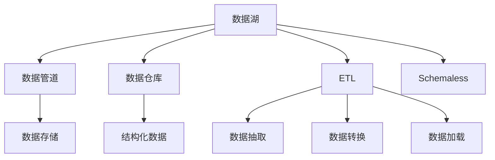

                 

# 数据湖 原理与代码实例讲解

> 关键词：数据湖, 数据存储, 数据处理, 数据管理, 大数据, 数据仓库, 数据管道

## 1. 背景介绍

### 1.1 问题由来
随着数字化转型加速，企业的数据量呈指数级增长。如何高效、安全地存储、处理和分析这些海量数据，成为了摆在众多企业面前的重要挑战。传统的集中式数据仓库难以应对多源异构数据和多模态数据的复杂需求，数据湖（Data Lake）因此应运而生。

数据湖是一种集中式存储环境，可以容纳任意类型、任意格式、任意规模的数据，以支持快速的数据探索、分析和机器学习等应用。与数据仓库不同，数据湖不需要预定义数据模型，允许数据自然生长，以更高的灵活性应对数据的多样性和不确定性。

### 1.2 问题核心关键点
数据湖的核心价值在于其灵活性和适应性，但同时带来了数据一致性、安全性、性能等方面的挑战。如何高效利用数据湖，充分挖掘其潜力，实现数据的有效管理和利用，是当前业界关注的焦点。

## 2. 核心概念与联系

### 2.1 核心概念概述

为更好地理解数据湖的概念及其在实际应用中的工作原理，本节将介绍几个密切相关的核心概念：

- **数据湖（Data Lake）**：一种集中式存储环境，支持任意类型、任意格式、任意规模的数据存储，以支持快速的数据探索、分析和机器学习等应用。

- **数据仓库（Data Warehouse）**：一种集中式存储环境，存储结构化数据，用于支持多维分析、报表生成等业务需求。

- **数据管道（Data Pipeline）**：一种自动化数据传输和处理工具，用于将数据从源头传输到存储、处理和分析环境。

- **ETL（Extract, Transform, Load）**：一种数据集成方法，用于将分散的数据源抽取、转换、加载到数据仓库或数据湖中。

- **Schemaless**：即无模式，指数据湖中存储的数据不需要预定义数据模型，可以自然增长，支持多源异构数据的存储和处理。

这些核心概念之间的逻辑关系可以通过以下Mermaid流程图来展示：



这个流程图展示了大数据生态中各组件之间的关系：

1. 数据湖通过数据管道接收和存储数据。
2. 数据管道负责数据的抽取、转换和加载，将数据传输到数据湖中。
3. 数据湖与数据仓库不同，支持无模式数据存储，无需预定义数据模型。
4. ETL工具负责从各种数据源中抽取数据，并进行转换和加载，确保数据的完整性和一致性。
5. 数据仓库主要存储结构化数据，支持多维分析、报表生成等业务需求。

这些概念共同构成了数据湖的基础，使其能够高效地支持大规模数据存储和处理。

## 3. 核心算法原理 & 具体操作步骤
### 3.1 算法原理概述

数据湖的核心算法原理主要围绕数据的存储、处理和分析展开，其核心目标是实现数据的灵活存储和高效处理。数据湖的实现通常包括以下几个关键步骤：

- **数据存储**：选择合适的存储解决方案，如Hadoop、AWS S3、Google Cloud Storage等，确保数据的可靠性和可扩展性。
- **数据采集**：通过数据管道、API接口、ETL工具等方式，从各种数据源采集数据。
- **数据预处理**：对采集到的数据进行清洗、转换、集成等预处理操作，确保数据的质量和一致性。
- **数据分析**：利用数据湖提供的计算平台，如Apache Spark、AWS EMR等，进行数据的统计分析、机器学习、数据挖掘等操作。
- **数据可视化**：通过数据可视化工具，如图表展示、仪表盘等，直观地呈现数据分析结果。

### 3.2 算法步骤详解

以下是一个典型的数据湖构建流程，包括技术选型、数据采集、数据处理、数据分析和数据可视化的详细步骤：

**Step 1: 选择合适的存储解决方案**
- 根据数据量、数据增长率、数据类型等需求，选择合适的存储解决方案。例如，Hadoop Distributed File System (HDFS)、Amazon S3、Google Cloud Storage等。

**Step 2: 数据采集**
- 确定数据源，包括关系型数据库、非关系型数据库、日志文件、Web应用等。
- 利用ETL工具、API接口等方式，从数据源采集数据，并将其传输到数据湖中。例如，使用Apache NiFi、AWS Glue、Azure Data Factory等工具。

**Step 3: 数据预处理**
- 对采集到的数据进行清洗、转换和集成等预处理操作，确保数据的质量和一致性。
- 使用Python、Spark、Pandas等工具对数据进行去重、填充空值、数据类型转换等处理。

**Step 4: 数据分析**
- 利用数据湖提供的计算平台，如Apache Spark、AWS EMR、Google Cloud Dataproc等，进行数据的统计分析、机器学习、数据挖掘等操作。
- 使用SQL、Python、R等编程语言进行数据处理和分析。例如，使用PySpark、Hive、Presto等工具进行大数据分析。

**Step 5: 数据可视化**
- 通过数据可视化工具，如图表展示、仪表盘等，直观地呈现数据分析结果。
- 使用Tableau、Power BI、Grafana等工具进行数据可视化。

### 3.3 算法优缺点

数据湖的构建方法具有以下优点：
1. **灵活性高**：支持任意类型、任意格式、任意规模的数据存储，适合多源异构数据的存储和处理。
2. **扩展性强**：通过水平扩展存储和计算资源，可以应对海量数据的存储和处理需求。
3. **数据实时性高**：数据湖可以实现数据的实时采集和处理，支持实时分析。

同时，数据湖也存在以下局限性：
1. **数据一致性挑战**：由于数据湖无模式存储，不同数据源的数据格式和结构可能不一致，需要额外的处理工作。
2. **性能瓶颈**：大规模数据的存储和处理可能导致性能瓶颈，需要优化存储和计算资源配置。
3. **数据安全性和隐私保护**：数据湖中的数据可能涉及敏感信息，需要采取严格的数据安全措施，确保数据隐私。

尽管存在这些局限性，但数据湖在数据管理和分析方面具有不可替代的价值，特别是在大数据、云计算和人工智能等领域得到了广泛应用。

### 3.4 算法应用领域

数据湖的应用范围非常广泛，涵盖了企业数据管理、科学研究、互联网应用等多个领域，具体包括：

- **企业数据管理**：在大型企业中，数据湖被广泛应用于数据分析、报表生成、数据仓库管理等场景，帮助企业洞察业务趋势，做出数据驱动的决策。

- **科学研究**：数据湖为科学研究提供了丰富的数据资源，支持数据探索、数据分析和模型训练等科研活动。例如，在生物医学领域，数据湖可用于存储和分析基因组数据、临床数据等。

- **互联网应用**：在互联网应用中，数据湖支持用户行为数据分析、推荐系统构建、个性化广告投放等业务需求。例如，电商平台可以利用数据湖分析用户购买行为，构建推荐系统，提升用户体验。

## 4. 数学模型和公式 & 详细讲解 & 举例说明

### 4.1 数学模型构建

数据湖的核心数学模型构建主要围绕数据的存储、处理和分析展开，其核心目标是实现数据的灵活存储和高效处理。

假设数据湖中存储的数据为 $D$，数据集为 $D_1, D_2, ..., D_n$，其中 $D_i$ 表示第 $i$ 个数据集。数据湖的存储模型可以表示为：

$$
D = \bigcup_{i=1}^{n} D_i
$$

数据湖中的数据预处理模型可以表示为：

$$
\text{PreprocessedData} = \text{Process}(D)
$$

其中 $\text{Process}$ 表示数据预处理函数，可能包括去重、填充空值、数据类型转换等操作。

数据分析模型可以表示为：

$$
\text{AnalysisResult} = \text{Analyze}(\text{PreprocessedData})
$$

其中 $\text{Analyze}$ 表示数据分析函数，可能包括统计分析、机器学习、数据挖掘等操作。

数据可视化的数学模型可以表示为：

$$
\text{VisualizationResult} = \text{Visualize}(\text{AnalysisResult})
$$

其中 $\text{Visualize}$ 表示数据可视化函数，可能包括图表展示、仪表盘等操作。

### 4.2 公式推导过程

以下以一个简单的数据湖案例为例，展示数据湖的核心公式推导过程。

假设数据湖中存储了两个数据集 $D_1$ 和 $D_2$，其中 $D_1$ 包含销售数据，$D_2$ 包含客户信息。对这两个数据集进行预处理，合并为一个数据集 $D$，然后对其进行数据分析和可视化。

**Step 1: 数据存储**
- 将 $D_1$ 和 $D_2$ 存储到数据湖中：
  $$
  D = D_1 \cup D_2
  $$

**Step 2: 数据预处理**
- 对 $D$ 进行预处理，合并销售数据和客户信息，生成预处理后的数据集 $D'$：
  $$
  D' = \text{Process}(D)
  $$

**Step 3: 数据分析**
- 对 $D'$ 进行分析，计算销售数据和客户信息的关联性，生成分析结果 $R$：
  $$
  R = \text{Analyze}(D')
  $$

**Step 4: 数据可视化**
- 对 $R$ 进行可视化，生成可视化结果 $V$：
  $$
  V = \text{Visualize}(R)
  $$

### 4.3 案例分析与讲解

以下以一个实际的销售数据分析案例为例，展示数据湖在企业数据管理中的应用。

假设一家电商平台收集了用户购买记录、产品信息、用户行为等数据，存储在数据湖中。利用数据湖进行销售数据分析和可视化，帮助企业洞察销售趋势，提升销售额。

**Step 1: 数据存储**
- 将用户购买记录、产品信息、用户行为等数据存储到数据湖中。

**Step 2: 数据采集**
- 通过API接口、ETL工具等方式，从数据源采集数据，并将其传输到数据湖中。

**Step 3: 数据预处理**
- 对采集到的数据进行清洗、转换和集成等预处理操作，确保数据的质量和一致性。例如，去除重复记录，填充缺失值，将数据类型转换为统一格式。

**Step 4: 数据分析**
- 利用数据湖提供的计算平台，如Apache Spark、AWS EMR等，进行数据的统计分析、机器学习、数据挖掘等操作。例如，使用Spark进行销售数据的统计分析，发现用户购买行为趋势，构建推荐系统。

**Step 5: 数据可视化**
- 通过数据可视化工具，如图表展示、仪表盘等，直观地呈现数据分析结果。例如，使用Tableau生成销售数据的可视化报表，帮助企业决策。

## 5. 项目实践：代码实例和详细解释说明
### 5.1 开发环境搭建

在进行数据湖构建实践前，我们需要准备好开发环境。以下是使用Hadoop和Spark搭建数据湖环境的流程：

1. 安装Java JDK：从Oracle官网下载并安装Java JDK，确保Hadoop和Spark的依赖库可以正常运行。
2. 安装Hadoop：从Hadoop官网下载并安装Hadoop，配置Hadoop环境变量，确保Hadoop集群正常启动。
3. 安装Spark：从Apache官网下载并安装Spark，配置Spark环境变量，确保Spark集群正常启动。
4. 配置数据管道：安装Apache NiFi或Azure Data Factory等工具，配置数据采集、转换和加载的流程。
5. 安装ETL工具：安装Apache Oozie或Airflow等ETL工具，配置ETL任务，自动化数据采集和处理流程。

完成上述步骤后，即可在Hadoop和Spark环境中开始数据湖构建实践。

### 5.2 源代码详细实现

下面我们以一个简单的数据湖构建项目为例，展示使用Hadoop和Spark进行数据湖构建的Python代码实现。

首先，创建Hadoop集群，并在Hadoop中创建数据目录：

```python
import os

# 创建Hadoop数据目录
data_dir = "/user/hadoop/data"
os.makedirs(data_dir, exist_ok=True)
```

然后，使用Spark编写数据采集和预处理代码：

```python
from pyspark.sql import SparkSession

# 创建Spark会话
spark = SparkSession.builder.appName("DataLake").getOrCreate()

# 加载数据源
sales_data = spark.read.csv("hdfs://" + data_dir + "/sales_data.csv", header=True, inferSchema=True)
customer_data = spark.read.csv("hdfs://" + data_dir + "/customer_data.csv", header=True, inferSchema=True)

# 数据预处理
# 去除重复记录
sales_data = sales_data.drop_duplicates()
customer_data = customer_data.drop_duplicates()

# 合并数据集
merged_data = sales_data.join(customer_data, on="customer_id")
merged_data.show()
```

接着，使用Spark进行数据分析和可视化：

```python
# 数据分析
from pyspark.sql.functions import col, when

# 计算销售数据和客户信息的关联性
relation = merged_data.withColumn("relation", when(col("sales_amount") > 0, "Buyer").otherwise("Seller"))
relation.show()

# 数据可视化
# 使用Tableau或其他可视化工具进行数据展示
```

### 5.3 代码解读与分析

让我们再详细解读一下关键代码的实现细节：

**数据存储**：
- 在Hadoop中创建数据目录，用于存储数据集。
- 使用Spark的read方法加载数据集，并将其存储在Hadoop中。

**数据预处理**：
- 对数据集进行去重操作，确保数据的唯一性。
- 使用Spark的join方法将销售数据和客户数据进行合并，生成一个数据集。

**数据分析**：
- 利用SQL或Python代码对合并后的数据集进行分析，计算销售数据和客户信息的关联性。例如，使用when函数计算每个客户的购买关系。
- 将分析结果保存到Hadoop中，供后续可视化使用。

**数据可视化**：
- 使用Tableau或其他可视化工具将分析结果进行可视化展示。

可以看到，通过Hadoop和Spark的协作，数据湖的构建过程变得非常简单和高效。开发者可以将更多精力放在数据处理和分析上，而不必过多关注底层的技术实现细节。

## 6. 实际应用场景

### 6.1 企业数据管理

数据湖在企业数据管理中的应用非常广泛，帮助企业洞察业务趋势，优化决策过程。例如，利用数据湖进行销售数据分析，可以发现客户流失原因，优化客户关系管理，提升销售额。

### 6.2 科学研究

数据湖为科学研究提供了丰富的数据资源，支持数据探索、数据分析和模型训练等科研活动。例如，在生物医学领域，数据湖可用于存储和分析基因组数据、临床数据等。

### 6.3 互联网应用

在互联网应用中，数据湖支持用户行为数据分析、推荐系统构建、个性化广告投放等业务需求。例如，电商平台可以利用数据湖分析用户购买行为，构建推荐系统，提升用户体验。

### 6.4 未来应用展望

随着数据湖技术的发展，未来其在各个领域的应用将更加广泛和深入。例如：

- **物联网（IoT）领域**：数据湖可以存储和管理海量物联网设备生成的数据，支持实时数据分析和决策。
- **金融领域**：数据湖可以存储和管理金融交易数据，支持高频交易分析、风险评估等业务需求。
- **医疗领域**：数据湖可以存储和管理医疗数据，支持个性化医疗方案的生成和推荐。

## 7. 工具和资源推荐
### 7.1 学习资源推荐

为了帮助开发者系统掌握数据湖的技术基础和实践技巧，这里推荐一些优质的学习资源：

1. **Hadoop官方文档**：Hadoop官网提供的官方文档，详细介绍了Hadoop的安装、配置和使用方法。
2. **Spark官方文档**：Apache Spark官网提供的官方文档，详细介绍了Spark的安装、配置和使用方法。
3. **《Hadoop: The Definitive Guide》**：Hadoop领域权威教材，详细介绍了Hadoop的核心概念和实践技巧。
4. **《Spark: The Definitive Guide》**：Spark领域权威教材，详细介绍了Spark的核心概念和实践技巧。
5. **Kaggle官方课程**：Kaggle提供的大量数据湖相关课程，涵盖数据采集、数据预处理、数据分析和数据可视化等环节。

通过对这些资源的学习实践，相信你一定能够快速掌握数据湖的核心技术和应用方法，并用于解决实际的业务问题。

### 7.2 开发工具推荐

高效的开发离不开优秀的工具支持。以下是几款用于数据湖开发的常用工具：

1. **Hadoop和Spark**：开源分布式计算框架，支持大规模数据存储和处理。
2. **Apache NiFi**：开源数据管道工具，支持数据采集、转换和加载等流程自动化。
3. **Apache Oozie**：开源工作流调度工具，支持ETL任务的自动化执行。
4. **Tableau**：数据可视化工具，支持多维度数据分析和结果展示。
5. **Power BI**：微软提供的数据可视化工具，支持多维度数据分析和实时数据刷新。
6. **Grafana**：开源数据可视化工具，支持多维度数据分析和仪表盘展示。

合理利用这些工具，可以显著提升数据湖构建的开发效率，加快创新迭代的步伐。

### 7.3 相关论文推荐

数据湖技术的发展源于学界的持续研究。以下是几篇奠基性的相关论文，推荐阅读：

1. **《Data Lakes: Capturing and Querying Non-Relational Data》**：IEEE论文，详细介绍了数据湖的概念和应用。
2. **《Big Data Processing: Data Lakes and Data Warehouses》**：Springer论文，详细介绍了数据湖和数据仓库的区别和应用。
3. **《Data Lake Architecture for a Data-Driven Organization》**：IEEE论文，详细介绍了数据湖架构设计和实现方法。
4. **《Data Lake: From Idea to Reality》**：IEEE论文，详细介绍了数据湖技术的实现和应用案例。

这些论文代表了大数据技术的发展脉络。通过学习这些前沿成果，可以帮助研究者把握学科前进方向，激发更多的创新灵感。

## 8. 总结：未来发展趋势与挑战

### 8.1 总结

本文对数据湖的概念及其在实际应用中的工作原理进行了全面系统的介绍。首先阐述了数据湖的基本概念和其对企业数据管理、科学研究、互联网应用等多个领域的价值。其次，从原理到实践，详细讲解了数据湖的构建过程和关键步骤，给出了数据湖构建的完整代码实例。同时，本文还广泛探讨了数据湖在各个领域的应用前景，展示了数据湖技术的广阔前景。

通过本文的系统梳理，可以看到，数据湖在数据管理和分析方面具有不可替代的价值，特别是在大数据、云计算和人工智能等领域得到了广泛应用。未来，伴随数据湖技术的发展和优化，其应用范围将进一步拓展，为各行各业带来更高效、更灵活的数据处理和分析能力。

### 8.2 未来发展趋势

展望未来，数据湖技术将呈现以下几个发展趋势：

1. **云化**：随着云计算技术的发展，越来越多的企业将数据湖部署在云平台上，享受云平台的高可靠性和高扩展性。例如，AWS Lake Formation、Azure Data Lake、Google Cloud Data Lake等云平台提供了强大的数据湖服务。
2. **智能化**：利用机器学习和人工智能技术，提升数据湖的智能化水平，实现自动化数据分析和知识发现。例如，利用AI算法自动发现数据中的关联关系，生成业务洞察。
3. **可视化**：数据湖的可视化能力将进一步提升，支持更丰富的数据展示和探索方式。例如，利用增强现实（AR）和虚拟现实（VR）技术，生成沉浸式的数据可视化体验。
4. **边缘计算**：数据湖将扩展到边缘计算环境中，支持实时数据采集和分析。例如，在物联网（IoT）领域，数据湖可以在边缘设备上进行实时数据存储和处理。
5. **异构数据整合**：数据湖将支持更多异构数据源的整合，实现跨平台、跨数据库的数据集成和分析。例如，支持JSON、XML、CSV等多种数据格式的存储和处理。

以上趋势凸显了数据湖技术的广阔前景。这些方向的探索发展，必将进一步提升数据湖的灵活性和应用范围，为各行各业带来更高效、更灵活的数据处理和分析能力。

### 8.3 面临的挑战

尽管数据湖技术已经取得了瞩目成就，但在迈向更加智能化、普适化应用的过程中，它仍面临着诸多挑战：

1. **数据一致性**：数据湖中的数据可能来自多个异构数据源，不同数据源的数据格式和结构可能不一致，需要进行数据清洗和转换。
2. **性能瓶颈**：大规模数据的存储和处理可能导致性能瓶颈，需要优化存储和计算资源配置。
3. **数据安全性和隐私保护**：数据湖中的数据可能涉及敏感信息，需要采取严格的数据安全措施，确保数据隐私。
4. **数据治理**：数据湖中的数据可能杂乱无章，需要进行数据治理，确保数据的质量和一致性。
5. **技术复杂度**：数据湖的搭建和维护需要较高的技术门槛，需要专业的数据科学家和工程师支持。

尽管存在这些挑战，但随着技术的不断进步和优化，数据湖在数据管理和分析方面将发挥越来越重要的作用，为各行各业带来更高效、更灵活的数据处理和分析能力。

### 8.4 研究展望

面对数据湖技术所面临的挑战，未来的研究需要在以下几个方面寻求新的突破：

1. **自动化数据治理**：开发自动化的数据治理工具，自动识别数据源、数据格式和数据结构，自动进行数据清洗和转换，确保数据的一致性和质量。
2. **数据湖联邦化**：利用联邦学习技术，实现跨数据湖的数据联合分析，支持大规模分布式数据分析。
3. **数据湖容器化**：将数据湖部署在容器化环境中，提高数据湖的弹性和可扩展性，支持更多的异构数据源。
4. **边缘计算与数据湖结合**：利用边缘计算技术，实现数据湖的实时数据采集和处理，支持实时数据分析和决策。
5. **数据湖与人工智能结合**：利用机器学习和人工智能技术，提升数据湖的智能化水平，实现自动化数据分析和知识发现。

这些研究方向将进一步推动数据湖技术的发展和优化，为各行各业带来更高效、更灵活的数据处理和分析能力。相信随着技术的不断进步和优化，数据湖技术必将在构建人机协同的智能时代中扮演越来越重要的角色。

## 9. 附录：常见问题与解答

**Q1: 数据湖和数据仓库有什么区别？**

A: 数据湖和数据仓库都是集中式存储环境，但二者的设计理念和应用场景有所不同。数据仓库主要存储结构化数据，支持多维分析、报表生成等业务需求，适用于需要快速查询和报表生成的场景。数据湖支持任意类型、任意格式、任意规模的数据存储，支持数据探索、数据分析和机器学习等应用，适用于需要数据灵活性、多源异构数据存储和处理的场景。

**Q2: 数据湖的优缺点是什么？**

A: 数据湖的优点包括：
1. **灵活性高**：支持任意类型、任意格式、任意规模的数据存储，适合多源异构数据的存储和处理。
2. **扩展性强**：通过水平扩展存储和计算资源，可以应对海量数据的存储和处理需求。
3. **数据实时性高**：数据湖可以实现数据的实时采集和处理，支持实时分析。

数据湖的缺点包括：
1. **数据一致性挑战**：由于数据湖无模式存储，不同数据源的数据格式和结构可能不一致，需要额外的处理工作。
2. **性能瓶颈**：大规模数据的存储和处理可能导致性能瓶颈，需要优化存储和计算资源配置。
3. **数据安全性和隐私保护**：数据湖中的数据可能涉及敏感信息，需要采取严格的数据安全措施，确保数据隐私。

尽管存在这些局限性，但数据湖在数据管理和分析方面具有不可替代的价值，特别是在大数据、云计算和人工智能等领域得到了广泛应用。

**Q3: 如何构建高效的数据湖？**

A: 构建高效的数据湖需要考虑多个方面，包括数据存储、数据采集、数据预处理、数据分析和数据可视化等环节。以下是一些关键步骤：
1. 选择合适的存储解决方案，如Hadoop、AWS S3、Google Cloud Storage等。
2. 利用ETL工具、API接口等方式，从各种数据源采集数据。
3. 对采集到的数据进行清洗、转换和集成等预处理操作，确保数据的质量和一致性。
4. 利用计算平台，如Apache Spark、AWS EMR等，进行数据的统计分析、机器学习、数据挖掘等操作。
5. 使用数据可视化工具，如图表展示、仪表盘等，直观地呈现数据分析结果。

通过以上步骤，可以构建高效的数据湖，支持数据探索、数据分析和机器学习等应用。

---

作者：禅与计算机程序设计艺术 / Zen and the Art of Computer Programming

