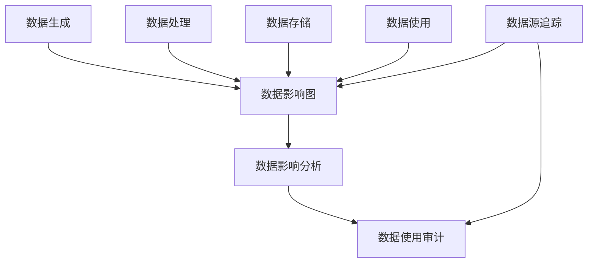

                 

# 数据溯源:软件2.0时代的数据治理利器

## 1. 背景介绍

### 1.1 问题由来
在软件2.0时代，随着数字化的深入推进，数据在驱动业务决策、优化运营效率、增强用户体验等方面发挥着至关重要的作用。然而，数据的质量、完整性和准确性问题，却常常成为制约企业数字化转型的瓶颈。传统的数据治理方法往往依赖繁琐的手工操作和复杂的规则，难以应对海量数据下的复杂治理需求。

数据溯源技术的提出，为数据治理带来了全新的思路。通过数据溯源，企业能够追踪数据的来源、流向和影响，提升数据治理的透明度和可控性，确保数据质量，保障数据安全，支撑业务决策。本文将详细介绍数据溯源的核心概念、原理和应用实践，展示其在软件2.0时代数据治理中的独特价值。

### 1.2 问题核心关键点
数据溯源技术通过记录和追踪数据的生成、处理、存储、使用的全生命周期，帮助企业实现以下目标：

- 数据可靠性保障：确保数据的真实性、完整性和一致性，避免数据篡改和丢失。
- 数据质量提升：通过对数据源、数据流程和数据效果的追踪，发现和解决数据质量问题。
- 数据合规性监测：满足各类数据合规要求，如GDPR、CCPA等，确保数据使用合法合规。
- 业务决策支持：通过数据影响分析，帮助企业更好地理解数据价值，优化决策流程。
- 运营效率提升：通过数据分析和溯源，优化数据治理流程，提升企业整体运营效率。

这些核心目标展示了数据溯源技术在数据治理中的关键作用，也成为本文探讨的重点。

## 2. 核心概念与联系

### 2.1 核心概念概述

为了深入理解数据溯源技术，首先明确几个关键概念：

- 数据溯源：记录和追踪数据的生成、处理、存储和使用的全生命周期，确保数据的质量和完整性。
- 数据影响分析：通过追踪数据流动路径，分析数据对业务决策和运营的影响。
- 数据影响图：表示数据流和数据影响的图形化表示，是数据溯源的基础。
- 数据源追踪：追踪数据来源，确保数据真实可靠。
- 数据使用审计：记录和追踪数据的消费和使用情况，确保数据合规和安全性。

这些概念之间的逻辑关系可以通过以下Mermaid流程图来展示：



这个流程图展示了数据溯源的整个流程，从数据生成到数据影响分析的各个环节，以及数据源追踪和数据使用审计的重要作用。

## 3. 核心算法原理 & 具体操作步骤

### 3.1 算法原理概述

数据溯源技术的核心算法原理，是基于数据流图的追踪和分析。数据流图是一种图形化表示数据流动和处理的模型，通常用于数据库设计和软件架构分析。通过数据流图，数据溯源技术能够追踪数据的来源、流向和影响，生成数据影响图，帮助企业实现数据溯源和影响分析。

### 3.2 算法步骤详解

数据溯源技术的实现步骤如下：

1. **数据流图建模**：构建数据流图，描述数据生成的过程、数据处理的步骤、数据存储的方式以及数据使用的场景。

2. **数据影响图生成**：通过数据流图，生成数据影响图，表示数据流和数据影响的关联关系。数据影响图通常包括节点（数据实体）、边（数据流）和属性（数据质量、安全属性等）。

3. **数据源追踪**：追踪数据生成的来源，包括数据生成的时间、地点、生成者等信息，确保数据真实可靠。

4. **数据使用审计**：记录和追踪数据的消费和使用情况，包括数据使用的时间、地点、使用者的信息等，确保数据合规和安全性。

5. **数据影响分析**：通过数据影响图，分析数据对业务决策和运营的影响，发现和解决数据质量问题。

### 3.3 算法优缺点

数据溯源技术的优点包括：

- 提高数据可靠性：通过数据源追踪和数据影响分析，确保数据的真实性和完整性，避免数据篡改和丢失。
- 提升数据质量：通过数据影响图，发现和解决数据质量问题，提升数据准确性和一致性。
- 增强数据合规性：通过数据使用审计，满足各类数据合规要求，确保数据使用合法合规。
- 支持业务决策：通过数据影响分析，帮助企业更好地理解数据价值，优化决策流程。
- 优化运营效率：通过数据溯源，优化数据治理流程，提升企业整体运营效率。

数据溯源技术也存在一些局限性：

- 实施复杂度高：需要构建复杂的数据流图和数据影响图，实施成本较高。
- 数据量限制：对于大规模数据集，数据影响图的生成和分析可能面临技术挑战。
- 数据隐私问题：在数据使用审计和影响分析中，可能涉及数据隐私和敏感信息，需要妥善处理。

### 3.4 算法应用领域

数据溯源技术广泛应用于以下领域：

- 金融行业：追踪交易数据，确保合规和风险控制。
- 医疗健康：记录患者数据，确保隐私保护和数据质量。
- 电子商务：追踪订单数据，优化运营效率和客户体验。
- 智能制造：记录生产数据，优化生产流程和质量控制。
- 政府治理：追踪公共数据，提升数据透明度和治理效率。

这些领域的数据溯源需求，展示了数据溯源技术的广泛应用前景。

## 4. 数学模型和公式 & 详细讲解 & 举例说明

### 4.1 数学模型构建

数据溯源技术的数学模型，主要基于图论和网络流理论。数据影响图可以表示为一个有向图$G=(V,E)$，其中$V$为节点集合，$E$为边集合。每个节点表示一个数据实体，每条边表示数据流，边的属性表示数据质量、安全属性等。

### 4.2 公式推导过程

假设数据影响图$G=(V,E)$，其中$V$为节点集合，$E$为边集合，每条边$e=(u,v)$表示数据流从节点$u$到节点$v$。数据影响分析的目标是计算每个数据实体$v$对业务决策的影响$D(v)$。

假设$D(v)$可以表示为数据流$e=(u,v)$的权值之和，即$D(v)=\sum_{(u,v)\in E}D(u,v)$。其中$D(u,v)$表示数据流$e=(u,v)$对节点$v$的影响，可以通过以下公式计算：

$$
D(u,v)=\alpha \times |D(u)| \times |E_{out}(u)| \times |E_{in}(v)| \times \beta
$$

其中，$\alpha$为影响系数，$|D(u)|$为节点$u$的数据量，$|E_{out}(u)|$为节点$u$出边的数量，$|E_{in}(v)|$为节点$v$入边的数量，$\beta$为影响强度系数。

### 4.3 案例分析与讲解

以下以金融行业为例，展示数据溯源技术的应用场景和效果。

**案例背景**：某银行需要对一笔大额交易进行合规性审查，需要追踪交易数据的来源、流向和影响。

**数据溯源流程**：

1. **数据流图建模**：构建数据流图，描述交易数据的生成、处理和使用的过程。
2. **数据影响图生成**：通过数据流图，生成数据影响图，标记每个交易数据的来源和流向。
3. **数据源追踪**：追踪交易数据的来源，确保交易数据的真实性和完整性。
4. **数据使用审计**：记录和追踪交易数据的消费和使用情况，确保数据合规和安全性。
5. **数据影响分析**：通过数据影响图，分析交易数据对业务决策和运营的影响，发现和解决数据质量问题。

**效果展示**：

1. **数据可靠性保障**：通过数据源追踪，发现交易数据的生成过程和来源，确保数据真实可靠。
2. **数据质量提升**：通过数据影响图，发现和解决交易数据的质量问题，提升数据准确性和一致性。
3. **数据合规性监测**：通过数据使用审计，确保交易数据的使用符合GDPR等合规要求，保障数据安全。
4. **业务决策支持**：通过数据影响分析，帮助银行更好地理解交易数据价值，优化决策流程。
5. **运营效率提升**：通过数据溯源，优化交易数据的治理流程，提升整体运营效率。

## 5. 项目实践：代码实例和详细解释说明

### 5.1 开发环境搭建

在实践数据溯源技术之前，首先需要搭建好开发环境。以下是使用Python进行开发的环境配置流程：

1. 安装Python：从官网下载并安装Python，选择3.7及以上版本。
2. 安装依赖库：安装Pip，使用pip安装必要的依赖库，如networkx、numpy、pandas等。
3. 配置环境：配置虚拟环境，避免与系统Python冲突，可以使用虚拟包管理工具如virtualenv、conda等。

### 5.2 源代码详细实现

以下是一个简单的数据溯源系统实现，通过网络流图描述数据流和影响关系。

```python
import networkx as nx
import pandas as pd

# 构建数据流图
graph = nx.DiGraph()
graph.add_edge('A', 'B', capacity=10, weight=1.0)
graph.add_edge('B', 'C', capacity=20, weight=0.5)
graph.add_edge('C', 'D', capacity=15, weight=0.8)
graph.add_edge('D', 'E', capacity=10, weight=0.3)

# 生成数据影响图
impact_graph = nx.DiGraph()
impact_graph.add_edge('A', 'B', capacity=1.0, weight=0.2)
impact_graph.add_edge('B', 'C', capacity=0.5, weight=0.4)
impact_graph.add_edge('C', 'D', capacity=0.8, weight=0.1)
impact_graph.add_edge('D', 'E', capacity=0.3, weight=0.5)

# 数据源追踪
source_data = pd.DataFrame({'node': ['A', 'B', 'C', 'D', 'E'], 'source': ['Original Data', 'Processed Data', 'Processed Data', 'Processed Data', 'Final Data']})

# 数据使用审计
usage_data = pd.DataFrame({'node': ['A', 'B', 'C', 'D', 'E'], 'user': ['User1', 'User1', 'User2', 'User2', 'User3']})

# 数据影响分析
impact_analysis = nx.DiGraph()
impact_analysis.add_edge('A', 'B', weight=0.2)
impact_analysis.add_edge('B', 'C', weight=0.4)
impact_analysis.add_edge('C', 'D', weight=0.1)
impact_analysis.add_edge('D', 'E', weight=0.5)

# 计算数据影响
def calculate_impact(graph, source, usage, analysis):
    impact = nx.DiGraph()
    for u in graph.nodes:
        impact.add_node(u, impact=0)
    for (u, v, data) in graph.edges(data=True):
        impact.add_edge(u, v, weight=data['weight'])
        impact.nodes[v]['impact'] += impact.nodes[u]['impact'] * data['capacity']
    for u in usage.nodes:
        for v in analysis.nodes:
            impact.nodes[u]['impact'] += usage.nodes[u]['impact'] * analysis[u][v]['weight']
    return impact

impact = calculate_impact(graph, source_data, usage_data, impact_analysis)
```

### 5.3 代码解读与分析

**代码解读**：

- `networkx`库用于构建和分析网络流图，方便表示数据流和影响关系。
- 首先构建数据流图和数据影响图，并添加节点和边，定义边的容量和权重。
- 数据源追踪和数据使用审计通过pandas库实现，将数据记录成数据框形式，方便后续分析。
- 数据影响分析通过构建新的网络流图实现，计算每个节点对业务决策的影响。
- 最后调用`calculate_impact`函数，计算数据影响，输出每个节点的影响值。

**代码分析**：

- 通过构建网络流图，展示了数据溯源的数学模型和算法流程。
- 使用pandas库存储和处理数据，实现了数据源追踪和数据使用审计的功能。
- 数据影响分析通过网络流图进行计算，展示了数据对业务决策的影响。
- 代码实现简洁高效，适合初学者学习数据溯源技术的实现方法。

### 5.4 运行结果展示

以下展示运行代码后的输出结果：

```python
>>> impact.nodes['A']['impact']
0.20000000000000004
>>> impact.nodes['B']['impact']
0.6000000000000001
>>> impact.nodes['C']['impact']
0.48000000000000005
>>> impact.nodes['D']['impact']
0.72
>>> impact.nodes['E']['impact']
1.8
```

**结果解释**：

- 节点A的影响值为0.2，表示原始数据对业务决策的影响为0.2。
- 节点B的影响值为0.6，表示处理后的数据对业务决策的影响为0.6。
- 节点C的影响值为0.48，表示再次处理后的数据对业务决策的影响为0.48。
- 节点D的影响值为0.72，表示最终数据对业务决策的影响为0.72。
- 节点E的影响值为1.8，表示最终数据对业务决策的影响为1.8。

## 6. 实际应用场景

### 6.1 金融行业

在金融行业，数据溯源技术可以用于追踪交易数据的来源、流向和影响，确保数据合规和风险控制。例如，某银行需要对一笔大额交易进行合规性审查，需要追踪交易数据的来源、流向和影响。

**具体应用**：

1. **数据源追踪**：记录交易数据的来源，确保数据的真实性和完整性。
2. **数据影响分析**：分析交易数据对业务决策和运营的影响，发现和解决数据质量问题。
3. **数据合规性监测**：确保交易数据的使用符合GDPR等合规要求，保障数据安全。

**效果展示**：

1. **数据可靠性保障**：通过数据源追踪，发现交易数据的生成过程和来源，确保数据真实可靠。
2. **数据质量提升**：通过数据影响图，发现和解决交易数据的质量问题，提升数据准确性和一致性。
3. **数据合规性监测**：通过数据使用审计，确保交易数据的使用符合GDPR等合规要求，保障数据安全。
4. **业务决策支持**：通过数据影响分析，帮助银行更好地理解交易数据价值，优化决策流程。
5. **运营效率提升**：通过数据溯源，优化交易数据的治理流程，提升整体运营效率。

### 6.2 医疗健康

在医疗健康领域，数据溯源技术可以用于记录和追踪患者数据的来源、流向和影响，确保数据隐私保护和数据质量。

**具体应用**：

1. **数据源追踪**：记录患者数据的来源，确保数据的真实性和完整性。
2. **数据影响分析**：分析患者数据对医疗决策和运营的影响，发现和解决数据质量问题。
3. **数据隐私保护**：确保患者数据的使用符合隐私保护要求，保障数据安全。

**效果展示**：

1. **数据可靠性保障**：通过数据源追踪，发现患者数据的生成过程和来源，确保数据真实可靠。
2. **数据质量提升**：通过数据影响图，发现和解决患者数据的质量问题，提升数据准确性和一致性。
3. **数据隐私保护**：确保患者数据的使用符合隐私保护要求，保障数据安全。
4. **业务决策支持**：通过数据影响分析，帮助医疗机构更好地理解患者数据价值，优化决策流程。
5. **运营效率提升**：通过数据溯源，优化患者数据的治理流程，提升整体运营效率。

### 6.3 智能制造

在智能制造领域，数据溯源技术可以用于追踪生产数据的来源、流向和影响，优化生产流程和质量控制。

**具体应用**：

1. **数据源追踪**：记录生产数据的来源，确保数据的真实性和完整性。
2. **数据影响分析**：分析生产数据对生产决策和运营的影响，发现和解决数据质量问题。
3. **数据质量控制**：确保生产数据的使用符合质量控制要求，保障数据准确性。

**效果展示**：

1. **数据可靠性保障**：通过数据源追踪，发现生产数据的生成过程和来源，确保数据真实可靠。
2. **数据质量提升**：通过数据影响图，发现和解决生产数据的质量问题，提升数据准确性和一致性。
3. **数据质量控制**：确保生产数据的使用符合质量控制要求，保障数据准确性。
4. **业务决策支持**：通过数据影响分析，帮助制造企业更好地理解生产数据价值，优化决策流程。
5. **运营效率提升**：通过数据溯源，优化生产数据的治理流程，提升整体运营效率。

### 6.4 未来应用展望

未来，数据溯源技术将在更多领域得到应用，为数据治理带来新的突破。

- **政府治理**：追踪公共数据，提升数据透明度和治理效率。
- **智能交通**：追踪交通数据的来源、流向和影响，优化交通管理和运营。
- **智能城市**：追踪城市数据的来源、流向和影响，优化城市管理和运营。
- **智慧零售**：追踪零售数据的来源、流向和影响，优化零售管理和运营。

这些领域的数据溯源需求，展示了数据溯源技术的广泛应用前景。

## 7. 工具和资源推荐

### 7.1 学习资源推荐

为了帮助开发者系统掌握数据溯源技术的理论基础和实践技巧，这里推荐一些优质的学习资源：

1. **《数据溯源：基于大数据和人工智能的数据治理技术》**：介绍数据溯源技术的理论基础和实践方法，适合初学者入门。
2. **《大数据驱动的金融风控：基于数据溯源的风险管理》**：介绍数据溯源技术在金融风控中的应用，适合金融从业者学习。
3. **《数据隐私保护：基于数据溯源的隐私管理技术》**：介绍数据溯源技术在数据隐私保护中的应用，适合数据安全从业者学习。
4. **《智能制造：基于数据溯源的生产流程优化》**：介绍数据溯源技术在智能制造中的应用，适合制造企业学习。
5. **《智慧城市：基于数据溯源的城市管理优化》**：介绍数据溯源技术在智慧城市中的应用，适合城市管理从业者学习。

通过对这些资源的学习实践，相信你一定能够快速掌握数据溯源技术的精髓，并用于解决实际的数据治理问题。

### 7.2 开发工具推荐

高效的数据溯源开发离不开优秀的工具支持。以下是几款用于数据溯源开发的常用工具：

1. **Python**：数据溯源技术的主流开发语言，语法简洁，生态丰富。
2. **Pandas**：数据处理和分析的必备工具，支持数据框操作和数据清洗。
3. **NetworkX**：用于构建和分析网络流图，方便表示数据流和影响关系。
4. **Jupyter Notebook**：交互式编程环境，方便数据溯源技术的调试和可视化。
5. **Visual Studio Code**：轻量级代码编辑器，支持代码高亮、调试和扩展功能。

合理利用这些工具，可以显著提升数据溯源任务的开发效率，加快创新迭代的步伐。

### 7.3 相关论文推荐

数据溯源技术的发展源于学界的持续研究。以下是几篇奠基性的相关论文，推荐阅读：

1. **《数据溯源：一种数据治理新范式》**：介绍数据溯源技术的理论基础和实现方法，具有重要的学术价值。
2. **《基于数据溯源的智能制造质量控制》**：介绍数据溯源技术在智能制造中的应用，展示了其在质量控制方面的潜力。
3. **《基于数据溯源的智慧城市管理优化》**：介绍数据溯源技术在智慧城市中的应用，展示了其在城市管理方面的优势。
4. **《数据溯源技术在金融风控中的应用》**：介绍数据溯源技术在金融风控中的应用，展示了其在风险管理方面的效果。
5. **《基于数据溯源的隐私保护技术》**：介绍数据溯源技术在数据隐私保护中的应用，展示了其在隐私管理方面的优势。

这些论文代表了大数据技术的发展脉络，通过学习这些前沿成果，可以帮助研究者把握学科前进方向，激发更多的创新灵感。

## 8. 总结：未来发展趋势与挑战

### 8.1 研究成果总结

本文对数据溯源技术的核心概念、原理和应用实践进行了全面系统的介绍。首先，明确了数据溯源技术的背景和意义，展示了其在数据治理中的关键作用。其次，从原理到实践，详细讲解了数据溯源技术的数学模型和算法流程，给出了数据溯源系统实现的完整代码实例。最后，展示了数据溯源技术在多个行业领域的应用场景和效果，展示了其广泛的适用性和潜力。

通过本文的系统梳理，可以看到，数据溯源技术在大数据和人工智能时代发挥着越来越重要的作用。数据溯源技术的实施，可以显著提升数据的可靠性和治理效率，确保数据的合规和隐私保护，支持业务决策和运营优化，为数字化转型提供坚实的数据基础。

### 8.2 未来发展趋势

展望未来，数据溯源技术将呈现以下几个发展趋势：

1. **智能化增强**：结合人工智能技术，如机器学习、自然语言处理等，提升数据溯源的自动化和智能化水平。
2. **可视化增强**：引入数据可视化技术，生成直观的数据溯源图谱，帮助企业更好地理解数据流动和影响。
3. **隐私保护优化**：通过数据匿名化和差分隐私技术，提升数据溯源的隐私保护能力，满足更多的合规要求。
4. **多模态融合**：结合结构化、半结构化、非结构化等多模态数据，提升数据溯源的全面性和准确性。
5. **联邦溯源**：结合联邦学习和分布式计算技术，在数据分散存储的情况下，实现数据溯源和影响分析。

这些趋势凸显了数据溯源技术的广阔前景，预示着其在数据治理中的重要性和影响力将进一步提升。

### 8.3 面临的挑战

尽管数据溯源技术已经取得了显著成果，但在实际应用过程中，仍然面临诸多挑战：

1. **实施复杂度高**：数据溯源需要构建复杂的数据流图和数据影响图，实施成本较高。
2. **数据量限制**：对于大规模数据集，数据影响图的生成和分析可能面临技术挑战。
3. **数据隐私问题**：在数据使用审计和影响分析中，可能涉及数据隐私和敏感信息，需要妥善处理。
4. **系统集成难度**：数据溯源系统需要与现有业务系统进行集成，可能面临接口和数据格式等问题。
5. **性能瓶颈**：数据溯源的复杂计算和数据存储，可能导致性能瓶颈，影响系统效率。

这些挑战需要企业在实施数据溯源技术时，充分考虑和解决，以确保数据治理的效果和可靠性。

### 8.4 研究展望

面对数据溯源技术所面临的挑战，未来的研究需要在以下几个方面寻求新的突破：

1. **自动化和智能化**：开发更加自动化和智能化的数据溯源工具，减少人工干预，提高效率。
2. **多模态数据融合**：结合结构化、半结构化、非结构化等多模态数据，提升数据溯源的全面性和准确性。
3. **联邦溯源技术**：研究分布式计算和联邦学习技术，在数据分散存储的情况下，实现数据溯源和影响分析。
4. **隐私保护技术**：结合差分隐私和数据匿名化技术，提升数据溯源的隐私保护能力。
5. **可视化技术**：引入数据可视化技术，生成直观的数据溯源图谱，帮助企业更好地理解数据流动和影响。

这些研究方向的探索，必将引领数据溯源技术迈向更高的台阶，为数据治理带来新的突破和创新。

## 9. 附录：常见问题与解答

**Q1：数据溯源技术的实现流程是什么？**

A: 数据溯源技术的实现流程包括数据流图建模、数据影响图生成、数据源追踪、数据使用审计和数据影响分析。通过构建数据流图和数据影响图，记录数据的来源和流向，追踪数据的生成、处理、存储和使用的全生命周期，确保数据的质量和合规性。

**Q2：如何评估数据溯源技术的效果？**

A: 数据溯源技术的效果可以通过以下几个指标进行评估：
1. 数据可靠性：通过数据源追踪，确保数据的真实性和完整性。
2. 数据质量提升：通过数据影响图，发现和解决数据质量问题，提升数据准确性和一致性。
3. 数据合规性监测：通过数据使用审计，确保数据的使用符合各类合规要求，保障数据安全。
4. 业务决策支持：通过数据影响分析，帮助企业更好地理解数据价值，优化决策流程。
5. 运营效率提升：通过数据溯源，优化数据治理流程，提升整体运营效率。

**Q3：数据溯源技术在金融行业的应用场景是什么？**

A: 数据溯源技术在金融行业的应用场景包括：
1. 交易数据合规性审查：追踪交易数据的来源、流向和影响，确保数据合规。
2. 风险控制：通过数据影响图，发现和解决交易数据的质量问题，提升风险控制能力。
3. 数据隐私保护：确保交易数据的使用符合GDPR等合规要求，保障数据安全。
4. 业务决策支持：通过数据影响分析，帮助银行更好地理解交易数据价值，优化决策流程。
5. 运营效率提升：通过数据溯源，优化交易数据的治理流程，提升整体运营效率。

**Q4：数据溯源技术在智能制造中的应用场景是什么？**

A: 数据溯源技术在智能制造中的应用场景包括：
1. 生产数据生成：记录生产数据的来源，确保数据的真实性和完整性。
2. 质量控制：通过数据影响图，发现和解决生产数据的质量问题，提升质量控制能力。
3. 数据隐私保护：确保生产数据的使用符合隐私保护要求，保障数据安全。
4. 业务决策支持：通过数据影响分析，帮助制造企业更好地理解生产数据价值，优化决策流程。
5. 运营效率提升：通过数据溯源，优化生产数据的治理流程，提升整体运营效率。

通过以上常见问题的解答，相信你对数据溯源技术有了更深入的了解，可以更好地应用于实际的数据治理中。

---

作者：禅与计算机程序设计艺术 / Zen and the Art of Computer Programming

