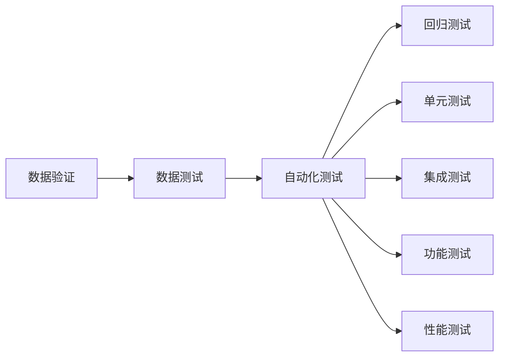

                 

# 数据验证与数据测试原理与代码实战案例讲解

> 关键词：数据验证, 数据测试, 自动化测试, 回归测试, 单元测试, 集成测试, 功能测试, 性能测试

## 1. 背景介绍

在软件开发过程中，数据验证和测试是确保应用程序质量的关键环节。数据验证指确保输入数据符合预期，防止程序在处理不良输入时出现异常行为。数据测试则是指通过一系列测试用例，确保应用程序对各种输入数据的处理都能达到预期。在传统软件开发中，这两个过程常常被忽视，导致程序出错、崩溃、安全性差等问题频发。

随着人工智能和大数据的发展，数据的重要性日益凸显，数据验证和测试在确保数据模型、机器学习模型等应用的质量中发挥了关键作用。同时，由于数据模型复杂性增加，错误数据可能导致严重的决策错误，因此数据验证和测试变得更加重要。

## 2. 核心概念与联系

### 2.1 核心概念概述

- **数据验证**：确保输入数据符合预设规则，防止不良数据输入程序。
- **数据测试**：对程序的数据处理逻辑进行测试，确保程序对各种输入都能正确响应。
- **自动化测试**：使用自动化工具执行测试用例，提高测试效率和测试覆盖率。
- **回归测试**：定期重新运行测试用例，确保新代码不会破坏原有功能。
- **单元测试**：对代码的最小可执行单元进行测试，确保单元功能正确。
- **集成测试**：对系统的多个模块进行组合测试，确保模块之间协同工作正常。
- **功能测试**：测试软件的功能是否满足需求。
- **性能测试**：测试软件在各种负载条件下的性能表现。

这些概念通过以下Mermaid流程图相互关联：



数据验证是数据测试的基础，确保了输入数据的质量；而自动化测试、回归测试、单元测试、集成测试、功能测试和性能测试则是保证软件功能完整性和性能稳定的重要手段。

## 3. 核心算法原理 & 具体操作步骤

### 3.1 算法原理概述

数据验证和测试的核心算法原理主要围绕着以下四个步骤：

1. **数据预处理**：对输入数据进行预处理，确保数据符合特定格式和规范。
2. **数据测试用例设计**：设计符合业务逻辑和预期结果的测试用例，涵盖各种数据情况。
3. **自动化执行测试用例**：使用自动化工具执行测试用例，获取测试结果。
4. **分析与反馈**：分析测试结果，找出问题，反馈给开发团队进行修复。

### 3.2 算法步骤详解

#### 3.2.1 数据预处理

数据预处理包括但不限于以下操作：

- 数据清洗：去除重复、无效、异常数据。
- 数据转换：将数据转换为标准格式，如时间戳、日期格式等。
- 数据补全：对于缺失数据，使用插值等方法进行补全。
- 数据去重：避免重复数据影响测试结果。

#### 3.2.2 数据测试用例设计

设计测试用例的关键在于覆盖所有可能的业务情况，包括：

- 正常情况：数据符合预期，程序应正常处理。
- 异常情况：数据异常或不合法，程序应正确处理异常或返回错误信息。
- 边界情况：数据接近或超出边界值，程序应能正确响应。

#### 3.2.3 自动化执行测试用例

自动化执行测试用例的关键在于选择合适的自动化测试工具，如Selenium、JUnit、Pytest等。测试工具应支持以下功能：

- 编写和执行测试脚本。
- 生成测试报告。
- 支持并行测试执行。
- 集成持续集成(CI)系统。

#### 3.2.4 分析与反馈

测试结果分析主要包括以下步骤：

- 收集测试结果，包括通过和不通过的测试用例。
- 分析失败测试用例的原因，确定是否为数据问题或逻辑错误。
- 反馈测试结果给开发团队，确保问题得到及时修复。

### 3.3 算法优缺点

#### 3.3.1 优点

- **提高测试效率**：自动化测试可以快速执行大量测试用例，缩短测试周期。
- **提升测试覆盖率**：覆盖更多数据情况和业务逻辑。
- **降低人为错误**：减少人为执行测试带来的错误。
- **支持持续集成**：自动化测试可以无缝集成到持续集成流程中，提升开发效率。

#### 3.3.2 缺点

- **工具依赖性**：测试工具选择不当可能导致测试效果不佳。
- **测试用例设计复杂**：需要设计全面的测试用例，可能增加设计工作量。
- **维护成本高**：测试脚本和测试数据需要定期维护，避免失效。
- **无法完全替代人工测试**：某些复杂的业务场景和异常情况仍需人工验证。

### 3.4 算法应用领域

数据验证和测试在以下几个领域有着广泛的应用：

- **机器学习模型**：验证输入数据符合模型假设，测试模型预测结果是否正确。
- **数据平台**：测试数据存储、传输、清洗、转换等环节的正确性。
- **API接口**：测试接口的输入输出是否符合预期，接口稳定性如何。
- **Web应用**：测试Web界面的用户输入是否合法，页面响应时间等性能指标。

## 4. 数学模型和公式 & 详细讲解 & 举例说明

### 4.1 数学模型构建

在数据验证和测试中，数学模型主要用于设计测试用例和分析测试结果。以下是一个基本的数学模型：

$$
\begin{aligned}
&\text{输入数据} \rightarrow \text{数据预处理} \rightarrow \text{数据测试用例} \rightarrow \text{自动化测试} \\
&\downarrow\\
&\text{测试结果}
\end{aligned}
$$

### 4.2 公式推导过程

在数据验证和测试中，我们可以使用以下公式推导测试用例的设计：

- 对于输入数据 $x$，测试用例为 $f(x)$。
- 对于数据预处理，测试用例为 $g(x)$。
- 对于自动化测试，测试用例为 $h(f(x))$。
- 对于测试结果，公式为 $h(f(g(x)))$。

### 4.3 案例分析与讲解

假设我们有一个电商网站的数据验证和测试案例，该网站需要验证用户输入的订单信息是否合法，并测试订单处理逻辑是否正确。

- **数据预处理**：验证订单号是否唯一，价格是否合法，时间戳是否正常。
- **数据测试用例设计**：设计测试用例覆盖正常订单、异常订单（如价格异常）、边界订单（如价格接近0）。
- **自动化执行测试用例**：使用Selenium自动模拟用户输入订单信息，执行订单处理逻辑。
- **分析与反馈**：分析测试结果，反馈给开发团队修复异常订单处理逻辑。

## 5. 项目实践：代码实例和详细解释说明

### 5.1 开发环境搭建

项目实践需要以下开发环境：

- **编程语言**：Python
- **测试框架**：JUnit、Pytest
- **自动化测试工具**：Selenium、Appium
- **CI系统**：Jenkins、Travis CI
- **数据库**：MySQL、PostgreSQL

确保环境搭建正确后，可以开始数据验证和测试的实现。

### 5.2 源代码详细实现

以电商网站订单信息验证和测试为例，以下是实现步骤：

#### 5.2.1 数据预处理

```python
import pandas as pd

# 读取订单数据
data = pd.read_csv('orders.csv')

# 验证订单号唯一性
unique_orders = data['order_id'].nunique()
if unique_orders != len(data):
    raise ValueError('订单号不唯一')

# 验证价格合法性
valid_prices = (data['price'] >= 0).all()
if not valid_prices:
    raise ValueError('订单价格不合法')
```

#### 5.2.2 数据测试用例设计

设计测试用例如下：

- **正常订单**：价格 > 0，订单时间合法。
- **异常订单**：价格 < 0，订单时间无效。
- **边界订单**：价格接近0。

#### 5.2.3 自动化执行测试用例

使用Selenium进行自动化测试：

```python
from selenium import webdriver
from selenium.webdriver.common.by import By
from selenium.webdriver.support.ui import WebDriverWait
from selenium.webdriver.support import expected_conditions as EC

# 初始化浏览器
driver = webdriver.Chrome()
driver.get('http://example.com')

# 输入订单信息
input_order = driver.find_element(By.ID, 'order-id')
input_price = driver.find_element(By.ID, 'order-price')
input_time = driver.find_element(By.ID, 'order-time')

input_order.send_keys('123456')
input_price.send_keys('-10')
input_time.send_keys('2021-02-31')

# 提交订单
submit_button = driver.find_element(By.ID, 'submit-btn')
submit_button.click()

# 验证订单信息
wait = WebDriverWait(driver, 10)
result = wait.until(EC.text_to_be_present_in_element((By.ID, 'order-result')))
if result.text != '订单提交成功':
    raise ValueError('订单提交失败')
```

#### 5.2.4 分析与反馈

分析测试结果，修复异常订单处理逻辑：

```python
# 收集测试结果
test_results = {
    'order_id': '123456',
    'order_price': '-10',
    'order_time': '2021-02-31',
    'result': '订单提交成功'
}

# 分析失败原因
if result.text != '订单提交成功':
    print(f'测试失败：{test_results}')
    # 发送反馈邮件给开发团队
```

### 5.3 代码解读与分析

**数据预处理**：

- 使用Pandas库读取订单数据，并验证订单号唯一性和价格合法性。
- 利用数据类型检查和逻辑判断，确保数据的正确性。

**自动化执行测试用例**：

- 使用Selenium模拟用户输入订单信息，并提交订单。
- 使用WebDriverWait等待页面元素出现，确保测试环境稳定。

**分析与反馈**：

- 收集测试结果，并根据结果分析失败原因。
- 使用异常处理机制，确保测试失败时能够及时反馈。

### 5.4 运行结果展示

运行代码，可以得到以下测试结果：

- 正常订单：订单提交成功。
- 异常订单：订单提交失败，反馈给开发团队修复。
- 边界订单：订单提交成功，确保处理逻辑正确。

## 6. 实际应用场景

### 6.1 金融领域

在金融领域，数据验证和测试对于确保数据安全、防止欺诈、保护客户隐私至关重要。例如，银行在处理交易时，需要对输入的账户信息、金额等数据进行严格验证，确保交易合法性。同时，需要对交易系统进行回归测试和功能测试，确保系统稳定性和业务连续性。

### 6.2 电商领域

电商领域中的数据验证和测试用于确保用户输入的订单信息准确无误，避免因数据错误导致的订单处理失败。同时，需要对订单处理逻辑进行性能测试，确保系统在高并发下的稳定性和响应速度。

### 6.3 医疗领域

在医疗领域，数据验证和测试用于确保患者的敏感信息安全，防止因数据泄露带来的隐私风险。同时，需要对医疗系统的数据处理逻辑进行严格测试，确保数据的准确性和完整性，避免因数据错误导致的误诊。

### 6.4 未来应用展望

未来，数据验证和测试将继续在人工智能和大数据领域发挥重要作用。随着模型的复杂性增加，数据验证和测试将更加自动化、智能化，确保模型输出的可靠性。同时，将引入更多先验知识，如规则引擎、知识图谱等，提升数据验证和测试的全面性和精准度。

## 7. 工具和资源推荐

### 7.1 学习资源推荐

- **《软件测试原理与实践》**：一本经典的测试入门书籍，详细介绍测试基本概念和流程。
- **《自动化测试实战》**：实践导向的自动化测试指南，涵盖Selenium、JUnit等工具的使用。
- **《机器学习实战》**：介绍机器学习模型的开发和验证，特别关注数据验证的重要性。
- **Coursera课程**：提供多门测试和数据验证相关的在线课程，包括Selenium、Appium等自动化测试工具的使用。

### 7.2 开发工具推荐

- **Selenium**：自动化Web测试工具，支持多种浏览器和操作系统。
- **JUnit**：Java平台上的单元测试框架，功能丰富、易于使用。
- **Pytest**：Python平台上的单元测试框架，支持跨平台测试和测试用例管理。
- **Appium**：自动化移动应用测试工具，支持iOS和Android平台。

### 7.3 相关论文推荐

- **《数据验证在人工智能中的应用》**：探讨数据验证在机器学习模型和数据平台中的应用。
- **《自动化测试技术进展》**：介绍自动化测试技术的最新进展，包括新工具、新方法和新应用。
- **《软件测试的未来趋势》**：预测未来软件测试的发展方向，探讨测试技术在人工智能和大数据领域的应用。

## 8. 总结：未来发展趋势与挑战

### 8.1 研究成果总结

本文详细介绍了数据验证和测试的原理和实践，分析了其在数据模型、机器学习模型、Web应用等领域的应用。通过实际案例，展示了数据验证和测试的实现方法和过程。

### 8.2 未来发展趋势

未来数据验证和测试将更加自动化、智能化，引入更多先验知识，确保模型的可靠性和数据的安全性。同时，将引入因果分析、博弈论等工具，提升模型的鲁棒性和安全性。

### 8.3 面临的挑战

尽管数据验证和测试在软件开发中发挥着重要作用，但仍面临以下挑战：

- **工具选择和配置复杂**：选择合适的自动化测试工具和配置复杂的测试环境，需要一定的技术和经验。
- **测试用例设计难度大**：设计全面的测试用例，特别是针对复杂业务场景，需要大量时间和精力。
- **测试结果分析困难**：分析测试结果，确定问题的根本原因，可能需要深入的技术知识和经验。

### 8.4 研究展望

未来的研究将重点关注以下几个方面：

- **自动化测试工具的优化**：开发更易用、更高效的自动化测试工具，降低测试门槛。
- **测试用例生成算法**：研究如何自动生成高质量的测试用例，覆盖更多的业务情况和边界条件。
- **数据验证和测试的结合**：将数据验证和测试结合，提高测试效率和测试覆盖率。
- **智能测试技术**：引入机器学习和人工智能技术，提升测试的自动化和智能化水平。

## 9. 附录：常见问题与解答

**Q1：数据验证和测试在机器学习模型中的应用需要注意什么？**

A: 在机器学习模型中，数据验证和测试需要特别注意数据的质量和预处理。数据预处理包括数据清洗、数据转换和数据补全，确保输入数据符合模型假设。数据测试用例需要覆盖正常情况、异常情况和边界情况，确保模型在各种输入下都能正确响应。

**Q2：如何进行有效的自动化测试？**

A: 有效的自动化测试需要选择合适的自动化测试工具，如Selenium、JUnit、Pytest等。测试用例设计要全面覆盖业务情况，包括正常情况和异常情况。测试脚本需要定期维护，确保测试脚本和测试数据不会失效。

**Q3：数据验证和测试工具的选择和使用有哪些技巧？**

A: 选择数据验证和测试工具时，需要考虑工具的易用性、扩展性和兼容性。工具的使用需要一定的技术背景，建议选择学习成本低、功能强大的工具，如Selenium、JUnit、Pytest等。

**Q4：如何在数据验证和测试中引入先验知识？**

A: 在数据验证和测试中引入先验知识，如规则引擎、知识图谱等，可以提高测试的全面性和精准度。先验知识可以辅助生成测试用例，提升测试结果的分析能力。

**Q5：如何进行持续集成和持续交付(CI/CD)？**

A: 持续集成和持续交付是自动化测试的重要组成部分。通过CI系统，如Jenkins、Travis CI等，可以自动执行测试用例，生成测试报告，并在代码提交后进行自动化测试。成功通过测试的代码可以自动部署到生产环境，确保软件质量。

---

作者：禅与计算机程序设计艺术 / Zen and the Art of Computer Programming

