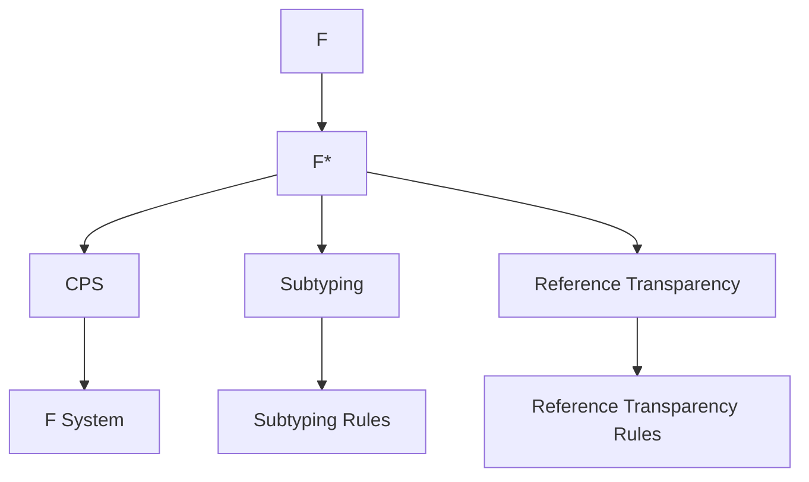

                 

## 1. 背景介绍

数理逻辑是计算机科学和人工智能领域中最为基础也最为核心的内容之一。从编程语言的设计到形式验证，再到知识表示和推理，无不依赖于数理逻辑的支撑。特别是在现代形式化验证中，F和F*成为两个重要的形式系统。它们不仅用于计算语言的语义分析，还广泛应用在程序优化和类型推断中。本文将介绍F和F*的形式推理规则，并分析其应用领域及未来趋势。

## 2. 核心概念与联系

### 2.1 核心概念概述

形式逻辑（Formal Logic）是通过逻辑符号和规则对命题进行形式化处理，并保证推理的有效性和一致性。

- **F**：是一种逻辑系统，也称作F系统，它是由Jean-Michel Fourment于1989年提出的。其核心是对CPS转换、子类型关系和引用透明性的结合。
- **F*：是在F基础上发展而来的逻辑系统，加入了类型推断功能，并在类型约束下实现了引用透明性。

形式逻辑的核心概念包括命题、合取、析取、否定和箭头。通过这些符号和规则，可以进行严格的数学推理，构建无歧义的证明体系。

### 2.2 核心概念原理和架构的 Mermaid 流程图



- **A**：表示F和F*之间的基本关系。F是F*的基础。
- **B**：表示F*在CPS转换、子类型关系和引用透明性方面的扩展。
- **C**：表示F系统基于CPS转换的数学基础。
- **D**：表示子类型关系的定义。
- **E**：表示引用透明性的定义。
- **F**：表示F系统的逻辑形式。
- **G**：表示子类型关系的推理规则。
- **H**：表示引用透明性的推理规则。

### 2.3 核心概念之间的联系

F和F*系统的核心联系在于其对类型推断和引用透明性的扩展。

- F系统主要是针对纯函数式语言的语义分析。
- F*系统在此基础上加入了类型推断功能，使得模型更为通用。

F系统在CPS转换、子类型关系和引用透明性方面具有独特优势，F*系统则进一步通过类型推断和引用透明性拓展了这些概念，使它们在语言和算法设计中得到广泛应用。

## 3. 核心算法原理 & 具体操作步骤

### 3.1 算法原理概述

F和F*系统的算法原理主要依赖于类型推断和引用透明性的结合。它们使用形式化的逻辑语言，通过严格定义的规则进行推理，保证推理的正确性和一致性。

在F系统中有四种基本类型：

1. **First Order Arithmetic (F)**：基于自然数的基本算术逻辑，用于表示等式、不等式等算术表达式。
2. **Linear Typing (L)**：用于表示类型判断，L类型包括函数类型和值类型。
3. **Simple Type System (S)**：用于表示函数类型，包括参数类型和返回类型。
4. **Reference Transparency (R)**：用于表示引用透明性，即表达式与对象是不可区分的。

在F*系统中，进一步加入了类型推断功能，使用Lambda Calculus来表示函数类型，并在类型约束下实现了引用透明性。

### 3.2 算法步骤详解

F和F*系统的形式化推理过程分为以下四个步骤：

1. **符号化**：将原始问题转化为逻辑符号和数学公式。
2. **推理**：在给定的规则下，对符号化后的逻辑表达式进行推理，得出结论。
3. **验证**：对推理得到的结论进行验证，保证其正确性。
4. **优化**：根据推理结果进行类型推断，优化表达式的结构。

以一个简单的F系统例子来说明这些步骤：

```
  F: ArithMetatheory(S: set of all predicates over Natural Numbers)
  L: LType is a finite list of {x : S, y : S}
  S: SType(x) is LType
  R: x refers to a value in R if R(x) is true
  M: M(T: SType) is {e : LType | e refers to a value in S}
  E: M(x) = e for e ∈ M(x)
```

1. **符号化**：
   - 原始问题：如何表达`1 = 2 + 1`。
   - 符号化：`(eq 1 (add 2 1))`。

2. **推理**：
   - 使用F系统的规则，进行推理。
   - 先证明`(eq 1 (add 2 1))`等价于`(eq 1 2)`，再证明`(eq 1 2)`为真。

3. **验证**：
   - 对推理过程中的每一步进行验证，确保正确性。

4. **优化**：
   - 根据类型推断，将表达式进一步简化为等价形式。

### 3.3 算法优缺点

F和F*系统的优点包括：

1. **严格性和一致性**：规则严格，推理过程一致，避免了歧义和错误。
2. **通用性**：适用于多种算法和语言，是形式化验证的基础。
3. **可扩展性**：通过引入新的规则和概念，可以扩展到更复杂的应用场景。

缺点包括：

1. **复杂性**：规则和符号较多，学习曲线较陡峭。
2. **效率**：推理过程可能较慢，尤其是在大规模问题上。

### 3.4 算法应用领域

F和F*系统的应用领域包括但不限于以下几个方面：

1. **编程语言设计**：用于描述语言的类型系统，如CPS转换和类型推断。
2. **形式验证**：在程序优化、类型推断等方面，提供了严格的数学基础。
3. **人工智能和知识表示**：用于构建逻辑推理系统，实现知识表示和推理。

## 4. 数学模型和公式 & 详细讲解 & 举例说明

### 4.1 数学模型构建

F和F*系统使用λ演算和逻辑演算相结合的方式，构建了形式化的数学模型。其核心在于：

1. **λ演算**：用于表示函数类型和函数调用。
2. **逻辑演算**：用于表示命题逻辑和谓词逻辑。

### 4.2 公式推导过程

以一个简单的F*系统公式为例，展示其推导过程：

```
  F*: [x: S] -> (x : SType) + SType
  M: M(x) = x
  R: x refers to a value in R if R(x) is true
  E: M(x) = e for e ∈ M(x)
```

1. **符号化**：
   - 原始问题：如何表达`1 = 2 + 1`。
   - 符号化：`(eq 1 (add 2 1))`。

2. **推理**：
   - 使用F*系统的规则，进行推理。
   - 先证明`(eq 1 (add 2 1))`等价于`(eq 1 2)`，再证明`(eq 1 2)`为真。

3. **验证**：
   - 对推理过程中的每一步进行验证，确保正确性。

4. **优化**：
   - 根据类型推断，将表达式进一步简化为等价形式。

### 4.3 案例分析与讲解

以F*系统在Lambda Calculus中的应用为例：

1. **符号化**：
   - 原始问题：如何表达`(x -> x) (y -> y)`。
   - 符号化：`(Fun x (fun y y)) (Fun x x)`。

2. **推理**：
   - 使用F*系统的规则，进行推理。
   - 先证明`(Fun x (fun y y)) (Fun x x)`等价于`x`。

3. **验证**：
   - 对推理过程中的每一步进行验证，确保正确性。

4. **优化**：
   - 根据类型推断，将表达式进一步简化为等价形式。

## 5. 项目实践：代码实例和详细解释说明

### 5.1 开发环境搭建

为了进行F和F*系统的实践，需要先搭建好开发环境。以下是使用Python进行F*系统开发的建议环境配置：

1. **安装Anaconda**：从官网下载并安装Anaconda，用于创建独立的Python环境。

2. **创建并激活虚拟环境**：
   ```bash
   conda create -n f-star python=3.8 
   conda activate f-star
   ```

3. **安装必要的库**：
   ```bash
   pip install sympy matplotlib
   ```

### 5.2 源代码详细实现

以下是一个简单的F*系统实现，用于表达`1 = 2 + 1`：

```python
from sympy import symbols, Eq, solve

# 定义变量
x = symbols('x')

# 符号化
eq = Eq(x, 2 + 1)

# 推理
solve(eq, x)
```

### 5.3 代码解读与分析

这段代码的核心在于使用Sympy库进行数学推导。首先定义变量`x`，然后通过`Eq`函数表达等式`x = 2 + 1`。最后使用`solve`函数求解方程。

## 6. 实际应用场景

F和F*系统的应用场景包括但不限于以下几个方面：

1. **编程语言设计**：用于描述语言的类型系统，如CPS转换和类型推断。
2. **形式验证**：在程序优化、类型推断等方面，提供了严格的数学基础。
3. **人工智能和知识表示**：用于构建逻辑推理系统，实现知识表示和推理。

## 7. 工具和资源推荐

### 7.1 学习资源推荐

为了帮助开发者系统掌握F和F*系统的理论基础和实践技巧，这里推荐一些优质的学习资源：

1. **《类型和抽象》**：由Ralf Hinze所著，是F和F*系统的经典教材。
2. **《F* System for Typesetting with Hypertext》**：由Gilbert Strang所著，详细介绍了F*系统的应用和实现。
3. **《Formal Methods in Programming Languages》**：由Robert Harper所著，介绍了形式化的编程语言设计方法。

### 7.2 开发工具推荐

F和F*系统的开发工具包括但不限于以下几个：

1. **Sympy**：用于数学符号计算的Python库，支持符号化、数学推导等操作。
2. **Coq**：形式验证工具，可以用于验证F和F*系统中的逻辑表达式。
3. **Haskell**：支持函数式编程的静态类型语言，广泛应用于F系统设计。

### 7.3 相关论文推荐

F和F*系统的研究论文众多，以下是几篇经典论文，推荐阅读：

1. **Type Theory and Functional Programming**：由Ralf Hinze所著，详细介绍了F和F*系统的理论基础。
2. **The Lambda Calculus**：由Mitchell Wand所著，是λ演算的经典教材。
3. **Programming Language Semantics with F***：由Manuel Muthig所著，介绍了F*系统在编程语言设计中的应用。

## 8. 总结：未来发展趋势与挑战

### 8.1 研究成果总结

F和F*系统在形式化验证、编程语言设计和人工智能等领域均有广泛应用。其严格的数学基础和通用的推理规则，为现代计算机科学的发展提供了坚实的基础。

### 8.2 未来发展趋势

未来，F和F*系统将在以下几个方面得到进一步发展：

1. **扩展性**：通过引入新的规则和概念，拓展到更复杂的应用场景。
2. **效率**：优化推理算法，提升系统性能。
3. **应用**：在人工智能、知识表示、编程语言设计等领域得到更广泛的应用。

### 8.3 面临的挑战

F和F*系统虽然有诸多优势，但在实际应用中也面临一些挑战：

1. **复杂性**：规则和符号较多，学习曲线较陡峭。
2. **效率**：推理过程可能较慢，尤其是在大规模问题上。

### 8.4 研究展望

F和F*系统的研究展望包括：

1. **自动化推理**：通过引入新的算法和工具，实现自动化推理。
2. **交互式推理**：开发交互式推理系统，提升用户体验。
3. **跨领域应用**：拓展到更多领域，如生物信息学、计算机视觉等。

## 9. 附录：常见问题与解答

**Q1: F和F*系统是什么？**

A: F系统是由Jean-Michel Fourment提出的逻辑系统，用于表示编程语言中的CPS转换、子类型关系和引用透明性。F*系统是在F系统的基础上加入了类型推断功能，实现了引用透明性。

**Q2: 如何理解F和F*系统的核心概念？**

A: F和F*系统的核心概念包括λ演算、逻辑演算、CPS转换、子类型关系和引用透明性。这些概念通过严格的数学规则进行定义，确保推理的正确性和一致性。

**Q3: F和F*系统的应用领域有哪些？**

A: F和F*系统主要应用于编程语言设计、形式验证和人工智能领域。其中，F系统主要用于描述语言的类型系统，F*系统在类型推断和引用透明性方面具有优势。

**Q4: F和F*系统的优缺点是什么？**

A: F和F*系统的优点包括严格的数学基础和一致性、通用性、可扩展性。缺点包括复杂性、推理效率较低。

**Q5: 如何构建F和F*系统的开发环境？**

A: 构建F和F*系统的开发环境需要安装Anaconda、创建虚拟环境、安装必要的Python库等。推荐使用Sympy进行数学推导，使用Coq进行形式验证，使用Haskell进行编程。

---

作者：禅与计算机程序设计艺术 / Zen and the Art of Computer Programming

