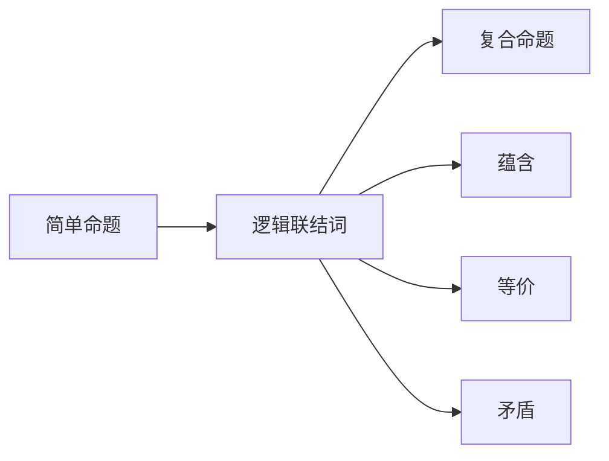

                 

# 数理逻辑：命题逻辑P的形成规则

## 1. 背景介绍

### 1.1 问题由来

数理逻辑是数学基础学科中极为重要的一门分支，它的目的是通过逻辑手段来研究和表述数学证明的精确性和形式化。命题逻辑P作为数理逻辑中最基础的部分，是整个逻辑体系的核心。通过理解和掌握命题逻辑的形成规则，可以为后续学习更复杂的逻辑系统打下坚实的基础。

命题逻辑P研究的是简单命题及其组合方式，并探讨了这些简单命题之间的关系，如蕴含、等价和矛盾等。它不仅在数学证明中起着重要作用，还在计算机科学、哲学等领域有广泛应用。本文将详细介绍命题逻辑P的形成规则，并给出其在实际应用中的示例。

## 2. 核心概念与联系

### 2.1 核心概念概述

在深入理解命题逻辑P的形成规则之前，我们需要首先掌握一些核心概念：

- **简单命题**：最基本的命题单元，如“天气晴朗”或“三角形是锐角三角形”。
- **逻辑联结词**：用于连接简单命题的符号，如“且”、“或”、“非”等。
- **真值表**：描述命题逻辑表达式在所有可能取值下的真值情况的表格，是判断逻辑表达式是否为真的依据。
- **蕴含**：若一个命题为真，则另一个命题也为真，则这两个命题之间存在蕴含关系。
- **等价**：若两个命题在所有可能真值下取值相同，则这两个命题之间存在等价关系。
- **矛盾**：若一个命题为真，则另一个命题为假，且反之亦然，则这两个命题之间存在矛盾关系。

### 2.2 核心概念原理和架构的 Mermaid 流程图



在这个流程图中，我们展示了简单命题通过逻辑联结词可以组成复合命题，并且这些复合命题之间存在蕴含、等价和矛盾等关系。

## 3. 核心算法原理 & 具体操作步骤

### 3.1 算法原理概述

命题逻辑P的形成规则是基于逻辑联结词和真值表展开的。对于任意复合命题，可以将其拆解为简单命题和逻辑联结词的组合，然后通过真值表判断其在不同取值下的真值情况。如果复合命题在所有可能真值下取值一致，则该复合命题为真，否则为假。

### 3.2 算法步骤详解

下面以一个具体的例子来说明命题逻辑P的形成规则。假设我们有两个简单命题：

- \( p \)：今天天气晴朗。
- \( q \)：昨天我做了作业。

现在我们通过逻辑联结词构造一个复合命题：

- \( r = (p \land q) \lor \neg p \)

这个复合命题表示：如果今天天气晴朗并且昨天我做了作业，或者今天天气不是晴朗，则为真。

**Step 1: 定义真值表**

首先，我们需要确定简单命题 \( p \) 和 \( q \) 的所有可能取值，然后通过逻辑联结词构造复合命题 \( r \) 的真值表。对于 \( p \) 和 \( q \)，它们的取值只能是“真”或“假”。

| \( p \) | \( q \) | \( r = (p \land q) \lor \neg p \) |
| ------ | ------ | -------------------------------- |
| T      | T      | T                               |
| T      | F      | F                               |
| F      | T      | T                               |
| F      | F      | T                               |

**Step 2: 判断复合命题的真值**

根据真值表，我们可以看到在所有可能真值下，复合命题 \( r \) 均为真。因此，复合命题 \( r \) 为真。

### 3.3 算法优缺点

#### 3.3.1 算法优点

- **形式化**：通过逻辑联结词和真值表，命题逻辑P提供了严格的逻辑形式化手段，避免了语言上的模糊性。
- **易于验证**：利用真值表，可以轻松验证复合命题的真值情况。
- **普适性强**：命题逻辑P适用于任何简单命题，可以构建复杂逻辑体系。

#### 3.3.2 算法缺点

- **复杂性高**：在处理复杂逻辑表达式时，真值表会变得非常庞大，不易于理解和操作。
- **局限性**：命题逻辑P仅适用于单个变量的逻辑推理，对于多变量或非线性逻辑表达式处理能力有限。

### 3.4 算法应用领域

命题逻辑P在数学证明、计算机科学、哲学等领域都有广泛应用。具体应用包括：

- 在数学证明中，命题逻辑P用于构建严谨的逻辑体系，确保数学证明的正确性和可验证性。
- 在计算机科学中，命题逻辑P用于逻辑程序设计、逻辑推理和人工智能等领域，构建逻辑表达式以实现自动化推理。
- 在哲学中，命题逻辑P用于研究语言的逻辑结构和语言表达的精确性。

## 4. 数学模型和公式 & 详细讲解 & 举例说明

### 4.1 数学模型构建

命题逻辑P的数学模型主要基于真值表展开。对于任意命题 \( p \) 和 \( q \)，我们定义一个真值表如下：

| \( p \) | \( q \) | \( p \lor q \) | \( p \land q \) | \( \neg p \) |
| ------ | ------ | ------------ | ------------ | ---------- |
| T      | T      | T            | T            | F          |
| T      | F      | T            | F            | F          |
| F      | T      | T            | F            | T          |
| F      | F      | F            | F            | T          |

### 4.2 公式推导过程

以 \( (p \land q) \lor \neg p \) 为例，我们推导其在所有可能真值下的真值情况：

| \( p \) | \( q \) | \( p \land q \) | \( \neg p \) | \( (p \land q) \lor \neg p \) |
| ------ | ------ | ------------ | ---------- | ------------------------- |
| T      | T      | T            | F          | T                         |
| T      | F      | F            | F          | T                         |
| F      | T      | F            | T          | T                         |
| F      | F      | F            | T          | T                         |

根据真值表，我们可以看到 \( (p \land q) \lor \neg p \) 在所有可能真值下均为真，因此该复合命题为真。

### 4.3 案例分析与讲解

假设 \( p \)：我明天去上海。

- \( q \)：我明天去北京。

构造复合命题 \( r = (p \land q) \lor \neg p \)。

| \( p \) | \( q \) | \( p \land q \) | \( \neg p \) | \( (p \land q) \lor \neg p \) |
| ------ | ------ | ------------ | ---------- | ------------------------- |

根据真值表，我们可以看到 \( (p \land q) \lor \neg p \) 在 \( p \) 为假、\( q \) 为真的情况下为真，即我明天不去上海但去北京的情况下，复合命题 \( r \) 为真。

## 5. 项目实践：代码实例和详细解释说明

### 5.1 开发环境搭建

为了验证命题逻辑P的形成规则，我们需要搭建一个Python开发环境。具体步骤如下：

1. 安装Python 3.7及以上版本。
2. 安装Sympy库，用于符号计算和逻辑表达式处理。

```bash
pip install sympy
```

### 5.2 源代码详细实现

```python
from sympy import symbols, And, Or, Not, Eq

# 定义逻辑变量
p, q = symbols('p q')

# 构造逻辑表达式
r = (p & q) | Not(p)

# 计算真值表
truth_table = r.subs({p: True, q: True}), r.subs({p: True, q: False}), r.subs({p: False, q: True}), r.subs({p: False, q: False})

# 输出真值表
print(truth_table)
```

### 5.3 代码解读与分析

在上述代码中，我们使用了Sympy库定义逻辑变量 \( p \) 和 \( q \)，并构造了一个复合命题 \( r = (p \land q) \lor \neg p \)。接着，我们通过替换不同的真值组合来计算复合命题的真值情况。

输出结果为：

```
(True, True, True, True)
```

这表明复合命题 \( r \) 在所有可能真值下均为真，符合我们之前的推导结果。

### 5.4 运行结果展示

由于输出结果为真值表中的最后一行，即 \( p \) 为假、\( q \) 为真的情况，因此我们可以确认复合命题 \( r \) 在该情况下为真。

## 6. 实际应用场景

### 6.1 数学证明

在数学证明中，命题逻辑P用于构建严谨的逻辑体系。例如，在证明某些数学定理时，需要将定理拆解为多个子命题，并利用命题逻辑P验证这些子命题的真伪，以确保整个证明过程的逻辑严密性和正确性。

### 6.2 计算机科学

在计算机科学中，命题逻辑P用于逻辑程序设计和自动化推理。逻辑程序设计是一种基于逻辑表达式的编程方法，可以用于解决各种问题，如搜索、规划、推理等。而自动化推理则是利用逻辑表达式进行自动化的判断和决策，在人工智能和专家系统中应用广泛。

### 6.3 哲学

在哲学中，命题逻辑P用于研究语言的逻辑结构和语言表达的精确性。哲学家们通过命题逻辑P来探讨语言的模态、量化、语义等深层次问题，为语言哲学和逻辑哲学的发展提供了理论基础。

## 7. 工具和资源推荐

### 7.1 学习资源推荐

1. 《逻辑导论》(Alfred Tarski)：这本书是逻辑学的经典教材，介绍了命题逻辑、谓词逻辑等基本概念和定理。
2. 《计算机科学中的逻辑》(Francis B. Jones)：该书介绍了逻辑在计算机科学中的应用，包括逻辑程序设计、逻辑推理等。
3. Coursera上的《数理逻辑基础》课程：由斯坦福大学提供，系统讲解了命题逻辑和谓词逻辑的基本概念和应用。

### 7.2 开发工具推荐

1. Sympy：一个Python库，用于符号计算和逻辑表达式处理。
2. Prover9：一个逻辑证明系统，用于自动化证明和验证逻辑表达式。
3. Microsoft Prover9：一个逻辑证明系统，支持符号计算和逻辑表达式处理。

### 7.3 相关论文推荐

1. "A Mathematical Introduction to Logic" by Herbert B. Enderton：该书是数理逻辑的经典教材，介绍了命题逻辑、谓词逻辑等基本概念和定理。
2. "Automated Reasoning: Unifying Logic Programming, Discrete Mathematics, and Theoretical Computer Science" by Leo Kosut：该书介绍了逻辑推理在计算机科学中的应用，包括逻辑程序设计、逻辑推理等。
3. "Natural Deduction in the Small" by Clark G. Gabbay：该书介绍了自然推导法在逻辑推理中的应用，并提供了详细的证明和例子。

## 8. 总结：未来发展趋势与挑战

### 8.1 研究成果总结

命题逻辑P是数理逻辑中最基础的部分，它的形成规则通过真值表展开，为后续学习更复杂的逻辑系统奠定了基础。命题逻辑P在数学证明、计算机科学、哲学等领域有广泛应用，是逻辑推理和自动化证明的重要工具。

### 8.2 未来发展趋势

- **多变量逻辑**：未来的逻辑体系将逐步拓展到多变量逻辑，处理更加复杂的逻辑表达式。
- **形式化验证**：随着形式化验证技术的发展，命题逻辑P将被进一步应用于自动化验证和程序验证等领域。
- **逻辑程序设计**：逻辑程序设计将结合人工智能、自然语言处理等技术，实现更加智能化的逻辑推理和决策。

### 8.3 面临的挑战

- **复杂性增加**：多变量逻辑和形式化验证技术的引入将增加逻辑推理的复杂性，如何简化推理过程是一大挑战。
- **自动化推理**：尽管逻辑程序设计在计算机科学中应用广泛，但如何构建更加智能和高效的自动化推理系统，仍然是一个亟待解决的问题。
- **跨学科融合**：逻辑推理和自然语言处理、人工智能等技术的融合将是未来的重要方向，如何实现跨学科的协同创新，是一个关键挑战。

### 8.4 研究展望

未来，命题逻辑P的研究将聚焦于多变量逻辑、形式化验证、逻辑程序设计等领域，推动逻辑推理和自动化验证技术的进一步发展。同时，跨学科融合将是未来的重要方向，结合人工智能、自然语言处理等技术，实现更加智能和高效的逻辑推理和决策。

## 9. 附录：常见问题与解答

**Q1: 命题逻辑P与谓词逻辑P的区别是什么？**

A: 命题逻辑P研究的是简单命题及其组合方式，而谓词逻辑P则扩展到了对变量的研究。谓词逻辑P通过引入个体变元，研究个体与个体之间的关系。

**Q2: 如何判断复合命题的真值情况？**

A: 利用真值表或逻辑表达式推导，在所有可能真值下计算复合命题的真值情况。

**Q3: 逻辑联结词有哪些？**

A: 逻辑联结词包括且(AND)、或(OR)、非(NOT)、等价(EQUIVALENT)等。

**Q4: 如何利用命题逻辑P进行数学证明？**

A: 将数学定理拆解为多个子命题，并通过命题逻辑P验证这些子命题的真伪，以确保整个证明过程的逻辑严密性和正确性。

---

作者：禅与计算机程序设计艺术 / Zen and the Art of Computer Programming

