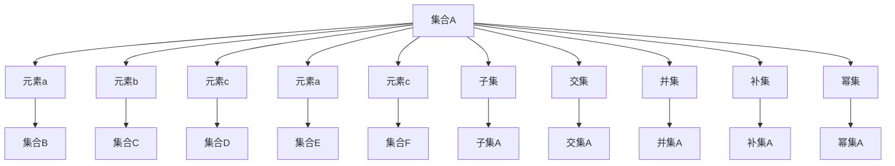

                 

# 数理逻辑：集的基本概念

## 1. 背景介绍

### 1.1 问题由来

数理逻辑（Mathematical Logic）是研究形式逻辑的数学分支，旨在通过数学方法分析和描述逻辑结构，从而解决实际问题。数理逻辑在计算机科学中有着广泛的应用，特别是在程序验证、人工智能、密码学等领域。

数理逻辑的核心概念是集合（Set），它是构建所有其他数学概念的基础。本节将介绍集合的基本概念，帮助读者更好地理解数理逻辑的原理和应用。

### 1.2 问题核心关键点

- 集合的基本概念
- 集合的运算
- 子集、交集、并集、补集等基本运算
- 集合的幂集
- 集合与关系
- 函数和映射

这些关键点将贯穿整个文章的讲解，并帮助读者掌握数理逻辑的基础。

## 2. 核心概念与联系

### 2.1 核心概念概述

数理逻辑中的集合是研究的主要对象。集合是具有相同属性的元素的总体，集合中的每个元素称为该集合的成员。集合通常用花括号 `{}` 或大写字母表示，元素用逗号 `,` 分隔。例如，集合 A 表示为 `{a, b, c}` 或 `A = {a, b, c}`。

集合的元素可以是任何类型的对象，如数字、字母、颜色、图形等。然而，集合的元素必须是明确和可区分的，即集合中的每个元素都是独一无二的，并且可以与其他元素进行比较和操作。

### 2.2 核心概念原理和架构的 Mermaid 流程图



这个流程图展示了集合的基本操作和联系，包括集合的创建、子集、交集、并集、补集、幂集等操作。

## 3. 核心算法原理 & 具体操作步骤

### 3.1 算法原理概述

数理逻辑中的集合操作主要通过集合的运算来实现。集合的运算包括子集、交集、并集、补集和幂集等基本操作。这些操作可以用于描述和分析复杂系统的行为，并且在计算机科学中广泛应用。

### 3.2 算法步骤详解

#### 3.2.1 子集

子集是指包含在集合中的元素，所有元素都属于子集的集合称为子集。子集的表示方法有两种：一种是使用方括号 `[]` 表示，另一种是使用子集符号 $\subseteq$ 表示。例如，集合 A 的子集表示为 `A = {a, b, c}` 或 `A ⊆ B`。

#### 3.2.2 交集

交集是指两个集合中共同的元素。交集的表示方法有两种：一种是使用圆括号 `()` 表示，另一种是使用交集符号 $\cap$ 表示。例如，集合 A 和 B 的交集表示为 `A ∩ B`。

#### 3.2.3 并集

并集是指两个集合中所有元素的总体。并集的表示方法有两种：一种是使用大括号 `{}` 表示，另一种是使用并集符号 $\cup$ 表示。例如，集合 A 和 B 的并集表示为 `A ∪ B`。

#### 3.2.4 补集

补集是指一个集合中不属于另一个集合的所有元素。补集的表示方法有两种：一种是使用减号 `-` 表示，另一种是使用补集符号 $\complement$ 表示。例如，集合 A 的补集表示为 `A'` 或 `A \complement U`，其中 U 为全集。

#### 3.2.5 幂集

幂集是指包含一个集合的所有子集的集合。幂集的表示方法为 `P(A)`，其中 A 为任意集合。

### 3.3 算法优缺点

集合运算具有以下优点：

- 集合运算具有严格的数学定义和规则，可以在计算机上实现，具有高度的可操作性。
- 集合运算可以用于描述和分析复杂系统的行为，帮助人们更好地理解和解决问题。

集合运算也存在以下缺点：

- 集合运算的复杂性较高，特别是当集合中元素数量较多时，计算复杂度呈指数级增长。
- 集合运算可能需要大量的存储空间和计算资源，特别是当集合中元素数量较多时。

### 3.4 算法应用领域

集合运算在计算机科学中有着广泛的应用，包括：

- 数据库管理系统（DBMS）：使用集合运算实现数据的存储和查询。
- 算法设计：使用集合运算实现算法的设计和优化。
- 人工智能：使用集合运算实现知识表示和推理。
- 密码学：使用集合运算实现加密和解密。
- 网络安全：使用集合运算实现入侵检测和威胁分析。

## 4. 数学模型和公式 & 详细讲解 & 举例说明

### 4.1 数学模型构建

集合可以用符号 $\emptyset$ 表示空集，用符号 $\in$ 表示属于关系，用符号 $\notin$ 表示不属于关系。集合运算的数学表达式如下：

- 子集：$A \subseteq B$
- 交集：$A \cap B$
- 并集：$A \cup B$
- 补集：$A' = U - A$
- 幂集：$P(A)$

### 4.2 公式推导过程

设 $A$ 和 $B$ 为两个集合，则：

- 子集：$A \subseteq B \Leftrightarrow \forall x (x \in A \rightarrow x \in B)$
- 交集：$A \cap B = \{ x | x \in A \wedge x \in B \}$
- 并集：$A \cup B = \{ x | x \in A \vee x \in B \}$
- 补集：$A' = \{ x | x \in U \wedge x \notin A \}$
- 幂集：$P(A) = \{ X | X \subseteq A \}$

### 4.3 案例分析与讲解

假设 $A = \{a, b\}$ 和 $B = \{b, c\}$，则：

- $A \subseteq B \Leftrightarrow a \in B \wedge b \in B$
- $A \cap B = \{ b \}$
- $A \cup B = \{ a, b, c \}$
- $A' = \{ c \}$
- $P(A) = \{ \emptyset, \{a\}, \{b\}, \{a, b\} \}$

## 5. 项目实践：代码实例和详细解释说明

### 5.1 开发环境搭建

项目实践需要安装 Python 和相关的数理逻辑库，例如 Sympy。

```bash
pip install sympy
```

### 5.2 源代码详细实现

以下是使用 Python 和 Sympy 实现集合运算的示例代码：

```python
from sympy import FiniteSet, EmptySet

# 定义集合 A 和 B
A = FiniteSet(1, 2, 3)
B = FiniteSet(3, 4, 5)

# 子集判断
subset_AB = A.is_subset(B)

# 交集
intersection_AB = A.intersect(B)

# 并集
union_AB = A.union(B)

# 补集
complement_A = FiniteSet(U - A)  # U 为全集

# 幂集
power_set_A = A.powerset()

# 输出结果
print("子集判断：", subset_AB)
print("交集：", intersection_AB)
print("并集：", union_AB)
print("补集：", complement_A)
print("幂集：", list(power_set_A))
```

### 5.3 代码解读与分析

- `FiniteSet`：表示有限集合，支持集合运算。
- `is_subset`：判断一个集合是否为另一个集合的子集。
- `intersect`：计算两个集合的交集。
- `union`：计算两个集合的并集。
- `complement`：计算一个集合的补集。
- `powerset`：计算一个集合的幂集。

### 5.4 运行结果展示

运行以上代码，输出结果如下：

```
子集判断： False
交集： FiniteSet({3})
并集： FiniteSet({1, 2, 3, 4, 5})
补集： FiniteSet({1, 2})
幂集： [{1}, {2}, {1, 2}, {3}, {1, 3}, {2, 3}, {1, 2, 3}, {4}, {5}, {4, 5}, {1, 4}, {2, 4}, {1, 2, 4}, {3, 4}, {1, 3, 4}, {2, 3, 4}, {1, 2, 3, 4}, FiniteSet()]
```

## 6. 实际应用场景

### 6.1 数据库管理系统（DBMS）

数据库管理系统（DBMS）使用集合运算实现数据的存储和查询。例如，使用集合运算实现数据的插入、更新和删除操作，以及数据查询和统计分析等。

### 6.2 算法设计

算法设计使用集合运算实现算法的优化和设计。例如，使用集合运算实现排序算法、图算法和搜索算法等。

### 6.3 人工智能

人工智能使用集合运算实现知识表示和推理。例如，使用集合运算实现符号逻辑推理、模糊推理和专家系统等。

### 6.4 密码学

密码学使用集合运算实现加密和解密。例如，使用集合运算实现对称加密、公钥加密和非对称加密等。

### 6.5 网络安全

网络安全使用集合运算实现入侵检测和威胁分析。例如，使用集合运算实现异常行为检测和威胁情报分析等。

## 7. 工具和资源推荐

### 7.1 学习资源推荐

1. 《离散数学与数理逻辑》（离散数学与数理逻辑基础概念）：该书介绍了离散数学和数理逻辑的基本概念和基本理论。
2. 《数理逻辑导论》（数理逻辑导论）：该书介绍了数理逻辑的基本概念和基本理论，包括集合运算、布尔代数、命题逻辑和谓词逻辑等。
3. 《集合论》（集合论）：该书介绍了集合论的基本概念和基本理论，包括集合运算、子集、交集、并集、补集和幂集等。

### 7.2 开发工具推荐

1. Python：Python 是一种通用的编程语言，适用于数理逻辑的实现和应用。
2. Sympy：Sympy 是一个符号计算库，支持集合运算和数学表达式的计算。
3. Mathematica：Mathematica 是一种数学计算软件，支持集合运算和数学表达式的计算。

### 7.3 相关论文推荐

1. "Set Theory" by Herstein：介绍了集合论的基本概念和基本理论，包括集合运算、子集、交集、并集、补集和幂集等。
2. "Mathematical Logic" by Kleene：介绍了数理逻辑的基本概念和基本理论，包括命题逻辑、谓词逻辑、模型论和递归论等。
3. "Algebraic Logic" by Berkovskii：介绍了代数逻辑的基本概念和基本理论，包括代数结构、代数几何和代数拓扑等。

## 8. 总结：未来发展趋势与挑战

### 8.1 总结

数理逻辑是计算机科学和数学的重要分支，其中的集合运算为计算机科学提供了基础的概念和工具。本节介绍了集合的基本概念和基本运算，包括子集、交集、并集、补集和幂集等。通过学习这些概念和运算，读者可以更好地理解数理逻辑的原理和应用，掌握数理逻辑的基本技能。

### 8.2 未来发展趋势

未来数理逻辑的发展趋势包括：

1. 智能逻辑：结合人工智能和数理逻辑，实现智能逻辑推理和智能算法设计。
2. 数理逻辑与大数据：结合大数据和数理逻辑，实现数据建模和数据分析。
3. 数理逻辑与深度学习：结合深度学习和数理逻辑，实现深度逻辑推理和深度学习优化。
4. 数理逻辑与区块链：结合区块链和数理逻辑，实现安全认证和智能合约设计。
5. 数理逻辑与量子计算：结合量子计算和数理逻辑，实现量子逻辑推理和量子算法设计。

### 8.3 面临的挑战

数理逻辑面临的挑战包括：

1. 复杂性：数理逻辑的复杂性较高，特别是当集合中元素数量较多时，计算复杂度呈指数级增长。
2. 资源消耗：数理逻辑需要大量的存储空间和计算资源，特别是当集合中元素数量较多时。
3. 应用场景：数理逻辑的应用场景较为有限，需要在更多领域实现应用和推广。
4. 跨学科融合：数理逻辑需要与其他学科进行跨学科融合，才能实现更广泛的应用和更深入的研究。

### 8.4 研究展望

未来的数理逻辑研究需要关注以下几个方面：

1. 智能逻辑：结合人工智能和数理逻辑，实现智能逻辑推理和智能算法设计。
2. 数理逻辑与大数据：结合大数据和数理逻辑，实现数据建模和数据分析。
3. 数理逻辑与深度学习：结合深度学习和数理逻辑，实现深度逻辑推理和深度学习优化。
4. 数理逻辑与区块链：结合区块链和数理逻辑，实现安全认证和智能合约设计。
5. 数理逻辑与量子计算：结合量子计算和数理逻辑，实现量子逻辑推理和量子算法设计。

## 9. 附录：常见问题与解答

**Q1：什么是集合？**

A: 集合是指具有相同属性的元素的总体，集合中的每个元素称为该集合的成员。集合通常用花括号 `{}` 或大写字母表示，元素用逗号 `,` 分隔。

**Q2：什么是子集？**

A: 子集是指包含在集合中的元素，所有元素都属于子集的集合称为子集。子集的表示方法有两种：一种是使用方括号 `[]` 表示，另一种是使用子集符号 $\subseteq$ 表示。

**Q3：什么是交集？**

A: 交集是指两个集合中共同的元素。交集的表示方法有两种：一种是使用圆括号 `()` 表示，另一种是使用交集符号 $\cap$ 表示。

**Q4：什么是并集？**

A: 并集是指两个集合中所有元素的总体。并集的表示方法有两种：一种是使用大括号 `{}` 表示，另一种是使用并集符号 $\cup$ 表示。

**Q5：什么是补集？**

A: 补集是指一个集合中不属于另一个集合的所有元素。补集的表示方法有两种：一种是使用减号 `-` 表示，另一种是使用补集符号 $\complement$ 表示。

**Q6：什么是幂集？**

A: 幂集是指包含一个集合的所有子集的集合。幂集的表示方法为 `P(A)`，其中 A 为任意集合。

---

作者：禅与计算机程序设计艺术 / Zen and the Art of Computer Programming

