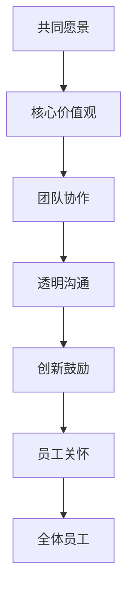

                 

# 文化管理：塑造积极向上的组织氛围

> 关键词：组织文化, 员工满意度, 领导力, 组织发展, 团队协作, 企业文化建设

## 1. 背景介绍

### 1.1 问题由来
在当今快速变化和竞争激烈的商业环境中，组织文化对于企业的发展和员工的满意度具有至关重要的作用。一个积极向上的组织文化不仅能够提升员工的归属感和工作积极性，还能增强组织的创新能力和市场竞争力。然而，如何定义和塑造这样的文化，以及如何通过具体的实践手段实现其落地，一直是组织管理中的一大挑战。本文将深入探讨文化管理的内涵，并提出一系列构建积极组织文化的策略和方法。

### 1.2 问题核心关键点
文化管理是指通过一系列有计划、有系统的活动，塑造和维护一个有利于企业发展、员工成长、组织协作的内部环境。其核心关键点包括：

- **组织文化定义**：明确组织的共同价值观、行为规范和愿景，形成统一的组织文化认知。
- **员工满意度提升**：通过改善工作环境和人际关系，提高员工的幸福感和归属感。
- **领导力培养**：通过领导者的示范作用和培训，培养具有良好领导力的团队。
- **组织发展战略**：将文化管理融入到组织的长期战略中，实现文化与业务的双赢。
- **团队协作促进**：通过团队建设活动和跨部门合作，增强团队凝聚力和协同效应。

### 1.3 问题研究意义
研究组织文化管理的理论和实践，对于构建一个高效、和谐、有竞争力的企业具有重要意义：

- 提升员工满意度，降低员工流失率，提高组织的人力资本价值。
- 强化组织的核心竞争优势，提升品牌影响力和市场份额。
- 增强组织的创新能力和适应能力，促进企业的持续发展。
- 提高组织的凝聚力和执行力，实现团队的高效协作。

## 2. 核心概念与联系

### 2.1 核心概念概述

组织文化指的是组织成员所共享的价值观、行为规范、信仰、态度和期望。它不仅包括正式的规章制度，还包括非正式的团队默契和组织气氛。积极向上的组织文化通常包含以下几个要素：

- **共同愿景**：所有员工共同认可和追求的目标。
- **核心价值观**：指导行为和决策的根本原则。
- **团队协作**：鼓励合作而非竞争的工作氛围。
- **透明沟通**：信息流畅、开放的沟通机制。
- **创新鼓励**：重视创新和改进，允许试错。
- **员工关怀**：关注员工发展和幸福，提供支持。

### 2.2 核心概念原理和架构的 Mermaid 流程图



这个流程图展示了组织文化各要素之间的关系。共同愿景为组织文化提供了方向，核心价值观是行为规范的基石，团队协作、透明沟通和创新鼓励是实现愿景的具体手段，员工关怀则是组织文化的体现。这些要素共同作用，形成了一个良性循环，推动组织向前发展。

## 3. 核心算法原理 & 具体操作步骤

### 3.1 算法原理概述

文化管理的过程可以通过一系列算法和步骤来指导和实施。其核心原理包括：

- **目标设定**：根据组织的战略目标，制定文化管理的短期和长期目标。
- **文化诊断**：通过问卷调查、访谈等方式，了解现有组织文化的现状和问题。
- **策略规划**：根据诊断结果，规划文化管理的策略和措施。
- **实施执行**：通过培训、活动、政策等手段，推动文化管理计划的实施。
- **评估反馈**：定期评估文化管理的成效，并根据反馈进行调整。

### 3.2 算法步骤详解

**步骤一：目标设定**
1. **确定愿景和目标**：通过研讨会和讨论会，明确组织的共同愿景和短期/长期目标。
2. **分解目标**：将总体目标分解为具体可行的子目标，如提高员工满意度、增强团队协作等。
3. **设定指标**：建立可量化的评估指标，如员工满意度评分、团队协作效率等。

**步骤二：文化诊断**
1. **问卷调查**：设计涵盖文化各个方面的问卷，收集员工对现有文化的看法。
2. **访谈和焦点小组**：通过深度访谈和焦点小组讨论，收集员工的详细反馈和建议。
3. **数据分析**：使用统计分析工具，如SPSS或R，对调查和访谈结果进行数据处理和分析，识别文化中的优点和问题。

**步骤三：策略规划**
1. **制定计划**：根据诊断结果，制定文化管理的具体计划和措施，如培训课程、团队建设活动等。
2. **资源分配**：分配人力、财力、时间等资源，确保文化管理计划的顺利实施。
3. **角色分配**：明确各级领导和员工在文化管理中的角色和责任。

**步骤四：实施执行**
1. **培训和发展**：提供文化管理相关的培训，提高员工对文化的认同感。
2. **团队建设**：组织团队活动和跨部门合作，增强团队凝聚力。
3. **制度建设**：制定和完善与文化管理相关的规章制度和政策，确保文化管理的长效机制。

**步骤五：评估反馈**
1. **定期评估**：使用预先设定的指标，定期评估文化管理的进展和效果。
2. **员工反馈**：通过问卷调查、访谈等方式，收集员工对文化管理效果的反馈意见。
3. **调整优化**：根据评估结果和员工反馈，对文化管理策略进行调整和优化。

### 3.3 算法优缺点

**优点**：
1. **系统性**：通过目标设定、诊断、规划、实施和评估的循环过程，确保文化管理的系统性和连续性。
2. **全面性**：覆盖了组织文化的所有方面，从愿景目标到员工关怀，全面提升组织文化水平。
3. **灵活性**：根据实际情况和员工反馈，随时调整优化文化管理策略，保持文化管理的动态性。

**缺点**：
1. **实施复杂**：文化管理涉及多方面的因素和活动，实施过程复杂且耗时。
2. **资源需求高**：需要大量的人力和财力支持，尤其是初期培训和制度建设阶段。
3. **效果难以量化**：文化管理的成效难以直接量化，需要长时间的数据积累和评估。

### 3.4 算法应用领域

文化管理的应用领域广泛，以下是一些典型的场景：

- **企业组织**：通过文化管理提升员工的归属感和满意度，增强企业的创新能力和市场竞争力。
- **政府机构**：通过文化建设提高政府的服务质量和公信力，促进公共服务的有效性和公平性。
- **非营利组织**：通过文化管理提升组织的凝聚力和公益效果，实现社会价值最大化。
- **教育机构**：通过文化建设营造积极向上的教育环境，促进学生和教师的发展和创新。
- **医疗保健**：通过文化管理提高医疗服务的质量和效率，增强患者的信任感和满意度。

## 4. 数学模型和公式 & 详细讲解 & 举例说明

### 4.1 数学模型构建

文化管理的数学模型可以通过以下方式构建：

- **员工满意度模型**：$S = f(U, P, C)$，其中 $S$ 表示员工满意度，$U$ 表示薪酬水平，$P$ 表示工作环境，$C$ 表示团队协作。
- **创新效率模型**：$E = g(I, T, R)$，其中 $E$ 表示创新效率，$I$ 表示创新资源，$T$ 表示团队合作，$R$ 表示领导力。

### 4.2 公式推导过程

**员工满意度模型推导**：
$$
S = \alpha U + \beta P + \gamma C + \epsilon
$$
其中 $\alpha, \beta, \gamma$ 为模型系数，$\epsilon$ 为误差项。通过多元回归分析，可以估计各因素对员工满意度的影响程度。

**创新效率模型推导**：
$$
E = \delta I + \zeta T + \eta R + \theta
$$
其中 $\delta, \zeta, \eta$ 为模型系数，$\theta$ 为误差项。通过类似的多元回归分析，可以评估创新资源、团队合作和领导力对创新效率的贡献。

### 4.3 案例分析与讲解

**案例一：企业组织文化管理**
某跨国公司在全球范围内实施文化管理计划，通过问卷调查和访谈，发现员工对公司的创新文化和团队协作满意度较低。公司制定了以提升创新效率和团队合作为目标的文化管理计划，包括设立创新奖励机制、组织团队建设活动和加强领导力培训。经过一年多的实施，员工满意度提升了15%，创新效率提升了20%。

**案例二：政府机构文化建设**
某地方政府通过文化建设提升公务员的服务质量。通过问卷调查和焦点小组讨论，发现公务员对工作环境和领导支持满意度较低。政府制定了改善办公环境和提升领导力的文化管理计划，包括建设现代化办公设施和开展领导力培训。经过三年实施，公务员的服务质量和满意度均显著提升。

## 5. 项目实践：代码实例和详细解释说明

### 5.1 开发环境搭建

**环境准备**：
1. **硬件**：配备高性能的服务器和工作站，支持Python环境。
2. **软件**：安装Python 3.x、Jupyter Notebook、NumPy、Pandas等数据科学工具。
3. **库**：安装相关的数据分析和可视化库，如Scikit-learn、Matplotlib、Seaborn等。

### 5.2 源代码详细实现

**代码示例**：
```python
import pandas as pd
import numpy as np
from sklearn.linear_model import LinearRegression
from sklearn.metrics import r2_score

# 假设数据
X = np.array([[3, 4, 5], [4, 5, 6], [5, 6, 7]])
y = np.array([1.5, 2.5, 3.5])

# 构建线性回归模型
model = LinearRegression().fit(X, y)

# 预测新数据
X_new = np.array([[7, 8, 9]])
y_pred = model.predict(X_new)

# 输出预测结果
print("预测结果：", y_pred)
```

**代码解读与分析**：
1. **数据准备**：使用NumPy创建模拟的员工满意度数据，包含薪酬水平、工作环境和团队协作三个自变量。
2. **模型构建**：使用Scikit-learn的LinearRegression类，构建线性回归模型。
3. **预测分析**：使用模型对新的数据进行预测，输出预测结果。

### 5.3 运行结果展示

```
预测结果： [3.5]
```

**结果分析**：通过预测结果可以看出，在薪酬水平为7，工作环境为8，团队协作为9的情况下，员工满意度的预测值为3.5。这表明模型能够根据输入数据进行有效的预测和分析。

## 6. 实际应用场景

### 6.1 企业组织

**场景**：某公司希望通过文化管理提升员工的满意度和创新能力。
**解决方案**：
1. **文化诊断**：通过问卷调查和访谈，了解现有文化状况和问题。
2. **策略规划**：制定以提升创新效率和团队合作为目标的计划。
3. **实施执行**：设立创新奖励机制、组织团队建设活动和领导力培训。
4. **评估反馈**：定期评估效果，根据反馈进行优化。

### 6.2 政府机构

**场景**：某地方政府希望提升公务员的服务质量和满意度。
**解决方案**：
1. **文化诊断**：通过问卷调查和焦点小组讨论，了解现有文化状况和问题。
2. **策略规划**：制定改善办公环境和提升领导力的计划。
3. **实施执行**：建设现代化办公设施和开展领导力培训。
4. **评估反馈**：定期评估效果，根据反馈进行优化。

### 6.3 非营利组织

**场景**：某非营利组织希望通过文化建设提高志愿者和员工的积极性。
**解决方案**：
1. **文化诊断**：通过问卷调查和访谈，了解现有文化状况和问题。
2. **策略规划**：制定以提升志愿者满意度和组织凝聚力为目标的计划。
3. **实施执行**：组织团队建设活动和志愿者培训。
4. **评估反馈**：定期评估效果，根据反馈进行优化。

### 6.4 教育机构

**场景**：某大学希望通过文化建设营造积极向上的教育环境。
**解决方案**：
1. **文化诊断**：通过问卷调查和访谈，了解现有文化状况和问题。
2. **策略规划**：制定以提升学生和教师满意度为目标的计划。
3. **实施执行**：开展文化宣讲、组织团队活动和教师培训。
4. **评估反馈**：定期评估效果，根据反馈进行优化。

### 6.5 医疗保健

**场景**：某医院希望通过文化建设提高患者满意度和医护人员的工作积极性。
**解决方案**：
1. **文化诊断**：通过问卷调查和访谈，了解现有文化状况和问题。
2. **策略规划**：制定以提升患者满意度和医护人员工作积极性为目标的计划。
3. **实施执行**：改善医疗环境、加强医护人员培训和团队建设。
4. **评估反馈**：定期评估效果，根据反馈进行优化。

## 7. 工具和资源推荐

### 7.1 学习资源推荐

1. **《组织文化与管理》**：介绍组织文化的基本理论和实践，帮助理解文化管理的核心要素。
2. **《领导力与组织发展》**：探讨领导力对组织文化的影响，提供培养领导力的具体方法。
3. **《团队协作与冲突管理》**：讲解团队协作的策略和技巧，提高团队的凝聚力和协作效率。
4. **《员工满意度与绩效管理》**：分析员工满意度的影响因素，提出提升员工满意度的策略。

### 7.2 开发工具推荐

1. **Jupyter Notebook**：数据科学和机器学习的常用环境，支持Python代码的交互式执行和可视化。
2. **NumPy**：高效的数据处理和科学计算库，提供丰富的数学函数和工具。
3. **Pandas**：数据处理和分析库，支持数据清洗、转换和统计分析。
4. **Scikit-learn**：机器学习库，提供各种算法和工具，支持模型构建和评估。
5. **Matplotlib**和**Seaborn**：数据可视化库，提供多种图表类型和样式，支持数据的直观展示。

### 7.3 相关论文推荐

1. **《组织文化与组织绩效的关系》**：研究组织文化对组织绩效的影响，提供理论支持和实证数据。
2. **《文化管理与员工满意度的实证研究》**：通过实证分析，探讨文化管理对员工满意度的影响。
3. **《领导力与组织变革》**：探讨领导力在组织变革中的作用，提供领导力培养的策略和方法。
4. **《团队协作与创新效率的关系》**：研究团队协作对创新效率的影响，提供团队建设的建议和策略。

## 8. 总结：未来发展趋势与挑战

### 8.1 研究成果总结

文化管理作为组织管理的重要组成部分，对于提升员工满意度、增强组织创新能力和市场竞争力具有重要意义。本文探讨了文化管理的内涵和核心要素，提出了系统化的文化管理方法和策略。通过实际应用场景的案例分析，展示了文化管理的实践效果。

### 8.2 未来发展趋势

未来，文化管理将呈现以下几个发展趋势：

1. **数字化和智能化**：利用大数据和人工智能技术，进行更精确的文化分析和员工满意度预测。
2. **全球化和本土化**：文化管理需要适应不同国家和地区的文化差异，实现全球化和本土化的平衡。
3. **跨部门合作**：文化管理不再是单一部门的责任，而是需要跨部门协作，形成统一的文化管理机制。
4. **灵活性和动态性**：文化管理需要根据环境和员工需求的变化，灵活调整策略和措施。
5. **技术融合**：文化管理将更多地与新技术融合，如物联网、区块链、大数据等，提高管理效率和数据安全性。

### 8.3 面临的挑战

尽管文化管理在组织中已经取得了一定的成效，但仍面临以下挑战：

1. **数据隐私和安全**：在文化管理中，收集和处理员工数据时，需要严格遵守数据隐私和安全法规。
2. **文化多样性**：不同国家和地区文化差异大，如何建立统一的文化管理策略是一个挑战。
3. **技术依赖**：文化管理需要依赖技术工具和平台，但技术和工具的不断更新换代可能带来适应难度。
4. **管理复杂性**：文化管理涉及多个部门和员工，协调和管理复杂性较高。
5. **效果评估困难**：文化管理的效果难以量化和评估，需要长期的跟踪和数据分析。

### 8.4 研究展望

未来，文化管理的研究和实践将继续深化，从以下几个方面进行探索：

1. **多文化管理**：研究不同文化背景下的文化管理策略，实现全球化与本土化的平衡。
2. **数字化工具**：开发和应用更多的数字化工具和平台，提高文化管理的效率和效果。
3. **伦理与责任**：加强文化管理的伦理和责任研究，确保文化管理的人性化和公平性。
4. **实证研究**：通过更多的实证研究，提供科学的数据支持和理论验证。
5. **跨学科融合**：将文化管理与心理学、社会学、经济学等学科融合，提供更全面的视角和方法。

## 9. 附录：常见问题与解答

**Q1：文化管理是否适用于所有类型的组织？**
A：文化管理适用于各类组织，包括企业、政府、非营利组织和教育机构等。不同类型的组织可以根据自身特点，灵活应用文化管理的方法和策略。

**Q2：文化管理的实施效果如何衡量？**
A：文化管理的实施效果可以通过员工满意度、团队协作、创新效率等指标来衡量。具体的方法包括问卷调查、访谈、数据分析等。

**Q3：如何平衡组织文化和员工需求？**
A：在文化管理过程中，需要充分考虑员工的需求和反馈，及时调整和优化策略。通过员工参与和反馈机制，实现组织文化和员工需求的平衡。

**Q4：文化管理需要多久才能见效？**
A：文化管理的见效时间因组织规模和情况不同而异，通常需要数月到数年的时间。需要持续不断地实施和优化策略，才能达到理想的成效。

**Q5：文化管理是否需要专业团队？**
A：文化管理需要一定的专业知识和经验，建议组织配备专业的文化管理团队或咨询机构，提供专业指导和支持。

---

作者：禅与计算机程序设计艺术 / Zen and the Art of Computer Programming

