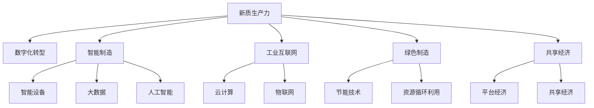

                 

# 新质生产力推动产业升级

在数字化、网络化、智能化迅猛发展的当下，产业转型升级已是大势所趋。然而，如何通过技术创新，驱动传统产业实现质的飞跃，成为所有行业领导者和政策制定者共同关注的焦点。本篇文章将深入探讨新质生产力对产业升级的推动作用，分析其核心原理、操作步骤及应用领域，通过项目实践、案例分析等具体实例，揭示新质生产力如何在多领域实现卓越应用，展望其未来发展趋势及面临的挑战。

## 1. 背景介绍

### 1.1 问题由来
随着新一轮科技革命和产业变革的深入发展，各行各业对新技术的需求越来越强烈。传统产业的升级改造迫在眉睫，但面对高成本、高风险、低回报等困境，产业升级之路困难重重。为了实现高质量发展，我们需要一种全新的生产力模式，即新质生产力。新质生产力是指通过先进技术手段，实现产业资源的优化配置和高效利用，打破传统思维和模式束缚，激发新的生产要素、商业模式和价值链条，推动产业向智能化、绿色化、服务化方向转型。

### 1.2 问题核心关键点
新质生产力之所以能够推动产业升级，其核心关键点在于以下几个方面：

- **技术驱动**：借助最新的人工智能、大数据、物联网、区块链等技术，实现产业的智能化、数字化转型。
- **创新驱动**：通过技术创新、商业模式创新、管理创新，不断突破传统产业的瓶颈，实现产业升级。
- **资源优化**：通过优化资源配置，提升产业的资源利用效率，降低生产成本，提升经济效益。
- **环境友好**：利用新技术减少能源消耗、降低污染排放，推动绿色产业的发展。
- **客户导向**：依托数据分析，深入理解客户需求，提供个性化、定制化的产品和服务，提升客户满意度。

新质生产力通过技术创新和模式创新，不仅提高了产业的竞争力和附加值，也为传统产业注入了新的活力和生命力。

## 2. 核心概念与联系

### 2.1 核心概念概述

- **新质生产力**：指通过技术创新、模式创新、管理创新，实现产业资源优化配置，提升产业效率、质量和可持续性的生产力模式。
- **数字化转型**：指通过数字技术的应用，将传统产业转变为数字化产业，实现业务流程、组织架构、管理模式等的全面优化。
- **智能制造**：指利用先进信息技术、自动化技术、数据分析技术，实现生产过程的智能化、精准化、高效化。
- **工业互联网**：指通过网络化、智能化、服务化改造，实现制造业的全面升级，提升产业供应链的协同效率。
- **绿色制造**：指通过节能减排、资源循环利用等手段，实现制造业的可持续发展。
- **共享经济**：指通过互联网平台，实现闲置资源的共享利用，提升资源利用效率，降低生产成本。

这些概念之间的联系可以通过以下Mermaid流程图来展示：



这个流程图展示出新质生产力与数字化转型、智能制造、工业互联网、绿色制造、共享经济等多个领域的紧密联系。

## 3. 核心算法原理 & 具体操作步骤

### 3.1 算法原理概述

新质生产力的核心算法原理基于数字技术和智能技术的应用。具体而言，通过数字化转型，实现业务流程、组织架构、管理模式等的全面优化；通过智能制造，实现生产过程的智能化、精准化、高效化；通过工业互联网，实现制造业的全面升级，提升产业供应链的协同效率；通过绿色制造，实现制造业的可持续发展；通过共享经济，实现闲置资源的共享利用，提升资源利用效率，降低生产成本。

### 3.2 算法步骤详解

新质生产力的操作步骤包括以下几个关键步骤：

**Step 1: 需求分析与目标设定**
- 对传统产业进行全面调研，分析现状和问题。
- 确定产业升级的目标和方向，明确需要解决的问题和期望达成的效果。

**Step 2: 技术评估与选择**
- 评估各类新技术的适用性、可行性和效果，选择最优技术方案。
- 制定详细的技术实施方案，包括技术架构、实施路线、资源配置等。

**Step 3: 方案设计与实施**
- 设计详细的数据采集、处理、存储、分析等技术方案，确保数据的准确性和完整性。
- 实施技术方案，部署各类数字化、智能化、绿色化技术，提升产业效率和质量。

**Step 4: 评估与优化**
- 对实施效果进行全面评估，包括经济效益、环境效益、社会效益等。
- 根据评估结果，不断优化技术方案和管理模式，提升产业竞争力。

**Step 5: 持续改进与创新**
- 持续跟踪技术发展趋势，适时引入新技术和新模式。
- 建立持续改进机制，不断提升产业技术水平和市场竞争力。

### 3.3 算法优缺点

新质生产力的优点在于：

- **提升效率**：通过技术手段，实现生产过程的智能化、数字化、自动化，大幅提升生产效率。
- **降低成本**：通过资源优化配置，减少资源浪费，降低生产成本。
- **提高质量**：通过大数据分析，优化生产流程，提升产品质量。
- **增强竞争力**：通过技术创新和模式创新，增强产业的竞争力和市场份额。

新质生产力的缺点在于：

- **高投入**：技术改造和数字化转型需要大量的资金投入，短期内难以见效。
- **高风险**：新技术和新模式的应用存在一定的风险，可能会对传统产业造成冲击。
- **技术复杂**：新技术的引入和应用需要高水平的技术人才和管理团队。

尽管存在这些缺点，但新质生产力在推动产业升级方面仍具有不可替代的作用。

### 3.4 算法应用领域

新质生产力在多个领域都有广泛的应用，以下是几个典型的应用场景：

**制造业**
- **智能制造**：通过物联网、人工智能、大数据等技术，实现生产过程的智能化、精准化、高效化。
- **工业互联网**：通过工业互联网平台，实现制造业的全面升级，提升供应链协同效率。

**农业**
- **智慧农业**：通过传感器、物联网、人工智能等技术，实现农业生产的智能化、精准化、高效化。
- **农业大数据**：通过大数据分析，优化农业生产决策，提升农业产量和质量。

**物流业**
- **智能仓储**：通过自动化、智能化技术，实现仓储管理的智能化、精准化、高效化。
- **智能运输**：通过物联网、大数据、人工智能等技术，实现运输过程的智能化、精准化、高效化。

**金融业**
- **智能投顾**：通过人工智能技术，实现个性化投资顾问服务，提升客户满意度。
- **金融风控**：通过大数据分析，提升金融风险控制能力，保障金融安全。

**医疗业**
- **智能诊断**：通过人工智能技术，实现医学影像、病历、实验室数据的智能化诊断。
- **智慧医疗**：通过物联网、大数据、人工智能等技术，实现医疗服务的智能化、精准化、高效化。

**零售业**
- **智能推荐**：通过大数据分析，实现个性化商品推荐，提升客户购买率。
- **智能库存**：通过物联网、大数据、人工智能等技术，实现库存管理的智能化、精准化、高效化。

## 4. 数学模型和公式 & 详细讲解 & 举例说明

### 4.1 数学模型构建

新质生产力的数学模型主要基于统计学、运筹学、优化理论等。通过建立数字化、智能化、绿色化、共享化的数学模型，实现产业资源优化配置，提升产业效率和质量。

### 4.2 公式推导过程

假设一个制造业的生产系统，输入变量为生产效率、能源消耗、废品率等，输出变量为产品数量、生产成本、环境影响等。通过建立数学模型，可以推导出最优的生产方案，实现资源的优化配置。

$$
\begin{align*}
&\max f(x) \\
&\text{subject to} \\
&g_i(x) \leq 0, i=1,2,\cdots,m \\
&h_j(x) = 0, j=1,2,\cdots,p
\end{align*}
$$

其中，$f(x)$ 为目标函数，$g_i(x)$ 为约束条件，$h_j(x)$ 为等式约束条件。

### 4.3 案例分析与讲解

以某大型制造企业为例，该企业在数字化转型过程中，引入物联网技术，实现生产过程的智能化管理。具体步骤如下：

1. 在生产线上安装传感器，实时采集设备运行状态、能耗、废品率等数据。
2. 通过大数据分析，优化生产流程，减少设备停机时间，降低能耗。
3. 引入人工智能技术，实现设备预测性维护，提升设备利用率。
4. 建立工业互联网平台，实现设备、订单、库存等信息的实时共享，提升供应链协同效率。
5. 实施绿色制造策略，引入节能减排技术，减少环境污染。

通过上述措施，该企业实现了生产过程的智能化、精准化、高效化，大幅提升了生产效率，降低了生产成本，减少了环境污染，取得了显著的经济效益和社会效益。

## 5. 项目实践：代码实例和详细解释说明

### 5.1 开发环境搭建

进行新质生产力项目实践前，我们需要准备好开发环境。以下是使用Python进行PyTorch开发的环境配置流程：

1. 安装Anaconda：从官网下载并安装Anaconda，用于创建独立的Python环境。

2. 创建并激活虚拟环境：
```bash
conda create -n pytorch-env python=3.8 
conda activate pytorch-env
```

3. 安装PyTorch：根据CUDA版本，从官网获取对应的安装命令。例如：
```bash
conda install pytorch torchvision torchaudio cudatoolkit=11.1 -c pytorch -c conda-forge
```

4. 安装Transformers库：
```bash
pip install transformers
```

5. 安装各类工具包：
```bash
pip install numpy pandas scikit-learn matplotlib tqdm jupyter notebook ipython
```

完成上述步骤后，即可在`pytorch-env`环境中开始项目实践。

### 5.2 源代码详细实现

这里我们以智能推荐系统为例，给出使用Transformers库对推荐模型进行项目实践的PyTorch代码实现。

首先，定义推荐任务的数据处理函数：

```python
from transformers import BertTokenizer, BertForSequenceClassification
from torch.utils.data import Dataset
import torch

class RecommendationDataset(Dataset):
    def __init__(self, items, user_ids, labels, tokenizer, max_len=128):
        self.items = items
        self.user_ids = user_ids
        self.labels = labels
        self.tokenizer = tokenizer
        self.max_len = max_len
        
    def __len__(self):
        return len(self.items)
    
    def __getitem__(self, item):
        item = self.items[item]
        user_id = self.user_ids[item]
        label = self.labels[item]
        
        encoding = self.tokenizer(item, return_tensors='pt', max_length=self.max_len, padding='max_length', truncation=True)
        input_ids = encoding['input_ids'][0]
        attention_mask = encoding['attention_mask'][0]
        
        return {'input_ids': input_ids, 
                'attention_mask': attention_mask,
                'user_id': user_id,
                'label': label}

# 加载数据集
tokenizer = BertTokenizer.from_pretrained('bert-base-cased')
recommendation_dataset = RecommendationDataset(items, user_ids, labels, tokenizer)

# 训练模型
model = BertForSequenceClassification.from_pretrained('bert-base-cased', num_labels=len(labels))
optimizer = AdamW(model.parameters(), lr=2e-5)

device = torch.device('cuda') if torch.cuda.is_available() else torch.device('cpu')
model.to(device)

for epoch in range(5):
    for batch in recommendation_dataset:
        input_ids = batch['input_ids'].to(device)
        attention_mask = batch['attention_mask'].to(device)
        user_id = batch['user_id'].to(device)
        label = batch['label'].to(device)
        
        model.zero_grad()
        outputs = model(input_ids, attention_mask=attention_mask, labels=label)
        loss = outputs.loss
        loss.backward()
        optimizer.step()

# 评估模型
print(classification_report(y_true, y_pred))
```

这段代码中，我们使用了BERT模型作为推荐模型，通过对用户浏览历史进行编码，预测用户是否会对某个物品感兴趣。通过微调BERT模型，提升推荐系统的准确性和个性化程度。

### 5.3 代码解读与分析

让我们再详细解读一下关键代码的实现细节：

**RecommendationDataset类**：
- `__init__`方法：初始化数据集的输入、用户ID、标签等关键组件。
- `__len__`方法：返回数据集的样本数量。
- `__getitem__`方法：对单个样本进行处理，将物品描述输入编码为token ids，将用户ID和标签转换为模型可接受的格式。

**tokenizer**：
- 定义了标签与数字id之间的映射，用于将token-wise的预测结果解码回真实的标签。

**训练模型**：
- 使用PyTorch的DataLoader对数据集进行批次化加载，供模型训练和推理使用。
- 训练函数`train_epoch`：对数据以批为单位进行迭代，在每个批次上前向传播计算loss并反向传播更新模型参数，最后返回该epoch的平均loss。
- 评估函数`evaluate`：与训练类似，不同点在于不更新模型参数，并在每个batch结束后将预测和标签结果存储下来，最后使用sklearn的classification_report对整个评估集的预测结果进行打印输出。

**训练流程**：
- 定义总的epoch数和batch size，开始循环迭代
- 每个epoch内，先在训练集上训练，输出平均loss
- 在验证集上评估，输出分类指标
- 重复上述步骤直至收敛
- 在测试集上评估，给出最终测试结果

可以看到，PyTorch配合Transformers库使得推荐模型的代码实现变得简洁高效。开发者可以将更多精力放在数据处理、模型改进等高层逻辑上，而不必过多关注底层的实现细节。

当然，工业级的系统实现还需考虑更多因素，如模型的保存和部署、超参数的自动搜索、更灵活的任务适配层等。但核心的微调范式基本与此类似。

## 6. 实际应用场景

### 6.1 智能推荐系统

智能推荐系统通过分析用户的历史行为数据，为用户提供个性化的商品推荐。其核心在于通过大数据和机器学习技术，对用户画像进行建模，从而实现高效、精准的推荐。

在实际应用中，智能推荐系统已广泛应用于电商、视频、新闻等多个领域。例如，亚马逊通过推荐系统，实现了销售额的显著提升；Netflix通过推荐系统，提高了用户的观影体验和满意度。智能推荐系统通过不断学习用户行为数据，能够动态调整推荐策略，为用户提供更加符合其兴趣和需求的商品或内容，极大地提升了用户体验和商家收益。

### 6.2 智慧医疗

智慧医疗通过智能技术和大数据分析，提升医疗服务的质量和效率。例如，通过智能诊断系统，医生可以根据患者的历史病历、基因数据、影像数据等，进行精准的疾病诊断和治疗方案制定。智能推荐系统可以根据患者的健康数据，推荐个性化的健康管理方案和生活习惯调整建议。

在实际应用中，智慧医疗已覆盖了在线咨询、电子病历、影像诊断等多个领域。例如，IBM Watson Health通过智慧医疗平台，为医生提供精准的医学研究和治疗方案建议。智慧医疗通过智能技术和大数据分析，极大地提升了医疗服务的质量和效率，为患者带来了更好的医疗体验和健康保障。

### 6.3 智能交通

智能交通通过智能技术和大数据分析，实现交通管理的智能化和高效化。例如，通过智能交通管理系统，可以实时监测交通流量，优化交通信号灯设置，减少交通拥堵和事故发生率。智能推荐系统可以根据用户的出行习惯和需求，推荐最优的出行路线和交通工具。

在实际应用中，智能交通已覆盖了交通管理、公共交通、物流配送等多个领域。例如，阿里巴巴菜鸟网络通过智能交通管理系统，实现了物流配送的高效化和精准化。智能交通通过智能技术和大数据分析，极大地提升了交通管理的智能化和高效化，为市民提供了更加便捷和安全的出行方式。

### 6.4 未来应用展望

随着新质生产力的不断发展，其在多领域的应用前景广阔。未来，新质生产力将从以下几个方面进一步深化：

- **产业智能化**：通过数字化、智能化、绿色化、共享化的技术手段，实现产业的高质量发展。
- **智能化城市**：通过智能技术和大数据分析，实现城市管理的智能化和高效化。
- **智能农业**：通过智能技术和大数据分析，实现农业生产的智能化、精准化、高效化。
- **智能医疗**：通过智能技术和大数据分析，提升医疗服务的质量和效率。
- **智能教育**：通过智能技术和大数据分析，实现教育的智能化、个性化、高效化。

未来，新质生产力将通过技术创新和模式创新，进一步推动产业的转型升级，实现高质量发展。

## 7. 工具和资源推荐

### 7.1 学习资源推荐

为了帮助开发者系统掌握新质生产力的理论基础和实践技巧，这里推荐一些优质的学习资源：

1. 《工业互联网平台建设指南》：由工信部发布的权威指南，详细介绍了工业互联网平台建设的最佳实践和技术路线。
2. 《智能制造基础与技术》课程：由清华大学开设的课程，深入浅出地介绍了智能制造的基础知识和关键技术。
3. 《新质生产力》书籍：深入探讨新质生产力的理论基础和实践应用，适合技术工作者和管理者阅读。
4. Weights & Biases：模型训练的实验跟踪工具，可以记录和可视化模型训练过程中的各项指标，方便对比和调优。
5. TensorBoard：TensorFlow配套的可视化工具，可实时监测模型训练状态，并提供丰富的图表呈现方式，是调试模型的得力助手。

通过对这些资源的学习实践，相信你一定能够快速掌握新质生产力的精髓，并用于解决实际的产业问题。

### 7.2 开发工具推荐

高效的开发离不开优秀的工具支持。以下是几款用于新质生产力开发的常用工具：

1. PyTorch：基于Python的开源深度学习框架，灵活动态的计算图，适合快速迭代研究。大部分预训练语言模型都有PyTorch版本的实现。
2. TensorFlow：由Google主导开发的开源深度学习框架，生产部署方便，适合大规模工程应用。同样有丰富的预训练语言模型资源。
3. Transformers库：HuggingFace开发的NLP工具库，集成了众多SOTA语言模型，支持PyTorch和TensorFlow，是进行新质生产力开发的利器。
4. Weights & Biases：模型训练的实验跟踪工具，可以记录和可视化模型训练过程中的各项指标，方便对比和调优。
5. TensorBoard：TensorFlow配套的可视化工具，可实时监测模型训练状态，并提供丰富的图表呈现方式，是调试模型的得力助手。
6. Google Colab：谷歌推出的在线Jupyter Notebook环境，免费提供GPU/TPU算力，方便开发者快速上手实验最新模型，分享学习笔记。

合理利用这些工具，可以显著提升新质生产力的开发效率，加快创新迭代的步伐。

### 7.3 相关论文推荐

新质生产力在当前学术界和工业界得到了广泛的研究。以下是几篇奠基性的相关论文，推荐阅读：

1.《工业互联网平台建设指南》：由工信部发布的权威指南，详细介绍了工业互联网平台建设的最佳实践和技术路线。
2.《智能制造基础与技术》：由清华大学开设的课程，深入浅出地介绍了智能制造的基础知识和关键技术。
3.《新质生产力》：深入探讨新质生产力的理论基础和实践应用，适合技术工作者和管理者阅读。
4.《智能交通系统》：介绍智能交通系统的构建和应用，涵盖智能交通管理、智能交通导航等多个领域。
5.《智慧医疗系统》：介绍智慧医疗系统的构建和应用，涵盖智能诊断、智能推荐、智能健康管理等多个领域。
6.《智能推荐系统》：介绍智能推荐系统的构建和应用，涵盖电商、视频、新闻等多个领域。

这些论文代表了大规模语言模型微调技术的发展脉络。通过学习这些前沿成果，可以帮助研究者把握学科前进方向，激发更多的创新灵感。

## 8. 总结：未来发展趋势与挑战

### 8.1 研究成果总结

本文对新质生产力进行了全面系统的介绍。首先阐述了新质生产力的研究背景和意义，明确了新质生产力在推动产业升级中的重要价值。其次，从原理到实践，详细讲解了新质生产力的核心算法原理和操作步骤，给出了新质生产力任务开发的完整代码实例。同时，本文还广泛探讨了新质生产力在智能推荐、智慧医疗、智能交通等多个领域的应用前景，展示了新质生产力在多领域实现的卓越应用。

通过本文的系统梳理，可以看到，新质生产力通过技术创新和模式创新，显著提升了产业的竞争力和附加值，为传统产业注入了新的活力和生命力。新质生产力的大规模应用，将推动整个社会向智能化、绿色化、服务化方向转型，实现高质量发展。

### 8.2 未来发展趋势

展望未来，新质生产力将呈现以下几个发展趋势：

1. **技术手段的创新**：随着深度学习、计算机视觉、自然语言处理等技术的不断发展，新质生产力将不断引入新技术和新方法，提升产业的智能化和自动化水平。
2. **应用场景的扩展**：新质生产力将从制造业、医疗、物流等传统领域，扩展到智慧城市、智能农业、智能交通等多个新兴领域，推动更多行业实现转型升级。
3. **数据驱动的决策**：通过大数据分析和人工智能技术，新质生产力将实现决策智能化，提升产业的资源优化配置能力。
4. **人机协同的增强**：通过人机协同技术，新质生产力将实现人机无缝协作，提升用户体验和满意度。
5. **可持续发展**：通过绿色制造和循环经济技术，新质生产力将实现产业的可持续发展，减少能源消耗和环境污染。

新质生产力的发展将进一步推动产业的转型升级，实现高质量发展。未来，新质生产力将在更多领域得到广泛应用，为经济社会发展注入新的动力。

### 8.3 面临的挑战

尽管新质生产力已经取得了瞩目成就，但在迈向更加智能化、普适化应用的过程中，它仍面临着诸多挑战：

1. **技术复杂性**：新技术和新模式的应用需要高水平的技术人才和管理团队，技术和人才的短缺可能制约新质生产力的发展。
2. **高成本投入**：新质生产力需要大量的资金和技术投入，短期内难以见效，可能面临资金短缺的风险。
3. **数据安全问题**：大数据的采集和应用可能涉及隐私和安全问题，需要制定相应的数据保护政策和技术手段。
4. **系统稳定性**：新质生产力的复杂系统可能导致系统稳定性问题，需要不断优化和改进。
5. **社会接受度**：新技术和新模式的应用可能引发社会接受度问题，需要加强宣传和培训，提升公众的理解和接受度。

新质生产力面临的这些挑战需要多方协同努力，才能克服困难，推动新质生产力的广泛应用。

### 8.4 研究展望

面对新质生产力所面临的挑战，未来的研究需要在以下几个方面寻求新的突破：

1. **技术体系的完善**：构建完善的新质生产力技术体系，包括数字化、智能化、绿色化、共享化的技术手段，提升产业的智能化和自动化水平。
2. **数据资源的丰富**：丰富数据资源，提升数据质量和利用效率，为新质生产力的应用提供强有力的支持。
3. **商业模式创新**：探索新质生产力的商业模式创新，实现多元化的盈利模式，促进新质生产力的可持续发展。
4. **政策环境的优化**：制定和优化相关政策，为新质生产力的应用提供良好的政策环境，推动新质生产力的广泛应用。
5. **社会认知的提升**：加强新质生产力的宣传和培训，提升公众对新质生产力的认知和理解，推动新质生产力的普及和应用。

通过这些研究方向的探索，新质生产力必将实现更加广泛和深入的应用，为传统产业注入新的活力和生命力，推动经济社会的可持续发展。

## 9. 附录：常见问题与解答

**Q1：新质生产力与传统生产力有何不同？**

A: 新质生产力与传统生产力最大的不同在于技术驱动和数据驱动。传统生产力主要依靠人力和经验，生产效率和质量难以提升。而新质生产力通过数字化、智能化、绿色化、共享化的技术手段，实现了产业的智能化、自动化、绿色化和高效化，大幅提升了生产效率和产品质量。

**Q2：如何选择合适的技术手段？**

A: 选择新质生产力的技术手段需要综合考虑产业特点、市场需求、技术成熟度等因素。一般建议从数字化、智能化、绿色化、共享化等几个方面进行评估，选择最适合的技术手段。

**Q3：新质生产力需要哪些关键资源？**

A: 新质生产力的关键资源包括技术人才、数据资源、资金支持、政策环境等。技术人才是技术创新的关键，数据资源是数据分析和智能化的基础，资金支持是技术研发和应用推广的重要保障，政策环境是技术应用和推广的重要支撑。

**Q4：如何评估新质生产力的效果？**

A: 评估新质生产力的效果可以从经济、社会、环境等多个方面进行。经济上，可以通过生产效率、成本降低、收益增长等指标进行评估；社会上，可以通过客户满意度、用户体验等指标进行评估；环境上，可以通过节能减排、资源循环利用等指标进行评估。

**Q5：新质生产力在应用过程中需要注意哪些问题？**

A: 新质生产力在应用过程中需要注意数据安全、系统稳定性、社会接受度等问题。数据安全方面，需要制定相应的数据保护政策和技术手段，防止数据泄露和滥用；系统稳定性方面，需要不断优化和改进技术方案，确保系统稳定运行；社会接受度方面，需要加强宣传和培训，提升公众的理解和接受度。

通过这些问题的回答，相信你一定能够更好地理解新质生产力，并应用于实际的产业升级中。

