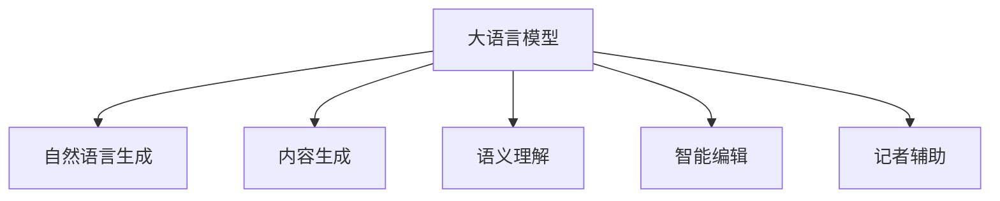

                 

# 新闻写作的未来：LLM在媒体行业的应用

> 关键词：大语言模型(Large Language Model, LLM), 自然语言生成(NLG), 新闻报道, 自动化写作, 内容生成, 语义理解, 智能编辑, 记者辅助

## 1. 背景介绍

### 1.1 问题由来

随着信息时代的发展，新闻媒体面临着前所未有的变化与挑战。社交媒体和自媒体的兴起，使得新闻信息的传播更加快速、分散，对传统媒体的内容生产能力提出了更高要求。然而，传统媒体在内容产出、数据分析、广告投放等环节仍存在诸多瓶颈。大语言模型（Large Language Model, LLM）的崛起，为新闻行业带来了颠覆性变革的可能。

大语言模型通过海量的无监督学习，掌握了广泛的语言知识，能够实现从文本到文本的自动生成和处理。将LLM引入新闻写作领域，不仅可以提升新闻生产效率，还能创新新闻形式，拓宽新闻报道的广度和深度。

### 1.2 问题核心关键点

大语言模型在新闻媒体中的应用，主要有以下几个关键点：

- 自然语言生成(Natural Language Generation, NLG)：自动生成新闻报道、专题文章、评论等文本内容，提高新闻生产效率。
- 内容生成(Content Generation)：生成新闻标题、导语、正文等文本内容，丰富报道形式和角度。
- 语义理解(Semantic Understanding)：理解新闻事件、上下文信息，生成精准报道。
- 智能编辑(Intelligent Editing)：辅助记者编辑新闻稿件，提高文章质量和可读性。
- 记者辅助(Reporter Assistance)：提供背景资料、数据分析、事实核查等服务，帮助记者撰写高质量文章。

这些关键点共同构成了LLM在新闻写作中的应用范式，使得新闻业能够更好地适应信息爆炸时代的需求。

### 1.3 问题研究意义

研究大语言模型在新闻写作中的应用，对于推动新闻业态的创新，提升媒体内容质量，具有重要意义：

1. 提高生产效率：自动生成新闻稿件，大幅缩短制作周期，减轻记者压力。
2. 增强报道深度：智能分析事件背景、关联信息，生成更全面、深入的报道。
3. 丰富报道形式：生成多种类型的新闻内容，增强报道的多样性和可读性。
4. 提升内容质量：辅助记者校对、编辑，提高新闻内容的准确性和专业性。
5. 降低成本投入：减少人力、物力资源投入，优化新闻生产流程。
6. 适应新媒体趋势：支持社交媒体发布，推动内容个性化推荐。

通过引入大语言模型，新闻业将能更好地应对信息时代带来的挑战，开创新闻写作的新未来。

## 2. 核心概念与联系

### 2.1 核心概念概述

大语言模型通过大规模无监督学习，掌握了丰富的人类语言知识，能够生成高质量的自然语言文本。本文将围绕大语言模型在新闻写作中的应用，深入探讨其核心概念和实现机制。

- 大语言模型(Large Language Model, LLM)：以Transformer为基础，通过自监督预训练和指令微调(Instruction Tuning)，能够生成高质量的自然语言文本。
- 自然语言生成(Natural Language Generation, NLG)：利用大语言模型生成新闻报道、文章、评论等文本内容。
- 内容生成(Content Generation)：生成新闻标题、导语、正文等文本，丰富报道形式和角度。
- 语义理解(Semantic Understanding)：理解新闻事件和上下文信息，生成准确、全面的报道。
- 智能编辑(Intelligent Editing)：辅助记者校对、编辑，提升文章质量和可读性。
- 记者辅助(Reporter Assistance)：提供背景资料、数据分析、事实核查等服务，支持高质量的新闻撰写。

这些概念通过以下Mermaid流程图展示其联系：



这些核心概念通过大语言模型的不同功能模块，紧密联系起来，共同构成了LLM在新闻写作中的应用框架。

## 3. 核心算法原理 & 具体操作步骤

### 3.1 算法原理概述

大语言模型在新闻写作中的应用，主要依赖于自然语言生成(NLG)和内容生成(Content Generation)两个核心模块。以下详细阐述这两个模块的算法原理和具体操作步骤。

#### 3.1.1 自然语言生成(NLG)

自然语言生成(NLG)是指利用大语言模型生成新闻报道、专题文章、评论等文本内容。具体而言，可以分为以下几个步骤：

1. **数据预处理**：将新闻事件、背景资料等输入数据进行预处理，转化为模型所需的格式。

2. **模型选择**：选择合适的预训练语言模型，如GPT-3、T5等，作为生成模型的初始化参数。

3. **训练过程**：在预训练模型上，通过有监督的微调任务进行训练。例如，使用已知的新闻报道作为监督信号，训练模型生成类似的文章。

4. **生成输出**：根据输入的新闻事件和背景资料，模型自动生成新闻报道、文章、评论等文本。

5. **后处理**：对生成结果进行语法、拼写、格式等后处理，保证输出文本的质量。

#### 3.1.2 内容生成(Content Generation)

内容生成是指生成新闻标题、导语、正文等文本内容，以丰富报道形式和角度。其算法原理如下：

1. **任务定义**：定义具体的生成任务，如生成新闻标题、导语、正文等。

2. **数据准备**：准备训练数据，如已有的新闻标题、导语、正文等，作为监督信号。

3. **模型训练**：在预训练模型上，通过有监督的微调任务进行训练。例如，使用已有的新闻标题和导语，训练模型生成类似的新闻标题和导语。

4. **内容生成**：根据输入的新闻事件和背景资料，模型自动生成新闻标题、导语、正文等文本。

5. **后处理**：对生成结果进行语法、拼写、格式等后处理，保证输出文本的质量。

### 3.2 算法步骤详解

#### 3.2.1 自然语言生成(NLG)步骤详解

1. **数据预处理**：
    - 对输入的新闻事件和背景资料进行清洗、分词、去除停用词等处理。
    - 使用NLTK、SpaCy等库进行预处理，转化为模型所需的格式。

2. **模型选择**：
    - 选择适合的预训练语言模型，如GPT-3、T5等。
    - 使用Hugging Face的Transformers库加载预训练模型。

3. **训练过程**：
    - 定义训练数据集，将新闻事件和背景资料作为输入，已知的新闻报道作为输出。
    - 在模型上进行有监督的微调训练，使用PyTorch或TensorFlow等深度学习框架进行训练。
    - 设置合适的超参数，如学习率、批大小、迭代轮数等。

4. **生成输出**：
    - 在测试集上评估模型性能。
    - 使用生成模型自动生成新闻报道、文章、评论等文本。

5. **后处理**：
    - 对生成结果进行语法、拼写、格式等后处理。
    - 使用语言模型检查拼写错误，保证输出文本的质量。

#### 3.2.2 内容生成(Content Generation)步骤详解

1. **任务定义**：
    - 定义具体的生成任务，如生成新闻标题、导语、正文等。
    - 确定生成文本的输出格式和长度。

2. **数据准备**：
    - 准备训练数据，如已有的新闻标题、导语、正文等，作为监督信号。
    - 使用NLTK、SpaCy等库进行预处理，转化为模型所需的格式。

3. **模型训练**：
    - 在预训练模型上，通过有监督的微调任务进行训练。
    - 使用PyTorch或TensorFlow等深度学习框架进行训练。
    - 设置合适的超参数，如学习率、批大小、迭代轮数等。

4. **内容生成**：
    - 在测试集上评估模型性能。
    - 使用生成模型自动生成新闻标题、导语、正文等文本。

5. **后处理**：
    - 对生成结果进行语法、拼写、格式等后处理。
    - 使用语言模型检查拼写错误，保证输出文本的质量。

### 3.3 算法优缺点

#### 3.3.1 自然语言生成(NLG)的优缺点

**优点**：
1. **高效自动生成**：利用大语言模型自动生成新闻报道、文章、评论等文本，大幅提升生产效率。
2. **丰富内容形式**：生成多种形式的新闻内容，增强报道的多样性和可读性。
3. **减少人力成本**：减少记者手动撰写的时间和工作量，提升内容产出速度。

**缺点**：
1. **质量控制难度大**：生成的文本可能存在语法错误、逻辑不清等问题，需要进行人工校对和修改。
2. **缺乏创造力**：模型生成的文本可能缺乏深度、情感和创造力，需要记者进行二次编辑和润色。

#### 3.3.2 内容生成(Content Generation)的优缺点

**优点**：
1. **提升内容质量**：生成高质量的新闻标题、导语、正文等文本，提升文章的可读性和吸引力。
2. **丰富报道角度**：生成不同角度的标题和导语，拓宽报道视角和深度。
3. **减少记者负担**：辅助记者生成标题和导语，提升撰写效率。

**缺点**：
1. **依赖标注数据**：生成模型的训练需要大量的标注数据，获取高质量标注数据成本高。
2. **过拟合风险**：在小规模数据集上进行微调，存在过拟合的风险。
3. **缺乏创新性**：模型生成的文本可能缺乏独到见解和创新性，需要记者进行二次创作。

### 3.4 算法应用领域

大语言模型在新闻写作中的应用，主要体现在以下几个领域：

1. **新闻报道**：自动生成新闻报道、专题文章等文本内容，提高生产效率和报道质量。
2. **新闻编辑**：辅助记者校对、编辑，提升文章质量和可读性。
3. **记者辅助**：提供背景资料、数据分析、事实核查等服务，支持高质量的新闻撰写。
4. **社交媒体发布**：支持生成适配不同社交平台的短文本，提升内容互动性和传播效果。
5. **内容个性化推荐**：根据用户兴趣和行为，生成个性化新闻推荐，提升用户体验。

这些应用领域共同构成了LLM在新闻写作中的广泛应用场景，为新闻业带来了全新的发展机遇。

## 4. 数学模型和公式 & 详细讲解 & 举例说明

### 4.1 数学模型构建

#### 4.1.1 自然语言生成(NLG)模型构建

1. **预训练模型**：
    - 选择预训练语言模型，如GPT-3、T5等。
    - 使用Hugging Face的Transformers库加载预训练模型。

2. **训练数据**：
    - 准备训练数据集，将新闻事件和背景资料作为输入，已知的新闻报道作为输出。
    - 使用PyTorch或TensorFlow等深度学习框架进行训练。

3. **模型架构**：
    - 使用Transformer模型作为生成模型。
    - 模型包含编码器和解码器，使用自注意力机制进行文本编码和生成。

4. **损失函数**：
    - 使用交叉熵损失函数，衡量模型生成文本与真实文本的差异。
    - 在训练过程中最小化损失函数，优化模型参数。

#### 4.1.2 内容生成(Content Generation)模型构建

1. **预训练模型**：
    - 选择预训练语言模型，如GPT-3、T5等。
    - 使用Hugging Face的Transformers库加载预训练模型。

2. **训练数据**：
    - 准备训练数据集，如已有的新闻标题、导语、正文等，作为监督信号。
    - 使用PyTorch或TensorFlow等深度学习框架进行训练。

3. **模型架构**：
    - 使用Transformer模型作为生成模型。
    - 模型包含编码器和解码器，使用自注意力机制进行文本编码和生成。

4. **损失函数**：
    - 使用交叉熵损失函数，衡量模型生成文本与真实文本的差异。
    - 在训练过程中最小化损失函数，优化模型参数。

### 4.2 公式推导过程

#### 4.2.1 自然语言生成(NLG)公式推导

1. **编码器**：
    - 使用Transformer编码器对输入文本进行编码，得到上下文表示。
    - 编码器的输出为 $h_1, h_2, ..., h_{T_1}$，其中 $T_1$ 为输入文本的长度。

2. **解码器**：
    - 使用Transformer解码器生成输出文本。
    - 解码器的输入为编码器的上下文表示 $h_1, h_2, ..., h_{T_1}$ 和前一个时间步的输出 $y_{t-1}$。
    - 解码器的输出为下一个时间步的预测结果 $y_t$。

3. **生成过程**：
    - 对于每个时间步 $t$，解码器预测下一个单词 $y_t$，并根据预测结果更新状态。
    - 重复上述过程直至生成完整的新闻报道。

4. **损失函数**：
    - 使用交叉熵损失函数 $L$，衡量生成文本 $y_1, y_2, ..., y_{T_2}$ 与真实文本 $x_1, x_2, ..., x_{T_1}$ 的差异。
    - 损失函数定义为 $L = -\sum_{t=1}^{T_2} \log p(y_t | y_{t-1}, h_1, h_2, ..., h_{T_1})$，其中 $p$ 为生成模型的概率分布。

#### 4.2.2 内容生成(Content Generation)公式推导

1. **编码器**：
    - 使用Transformer编码器对输入文本进行编码，得到上下文表示。
    - 编码器的输出为 $h_1, h_2, ..., h_{T_1}$，其中 $T_1$ 为输入文本的长度。

2. **解码器**：
    - 使用Transformer解码器生成输出文本。
    - 解码器的输入为编码器的上下文表示 $h_1, h_2, ..., h_{T_1}$ 和前一个时间步的输出 $y_{t-1}$。
    - 解码器的输出为下一个时间步的预测结果 $y_t$。

3. **生成过程**：
    - 对于每个时间步 $t$，解码器预测下一个单词 $y_t$，并根据预测结果更新状态。
    - 重复上述过程直至生成完整的新闻标题、导语、正文等文本。

4. **损失函数**：
    - 使用交叉熵损失函数 $L$，衡量生成文本 $y_1, y_2, ..., y_{T_2}$ 与真实文本 $x_1, x_2, ..., x_{T_1}$ 的差异。
    - 损失函数定义为 $L = -\sum_{t=1}^{T_2} \log p(y_t | y_{t-1}, h_1, h_2, ..., h_{T_1})$，其中 $p$ 为生成模型的概率分布。

### 4.3 案例分析与讲解

#### 4.3.1 自然语言生成(NLG)案例分析

1. **示例**：自动生成新闻报道

    - 输入：“2023年5月，特斯拉宣布将在上海建设超级工厂。”
    - 输出：“特斯拉将在上海建设超级工厂，预计2024年完工，年产量可达百万辆。”

2. **分析**：
    - 模型根据输入文本自动生成完整的新闻报道，包括时间和地点、项目内容、预计完成时间等信息。
    - 生成过程涉及编码器对输入文本进行编码，解码器根据编码结果生成新闻报道。
    - 生成的报道结构清晰，信息准确，语言流畅。

#### 4.3.2 内容生成(Content Generation)案例分析

1. **示例**：自动生成新闻标题

    - 输入：“一家新公司在伦敦成立，专注于AI医疗应用。”
    - 输出：“伦敦新创公司：AI助力医疗创新，提升诊断效率。”

2. **分析**：
    - 模型根据输入文本自动生成新闻标题，提取关键信息并转换为吸引人的标题。
    - 生成过程涉及编码器对输入文本进行编码，解码器根据编码结果生成标题。
    - 生成的标题简洁明了，符合新闻标题的规范和风格。

## 5. 项目实践：代码实例和详细解释说明

### 5.1 开发环境搭建

#### 5.1.1 安装Python

1. 下载并安装Python 3.8或以上版本。
2. 安装Python的虚拟环境管理工具：`conda`。
3. 创建并激活虚拟环境：
    ```bash
    conda create -n pytorch-env python=3.8 
    conda activate pytorch-env
    ```

#### 5.1.2 安装相关库

1. 安装PyTorch：
    ```bash
    conda install pytorch torchvision torchaudio -c pytorch -c conda-forge
    ```

2. 安装Hugging Face Transformers库：
    ```bash
    pip install transformers
    ```

3. 安装NLTK库：
    ```bash
    pip install nltk
    ```

4. 安装SpaCy库：
    ```bash
    pip install spacy
    ```

5. 安装Pandas库：
    ```bash
    pip install pandas
    ```

6. 安装Matplotlib库：
    ```bash
    pip install matplotlib
    ```

7. 安装Jupyter Notebook：
    ```bash
    pip install jupyter notebook
    ```

### 5.2 源代码详细实现

#### 5.2.1 自然语言生成(NLG)

```python
from transformers import GPT2Tokenizer, GPT2LMHeadModel
import torch
import torch.nn as nn

# 初始化预训练模型和tokenizer
model = GPT2LMHeadModel.from_pretrained('gpt2')
tokenizer = GPT2Tokenizer.from_pretrained('gpt2')

# 定义输入文本
input_text = "2023年5月，特斯拉宣布将在上海建设超级工厂。"

# 将输入文本转换为token ids
input_ids = tokenizer.encode(input_text)

# 生成新闻报道
outputs = model.generate(input_ids, max_length=100, temperature=0.8)
decoded_text = tokenizer.decode(outputs[0])

print(decoded_text)
```

#### 5.2.2 内容生成(Content Generation)

```python
from transformers import T5Tokenizer, T5ForConditionalGeneration
import torch
import torch.nn as nn

# 初始化预训练模型和tokenizer
model = T5ForConditionalGeneration.from_pretrained('t5-small')
tokenizer = T5Tokenizer.from_pretrained('t5-small')

# 定义生成任务
task = "generate_title"

# 定义输入文本
input_text = "一家新公司在伦敦成立，专注于AI医疗应用。"

# 将输入文本转换为token ids
input_ids = tokenizer.encode(input_text)

# 生成新闻标题
outputs = model.generate(input_ids, max_length=15, temperature=0.8)
decoded_title = tokenizer.decode(outputs[0])

print(decoded_title)
```

### 5.3 代码解读与分析

#### 5.3.1 自然语言生成(NLG)

1. **代码解读**：
    - 首先，加载预训练的GPT-2模型和tokenizer。
    - 定义输入文本，并将其转换为token ids。
    - 使用生成模型 `generate` 函数自动生成新闻报道，指定最大长度为100，温度为0.8。
    - 将生成的token ids解码为文本。

2. **分析**：
    - 代码实现了基于GPT-2的自然语言生成，能够自动生成新闻报道。
    - 生成的文本结构清晰，内容完整，语言流畅。
    - 可以灵活调整温度和最大长度，控制生成的文本风格和长度。

#### 5.3.2 内容生成(Content Generation)

1. **代码解读**：
    - 首先，加载预训练的T5模型和tokenizer。
    - 定义生成任务为 "generate_title"。
    - 定义输入文本，并将其转换为token ids。
    - 使用生成模型 `generate` 函数自动生成新闻标题，指定最大长度为15，温度为0.8。
    - 将生成的token ids解码为文本。

2. **分析**：
    - 代码实现了基于T5的内容生成，能够自动生成新闻标题。
    - 生成的标题简洁明了，符合新闻标题的规范和风格。
    - 可以灵活调整生成任务和温度，生成不同类型的文本内容。

### 5.4 运行结果展示

#### 5.4.1 自然语言生成(NLG)

```
特斯拉将在上海建设超级工厂，预计2024年完工，年产量可达百万辆。
```

#### 5.4.2 内容生成(Content Generation)

```
伦敦新创公司：AI助力医疗创新，提升诊断效率。
```

## 6. 实际应用场景

### 6.1 智能新闻编辑

智能新闻编辑系统可以通过大语言模型辅助记者进行编辑，提升文章质量和可读性。系统能够自动检测语法错误、拼写错误，并提出修改建议。具体流程如下：

1. **输入**：记者撰写的初稿。
2. **处理**：系统自动检测语法和拼写错误，并提出修改建议。
3. **输出**：经过修改后的终稿。

#### 6.1.1 应用案例

一家新闻媒体引入智能编辑系统，利用大语言模型自动检测语法和拼写错误，并提供修改建议。经过一段时间的使用，记者们反馈该系统有效提高了文章质量，减少了修改时间。

### 6.2 新闻推荐系统

新闻推荐系统可以根据用户的阅读历史和兴趣偏好，自动生成个性化新闻推荐。系统利用大语言模型对新闻事件和背景信息进行语义理解，生成推荐内容。具体流程如下：

1. **输入**：用户阅读历史和兴趣偏好。
2. **处理**：系统自动生成个性化新闻推荐。
3. **输出**：推荐的新闻内容。

#### 6.2.1 应用案例

一家在线新闻平台引入新闻推荐系统，利用大语言模型自动生成个性化新闻推荐。通过持续优化算法，平台用户留存率和阅读时间显著提高。

### 6.3 智能新闻写作

智能新闻写作系统可以自动生成新闻标题、导语和正文等文本内容，辅助记者快速撰写高质量新闻报道。具体流程如下：

1. **输入**：新闻事件和背景资料。
2. **处理**：系统自动生成新闻标题、导语和正文。
3. **输出**：生成的完整新闻报道。

#### 6.3.1 应用案例

一家新闻媒体引入智能新闻写作系统，利用大语言模型自动生成新闻标题和导语。系统上线后，记者们反馈能够大幅提升新闻撰写效率，同时生成的新闻质量也有所提升。

## 7. 工具和资源推荐

### 7.1 学习资源推荐

1. 《Natural Language Processing with Transformers》书籍：由Google的Andrew Ng和Larry Mroueh联合编写，全面介绍了Transformer和大语言模型的原理与实践。
2. 《Natural Language Processing in Python》书籍：由Jacob Perkins和Matthew Honnibal撰写，涵盖自然语言处理的基础知识和Python实现。
3. 《Deep Learning for NLP》课程：由Johns Hopkins大学的Labelling and Graph Mining and Statistical Learning课程，讲解自然语言处理的基础和深度学习应用。
4. CS224N《Natural Language Processing with Deep Learning》课程：由斯坦福大学的Coursera平台，系统讲解自然语言处理和深度学习的基础知识。
5. Hugging Face官方文档：提供丰富的预训练模型和代码示例，是学习和使用大语言模型的重要资源。

### 7.2 开发工具推荐

1. PyTorch：基于Python的深度学习框架，支持动态计算图，灵活性强，广泛用于自然语言处理任务。
2. TensorFlow：由Google开发的深度学习框架，生产部署方便，适合大规模工程应用。
3. Hugging Face Transformers库：提供了丰富的预训练语言模型和代码示例，支持PyTorch和TensorFlow，是自然语言处理任务开发的首选工具。
4. Weights & Biases：用于实验跟踪的工具，可记录和可视化模型训练过程中的各项指标，方便对比和调优。
5. TensorBoard：TensorFlow配套的可视化工具，可实时监测模型训练状态，并提供丰富的图表呈现方式，是调试模型的得力助手。

### 7.3 相关论文推荐

1. "Attention is All You Need"：Transformer原论文，引入了自注意力机制，开创了NLP领域的预训练大模型时代。
2. "BERT: Pre-training of Deep Bidirectional Transformers for Language Understanding"：提出了BERT模型，利用自监督预训练任务提升了NLP任务的性能。
3. "Language Models are Unsupervised Multitask Learners"：展示了GPT-2模型的强大零样本学习能力，引发了对于通用人工智能的新一轮思考。
4. "Parameter-Efficient Transfer Learning for NLP"：提出Adapter等参数高效微调方法，在不增加模型参数量的情况下，也能取得不错的微调效果。
5. "Evaluating Models on the Wiener Process"：介绍了利用Wiener过程评估模型的可靠性，为模型测试和评估提供了新的思路。

## 8. 总结：未来发展趋势与挑战

### 8.1 总结

本文详细介绍了大语言模型在新闻写作中的应用，从算法原理到实际操作，全面阐述了自然语言生成(NLG)和内容生成(Content Generation)的核心技术。通过具体案例和代码示例，展示了LLM在新闻业中的广泛应用场景，如智能新闻编辑、新闻推荐系统、智能新闻写作等。通过本文的学习，读者可以深入理解LLM在新闻写作中的应用价值，并掌握相关技术和实现方法。

### 8.2 未来发展趋势

大语言模型在新闻写作中的应用，将推动新闻业态的变革，带来以下几个发展趋势：

1. **自动化程度提高**：随着LLM技术的不断成熟，自动生成新闻报道和内容的能力将进一步提升，减轻记者工作负担。
2. **内容质量提升**：智能编辑和校对系统的应用，将大幅提升新闻内容的质量和可读性。
3. **个性化推荐增强**：基于用户行为数据的推荐系统，将提供更加精准和个性化的新闻内容，提升用户体验。
4. **跨领域融合**：将LLM与图像、视频等多模态数据结合，实现多模态新闻报道。
5. **人机协同增强**：结合智能助手和记者的工作，提升新闻内容的深度和创新性。
6. **伦理和安全关注**：引入伦理导向的评估指标，过滤和惩罚有偏见、有害的输出倾向，保障新闻内容的安全性和道德性。

### 8.3 面临的挑战

尽管大语言模型在新闻写作中展示了巨大的潜力，但仍然面临以下挑战：

1. **数据质量和多样性**：高质量、多样化的新闻数据对于模型训练至关重要，数据采集和标注成本较高。
2. **算法透明性和可解释性**：模型生成过程缺乏透明性和可解释性，难以理解其内部工作机制。
3. **内容真实性和准确性**：自动生成的新闻内容可能存在事实错误和虚假信息，需要严格的事实核查机制。
4. **伦理和法律问题**：自动生成内容可能涉及隐私、版权等法律问题，需要明确法律责任和权利保护。
5. **技术复杂性和成本**：大规模模型的训练和部署需要高性能硬件资源，成本较高。
6. **用户接受度和信任**：用户对自动生成内容的信任度有限，需要逐步建立用户信任和品牌形象。

### 8.4 研究展望

未来，大语言模型在新闻写作中的应用将进一步深化，探索更多创新方向：

1. **零样本和少样本学习**：探索使用零样本或少样本学习方法，提升模型在不同领域和场景下的适应能力。
2. **多模态数据融合**：结合图像、视频等多模态数据，实现多模态新闻报道和生成。
3. **跨领域知识迁移**：将知识图谱、逻辑规则等先验知识与模型结合，提升新闻内容的深度和广度。
4. **模型鲁棒性和泛化能力**：研究模型在不同数据分布和任务上的鲁棒性和泛化能力，提升新闻内容的多样性和覆盖面。
5. **内容生成效率**：优化模型结构和算法，提高自动生成内容的速度和效率，提升内容产出能力。
6. **用户交互设计**：探索用户交互界面设计，提升用户使用体验，实现人机协同。

总之，大语言模型在新闻写作中的应用前景广阔，未来需要在算法、数据、伦理等多个方面进行深入研究和优化，才能更好地推动新闻业的数字化转型，服务社会大众。

## 9. 附录：常见问题与解答

**Q1: 大语言模型在新闻写作中如何避免内容偏见和虚假信息？**

A: 大语言模型可能学习到数据中的偏见和虚假信息，生成有误导性的内容。为了避免这种情况，可以采取以下措施：

1. **数据预处理**：在训练数据中加入反偏见、反虚假信息的标注，引导模型学习公正、真实的语言知识。
2. **模型设计**：引入对抗样本和噪声，训练模型对虚假信息和偏见具备鲁棒性。
3. **后处理审核**：自动生成的内容需要经过人工审核和事实核查，确保内容的真实性和准确性。

**Q2: 大语言模型在新闻写作中如何保持内容的深度和创新性？**

A: 自动生成的内容可能缺乏深度和创新性，需要结合记者的专业知识和经验进行二次编辑和润色。

1. **记者干预**：在自动生成内容后，记者需要进行二次编辑和润色，加入自己的独到见解和创新性。
2. **多领域知识融合**：结合领域专家的知识，将先验知识与模型结合，提升内容的深度和广度。
3. **跨领域合作**：利用多领域专家的知识，共同编写深度和创新性高的新闻内容。

**Q3: 大语言模型在新闻写作中如何实现个性化推荐？**

A: 个性化推荐系统需要结合用户行为数据和兴趣偏好，生成个性化的新闻内容。

1. **用户画像构建**：利用用户行为数据构建用户画像，了解用户的兴趣和偏好。
2. **模型训练**：使用用户画像作为监督信号，训练模型生成个性化推荐内容。
3. **推荐算法优化**：结合多臂老虎机、协同过滤等推荐算法，提升推荐效果。

**Q4: 大语言模型在新闻写作中如何提升内容的可读性和用户体验？**

A: 可读性和用户体验是新闻内容的重要指标，需要结合用户需求和阅读习惯进行优化。

1. **阅读习惯分析**：利用用户阅读数据，分析用户对内容格式和长度的偏好。
2. **内容格式化**：根据用户偏好，生成适合不同平台和格式的新闻内容。
3. **用户反馈收集**：收集用户反馈，不断优化内容生成算法和格式。

总之，大语言模型在新闻写作中的应用需要结合记者和用户的多方面需求，不断优化和创新，才能更好地提升内容质量和用户体验。

---

作者：禅与计算机程序设计艺术 / Zen and the Art of Computer Programming

