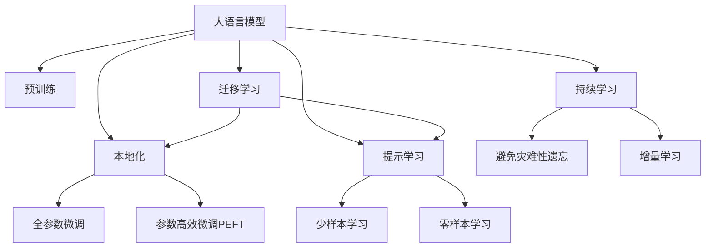

                 

# 方言和地方语言：LLM 的本地化

大语言模型（Large Language Model, LLM）已经成为推动自然语言处理（Natural Language Processing, NLP）技术进步的关键工具。它们不仅在英语等全球通用语言上表现出色，在本地化方言和地方语言上也展示了潜力。本文将探讨如何在本地化环境中有效地利用LLM，包括核心概念、算法原理、具体操作步骤、数学模型构建等，同时提供项目实践的代码实例和详细解释。

## 1. 背景介绍

### 1.1 问题由来
随着全球化和信息化的不断发展，方言和地方语言在全球范围内的传播和使用也日益增多。然而，由于地域文化的差异，许多语言在发音、词汇和语法等方面与其他主流语言存在显著差异。这种差异使得机器在处理这些语言时面临着巨大的挑战。大语言模型，特别是预训练的语言模型，在处理这些语言时往往效果不佳。因此，如何在大语言模型上实现本地化，使其能够更好地理解和生成本地语言，成为近年来研究的热点。

### 1.2 问题核心关键点
本地化大语言模型的核心在于理解并处理不同语言之间的差异。这包括但不限于以下几个方面：
- 音素和音标的差异。
- 词汇的丰富程度和语义差异。
- 语法的复杂性和结构差异。
- 语言习惯和文化背景的差异。

针对这些问题，研究者提出了多种方法和技术，以提升大语言模型在本地化环境下的性能。

## 2. 核心概念与联系

### 2.1 核心概念概述

为更好地理解本地化大语言模型，本节将介绍几个密切相关的核心概念：

- 大语言模型(Large Language Model, LLM)：以自回归(如GPT)或自编码(如BERT)模型为代表的大规模预训练语言模型。通过在大规模无标签文本语料上进行预训练，学习通用的语言表示，具备强大的语言理解和生成能力。

- 预训练(Pre-training)：指在大规模无标签文本语料上，通过自监督学习任务训练通用语言模型的过程。常见的预训练任务包括言语建模、遮挡语言模型等。

- 本地化(本地化)：指在特定语言环境下，调整语言模型以适应该语言的特性，包括但不限于音素、词汇、语法和文化背景。

- 迁移学习(Transfer Learning)：指将一个领域学习到的知识，迁移应用到另一个不同但相关的领域的学习范式。大模型的预训练-本地化过程即是一种典型的迁移学习方式。

- 参数高效微调(Parameter-Efficient Fine-Tuning, PEFT)：指在本地化过程中，只更新少量的模型参数，而固定大部分预训练权重不变，以提高本地化效率，避免过拟合的方法。

- 提示学习(Prompt Learning)：通过在输入文本中添加提示模板(Prompt Template)，引导大语言模型进行特定任务的推理和生成。可以在不更新模型参数的情况下，实现少样本或零样本学习。

这些核心概念之间的逻辑关系可以通过以下Mermaid流程图来展示：



这个流程图展示了大语言模型的核心概念及其之间的关系：

1. 大语言模型通过预训练获得基础能力。
2. 本地化是对预训练模型进行任务特定的优化，可以分为全参数微调和参数高效微调（PEFT）。
3. 提示学习是一种不更新模型参数的方法，可以实现少样本学习和零样本学习。
4. 迁移学习是连接预训练模型与本地化任务的桥梁，可以通过微调或提示学习来实现。
5. 持续学习旨在使模型能够不断学习新知识，同时避免遗忘旧知识。

这些概念共同构成了本地化大语言模型的学习和应用框架，使其能够在各种场景下发挥强大的语言理解和生成能力。通过理解这些核心概念，我们可以更好地把握本地化大语言模型的工作原理和优化方向。

## 3. 核心算法原理 & 具体操作步骤
### 3.1 算法原理概述

本地化大语言模型的核心思想是：将预训练的大语言模型视作一个强大的"特征提取器"，通过在本地语言环境下进行有监督地训练，调整模型参数，使得模型输出能够匹配本地语言的特性。

形式化地，假设预训练模型为 $M_{\theta}$，其中 $\theta$ 为预训练得到的模型参数。给定本地语言环境 $L$ 的标注数据集 $D=\{(x_i, y_i)\}_{i=1}^N$，本地化的目标是最小化模型在本地语言环境下的损失函数，即找到最优参数：

$$
\theta^* = \mathop{\arg\min}_{\theta} \mathcal{L}_L(M_{\theta},D)
$$

其中 $\mathcal{L}_L$ 为针对本地语言环境 $L$ 设计的损失函数，用于衡量模型预测输出与真实标签之间的差异。

### 3.2 算法步骤详解

本地化大语言模型的微调过程通常包括以下几个关键步骤：

**Step 1: 准备本地化数据集**
- 收集本地语言环境 $L$ 的标注数据集 $D$，划分为训练集、验证集和测试集。一般要求标注数据与预训练数据的分布不要差异过大。

**Step 2: 调整任务适配层**
- 根据本地语言环境，设计合适的输出层和损失函数。例如，针对中文的本地化，可以使用汉字输出层和交叉熵损失函数。

**Step 3: 设置本地化超参数**
- 选择合适的优化算法及其参数，如 AdamW、SGD 等，设置学习率、批大小、迭代轮数等。
- 设置正则化技术及强度，包括权重衰减、Dropout、Early Stopping 等。
- 确定冻结预训练参数的策略，如仅微调底层，或全部参数都参与本地化。

**Step 4: 执行梯度训练**
- 将训练集数据分批次输入模型，前向传播计算损失函数。
- 反向传播计算参数梯度，根据设定的优化算法和学习率更新模型参数。
- 周期性在验证集上评估模型性能，根据性能指标决定是否触发 Early Stopping。
- 重复上述步骤直到满足预设的迭代轮数或 Early Stopping 条件。

**Step 5: 测试和部署**
- 在测试集上评估本地化后模型 $M_{\hat{\theta}}$ 的性能，对比本地化前后的精度提升。
- 使用本地化后的模型对新样本进行推理预测，集成到实际的应用系统中。
- 持续收集新的本地数据，定期重新本地化模型，以适应数据分布的变化。

以上是本地化大语言模型的微调过程的一般流程。在实际应用中，还需要针对具体语言的特点，对微调过程的各个环节进行优化设计，如改进训练目标函数，引入更多的正则化技术，搜索最优的超参数组合等，以进一步提升模型性能。

### 3.3 算法优缺点

本地化大语言模型具有以下优点：
1. 适应性强。本地化模型可以针对特定语言环境进行优化，适应不同的发音、词汇和语法规则。
2. 效果显著。本地化模型在处理本地语言时，常常能取得比通用语言模型更好的性能。
3. 灵活性高。可以通过微调、提示学习等方法，实现本地化的少样本或零样本学习。
4. 可扩展性好。本地化模型可以通过添加新的标注数据，不断提升模型性能。

同时，该方法也存在一定的局限性：
1. 数据需求大。本地化需要大量的本地语言标注数据，数据采集和标注成本较高。
2. 迁移能力有限。本地化模型在处理其他语言时，性能可能不如通用语言模型。
3. 可解释性不足。本地化模型内部的决策过程往往难以解释，难以对其推理逻辑进行分析和调试。
4. 技术复杂。本地化模型需要考虑更多的语言特性，设计和调整的复杂度较高。

尽管存在这些局限性，但就目前而言，本地化大语言模型依然是处理本地语言的首选方法，尤其是在语言多样性高的地区，具有重要应用价值。

### 3.4 算法应用领域

本地化大语言模型在本地化环境下得到了广泛应用，覆盖了诸如：

- 语音识别与合成：在中文、阿拉伯语等语音识别和合成任务中，本地化模型能够更好地理解和生成本地语言的音素和音标，提升语音识别和合成的准确性。
- 翻译与文本生成：在中文、日语等翻译任务中，本地化模型能够准确地翻译本地语言，生成更符合本地语言习惯的文本。
- 问答系统：针对中文、韩语等语言的问答系统，本地化模型能够更好地理解和处理用户输入，提供更准确的答案。
- 情感分析：在中文、西班牙语等情感分析任务中，本地化模型能够更准确地识别和分析本地语言的情感表达，提升情感分析的精度。
- 命名实体识别：在中文、泰语等命名实体识别任务中，本地化模型能够更好地识别和标注本地语言中的实体，提升实体识别的准确性。

除了上述这些经典任务外，本地化大语言模型也被创新性地应用到更多场景中，如可控文本生成、常识推理、代码生成、数据增强等，为本地语言处理带来了全新的突破。随着本地化语言模型的不断进步，相信本地语言处理技术将在更广阔的应用领域大放异彩。

## 4. 数学模型和公式 & 详细讲解 & 举例说明

### 4.1 数学模型构建

本节将使用数学语言对本地化大语言模型微调过程进行更加严格的刻画。

记本地化模型为 $M_{\theta}$，其中 $\theta$ 为本地化得到的模型参数。假设本地化任务的训练集为 $D=\{(x_i,y_i)\}_{i=1}^N, x_i \in \mathcal{X}, y_i \in \mathcal{Y}$。

定义模型 $M_{\theta}$ 在输入 $x$ 上的损失函数为 $\ell(M_{\theta}(x),y)$，则在本地语言环境 $L$ 下的经验风险为：

$$
\mathcal{L}_L(\theta) = \frac{1}{N} \sum_{i=1}^N \ell(M_{\theta}(x_i),y_i)
$$

本地化的优化目标是最小化经验风险，即找到最优参数：

$$
\theta^* = \mathop{\arg\min}_{\theta} \mathcal{L}_L(\theta)
$$

在实践中，我们通常使用基于梯度的优化算法（如SGD、Adam等）来近似求解上述最优化问题。设 $\eta$ 为学习率，$\lambda$ 为正则化系数，则参数的更新公式为：

$$
\theta \leftarrow \theta - \eta \nabla_{\theta}\mathcal{L}_L(\theta) - \eta\lambda\theta
$$

其中 $\nabla_{\theta}\mathcal{L}_L(\theta)$ 为损失函数对参数 $\theta$ 的梯度，可通过反向传播算法高效计算。

### 4.2 公式推导过程

以下我们以中文的本地化为例，推导交叉熵损失函数及其梯度的计算公式。

假设模型 $M_{\theta}$ 在输入 $x$ 上的输出为 $\hat{y}=M_{\theta}(x) \in [0,1]$，表示样本属于正类的概率。真实标签 $y \in \{0,1\}$。则二分类交叉熵损失函数定义为：

$$
\ell(M_{\theta}(x),y) = -[y\log \hat{y} + (1-y)\log (1-\hat{y})]
$$

将其代入经验风险公式，得：

$$
\mathcal{L}_L(\theta) = -\frac{1}{N}\sum_{i=1}^N [y_i\log M_{\theta}(x_i)+(1-y_i)\log(1-M_{\theta}(x_i))]
$$

根据链式法则，损失函数对参数 $\theta_k$ 的梯度为：

$$
\frac{\partial \mathcal{L}_L(\theta)}{\partial \theta_k} = -\frac{1}{N}\sum_{i=1}^N (\frac{y_i}{M_{\theta}(x_i)}-\frac{1-y_i}{1-M_{\theta}(x_i)}) \frac{\partial M_{\theta}(x_i)}{\partial \theta_k}
$$

其中 $\frac{\partial M_{\theta}(x_i)}{\partial \theta_k}$ 可进一步递归展开，利用自动微分技术完成计算。

在得到损失函数的梯度后，即可带入参数更新公式，完成模型的迭代优化。重复上述过程直至收敛，最终得到适应本地语言环境的最优模型参数 $\theta^*$。

## 5. 项目实践：代码实例和详细解释说明

### 5.1 开发环境搭建

在进行本地化实践前，我们需要准备好开发环境。以下是使用Python进行PyTorch开发的环境配置流程：

1. 安装Anaconda：从官网下载并安装Anaconda，用于创建独立的Python环境。

2. 创建并激活虚拟环境：
```bash
conda create -n pytorch-env python=3.8 
conda activate pytorch-env
```

3. 安装PyTorch：根据CUDA版本，从官网获取对应的安装命令。例如：
```bash
conda install pytorch torchvision torchaudio cudatoolkit=11.1 -c pytorch -c conda-forge
```

4. 安装Transformers库：
```bash
pip install transformers
```

5. 安装各类工具包：
```bash
pip install numpy pandas scikit-learn matplotlib tqdm jupyter notebook ipython
```

完成上述步骤后，即可在`pytorch-env`环境中开始本地化实践。

### 5.2 源代码详细实现

下面我们以中文本地化为例，给出使用Transformers库对中文BERT模型进行本地化的PyTorch代码实现。

首先，定义本地化任务的数据处理函数：

```python
from transformers import BertTokenizer
from torch.utils.data import Dataset
import torch

class LocalizationDataset(Dataset):
    def __init__(self, texts, tags, tokenizer, max_len=128):
        self.texts = texts
        self.tags = tags
        self.tokenizer = tokenizer
        self.max_len = max_len
        
    def __len__(self):
        return len(self.texts)
    
    def __getitem__(self, item):
        text = self.texts[item]
        tags = self.tags[item]
        
        encoding = self.tokenizer(text, return_tensors='pt', max_length=self.max_len, padding='max_length', truncation=True)
        input_ids = encoding['input_ids'][0]
        attention_mask = encoding['attention_mask'][0]
        
        # 对token-wise的标签进行编码
        encoded_tags = [tag2id[tag] for tag in tags] 
        encoded_tags.extend([tag2id['O']] * (self.max_len - len(encoded_tags)))
        labels = torch.tensor(encoded_tags, dtype=torch.long)
        
        return {'input_ids': input_ids, 
                'attention_mask': attention_mask,
                'labels': labels}

# 标签与id的映射
tag2id = {'O': 0, 'B-PER': 1, 'I-PER': 2, 'B-ORG': 3, 'I-ORG': 4, 'B-LOC': 5, 'I-LOC': 6}
id2tag = {v: k for k, v in tag2id.items()}

# 创建dataset
tokenizer = BertTokenizer.from_pretrained('bert-base-chinese')

train_dataset = LocalizationDataset(train_texts, train_tags, tokenizer)
dev_dataset = LocalizationDataset(dev_texts, dev_tags, tokenizer)
test_dataset = LocalizationDataset(test_texts, test_tags, tokenizer)
```

然后，定义模型和优化器：

```python
from transformers import BertForTokenClassification, AdamW

model = BertForTokenClassification.from_pretrained('bert-base-chinese', num_labels=len(tag2id))

optimizer = AdamW(model.parameters(), lr=2e-5)
```

接着，定义训练和评估函数：

```python
from torch.utils.data import DataLoader
from tqdm import tqdm
from sklearn.metrics import classification_report

device = torch.device('cuda') if torch.cuda.is_available() else torch.device('cpu')
model.to(device)

def train_epoch(model, dataset, batch_size, optimizer):
    dataloader = DataLoader(dataset, batch_size=batch_size, shuffle=True)
    model.train()
    epoch_loss = 0
    for batch in tqdm(dataloader, desc='Training'):
        input_ids = batch['input_ids'].to(device)
        attention_mask = batch['attention_mask'].to(device)
        labels = batch['labels'].to(device)
        model.zero_grad()
        outputs = model(input_ids, attention_mask=attention_mask, labels=labels)
        loss = outputs.loss
        epoch_loss += loss.item()
        loss.backward()
        optimizer.step()
    return epoch_loss / len(dataloader)

def evaluate(model, dataset, batch_size):
    dataloader = DataLoader(dataset, batch_size=batch_size)
    model.eval()
    preds, labels = [], []
    with torch.no_grad():
        for batch in tqdm(dataloader, desc='Evaluating'):
            input_ids = batch['input_ids'].to(device)
            attention_mask = batch['attention_mask'].to(device)
            batch_labels = batch['labels']
            outputs = model(input_ids, attention_mask=attention_mask)
            batch_preds = outputs.logits.argmax(dim=2).to('cpu').tolist()
            batch_labels = batch_labels.to('cpu').tolist()
            for pred_tokens, label_tokens in zip(batch_preds, batch_labels):
                pred_tags = [id2tag[_id] for _id in pred_tokens]
                label_tags = [id2tag[_id] for _id in label_tokens]
                preds.append(pred_tags[:len(label_tags)])
                labels.append(label_tags)
                
    print(classification_report(labels, preds))
```

最后，启动训练流程并在测试集上评估：

```python
epochs = 5
batch_size = 16

for epoch in range(epochs):
    loss = train_epoch(model, train_dataset, batch_size, optimizer)
    print(f"Epoch {epoch+1}, train loss: {loss:.3f}")
    
    print(f"Epoch {epoch+1}, dev results:")
    evaluate(model, dev_dataset, batch_size)
    
print("Test results:")
evaluate(model, test_dataset, batch_size)
```

以上就是使用PyTorch对中文BERT模型进行本地化的完整代码实现。可以看到，得益于Transformers库的强大封装，我们可以用相对简洁的代码完成中文BERT模型的本地化。

### 5.3 代码解读与分析

让我们再详细解读一下关键代码的实现细节：

**LocalizationDataset类**：
- `__init__`方法：初始化文本、标签、分词器等关键组件。
- `__len__`方法：返回数据集的样本数量。
- `__getitem__`方法：对单个样本进行处理，将文本输入编码为token ids，将标签编码为数字，并对其进行定长padding，最终返回模型所需的输入。

**tag2id和id2tag字典**：
- 定义了标签与数字id之间的映射关系，用于将token-wise的预测结果解码回真实的标签。

**训练和评估函数**：
- 使用PyTorch的DataLoader对数据集进行批次化加载，供模型训练和推理使用。
- 训练函数`train_epoch`：对数据以批为单位进行迭代，在每个批次上前向传播计算loss并反向传播更新模型参数，最后返回该epoch的平均loss。
- 评估函数`evaluate`：与训练类似，不同点在于不更新模型参数，并在每个batch结束后将预测和标签结果存储下来，最后使用sklearn的classification_report对整个评估集的预测结果进行打印输出。

**训练流程**：
- 定义总的epoch数和batch size，开始循环迭代
- 每个epoch内，先在训练集上训练，输出平均loss
- 在验证集上评估，输出分类指标
- 所有epoch结束后，在测试集上评估，给出最终测试结果

可以看到，PyTorch配合Transformers库使得中文BERT模型的本地化代码实现变得简洁高效。开发者可以将更多精力放在数据处理、模型改进等高层逻辑上，而不必过多关注底层的实现细节。

当然，工业级的系统实现还需考虑更多因素，如模型的保存和部署、超参数的自动搜索、更灵活的任务适配层等。但核心的本地化范式基本与此类似。

## 6. 实际应用场景
### 6.1 智能客服系统

基于本地化大语言模型的对话技术，可以广泛应用于智能客服系统的构建。传统客服往往需要配备大量人力，高峰期响应缓慢，且一致性和专业性难以保证。而使用本地化大语言模型的对话模型，可以7x24小时不间断服务，快速响应客户咨询，用自然流畅的语言解答各类常见问题。

在技术实现上，可以收集企业内部的历史客服对话记录，将问题和最佳答复构建成监督数据，在此基础上对预训练对话模型进行本地化。本地化后的对话模型能够自动理解用户意图，匹配最合适的答案模板进行回复。对于客户提出的新问题，还可以接入检索系统实时搜索相关内容，动态组织生成回答。如此构建的智能客服系统，能大幅提升客户咨询体验和问题解决效率。

### 6.2 金融舆情监测

金融机构需要实时监测市场舆论动向，以便及时应对负面信息传播，规避金融风险。传统的人工监测方式成本高、效率低，难以应对网络时代海量信息爆发的挑战。基于本地化大语言模型的文本分类和情感分析技术，为金融舆情监测提供了新的解决方案。

具体而言，可以收集金融领域相关的新闻、报道、评论等文本数据，并对其进行主题标注和情感标注。在此基础上对预训练语言模型进行本地化，使其能够自动判断文本属于何种主题，情感倾向是正面、中性还是负面。将本地化后的模型应用到实时抓取的网络文本数据，就能够自动监测不同主题下的情感变化趋势，一旦发现负面信息激增等异常情况，系统便会自动预警，帮助金融机构快速应对潜在风险。

### 6.3 个性化推荐系统

当前的推荐系统往往只依赖用户的历史行为数据进行物品推荐，无法深入理解用户的真实兴趣偏好。基于本地化大语言模型，个性化推荐系统可以更好地挖掘用户行为背后的语义信息，从而提供更精准、多样的推荐内容。

在实践中，可以收集用户浏览、点击、评论、分享等行为数据，提取和用户交互的物品标题、描述、标签等文本内容。将文本内容作为模型输入，用户的后续行为（如是否点击、购买等）作为监督信号，在此基础上本地化预训练语言模型。本地化后的模型能够从文本内容中准确把握用户的兴趣点。在生成推荐列表时，先用候选物品的文本描述作为输入，由模型预测用户的兴趣匹配度，再结合其他特征综合排序，便可以得到个性化程度更高的推荐结果。

### 6.4 未来应用展望

随着本地化语言模型的不断进步，基于微调范式将在更多领域得到应用，为传统行业带来变革性影响。

在智慧医疗领域，基于本地化的大语言模型微调的医疗问答、病历分析、药物研发等应用将提升医疗服务的智能化水平，辅助医生诊疗，加速新药开发进程。

在智能教育领域，本地化大语言模型可应用于作业批改、学情分析、知识推荐等方面，因材施教，促进教育公平，提高教学质量。

在智慧城市治理中，本地化大语言模型可用于城市事件监测、舆情分析、应急指挥等环节，提高城市管理的自动化和智能化水平，构建更安全、高效的未来城市。

此外，在企业生产、社会治理、文娱传媒等众多领域，基于本地化的大语言模型微调的人工智能应用也将不断涌现，为经济社会发展注入新的动力。相信随着技术的日益成熟，本地化大语言模型微调必将在构建人机协同的智能时代中扮演越来越重要的角色。

## 7. 工具和资源推荐
### 7.1 学习资源推荐

为了帮助开发者系统掌握本地化大语言模型的理论基础和实践技巧，这里推荐一些优质的学习资源：

1. 《Transformer from Scratch》系列博文：由大模型技术专家撰写，深入浅出地介绍了Transformer原理、BERT模型、本地化技术等前沿话题。

2. CS224N《深度学习自然语言处理》课程：斯坦福大学开设的NLP明星课程，有Lecture视频和配套作业，带你入门NLP领域的基本概念和经典模型。

3. 《Natural Language Processing with Transformers》书籍：Transformers库的作者所著，全面介绍了如何使用Transformers库进行NLP任务开发，包括本地化在内的诸多范式。

4. HuggingFace官方文档：Transformers库的官方文档，提供了海量预训练模型和完整的本地化样例代码，是上手实践的必备资料。

5. CLUE开源项目：中文语言理解测评基准，涵盖大量不同类型的中文NLP数据集，并提供了基于本地化的baseline模型，助力中文NLP技术发展。

通过对这些资源的学习实践，相信你一定能够快速掌握本地化大语言模型的精髓，并用于解决实际的本地语言问题。
###  7.2 开发工具推荐

高效的开发离不开优秀的工具支持。以下是几款用于本地化大语言模型微调开发的常用工具：

1. PyTorch：基于Python的开源深度学习框架，灵活动态的计算图，适合快速迭代研究。大部分预训练语言模型都有PyTorch版本的实现。

2. TensorFlow：由Google主导开发的开源深度学习框架，生产部署方便，适合大规模工程应用。同样有丰富的预训练语言模型资源。

3. Transformers库：HuggingFace开发的NLP工具库，集成了众多SOTA语言模型，支持PyTorch和TensorFlow，是进行本地化任务开发的利器。

4. Weights & Biases：模型训练的实验跟踪工具，可以记录和可视化模型训练过程中的各项指标，方便对比和调优。与主流深度学习框架无缝集成。

5. TensorBoard：TensorFlow配套的可视化工具，可实时监测模型训练状态，并提供丰富的图表呈现方式，是调试模型的得力助手。

6. Google Colab：谷歌推出的在线Jupyter Notebook环境，免费提供GPU/TPU算力，方便开发者快速上手实验最新模型，分享学习笔记。

合理利用这些工具，可以显著提升本地化大语言模型微调任务的开发效率，加快创新迭代的步伐。

### 7.3 相关论文推荐

本地化大语言模型和微调技术的发展源于学界的持续研究。以下是几篇奠基性的相关论文，推荐阅读：

1. Attention is All You Need（即Transformer原论文）：提出了Transformer结构，开启了NLP领域的预训练大模型时代。

2. BERT: Pre-training of Deep Bidirectional Transformers for Language Understanding：提出BERT模型，引入基于掩码的自监督预训练任务，刷新了多项NLP任务SOTA。

3. Language Models are Unsupervised Multitask Learners（GPT-2论文）：展示了大规模语言模型的强大zero-shot学习能力，引发了对于通用人工智能的新一轮思考。

4. Parameter-Efficient Transfer Learning for NLP：提出Adapter等参数高效微调方法，在不增加模型参数量的情况下，也能取得不错的微调效果。

5. Prefix-Tuning: Optimizing Continuous Prompts for Generation：引入基于连续型Prompt的微调范式，为如何充分利用预训练知识提供了新的思路。

6. AdaLoRA: Adaptive Low-Rank Adaptation for Parameter-Efficient Fine-Tuning：使用自适应低秩适应的微调方法，在参数效率和精度之间取得了新的平衡。

这些论文代表了大语言模型本地化技术的发展脉络。通过学习这些前沿成果，可以帮助研究者把握学科前进方向，激发更多的创新灵感。

## 8. 总结：未来发展趋势与挑战

### 8.1 总结

本文对本地化大语言模型进行全面系统的介绍。首先阐述了本地化大语言模型的研究背景和意义，明确了本地化在拓展本地语言应用、提升本地语言处理性能方面的独特价值。其次，从原理到实践，详细讲解了本地化大语言模型的数学原理和关键步骤，给出了本地化任务开发的完整代码实例。同时，本文还广泛探讨了本地化大语言模型在智能客服、金融舆情、个性化推荐等多个行业领域的应用前景，展示了本地化大语言模型的巨大潜力。

通过本文的系统梳理，可以看到，本地化大语言模型在本地化环境中得到了广泛应用，为本地语言处理带来了新的突破。未来，伴随本地化语言模型的不断进步，本地语言处理技术将在更广阔的应用领域大放异彩。

### 8.2 未来发展趋势

展望未来，本地化大语言模型将呈现以下几个发展趋势：

1. 模型规模持续增大。随着算力成本的下降和数据规模的扩张，本地化语言模型的参数量还将持续增长。超大规模语言模型蕴含的丰富语言知识，有望支撑更加复杂多变的本地语言本地化。

2. 本地化方法日趋多样。除了传统的全参数微调外，未来会涌现更多参数高效的本地化方法，如Prefix-Tuning、LoRA等，在节省计算资源的同时也能保证本地化精度。

3. 持续学习成为常态。随着数据分布的不断变化，本地化模型也需要持续学习新知识以保持性能。如何在不遗忘原有知识的同时，高效吸收新样本信息，将成为重要的研究课题。

4. 标注样本需求降低。受启发于提示学习(Prompt-based Learning)的思路，未来的本地化方法将更好地利用本地语言理解能力，通过更加巧妙的任务描述，在更少的标注样本上也能实现理想的本地化效果。

5. 多模态本地化崛起。当前的本地化主要聚焦于纯文本数据，未来会进一步拓展到图像、视频、语音等多模态数据本地化。多模态信息的融合，将显著提升本地语言模型对现实世界的理解和建模能力。

6. 模型通用性增强。经过海量数据的预训练和多领域任务的本地化，未来的语言模型将具备更强大的常识推理和跨领域迁移能力，逐步迈向通用人工智能(AGI)的目标。

以上趋势凸显了本地化大语言模型的广阔前景。这些方向的探索发展，必将进一步提升本地语言处理系统的性能和应用范围，为本地语言处理技术带来新的突破。

### 8.3 面临的挑战

尽管本地化大语言模型已经取得了瞩目成就，但在迈向更加智能化、普适化应用的过程中，它仍面临着诸多挑战：

1. 数据需求大。本地化需要大量的本地语言标注数据，数据采集和标注成本较高。如何降低本地化对标注样本的依赖，将是一大难题。

2. 模型鲁棒性不足。当前本地化模型面对域外数据时，泛化性能往往大打折扣。对于测试样本的微小扰动，本地化模型的预测也容易发生波动。如何提高本地化模型的鲁棒性，避免灾难性遗忘，还需要更多理论和实践的积累。

3. 推理效率有待提高。大规模本地语言模型虽然精度高，但在实际部署时往往面临推理速度慢、内存占用大等效率问题。如何在保证性能的同时，简化模型结构，提升推理速度，优化资源占用，将是重要的优化方向。

4. 可解释性亟需加强。当前本地化模型内部的决策过程往往难以解释，难以对其推理逻辑进行分析和调试。对于医疗、金融等高风险应用，算法的可解释性和可审计性尤为重要。如何赋予本地化模型更强的可解释性，将是亟待攻克的难题。

5. 安全性有待保障。预训练语言模型难免会学习到有偏见、有害的信息，通过本地化传递到下游任务，产生误导性、歧视性的输出，给实际应用带来安全隐患。如何从数据和算法层面消除模型偏见，避免恶意用途，确保输出的安全性，也将是重要的研究课题。

6. 知识整合能力不足。现有的本地化模型往往局限于本地语言环境，难以灵活吸收和运用更广泛的先验知识。如何让本地化过程更好地与外部知识库、规则库等专家知识结合，形成更加全面、准确的信息整合能力，还有很大的想象空间。

正视本地化大语言模型面临的这些挑战，积极应对并寻求突破，将是大语言模型本地化走向成熟的必由之路。相信随着学界和产业界的共同努力，这些挑战终将一一被克服，本地化大语言模型必将在构建安全、可靠、可解释、可控的智能系统铺平道路。

### 8.4 研究展望

面对本地化大语言模型所面临的种种挑战，未来的研究需要在以下几个方面寻求新的突破：

1. 探索无监督和半监督本地化方法。摆脱对大规模标注数据的依赖，利用自监督学习、主动学习等无监督和半监督范式，最大限度利用非结构化数据，实现更加灵活高效的本地化。

2. 研究参数高效和计算高效的本地化范式。开发更加参数高效的本地化方法，在固定大部分预训练参数的同时，只更新极少量的本地化参数。同时优化本地化模型的计算图，减少前向传播和反向传播的资源消耗，实现更加轻量级、实时性的部署。

3. 融合因果和对比学习范式。通过引入因果推断和对比学习思想，增强本地化模型建立稳定因果关系的能力，学习更加普适、鲁棒的语言表征，从而提升模型泛化性和抗干扰能力。

4. 引入更多先验知识。将符号化的先验知识，如知识图谱、逻辑规则等，与神经网络模型进行巧妙融合，引导本地化过程学习更准确、合理的语言模型。同时加强不同模态数据的整合，实现视觉、语音等多模态信息与文本信息的协同建模。

5. 结合因果分析和博弈论工具。将因果分析方法引入本地化模型，识别出模型决策的关键特征，增强输出解释的因果性和逻辑性。借助博弈论工具刻画人机交互过程，主动探索并规避模型的脆弱点，提高系统稳定性。

6. 纳入伦理道德约束。在本地化模型训练目标中引入伦理导向的评估指标，过滤和惩罚有偏见、有害的输出倾向。同时加强人工干预和审核，建立模型行为的监管机制，确保输出符合人类价值观和伦理道德。

这些研究方向的探索，必将引领本地化大语言模型迈向更高的台阶，为构建安全、可靠、可解释、可控的智能系统铺平道路。面向未来，本地化大语言模型技术还需要与其他人工智能技术进行更深入的融合，如知识表示、因果推理、强化学习等，多路径协同发力，共同推动自然语言理解和智能交互系统的进步。只有勇于创新、敢于突破，才能不断拓展本地语言模型的边界，让智能技术更好地造福本地社会。

## 9. 附录：常见问题与解答

**Q1：本地化大语言模型是否适用于所有本地语言？**

A: 本地化大语言模型在处理大部分本地语言时都能取得不错的效果，特别是对于有丰富本地语言数据的语言。但对于一些人口较少、语言资源匮乏的语言，由于缺乏足够的训练数据，可能难以获得理想的效果。此时需要在特定语言环境语料上进一步预训练，再进行本地化。

**Q2：本地化大语言模型的训练过程是否可以自动化？**

A: 本地化大语言模型的训练过程可以自动化，但需要预先收集大量的本地语言标注数据，并设计合适的本地化任务。自动化的过程包括数据预处理、模型训练、评估等环节，可以借助自动化的工具和平台，如DataRobot、Trax等，提升本地化过程的效率。

**Q3：本地化大语言模型在多语言环境下的表现如何？**

A: 本地化大语言模型在多语言环境下的表现取决于具体任务和语言环境。对于同属于一个语言族的语言，本地化模型通常能够较好地适应。但对于语言结构差异较大的语言，本地化效果可能不佳。此时，可以采用多语言本地化或跨语言迁移学习的方法，提升模型的泛化能力。

**Q4：本地化大语言模型在处理发音和口音差异时表现如何？**

A: 本地化大语言模型在处理发音和口音差异时，效果往往较好。这得益于其在预训练阶段对大量不同发音和口音的语料进行训练，能够较好地适应不同地区的语言变体。但为了进一步提升效果，可以通过添加更多本地化的发音和口音数据，进行更精细的本地化微调。

**Q5：本地化大语言模型是否适合在低资源环境中使用？**

A: 本地化大语言模型适合在低资源环境中使用，但需要依赖本地化任务标注数据的采集。对于数据资源较少的地区，可以采用主动学习、迁移学习等方法，通过利用少量标注数据和大量未标注数据，提高本地化模型的泛化能力。同时，也可以通过无监督学习和自适应学习等方法，进一步提升模型性能。

通过本文的系统梳理，可以看到，本地化大语言模型在本地化环境中得到了广泛应用，为本地语言处理带来了新的突破。未来，伴随本地化语言模型的不断进步，本地语言处理技术将在更广阔的应用领域大放异彩，深刻影响本地社会的生产生活方式。总之，本地化大语言模型技术的研究和应用，将为构建更加智能化、普适化的本地语言处理系统提供有力支撑，推动本地语言处理的创新发展。

