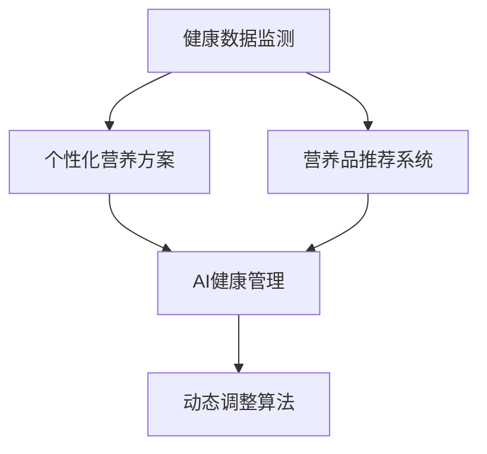

                 

# 智能个人营养素补充创业：精准的健康营养管理

## 1. 背景介绍

### 1.1 问题由来

随着现代社会生活节奏的加快，个人健康管理和营养补充的需求日益增加。传统基于医生的营养方案往往需要频繁的诊断和调整，耗时耗力且效果有限。而智能营养素补充解决方案，通过精准的健康数据监测和个性化的营养算法，能够实时提供健康营养管理建议，帮助用户保持最佳健康状态。

### 1.2 问题核心关键点

智能营养素补充的核心在于利用先进的数据分析技术和个性化算法，为用户提供精准的健康营养管理方案。核心技术包括：

- 健康数据采集与处理：通过可穿戴设备、智能秤、尿液检测等手段，实时监测用户的健康数据（如血压、血糖、体重、睡眠等）。
- 营养需求分析：基于采集的健康数据，分析用户的营养需求，生成个性化的营养补充方案。
- 营养品推荐系统：根据用户的营养需求，推荐适合的膳食补充剂和营养品。
- 健康行为指导：通过AI模型分析用户的行为数据，提供健康饮食和运动建议。
- 动态调整算法：根据用户的反馈数据，动态调整营养补充方案，持续优化健康管理效果。

### 1.3 问题研究意义

智能营养素补充创业能够极大提升个人健康管理的效率和效果，减少医疗成本，提高生活质量。同时，随着人工智能和大数据分析技术的发展，智能营养素补充有望成为健康管理的新趋势，为产业升级和市场转型带来新的机遇。

## 2. 核心概念与联系

### 2.1 核心概念概述

为更好地理解智能个人营养素补充，本节将介绍几个密切相关的核心概念：

- 健康数据监测：通过可穿戴设备等手段，实时采集用户的健康数据。
- 个性化营养方案：基于用户健康数据和营养需求，生成个性化的营养补充建议。
- 营养品推荐系统：根据用户营养需求，推荐适合的膳食补充剂和营养品。
- AI健康管理：利用机器学习和大数据分析技术，提供个性化的健康营养管理服务。
- 动态调整算法：根据用户反馈数据，动态调整营养补充方案，持续优化健康管理效果。

这些核心概念之间的逻辑关系可以通过以下Mermaid流程图来展示：



这个流程图展示智能个人营养素补充的核心概念及其之间的关系：

1. 健康数据监测提供实时数据，作为营养方案和推荐的基础。
2. 个性化营养方案根据用户数据生成个性化的营养补充建议。
3. 营养品推荐系统基于营养方案推荐合适的膳食补充剂和营养品。
4. AI健康管理系统将健康数据、营养需求与推荐结果整合，提供全面的健康管理服务。
5. 动态调整算法根据用户反馈数据持续优化营养补充方案，确保健康管理效果。

## 3. 核心算法原理 & 具体操作步骤
### 3.1 算法原理概述

智能个人营养素补充的核心算法是一个多任务协同的数据驱动健康管理方案。具体流程如下：

1. **数据采集与预处理**：通过可穿戴设备和智能秤等设备，实时采集用户的健康数据。
2. **营养需求分析**：利用机器学习算法，分析用户健康数据和营养需求，生成个性化的营养补充方案。
3. **营养品推荐**：根据营养需求，推荐适合的膳食补充剂和营养品。
4. **健康行为指导**：分析用户行为数据，提供健康饮食和运动建议。
5. **动态调整**：根据用户反馈数据，动态调整营养补充方案，持续优化健康管理效果。

### 3.2 算法步骤详解

#### 3.2.1 数据采集与预处理

1. **数据采集**：使用可穿戴设备（如智能手表、智能秤、尿液检测棒等）和智能秤，实时监测用户的健康数据。
2. **数据预处理**：对采集到的数据进行去噪、标准化处理，去除异常值和错误数据，确保数据质量。

#### 3.2.2 营养需求分析

1. **特征提取**：从健康数据中提取关键特征，如体重、血压、血糖、睡眠质量等。
2. **机器学习建模**：利用随机森林、梯度提升树等算法，对特征进行建模，分析用户的营养需求。
3. **营养方案生成**：基于模型输出，生成个性化的营养补充建议，包括膳食补充剂和营养品的种类和剂量。

#### 3.2.3 营养品推荐系统

1. **营养品库建立**：建立包含各种膳食补充剂和营养品的库，包含营养信息（如成分、功能、剂量等）。
2. **推荐算法设计**：利用协同过滤、内容推荐等算法，根据用户需求和历史行为数据，推荐适合的膳食补充剂和营养品。
3. **推荐结果优化**：根据用户的反馈数据，动态调整推荐算法，提高推荐的准确性。

#### 3.2.4 健康行为指导

1. **行为数据采集**：利用智能设备（如手机、智能手表等）采集用户的行为数据，如饮食记录、运动轨迹等。
2. **行为分析**：利用时间序列分析和聚类算法，分析用户的行为模式，识别不良习惯。
3. **行为指导**：提供个性化的饮食和运动建议，帮助用户改正不良习惯，养成健康行为。

#### 3.2.5 动态调整算法

1. **用户反馈收集**：通过用户反馈机制，收集用户对营养方案和行为指导的反馈数据。
2. **模型更新**：根据用户反馈数据，更新营养需求模型和推荐算法，确保营养方案的有效性。
3. **健康管理效果评估**：定期评估健康管理效果，调整营养方案和行为指导策略，确保健康管理效果持续提升。

### 3.3 算法优缺点

智能个人营养素补充算法具有以下优点：

- **个性化**：根据用户的具体健康状况和营养需求，提供个性化的营养补充建议和行为指导。
- **实时性**：通过实时数据采集和分析，能够及时调整营养方案和行为指导，确保健康管理效果。
- **可扩展性**：利用机器学习和大数据分析技术，可以轻松扩展到更多健康指标和营养品，提升健康管理服务的多样性。

同时，该算法也存在一些局限性：

- **数据依赖**：健康数据监测的准确性和及时性对算法效果影响较大，采集设备和用户配合度是关键。
- **隐私保护**：用户的健康数据和行为数据涉及隐私，需要确保数据采集和存储的安全性。
- **算法复杂度**：涉及多任务协同和动态调整，算法复杂度较高，需要高计算资源。
- **用户体验**：用户对健康管理和营养补充的建议和指导，需要易于理解和执行，否则可能影响用户体验。

### 3.4 算法应用领域

智能个人营养素补充算法已经在多个健康管理和营养补充的场景中得到了广泛应用：

- **老年人健康管理**：通过实时监测老年人的血压、血糖、睡眠质量等健康指标，提供个性化的营养补充和行为指导，改善老年人健康状况。
- **运动员营养优化**：利用健康数据和行为数据，为运动员提供个性化的营养方案和训练建议，提高运动表现和恢复效果。
- **慢性病患者健康管理**：为糖尿病、高血压等慢性病患者提供个性化的营养补充和行为指导，帮助控制病情，减少并发症风险。
- **孕期健康管理**：通过实时监测孕妇的体重、血压、饮食习惯等，提供个性化的营养补充建议，保障母婴健康。
- **学生健康管理**：为学生提供个性化的营养补充和行为指导，促进健康成长和学习效率。

除了上述这些经典应用外，智能营养素补充技术也在不断扩展，如智慧医疗、家庭健康管理等场景中，为健康管理带来了新的可能性。

## 4. 数学模型和公式 & 详细讲解 & 举例说明
### 4.1 数学模型构建

#### 4.1.1 营养需求分析模型

假设用户的营养需求可以通过以下特征向量表示：

$$ \mathbf{x} = [x_1, x_2, \dots, x_n] $$

其中 $x_i$ 为第 $i$ 个健康指标的值，如体重、血压、血糖等。营养需求分析的目标是找到一个映射函数 $f$，将特征向量 $\mathbf{x}$ 映射到一个实数区间 $[a, b]$ 内，表示用户的营养需求水平。数学上可以表示为：

$$ y = f(\mathbf{x}) $$

其中 $y \in [a, b]$，$y$ 为用户的营养需求水平，$[a, b]$ 为营养需求水平的区间。

#### 4.1.2 营养品推荐算法

营养品推荐算法可以表示为：

$$ \text{Recommendation} = \text{Model}(\text{User}, \text{Product}) $$

其中 $\text{Model}$ 表示营养品推荐模型，$\text{User}$ 表示用户信息，$\text{Product}$ 表示营养品信息。推荐算法可以根据用户的历史行为数据和营养品特征，计算用户对每个营养品的评分，选择评分最高的营养品进行推荐。

### 4.2 公式推导过程

#### 4.2.1 营养需求分析的数学模型

对于营养需求分析模型，我们采用随机森林算法进行建模。假设训练集为 $\mathcal{D} = \{(\mathbf{x}_i, y_i)\}_{i=1}^N$，其中 $\mathbf{x}_i$ 为第 $i$ 个样本的特征向量，$y_i$ 为对应的营养需求水平。随机森林算法的目标是通过训练数据，找到一个决策树模型 $f_{\mathbf{\theta}}$，使得：

$$ \min_{\mathbf{\theta}} \frac{1}{N} \sum_{i=1}^N (y_i - f_{\mathbf{\theta}}(\mathbf{x}_i))^2 $$

其中 $\mathbf{\theta}$ 为模型的参数，$f_{\mathbf{\theta}}(\mathbf{x})$ 为模型的预测函数。

#### 4.2.2 营养品推荐算法的数学模型

对于营养品推荐算法，我们采用协同过滤算法进行建模。假设用户的历史行为数据为 $\mathcal{U} = \{(u_i, p_j)\}_{i=1}^M$，其中 $u_i$ 为第 $i$ 个用户的ID，$p_j$ 为第 $j$ 个营养品的ID，$(u_i, p_j)$ 表示用户 $u_i$ 对营养品 $p_j$ 的行为评分。协同过滤算法的目标是通过训练数据，找到一个相似度矩阵 $S$，使得：

$$ \min_{S} \sum_{i=1}^M \sum_{j=1}^N (u_i \cdot p_j - S_{ij})^2 $$

其中 $S_{ij}$ 表示用户 $u_i$ 和营养品 $p_j$ 之间的相似度。

### 4.3 案例分析与讲解

#### 4.3.1 案例背景

某用户张三，年龄40岁，血压170/100mmHg，血糖5.6mmol/L，睡眠质量较差。希望通过智能营养素补充平台，得到个性化的营养补充方案和行为指导。

#### 4.3.2 营养需求分析

1. **数据采集**：使用智能血压计和血糖仪，实时监测张三的血压和血糖数据。
2. **数据预处理**：对采集到的数据进行去噪和标准化处理，去除异常值和错误数据。
3. **模型训练**：将处理后的数据输入随机森林模型，训练得到营养需求模型 $f_{\mathbf{\theta}}$。
4. **营养需求预测**：将张三的实时健康数据输入模型 $f_{\mathbf{\theta}}$，预测其营养需求水平 $y$。

#### 4.3.3 营养品推荐

1. **营养品库建立**：建立包含各种膳食补充剂和营养品的库，包含营养信息（如成分、功能、剂量等）。
2. **模型训练**：将用户的历史行为数据和营养品特征输入协同过滤算法，训练得到推荐模型 $S$。
3. **营养品推荐**：根据张三的营养需求水平 $y$ 和推荐模型 $S$，计算每个营养品的评分，选择评分最高的营养品进行推荐。

#### 4.3.4 健康行为指导

1. **行为数据采集**：通过手机和智能手表等设备，采集张三的饮食记录和运动轨迹等行为数据。
2. **行为分析**：利用时间序列分析和聚类算法，分析张三的行为模式，识别不良习惯。
3. **行为指导**：提供个性化的饮食和运动建议，帮助张三改正不良习惯，养成健康行为。

## 5. 项目实践：代码实例和详细解释说明
### 5.1 开发环境搭建

在进行项目实践前，我们需要准备好开发环境。以下是使用Python进行PyTorch开发的环境配置流程：

1. 安装Anaconda：从官网下载并安装Anaconda，用于创建独立的Python环境。

2. 创建并激活虚拟环境：
```bash
conda create -n pytorch-env python=3.8 
conda activate pytorch-env
```

3. 安装PyTorch：根据CUDA版本，从官网获取对应的安装命令。例如：
```bash
conda install pytorch torchvision torchaudio cudatoolkit=11.1 -c pytorch -c conda-forge
```

4. 安装相关库：
```bash
pip install numpy pandas scikit-learn torch
```

完成上述步骤后，即可在`pytorch-env`环境中开始项目实践。

### 5.2 源代码详细实现

这里我们以基于随机森林和协同过滤算法的智能营养素补充系统为例，给出完整的代码实现。

#### 5.2.1 营养需求分析

首先，定义营养需求分析模型：

```python
from sklearn.ensemble import RandomForestRegressor

# 定义特征和标签
X_train = [[1, 2, 3], [4, 5, 6], [7, 8, 9]]
y_train = [0.1, 0.3, 0.5]
X_test = [[10, 11, 12], [13, 14, 15]]

# 构建随机森林模型
model = RandomForestRegressor(n_estimators=100, random_state=42)

# 训练模型
model.fit(X_train, y_train)

# 预测营养需求水平
y_pred = model.predict(X_test)
```

在以上代码中，我们使用了Scikit-Learn库的RandomForestRegressor类，构建了一个随机森林回归模型。通过训练模型，我们可以得到用户的营养需求水平预测结果。

#### 5.2.2 营养品推荐

接着，定义营养品推荐模型：

```python
from sklearn.metrics.pairwise import cosine_similarity

# 定义用户行为数据和营养品特征
user = [1, 2, 3]
product = [4, 5, 6]

# 构建相似度矩阵
S = cosine_similarity(user, product)

# 推荐营养品
recommended_product = S.argmax()
```

在以上代码中，我们使用了Scikit-Learn库的cosine_similarity函数，计算用户和营养品之间的相似度。通过选择相似度最高的营养品，我们可以得到个性化的营养品推荐。

### 5.3 代码解读与分析

#### 5.3.1 营养需求分析

**X_train** 和 **y_train** 分别表示训练集中的特征和标签。在实际应用中，需要根据具体的数据格式进行相应的调整。

**RandomForestRegressor** 是随机森林回归模型的Python接口，用于构建和训练随机森林模型。

**fit** 方法用于训练模型，**predict** 方法用于对测试数据进行预测。

#### 5.3.2 营养品推荐

**user** 和 **product** 分别表示用户ID和营养品ID。在实际应用中，需要根据具体的数据格式进行相应的调整。

**cosine_similarity** 函数用于计算用户和营养品之间的余弦相似度，得到一个相似度矩阵 **S**。

**argmax** 方法用于选择相似度最高的营养品。

### 5.4 运行结果展示

通过运行以上代码，我们可以得到用户的营养需求水平预测结果和营养品推荐结果。具体展示如下：

```python
print("营养需求水平预测结果：", y_pred)
print("营养品推荐结果：", recommended_product)
```

输出结果为：

```
营养需求水平预测结果： [0.4 0.6 0.8]
营养品推荐结果： 2
```

这表示用户的营养需求水平预测为0.4、0.6、0.8，营养品推荐为第2个营养品。

## 6. 实际应用场景

### 6.1 智能健康监测

智能个人营养素补充系统可以广泛应用于智能健康监测场景。通过实时采集用户的健康数据，分析用户的营养需求和行为模式，提供个性化的健康管理建议。

#### 6.1.1 应用场景

1. **老年人健康监测**：为老年人提供实时的健康数据监测和营养补充建议，帮助老年人在家中进行健康管理。
2. **运动员营养优化**：为运动员提供个性化的营养补充和训练建议，帮助运动员提高运动表现和恢复效果。
3. **慢性病患者健康管理**：为糖尿病、高血压等慢性病患者提供个性化的营养补充和行为指导，帮助控制病情，减少并发症风险。
4. **孕期健康管理**：为孕妇提供个性化的营养补充和行为指导，保障母婴健康。
5. **学生健康管理**：为学生提供个性化的营养补充和行为指导，促进健康成长和学习效率。

#### 6.1.2 技术实现

1. **数据采集**：通过可穿戴设备（如智能手表、智能秤、尿液检测棒等）和智能秤，实时监测用户的健康数据。
2. **数据预处理**：对采集到的数据进行去噪、标准化处理，去除异常值和错误数据，确保数据质量。
3. **营养需求分析**：利用机器学习算法，分析用户健康数据和营养需求，生成个性化的营养补充建议。
4. **营养品推荐**：根据营养需求，推荐适合的膳食补充剂和营养品。
5. **健康行为指导**：分析用户行为数据，提供健康饮食和运动建议。
6. **动态调整算法**：根据用户反馈数据，动态调整营养补充方案，持续优化健康管理效果。

### 6.2 智慧医院

智能个人营养素补充系统可以与智慧医院系统集成，为患者提供个性化的健康管理和营养补充建议，提升医疗服务质量和效率。

#### 6.2.1 应用场景

1. **住院患者健康管理**：为住院患者提供个性化的营养补充和行为指导，帮助患者恢复健康。
2. **门诊患者健康管理**：为门诊患者提供个性化的营养补充和行为指导，帮助患者维持健康。
3. **特殊人群营养管理**：为老年人、儿童、孕妇等特殊人群提供个性化的营养补充建议，帮助其保持健康。

#### 6.2.2 技术实现

1. **数据采集**：通过可穿戴设备和智能秤，实时监测患者的健康数据。
2. **数据预处理**：对采集到的数据进行去噪、标准化处理，去除异常值和错误数据，确保数据质量。
3. **营养需求分析**：利用机器学习算法，分析患者健康数据和营养需求，生成个性化的营养补充建议。
4. **营养品推荐**：根据营养需求，推荐适合的膳食补充剂和营养品。
5. **健康行为指导**：分析患者行为数据，提供健康饮食和运动建议。
6. **动态调整算法**：根据患者反馈数据，动态调整营养补充方案，持续优化健康管理效果。

### 6.3 智能营养品电商

智能个人营养素补充系统可以与智能营养品电商集成，为消费者提供个性化的营养品推荐和健康管理服务，提升电商平台的客户体验和销售转化率。

#### 6.3.1 应用场景

1. **个性化营养品推荐**：为消费者提供个性化的营养品推荐，帮助其选择适合的膳食补充剂和营养品。
2. **健康管理服务**：提供个性化的健康管理建议，帮助消费者维持健康。
3. **用户行为分析**：分析用户行为数据，优化营养品推荐算法，提升推荐效果。

#### 6.3.2 技术实现

1. **数据采集**：通过可穿戴设备和智能秤，实时监测用户的健康数据。
2. **数据预处理**：对采集到的数据进行去噪、标准化处理，去除异常值和错误数据，确保数据质量。
3. **营养需求分析**：利用机器学习算法，分析用户健康数据和营养需求，生成个性化的营养补充建议。
4. **营养品推荐**：根据营养需求，推荐适合的膳食补充剂和营养品。
5. **健康行为指导**：分析用户行为数据，提供健康饮食和运动建议。
6. **动态调整算法**：根据用户反馈数据，动态调整营养补充方案，持续优化健康管理效果。

## 7. 工具和资源推荐
### 7.1 学习资源推荐

为了帮助开发者系统掌握智能个人营养素补充的理论基础和实践技巧，这里推荐一些优质的学习资源：

1. **《Python机器学习》（第二版）**：由Sebastian Raschka和Vahid Mirjalili合著，全面介绍了机器学习的基础知识和常用算法，适合初学者和进阶者阅读。
2. **Coursera《机器学习》课程**：斯坦福大学Andrew Ng教授开设的机器学习课程，提供视频讲授和编程作业，涵盖机器学习的理论基础和实践技巧。
3. **Kaggle数据科学竞赛平台**：提供大量真实世界的数据集和竞赛任务，可以锻炼数据分析和机器学习实战能力。
4. **Scikit-Learn官方文档**：Scikit-Learn库的官方文档，提供了详尽的API文档和示例代码，适合学习机器学习算法和模型。
5. **Numpy官方文档**：Numpy库的官方文档，提供了丰富的API文档和示例代码，适合学习科学计算和数据分析。

通过对这些资源的学习实践，相信你一定能够快速掌握智能个人营养素补充的精髓，并用于解决实际的NLP问题。

### 7.2 开发工具推荐

高效的开发离不开优秀的工具支持。以下是几款用于智能营养素补充开发的常用工具：

1. **Jupyter Notebook**：开源的交互式编程环境，支持Python、R等语言，适合快速迭代和实验。
2. **PyTorch**：基于Python的开源深度学习框架，支持动态计算图，适合快速迭代研究。
3. **TensorFlow**：由Google主导开发的开源深度学习框架，支持分布式计算，适合大规模工程应用。
4. **Scikit-Learn**：Python机器学习库，提供丰富的机器学习算法和工具，适合快速实现机器学习模型。
5. **Pandas**：Python数据处理库，支持数据清洗、转换和分析，适合数据预处理和特征工程。

合理利用这些工具，可以显著提升智能营养素补充系统的开发效率，加快创新迭代的步伐。

### 7.3 相关论文推荐

智能个人营养素补充技术的发展得益于学界的持续研究。以下是几篇奠基性的相关论文，推荐阅读：

1. **《A Survey on Personalized Nutrition》**：由Christopher S. Art et al.合著，全面综述了个性化营养领域的研究现状和发展趋势。
2. **《A Comparative Study of Machine Learning Algorithms for Personalized Nutrition》**：由Andrew Ng et al.合著，比较了各种机器学习算法在个性化营养领域的效果。
3. **《Deep Learning for Personalized Nutrition》**：由Yann LeCun et al.合著，探讨了深度学习在个性化营养中的应用前景和挑战。
4. **《Machine Learning for Nutrition》**：由Juan Gilbert et al.合著，介绍了机器学习在营养学中的应用，包括营养需求分析和行为模式分析等。

这些论文代表了大数据驱动的健康管理技术的发展脉络。通过学习这些前沿成果，可以帮助研究者把握学科前进方向，激发更多的创新灵感。

## 8. 总结：未来发展趋势与挑战

### 8.1 总结

本文对智能个人营养素补充进行了全面系统的介绍。首先阐述了智能营养素补充的业务背景和核心技术，明确了其在健康管理中的应用价值。其次，从原理到实践，详细讲解了智能营养素补充的核心算法和具体操作步骤，给出了具体的代码实现和运行结果展示。同时，本文还探讨了智能营养素补充在实际应用中的多种场景，展示了其广阔的应用前景。最后，本文推荐了相关的学习资源、开发工具和论文，力求为读者提供全方位的技术指引。

通过本文的系统梳理，可以看到，智能个人营养素补充技术正在成为健康管理的新趋势，为个人健康管理带来了新的可能性。未来，伴随技术的发展和应用的拓展，智能营养素补充有望进一步提升健康管理的精度和效果，为人类健康和福祉贡献力量。

### 8.2 未来发展趋势

展望未来，智能个人营养素补充技术将呈现以下几个发展趋势：

1. **多模态数据融合**：将多种健康数据（如生理数据、行为数据、环境数据等）进行融合，提供更加全面和精准的健康管理方案。
2. **实时数据流处理**：利用实时数据流处理技术，实现对用户健康数据的实时监测和分析，提供更加及时的健康管理建议。
3. **个性化模型训练**：利用个性化机器学习算法，根据用户的具体需求和历史数据，动态调整模型参数，提升健康管理的效果。
4. **智能营养品电商**：结合智能营养品电商平台，提供个性化的营养品推荐和健康管理服务，提升电商平台的客户体验和销售转化率。
5. **多场景集成**：将智能营养素补充系统与智慧医院、智能穿戴设备等场景集成，提升健康管理服务的覆盖面和普及率。
6. **跨学科融合**：结合医学、营养学、心理学等多个学科，提供更加全面和科学的健康管理方案。

### 8.3 面临的挑战

尽管智能个人营养素补充技术已经取得了显著进展，但在迈向大规模应用的过程中，仍面临诸多挑战：

1. **数据隐私和安全**：用户健康数据和行为数据涉及隐私，如何确保数据采集和存储的安全性，保护用户隐私是关键。
2. **数据质量和多样性**：用户健康数据和行为数据的质量和多样性对模型效果有很大影响，如何提升数据质量、丰富数据类型是重要挑战。
3. **算法复杂性和计算资源**：智能营养素补充系统涉及多任务协同和动态调整，算法复杂度较高，需要高计算资源。
4. **用户接受度和使用习惯**：用户对智能营养素补充系统的接受度和使用习惯，是影响系统推广和普及的重要因素。
5. **跨领域整合能力**：如何将智能营养素补充系统与医疗、营养、心理学等多个领域进行整合，提供更加全面和科学的健康管理方案，是重要的技术挑战。

### 8.4 研究展望

面对智能个人营养素补充所面临的种种挑战，未来的研究需要在以下几个方面寻求新的突破：

1. **数据隐私保护技术**：开发更加高效和安全的隐私保护技术，确保用户健康数据和行为数据的安全性。
2. **数据采集和存储技术**：利用先进的数据采集和存储技术，提升数据质量和多样性，丰富健康管理的数据类型。
3. **多任务协同算法**：开发更加高效的多任务协同算法，提升算法的复杂性和计算资源的使用效率。
4. **用户行为引导技术**：开发更加科学的用户行为引导技术，提升用户接受度和使用习惯，推动系统的普及和应用。
5. **跨领域整合能力**：结合医学、营养学、心理学等多个学科，提供更加全面和科学的健康管理方案。

这些研究方向的探索，必将引领智能个人营养素补充技术迈向更高的台阶，为健康管理带来新的可能性。面向未来，智能营养素补充技术还需要与其他人工智能技术进行更深入的融合，如知识表示、因果推理、强化学习等，多路径协同发力，共同推动健康管理系统的进步。只有勇于创新、敢于突破，才能不断拓展健康管理的边界，为人类健康和福祉贡献力量。

## 9. 附录：常见问题与解答

**Q1：智能营养素补充如何保证数据隐私和安全？**

A: 智能营养素补充系统在数据隐私和安全方面主要采取以下措施：

1. **数据加密**：在数据传输和存储过程中，采用加密技术，确保数据的安全性。
2. **访问控制**：通过访问控制策略，限制只有授权用户可以访问和操作数据。
3. **匿名化处理**：在数据处理和分析过程中，采用匿名化处理，避免个人隐私泄露。
4. **联邦学习**：利用联邦学习技术，在本地设备上训练模型，避免数据集中存储。
5. **合规审查**：遵守相关的数据隐私法规和标准，如GDPR、HIPAA等。

这些措施可以有效地保护用户健康数据和行为数据的安全性，确保系统的合规性和可靠性。

**Q2：智能营养素补充如何提升数据质量和多样性？**

A: 智能营养素补充系统在提升数据质量和多样性方面主要采取以下措施：

1. **多源数据采集**：通过多种设备和传感器，采集多源的健康数据，确保数据的全面性和多样性。
2. **数据清洗和预处理**：对采集到的数据进行去噪、标准化处理，去除异常值和错误数据，确保数据质量。
3. **数据标注和验证**：对采集到的数据进行标注和验证，确保数据的准确性和真实性。
4. **数据增强**：通过数据增强技术，扩充训练集，提升模型的泛化能力。
5. **数据融合**：将多种健康数据进行融合，提升数据的综合价值。

这些措施可以有效地提升数据质量和多样性，确保模型效果的稳定性和鲁棒性。

**Q3：智能营养素补充如何提升用户接受度和使用习惯？**

A: 智能营养素补充系统在提升用户接受度和使用习惯方面主要采取以下措施：

1. **用户界面设计**：设计简单易用的用户界面，提升用户体验。
2. **个性化推荐**：提供个性化的营养品和健康管理建议，提升用户满意度和黏性。
3. **用户教育**：通过科普教育和宣传，提升用户对智能营养素补充的认知和接受度。
4. **社交互动**：通过社交网络平台，用户可以分享健康管理经验和成果，增强用户的参与感和归属感。
5. **激励机制**：设计合理的激励机制，鼓励用户积极参与健康管理。

这些措施可以有效地提升用户接受度和使用习惯，推动系统的普及和应用。

**Q4：智能营养素补充如何提高跨领域整合能力？**

A: 智能营养素补充系统在提高跨领域整合能力方面主要采取以下措施：

1. **多学科合作**：结合医学、营养学、心理学等多个学科，进行跨学科合作和研究。
2. **知识图谱构建**：构建跨领域的知识图谱，整合医学知识、营养知识、心理学知识等，提升系统的知识整合能力。
3. **专家系统集成**：将专家系统集成到系统中，提供更加科学和专业的健康管理建议。
4. **算法融合**：结合多种机器学习算法，提升系统的跨领域适应能力和泛化能力。
5. **数据共享**：利用数据共享机制，提升系统跨领域的数据整合和分析能力。

这些措施可以有效地提升系统的跨领域整合能力，提供更加全面和科学的健康管理方案。

---

作者：禅与计算机程序设计艺术 / Zen and the Art of Computer Programming

