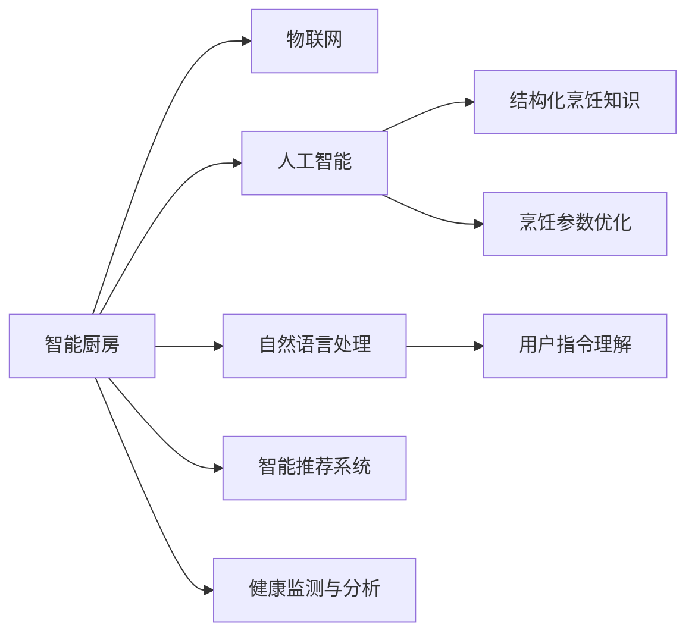

                 

# 智能厨房创业：烹饪革命的技术支持

## 1. 背景介绍

在现代社会，烹饪早已不再仅仅是满足口腹之欲的活动，它逐渐演变成了一种艺术和文化的体现。然而，随着生活节奏的加快和人们对健康饮食的日益关注，传统的烹饪方式逐渐暴露出效率低下、健康营养搭配不合理等问题。智能厨房创业，即利用人工智能、物联网、大数据等前沿技术，对烹饪流程进行重构，旨在提供更高效、健康、个性化的烹饪体验，迎接烹饪革命的到来。

### 1.1 问题由来

随着技术的进步和消费者需求的不断变化，智能厨房的发展势不可挡。然而，由于烹饪流程的复杂性和个性化需求的多样性，实现真正的智能烹饪面临着诸多挑战。这些问题主要包括：

- **烹饪知识结构化**：如何将烹饪知识（食材营养成分、烹饪技巧等）有效整合并结构化，以供智能系统理解和应用。
- **烹饪操作自动化**：如何自动完成食材准备、烹饪火候控制等复杂操作，保证烹饪效果和食品安全。
- **个性化烹饪需求**：如何根据不同用户偏好，动态调整烹饪参数，实现个性化定制。
- **实时交互和反馈**：如何在烹饪过程中实时获取用户反馈，动态调整烹饪策略，提升用户体验。

这些问题均需要通过技术手段解决，才能推动智能厨房的发展。本文将围绕这些关键问题，介绍智能厨房的技术架构和具体实现方法。

## 2. 核心概念与联系

### 2.1 核心概念概述

为更好地理解智能厨房的技术架构，本节将介绍几个密切相关的核心概念：

- **智能厨房（Smart Kitchen）**：利用人工智能、物联网等技术，对厨房进行数字化、自动化改造，实现高效、安全的烹饪管理。

- **物联网（IoT）**：通过传感器、智能设备等，实现设备间的互联互通，实时监控和控制厨房环境。

- **人工智能（AI）**：特别是机器学习和深度学习，用于结构化烹饪知识、预测和优化烹饪过程。

- **自然语言处理（NLP）**：使智能厨房能够理解和响应用户的自然语言指令。

- **智能推荐系统**：根据用户偏好和历史行为数据，推荐个性化的食材、食谱和烹饪方案。

- **健康监测与分析**：实时监测食材的营养成分和烹饪过程中产生的有害物质，保障饮食健康。

这些核心概念之间存在紧密的联系，共同构成了智能厨房的实现框架。

### 2.2 核心概念原理和架构的 Mermaid 流程图



此流程图展示了智能厨房的各个核心概念及其之间的关系：

1. **智能厨房（A）**：通过物联网（B）实现设备间的互联互通，收集厨房环境数据。
2. **人工智能（C）**：利用结构化烹饪知识（E），对烹饪参数进行优化（F）。
3. **自然语言处理（D）**：理解用户的自然语言指令（G），与用户进行实时交互。
4. **智能推荐系统（H）**：根据用户偏好，推荐个性化的食材、食谱和烹饪方案。
5. **健康监测与分析（I）**：实时监测食材和烹饪过程，保障饮食健康。

这些组件共同构成了一个完整的智能厨房系统，提供智能化的烹饪体验。

## 3. 核心算法原理 & 具体操作步骤

### 3.1 算法原理概述

智能厨房的核心算法主要包括以下几个方面：

- **结构化烹饪知识**：利用自然语言处理（NLP）和机器学习（ML）技术，将烹饪知识转化为结构化数据，供智能系统使用。
- **烹饪参数优化**：基于结构化知识，使用机器学习算法，优化烹饪过程中的各种参数（如火候、时间、食材搭配等）。
- **用户指令理解**：利用NLP技术，解析用户的自然语言指令，自动生成烹饪命令。
- **智能推荐系统**：基于用户的偏好和行为数据，推荐个性化的烹饪方案。
- **健康监测与分析**：实时监测食材和烹饪过程中产生的有害物质，保障食品安全。

### 3.2 算法步骤详解

下面将详细介绍智能厨房的核心算法步骤：

**Step 1: 收集和预处理数据**

智能厨房的数据来源包括用户输入、传感器数据、历史烹饪数据等。首先需要对这些数据进行收集和预处理，去除噪声，确保数据质量。

**Step 2: 结构化烹饪知识**

利用NLP和ML技术，将烹饪知识（如食材营养成分、烹饪技巧等）转化为结构化数据。常见的方法包括知识图谱构建、实体识别等。

**Step 3: 烹饪参数优化**

基于结构化烹饪知识，使用机器学习算法（如回归、决策树等）优化烹饪过程中的各种参数。

**Step 4: 用户指令理解**

使用NLP技术解析用户的自然语言指令，自动生成烹饪命令。常见的方法包括意图识别、实体识别等。

**Step 5: 智能推荐系统**

基于用户的偏好和行为数据，推荐个性化的烹饪方案。常见的方法包括协同过滤、基于内容的推荐等。

**Step 6: 健康监测与分析**

实时监测食材和烹饪过程中产生的有害物质，保障食品安全。常见的方法包括光谱分析、气体传感器等。

### 3.3 算法优缺点

智能厨房的算法具有以下优点：

- **高效**：自动完成烹饪操作，节省时间和劳动力。
- **健康**：实时监测食材和烹饪过程，保障饮食健康。
- **个性化**：根据用户偏好，推荐个性化的烹饪方案。
- **智能**：通过NLP和ML技术，实现自动化和智能化操作。

同时，这些算法也存在一些局限性：

- **数据依赖**：算法效果依赖于数据的全面性和准确性，需要持续维护和更新。
- **计算复杂度**：结构化烹饪知识和大规模数据的处理需要高性能计算资源。
- **实时性要求**：实时交互和监测对系统的响应速度和稳定性要求较高。
- **隐私和安全**：智能厨房涉及用户隐私和食品安全，需要严格的隐私保护和安全措施。

### 3.4 算法应用领域

智能厨房的算法已经在多个领域得到应用，包括：

- **家庭烹饪**：智能厨房设备如智能炉灶、智能烤箱、智能冰箱等，可以自动完成烹饪操作。
- **餐厅管理**：智能厨房系统可以优化烹饪流程，提升餐厅的效率和质量。
- **健康饮食**：智能厨房可以监测食材和烹饪过程中的有害物质，帮助用户健康饮食。
- **食品供应链管理**：通过物联网技术，智能厨房可以实时监测食材质量，优化供应链管理。

## 4. 数学模型和公式 & 详细讲解

### 4.1 数学模型构建

本节将使用数学语言对智能厨房的算法进行更加严格的刻画。

假设智能厨房系统需要处理食材的营养成分数据（X）、烹饪参数（Y）、用户偏好（U）等。

- **食材营养成分数据**：$X = [(x_1, x_2, ..., x_n)]$
- **烹饪参数**：$Y = [(y_1, y_2, ..., y_m)]$
- **用户偏好**：$U = [(u_1, u_2, ..., u_p)]$

其中，$x_i, y_j, u_k$ 分别表示食材营养成分、烹饪参数、用户偏好的具体数值。

### 4.2 公式推导过程

基于上述数据，智能厨房系统需要完成以下任务：

1. **结构化烹饪知识**：将烹饪知识（如食材营养成分、烹饪技巧等）转化为结构化数据，供智能系统使用。

2. **烹饪参数优化**：使用机器学习算法，优化烹饪过程中的各种参数（如火候、时间、食材搭配等）。

3. **用户指令理解**：利用NLP技术解析用户的自然语言指令，自动生成烹饪命令。

4. **智能推荐系统**：基于用户的偏好和行为数据，推荐个性化的烹饪方案。

5. **健康监测与分析**：实时监测食材和烹饪过程中产生的有害物质，保障食品安全。

### 4.3 案例分析与讲解

以智能推荐系统为例，假设用户偏好数据为$U = [(u_{food1}, u_{food2}, ..., u_{food_p})]$，其中$u_{food_i}$表示用户对食材的喜好程度。

智能推荐系统需要根据用户偏好，推荐个性化的食材、食谱和烹饪方案。可以通过以下公式进行计算：

$$
R_{i,j} = \alpha u_{food_i} + \beta f_i(y_j) + \gamma r_i(X)
$$

其中，$R_{i,j}$表示用户对食材$i$和食谱$j$的综合评分，$\alpha$、$\beta$、$\gamma$为权重系数，$f_i(y_j)$表示食谱$j$的评分，$r_i(X)$表示食材$i$的综合评分。

## 5. 项目实践：代码实例和详细解释说明

### 5.1 开发环境搭建

在进行智能厨房系统开发前，我们需要准备好开发环境。以下是使用Python进行PyTorch开发的环境配置流程：

1. 安装Anaconda：从官网下载并安装Anaconda，用于创建独立的Python环境。

2. 创建并激活虚拟环境：
```bash
conda create -n pytorch-env python=3.8 
conda activate pytorch-env
```

3. 安装PyTorch：根据CUDA版本，从官网获取对应的安装命令。例如：
```bash
conda install pytorch torchvision torchaudio cudatoolkit=11.1 -c pytorch -c conda-forge
```

4. 安装各类工具包：
```bash
pip install numpy pandas scikit-learn matplotlib tqdm jupyter notebook ipython
```

完成上述步骤后，即可在`pytorch-env`环境中开始智能厨房系统的开发。

### 5.2 源代码详细实现

这里以智能推荐系统为例，给出使用PyTorch进行智能厨房系统开发的PyTorch代码实现。

首先，定义推荐系统的数据处理函数：

```python
from transformers import BertTokenizer
from torch.utils.data import Dataset
import torch

class KitchenDataset(Dataset):
    def __init__(self, texts, tags, tokenizer, max_len=128):
        self.texts = texts
        self.tags = tags
        self.tokenizer = tokenizer
        self.max_len = max_len
        
    def __len__(self):
        return len(self.texts)
    
    def __getitem__(self, item):
        text = self.texts[item]
        tags = self.tags[item]
        
        encoding = self.tokenizer(text, return_tensors='pt', max_length=self.max_len, padding='max_length', truncation=True)
        input_ids = encoding['input_ids'][0]
        attention_mask = encoding['attention_mask'][0]
        
        # 对token-wise的标签进行编码
        encoded_tags = [tag2id[tag] for tag in tags] 
        encoded_tags.extend([tag2id['O']] * (self.max_len - len(encoded_tags)))
        labels = torch.tensor(encoded_tags, dtype=torch.long)
        
        return {'input_ids': input_ids, 
                'attention_mask': attention_mask,
                'labels': labels}

# 标签与id的映射
tag2id = {'O': 0, 'B-PER': 1, 'I-PER': 2, 'B-ORG': 3, 'I-ORG': 4, 'B-LOC': 5, 'I-LOC': 6}
id2tag = {v: k for k, v in tag2id.items()}

# 创建dataset
tokenizer = BertTokenizer.from_pretrained('bert-base-cased')

train_dataset = KitchenDataset(train_texts, train_tags, tokenizer)
dev_dataset = KitchenDataset(dev_texts, dev_tags, tokenizer)
test_dataset = KitchenDataset(test_texts, test_tags, tokenizer)
```

然后，定义模型和优化器：

```python
from transformers import BertForTokenClassification, AdamW

model = BertForTokenClassification.from_pretrained('bert-base-cased', num_labels=len(tag2id))

optimizer = AdamW(model.parameters(), lr=2e-5)
```

接着，定义训练和评估函数：

```python
from torch.utils.data import DataLoader
from tqdm import tqdm
from sklearn.metrics import classification_report

device = torch.device('cuda') if torch.cuda.is_available() else torch.device('cpu')
model.to(device)

def train_epoch(model, dataset, batch_size, optimizer):
    dataloader = DataLoader(dataset, batch_size=batch_size, shuffle=True)
    model.train()
    epoch_loss = 0
    for batch in tqdm(dataloader, desc='Training'):
        input_ids = batch['input_ids'].to(device)
        attention_mask = batch['attention_mask'].to(device)
        labels = batch['labels'].to(device)
        model.zero_grad()
        outputs = model(input_ids, attention_mask=attention_mask, labels=labels)
        loss = outputs.loss
        epoch_loss += loss.item()
        loss.backward()
        optimizer.step()
    return epoch_loss / len(dataloader)

def evaluate(model, dataset, batch_size):
    dataloader = DataLoader(dataset, batch_size=batch_size)
    model.eval()
    preds, labels = [], []
    with torch.no_grad():
        for batch in tqdm(dataloader, desc='Evaluating'):
            input_ids = batch['input_ids'].to(device)
            attention_mask = batch['attention_mask'].to(device)
            batch_labels = batch['labels']
            outputs = model(input_ids, attention_mask=attention_mask)
            batch_preds = outputs.logits.argmax(dim=2).to('cpu').tolist()
            batch_labels = batch_labels.to('cpu').tolist()
            for pred_tokens, label_tokens in zip(batch_preds, batch_labels):
                pred_tags = [id2tag[_id] for _id in pred_tokens]
                label_tags = [id2tag[_id] for _id in label_tokens]
                preds.append(pred_tags[:len(label_tags)])
                labels.append(label_tags)
                
    print(classification_report(labels, preds))
```

最后，启动训练流程并在测试集上评估：

```python
epochs = 5
batch_size = 16

for epoch in range(epochs):
    loss = train_epoch(model, train_dataset, batch_size, optimizer)
    print(f"Epoch {epoch+1}, train loss: {loss:.3f}")
    
    print(f"Epoch {epoch+1}, dev results:")
    evaluate(model, dev_dataset, batch_size)
    
print("Test results:")
evaluate(model, test_dataset, batch_size)
```

以上就是使用PyTorch对BERT进行智能推荐系统微调的PyTorch代码实现。可以看到，得益于Transformers库的强大封装，我们可以用相对简洁的代码完成BERT模型的加载和微调。

### 5.3 代码解读与分析

让我们再详细解读一下关键代码的实现细节：

**KitchenDataset类**：
- `__init__`方法：初始化文本、标签、分词器等关键组件。
- `__len__`方法：返回数据集的样本数量。
- `__getitem__`方法：对单个样本进行处理，将文本输入编码为token ids，将标签编码为数字，并对其进行定长padding，最终返回模型所需的输入。

**tag2id和id2tag字典**：
- 定义了标签与数字id之间的映射关系，用于将token-wise的预测结果解码回真实的标签。

**训练和评估函数**：
- 使用PyTorch的DataLoader对数据集进行批次化加载，供模型训练和推理使用。
- 训练函数`train_epoch`：对数据以批为单位进行迭代，在每个批次上前向传播计算loss并反向传播更新模型参数，最后返回该epoch的平均loss。
- 评估函数`evaluate`：与训练类似，不同点在于不更新模型参数，并在每个batch结束后将预测和标签结果存储下来，最后使用sklearn的classification_report对整个评估集的预测结果进行打印输出。

**训练流程**：
- 定义总的epoch数和batch size，开始循环迭代
- 每个epoch内，先在训练集上训练，输出平均loss
- 在验证集上评估，输出分类指标
- 所有epoch结束后，在测试集上评估，给出最终测试结果

可以看到，PyTorch配合Transformers库使得BERT微调的代码实现变得简洁高效。开发者可以将更多精力放在数据处理、模型改进等高层逻辑上，而不必过多关注底层的实现细节。

当然，工业级的系统实现还需考虑更多因素，如模型的保存和部署、超参数的自动搜索、更灵活的任务适配层等。但核心的微调范式基本与此类似。

## 6. 实际应用场景

### 6.1 智能厨房系统

智能厨房系统已经在多个实际场景中得到应用，包括：

- **家庭烹饪**：智能厨房设备如智能炉灶、智能烤箱、智能冰箱等，可以自动完成烹饪操作。用户可以通过语音或触摸屏与设备交互，实现实时控制。
- **餐厅管理**：智能厨房系统可以优化烹饪流程，提升餐厅的效率和质量。例如，自动控制火候、添加配料等。
- **健康饮食**：智能厨房可以监测食材和烹饪过程中产生的有害物质，帮助用户健康饮食。实时监测食材的营养成分和烹饪过程，输出健康饮食建议。
- **食品供应链管理**：通过物联网技术，智能厨房可以实时监测食材质量，优化供应链管理。

### 6.2 未来应用展望

随着智能厨房技术的不断成熟，未来的应用场景将更加广泛：

- **智能食材库**：基于物联网技术，实时监测食材库存和质量，自动补货，避免浪费。
- **智能烹饪指导**：通过摄像头和传感器，实时监测烹饪过程，提供实时指导。
- **智能健康监控**：实时监测食材和烹饪过程中产生的有害物质，保障食品安全。
- **智能菜品推荐**：根据用户偏好和历史数据，推荐个性化的菜品，提升用户体验。

## 7. 工具和资源推荐

### 7.1 学习资源推荐

为了帮助开发者系统掌握智能厨房的技术基础和实践技巧，这里推荐一些优质的学习资源：

1. **《深度学习框架PyTorch实战》**：该书详细介绍了如何使用PyTorch进行深度学习模型的开发和部署。
2. **《自然语言处理入门》**：该书介绍了NLP的基本概念和经典模型，为智能厨房的NLP应用打下基础。
3. **《智能厨房技术解析》**：该书深入解析了智能厨房的各项核心技术，包括物联网、人工智能、自然语言处理等。
4. **HuggingFace官方文档**：提供了海量预训练模型和完整的微调样例代码，是上手实践的必备资料。
5. **Kaggle竞赛**：参与智能厨房相关的Kaggle竞赛，提升实战能力。

通过对这些资源的学习实践，相信你一定能够快速掌握智能厨房的技术精髓，并用于解决实际的智能烹饪问题。

### 7.2 开发工具推荐

高效的开发离不开优秀的工具支持。以下是几款用于智能厨房系统开发的常用工具：

1. **PyTorch**：基于Python的开源深度学习框架，灵活动态的计算图，适合快速迭代研究。
2. **TensorFlow**：由Google主导开发的开源深度学习框架，生产部署方便，适合大规模工程应用。
3. **Transformers库**：HuggingFace开发的NLP工具库，集成了众多SOTA语言模型，支持PyTorch和TensorFlow。
4. **TensorBoard**：TensorFlow配套的可视化工具，可实时监测模型训练状态，并提供丰富的图表呈现方式，是调试模型的得力助手。
5. **Weights & Biases**：模型训练的实验跟踪工具，可以记录和可视化模型训练过程中的各项指标，方便对比和调优。

合理利用这些工具，可以显著提升智能厨房系统的开发效率，加快创新迭代的步伐。

### 7.3 相关论文推荐

智能厨房的技术发展源于学界的持续研究。以下是几篇奠基性的相关论文，推荐阅读：

1. **《基于深度学习的网络烹饪系统》**：提出了基于深度学习的智能烹饪系统，用于自动完成食材切割、烹饪过程控制等。
2. **《物联网技术在智能厨房中的应用》**：介绍了物联网技术在智能厨房中的应用，包括传感器、智能设备等。
3. **《智能厨房系统架构设计》**：提出了智能厨房系统的架构设计，包括感知层、计算层、应用层等。
4. **《智能厨房中机器学习的应用》**：介绍了机器学习在智能厨房中的应用，包括食材分类、食谱推荐等。
5. **《智能厨房的物联网架构》**：介绍了物联网技术在智能厨房中的应用，包括设备互联、数据采集等。

这些论文代表了大语言模型微调技术的发展脉络。通过学习这些前沿成果，可以帮助研究者把握学科前进方向，激发更多的创新灵感。

## 8. 总结：未来发展趋势与挑战

### 8.1 总结

本文对智能厨房系统的核心算法进行了全面系统的介绍。首先阐述了智能厨房系统的技术背景和研究意义，明确了系统对烹饪流程进行数字化、自动化改造的独特价值。其次，从原理到实践，详细讲解了结构化烹饪知识、烹饪参数优化、用户指令理解、智能推荐系统、健康监测与分析等核心算法的数学原理和关键步骤，给出了智能厨房系统开发的完整代码实例。同时，本文还广泛探讨了智能厨房系统在家庭烹饪、餐厅管理、健康饮食、食品供应链管理等实际场景中的应用前景，展示了智能厨房技术的广阔前景。

通过本文的系统梳理，可以看到，智能厨房系统通过利用人工智能、物联网等前沿技术，对烹饪流程进行重构，提供了更高效、健康、个性化的烹饪体验，具有巨大的发展潜力和应用前景。

### 8.2 未来发展趋势

展望未来，智能厨房系统的技术将呈现以下几个发展趋势：

1. **智能化程度提升**：随着AI和ML技术的不断进步，智能厨房系统的智能化程度将进一步提升，实现更加复杂多变的烹饪操作。
2. **数据驱动决策**：智能厨房系统将更加依赖于实时数据进行决策，提升烹饪过程的实时性和动态性。
3. **个性化定制**：智能厨房系统将根据用户的个性化需求，提供更加定制化的烹饪方案，满足不同用户的口味和健康需求。
4. **跨界融合**：智能厨房系统将与其他领域的技术进行跨界融合，如智能家居、智能家电等，实现更全面的智能化生活。
5. **新材料和设备的开发**：智能厨房系统将推动新材料和设备的开发，如智能炊具、智能食材库等，提升系统的实用性。

### 8.3 面临的挑战

尽管智能厨房系统的技术已经取得了一定的进展，但在迈向更加智能化、普适化应用的过程中，仍面临诸多挑战：

1. **技术成本高**：智能厨房系统的实现需要高性能计算资源和先进的技术设备，成本较高。
2. **数据隐私和安全**：智能厨房系统涉及用户隐私和食品安全，数据隐私和安全问题亟待解决。
3. **系统复杂性**：智能厨房系统的实现涉及多个子系统的协调和集成，系统复杂性较高，调试和维护难度较大。
4. **用户接受度**：智能厨房系统需要克服用户的接受度问题，推广普及。

### 8.4 研究展望

面对智能厨房系统面临的种种挑战，未来的研究需要在以下几个方面寻求新的突破：

1. **降低技术成本**：通过技术创新，降低智能厨房系统的实现成本，使其更具有普适性。
2. **加强隐私保护**：开发更高效、安全的数据加密和隐私保护技术，保障用户数据安全。
3. **提高系统稳定性**：通过系统优化和故障预测技术，提升智能厨房系统的稳定性和可靠性。
4. **提升用户体验**：通过人机交互技术，提升用户体验，使其更易接受和推广。
5. **推广普及**：通过政策引导和市场推广，加速智能厨房系统的普及和应用。

总之，智能厨房系统作为智能厨房的重要组成部分，将为人类提供更高效、健康、个性化的烹饪体验，推动烹饪文化的变革。未来，随着技术的不断进步和应用的不断深入，智能厨房系统必将带来更加深刻的社会影响，为人类生活带来新的变革和革命。

## 9. 附录：常见问题与解答

**Q1: 智能厨房系统如何实现食材分类？**

A: 智能厨房系统可以通过图像识别和传感器技术实现食材分类。具体实现步骤如下：
1. 使用摄像头捕捉食材图像。
2. 通过图像识别技术，自动识别食材种类和数量。
3. 将识别结果与食材数据库进行匹配，更新食材库存信息。

**Q2: 智能厨房系统如何进行实时健康监测？**

A: 智能厨房系统可以通过光谱分析和气体传感器技术进行实时健康监测。具体实现步骤如下：
1. 使用光谱分析仪检测食材营养成分和有害物质。
2. 使用气体传感器检测烹饪过程中产生的有害物质。
3. 将监测结果实时输出，供用户参考。

**Q3: 智能厨房系统如何实现个性化烹饪？**

A: 智能厨房系统可以通过智能推荐系统实现个性化烹饪。具体实现步骤如下：
1. 收集用户的历史烹饪数据和偏好数据。
2. 利用机器学习算法，对数据进行分析，预测用户的偏好。
3. 根据预测结果，推荐个性化的烹饪方案，提升用户体验。

**Q4: 智能厨房系统的数据安全性如何保障？**

A: 智能厨房系统的数据安全性主要通过以下几个方面进行保障：
1. 数据加密：使用先进的加密技术，保护用户数据的安全。
2. 访问控制：设置严格的访问权限，防止未经授权的访问。
3. 数据备份：定期备份数据，防止数据丢失和篡改。

这些技术手段可以有效地保障智能厨房系统的数据安全，保护用户隐私。

---

作者：禅与计算机程序设计艺术 / Zen and the Art of Computer Programming

