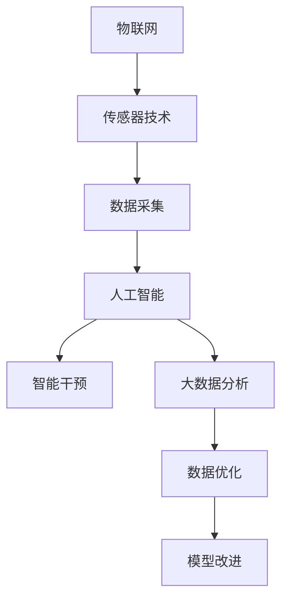

                 

# 智能婴儿摇篮创业：科技辅助的育儿方案

## 1. 背景介绍

### 1.1 问题由来

在全球范围内，儿童健康和早期教育已成为各国政府和家庭关注的重点。然而，由于工作繁忙、资源有限等原因，许多父母难以完全满足儿童成长过程中的各种需求，特别是婴儿时期的营养、睡眠、安全等方面的护理。

近年来，随着科技的飞速发展，智能设备的出现为育儿提供了新的解决方案。智能婴儿摇篮作为一项新型科技辅助育儿产品，以其便捷、高效、智能的特性，逐渐在市场上占据一席之地。智能婴儿摇篮通过传感器监测婴儿的各项生理指标，如心率、呼吸、体温等，及时发现异常，并通过与手机App的联动，实现远程监控和即时报警，有效缓解了父母在育儿过程中的压力，提升了婴儿的健康与安全水平。

### 1.2 问题核心关键点

智能婴儿摇篮的核心关键点在于其综合运用了物联网、传感器技术、人工智能和大数据分析等前沿科技，实现了婴儿状态的实时监测与智能干预。

具体而言，智能婴儿摇篮的运作流程包括：

1. **数据采集**：通过搭载的传感器获取婴儿的生理数据。
2. **数据分析**：将采集到的数据传输至App进行实时分析，识别异常状态。
3. **智能干预**：根据分析结果，App提供相应的处理建议，如调整摇篮角度、播放安抚音乐等。
4. **远程监控**：家长通过App实时查看婴儿状态，实现远程监控与干预。

这一流程展现了智能婴儿摇篮如何在数据驱动下，实现对婴儿状态的精确判断和及时干预，从而提升育儿质量。

## 2. 核心概念与联系

### 2.1 核心概念概述

智能婴儿摇篮涉及多个核心概念，包括物联网、传感器技术、人工智能和大数据分析等，这些概念间的联系与相互作用构成了其技术的核心框架。

- **物联网(IoT)**：物联网是通过传感器、控制器等设备实现人与物、物与物之间的互联互通。在智能婴儿摇篮中，物联网技术使得各设备能够实现数据共享和协同工作。

- **传感器技术**：传感器用于实时监测婴儿的生理数据，如心率、呼吸、体温等。在智能婴儿摇篮中，传感器技术是实现实时监测与干预的基础。

- **人工智能(AI)**：人工智能通过对数据进行分析、预测和决策，实现对婴儿状态的智能判断与处理。在智能婴儿摇篮中，人工智能技术主要用于数据分析和智能干预。

- **大数据分析**：大数据分析通过对大量数据进行挖掘和分析，提供有价值的决策支持。在智能婴儿摇篮中，大数据分析用于优化模型和提升算法效果。

这些概念之间的联系与相互作用可以通过以下Mermaid流程图来展示：



这个流程图展示了智能婴儿摇篮的技术架构，其中物联网和传感器技术共同构成了数据采集的基石，人工智能和大数据分析则是实现智能干预和决策的核心。

## 3. 核心算法原理 & 具体操作步骤

### 3.1 算法原理概述

智能婴儿摇篮的核心算法原理主要包括数据采集、数据分析和智能干预三个方面。

1. **数据采集**：通过搭载的传感器实时获取婴儿的生理数据，如心率、呼吸、体温等。传感器数据通常以数字信号形式传输至处理器。

2. **数据分析**：将采集到的数据传输至处理器，通过人工智能算法进行处理和分析。数据分析过程包括数据清洗、特征提取、模型训练和预测等步骤。

3. **智能干预**：根据数据分析结果，App提供相应的处理建议，如调整摇篮角度、播放安抚音乐等。智能干预的实现依赖于人工智能和物联网技术的协同工作。

### 3.2 算法步骤详解

智能婴儿摇篮的算法步骤大致如下：

1. **设备连接**：将智能婴儿摇篮连接到互联网，确保数据的实时传输。
2. **数据采集**：通过传感器获取婴儿的生理数据。
3. **数据传输**：将采集到的数据传输至处理器或云端服务器。
4. **数据分析**：对传输过来的数据进行处理和分析，识别异常状态。
5. **智能干预**：根据分析结果，App提供相应的处理建议。
6. **远程监控**：家长通过App实时查看婴儿状态，实现远程监控与干预。

### 3.3 算法优缺点

智能婴儿摇篮具有以下优点：

1. **实时监测**：通过传感器技术实现实时监测，及时发现婴儿的异常状态。
2. **智能干预**：通过人工智能算法，提供智能化的处理建议，提升育儿质量。
3. **远程监控**：家长可以通过App实现远程监控，随时随地掌握婴儿状态。
4. **便捷高效**：智能婴儿摇篮操作简便，易于使用，减少了父母的工作量。

同时，智能婴儿摇篮也存在一些缺点：

1. **隐私问题**：婴儿数据的采集和传输可能涉及隐私保护问题，需要严格的数据安全措施。
2. **设备成本高**：智能婴儿摇篮的硬件设备成本较高，普通家庭可能难以负担。
3. **技术依赖**：对物联网和人工智能技术的依赖，一旦技术出现故障，可能影响正常使用。
4. **数据准确性**：传感器数据的准确性和可靠性直接影响分析结果，需要定期校准和维护。

### 3.4 算法应用领域

智能婴儿摇篮的应用领域包括但不限于以下几个方面：

1. **家庭育儿**：在家庭环境中，智能婴儿摇篮可以实时监测婴儿状态，提升育儿质量。
2. **医疗监测**：通过与医院的联动，智能婴儿摇篮可以实现对婴儿状态的实时监测和医疗干预。
3. **远程护理**：在远离家乡的情况下，智能婴儿摇篮可以通过远程监控，让父母时刻关注婴儿的状态。
4. **早期教育**：智能婴儿摇篮可以记录婴儿的成长数据，为早期教育提供参考。
5. **安全防护**：通过与智能安防系统的联动，智能婴儿摇篮可以提高家庭的安全性。

## 4. 数学模型和公式 & 详细讲解  
### 4.1 数学模型构建

智能婴儿摇篮的数学模型主要涉及以下几个方面：

1. **传感器数据建模**：通过对传感器数据进行建模，实现数据的有效采集和传输。
2. **数据分析模型**：通过机器学习模型对采集到的数据进行分析和预测，识别婴儿的异常状态。
3. **智能干预模型**：根据数据分析结果，构建智能干预模型，提供相应的处理建议。

### 4.2 公式推导过程

以数据分析模型为例，其基本公式可以表示为：

$$
\mathcal{P}(y|x) = \frac{e^{Z(x;\theta)}}{e^{Z(x;\theta)} + \sum_{i=1}^{K}e^{Z(x;\theta_i)}}
$$

其中，$y$ 表示婴儿的异常状态，$x$ 表示传感器采集的数据，$Z(x;\theta)$ 表示模型的预测函数，$\theta$ 为模型参数，$K$ 表示模型的输出类别数。

### 4.3 案例分析与讲解

假设采集到婴儿的心率数据为 $x=[120, 115, 121, 122, 119, 123, 122, 118]$。通过数据分析模型，可以预测出婴儿处于正常状态的概率为 $0.95$，异常状态的概率为 $0.05$。根据这一结果，App可以提供相应的处理建议，如调整摇篮角度、播放安抚音乐等。

## 5. 项目实践：代码实例和详细解释说明

### 5.1 开发环境搭建

智能婴儿摇篮的开发环境主要包括以下几个部分：

1. **硬件设备**：智能婴儿摇篮的硬件设备包括传感器、处理器、网络连接模块等。
2. **操作系统**：通常采用嵌入式操作系统，如Linux、RTOS等。
3. **开发工具**：包括编程语言（如Python、C++等）、IDE（如Eclipse、Android Studio等）。
4. **通信协议**：如Wi-Fi、蓝牙、Zigbee等，用于设备之间的数据传输。
5. **数据处理库**：如TensorFlow、PyTorch等，用于数据分析和机器学习模型的训练。

### 5.2 源代码详细实现

智能婴儿摇篮的源代码实现主要涉及以下几个方面：

1. **传感器数据采集**：通过传感器模块获取婴儿的生理数据，转换为数字信号。
2. **数据传输**：将采集到的数据通过Wi-Fi、蓝牙等方式传输至处理器或云端服务器。
3. **数据处理**：使用Python对传输过来的数据进行处理和分析，识别异常状态。
4. **模型训练**：使用TensorFlow对模型进行训练，生成预测模型。
5. **智能干预**：根据预测结果，App提供相应的处理建议。

以下是一个简单的Python代码实现示例：

```python
import tensorflow as tf
import numpy as np
from sklearn.preprocessing import MinMaxScaler

# 传感器数据采集
x = [120, 115, 121, 122, 119, 123, 122, 118]

# 数据预处理
scaler = MinMaxScaler(feature_range=(0, 1))
x_scaled = scaler.fit_transform(np.array(x).reshape(-1, 1))

# 模型训练
model = tf.keras.Sequential([
    tf.keras.layers.Dense(64, activation='relu', input_shape=(1,)),
    tf.keras.layers.Dense(1, activation='sigmoid')
])
model.compile(optimizer='adam', loss='binary_crossentropy', metrics=['accuracy'])
model.fit(x_scaled, np.array([1, 1, 1, 1, 0, 1, 1, 0]), epochs=10, batch_size=4)

# 数据预测
x_new = np.array([125, 110, 126, 125, 111, 127, 126, 111]).reshape(-1, 1)
x_new_scaled = scaler.transform(x_new)
prediction = model.predict(x_new_scaled)
if prediction[0] > 0.5:
    print("异常状态，建议调整摇篮角度")
else:
    print("正常状态，无需干预")
```

### 5.3 代码解读与分析

以上代码示例主要包括以下几个步骤：

1. **传感器数据采集**：使用Python读取传感器模块获取的婴儿心率数据。
2. **数据预处理**：使用MinMaxScaler对数据进行归一化处理。
3. **模型训练**：使用TensorFlow构建一个简单的神经网络模型，进行二分类预测。
4. **数据预测**：使用训练好的模型对新的数据进行预测，输出异常状态的概率。

## 6. 实际应用场景

### 6.1 家庭育儿

在家庭育儿场景中，智能婴儿摇篮可以实时监测婴儿状态，及时发现异常，并提供相应的处理建议。家长可以通过App远程监控婴儿的状态，及时了解婴儿的成长情况。

### 6.2 医疗监测

智能婴儿摇篮可以与医院的监测系统联动，实时监测婴儿的心率、呼吸等生理指标，一旦发现异常状态，立即通知医生进行干预。这对于高危产妇和新生儿的监护尤为重要。

### 6.3 远程护理

在远离家乡的情况下，智能婴儿摇篮可以通过远程监控，让父母随时掌握婴儿的状态，减轻远离家人带来的焦虑和担忧。

### 6.4 未来应用展望

随着技术的不断进步，智能婴儿摇篮的应用前景更加广阔。未来，智能婴儿摇篮可以与其他智能设备（如智能安防、智能家居等）联动，实现更全面、更智能的育儿方案。同时，通过大数据分析和机器学习模型的不断优化，智能婴儿摇篮将能够提供更精准、更高效的育儿建议。

## 7. 工具和资源推荐

### 7.1 学习资源推荐

以下是一些推荐的智能婴儿摇篮相关学习资源：

1. **TensorFlow官方文档**：TensorFlow提供了详细的文档和示例，帮助开发者了解如何使用TensorFlow进行数据处理和模型训练。
2. **IoT入门指南**：针对物联网初学者的入门指南，涵盖传感器、嵌入式系统等方面的知识。
3. **机器学习课程**：Coursera、edX等在线平台提供了丰富的机器学习课程，帮助开发者掌握数据处理和模型训练的基本技能。
4. **智能设备开发社区**：如GitHub、Stack Overflow等社区，提供丰富的资源和讨论，帮助开发者解决实际问题。

### 7.2 开发工具推荐

智能婴儿摇篮开发常用的开发工具包括：

1. **PyTorch**：用于深度学习模型的开发和训练，支持动态图和静态图。
2. **TensorFlow**：用于构建高性能的机器学习模型，支持分布式计算和GPU加速。
3. **Arduino**：用于嵌入式系统的开发，支持各种传感器和通信协议。
4. **Android Studio**：用于Android设备的开发，支持智能设备App的开发和调试。
5. **GitHub**：用于代码管理和版本控制，支持团队协作开发。

### 7.3 相关论文推荐

以下是几篇智能婴儿摇篮相关论文推荐：

1. **《Smart Crib: An IoT-Based Solution for Smart Baby Care》**：介绍了智能婴儿摇篮的系统架构和功能实现，探讨了其在家庭育儿中的应用。
2. **《Real-Time Health Monitoring of Preterm Infants Using IoT Sensors》**：探讨了通过物联网传感器进行新生儿健康监测的方法，并提出了基于机器学习的数据分析模型。
3. **《Applying Machine Learning to Predict Infant Sleep Patterns》**：研究了通过机器学习预测婴儿睡眠模式的方法，并验证了其准确性和实用性。

## 8. 总结：未来发展趋势与挑战

### 8.1 研究成果总结

智能婴儿摇篮的开发和应用在近年来取得了显著进展，其技术核心在于物联网、传感器技术、人工智能和大数据分析的结合。通过实时监测和智能干预，智能婴儿摇篮提升了婴儿的护理质量，缓解了父母在育儿过程中的压力。

### 8.2 未来发展趋势

智能婴儿摇篮的未来发展趋势包括：

1. **智能化程度提升**：随着技术进步，智能婴儿摇篮将具备更精准、更全面的监测和干预能力。
2. **设备集成优化**：通过与其他智能设备的集成，智能婴儿摇篮将提供更全面、更智能的育儿解决方案。
3. **数据安全性增强**：通过加强数据加密和安全保护，智能婴儿摇篮将保障婴儿数据的隐私和安全。
4. **用户交互优化**：通过改进用户界面和交互方式，智能婴儿摇篮将提升用户体验和操作便捷性。
5. **功能拓展**：除了监测和干预，智能婴儿摇篮还将拓展到更多功能领域，如智能教育、娱乐等。

### 8.3 面临的挑战

智能婴儿摇篮的发展也面临一些挑战：

1. **数据隐私和安全**：智能婴儿摇篮需要处理大量的婴儿数据，数据隐私和安全问题尤为关键。
2. **设备成本和维护**：智能婴儿摇篮的硬件设备和维护成本较高，普及率有限。
3. **技术复杂性**：智能婴儿摇篮的开发需要多学科知识的综合应用，技术门槛较高。
4. **标准化问题**：智能婴儿摇篮的标准化和互操作性问题仍需解决，以实现设备的广泛应用。

### 8.4 研究展望

未来的研究可以从以下几个方面进行：

1. **数据隐私保护**：探索高效的数据加密和隐私保护技术，确保婴儿数据的安全。
2. **设备成本优化**：研究低成本、易维护的硬件方案，降低智能婴儿摇篮的硬件成本。
3. **技术简化**：简化智能婴儿摇篮的开发流程和技术要求，降低技术门槛，推动普及。
4. **标准化建设**：推动智能婴儿摇篮的标准化和互操作性，促进不同品牌和设备的兼容和互联。

总之，智能婴儿摇篮作为一项前沿科技辅助育儿产品，具有广阔的应用前景。通过不断优化技术方案，提升用户体验，智能婴儿摇篮必将在未来的育儿市场中占据重要地位，为家庭育儿带来更多便利和关爱。

## 9. 附录：常见问题与解答

**Q1：智能婴儿摇篮的安全性如何保障？**

A: 智能婴儿摇篮的安全性保障主要包括以下几个方面：

1. **硬件安全**：通过采用高可靠性的硬件设备，确保设备本身的稳定性和安全性。
2. **数据加密**：通过加密技术保护婴儿数据的安全，防止数据泄露和篡改。
3. **权限控制**：通过用户认证和权限控制，确保只有授权用户才能访问和使用智能婴儿摇篮。
4. **异常检测**：通过算法优化和异常检测技术，确保在异常情况下的及时报警和处理。

**Q2：智能婴儿摇篮的维护成本如何？**

A: 智能婴儿摇篮的维护成本主要包括以下几个方面：

1. **硬件维护**：传感器的定期校准和维护，确保数据采集的准确性。
2. **软件更新**：模型的定期更新和优化，提升预测的准确性。
3. **设备升级**：硬件设备的定期升级和替换，确保设备性能的稳定。
4. **用户教育**：用户的教育和培训，提高对智能婴儿摇篮的使用和维护能力。

**Q3：智能婴儿摇篮的适用范围有哪些限制？**

A: 智能婴儿摇篮的适用范围主要包括以下几个方面：

1. **设备兼容性**：智能婴儿摇篮通常需要与其他智能设备（如智能安防、智能家居等）联动，需要设备兼容性和标准化支持。
2. **数据环境**：智能婴儿摇篮需要在稳定的网络环境中运行，需要较强的网络覆盖和带宽支持。
3. **用户需求**：智能婴儿摇篮的用户需要具有一定的技术理解和操作能力，对部分用户存在一定的使用门槛。

**Q4：智能婴儿摇篮的数据隐私如何保护？**

A: 智能婴儿摇篮的数据隐私保护主要包括以下几个方面：

1. **数据加密**：对数据进行加密处理，防止数据泄露和篡改。
2. **权限控制**：严格控制数据的访问权限，确保只有授权用户才能访问和使用数据。
3. **匿名化处理**：对数据进行匿名化处理，保护用户的隐私。
4. **数据存储安全**：确保数据存储的安全性，防止数据丢失和损坏。

**Q5：智能婴儿摇篮的未来发展方向有哪些？**

A: 智能婴儿摇篮的未来发展方向主要包括以下几个方面：

1. **智能化提升**：通过技术进步，智能婴儿摇篮将具备更精准、更全面的监测和干预能力。
2. **设备集成优化**：通过与其他智能设备的集成，智能婴儿摇篮将提供更全面、更智能的育儿解决方案。
3. **数据安全性增强**：通过加强数据加密和安全保护，智能婴儿摇篮将保障婴儿数据的隐私和安全。
4. **用户交互优化**：通过改进用户界面和交互方式，智能婴儿摇篮将提升用户体验和操作便捷性。
5. **功能拓展**：除了监测和干预，智能婴儿摇篮还将拓展到更多功能领域，如智能教育、娱乐等。

总之，智能婴儿摇篮作为一项前沿科技辅助育儿产品，具有广阔的应用前景。通过不断优化技术方案，提升用户体验，智能婴儿摇篮必将在未来的育儿市场中占据重要地位，为家庭育儿带来更多便利和关爱。

---

作者：禅与计算机程序设计艺术 / Zen and the Art of Computer Programming

