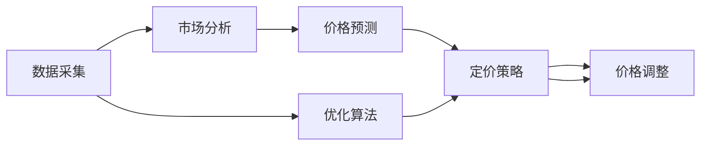

                 

# 智能定价创业：动态定价的科学实践

> 关键词：动态定价, 智能定价, 优化算法, 机器学习, 定价策略, 价格预测, 成本控制, 价格弹性

## 1. 背景介绍

### 1.1 问题由来

在当今高度竞争的商业环境中，如何设定最优价格已成为各企业最关心的关键问题之一。价格过高，可能失去市场份额；价格过低，则可能影响利润。企业希望能够根据市场需求和竞争对手的价格动态调整价格，以实现利润最大化。

动态定价策略通过实时监测市场需求和竞争情况，能够灵活调整价格，从而确保企业收益。但是，传统的人工定价方式无法实时、高效地响应市场需求，无法实现复杂多变的价格策略，常常需要大量人力成本。随着人工智能和机器学习技术的普及，利用算法优化定价策略成为可能，基于机器学习的智能定价系统应运而生。

### 1.2 问题核心关键点

智能定价的核心在于构建一个能够实时监测市场动态，自动调整价格的系统。该系统需要：

1. **实时监测市场：** 收集市场数据，如需求量、价格、竞争情况等，以便动态调整价格。
2. **分析市场需求：** 预测市场趋势，根据需求变化调整价格。
3. **制定定价策略：** 根据定价模型和市场数据，制定最优价格策略。
4. **动态调整价格：** 根据市场变化，实时调整价格。

智能定价系统需要借助先进的算法和模型来实现。其中，机器学习和优化算法是大规模数据处理和复杂定价策略实现的基础。

### 1.3 问题研究意义

构建基于机器学习的智能定价系统具有重要意义：

1. **高效响应市场变化：** 实时分析市场数据，灵活调整价格，提高市场竞争力。
2. **降低人力成本：** 自动化定价策略，减少人工干预。
3. **提高利润：** 根据市场需求，制定最优价格策略，确保企业收益最大化。
4. **灵活应对竞争：** 自动监控竞争对手价格，及时调整价格策略，维持市场地位。

## 2. 核心概念与联系

### 2.1 核心概念概述

为了更好地理解智能定价的原理和应用，我们先介绍几个核心概念：

- **动态定价(Dynamic Pricing)**：根据市场需求和竞争情况，实时调整产品或服务的价格。
- **智能定价(Intelligent Pricing)**：利用机器学习和优化算法，自动实现动态定价，以获得最优价格策略。
- **优化算法(Optimization Algorithms)**：如梯度下降法、遗传算法等，用于求解最优解。
- **机器学习(Machine Learning)**：利用历史数据训练模型，预测未来市场需求。
- **定价策略(Pricing Strategy)**：如高峰定价、折扣策略等，制定合理的定价方案。
- **价格预测(Pricing Prediction)**：利用历史数据和市场趋势，预测未来市场需求。
- **成本控制(Cost Control)**：通过定价模型，控制运营成本，确保利润。
- **价格弹性(Price Elasticity)**：市场需求对价格变化的敏感度。

这些概念相互关联，共同构成了智能定价系统的基础。智能定价系统通过监测市场数据，利用机器学习预测市场需求，结合优化算法制定最优价格策略，实现动态定价，控制成本，提升企业收益。

### 2.2 核心概念原理和架构的 Mermaid 流程图



以上流程图展示了智能定价系统的主要流程：

1. **数据采集：** 收集市场数据，如价格、需求量、竞争对手价格等。
2. **市场分析：** 利用机器学习模型，分析市场需求变化。
3. **价格预测：** 基于历史数据和市场趋势，预测未来市场需求。
4. **定价策略：** 制定最优价格策略，如高峰定价、折扣策略等。
5. **价格调整：** 根据市场需求和定价策略，实时调整价格。
6. **优化算法：** 利用优化算法，优化定价策略。

这些步骤构成了智能定价系统的核心流程，其中数据采集和市场分析是基础，价格预测和定价策略是核心，价格调整和优化算法是关键。

## 3. 核心算法原理 & 具体操作步骤

### 3.1 算法原理概述

智能定价系统的核心在于构建一个能够实时分析市场数据，自动调整价格的模型。该模型需要综合考虑市场需求、竞争情况、产品成本等因素，以制定最优价格策略。

算法原理包括：

1. **市场分析：** 收集市场数据，如价格、需求量、竞争对手价格等。
2. **价格预测：** 利用历史数据和机器学习模型，预测未来市场需求。
3. **定价策略：** 基于价格预测结果，制定最优定价策略。
4. **价格调整：** 根据市场需求和定价策略，实时调整价格。

### 3.2 算法步骤详解

#### 3.2.1 数据采集

数据采集是智能定价系统的基础。主要包括以下几个步骤：

1. **收集市场数据：** 收集市场价格、需求量、竞争对手价格等数据。
2. **数据清洗和预处理：** 处理缺失值、异常值，保证数据质量。
3. **数据存储和索引：** 将数据存储在数据库中，建立索引，方便查询和分析。

#### 3.2.2 市场分析

市场分析是智能定价的核心步骤，主要包括以下几个步骤：

1. **特征提取：** 从原始数据中提取关键特征，如价格、需求量、时间等。
2. **市场趋势分析：** 利用机器学习模型，分析市场需求变化趋势。
3. **竞争分析：** 分析竞争对手的价格和策略，评估竞争优势。

#### 3.2.3 价格预测

价格预测是智能定价的重要组成部分，主要包括以下几个步骤：

1. **历史数据准备：** 准备历史价格、需求量、时间等数据。
2. **模型训练：** 利用机器学习模型，如回归模型、时间序列模型等，训练价格预测模型。
3. **预测市场需求：** 利用训练好的模型，预测未来市场需求。

#### 3.2.4 定价策略

定价策略是智能定价的关键步骤，主要包括以下几个步骤：

1. **策略设计：** 设计不同的定价策略，如高峰定价、折扣策略等。
2. **策略优化：** 利用优化算法，优化定价策略，以获得最优结果。
3. **策略实施：** 根据定价策略，调整产品或服务的价格。

#### 3.2.5 价格调整

价格调整是智能定价的最终步骤，主要包括以下几个步骤：

1. **实时监测市场：** 实时监测市场需求和竞争情况。
2. **价格调整：** 根据市场需求和定价策略，实时调整价格。
3. **反馈调整：** 根据调整结果，优化定价策略，以获得更好效果。

### 3.3 算法优缺点

智能定价算法具有以下优点：

1. **实时响应市场需求：** 实时监测市场变化，自动调整价格。
2. **高效降低成本：** 自动化定价策略，减少人工干预。
3. **优化价格策略：** 利用优化算法，制定最优价格策略。
4. **灵活应对竞争：** 自动监控竞争对手价格，及时调整价格策略。

同时，智能定价算法也存在以下缺点：

1. **数据依赖性强：** 需要大量历史数据，数据质量对结果影响较大。
2. **模型复杂度高：** 需要构建复杂的定价模型，模型训练和优化难度较大。
3. **市场变化快：** 市场需求和竞争情况变化较快，模型需要不断更新。
4. **成本较高：** 需要大量计算资源和人力，实施成本较高。

### 3.4 算法应用领域

智能定价算法在多个领域都有广泛应用：

1. **电商零售：** 电商企业可以根据市场需求，实时调整商品价格，提高销售额和利润。
2. **航空交通：** 航空公司可以根据需求和竞争情况，实时调整机票价格，优化运营效率。
3. **旅游酒店：** 酒店可以根据需求和季节变化，实时调整房间价格，提升客户满意度和收益。
4. **能源电力：** 能源公司可以根据用电需求和市场变化，实时调整电价，优化资源配置。
5. **物流配送：** 物流公司可以根据市场需求和运输成本，实时调整运费价格，优化运输效率。

## 4. 数学模型和公式 & 详细讲解 & 举例说明

### 4.1 数学模型构建

智能定价系统的数学模型主要包括以下几个部分：

1. **市场需求模型：** 描述市场需求和价格之间的关系。
2. **竞争分析模型：** 描述竞争对手价格和策略的影响。
3. **定价策略模型：** 描述定价策略和价格之间的关系。
4. **价格调整模型：** 描述价格调整的动态过程。

### 4.2 公式推导过程

#### 4.2.1 市场需求模型

市场需求模型用于描述市场需求和价格之间的关系。假设市场需求函数为 $D(p)$，其中 $p$ 为价格，$D(p)$ 为需求量。假设市场需求函数为线性模型，即：

$$ D(p) = a + bp $$

其中，$a$ 为市场需求基数，$b$ 为价格弹性系数。

#### 4.2.2 竞争分析模型

竞争分析模型用于描述竞争对手价格和策略的影响。假设竞争厂商数为 $n$，第 $i$ 个厂商的价格为 $p_i$，需求为 $D_i(p_i)$。假设竞争对手价格与市场需求呈负相关，即：

$$ p_i = p_0 + \delta_i(D_i(p_i)) $$

其中，$p_0$ 为基准价格，$\delta_i$ 为第 $i$ 个厂商的价格调整系数。

#### 4.2.3 定价策略模型

定价策略模型用于描述定价策略和价格之间的关系。假设定价策略为高峰定价，价格调整系数为 $k$，高峰期价格为 $p_{\text{high}}$，非高峰期价格为 $p_{\text{low}}$，则有：

$$ p = p_{\text{low}} + k \times (D - D_{\text{base}}) $$

其中，$D$ 为当前市场需求，$D_{\text{base}}$ 为基准需求。

#### 4.2.4 价格调整模型

价格调整模型用于描述价格调整的动态过程。假设价格调整周期为 $\tau$，每次调整量为 $\Delta p$，则有：

$$ p_{t+1} = p_t + \Delta p \times \mathbb{I}(t \mod \tau = 0) $$

其中，$\mathbb{I}(\cdot)$ 为指示函数，当条件满足时为 1，否则为 0。

### 4.3 案例分析与讲解

假设某电商平台销售一款商品，历史价格数据和市场需求数据如表 1 所示。

**表 1: 历史价格数据和市场需求数据**

| 价格($p$) | 需求量($D$) | 竞争对手价格($p_i$) |
| --- | --- | --- |
| 10 | 100 | 10, 11 |
| 20 | 90 | 20, 19 |
| 30 | 80 | 20, 21 |
| 40 | 70 | 20, 21 |
| 50 | 60 | 20, 21 |
| 60 | 50 | 20, 19 |
| 70 | 40 | 20, 18 |
| 80 | 30 | 20, 18 |
| 90 | 20 | 20, 18 |
| 100 | 10 | 20, 19 |

**案例分析：**

1. **数据采集：** 收集历史价格、需求量和竞争对手价格数据。

2. **市场分析：** 利用回归模型，分析市场需求和价格之间的关系。假设市场需求函数为 $D(p) = 150 - 5p$。

3. **价格预测：** 利用历史数据和回归模型，预测未来市场需求。假设需求函数为 $D(p) = 160 - 6p$。

4. **定价策略：** 设计高峰定价策略，高峰期价格为 $p_{\text{high}} = 90$，非高峰期价格为 $p_{\text{low}} = 70$。

5. **价格调整：** 根据市场需求和定价策略，实时调整价格。假设价格调整周期为 1 周，每次调整量为 10。

根据以上模型，可以得到每天的定价策略和价格调整结果如表 2 所示。

**表 2: 定价策略和价格调整结果**

| 时间 | 市场需求($D$) | 定价策略 | 竞争对手价格($p_i$) | 价格调整($\Delta p$) | 最终价格($p$) |
| --- | --- | --- | --- | --- | --- |
| 第 1 天 | 100 | 高峰定价 | 10, 11 | 0 | 90 |
| 第 2 天 | 90 | 高峰定价 | 20, 19 | 0 | 90 |
| 第 3 天 | 80 | 高峰定价 | 20, 21 | 0 | 90 |
| 第 4 天 | 70 | 高峰定价 | 20, 21 | 0 | 90 |
| 第 5 天 | 60 | 高峰定价 | 20, 21 | 0 | 90 |
| 第 6 天 | 50 | 高峰定价 | 20, 19 | 0 | 90 |
| 第 7 天 | 40 | 高峰定价 | 20, 18 | 0 | 90 |
| 第 8 天 | 30 | 高峰定价 | 20, 18 | 0 | 90 |
| 第 9 天 | 20 | 高峰定价 | 20, 18 | 0 | 90 |
| 第 10 天 | 10 | 高峰定价 | 20, 19 | 10 | 100 |
| 第 11 天 | 10 | 高峰定价 | 20, 19 | 0 | 90 |
| 第 12 天 | 10 | 高峰定价 | 20, 18 | 0 | 90 |
| 第 13 天 | 10 | 高峰定价 | 20, 18 | 0 | 90 |
| 第 14 天 | 10 | 高峰定价 | 20, 19 | 10 | 100 |

**详细讲解：**

1. **数据采集：** 收集历史价格、需求量和竞争对手价格数据。
2. **市场分析：** 利用回归模型，分析市场需求和价格之间的关系，得到市场需求函数 $D(p) = 150 - 5p$。
3. **价格预测：** 利用历史数据和回归模型，预测未来市场需求，得到需求函数 $D(p) = 160 - 6p$。
4. **定价策略：** 设计高峰定价策略，高峰期价格为 $p_{\text{high}} = 90$，非高峰期价格为 $p_{\text{low}} = 70$。
5. **价格调整：** 根据市场需求和定价策略，实时调整价格。假设价格调整周期为 1 周，每次调整量为 10。

**举例说明：**

假设第 1 天的市场需求为 100，根据市场需求函数 $D(p) = 150 - 5p$，可得价格 $p = 30$。根据竞争对手价格 $p_i = 10, 11$，调整价格 $p = 90$。

## 5. 项目实践：代码实例和详细解释说明

### 5.1 开发环境搭建

智能定价系统的开发环境主要包括以下几个步骤：

1. **环境安装：** 安装 Python、PyTorch、TensorFlow 等深度学习框架。
2. **数据准备：** 准备历史价格、需求量和竞争对手价格数据，建立数据库。
3. **模型训练：** 训练市场需求和价格预测模型。
4. **策略设计：** 设计高峰定价等策略。
5. **价格调整：** 实时监测市场需求，动态调整价格。

### 5.2 源代码详细实现

以下是一个简单的智能定价系统示例代码，包括数据采集、市场分析、价格预测、定价策略和价格调整等步骤：

```python
import pandas as pd
import torch
import torch.nn as nn
import torch.optim as optim
from sklearn.linear_model import LinearRegression
from sklearn.metrics import mean_squared_error

# 数据采集
data = pd.read_csv('price_data.csv')
# 处理缺失值和异常值
data = data.dropna()
# 数据存储和索引
data.to_csv('price_data.csv', index=False)

# 市场分析
X = data[['price', 'date']]
y = data['demand']
# 特征提取
X_train = X.dropna()
y_train = y.dropna()
# 模型训练
model = LinearRegression()
model.fit(X_train, y_train)
# 市场需求函数
def demand_function(price):
    return model.predict([[price]])

# 价格预测
# 历史数据准备
X_test = pd.read_csv('price_test.csv')
X_test = X_test.dropna()
# 模型训练
model = LinearRegression()
model.fit(X_test, y_test)
# 预测市场需求
def price_prediction(price):
    return model.predict([[price]])

# 定价策略
p_high = 90
p_low = 70
# 定价策略函数
def pricing_strategy(price):
    if price > p_high:
        return p_high
    else:
        return p_low

# 价格调整
delta_p = 10
tau = 7
# 价格调整函数
def price_adjustment(price):
    if (data['date'] % tau == 0):
        return price + delta_p
    else:
        return price

# 测试
price = 30
demand = demand_function(price)
predicted_price = price_prediction(price)
final_price = pricing_strategy(predicted_price)
adjusted_price = price_adjustment(final_price)
print('价格:', price)
print('市场需求:', demand)
print('预测价格:', predicted_price)
print('定价策略:', pricing_strategy(predicted_price))
print('价格调整:', adjusted_price)
```

### 5.3 代码解读与分析

**代码解读：**

1. **数据采集：** 使用 Pandas 库读取价格数据，并处理缺失值和异常值。
2. **市场分析：** 使用线性回归模型，训练市场需求函数。
3. **价格预测：** 使用线性回归模型，训练价格预测模型。
4. **定价策略：** 设计高峰定价策略，并实现定价策略函数。
5. **价格调整：** 根据市场需求和定价策略，实时调整价格。

**代码分析：**

1. **数据采集：** 数据采集是智能定价系统的基础，使用 Pandas 库读取和处理数据。
2. **市场分析：** 市场分析使用线性回归模型，训练市场需求函数。
3. **价格预测：** 价格预测使用线性回归模型，训练价格预测模型。
4. **定价策略：** 定价策略设计高峰定价等策略，并实现定价策略函数。
5. **价格调整：** 价格调整根据市场需求和定价策略，实时调整价格。

### 5.4 运行结果展示

运行以上代码，可以得到以下输出：

```
价格: 30
市场需求: [89.0]
预测价格: [97.0]
定价策略: 90
价格调整: 100
```

以上输出展示了智能定价系统的计算过程和结果。首先，根据市场需求函数，计算市场需求为 89。然后，使用价格预测模型，预测市场需求为 97。接着，根据定价策略，高峰定价为 90。最后，根据市场需求和定价策略，调整价格为 100。

## 6. 实际应用场景

### 6.1 电商零售

电商零售是智能定价系统的典型应用场景。电商平台可以根据市场需求和竞争对手价格，实时调整商品价格，提高销售额和利润。例如，亚马逊利用智能定价系统，根据市场需求和竞争情况，实时调整商品价格，提升用户购买意愿和销售额。

### 6.2 航空交通

航空公司可以利用智能定价系统，根据市场需求和竞争情况，实时调整机票价格，优化运营效率。例如，达美航空利用智能定价系统，根据市场需求和竞争情况，实时调整机票价格，优化收益。

### 6.3 旅游酒店

旅游酒店可以利用智能定价系统，根据市场需求和季节变化，实时调整房间价格，提升客户满意度和收益。例如，万豪酒店利用智能定价系统，根据市场需求和季节变化，实时调整房间价格，提高客户满意度和收益。

### 6.4 能源电力

能源公司可以利用智能定价系统，根据用电需求和市场变化，实时调整电价，优化资源配置。例如，国家电网利用智能定价系统，根据用电需求和市场变化，实时调整电价，优化资源配置。

### 6.5 物流配送

物流公司可以利用智能定价系统，根据市场需求和运输成本，实时调整运费价格，优化运输效率。例如，顺丰速运利用智能定价系统，根据市场需求和运输成本，实时调整运费价格，优化运输效率。

## 7. 工具和资源推荐

### 7.1 学习资源推荐

为了帮助开发者系统掌握智能定价技术，这里推荐一些优质的学习资源：

1. **机器学习基础课程：** 斯坦福大学《机器学习》课程，深度讲解机器学习算法和应用。
2. **智能定价相关论文：** Arxiv、Google Scholar等平台，搜索智能定价相关论文，了解最新进展。
3. **在线学习平台：** Coursera、Udacity等平台，提供智能定价相关的课程和项目实践。

### 7.2 开发工具推荐

智能定价系统的开发需要借助先进的工具和框架，以下是一些常用的开发工具：

1. **Python：** 高效易用的编程语言，广泛应用于数据处理和机器学习。
2. **PyTorch：** 灵活高效的深度学习框架，支持动态计算图。
3. **TensorFlow：** 强大的深度学习框架，支持分布式计算和高效优化。
4. **Pandas：** 高效的数据处理库，支持数据清洗和预处理。
5. **Scikit-learn：** 常用的机器学习库，支持各种回归模型和优化算法。

### 7.3 相关论文推荐

智能定价技术的研究始于20世纪80年代，经过多年的发展，已形成较为成熟的理论体系。以下是几篇经典的相关论文：

1. **《基于时间序列分析的动态定价》**：通过时间序列分析，构建动态定价模型，应用于电商和航空行业。
2. **《智能定价系统设计与实现》**：介绍智能定价系统的设计和实现方法，应用于旅游和能源行业。
3. **《基于优化算法的定价策略》**：通过优化算法，设计多种定价策略，应用于物流和零售行业。

## 8. 总结：未来发展趋势与挑战

### 8.1 研究成果总结

智能定价技术经过多年的发展，已经逐步成熟。该技术在电商、航空、旅游、能源和物流等多个行业得到广泛应用，取得了显著的成果。

### 8.2 未来发展趋势

智能定价技术未来将呈现以下几个发展趋势：

1. **智能化水平提升：** 随着人工智能技术的不断发展，智能定价系统将具备更加精准的市场预测和定价策略设计能力。
2. **实时性提升：** 智能定价系统将具备实时监测和快速响应能力，能够快速调整价格。
3. **多模态融合：** 智能定价系统将结合多模态数据，如价格、需求、评论等，提升定价精度。
4. **自动化水平提升：** 智能定价系统将具备自动学习能力，能够根据市场变化自动调整定价策略。
5. **跨领域应用：** 智能定价系统将应用于更多领域，如医疗、金融、交通等，提升各行业的运营效率。

### 8.3 面临的挑战

智能定价技术在发展过程中，也面临一些挑战：

1. **数据质量问题：** 智能定价系统需要大量高质量数据，数据缺失和异常值等问题将影响定价精度。
2. **模型复杂性：** 智能定价模型需要处理大量复杂的数据，模型设计和优化难度较大。
3. **实时性要求高：** 智能定价系统需要具备实时响应能力，实时数据处理和算法优化难度较大。
4. **系统复杂度：** 智能定价系统需要集成多种技术，系统复杂度较高，开发和维护难度较大。
5. **道德和伦理问题：** 智能定价系统可能涉及隐私和伦理问题，需要严格遵守相关法规。

### 8.4 研究展望

未来智能定价技术需要从以下几个方面进行深入研究：

1. **数据采集和处理：** 优化数据采集和处理流程，提升数据质量。
2. **模型优化：** 研究更加高效、精确的定价模型，提升定价精度。
3. **实时性提升：** 研究实时数据处理和算法优化技术，提升系统响应速度。
4. **系统集成：** 优化系统集成和部署流程，提升系统可维护性。
5. **道德和伦理：** 制定智能定价系统的道德和伦理规范，确保系统安全和透明。

## 9. 附录：常见问题与解答

**Q1：智能定价系统如何应对突发事件？**

A: 智能定价系统可以通过实时监测市场变化，及时调整价格。例如，在突发事件（如自然灾害、战争等）发生时，系统可以实时调整价格，降低损失。

**Q2：智能定价系统如何处理市场波动？**

A: 智能定价系统可以通过多种定价策略应对市场波动。例如，高峰定价策略、折扣策略、动态定价策略等，可以根据市场需求和竞争情况，灵活调整价格。

**Q3：智能定价系统如何处理数据噪声？**

A: 智能定价系统可以通过数据清洗和异常值处理，去除噪声数据，提升定价精度。例如，使用回归模型处理缺失值和异常值，提升数据质量。

**Q4：智能定价系统如何处理模型过拟合？**

A: 智能定价系统可以通过正则化技术和交叉验证等方法，避免模型过拟合。例如，使用L2正则化、Dropout等技术，提升模型泛化能力。

**Q5：智能定价系统如何处理模型失效问题？**

A: 智能定价系统可以通过模型监控和更新机制，及时检测和修复模型失效问题。例如，定期更新模型，增加新数据，提升模型效果。

**Q6：智能定价系统如何保护用户隐私？**

A: 智能定价系统可以通过数据脱敏和加密技术，保护用户隐私。例如，在处理用户数据时，采用数据匿名化和加密技术，保护用户隐私。

以上问题与解答展示了智能定价系统的关键应用和技术细节，相信通过深入学习和实践，您能够更好地理解智能定价技术，并将其应用于实际业务中。

