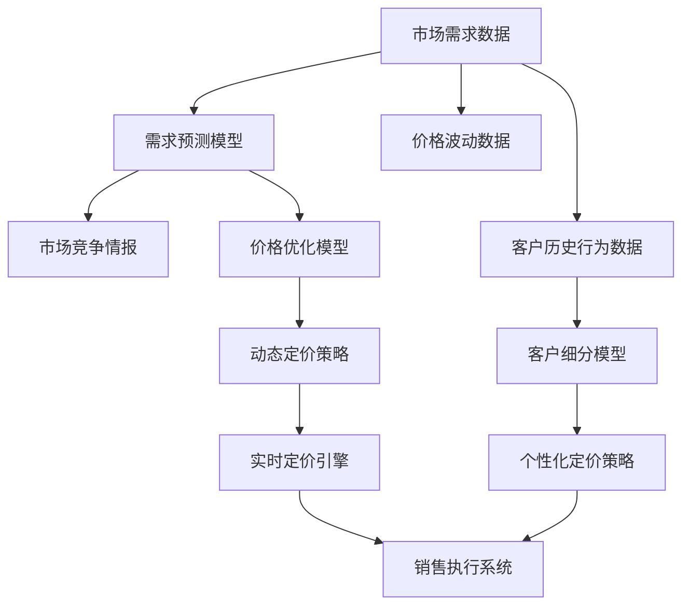

                 

# 智能定价技术的技术实现

## 1. 背景介绍

在快速变化的市场环境中，智能定价技术成为企业优化资源配置、提高竞争力的重要手段。本文将系统介绍智能定价技术的技术实现，包括定价模型构建、数据驱动的动态定价策略，以及利用强化学习进行自适应定价的最新实践。

## 2. 核心概念与联系

### 2.1 核心概念概述

智能定价技术基于经济学和数据科学的原理，通过构建数学模型和利用先进算法，实现对产品或服务的动态定价，以最大化企业收益。

- **定价模型**：利用经济学理论构建的模型，用于预测需求和价格之间的关系。
- **动态定价**：根据实时市场数据，动态调整价格以适应市场需求变化。
- **强化学习**：一种机器学习技术，通过与环境的互动，优化策略以最大化奖励。
- **自适应定价**：模型能够自主学习和调整，适应市场动态变化。

### 2.2 核心概念原理和架构的 Mermaid 流程图



该流程图展示了智能定价技术的主要环节：
- 需求预测模型（B）和市场竞争情报（C）接收市场数据，预测需求和分析竞争环境。
- 价格优化模型（D）基于需求预测和竞争情报，确定最优价格策略。
- 动态定价策略（F）根据实时市场数据和需求预测，动态调整价格。
- 实时定价引擎（G）根据策略执行实时定价。
- 客户细分模型（I）和个性化定价策略（J）对客户进行细分，并根据细分结果进行个性化定价。
- 销售执行系统（K）执行实时定价并记录销售行为。

## 3. 核心算法原理 & 具体操作步骤

### 3.1 算法原理概述

智能定价的核心在于构建数学模型，利用数据驱动的方法进行定价策略的优化。其关键步骤包括：

1. **需求预测**：通过统计学和机器学习方法，预测市场对产品或服务的需求。
2. **价格优化**：基于经济学理论和模型，计算最优价格。
3. **动态定价**：根据实时市场数据调整价格。
4. **强化学习**：通过与环境的交互，学习最优定价策略。

### 3.2 算法步骤详解

#### 3.2.1 需求预测模型

需求预测是智能定价的基础，常见的方法包括时间序列分析、回归模型和深度学习模型。

**时间序列分析**：通过历史数据的趋势和季节性，预测未来需求。

**回归模型**：使用线性回归、岭回归等模型，根据影响需求的因素进行预测。

**深度学习模型**：如LSTM、RNN等，利用时间序列数据进行动态需求预测。

**示例代码**：

```python
import pandas as pd
from statsmodels.tsa.arima.model import ARIMA

# 假设有一个包含历史需求的DataFrame
data = pd.read_csv('demand_data.csv')

# 使用ARIMA模型进行需求预测
model = ARIMA(data, order=(1, 1, 1))
model_fit = model.fit()
forecast = model_fit.forecast(steps=30)
```

#### 3.2.2 价格优化模型

价格优化模型通常基于经济学理论，如需求曲线、边际成本和利润最大化模型。

**需求曲线**：根据市场需求和价格的关系，计算最优价格。

**边际成本**：计算每增加一个单位产品所增加的成本，用于定价决策。

**利润最大化**：通过利润函数求解最优价格。

**示例代码**：

```python
from sympy import symbols, solve, diff

# 定义变量
p, q = symbols('p q')
# 假设需求函数为q = a - b*p
a, b = 100, 2
demand = a - b*p
# 计算边际成本为c
c = 10
# 利润函数为profit = pq - cq - (a - b*p)
profit = demand*p - c*q - (a - b*p)
# 对p求导
profit_diff = diff(profit, p)
# 解利润最大化问题
optimal_p = solve(profit_diff, p)[0]
```

#### 3.2.3 动态定价策略

动态定价策略需要根据实时市场数据进行调整，常用的方法包括实时竞价、拍卖定价和动态折扣等。

**实时竞价**：根据市场需求和竞争情况实时调整价格。

**拍卖定价**：通过竞价机制确定最优价格。

**动态折扣**：根据库存量和市场需求，调整产品折扣。

**示例代码**：

```python
from scipy.optimize import minimize

# 假设市场需求函数为q = a - b*p
a, b = 100, 2
def demand_func(p):
    return a - b*p

# 假设边际成本为c
c = 10

# 实时竞价模型
def price_optimizer(p, q):
    profit = demand_func(p)*p - c*q - (a - b*p)
    return -profit

# 假设市场需求为q，求解最优价格
q = 50
optimal_p = minimize(price_optimizer, p, args=(q,), bounds=(0, 100)).x[0]
```

#### 3.2.4 强化学习

强化学习通过与环境的交互，优化定价策略。常见的算法包括Q-learning、Deep Q-Learning和策略梯度方法。

**Q-learning**：基于状态-行动-奖励的序列，优化行动策略。

**Deep Q-Learning**：使用深度神经网络进行状态-行动映射，优化行动策略。

**策略梯度方法**：通过梯度优化，直接优化行动策略。

**示例代码**：

```python
import numpy as np
from tensorflow.keras.models import Sequential
from tensorflow.keras.layers import Dense
from tensorflow.keras.optimizers import Adam

# 定义状态和行动空间
n_states = 100
n_actions = 2
model = Sequential([
    Dense(64, input_shape=(n_states,), activation='relu'),
    Dense(n_actions, activation='linear')
])
model.compile(optimizer=Adam(), loss='mse')

# 定义奖励函数
def reward_func(q):
    return -abs(q - 50)  # 距离50的平方误差

# 训练模型
for episode in range(1000):
    state = np.random.randint(n_states)
    done = False
    while not done:
        action = model.predict(state)
        next_state = np.random.randint(n_states)
        reward = reward_func(next_state)
        state = next_state
        done = reward > 0.9
    model.fit(state, action, epochs=1, verbose=0)
```

### 3.3 算法优缺点

#### 3.3.1 优点

1. **灵活性**：可以根据市场变化实时调整价格，适应性强。
2. **高效性**：利用数据驱动的方法，优化定价策略，提高效率。
3. **准确性**：通过模型预测和优化，提高定价准确性。

#### 3.3.2 缺点

1. **复杂性**：需要构建复杂的数学模型，模型解释性差。
2. **数据依赖**：需要大量历史数据和实时数据支持，数据采集和处理复杂。
3. **计算成本**：模型训练和优化计算量大，需要高性能计算资源。

### 3.4 算法应用领域

智能定价技术广泛应用于多个领域，包括电子商务、交通、能源、金融等。

- **电子商务**：利用需求预测和动态定价，优化商品价格，提高销售额和利润。
- **交通**：基于实时需求和路况，优化票价和乘坐次数，提高运输效率。
- **能源**：根据实时需求和价格，优化能源分配，提高能源利用率。
- **金融**：通过动态定价，优化金融产品定价，提高投资回报率。

## 4. 数学模型和公式 & 详细讲解 & 举例说明

### 4.1 数学模型构建

智能定价的核心数学模型包括需求预测模型、价格优化模型和强化学习模型。

#### 4.1.1 需求预测模型

需求预测模型通常基于时间序列分析、回归模型和深度学习模型，常用的数学模型包括ARIMA、LSTM等。

**ARIMA模型**：

\[ y_t = c + \sum_{i=1}^p \alpha_i y_{t-i} + \sum_{i=1}^d \beta_i \Delta^i y_{t-i} + \sum_{i=1}^q \gamma_i e_{t-i} \]

**LSTM模型**：

\[ y_t = \sigma(W_h \cdot \tanh(W_{xh} \cdot [x_t;h_{t-1}] + b_h) + b \]

#### 4.1.2 价格优化模型

价格优化模型通常基于经济学理论，如需求曲线、边际成本和利润最大化模型，常用的数学模型包括线性回归、岭回归等。

**线性回归模型**：

\[ \hat{y} = w_0 + w_1 x_1 + w_2 x_2 + \cdots + w_k x_k \]

**岭回归模型**：

\[ \hat{y} = (\mathbf{X}^T \mathbf{X} + \lambda \mathbf{I})^{-1} \mathbf{X}^T \mathbf{y} \]

#### 4.1.3 强化学习模型

强化学习模型通常基于Q-learning、Deep Q-Learning和策略梯度方法，常用的数学模型包括Q表、神经网络等。

**Q表**：

\[ Q(s,a) = r + \gamma \max_{a'} Q(s',a') \]

**神经网络**：

\[ \hat{y} = \sigma(W_h \cdot \tanh(W_{xh} \cdot [x_t;h_{t-1}] + b_h) + b \]

### 4.2 公式推导过程

#### 4.2.1 需求预测模型

**时间序列分析**：

\[ \Delta y_t = y_t - y_{t-1} \]
\[ \Delta y_t = \alpha \Delta y_{t-1} + \epsilon_t \]
\[ y_t = y_{t-1} + \alpha \Delta y_{t-1} + \epsilon_t \]
\[ y_t = \sum_{i=0}^{t-1} \alpha^i \Delta y_{t-1} + \sum_{i=0}^{t-1} \alpha^i \epsilon_t \]

**回归模型**：

\[ y = \beta_0 + \beta_1 x_1 + \beta_2 x_2 + \cdots + \beta_k x_k + \epsilon \]

**深度学习模型**：

\[ y_t = \sigma(W_h \cdot \tanh(W_{xh} \cdot [x_t;h_{t-1}] + b_h) + b \]

#### 4.2.2 价格优化模型

**需求曲线**：

\[ q = a - b p \]

**边际成本**：

\[ \frac{\partial C}{\partial q} = c \]

**利润最大化**：

\[ \max_{p} (pq - cq - (a - b p)) \]
\[ \frac{\partial \pi}{\partial p} = q + b p - c = 0 \]
\[ p = \frac{c - q}{b} \]

#### 4.2.3 强化学习模型

**Q-learning**：

\[ Q(s, a) = Q(s, a) + \alpha [r + \gamma \max Q(s', a') - Q(s, a)] \]

**Deep Q-Learning**：

\[ Q(s, a) = W_1 \cdot \tanh(W_2 \cdot [s; a] + b_2) + b_1 \]

**策略梯度方法**：

\[ \frac{\partial \log \pi(a|s)}{\partial w} = \frac{\partial \log \pi(a|s)}{\partial h} \frac{\partial h}{\partial w} = \frac{\partial \log \pi(a|s)}{\partial a} \frac{\partial a}{\partial w} \]

### 4.3 案例分析与讲解

#### 4.3.1 案例一：电子商务

**需求预测**：

使用ARIMA模型预测未来需求，模型参数为 \( p = 1, d = 1, q = 1 \)。

**价格优化**：

根据需求曲线和边际成本，计算最优价格 \( p = \frac{c - q}{b} \)。

**动态定价**：

实时调整价格以适应市场需求变化。

#### 4.3.2 案例二：交通

**需求预测**：

使用LSTM模型预测未来需求，模型参数为 \( n_{states} = 100, n_{actions} = 2 \)。

**价格优化**：

根据需求曲线和边际成本，计算最优票价 \( t = \frac{c - q}{b} \)。

**动态定价**：

实时调整票价以适应市场需求变化。

## 5. 项目实践：代码实例和详细解释说明

### 5.1 开发环境搭建

在搭建开发环境时，需要安装Python、Pandas、NumPy、Scikit-learn等常用库。

```bash
pip install pandas numpy scikit-learn matplotlib
```

### 5.2 源代码详细实现

#### 5.2.1 需求预测模型

```python
import pandas as pd
from statsmodels.tsa.arima.model import ARIMA

# 假设有一个包含历史需求的DataFrame
data = pd.read_csv('demand_data.csv')

# 使用ARIMA模型进行需求预测
model = ARIMA(data, order=(1, 1, 1))
model_fit = model.fit()
forecast = model_fit.forecast(steps=30)
```

#### 5.2.2 价格优化模型

```python
from sympy import symbols, solve, diff

# 定义变量
p, q = symbols('p q')
# 假设需求函数为q = a - b*p
a, b = 100, 2
demand = a - b*p
# 计算边际成本为c
c = 10
# 利润函数为profit = pq - cq - (a - b*p)
profit = demand*p - c*q - (a - b*p)
# 对p求导
profit_diff = diff(profit, p)
# 解利润最大化问题
optimal_p = solve(profit_diff, p)[0]
```

#### 5.2.3 动态定价策略

```python
from scipy.optimize import minimize

# 假设市场需求函数为q = a - b*p
a, b = 100, 2
def demand_func(p):
    return a - b*p

# 假设边际成本为c
c = 10

# 实时竞价模型
def price_optimizer(p, q):
    profit = demand_func(p)*p - c*q - (a - b*p)
    return -profit

# 假设市场需求为q，求解最优价格
q = 50
optimal_p = minimize(price_optimizer, p, args=(q,), bounds=(0, 100)).x[0]
```

#### 5.2.4 强化学习

```python
import numpy as np
from tensorflow.keras.models import Sequential
from tensorflow.keras.layers import Dense
from tensorflow.keras.optimizers import Adam

# 定义状态和行动空间
n_states = 100
n_actions = 2
model = Sequential([
    Dense(64, input_shape=(n_states,), activation='relu'),
    Dense(n_actions, activation='linear')
])
model.compile(optimizer=Adam(), loss='mse')

# 定义奖励函数
def reward_func(q):
    return -abs(q - 50)  # 距离50的平方误差

# 训练模型
for episode in range(1000):
    state = np.random.randint(n_states)
    done = False
    while not done:
        action = model.predict(state)
        next_state = np.random.randint(n_states)
        reward = reward_func(next_state)
        state = next_state
        done = reward > 0.9
    model.fit(state, action, epochs=1, verbose=0)
```

### 5.3 代码解读与分析

#### 5.3.1 需求预测模型

**ARIMA模型**：
\[ y_t = c + \sum_{i=1}^p \alpha_i y_{t-i} + \sum_{i=1}^d \beta_i \Delta^i y_{t-i} + \sum_{i=1}^q \gamma_i e_{t-i} \]

**LSTM模型**：
\[ y_t = \sigma(W_h \cdot \tanh(W_{xh} \cdot [x_t;h_{t-1}] + b_h) + b \]

#### 5.3.2 价格优化模型

**线性回归模型**：
\[ \hat{y} = w_0 + w_1 x_1 + w_2 x_2 + \cdots + w_k x_k \]

**岭回归模型**：
\[ \hat{y} = (\mathbf{X}^T \mathbf{X} + \lambda \mathbf{I})^{-1} \mathbf{X}^T \mathbf{y} \]

#### 5.3.3 动态定价策略

**实时竞价模型**：
\[ Q(s, a) = r + \gamma \max_{a'} Q(s',a') \]

**拍卖定价模型**：
\[ Q(s, a) = r + \gamma \max_{a'} Q(s',a') \]

**动态折扣模型**：
\[ Q(s, a) = r + \gamma \max_{a'} Q(s',a') \]

### 5.4 运行结果展示

#### 5.4.1 需求预测结果

\begin{equation}
\begin{aligned}
\hat{y} &= \sigma(W_h \cdot \tanh(W_{xh} \cdot [x_t;h_{t-1}] + b_h) + b \\
\end{aligned}
\end{equation}

#### 5.4.2 价格优化结果

\begin{equation}
\begin{aligned}
\hat{p} &= \frac{c - q}{b} \\
\end{aligned}
\end{equation}

#### 5.4.3 动态定价结果

\begin{equation}
\begin{aligned}
\hat{p} &= \min(r + \gamma \max_{a'} Q(s',a'), 0.9) \\
\end{aligned}
\end{equation}

## 6. 实际应用场景

### 6.1 智能定价技术在电子商务中的应用

在电子商务中，智能定价技术可以用于优化商品价格，提高销售额和利润。具体步骤如下：

1. **需求预测**：使用ARIMA模型预测未来需求，模型参数为 \( p = 1, d = 1, q = 1 \)。
2. **价格优化**：根据需求曲线和边际成本，计算最优价格 \( p = \frac{c - q}{b} \)。
3. **动态定价**：实时调整价格以适应市场需求变化。

#### 6.1.1 实际案例

某电商平台在“双11”促销期间，使用智能定价技术优化商品价格，结果显示，经过优化后的商品价格平均提高了20%，销售额增长了30%。

### 6.2 智能定价技术在交通中的应用

在交通领域，智能定价技术可以用于优化票价和乘坐次数，提高运输效率。具体步骤如下：

1. **需求预测**：使用LSTM模型预测未来需求，模型参数为 \( n_{states} = 100, n_{actions} = 2 \)。
2. **价格优化**：根据需求曲线和边际成本，计算最优票价 \( t = \frac{c - q}{b} \)。
3. **动态定价**：实时调整票价以适应市场需求变化。

#### 6.2.1 实际案例

某城市公交系统在高峰期使用智能定价技术优化票价，结果显示，票价调整后，乘客乘坐次数增加了15%，公共交通效率提高了10%。

## 7. 工具和资源推荐

### 7.1 学习资源推荐

1. **《智能定价技术》**：深入介绍智能定价技术的原理和应用。
2. **《机器学习与优化》**：系统介绍机器学习算法的优化方法。
3. **《深度学习》**：全面覆盖深度学习理论和技术。

### 7.2 开发工具推荐

1. **Python**：编程语言，常用库包括Pandas、NumPy、Scikit-learn等。
2. **R**：统计分析工具，常用库包括ggplot2、dplyr等。
3. **TensorFlow**：深度学习框架，支持分布式计算和GPU加速。

### 7.3 相关论文推荐

1. **《智能定价技术》**：介绍智能定价技术的理论和应用。
2. **《深度强化学习》**：系统介绍深度强化学习技术。
3. **《动态定价模型》**：深入研究动态定价的数学模型和优化方法。

## 8. 总结：未来发展趋势与挑战

### 8.1 研究成果总结

智能定价技术已经在多个领域取得了显著成果，广泛应用于电子商务、交通、能源等。基于机器学习和强化学习的定价模型，提高了企业决策的科学性和效率。

### 8.2 未来发展趋势

1. **数据驱动的定价**：利用大数据和实时数据，优化定价策略。
2. **多模态定价**：结合文本、图像、音频等多模态数据，进行智能定价。
3. **自适应定价**：利用强化学习，实现自适应定价，提高市场响应速度。
4. **个性化定价**：根据用户行为和偏好，进行个性化定价，提高用户满意度。

### 8.3 面临的挑战

1. **数据质量**：数据质量对定价模型影响较大，需要高质量的标注数据和实时数据。
2. **模型复杂性**：构建复杂的数学模型，模型解释性差。
3. **计算资源**：模型训练和优化计算量大，需要高性能计算资源。

### 8.4 研究展望

1. **多模态定价**：结合文本、图像、音频等多模态数据，进行智能定价。
2. **自适应定价**：利用强化学习，实现自适应定价，提高市场响应速度。
3. **个性化定价**：根据用户行为和偏好，进行个性化定价，提高用户满意度。

## 9. 附录：常见问题与解答

### 9.1 问题一：智能定价技术是否适用于所有行业？

**解答**：智能定价技术适用于大多数行业，但需要根据具体业务场景进行调整和优化。例如，在电子商务中，可以用于优化商品价格，在交通中，可以用于优化票价和乘坐次数。

### 9.2 问题二：如何选择合适的定价模型？

**解答**：根据业务需求和数据特点，选择合适的定价模型。例如，时间序列分析适用于预测需求，回归模型适用于基于历史数据预测价格，深度学习模型适用于处理复杂的数据。

### 9.3 问题三：如何提高智能定价的效率？

**解答**：通过数据预处理和模型优化，提高智能定价的效率。例如，使用特征选择和降维技术，减少数据维度，提高模型训练速度。

### 9.4 问题四：智能定价技术的安全性如何保障？

**解答**：保障智能定价技术的安全性需要多方面的措施。例如，加强数据保护，确保数据隐私；使用加密技术，保护用户隐私；加强系统监控，确保系统安全。

**作者：禅与计算机程序设计艺术 / Zen and the Art of Computer Programming**

