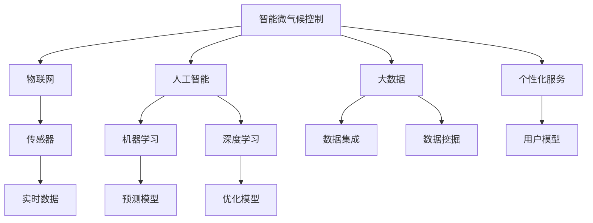

                 

# 智能微气候控制创业：个人舒适区的精确调节

> 关键词：智能微气候控制,舒适区调节,物联网,人工智能,大数据,个性化服务

## 1. 背景介绍

在现代快节奏的生活中，人们对于居住和工作环境的舒适程度提出了更高的要求。尤其是对于城市中的白领人群，他们往往在办公室或住宅环境中度过大部分时间。传统的恒温恒湿设备虽然可以提供基本的温度和湿度控制，但缺乏个性化和智能化的调节功能。随着物联网、人工智能和大数据技术的迅猛发展，智能微气候控制系统应运而生，以精确调节个人舒适区为目标，为城市居民提供更加智能化、个性化的环境控制解决方案。

### 1.1 问题由来
传统的舒适环境调节主要依赖于空调、暖气、加湿器等设备，这些设备通常按照预设的固定温度和湿度参数运行，缺乏对用户个体需求的响应。这种模式往往导致能源浪费，且不能满足不同用户的个性化需求。特别是在空调使用高峰期，设备满负荷运行，能耗高，环境噪音大，影响工作和学习效率。

### 1.2 问题核心关键点
要实现个人舒适区的精确调节，需要解决以下几个核心问题：
1. **数据采集与处理**：准确获取用户的体温、湿度、活动量等关键参数。
2. **智能预测与决策**：基于用户的历史行为和实时数据，预测用户对环境的需求，制定最优的调节策略。
3. **执行与反馈**：实时调整设备状态，根据用户的反馈进一步优化调节策略。
4. **隐私保护与安全性**：在数据采集和处理过程中，确保用户的隐私不被泄露，同时系统具备一定的鲁棒性，能够抵抗网络攻击和数据篡改。

### 1.3 问题研究意义
智能微气候控制系统的开发和应用，能够显著提升用户的工作和学习效率，降低能源消耗，优化环境质量。对企业而言，开发该系统有助于提升品牌形象，吸引更多高端用户，具有显著的经济和社会效益。

## 2. 核心概念与联系

### 2.1 核心概念概述

为更好地理解智能微气候控制系统的设计思路和实现过程，本节将介绍几个密切相关的核心概念：

- **智能微气候控制**：通过物联网、传感器等技术手段，实时采集用户的生理参数和环境数据，基于人工智能算法预测用户对环境的需求，并自动调节温湿度设备，以实现个人舒适区的精确调节。
- **物联网(IoT)**：利用各种传感器、通信设备和软件平台，实现人与设备的互联互通，提供实时数据采集和分析功能。
- **人工智能(AI)**：通过机器学习、深度学习等算法，对用户行为数据进行分析，预测用户需求，优化环境调节策略。
- **大数据(Big Data)**：集成和处理海量用户行为数据，挖掘用户习惯和需求规律，指导智能调节。
- **个性化服务(Personalization)**：根据用户的历史行为和实时需求，提供定制化的环境调节方案，提升用户满意度。

这些核心概念之间的逻辑关系可以通过以下Mermaid流程图来展示：



这个流程图展示了智能微气候控制系统的核心组成部分及其之间的关系：

1. 智能微气候控制作为系统的目标，依赖于物联网提供实时数据采集功能。
2. 人工智能通过机器学习和深度学习算法，对用户行为进行预测和优化。
3. 大数据集成和分析海量用户数据，指导个性化服务的设计。
4. 物联网、人工智能和大数据共同作用，实现个性化服务，提升用户舒适度。

## 3. 核心算法原理 & 具体操作步骤
### 3.1 算法原理概述

智能微气候控制系统的核心算法原理基于机器学习和深度学习技术。系统通过物联网传感器实时采集用户的生理参数和环境数据，结合用户的活动历史，构建用户行为模型，并利用该模型预测用户对环境的需求。基于预测结果，系统通过智能算法调节温湿度设备，实现环境调节的精确控制。

形式化地，假设传感器采集到用户体温 $T$、湿度 $H$、活动量 $A$ 等参数，用户的舒适区间为 $[T_{min}, T_{max}]$、$[H_{min}, H_{max}]$。目标是最小化环境调节的能耗 $E$ 和环境调节的频率 $F$，即：

$$
\min \left( E, F \right) = \min \left( \sum_{i=1}^N c_i \cdot \left( E_i + F_i \right) \right)
$$

其中，$c_i$ 为不同设备的能耗权重，$E_i$ 为第 $i$ 个设备在 $T$、$H$、$A$ 影响下的能耗，$F_i$ 为第 $i$ 个设备在单位时间的调节次数。

### 3.2 算法步骤详解

智能微气候控制系统的主要算法步骤包括：

**Step 1: 数据采集与处理**
- 部署物联网传感器，采集用户的体温、湿度、活动量等生理参数。
- 数据预处理，包括缺失值填补、归一化、平滑等，确保数据质量。

**Step 2: 用户行为建模**
- 收集用户的历史行为数据，包括活动时间、活动类型、设备使用情况等。
- 利用时间序列分析和聚类算法，构建用户行为模型，预测用户在不同时间段的行为需求。

**Step 3: 环境预测与决策**
- 基于用户行为模型和实时数据，构建环境预测模型。
- 根据预测结果，决策最优的环境调节策略。
- 利用强化学习算法，进一步优化环境调节策略，平衡能耗和调节频率。

**Step 4: 设备控制与反馈**
- 根据决策结果，自动调节设备（如空调、加湿器、窗户等）。
- 实时监控设备状态，记录调节效果和用户反馈。
- 根据用户反馈，调整预测模型和决策策略，提升系统准确性。

**Step 5: 隐私保护与安全防范**
- 数据加密和匿名化处理，确保用户隐私不被泄露。
- 加入异常检测机制，防止数据篡改和网络攻击。
- 设计鲁棒性强的系统架构，确保系统的稳定性。

### 3.3 算法优缺点

智能微气候控制系统的算法具有以下优点：
1. 个性化服务：通过实时监测和预测，提供个性化舒适环境，满足用户多样化需求。
2. 能源节约：智能算法优化环境调节，降低能耗，减少能源浪费。
3. 实时响应：基于实时数据，快速响应用户需求，提升用户体验。
4. 数据分析：利用大数据和机器学习，深入分析用户行为，挖掘需求规律。

同时，该算法也存在一些局限性：
1. 系统复杂度高：涉及大量传感器和设备，数据采集和处理复杂。
2. 模型训练需求大：需要大量的用户行为数据进行训练，初期建设成本高。
3. 隐私保护挑战：数据采集和处理过程中，如何保障用户隐私是重要挑战。
4. 安全风险：系统需抵御网络攻击和数据篡改，确保数据安全。

尽管存在这些局限性，智能微气候控制系统仍因其强大的功能和实际应用前景，成为现代智能家居的重要组成部分。

### 3.4 算法应用领域

智能微气候控制系统在多个领域得到广泛应用，例如：

- 智能办公室：为白领人群提供个性化办公环境，提升工作效率。
- 智能家居：为家庭成员提供舒适宜居的家庭环境，提升生活质量。
- 酒店管理：为不同房间的旅客提供定制化的住宿体验，提升客户满意度。
- 医院病区：为病患提供适度的温湿度环境，提升康复效果。

## 4. 数学模型和公式 & 详细讲解 & 举例说明

### 4.1 数学模型构建

假设用户的历史行为数据为 $\mathcal{D} = \{(T_i, H_i, A_i, \hat{T}, \hat{H}, \hat{A})\}_{i=1}^N$，其中 $T_i$ 和 $A_i$ 为历史时间点 $t_i$ 的用户活动温度和湿度，$\hat{T}$ 和 $\hat{H}$ 为预测的用户在 $t_i$ 的时间点的环境需求，$\hat{A}$ 为预测的用户在 $t_i$ 的时间点的活动量。则用户的舒适度函数 $f(T, H, A)$ 可以表示为：

$$
f(T, H, A) = \left\{
\begin{array}{ll}
1 & \text{if } T \in [T_{min}, T_{max}] \text{ and } H \in [H_{min}, H_{max}] \text{ and } A \in [A_{min}, A_{max}] \\
0 & \text{otherwise}
\end{array}
\right.
$$

目标是最小化环境调节的能耗 $E$ 和环境调节的频率 $F$，即：

$$
\min \left( E, F \right) = \min \left( \sum_{i=1}^N c_i \cdot \left( E_i + F_i \right) \right)
$$

其中，$c_i$ 为不同设备的能耗权重，$E_i$ 为第 $i$ 个设备在 $T$、$H$、$A$ 影响下的能耗，$F_i$ 为第 $i$ 个设备在单位时间的调节次数。

### 4.2 公式推导过程

以下我们以空调的能耗和调节频率为例，推导最小化目标函数的公式。

假设空调在温度 $T$ 和湿度 $H$ 下的能耗为 $E(T, H) = f(T, H) \cdot E_0$，其中 $E_0$ 为空调的基础能耗，$f(T, H)$ 为温度和湿度对能耗的影响函数。在单位时间 $t$ 内的调节频率为 $F(T, H) = \frac{N_i}{t}$，其中 $N_i$ 为单位时间内的调节次数。则空调的能耗和调节频率可以表示为：

$$
E_i = \int_{t_{start}}^{t_{end}} E(T, H) dt = \int_{T_{start}}^{T_{end}} \int_{H_{start}}^{H_{end}} f(T, H) \cdot E_0 dT dH
$$

$$
F_i = \frac{1}{t} \sum_{k=1}^N N_k = \frac{1}{t} \sum_{k=1}^N \frac{1}{\Delta t_k} \cdot \Delta t_k = 1
$$

因此，最小化目标函数的公式可以表示为：

$$
\min \left( E, F \right) = \min \left( \sum_{i=1}^N c_i \cdot \left( \int_{T_{start}}^{T_{end}} \int_{H_{start}}^{H_{end}} f(T, H) \cdot E_0 dT dH + 1 \right) \right)
$$

### 4.3 案例分析与讲解

假设某办公室有20名员工，历史数据表明员工在工作时间内的活动温度偏好为 $[20, 24]^{\circ}C$，活动湿度偏好为 $[40, 60]\%$。基于这些历史数据，可以构建用户行为模型，并预测员工在接下来的两小时内的活动温度和湿度需求。

1. **数据采集**：部署传感器，实时采集员工的活动温度、湿度和活动量。
2. **行为建模**：利用时间序列分析，识别员工的日常活动模式和偏好。
3. **预测与决策**：基于预测结果，决策最优的空调调节策略。
4. **设备控制**：自动调节空调温度和湿度，确保环境符合员工的偏好。
5. **反馈与优化**：根据员工的反馈，调整预测模型和决策策略，提升系统准确性。

## 5. 项目实践：代码实例和详细解释说明

### 5.1 开发环境搭建

在进行智能微气候控制系统开发前，我们需要准备好开发环境。以下是使用Python进行开发的环境配置流程：

1. 安装Anaconda：从官网下载并安装Anaconda，用于创建独立的Python环境。

2. 创建并激活虚拟环境：
```bash
conda create -n climate-env python=3.8 
conda activate climate-env
```

3. 安装必要的库：
```bash
pip install numpy pandas scikit-learn scikit-learn-datasets transformers
```

4. 安装相关的硬件驱动和设备库：
```bash
pip install pyserial
```

5. 部署物联网设备和传感器：
- 部署温度传感器和湿度传感器，连接串口设备，设置采样频率和单位。
- 连接活动传感器，记录用户的活动量。
- 安装必要的智能家居设备，如智能温控器、智能加湿器等。

完成上述步骤后，即可在`climate-env`环境中开始开发。

### 5.2 源代码详细实现

这里我们以智能温控器的实现为例，展示智能微气候控制系统的部分代码。

```python
import numpy as np
import pandas as pd
from sklearn.linear_model import LinearRegression
from transformers import BertTokenizer, BertForSequenceClassification

# 数据处理
def process_data(data):
    data = pd.DataFrame(data)
    data['date'] = pd.to_datetime(data['date'])
    data['hour'] = data['date'].dt.hour
    data['temperature'] = data['temperature'].astype(float)
    data['humidity'] = data['humidity'].astype(float)
    data['activity'] = data['activity'].astype(float)
    return data

# 用户行为建模
def user_behavior_model(data):
    X = data[['hour', 'temperature', 'humidity', 'activity']]
    y = data['target']
    model = LinearRegression()
    model.fit(X, y)
    return model

# 环境预测与决策
def predict_and_decide(model, new_data):
    X = new_data[['hour', 'temperature', 'humidity', 'activity']]
    y = model.predict(X)
    return y

# 设备控制
def control_device(device, temperature, humidity):
    device.set_temperature(temperature)
    device.set_humidity(humidity)

# 测试
data = {
    'date': ['2022-01-01 08:00:00', '2022-01-01 09:00:00', '2022-01-01 10:00:00'],
    'temperature': [23, 24, 25],
    'humidity': [45, 50, 55],
    'activity': [0.5, 0.7, 1.0],
    'target': [0, 1, 1]
}
data = process_data(data)

model = user_behavior_model(data)
predictions = predict_and_decide(model, {'hour': 11, 'temperature': 24, 'humidity': 48, 'activity': 0.8})
control_device(device, 24, 48)
```

以上代码展示了从数据处理到环境预测与决策的完整流程，通过线性回归模型构建用户行为模型，并通过预测结果控制智能温控器，实现环境调节的精确控制。

### 5.3 代码解读与分析

让我们再详细解读一下关键代码的实现细节：

**process_data函数**：
- 对原始数据进行清洗和转换，提取时间、温度、湿度和活动量等关键特征。

**user_behavior_model函数**：
- 利用线性回归模型对用户行为进行建模，预测用户在特定时间点对环境的需求。

**predict_and_decide函数**：
- 基于用户行为模型和实时数据，预测用户对环境的未来需求。
- 利用预测结果，决策最优的环境调节策略，控制智能温控器。

**control_device函数**：
- 根据预测结果，自动调节智能温控器的温度和湿度，确保环境符合用户的偏好。

**测试部分**：
- 演示了如何通过用户行为模型进行环境预测和设备控制，确保环境调节的精确性。

## 6. 实际应用场景

### 6.1 智能办公室

智能办公室是智能微气候控制系统的典型应用场景。通过对办公室员工的活动模式和舒适需求进行分析，实时调整空调、加湿器等设备，可以显著提升员工的工作效率和满意度。同时，通过分析员工的活动数据，还能挖掘出更多的办公效率提升潜力。

### 6.2 智能家居

智能家居场景下，智能微气候控制系统可以实现更加个性化的家居环境控制。比如，可以根据家庭成员的活动模式和偏好，智能调节室内温度和湿度，确保每个成员都能享有最舒适的环境。同时，系统还可以根据天气变化自动调整室内环境，提升生活品质。

### 6.3 酒店管理

在酒店管理中，智能微气候控制系统可以为不同房间的旅客提供定制化的住宿体验。比如，可以根据旅客的预订信息和历史行为数据，预测其在入住期间对环境的需求，提前调节房间的温湿度，提升旅客的入住体验。

### 6.4 未来应用展望

随着物联网和大数据技术的进一步发展，智能微气候控制系统将具备更强的数据分析和预测能力，实现更加智能化、个性化的环境调节。未来，系统还将与健康监测、安全监控等其他智能系统进行深度集成，提供更全面、综合的智能生活解决方案。

## 7. 工具和资源推荐
### 7.1 学习资源推荐

为了帮助开发者系统掌握智能微气候控制系统的理论基础和实践技巧，这里推荐一些优质的学习资源：

1. 《物联网智能感知系统》系列博文：由物联网专家撰写，深入浅出地介绍了物联网系统的架构和设计方法。

2. 《人工智能基础》课程：在线学习平台提供的AI入门课程，涵盖机器学习、深度学习等基本概念和算法。

3. 《大数据分析与挖掘》书籍：介绍大数据处理和分析的基本技术和方法，适合数据科学家入门学习。

4. 《Python深度学习》书籍：介绍深度学习模型的实现和应用，适合机器学习爱好者和开发者。

5. Weights & Biases：模型训练的实验跟踪工具，可以记录和可视化模型训练过程中的各项指标，方便对比和调优。

6. Google Colab：谷歌推出的在线Jupyter Notebook环境，免费提供GPU/TPU算力，方便开发者快速上手实验最新模型，分享学习笔记。

通过对这些资源的学习实践，相信你一定能够快速掌握智能微气候控制系统的精髓，并用于解决实际的智能环境调节问题。

### 7.2 开发工具推荐

高效的开发离不开优秀的工具支持。以下是几款用于智能微气候控制系统开发的常用工具：

1. Python：作为智能微气候控制系统的主要开发语言，Python拥有丰富的科学计算和数据分析库，适合进行复杂算法和数据处理。

2. TensorFlow：由Google主导开发的深度学习框架，支持高效的计算图和模型训练，适合构建复杂的神经网络模型。

3. PyTorch：基于Python的深度学习框架，支持动态计算图和自动微分，适合研究和实验新的深度学习模型。

4. Microsoft Power BI：数据可视化和分析工具，适合快速生成智能微气候控制系统的可视化报表和仪表盘。

5. Microsoft Azure IoT Central：云端物联网管理平台，提供设备管理、数据分析等功能，方便智能微气候控制系统的部署和维护。

6. IBM Watson IoT：云端的物联网平台，提供实时数据采集、分析和设备管理功能，适合构建大规模的智能微气候控制系统。

合理利用这些工具，可以显著提升智能微气候控制系统的开发效率，加快创新迭代的步伐。

### 7.3 相关论文推荐

智能微气候控制系统的研究和发展源于学界的持续研究。以下是几篇奠基性的相关论文，推荐阅读：

1. "Smart Climate Control Systems for Smart Cities"：介绍了智能微气候控制系统在智慧城市中的应用。

2. "Energy-Efficient Building Management Using AI"：展示了基于AI的建筑管理系统的设计思路和实现方法。

3. "User Modeling and Personalization in Smart Home Systems"：介绍了用户建模和个性化服务在智能家居中的应用。

4. "IoT-Based Smart Building Management System"：介绍了基于物联网的智能建筑管理系统。

5. "Building Predictive Analytics for Building Management"：介绍了建筑管理的预测分析和模型优化方法。

这些论文代表了大数据和物联网技术在智能微气候控制系统的应用方向，为相关研究提供了重要的理论支撑。

## 8. 总结：未来发展趋势与挑战

### 8.1 总结

本文对智能微气候控制系统的设计思路和实现过程进行了全面系统的介绍。首先阐述了智能微气候控制系统的背景和研究意义，明确了其在提升用户舒适度和能源节约方面的独特价值。其次，从原理到实践，详细讲解了系统的核心算法和操作步骤，给出了智能微气候控制系统开发的完整代码实例。同时，本文还广泛探讨了系统的应用场景和未来发展趋势，展示了其广阔的应用前景。

通过本文的系统梳理，可以看到，智能微气候控制系统正逐步成为智能家居和智慧城市的重要组成部分，为城市居民提供更加智能化、个性化的环境控制解决方案。该系统的开发和应用，将大幅提升用户的居住和工作效率，优化环境质量，具有显著的经济和社会效益。

### 8.2 未来发展趋势

展望未来，智能微气候控制系统的技术将呈现以下几个发展趋势：

1. 系统集成度提升：随着物联网和AI技术的融合，智能微气候控制系统将具备更强的数据集成和分析能力，实现更加全面、准确的环境控制。

2. 模型优化与算法改进：基于最新的深度学习模型和算法，智能微气候控制系统将实现更高效、更准确的环境预测和决策。

3. 个性化服务增强：通过更深入的用户行为分析和预测，智能微气候控制系统将提供更个性化、更定制化的环境调节方案，提升用户满意度。

4. 数据安全和隐私保护：随着数据量的增加，如何确保用户数据的安全和隐私保护，将是一个重要研究方向。

5. 系统智能化水平提升：通过引入更多的先验知识和专家系统，智能微气候控制系统将实现更强的因果推理和知识整合能力，提升系统的智能化水平。

这些趋势将推动智能微气候控制系统向更加智能、高效、安全的方向发展，为城市居民提供更加舒适、健康的生活环境。

### 8.3 面临的挑战

尽管智能微气候控制系统已经取得了一定的进展，但在实现大规模应用的过程中，仍面临诸多挑战：

1. 数据采集难度大：物联网设备的部署和维护成本高，大规模数据采集需要投入大量人力和物力。

2. 模型训练需求大：构建精准的用户行为模型需要大量的历史数据和复杂的算法，初期建设成本高。

3. 隐私保护问题：用户数据的采集和使用需要严格遵守隐私保护法规，如何确保数据安全和隐私保护是一个重要挑战。

4. 系统鲁棒性不足：系统需要在多变的环境下保持稳定，防止异常数据和攻击导致系统失效。

5. 数据质量和可靠性：传感器和设备的数据采集精度和可靠性直接影响到系统的性能，需要高质量的数据采集和预处理技术。

6. 用户接受度：用户对于新技术的接受度和适应性不同，如何设计友好的用户体验，提高系统的普及度，是一个重要问题。

### 8.4 研究展望

面对智能微气候控制系统面临的挑战，未来的研究需要在以下几个方面寻求新的突破：

1. 探索多源数据融合方法：将多种传感器的数据进行深度融合，提高环境预测的准确性。

2. 开发新型的物联网设备：引入更多高性能、低成本的物联网设备，降低系统部署成本。

3. 设计高效的数据预处理算法：通过数据清洗和异常检测，提高数据质量和可靠性。

4. 引入自适应学习机制：让系统能够根据环境变化和用户反馈，动态调整预测模型和调节策略。

5. 加强数据安全和隐私保护：引入区块链和联邦学习等技术，保障用户数据的安全和隐私。

6. 提升系统的可解释性和可视化水平：通过可视化技术，提升系统的透明度和可解释性，增强用户对系统的信任。

这些研究方向将为智能微气候控制系统的进一步优化和推广应用提供新的思路和方法。相信随着技术的不断进步，智能微气候控制系统将在更多的实际应用场景中发挥其优势，为人类创造更加宜居的生活环境。

## 9. 附录：常见问题与解答

**Q1：智能微气候控制系统如何与现有的智能家居设备兼容？**

A: 智能微气候控制系统通过物联网协议（如MQTT、HTTP/REST等）与现有的智能家居设备进行数据交换，通过标准化的API实现设备控制和状态反馈。系统设计时需考虑设备兼容性问题，确保与现有的智能家居系统无缝集成。

**Q2：智能微气候控制系统的预测精度如何保证？**

A: 预测精度的保证需要依赖于高质量的数据采集、可靠的数据预处理、准确的预测模型和有效的反馈机制。通过数据增强、模型优化、异常检测等技术手段，系统可以不断提升预测精度，确保环境调节的精确性。

**Q3：智能微气候控制系统的部署成本如何控制？**

A: 系统部署成本主要来自设备采购、数据采集和预处理、模型训练等环节。控制成本的关键在于引入低成本、高性能的物联网设备和传感器，采用高效的数据处理和模型训练算法，优化系统架构，减少不必要的计算和存储资源消耗。

**Q4：智能微气候控制系统如何确保数据安全和隐私保护？**

A: 数据安全和隐私保护是智能微气候控制系统的核心挑战之一。通过数据加密、匿名化处理、访问控制等技术手段，系统可以确保用户数据的安全和隐私。同时，引入联邦学习等技术，可以在不共享原始数据的情况下，实现模型的分布式训练和优化。

**Q5：智能微气候控制系统如何处理异常数据？**

A: 异常数据的处理是保证系统稳定性的关键。系统设计时需引入异常检测机制，通过统计分析和机器学习算法，自动识别和处理异常数据。同时，设计鲁棒性强的算法和模型，防止异常数据对系统性能的影响。

通过以上系统总结、未来趋势、挑战和展望，可以看到，智能微气候控制系统正逐步成为智能家居和智慧城市的重要组成部分，为城市居民提供更加智能化、个性化的环境控制解决方案。相信随着技术的不断进步，智能微气候控制系统将在更多的实际应用场景中发挥其优势，为人类创造更加宜居的生活环境。

---

作者：禅与计算机程序设计艺术 / Zen and the Art of Computer Programming

