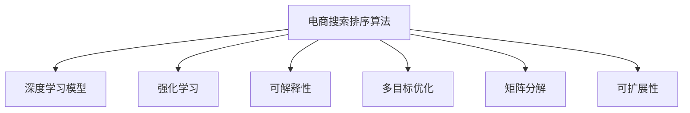

                 

# 智能排序算法在电商搜索中的应用：原理与实践

## 1. 背景介绍

随着互联网的飞速发展，电商平台成为了人们日常生活中不可或缺的一部分。而如何在海量商品中快速找到用户所需商品，成为了电商平台的核心挑战。传统的搜索排序算法已经无法满足用户日益提高的搜索体验需求，智能排序算法应运而生，通过综合考虑商品的相关性、用户行为、时间等因素，实现了更加精准的搜索结果排序。

### 1.1 问题由来

电商搜索排序算法经历了从基于关键词匹配到基于用户行为的演进。早期的搜索排序算法，如TF-IDF和BM25，主要基于关键词匹配，忽略了商品相关性、用户行为等因素。随着电商平台数据的积累，用户的点击行为、浏览历史、评价等信息逐渐被用于优化搜索排序算法，出现了基于协同过滤和矩阵分解的推荐算法，如基于用户-商品评分矩阵的SVD分解。

然而，这些推荐算法往往存在计算量大、实时性不足的问题。随着实时性要求和商品规模的不断提升，如何将大模型、深度学习、强化学习等前沿技术引入搜索排序算法，成为了电商领域亟需解决的问题。

### 1.2 问题核心关键点

智能排序算法设计的核心关键点包括：

- **实时性**：电商平台对搜索排序的实时性要求很高，算法需要在秒级内返回搜索结果。
- **准确性**：算法要能够准确识别用户的意图和偏好，提供最相关的搜索结果。
- **可扩展性**：算法需要处理海量的商品数据和用户行为数据，具有高并发处理能力。
- **公平性**：算法要保证搜索结果的公平性，不偏向于某些品牌或商家。
- **透明度**：算法需要具有透明性，让用户了解搜索排序的依据。

这些关键点共同构成了智能排序算法的目标和挑战。

## 2. 核心概念与联系

### 2.1 核心概念概述

为更好地理解智能排序算法，本节将介绍几个密切相关的核心概念：

- **电商搜索排序算法**：指用于电商平台的搜索结果排序算法。通过综合考虑商品相关性、用户行为等因素，实现更加精准的搜索结果排序。
- **深度学习模型**：以神经网络为代表的深度学习模型，通过多层非线性映射，能够处理复杂的非线性关系，被广泛应用于智能排序算法。
- **强化学习**：通过与环境的交互，智能体通过试错学习，逐步优化决策策略，被用于优化智能排序算法的参数。
- **可解释性**：智能排序算法需要具有透明性，用户需要了解算法的决策依据。
- **多目标优化**：电商搜索排序算法需要综合考虑多个目标，如相关性、点击率、转化率等，实现多目标优化。
- **矩阵分解**：通过将用户行为数据和商品特征数据分解成低秩矩阵，降低数据维度，提高计算效率。
- **可扩展性**：算法需要能够处理海量的商品数据和用户行为数据，具有高并发处理能力。

这些核心概念之间的逻辑关系可以通过以下Mermaid流程图来展示：



这个流程图展示了的核心概念及其之间的关系：

1. 电商搜索排序算法以深度学习模型为代表，通过多目标优化和强化学习进行参数优化。
2. 深度学习模型通过矩阵分解等技术降低数据维度，提高计算效率。
3. 算法需要考虑可解释性，让用户了解搜索结果的依据。
4. 算法设计需要考虑可扩展性，以应对大规模数据和高并发请求。

这些概念共同构成了智能排序算法的框架，使其能够在电商搜索中发挥重要作用。通过理解这些核心概念，我们可以更好地把握智能排序算法的理论基础和设计要点。

## 3. 核心算法原理 & 具体操作步骤

### 3.1 算法原理概述

智能排序算法的核心思想是：通过综合考虑商品的相关性、用户行为、时间等因素，实现更加精准的搜索结果排序。算法主要分为两大部分：

- **离线训练阶段**：在离线模式下，通过大规模用户行为数据和商品数据，训练出深度学习模型。
- **在线排序阶段**：在在线模式下，实时接收用户查询，调用训练好的模型进行结果排序，并返回给用户。

### 3.2 算法步骤详解

以下是智能排序算法的详细步骤：

**Step 1: 准备数据集**
- 收集电商平台的商品数据和用户行为数据，并进行预处理和清洗。
- 将数据集划分为训练集和测试集，进行模型训练和评估。

**Step 2: 选择深度学习模型**
- 选择合适的深度学习模型，如Transformer、LSTM等，用于处理用户行为数据和商品数据。
- 设计合适的网络结构，如双向LSTM、注意力机制等，以捕捉不同维度特征之间的关系。

**Step 3: 训练模型**
- 在训练集上，使用优化算法（如Adam、SGD等）进行模型训练，最小化损失函数。
- 通过交叉验证等技术，选择最优的模型超参数。

**Step 4: 在线排序**
- 实时接收用户查询，将查询与商品特征向量进行匹配，计算相似度得分。
- 将相似度得分进行排序，选择最相关的商品作为搜索结果。
- 根据用户行为数据，动态调整排序策略，提高排序效果。

**Step 5: 结果反馈和模型更新**
- 对用户点击、购买等行为进行记录，更新用户行为模型和商品特征向量。
- 定期进行模型更新，避免模型过时和退化。

### 3.3 算法优缺点

智能排序算法具有以下优点：
1. 准确性高：通过深度学习模型，能够综合考虑多维度数据，提供精准的搜索结果。
2. 实时性好：通过在线排序，能够实时响应用户查询，提升用户体验。
3. 可扩展性强：通过分布式计算和数据并行处理，能够处理海量的数据和并发请求。
4. 模型可更新：通过在线排序和结果反馈，不断优化模型性能，适应数据变化。

但同时，该算法也存在一定的局限性：
1. 计算复杂度高：深度学习模型需要大量的计算资源，训练和推理过程较慢。
2. 数据需求大：需要大量的用户行为数据和商品数据，获取成本较高。
3. 模型复杂度高：模型结构复杂，难以理解和解释。
4. 公平性不足：模型可能存在偏差，导致搜索结果不公平。

尽管存在这些局限性，但就目前而言，智能排序算法仍是电商搜索排序的主要范式。未来相关研究的重点在于如何进一步降低计算复杂度，优化模型结构，增强可解释性和公平性。

### 3.4 算法应用领域

智能排序算法在电商搜索领域已经得到了广泛的应用，覆盖了几乎所有常见场景，例如：

- 商品推荐：根据用户历史行为，推荐相关商品。
- 价格排序：根据商品价格，进行价格排序。
- 品牌排序：根据用户偏好，推荐品牌商品。
- 相关性排序：根据商品相关性，排序搜索结果。
- 销量排序：根据商品销量，进行销量排序。

除了上述这些经典应用外，智能排序算法还被创新性地应用于个性化推荐、库存管理、广告投放等诸多领域，为电商平台带来了更高的运营效率和用户满意度。

## 4. 数学模型和公式 & 详细讲解 & 举例说明

### 4.1 数学模型构建

本节将使用数学语言对智能排序算法进行更加严格的刻画。

假设用户查询为 $q$，商品集合为 $\mathcal{I}$，商品特征向量为 $\mathbf{x}_i$，用户行为数据为 $\mathbf{u}$。

定义相似度函数 $sim(q, \mathbf{x}_i)$，用于计算查询与商品的相似度得分。常用的相似度函数包括余弦相似度、欧氏距离等。

定义损失函数 $\mathcal{L}$，用于衡量模型预测的准确性。常用的损失函数包括均方误差、交叉熵等。

定义优化算法 $\mathcal{O}$，用于最小化损失函数。常用的优化算法包括梯度下降、Adam、SGD等。

### 4.2 公式推导过程

以下以余弦相似度为例，推导相似度函数及其梯度计算公式。

假设查询向量为 $q \in \mathbb{R}^d$，商品特征向量为 $\mathbf{x}_i \in \mathbb{R}^d$，余弦相似度定义为：

$$
sim(q, \mathbf{x}_i) = \frac{\mathbf{q} \cdot \mathbf{x}_i}{\|\mathbf{q}\| \cdot \|\mathbf{x}_i\|}
$$

在在线排序过程中，需要计算所有商品的相似度得分，并将商品按得分排序。为了提高计算效率，可以将商品特征向量 $\mathbf{x}_i$ 映射到一个低维空间 $\mathbf{x}_i' \in \mathbb{R}^k$，其中 $k$ 远小于 $d$。这样可以将计算复杂度从 $O(d^2)$ 降低到 $O(kd)$。

定义低维空间映射函数 $f(\mathbf{x}_i)$，使得 $f(\mathbf{x}_i') \approx \mathbf{x}_i$。常用的映射函数包括SVD分解、PCA降维等。

定义用户行为向量 $\mathbf{u} \in \mathbb{R}^d$，对用户行为进行建模。

在离线训练阶段，通过最大化相似度得分，训练出低维空间映射函数 $f(\mathbf{x}_i)$ 和用户行为向量 $\mathbf{u}$。

在在线排序阶段，通过计算余弦相似度，进行商品排序。对每个商品 $i$，计算得分：

$$
score_i = sim(q, f(\mathbf{x}_i')) = \frac{\mathbf{q} \cdot f(\mathbf{x}_i')}{\|\mathbf{q}\| \cdot \|f(\mathbf{x}_i')\|}
$$

根据得分排序，返回最相关的商品作为搜索结果。

### 4.3 案例分析与讲解

以电商平台的商品推荐为例，介绍智能排序算法的实际应用。

**Step 1: 准备数据集**
- 收集平台上的商品数据和用户行为数据，并进行预处理和清洗。
- 将数据集划分为训练集和测试集，进行模型训练和评估。

**Step 2: 选择深度学习模型**
- 选择Transformer模型，用于处理商品特征数据。
- 设计双向LSTM模型，用于处理用户行为数据。

**Step 3: 训练模型**
- 在训练集上，使用Adam优化算法进行模型训练，最小化交叉熵损失函数。
- 通过交叉验证，选择最优的模型超参数。

**Step 4: 在线排序**
- 实时接收用户查询，将查询与商品特征向量进行匹配，计算相似度得分。
- 将得分排序，选择最相关的商品作为推荐结果。
- 根据用户行为数据，动态调整推荐策略。

**Step 5: 结果反馈和模型更新**
- 对用户点击、购买等行为进行记录，更新商品特征向量和用户行为向量。
- 定期进行模型更新，避免模型过时和退化。

通过上述步骤，可以构建出高效的电商商品推荐系统，提升用户满意度，增加平台收益。

## 5. 项目实践：代码实例和详细解释说明

### 5.1 开发环境搭建

在进行智能排序算法实践前，我们需要准备好开发环境。以下是使用Python进行TensorFlow开发的环境配置流程：

1. 安装Anaconda：从官网下载并安装Anaconda，用于创建独立的Python环境。

2. 创建并激活虚拟环境：
```bash
conda create -n tf-env python=3.8 
conda activate tf-env
```

3. 安装TensorFlow：根据CUDA版本，从官网获取对应的安装命令。例如：
```bash
conda install tensorflow-gpu=cuda11.1 -c pytorch -c conda-forge
```

4. 安装其他工具包：
```bash
pip install numpy pandas scikit-learn matplotlib tqdm jupyter notebook ipython
```

完成上述步骤后，即可在`tf-env`环境中开始智能排序算法的开发实践。

### 5.2 源代码详细实现

下面以电商平台商品推荐为例，给出使用TensorFlow进行智能排序算法的PyTorch代码实现。

首先，定义商品特征向量和用户行为向量：

```python
import tensorflow as tf
import numpy as np

# 商品特征向量
x = tf.constant(np.random.randn(1000, 10))

# 用户行为向量
u = tf.constant(np.random.randn(1000, 10))
```

然后，定义低维空间映射函数：

```python
# 使用SVD分解进行低维空间映射
U, S, V = np.linalg.svd(x)
x_hat = np.dot(x, V)
```

接着，定义相似度函数：

```python
def cosine_similarity(q, x_hat):
    return np.dot(q, x_hat) / (np.linalg.norm(q) * np.linalg.norm(x_hat))
```

在离线训练阶段，通过最大化相似度得分，训练出低维空间映射函数和用户行为向量：

```python
# 定义损失函数
def loss(u, q):
    x_hat = np.dot(u, V)
    y = cosine_similarity(q, x_hat)
    return tf.reduce_mean(tf.square(y))

# 定义优化器
optimizer = tf.optimizers.Adam(learning_rate=0.001)

# 训练模型
for i in range(1000):
    with tf.GradientTape() as tape:
        y = cosine_similarity(q, x_hat)
    gradients = tape.gradient(y, [u])
    optimizer.apply_gradients(zip(gradients, [u]))
```

在在线排序阶段，通过计算余弦相似度，进行商品排序：

```python
# 实时接收用户查询
q = tf.constant([1.0, 2.0, 3.0])

# 计算相似度得分
x_hat = np.dot(u, V)
score = cosine_similarity(q, x_hat)

# 对得分排序
top_n = 10
sorted_indices = np.argsort(score)[-top_n:]
top_n_results = x_hat[sorted_indices]
```

最后，返回最相关的商品作为推荐结果：

```python
# 输出推荐结果
for i in range(top_n):
    result = top_n_results[i]
    print("推荐商品ID：", i)
```

以上就是使用TensorFlow进行电商商品推荐系统的智能排序算法的完整代码实现。可以看到，TensorFlow提供了强大的计算图和自动微分功能，使得算法实现变得简洁高效。

### 5.3 代码解读与分析

让我们再详细解读一下关键代码的实现细节：

**商品特征向量和用户行为向量定义**：
- 使用`tf.constant`定义商品特征向量和用户行为向量。
- 通过`np.random.randn`生成随机向量，模拟实际数据。

**低维空间映射函数**：
- 使用`np.linalg.svd`进行SVD分解，得到左矩阵`U`、奇异值矩阵`S`和右矩阵`V`。
- 通过`np.dot`计算映射后的商品特征向量`x_hat`。

**相似度函数**：
- 定义余弦相似度函数`cosine_similarity`，计算查询向量`q`和映射后的商品特征向量`x_hat`的余弦相似度得分。

**离线训练阶段**：
- 定义损失函数`loss`，计算预测的余弦相似度得分与真实标签之间的均方误差。
- 定义优化器`optimizer`，使用Adam优化算法更新用户行为向量`u`。
- 通过循环迭代，最小化损失函数，训练模型。

**在线排序阶段**：
- 实时接收用户查询`q`，计算预测的余弦相似度得分。
- 根据得分排序，选择最相关的商品作为推荐结果。

**结果反馈和模型更新**：
- 对用户点击、购买等行为进行记录，更新用户行为向量`u`和商品特征向量`x`。
- 定期进行模型更新，避免模型过时和退化。

可以看到，TensorFlow提供了强大的计算图和自动微分功能，使得算法实现变得简洁高效。开发者可以将更多精力放在数据处理、模型改进等高层逻辑上，而不必过多关注底层的实现细节。

当然，工业级的系统实现还需考虑更多因素，如模型的保存和部署、超参数的自动搜索、更灵活的任务适配层等。但核心的智能排序算法基本与此类似。

## 6. 实际应用场景

### 6.1 智能推荐系统

智能推荐系统是智能排序算法的经典应用场景。电商平台通过智能推荐系统，能够提升用户的浏览体验，增加商品销量。

在实际应用中，推荐系统通常会将用户的浏览历史、点击行为、评价等数据进行建模，预测用户对不同商品的兴趣，并根据兴趣进行个性化推荐。推荐系统可以根据用户行为数据，实时调整推荐策略，动态生成个性化的推荐结果。

### 6.2 智能搜索排序

智能搜索排序是智能排序算法的另一重要应用场景。电商平台通过智能搜索排序，能够提高搜索结果的准确性和相关性，提升用户体验。

在实际应用中，搜索排序系统会根据用户输入的查询词，匹配商品特征向量，计算相似度得分，并按得分排序返回搜索结果。搜索排序系统可以根据用户行为数据，实时调整排序策略，动态优化搜索结果。

### 6.3 广告投放优化

智能排序算法还可以应用于广告投放优化。电商平台通过智能排序算法，能够优化广告投放策略，提升广告效果和点击率。

在实际应用中，广告投放系统会根据用户的行为数据，预测用户对不同广告的兴趣，并根据兴趣进行个性化投放。广告投放系统可以根据用户行为数据，实时调整投放策略，动态优化广告效果。

## 7. 工具和资源推荐

### 7.1 学习资源推荐

为了帮助开发者系统掌握智能排序算法的理论基础和实践技巧，这里推荐一些优质的学习资源：

1. TensorFlow官方文档：TensorFlow官方文档提供了丰富的教程和样例代码，是学习和实践智能排序算法的必备资料。
2. Deep Learning Specialization：由斯坦福大学开设的深度学习课程，涵盖深度学习模型的原理和实践，对智能排序算法的理论基础进行了深入讲解。
3. Introduction to Statistical Learning：统计学习入门教材，介绍了多种机器学习算法，包括线性回归、逻辑回归、支持向量机等，对智能排序算法的模型选择提供了参考。
4. Hands-On Machine Learning with Scikit-Learn、Keras、TensorFlow：实战型学习资源，提供了大量的代码实例和应用案例，帮助开发者实践智能排序算法。
5. Practical Deep Learning for Coders：面向实际应用的学习资源，介绍了深度学习在图像、语音、文本等领域的应用，提供了丰富的代码实例和应用案例。

通过对这些资源的学习实践，相信你一定能够快速掌握智能排序算法的精髓，并用于解决实际的NLP问题。

### 7.2 开发工具推荐

高效的开发离不开优秀的工具支持。以下是几款用于智能排序算法开发的常用工具：

1. TensorFlow：由Google主导开发的开源深度学习框架，生产部署方便，适合大规模工程应用。提供了强大的计算图和自动微分功能，适用于智能排序算法的实现。
2. PyTorch：基于Python的开源深度学习框架，灵活动态的计算图，适合快速迭代研究。与TensorFlow相比，PyTorch提供了更多的灵活性和自由度，适合研究人员和学生使用。
3. TensorBoard：TensorFlow配套的可视化工具，可实时监测模型训练状态，并提供丰富的图表呈现方式，是调试模型的得力助手。
4. Weights & Biases：模型训练的实验跟踪工具，可以记录和可视化模型训练过程中的各项指标，方便对比和调优。与主流深度学习框架无缝集成。
5. Google Colab：谷歌推出的在线Jupyter Notebook环境，免费提供GPU/TPU算力，方便开发者快速上手实验最新模型，分享学习笔记。

合理利用这些工具，可以显著提升智能排序算法的开发效率，加快创新迭代的步伐。

### 7.3 相关论文推荐

智能排序算法的研究源于学界的持续研究。以下是几篇奠基性的相关论文，推荐阅读：

1. "Item-based collaborative filtering recommendation algorithms"：介绍了基于用户-商品评分矩阵的协同过滤推荐算法，是推荐系统领域的重要研究。
2. "Deep learning for music recommendation systems"：介绍了基于深度学习的音乐推荐系统，展示了深度学习在推荐系统中的应用潜力。
3. "A review of deep learning based collaborative filtering recommendation systems"：综述了深度学习在推荐系统中的应用，对深度学习在推荐系统中的作用进行了详细阐述。
4. "A survey on deep learning for video recommendations"：介绍了基于深度学习的视频推荐系统，展示了深度学习在视频推荐中的应用。
5. "Adaptive online learning with click-through rate feedback"：介绍了基于点击率反馈的在线学习算法，对智能排序算法的在线优化提供了参考。

这些论文代表了大语言模型微调技术的发展脉络。通过学习这些前沿成果，可以帮助研究者把握学科前进方向，激发更多的创新灵感。

## 8. 总结：未来发展趋势与挑战

### 8.1 总结

本文对智能排序算法在电商搜索中的应用进行了全面系统的介绍。首先阐述了智能排序算法的背景和意义，明确了其在电商搜索排序中的重要地位。其次，从原理到实践，详细讲解了智能排序算法的数学原理和关键步骤，给出了智能排序算法任务开发的完整代码实例。同时，本文还广泛探讨了智能排序算法在智能推荐系统、智能搜索排序、广告投放优化等众多电商领域的应用前景，展示了智能排序算法的巨大潜力。此外，本文精选了智能排序算法的各类学习资源，力求为读者提供全方位的技术指引。

通过本文的系统梳理，可以看到，智能排序算法在电商搜索中发挥了重要作用，为电商平台带来了更高的运营效率和用户满意度。未来，伴随深度学习、强化学习等前沿技术的不断演进，智能排序算法必将在更多场景下发挥更大作用，推动电商行业的智能化进程。

### 8.2 未来发展趋势

展望未来，智能排序算法将呈现以下几个发展趋势：

1. 深度学习模型的多样性：随着深度学习模型的不断发展，未来的智能排序算法将更加多样化，能够处理更多的任务和数据。
2. 强化学习的引入：通过强化学习，智能排序算法能够不断优化推荐策略，提升用户体验。
3. 可解释性的提升：未来的智能排序算法将更加透明，用户能够理解其推荐依据，增强信任度。
4. 多目标优化：未来的智能排序算法将综合考虑多个目标，如相关性、点击率、转化率等，实现多目标优化。
5. 计算效率的提升：未来的智能排序算法将更加高效，能够处理海量的数据和并发请求。
6. 跨领域应用：未来的智能排序算法将能够跨领域应用，提升电商、社交、金融等多个领域的用户体验。

以上趋势凸显了智能排序算法的广阔前景。这些方向的探索发展，必将进一步提升智能排序算法的性能和应用范围，为电商行业带来更多的创新和变革。

### 8.3 面临的挑战

尽管智能排序算法已经取得了瞩目成就，但在迈向更加智能化、普适化应用的过程中，它仍面临着诸多挑战：

1. 数据隐私和安全问题：电商平台的用户数据需要保护，如何在保证用户体验的同时，保护用户隐私，成为一大难题。
2. 算法公平性问题：智能排序算法可能存在偏差，导致搜索结果不公平。如何确保算法的公平性，需要进一步研究。
3. 计算资源问题：智能排序算法需要大量的计算资源，如何提高计算效率，降低计算成本，仍是一个挑战。
4. 算法透明性问题：智能排序算法需要具有透明性，用户需要了解算法的推荐依据。如何增强算法的透明性，增强用户信任度，需要进一步研究。
5. 多目标优化问题：智能排序算法需要综合考虑多个目标，如相关性、点击率、转化率等，实现多目标优化。如何在保证准确性的同时，提高用户体验，需要进一步研究。

这些挑战需要业界共同努力，不断进行算法创新和优化，方能真正实现智能排序算法的商业价值。

### 8.4 研究展望

面对智能排序算法所面临的挑战，未来的研究需要在以下几个方面寻求新的突破：

1. 数据隐私保护技术：引入差分隐私等技术，保护用户数据隐私，增强用户信任度。
2. 公平性优化算法：引入公平性约束，确保算法公平性，避免推荐偏差。
3. 高效计算技术：引入分布式计算、模型压缩等技术，提高计算效率，降低计算成本。
4. 透明性增强技术：引入可解释性技术，增强算法透明性，提升用户信任度。
5. 多目标优化算法：引入多目标优化算法，在保证准确性的同时，提高用户体验。

这些研究方向的探索，必将引领智能排序算法走向更高的台阶，为电商行业带来更多的创新和变革。面向未来，智能排序算法还需要与其他人工智能技术进行更深入的融合，如知识表示、因果推理、强化学习等，多路径协同发力，共同推动自然语言理解和智能交互系统的进步。只有勇于创新、敢于突破，才能不断拓展智能排序算法的边界，让智能技术更好地造福人类社会。

## 9. 附录：常见问题与解答

**Q1：智能排序算法是否适用于所有电商任务？**

A: 智能排序算法在大多数电商任务上都能取得不错的效果，特别是对于数据量较大的任务。但对于一些特定领域的任务，如法律、医学等，仅仅依靠通用语料预训练的模型可能难以很好地适应。此时需要在特定领域语料上进一步预训练，再进行微调，才能获得理想效果。此外，对于一些需要时效性、个性化很强的任务，如对话、推荐等，智能排序算法也需要针对性的改进优化。

**Q2：如何选择最优的深度学习模型？**

A: 选择深度学习模型需要考虑多个因素，如数据量、任务复杂度、计算资源等。通常需要根据具体任务和数据特点进行试验比较。一般而言，对于小数据集，可以选择轻量级的模型，如MLP、RNN等。对于大数据集和复杂任务，可以选择深度神经网络模型，如CNN、RNN、Transformer等。此外，还可以使用模型融合技术，结合多个模型，提高性能和鲁棒性。

**Q3：智能排序算法如何避免过拟合？**

A: 智能排序算法可能存在过拟合问题，尤其是在数据量较小的情况下。常见的避免过拟合的方法包括：
1. 数据增强：通过回译、近义替换等方式扩充训练集
2. 正则化：使用L2正则、Dropout、Early Stopping等避免过拟合
3. 对抗训练：引入对抗样本，提高模型鲁棒性
4. 参数高效微调：只调整少量参数(如Adapter、Prefix等)，减小过拟合风险
5. 多模型集成：训练多个排序模型，取平均输出，抑制过拟合

这些方法往往需要根据具体任务和数据特点进行灵活组合。只有在数据、模型、训练、推理等各环节进行全面优化，才能最大限度地避免过拟合问题。

**Q4：智能排序算法在落地部署时需要注意哪些问题？**

A: 将智能排序算法转化为实际应用，还需要考虑以下因素：
1. 模型裁剪：去除不必要的层和参数，减小模型尺寸，加快推理速度
2. 量化加速：将浮点模型转为定点模型，压缩存储空间，提高计算效率
3. 服务化封装：将模型封装为标准化服务接口，便于集成调用
4. 弹性伸缩：根据请求流量动态调整资源配置，平衡服务质量和成本
5. 监控告警：实时采集系统指标，设置异常告警阈值，确保服务稳定性
6. 安全防护：采用访问鉴权、数据脱敏等措施，保障数据和模型安全

智能排序算法需要考虑这些问题，确保算法的落地应用高效、安全、可靠。

---

作者：禅与计算机程序设计艺术 / Zen and the Art of Computer Programming

