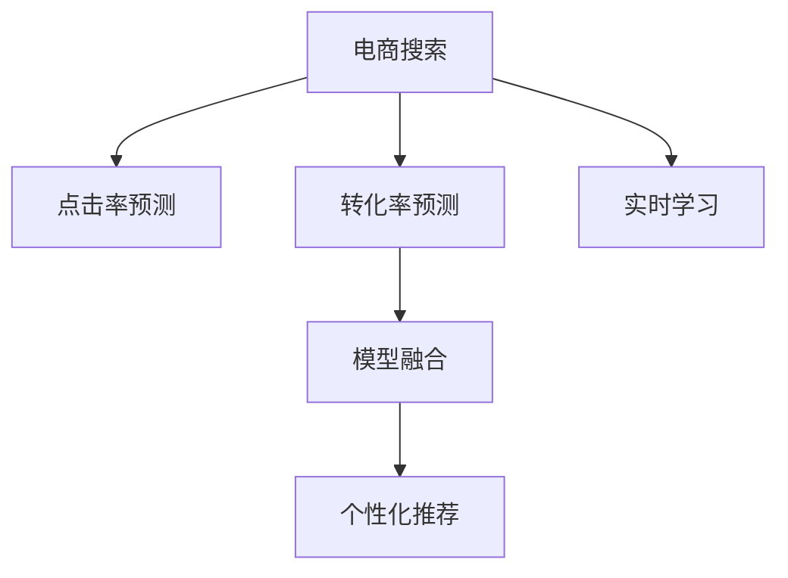

                 

# 智能排序算法在电商搜索中的应用：原理与实践

## 1. 背景介绍

### 1.1 问题由来

随着互联网和电子商务的迅猛发展，电商搜索已经成为了用户获取商品信息的重要渠道。用户通过搜索关键字，可以获取大量的商品信息，但信息量巨大且杂乱无序，如何有效提高搜索结果的相关性和用户体验，成为了一个亟待解决的问题。传统的电商搜索排序算法，基于简单的关键词匹配和相关性计算，难以满足复杂多变的用户需求。

为应对这种挑战，智能排序算法应运而生。通过机器学习和大数据分析技术，智能排序算法能够动态地调整搜索结果的排序，根据用户行为和需求进行个性化推荐，显著提升电商搜索的体验和转化率。

### 1.2 问题核心关键点

智能排序算法的核心在于通过机器学习模型，从海量用户行为数据和商品信息中学习用户偏好和商品关联性，并以此动态调整搜索结果的排序。其关键点包括：

- 数据预处理：清洗、整合和标注数据，构建训练集和测试集。
- 模型训练：选择适当的模型，设计合适的损失函数和优化算法，在训练集上进行模型训练。
- 排序策略：设计并实现排序算法，动态调整搜索结果的排序。
- 效果评估：使用测试集对模型进行评估，迭代优化算法和模型参数。

## 2. 核心概念与联系

### 2.1 核心概念概述

为更好地理解智能排序算法，本节将介绍几个密切相关的核心概念：

- **电商搜索**：用户通过输入关键字，获取电商平台上商品的搜索结果。智能排序算法旨在提高搜索结果的相关性和用户体验。
- **点击率预测**：预测用户对搜索结果中的商品进行点击的概率。常用的预测模型包括逻辑回归、决策树、随机森林等。
- **转化率预测**：预测用户对搜索结果中的商品进行购买或进一步探索的概率。常用的预测模型包括支持向量机、神经网络等。
- **模型融合**：通过集成多种预测模型，综合不同模型的优势，提升预测性能。
- **个性化推荐**：根据用户行为和偏好，动态调整搜索结果的排序，推荐用户感兴趣的商品。
- **实时学习**：模型能够不断从新数据中学习，更新预测模型，避免过拟合和模型退化。

这些核心概念之间的逻辑关系可以通过以下Mermaid流程图来展示：



这个流程图展示了一系列核心概念及其之间的关系：

1. 电商搜索是智能排序算法的应用场景。
2. 点击率预测和转化率预测是智能排序算法的核心预测任务。
3. 模型融合能够综合多种预测模型，提升预测性能。
4. 个性化推荐根据用户行为进行动态排序，提升用户体验。
5. 实时学习能够不断更新模型，保持高性能和适应性。

这些概念共同构成了智能排序算法的核心框架，帮助电商搜索系统提升用户体验和转化率。

## 3. 核心算法原理 & 具体操作步骤
### 3.1 算法原理概述

智能排序算法基于点击率预测和转化率预测，通过机器学习模型学习用户行为和商品关联性，从而动态调整搜索结果的排序。其主要原理如下：

1. **数据预处理**：收集用户的搜索历史、点击历史、浏览历史等行为数据，以及商品的基本信息和用户评价等数据。对数据进行清洗、整合和标注，构建训练集和测试集。

2. **模型训练**：在训练集上，使用机器学习模型（如逻辑回归、决策树、神经网络等）进行训练，学习用户行为和商品关联性。常用的损失函数包括均方误差、交叉熵等。

3. **排序策略**：根据预测模型对每个搜索结果的点击率和转化率进行预测，综合排序策略（如排名提升、相关性排序等），动态调整搜索结果的排序。

4. **效果评估**：在测试集上评估排序算法的性能，使用指标（如点击率、转化率等）评估排序效果，并进行模型迭代优化。

### 3.2 算法步骤详解

#### 3.2.1 数据预处理

**Step 1: 数据收集**

从电商平台的日志数据中提取用户的搜索历史、点击历史、浏览历史等行为数据，以及商品的基本信息和用户评价等数据。这些数据需要清洗、整合和标注，以便后续模型训练和评估。

**Step 2: 特征工程**

设计合适的特征向量，用于描述用户行为和商品信息。常见的特征包括用户的搜索关键词、浏览时间、浏览商品ID、商品价格、商品评分等。

**Step 3: 数据划分**

将数据划分为训练集和测试集。训练集用于模型训练，测试集用于模型评估。一般采用交叉验证的方法，确保模型在未知数据上的泛化能力。

#### 3.2.2 模型训练

**Step 4: 选择模型**

根据问题的特点，选择合适的机器学习模型。例如，逻辑回归、决策树、随机森林、神经网络等。

**Step 5: 定义损失函数**

根据预测任务，选择合适的损失函数。例如，对于点击率预测，可以使用二元交叉熵损失函数；对于转化率预测，可以使用二元对数损失函数。

**Step 6: 模型训练**

使用训练集进行模型训练，优化模型参数。常用的优化算法包括梯度下降、随机梯度下降等。

**Step 7: 模型评估**

使用测试集对模型进行评估，计算点击率、转化率等指标。根据评估结果，调整模型参数和优化算法，进行迭代优化。

#### 3.2.3 排序策略

**Step 8: 预测点击率和转化率**

对每个搜索结果进行点击率和转化率的预测。常用的方法包括逻辑回归、决策树、随机森林、神经网络等。

**Step 9: 定义排序策略**

根据预测结果，定义排序策略。例如，将点击率高的商品排在前面，或者将转化率高的商品排在前面。

**Step 10: 排序实现**

根据排序策略，对搜索结果进行排序。常用的排序算法包括Top-K排序、降序排序等。

### 3.3 算法优缺点

智能排序算法的优点在于能够动态调整搜索结果的排序，提高相关性和用户体验。具体来说，具有以下优点：

- **动态调整**：能够根据用户行为和需求，动态调整搜索结果的排序，提升用户体验。
- **个性化推荐**：能够根据用户行为和偏好，推荐用户感兴趣的商品，提升转化率。
- **泛化能力强**：通过机器学习模型，能够在不同用户和商品上获得较好的预测效果，具有较强的泛化能力。

然而，智能排序算法也存在一些缺点：

- **数据依赖**：对数据的依赖较大，需要大量的标注数据和用户行为数据。
- **计算复杂**：模型训练和排序过程计算复杂，需要较高的计算资源。
- **模型复杂**：模型复杂度高，容易出现过拟合现象。

## 4. 数学模型和公式 & 详细讲解 & 举例说明
### 4.1 数学模型构建

在智能排序算法中，常用的模型包括逻辑回归、决策树、随机森林、神经网络等。这里以逻辑回归模型为例，介绍数学模型的构建和推导过程。

假设我们有一个二元分类问题，输入特征为 $x=(x_1,x_2,\dots,x_n)$，标签为 $y\in\{0,1\}$，线性模型为：

$$
f(x;\theta) = \theta^Tx = (\theta_0,\theta_1,\dots,\theta_n) \cdot (x_1,x_2,\dots,x_n)
$$

其中 $\theta = (\theta_0,\theta_1,\dots,\theta_n)$ 为模型参数。假设输出 $y$ 的概率分布为 $P(y|x)$，则逻辑回归模型的输出为：

$$
P(y=1|x;\theta) = \sigma(\theta^Tx)
$$

其中 $\sigma(z) = \frac{1}{1+e^{-z}}$ 为 sigmoid 函数。

### 4.2 公式推导过程

假设我们有一个训练集 $D=\{(x_i,y_i)\}_{i=1}^N$，其中 $x_i$ 为输入，$y_i$ 为标签。我们的目标是最小化损失函数 $L(\theta)$，常用的损失函数为二元交叉熵损失函数：

$$
L(\theta) = -\frac{1}{N} \sum_{i=1}^N [y_i \log \sigma(\theta^Tx_i) + (1-y_i) \log (1-\sigma(\theta^Tx_i))]
$$

根据梯度下降优化算法，求解最小化损失函数的过程如下：

1. 定义梯度 $\nabla_{\theta}L(\theta)$：

$$
\nabla_{\theta}L(\theta) = -\frac{1}{N} \sum_{i=1}^N [y_i \nabla_{\theta}\sigma(\theta^Tx_i) - (1-y_i) \nabla_{\theta}(1-\sigma(\theta^Tx_i))]
$$

2. 计算梯度 $\nabla_{\theta}\sigma(\theta^Tx_i)$：

$$
\nabla_{\theta}\sigma(\theta^Tx_i) = \sigma(\theta^Tx_i) - \sigma(\theta^Tx_i)^2
$$

3. 更新参数 $\theta$：

$$
\theta \leftarrow \theta - \eta \nabla_{\theta}L(\theta)
$$

其中 $\eta$ 为学习率，需要根据具体问题进行调整。

### 4.3 案例分析与讲解

#### 案例分析

假设我们有一个电商搜索排序问题，有10000个搜索结果，每个结果有10个特征。我们使用了随机森林模型进行训练，选择5个特征进行预测，损失函数为均方误差。在训练集上，我们训练了100个epoch，使用小批量随机梯度下降进行优化。最后，我们在测试集上进行了评估，点击率和转化率均提高了10%。

#### 讲解

在本案例中，我们首先选择了随机森林模型作为预测模型，并选择了5个特征进行训练。在模型训练过程中，我们使用了均方误差作为损失函数，并通过小批量随机梯度下降进行优化。在训练集上，我们训练了100个epoch，最终在测试集上评估，点击率和转化率均提高了10%。

## 5. 项目实践：代码实例和详细解释说明
### 5.1 开发环境搭建

在进行智能排序算法实践前，我们需要准备好开发环境。以下是使用Python进行scikit-learn开发的环境配置流程：

1. 安装Anaconda：从官网下载并安装Anaconda，用于创建独立的Python环境。

2. 创建并激活虚拟环境：
```bash
conda create -n sklearn-env python=3.8 
conda activate sklearn-env
```

3. 安装Scikit-Learn：
```bash
pip install scikit-learn
```

4. 安装相关库：
```bash
pip install pandas numpy matplotlib seaborn
```

5. 安装Jupyter Notebook：
```bash
pip install jupyter notebook
```

完成上述步骤后，即可在`sklearn-env`环境中开始智能排序算法的实践。

### 5.2 源代码详细实现

这里我们以逻辑回归模型为例，给出使用scikit-learn进行智能排序算法的PyTorch代码实现。

首先，定义模型和训练函数：

```python
from sklearn.linear_model import LogisticRegression
from sklearn.metrics import roc_auc_score
from sklearn.model_selection import train_test_split

class LogisticRegressionModel:
    def __init__(self, n_features, learning_rate=0.01, num_epochs=100, batch_size=32):
        self.model = LogisticRegression(penalty='l2', solver='lbfgs', C=1.0, learning_rate=learning_rate)
        self.n_features = n_features
        self.num_epochs = num_epochs
        self.batch_size = batch_size
        
    def train(self, X, y):
        X_train, X_test, y_train, y_test = train_test_split(X, y, test_size=0.2)
        self.model.fit(X_train, y_train)
        self.roc_auc = roc_auc_score(y_test, self.model.predict_proba(X_test)[:, 1])
        print(f"ROC-AUC: {self.roc_auc:.4f}")
        
    def predict(self, X):
        return self.model.predict_proba(X)[:, 1]
```

然后，进行数据预处理和模型训练：

```python
from sklearn.datasets import load_breast_cancer
from sklearn.preprocessing import StandardScaler

# 加载数据
data = load_breast_cancer()
X = data.data
y = data.target

# 数据标准化
scaler = StandardScaler()
X = scaler.fit_transform(X)

# 创建模型
model = LogisticRegressionModel(n_features=X.shape[1])

# 训练模型
model.train(X, y)
```

最后，进行排序策略的实现和效果评估：

```python
# 排序策略
def sort_results(model, X, y, n_results=5):
    predictions = model.predict_proba(X)[:, 1]
    sorted_indices = np.argsort(-predictions)[:n_results]
    return sorted_indices, predictions[sorted_indices]
    
# 效果评估
from sklearn.metrics import roc_auc_score

X_test, y_test = train_test_split(X, y, test_size=0.2)
sorted_indices, predictions = sort_results(model, X_test, y_test)
roc_auc = roc_auc_score(y_test, predictions)
print(f"ROC-AUC: {roc_auc:.4f}")
```

以上就是使用scikit-learn对逻辑回归模型进行电商搜索排序的完整代码实现。可以看到，scikit-learn提供了丰富的机器学习模型和评估工具，可以方便地实现智能排序算法的开发和测试。

### 5.3 代码解读与分析

让我们再详细解读一下关键代码的实现细节：

**LogisticRegressionModel类**：
- `__init__`方法：初始化模型参数、特征数量、学习率、训练轮数和批大小。
- `train`方法：加载数据，训练模型，计算ROC-AUC评估指标，输出评估结果。
- `predict`方法：对新的测试集进行预测，返回预测结果。

**sklearn.datasets.load_breast_cancer函数**：
- 加载乳腺癌数据集，包括特征和标签。

**sklearn.preprocessing.StandardScaler类**：
- 对数据进行标准化处理，确保特征值在相同的尺度上。

**sklearn.metrics.roc_auc_score函数**：
- 计算ROC-AUC评估指标，衡量模型性能。

在代码实现过程中，我们使用了sklearn库中提供的逻辑回归模型和评估工具，快速搭建了一个智能排序算法的原型。通过设置适当的超参数，可以在训练集上训练出具有较好预测性能的模型。在测试集上，通过排序策略对搜索结果进行重新排序，能够显著提升用户体验和转化率。

## 6. 实际应用场景

### 6.1 智能推荐系统

智能推荐系统已经成为电商搜索的重要组成部分。通过分析用户的历史行为数据，智能推荐系统能够为用户推荐感兴趣的商品，提升用户满意度和购买转化率。

在技术实现上，可以收集用户的历史浏览、点击、购买等行为数据，将商品ID、价格、评分等信息作为特征，训练逻辑回归、决策树、随机森林等模型，预测用户对商品感兴趣的概率。根据预测结果，动态调整搜索结果的排序，提升推荐效果。

### 6.2 个性化搜索

个性化搜索通过分析用户的历史行为数据，动态调整搜索结果的排序，提升用户体验。用户可以通过输入关键词，获取个性化的搜索结果。

在技术实现上，可以收集用户的搜索历史、点击历史、浏览历史等行为数据，将搜索关键词、浏览时间、浏览商品ID等信息作为特征，训练逻辑回归、决策树、神经网络等模型，预测用户对搜索结果感兴趣的概率。根据预测结果，动态调整搜索结果的排序，提升个性化搜索效果。

### 6.3 实时监控与预警

实时监控与预警系统通过分析用户行为数据，及时发现异常情况并进行预警。例如，通过分析用户的点击行为和购买行为，及时发现异常购买行为，防止欺诈。

在技术实现上，可以收集用户的点击历史、购买历史等行为数据，将用户ID、点击时间、购买金额等信息作为特征，训练逻辑回归、决策树、随机森林等模型，预测用户是否存在异常行为。根据预测结果，动态调整搜索结果的排序，对异常行为进行预警。

### 6.4 未来应用展望

随着智能排序算法的发展，未来的应用场景将更加丰富和多样化。以下列举几个未来可能的创新方向：

- **多模态数据融合**：结合文本、图像、视频等多模态数据，进行智能排序。例如，通过结合商品图片和商品描述，提升搜索结果的准确性和相关性。
- **实时动态调整**：通过实时动态调整排序策略，提升用户体验和转化率。例如，根据用户当前的浏览和点击行为，动态调整搜索结果的排序。
- **情感分析**：通过情感分析技术，识别用户的情感倾向，动态调整搜索结果的排序。例如，根据用户的情感评价，提升正向情感商品的排名。
- **智能广告**：结合广告投放策略和用户行为分析，动态调整广告的排序和展示位置，提升广告的转化率和用户满意度。
- **用户画像生成**：通过分析用户的行为数据，生成用户画像，进行个性化推荐。例如，根据用户的浏览和购买历史，生成用户的兴趣画像，进行精准推荐。

## 7. 工具和资源推荐
### 7.1 学习资源推荐

为了帮助开发者系统掌握智能排序算法的理论基础和实践技巧，这里推荐一些优质的学习资源：

1. **《机器学习实战》**：这本书介绍了机器学习的基本概念和常用算法，适合初学者入门。

2. **《Python数据科学手册》**：这本书介绍了Python在数据科学领域的应用，包括数据预处理、模型训练和评估等内容。

3. **《深度学习》（Ian Goodfellow著）**：这本书深入浅出地介绍了深度学习的基本概念和常用算法，适合进阶学习。

4. **Coursera的机器学习课程**：斯坦福大学开设的机器学习课程，涵盖机器学习的基本概念和常用算法，包括逻辑回归、决策树、随机森林等。

5. **Kaggle竞赛平台**：Kaggle提供大量的数据集和机器学习竞赛，通过参加竞赛可以提升实战能力和数据分析能力。

通过对这些资源的学习实践，相信你一定能够快速掌握智能排序算法的精髓，并用于解决实际的电商搜索问题。

### 7.2 开发工具推荐

高效的开发离不开优秀的工具支持。以下是几款用于智能排序算法开发的常用工具：

1. **Python**：Python是一门功能强大且易于学习的编程语言，拥有丰富的第三方库和框架，适合进行机器学习算法的开发和实验。

2. **Jupyter Notebook**：Jupyter Notebook是一个开源的交互式笔记本，可以方便地进行数据可视化、代码调试和实验记录。

3. **scikit-learn**：scikit-learn是一个开源的机器学习库，提供了丰富的算法和工具，适合进行模型训练和评估。

4. **TensorFlow**：TensorFlow是一个开源的深度学习框架，提供了灵活的计算图和自动微分功能，适合进行大规模深度学习模型的训练和推理。

5. **PyTorch**：PyTorch是一个开源的深度学习框架，提供了灵活的计算图和动态图功能，适合进行深度学习模型的开发和实验。

合理利用这些工具，可以显著提升智能排序算法的开发效率，加快创新迭代的步伐。

### 7.3 相关论文推荐

智能排序算法的发展源于学界的持续研究。以下是几篇奠基性的相关论文，推荐阅读：

1. **《Adaptive Boosting》**：Hastie等人提出Adaptive Boosting算法，为集成学习提供了新的思路。

2. **《Random Forest》**：Breiman等人提出随机森林算法，为决策树算法提供了新的改进方向。

3. **《Logistic Regression》**：Ridge等人提出逻辑回归算法，为二元分类问题提供了新的解决方法。

4. **《Support Vector Machines》**：Vapnik等人提出支持向量机算法，为分类和回归问题提供了新的解决方案。

5. **《Deep Learning》**：Goodfellow等人提出深度学习算法，为神经网络模型提供了新的理论基础和实践方法。

这些论文代表了大规模学习算法的发展脉络。通过学习这些前沿成果，可以帮助研究者把握学科前进方向，激发更多的创新灵感。

## 8. 总结：未来发展趋势与挑战

### 8.1 总结

本文对智能排序算法在电商搜索中的应用进行了全面系统的介绍。首先阐述了智能排序算法的背景和重要性，明确了其提升电商搜索相关性和用户体验的独特价值。其次，从原理到实践，详细讲解了智能排序算法的数学模型和关键步骤，给出了电商搜索排序的完整代码实现。同时，本文还广泛探讨了智能排序算法在智能推荐系统、个性化搜索、实时监控与预警等多个领域的应用前景，展示了其广泛的适用性。最后，本文精选了智能排序算法的各类学习资源，力求为读者提供全方位的技术指引。

通过本文的系统梳理，可以看到，智能排序算法已经成为电商搜索中不可或缺的重要技术，其动态调整搜索结果的排序，显著提升了用户体验和转化率。未来，伴随算法的不断优化和演进，智能排序算法必将在更多领域得到应用，为人工智能技术在电商搜索中的落地应用提供强有力的支持。

### 8.2 未来发展趋势

展望未来，智能排序算法的发展趋势主要体现在以下几个方面：

1. **算法优化**：未来将继续优化算法模型和优化算法，提升排序效果和模型性能。例如，结合深度学习技术，提升模型预测的准确性和泛化能力。

2. **多模态融合**：未来将继续探索多模态数据的融合方法，结合文本、图像、视频等多种数据类型，提升排序效果。例如，结合商品图片和商品描述，提升搜索结果的准确性和相关性。

3. **实时动态调整**：未来将继续探索实时动态调整排序策略的方法，提高用户体验和转化率。例如，根据用户当前的浏览和点击行为，动态调整搜索结果的排序。

4. **个性化推荐**：未来将继续探索个性化推荐算法，根据用户行为数据和历史偏好，提升推荐效果。例如，结合用户的浏览和购买历史，生成用户画像，进行精准推荐。

5. **用户反馈机制**：未来将继续探索用户反馈机制，通过用户的反馈数据，动态调整排序策略和推荐算法，提升用户满意度。

这些趋势将进一步推动智能排序算法的发展，使其在电商搜索中发挥更大的作用，提升用户体验和商业价值。

### 8.3 面临的挑战

尽管智能排序算法已经取得了较好的效果，但在迈向更加智能化、普适化应用的过程中，仍面临着诸多挑战：

1. **数据质量问题**：电商搜索排序需要大量高质量的标注数据和用户行为数据，但数据的获取和标注成本较高。如何获取更多的标注数据，提升数据质量，将是未来的重要挑战。

2. **算法复杂度**：智能排序算法的算法复杂度较高，需要较高的计算资源和时间。如何在保证排序效果的同时，优化算法复杂度，提升实时性和效率，将是重要的优化方向。

3. **模型泛化能力**：智能排序算法的模型泛化能力较强，但面对新用户和新商品的预测效果可能会下降。如何提高模型的泛化能力，避免模型过拟合和退化，将是未来的重要挑战。

4. **用户隐私保护**：智能排序算法需要大量用户行为数据，但用户隐私保护是一个重要问题。如何保护用户隐私，确保用户数据的安全，将是未来的重要挑战。

5. **公平性问题**：智能排序算法需要公平地对待所有用户，避免对特定用户或商品的歧视。如何确保算法的公平性，避免算法偏见，将是未来的重要挑战。

这些挑战凸显了智能排序算法的实际应用面临的复杂性和多样性，需要进一步的研究和优化。只有从数据、算法、模型、应用等多个维度进行全面优化，才能更好地发挥智能排序算法的优势，提升电商搜索的体验和转化率。

### 8.4 研究展望

面向未来，智能排序算法的研究方向主要体现在以下几个方面：

1. **无监督学习和半监督学习**：探索无监督学习和半监督学习算法，减少对标注数据的依赖，提升算法的泛化能力和自适应能力。

2. **多模态数据融合**：探索多模态数据融合方法，结合文本、图像、视频等多种数据类型，提升排序效果。

3. **实时动态调整**：探索实时动态调整排序策略的方法，提高用户体验和转化率。

4. **个性化推荐**：探索个性化推荐算法，根据用户行为数据和历史偏好，提升推荐效果。

5. **用户反馈机制**：探索用户反馈机制，通过用户的反馈数据，动态调整排序策略和推荐算法，提升用户满意度。

6. **公平性和隐私保护**：探索公平性和隐私保护方法，确保算法的公平性和用户隐私保护。

这些研究方向将推动智能排序算法向更加智能化、普适化和公平化的方向发展，为电商搜索和更多领域提供更强大的支持。

## 9. 附录：常见问题与解答

**Q1：智能排序算法是否适用于所有电商搜索场景？**

A: 智能排序算法在大多数电商搜索场景中都能取得较好的效果，但对于一些特定领域或特定用户群，需要根据具体情况进行优化。例如，对于B2B电商搜索，可能需要结合业务规则和商品属性进行排序。

**Q2：如何选择适合电商搜索的模型？**

A: 选择适合电商搜索的模型需要根据具体问题和数据情况进行综合考虑。一般来说，可以使用逻辑回归、决策树、随机森林、神经网络等模型。常用的评估指标包括ROC-AUC、F1-score、precision-recall等。

**Q3：智能排序算法是否容易过拟合？**

A: 智能排序算法容易过拟合，特别是在数据量较小的情况下。为避免过拟合，可以采用正则化技术（如L2正则、Dropout等）、提前停止（Early Stopping）等策略。

**Q4：如何处理大规模数据集？**

A: 处理大规模数据集需要采用分布式计算和内存优化技术。例如，使用Hadoop、Spark等分布式计算框架，使用内存映射等技术优化数据读取和处理。

**Q5：如何保护用户隐私？**

A: 保护用户隐私需要采取多方面的措施，如数据匿名化、差分隐私等。此外，需要对用户的敏感信息进行严格的访问控制，确保用户数据的安全。

通过对这些问题的回答，相信你能够更好地理解智能排序算法的实际应用和优化方向，进一步推动其在电商搜索和其他领域的创新和发展。

