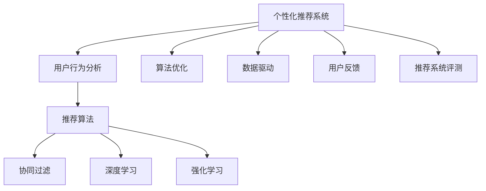

                 

# 智能推荐系统：AI如何实现个性化推荐

> 关键词：个性化推荐,推荐算法,用户行为分析,深度学习,协同过滤,机器学习,强化学习,算法优化,数据驱动,用户反馈,推荐系统评测

## 1. 背景介绍

在当今信息爆炸的时代，内容海量且质量参差不齐，用户往往被淹没在信息的洪流中，难以筛选出对自己有用的信息。为了帮助用户快速发现优质内容，个性化推荐系统应运而生。个性化推荐系统通过分析用户行为数据，学习用户的兴趣偏好，为他们推荐最相关的物品或内容，极大地提升了用户体验和内容利用率。AI技术的引入，特别是深度学习、协同过滤、强化学习等技术的突破，使得个性化推荐系统在推荐效果和应用范围上都有了显著提升。本文将系统介绍AI技术在个性化推荐系统中的应用，包括推荐算法原理、推荐系统构建、推荐系统评测等关键环节，并展望其未来发展趋势。

## 2. 核心概念与联系

### 2.1 核心概念概述

为更好地理解AI技术在个性化推荐系统中的应用，本节将介绍几个密切相关的核心概念：

- **个性化推荐系统**：基于用户的历史行为数据和兴趣偏好，为每个用户推荐最相关的物品或内容的系统。目标是提高用户的满意度和内容利用率。
- **推荐算法**：用于分析用户数据和物品特征，学习用户兴趣和物品相似性，生成推荐结果的算法。
- **用户行为分析**：通过追踪用户的历史操作（如点击、浏览、购买等），构建用户画像，提取用户兴趣和需求。
- **协同过滤**：一种基于用户兴趣和物品相似性进行推荐的算法，利用用户和物品的协同数据（如评分、评价等）来预测用户对新物品的偏好。
- **深度学习**：利用神经网络模型自动学习特征表示，提取用户和物品的隐含信息，实现更加精准的推荐。
- **强化学习**：通过模拟奖励机制，优化推荐策略，使用户在实际交互中获得更好的体验。
- **算法优化**：对推荐算法进行调参和优化，提升模型的性能和稳定性。
- **数据驱动**：以用户行为数据为输入，驱动推荐模型的训练和优化。
- **用户反馈**：利用用户的点击、评分、评论等反馈数据，持续优化推荐结果。
- **推荐系统评测**：评估推荐系统的性能和用户体验，通常包括准确率、覆盖率、多样性等指标。

这些核心概念之间的逻辑关系可以通过以下Mermaid流程图来展示：



这个流程图展示了个性化推荐系统的核心概念及其之间的关系：

1. 个性化推荐系统以用户行为分析为输入，学习用户兴趣和需求。
2. 推荐算法根据用户数据和物品特征，生成推荐结果。
3. 协同过滤、深度学习、强化学习等算法，提供了多样化的推荐方法。
4. 算法优化、数据驱动、用户反馈等环节，保证了系统的持续改进。
5. 推荐系统评测，评估模型的性能和用户体验。

这些概念共同构成了个性化推荐系统的完整框架，使其能够精准地为用户推荐内容。通过理解这些核心概念，我们可以更好地把握AI技术在推荐系统中的应用。

## 3. 核心算法原理 & 具体操作步骤
### 3.1 算法原理概述

个性化推荐系统的核心目标是最大化用户满意度，通常通过最大化用户行为（如点击、购买等）的预测准确率来达成。推荐算法主要分为三类：

1. **基于内容的推荐**：直接利用物品的属性（如类别、描述等）和用户的历史行为数据，通过相似性度量生成推荐。
2. **协同过滤**：利用用户间的相似性、物品间的相似性，通过协同数据进行推荐。
3. **混合推荐**：结合多种推荐方法，取长补短，提升推荐效果。

### 3.2 算法步骤详解

个性化推荐系统的构建主要包括以下几个关键步骤：

**Step 1: 数据收集与处理**
- 收集用户的历史行为数据，如浏览记录、评分、评价等。
- 处理数据，去除噪声、填补缺失值，构建数据集。

**Step 2: 特征工程**
- 提取用户和物品的特征，如用户画像、物品描述、用户评分等。
- 使用降维、归一化等技术处理特征，降低计算复杂度。

**Step 3: 模型训练**
- 选择合适的推荐算法，如协同过滤、深度学习、强化学习等。
- 训练模型，优化模型参数，提升推荐效果。
- 使用交叉验证等技术验证模型效果。

**Step 4: 推荐生成**
- 利用训练好的模型，对新用户和新物品进行推荐。
- 根据用户反馈不断调整模型，提升推荐效果。

**Step 5: 系统部署与监控**
- 将模型集成到推荐系统中，实现实时推荐。
- 实时监控系统性能，收集用户反馈，进行持续改进。

### 3.3 算法优缺点

个性化推荐系统具有以下优点：
1. 提升用户满意度。通过精准推荐，提高用户对系统的粘性和信任度。
2. 提高内容利用率。用户更容易发现感兴趣的内容，提升内容曝光和利用率。
3. 增强平台收入。推荐优质内容，增加用户点击和购买行为，提高平台收益。

同时，该系统也存在以下缺点：
1. 数据依赖性强。推荐系统的效果很大程度上取决于数据的丰富性和质量。
2. 冷启动问题。新用户或新物品没有足够的历史数据，难以进行推荐。
3. 推荐偏差。模型可能基于用户的单一行为偏好，忽视其他兴趣和需求。
4. 推荐多样性不足。过多地推荐热门内容，忽略长尾内容，导致推荐结果单一。
5. 数据隐私问题。收集用户行为数据可能涉及隐私问题，需要采取合适的保护措施。

尽管存在这些局限性，但就目前而言，个性化推荐系统仍是最主流、最有效的用户服务方式之一。未来相关研究的重点在于如何进一步提升推荐系统的鲁棒性、多样性和隐私保护，同时兼顾模型可解释性和实用性。

### 3.4 算法应用领域

个性化推荐系统已经广泛应用于多个领域，包括：

- 电子商务：根据用户浏览和购买历史，推荐商品。如亚马逊、淘宝等电商平台。
- 视频流媒体：根据用户观看历史，推荐视频。如Netflix、YouTube等平台。
- 音乐和音频：根据用户听歌历史，推荐音乐和播客。如Spotify、Apple Music等平台。
- 新闻阅读：根据用户阅读历史，推荐新闻和文章。如Reddit、今日头条等平台。
- 社交网络：根据用户互动历史，推荐好友、群组和内容。如Facebook、微博等平台。

除了上述这些经典应用外，个性化推荐系统还被创新性地应用到更多场景中，如智能客服、个性化广告、智能交通等，为各行业的数字化转型升级提供了新的技术路径。

## 4. 数学模型和公式 & 详细讲解 & 举例说明
### 4.1 数学模型构建

本节将使用数学语言对个性化推荐系统的构建过程进行更加严格的刻画。

记用户集合为 $U=\{u_1, u_2, \ldots, u_n\}$，物品集合为 $I=\{i_1, i_2, \ldots, i_m\}$，用户对物品的评分矩阵为 $R \in \mathbb{R}^{n \times m}$。其中 $R_{uj} = r_{uj}$ 表示用户 $u_j$ 对物品 $i_u$ 的评分。

推荐系统的目标是最小化预测评分和实际评分的差异，即最小化损失函数：

$$
\min_{\theta} \sum_{u=1}^{n} \sum_{i=1}^{m} r_{uj} \log \sigma(\langle \theta_u, \phi(i_j) \rangle)
$$

其中 $\sigma(\cdot)$ 为sigmoid函数，$\theta_u$ 为第 $u$ 个用户的隐向量，$\phi(i_j)$ 为物品 $i_j$ 的特征向量。

### 4.2 公式推导过程

以上损失函数的推导过程如下：

假设推荐系统通过训练得到的模型，对物品 $i_j$ 对用户 $u_j$ 的评分预测为 $p_{uj}$，则损失函数为：

$$
\min_{\theta} \sum_{u=1}^{n} \sum_{i=1}^{m} (r_{uj} - p_{uj})^2
$$

其中 $p_{uj} = \sigma(\langle \theta_u, \phi(i_j) \rangle)$。

为了方便计算，引入sigmoid函数，将上述损失函数转化为：

$$
\min_{\theta} \sum_{u=1}^{n} \sum_{i=1}^{m} r_{uj} \log \sigma(\langle \theta_u, \phi(i_j) \rangle) + (1 - r_{uj}) \log (1 - \sigma(\langle \theta_u, \phi(i_j) \rangle))
$$

引入 $\langle \cdot, \cdot \rangle$ 表示向量的点乘运算，得到最终损失函数。

### 4.3 案例分析与讲解

假设用户 $u$ 对物品 $i$ 的评分 $r_{uj}$ 服从高斯分布，则预测评分的对数似然函数为：

$$
\log P(r_{uj} \mid \theta_u, \phi(i)) = \langle \theta_u, \phi(i) \rangle
$$

其中 $\theta_u$ 为第 $u$ 个用户的隐向量，$\phi(i)$ 为物品 $i$ 的特征向量。

该公式的含义是：对于每个用户，根据其隐向量和物品特征向量计算预测评分，然后计算其对数似然。

以协同过滤算法为例，其基于用户-物品的评分矩阵进行推荐。用户 $u$ 对物品 $i$ 的评分 $r_{uj}$ 可以看作是用户 $u$ 和物品 $i$ 的隐向量的点积，即 $r_{uj} = \langle \theta_u, \phi(i) \rangle$。其中 $\theta_u$ 和 $\phi(i)$ 分别为用户 $u$ 和物品 $i$ 的隐向量。

## 5. 项目实践：代码实例和详细解释说明
### 5.1 开发环境搭建

在进行推荐系统实践前，我们需要准备好开发环境。以下是使用Python进行TensorFlow开发的环境配置流程：

1. 安装Anaconda：从官网下载并安装Anaconda，用于创建独立的Python环境。

2. 创建并激活虚拟环境：
```bash
conda create -n recommendation-env python=3.8 
conda activate recommendation-env
```

3. 安装TensorFlow：根据CUDA版本，从官网获取对应的安装命令。例如：
```bash
conda install tensorflow -c pytorch -c conda-forge
```

4. 安装Keras：
```bash
pip install keras
```

5. 安装各类工具包：
```bash
pip install numpy pandas scikit-learn matplotlib tqdm jupyter notebook ipython
```

完成上述步骤后，即可在`recommendation-env`环境中开始推荐系统实践。

### 5.2 源代码详细实现

这里我们以协同过滤算法为例，给出使用TensorFlow和Keras库构建推荐系统的代码实现。

首先，定义推荐模型的输入和输出：

```python
from tensorflow.keras.layers import Input, Dense
from tensorflow.keras.models import Model
from tensorflow.keras.optimizers import Adam

user_input = Input(shape=(n_features,), name='user')
item_input = Input(shape=(m_features,), name='item')
hidden = Dense(hidden_units, activation='relu', name='hidden')([user_input, item_input])
rating = Dense(1, activation='sigmoid', name='rating')(hidden)
model = Model(inputs=[user_input, item_input], outputs=rating)
```

然后，定义训练和评估函数：

```python
from tensorflow.keras.losses import MeanSquaredError
from tensorflow.keras.metrics import MeanAbsoluteError, MeanSquaredError

def train_epoch(model, train_data, batch_size, optimizer):
    model.compile(optimizer=optimizer, loss='mse')
    model.fit(train_data, epochs=1, batch_size=batch_size, validation_split=0.2)
    
def evaluate(model, test_data, batch_size):
    model.compile(optimizer=optimizer, loss='mse')
    model.evaluate(test_data)
```

最后，启动训练流程并在测试集上评估：

```python
epochs = 10
batch_size = 128

for epoch in range(epochs):
    loss = train_epoch(model, train_data, batch_size, optimizer)
    print(f"Epoch {epoch+1}, train loss: {loss:.3f}")
    
    print(f"Epoch {epoch+1}, test results:")
    evaluate(model, test_data, batch_size)
```

以上就是使用TensorFlow和Keras构建协同过滤推荐系统的完整代码实现。可以看到，TensorFlow和Keras提供了强大的高层次API，使得推荐模型的实现变得简洁高效。

### 5.3 代码解读与分析

让我们再详细解读一下关键代码的实现细节：

**RecommendationModel类**：
- `__init__`方法：初始化输入层、隐层和输出层。
- `__call__`方法：定义模型的前向传播过程。
- `compile`方法：编译模型，设置优化器、损失函数和评价指标。
- `fit`方法：训练模型，使用交叉验证评估模型效果。
- `evaluate`方法：在测试集上评估模型性能，计算评价指标。

**train_epoch函数**：
- 使用Keras的`fit`方法训练模型，设置参数和数据。
- 在每个epoch结束时，计算训练集损失和验证集损失，输出平均损失。

**evaluate函数**：
- 使用Keras的`evaluate`方法在测试集上评估模型性能，计算平均损失。

**训练流程**：
- 定义总的epoch数和batch size，开始循环迭代
- 每个epoch内，在训练集上训练，输出平均损失
- 在测试集上评估，输出各项评价指标

可以看到，TensorFlow和Keras使得推荐模型的构建和训练变得简单便捷。开发者可以更加专注于模型的设计优化和性能调参，而不必过多关注底层实现细节。

当然，工业级的系统实现还需考虑更多因素，如模型的保存和部署、超参数的自动搜索、更灵活的模型结构等。但核心的推荐算法思想基本与此类似。

## 6. 实际应用场景
### 6.1 电子商务

在电子商务领域，个性化推荐系统可以显著提升用户体验和平台收入。通过分析用户的浏览记录、购买历史等数据，推荐系统可以为每个用户生成个性化的商品推荐，提高用户的购买意愿和平台转化率。

例如，亚马逊通过推荐系统，将用户的浏览和购买行为转化为精准的商品推荐，极大提升了用户的购物体验和平台的销售额。通过推荐系统，亚马逊能够实时更新商品推荐，满足用户的即时需求，增强平台的粘性和信任度。

### 6.2 视频流媒体

视频流媒体平台如Netflix，通过个性化推荐系统为用户推荐视频内容，提升用户的观看体验和平台留存率。推荐系统分析用户的观看历史、评分、评价等数据，推荐最符合用户兴趣的视频，减少用户选择困难，增加平台黏性。

Netflix通过推荐系统，成功预测用户对新上线的热门影片的兴趣，提升新片上线的观看率。同时，Netflix还利用推荐系统的反馈数据，不断优化算法，提升推荐精度和用户体验。

### 6.3 音乐和音频

音乐和音频平台如Spotify，通过个性化推荐系统为用户推荐歌曲和播客，提高用户的收听体验和平台订阅率。推荐系统分析用户的听歌历史、评分、评价等数据，推荐最符合用户兴趣的歌曲，增加用户的收听时长和平台黏性。

Spotify通过推荐系统，成功预测用户对新上线的热门歌曲的兴趣，提升新歌上线的收听率。同时，Spotify还利用推荐系统的反馈数据，不断优化算法，提升推荐精度和用户体验。

### 6.4 新闻阅读

新闻阅读平台如Reddit、今日头条，通过个性化推荐系统为用户推荐新闻和文章，提高用户的阅读体验和平台流量。推荐系统分析用户的阅读历史、点击、评论等数据，推荐最符合用户兴趣的新闻，减少用户的阅读选择困难，增加平台流量和用户粘性。

Reddit通过推荐系统，成功预测用户对新发布的文章的兴趣，提升新文章的点击率。同时，Reddit还利用推荐系统的反馈数据，不断优化算法，提升推荐精度和用户体验。

### 6.5 社交网络

社交网络平台如Facebook、微博，通过个性化推荐系统为用户推荐好友、群组和内容，提高用户的社交体验和平台活跃度。推荐系统分析用户的互动历史、关注对象等数据，推荐最符合用户兴趣的社交内容，增加用户的社交互动和平台黏性。

Facebook通过推荐系统，成功预测用户对新发布的朋友和群组的信息的兴趣，提升新朋友和群组的加入率。同时，Facebook还利用推荐系统的反馈数据，不断优化算法，提升推荐精度和用户体验。

## 7. 工具和资源推荐
### 7.1 学习资源推荐

为了帮助开发者系统掌握推荐系统的理论基础和实践技巧，这里推荐一些优质的学习资源：

1. 《推荐系统实战》书籍：全面介绍了推荐系统的工作原理和经典算法，包括协同过滤、深度学习、强化学习等。
2. 《深度学习与推荐系统》课程：斯坦福大学开设的推荐系统课程，有Lecture视频和配套作业，带你入门推荐系统的基本概念和经典模型。
3. KDD Cup推荐系统竞赛数据集：包含丰富的推荐系统数据集和基线模型，用于实践和验证推荐系统算法。
4. Recommenders.org：一个推荐系统的开源项目，提供了多种推荐算法的实现和评估工具，帮助你深入理解推荐系统的构建和优化。
5. Kaggle推荐系统竞赛：参加Kaggle上的推荐系统竞赛，通过实践积累推荐系统的经验和技巧。

通过对这些资源的学习实践，相信你一定能够快速掌握推荐系统的精髓，并用于解决实际的推荐问题。

### 7.2 开发工具推荐

高效的开发离不开优秀的工具支持。以下是几款用于推荐系统开发的常用工具：

1. TensorFlow：基于Python的开源深度学习框架，灵活动态的计算图，适合快速迭代研究。推荐系统的主流模型如神经网络、协同过滤等都有TensorFlow版本的实现。
2. PyTorch：基于Python的开源深度学习框架，灵活性高，支持动态图，适合复杂模型的构建。推荐系统的主流模型如深度学习、强化学习等都有PyTorch版本的实现。
3. Scikit-learn：基于Python的机器学习库，提供了多种推荐算法的实现，如协同过滤、矩阵分解等。
4. LightFM：一个基于因子分解的推荐系统库，支持多种推荐算法和模型评估。
5. PySpark：基于Spark的大数据处理框架，支持分布式计算，适合处理大规模推荐系统数据。

合理利用这些工具，可以显著提升推荐系统的开发效率，加快创新迭代的步伐。

### 7.3 相关论文推荐

推荐系统的发展源于学界的持续研究。以下是几篇奠基性的相关论文，推荐阅读：

1. Item-based Collaborative Filtering（即协同过滤原论文）：提出了协同过滤算法的基本思想，通过用户-物品的评分矩阵进行推荐。
2. Factorization Machines for Recommender Systems：提出了因子分解机的推荐算法，提升了推荐模型的精度和解释性。
3. Matrix Factorization Techniques for Recommender Systems：介绍了矩阵分解的推荐算法，通过低秩矩阵分解提取用户和物品的隐含信息。
4. Deep Collaborative Filtering：提出了深度学习在推荐系统中的应用，通过多层神经网络提升推荐模型的精度和泛化能力。
5. Applying the Netflix Prize to the Theory of Collaborative Filtering：介绍了Netflix竞赛的数据集和基线模型，推动了协同过滤算法的研究。

这些论文代表了大推荐系统的发展脉络。通过学习这些前沿成果，可以帮助研究者把握学科前进方向，激发更多的创新灵感。

## 8. 总结：未来发展趋势与挑战
### 8.1 总结

本文对AI技术在个性化推荐系统中的应用进行了全面系统的介绍。首先阐述了推荐系统的构建背景和意义，明确了推荐系统在提升用户体验和平台收入方面的独特价值。其次，从原理到实践，详细讲解了推荐算法的数学模型和关键步骤，给出了推荐系统开发的完整代码实例。同时，本文还广泛探讨了推荐系统在电子商务、视频流媒体、音乐和音频、新闻阅读、社交网络等多个行业领域的应用前景，展示了推荐系统范式的巨大潜力。此外，本文精选了推荐系统的各类学习资源，力求为读者提供全方位的技术指引。

通过本文的系统梳理，可以看到，AI技术在个性化推荐系统中的应用已经成为提升用户体验和平台收益的重要手段。推荐算法的发展日新月异，从协同过滤到深度学习，再到强化学习，不断地在精度、鲁棒性、多样性等方面进行优化。未来，伴随推荐算法的不断演进，推荐系统必将在更多领域得到应用，为各行业的数字化转型升级提供新的技术路径。

### 8.2 未来发展趋势

展望未来，个性化推荐系统将呈现以下几个发展趋势：

1. 推荐算法多样化。未来推荐系统将结合多种算法，提升推荐效果。例如，深度学习结合协同过滤，提升推荐模型的精度和泛化能力。
2. 数据驱动更加深入。推荐系统将更加注重用户行为数据的多样性和质量，通过多维度、多模态数据进行推荐。例如，结合用户评分、行为数据、社交网络信息等，提升推荐模型的精准度。
3. 用户反馈实时化。推荐系统将更加注重用户的即时反馈，通过实时调整推荐策略，提高用户体验和满意度。例如，基于用户点击、评分等实时数据进行模型更新，提升推荐精度。
4. 模型可解释性增强。推荐系统将更加注重模型可解释性，通过可视化、特征解释等手段，让用户理解推荐决策的逻辑和依据。例如，利用可解释性强的模型，如线性模型、决策树等，提升推荐系统的可信度。
5. 推荐系统智能化。推荐系统将结合更多智能技术，如强化学习、生成对抗网络等，提升推荐策略的智能化水平。例如，通过强化学习优化推荐策略，使用户在实际交互中获得更好的体验。

以上趋势凸显了个性化推荐系统的广阔前景。这些方向的探索发展，必将进一步提升推荐系统的性能和应用范围，为各行业的数字化转型升级提供新的技术路径。

### 8.3 面临的挑战

尽管个性化推荐系统已经取得了瞩目成就，但在迈向更加智能化、普适化应用的过程中，它仍面临着诸多挑战：

1. 数据隐私问题。推荐系统需要收集和处理大量用户数据，涉及隐私保护问题，需要采取合适的保护措施。例如，采用匿名化处理、差分隐私等技术，保障用户数据安全。
2. 冷启动问题。新用户或新物品没有足够的历史数据，难以进行推荐。需要通过多模态数据、先验知识等技术，缓解冷启动问题。
3. 推荐偏差。模型可能基于用户的单一行为偏好，忽视其他兴趣和需求。需要通过多维度、多模态数据进行推荐，避免推荐偏差。
4. 推荐多样性不足。过多地推荐热门内容，忽略长尾内容，导致推荐结果单一。需要通过多样性增强技术，提升推荐结果的多样性。
5. 推荐精度不足。模型可能存在过拟合或欠拟合问题，影响推荐精度。需要通过正则化、模型调参等手段，提升推荐精度。

尽管存在这些挑战，但就目前而言，个性化推荐系统仍是最主流、最有效的用户服务方式之一。未来相关研究的重点在于如何进一步提升推荐系统的鲁棒性、多样性和隐私保护，同时兼顾模型可解释性和实用性。

### 8.4 研究展望

面对推荐系统面临的种种挑战，未来的研究需要在以下几个方面寻求新的突破：

1. 探索多模态推荐方法。结合用户的多模态数据（如文本、图片、音频等），提升推荐模型的精度和泛化能力。例如，通过融合视觉、听觉等多模态信息，提升推荐模型的多模态性能。
2. 引入更多先验知识。将符号化的先验知识，如知识图谱、逻辑规则等，与神经网络模型进行巧妙融合，引导推荐过程学习更准确、合理的特征表示。例如，通过融合知识图谱，提升推荐模型的逻辑推理能力。
3. 结合因果分析和博弈论工具。将因果分析方法引入推荐模型，识别出推荐决策的关键特征，增强推荐结果的可解释性。例如，通过因果分析方法，提升推荐模型的可解释性。
4. 纳入伦理道德约束。在推荐模型训练目标中引入伦理导向的评估指标，过滤和惩罚有偏见、有害的输出倾向。例如，通过引入伦理约束，提升推荐模型的社会责任。

这些研究方向的探索，必将引领个性化推荐系统技术迈向更高的台阶，为构建安全、可靠、可解释、可控的智能推荐系统铺平道路。面向未来，个性化推荐系统还需要与其他人工智能技术进行更深入的融合，如知识表示、因果推理、强化学习等，多路径协同发力，共同推动推荐系统技术的进步。只有勇于创新、敢于突破，才能不断拓展推荐系统的边界，让智能技术更好地服务于人类社会。

## 9. 附录：常见问题与解答

**Q1：推荐系统如何缓解冷启动问题？**

A: 推荐系统缓解冷启动问题的方法有很多，常见的有：
1. 多模态数据融合。结合用户的多模态数据（如文本、图片、音频等），提升推荐模型的精度和泛化能力。例如，通过融合视觉、听觉等多模态信息，提升推荐模型的多模态性能。
2. 先验知识引入。将符号化的先验知识，如知识图谱、逻辑规则等，与神经网络模型进行巧妙融合，引导推荐过程学习更准确、合理的特征表示。例如，通过融合知识图谱，提升推荐模型的逻辑推理能力。
3. 用户行为模拟。通过模拟用户的行为模式，预测新用户的兴趣和需求。例如，通过关联用户的其他行为数据，预测新用户的兴趣。
4. 多维推荐模型。结合多种推荐方法，取长补短，提升推荐效果。例如，通过结合协同过滤和深度学习，提升推荐模型的多样性和精度。
5. 用户画像构建。通过用户的历史行为数据，构建详细的用户画像，提升推荐模型的精准度。例如，通过分析用户的浏览、购买、评价等数据，构建用户画像。

这些方法往往需要根据具体场景进行灵活组合。只有在数据、模型、算法、工程等多个环节进行全面优化，才能最大限度地缓解冷启动问题。

**Q2：推荐系统的数据隐私问题如何解决？**

A: 推荐系统的数据隐私问题需要通过多种手段解决，常见的有：
1. 匿名化处理。通过对用户数据进行匿名化处理，保护用户隐私。例如，使用差分隐私技术，对用户数据进行噪声添加，保护用户隐私。
2. 差分隐私。通过在数据处理过程中加入噪声，保护用户隐私。例如，使用差分隐私算法，对用户数据进行隐私保护。
3. 数据加密。通过对数据进行加密处理，保护用户隐私。例如，使用对称加密或非对称加密技术，对用户数据进行加密保护。
4. 联邦学习。通过在分布式环境中进行模型训练，保护用户数据隐私。例如，在多个设备或服务器上分布式训练模型，保护用户数据隐私。
5. 用户授权。通过用户授权和数据脱敏技术，保护用户隐私。例如，在使用用户数据前，征得用户同意，对数据进行脱敏处理。

这些手段往往需要根据具体场景进行灵活组合。只有在数据隐私保护方面进行全面优化，才能确保推荐系统的合规性和用户信任。

**Q3：推荐系统如何提高推荐多样性？**

A: 推荐系统提高推荐多样性的方法有很多，常见的有：
1. 多样性增强技术。通过在推荐模型中引入多样性增强技术，提升推荐结果的多样性。例如，通过引入随机森林、梯度提升树等算法，提升推荐模型的多样性。
2. 协同过滤算法。通过协同过滤算法，提升推荐结果的多样性。例如，通过协同过滤算法，从用户的协同数据中提取多样化的推荐结果。
3. 深度学习算法。通过深度学习算法，提升推荐结果的多样性。例如，通过使用自编码器、变分自编码器等算法，提取多样化的特征表示。
4. 多维推荐模型。结合多种推荐方法，取长补短，提升推荐结果的多样性。例如，通过结合协同过滤和深度学习，提升推荐模型的多样性和精度。
5. 用户画像构建。通过用户的历史行为数据，构建详细的用户画像，提升推荐模型的精准度和多样性。例如，通过分析用户的浏览、购买、评价等数据，构建用户画像。

这些方法往往需要根据具体场景进行灵活组合。只有在推荐模型、数据、算法、工程等多个环节进行全面优化，才能最大限度地提高推荐结果的多样性。

**Q4：推荐系统如何提升推荐精度？**

A: 推荐系统提升推荐精度的常见方法有：
1. 正则化技术。通过引入正则化技术，防止模型过拟合或欠拟合。例如，通过引入L2正则化、Dropout等技术，提升推荐模型的泛化能力。
2. 模型调参。通过优化模型参数，提升推荐模型的精度。例如，通过网格搜索、贝叶斯优化等技术，寻找最优的模型参数。
3. 特征工程。通过优化特征提取过程，提升推荐模型的精度。例如，通过特征降维、特征选择等技术，提取高质量的特征表示。
4. 多维推荐模型。结合多种推荐方法，取长补短，提升推荐模型的精度。例如，通过结合协同过滤和深度学习，提升推荐模型的精度和泛化能力。
5. 数据增强。通过数据增强技术，提升推荐模型的泛化能力。例如，通过数据扩充、数据扩增等技术，提升推荐模型的泛化能力。

这些方法往往需要根据具体场景进行灵活组合。只有在数据、模型、算法、工程等多个环节进行全面优化，才能最大限度地提升推荐精度。

**Q5：推荐系统如何结合因果分析和博弈论工具？**

A: 推荐系统结合因果分析和博弈论工具的方法有：
1. 因果分析方法。通过因果分析方法，识别出推荐决策的关键特征，提升推荐结果的可解释性。例如，通过因果分析方法，提升推荐模型的可解释性。
2. 博弈论工具。通过博弈论工具，刻画人机交互过程，主动探索并规避模型的脆弱点，提高系统稳定性。例如，通过博弈论工具，提升推荐模型的鲁棒性和稳定性。
3. 联合嵌入技术。通过联合嵌入技术，将用户、物品等嵌入到共同的向量空间中，提升推荐模型的精度和可解释性。例如，通过联合嵌入技术，提升推荐模型的精度和泛化能力。
4. 决策树算法。通过决策树算法，提升推荐模型的可解释性。例如，通过决策树算法，构建推荐模型的决策树模型。
5. 强化学习算法。通过强化学习算法，优化推荐策略，使用户在实际交互中获得更好的体验。例如，通过强化学习算法，优化推荐策略，提升推荐精度和用户体验。

这些方法往往需要根据具体场景进行灵活组合。只有在推荐模型、数据、算法、工程等多个环节进行全面优化，才能最大限度地结合因果分析和博弈论工具，提升推荐系统的性能和可靠性。

