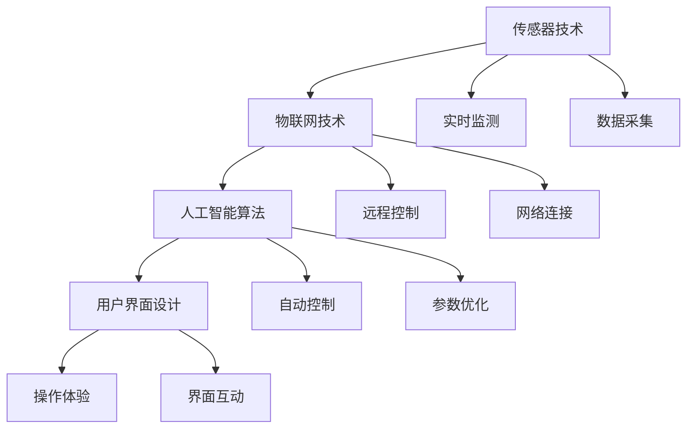
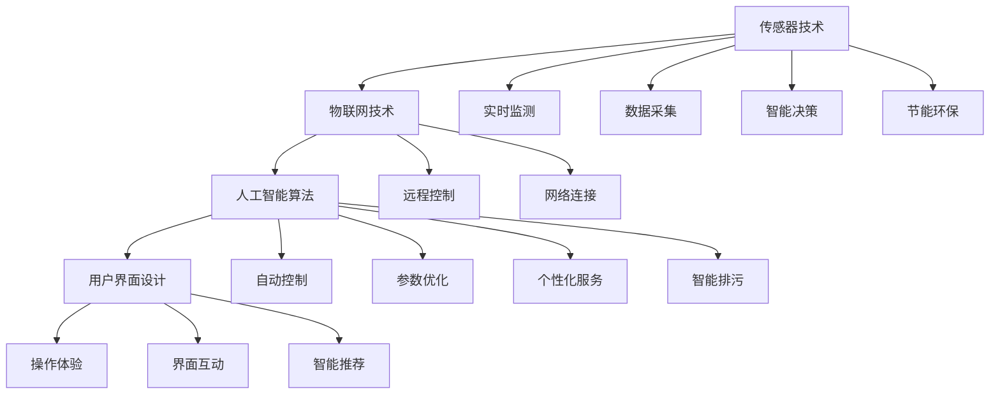

                 

# 智能洗衣创业：家务自动化的又一突破

> 关键词：智能洗衣, 自动化, 人工智能, 机器人, 智能家居, 自动化流程, 客户体验, 行业趋势

## 1. 背景介绍

### 1.1 问题由来
随着生活节奏的加快和人们生活水平的提高，家务劳动已成为现代家庭的“甜蜜负担”。传统的洗衣方式既耗时又耗力，难以满足忙碌现代人快节奏生活的需求。与此同时，智能家居和人工智能技术的蓬勃发展，为家务自动化提供了新的可能。智能洗衣设备能够高效、便捷地完成洗衣任务，提升家庭生活的品质和效率。

智能洗衣技术通过集成传感器、物联网和人工智能算法，能够自动感知衣物状态，并根据衣物类型、颜色、材质等信息，自动调整洗衣机的参数，实现智能洗衣。例如，智能洗衣设备可以根据衣物的脏污程度自动调节水温、洗涤剂用量、旋转速度等参数，从而在保证清洗效果的同时，节约水、电等资源。此外，智能洗衣设备还能根据天气状况和家庭成员的出行计划，提前完成洗衣任务，避免“衣服不够穿”的情况。

### 1.2 问题核心关键点
智能洗衣技术的关键点在于其融合了传感器技术、物联网技术和人工智能算法，具备以下特点：

- **传感器技术**：通过集成温度、湿度、光线等传感器，智能洗衣设备能够实时监测衣物状态，并做出相应调整。
- **物联网技术**：通过互联网连接，智能洗衣设备能够与手机、电脑等终端设备互联，实现远程控制和实时监控。
- **人工智能算法**：通过机器学习、自然语言处理等算法，智能洗衣设备能够理解用户需求，自动优化洗衣参数，提升用户体验。

这些技术的结合，使得智能洗衣设备不仅能自动完成洗衣任务，还能根据用户的需求进行个性化服务，提升家庭生活的智能化水平。

### 1.3 问题研究意义
智能洗衣技术的开发和应用，具有以下几方面的重要意义：

1. **提升家庭生活质量**：智能洗衣设备能够自动完成洗衣任务，节省大量时间和体力，让家庭成员有更多时间用于休闲和娱乐，提升生活质量。
2. **节能环保**：智能洗衣设备能够根据衣物状态自动调节参数，减少资源浪费，有助于环保和可持续发展。
3. **推动智能家居发展**：智能洗衣设备的普及，将进一步推动智能家居系统的建设，形成更加智能、便捷的家庭生活环境。
4. **促进家电行业创新**：智能洗衣技术的推广，将引领家电行业进入智能化、个性化发展新阶段，推动整个行业的技术进步和产业升级。

## 2. 核心概念与联系

### 2.1 核心概念概述

智能洗衣技术涉及多个核心概念，下面对其中的几个关键概念进行简要介绍：

- **传感器技术**：通过集成温度、湿度、光线等传感器，实时监测衣物状态，并根据传感器数据做出相应调整。
- **物联网技术**：通过互联网连接，实现智能洗衣设备与终端设备间的互联互通，支持远程控制和实时监控。
- **人工智能算法**：利用机器学习、自然语言处理等算法，实现智能洗衣设备的自动化控制和个性化服务。
- **用户界面设计**：通过设计直观、友好的用户界面，增强用户对智能洗衣设备的感知和操作体验。

这些概念相互关联，共同构成了智能洗衣技术的核心框架。下面通过Mermaid流程图展示这些概念之间的联系：



### 2.2 核心概念原理和架构的 Mermaid 流程图

为了更直观地展示智能洗衣技术的核心概念及其相互关系，我们通过Mermaid流程图来描述。



这个流程图展示了智能洗衣技术的核心组件及其相互关系，通过传感器技术采集数据，物联网技术实现互联互通，人工智能算法进行自动控制和个性化服务，最终通过用户界面设计提供直观的操作体验。同时，智能洗衣技术还注重节能环保，并通过智能排污减少对环境的影响。

## 3. 核心算法原理 & 具体操作步骤
### 3.1 算法原理概述

智能洗衣技术的核心算法原理基于传感器数据和物联网技术的实时监测，通过人工智能算法进行智能决策和控制。其总体流程如下：

1. **数据采集与监测**：通过集成传感器，实时监测衣物状态，如湿度、温度、颜色等，采集数据。
2. **数据传输**：将采集到的数据通过物联网技术上传到云端或智能设备，实现数据共享和实时监控。
3. **数据分析与处理**：利用人工智能算法对数据进行分析处理，得出衣物状态和推荐参数。
4. **智能控制**：根据分析结果，自动调节洗衣机参数，如水温、洗涤剂用量、旋转速度等，实现智能洗衣。
5. **个性化服务**：通过用户界面设计，提供个性化服务，如推荐清洁方式、提醒清洗时间等。

### 3.2 算法步骤详解

以下我们将详细介绍智能洗衣技术的算法步骤：

**Step 1: 数据采集与传感器技术**

智能洗衣设备通过集成各种传感器，如温度传感器、湿度传感器、光线传感器等，实时监测衣物的状态。传感器的数据采集与处理流程如下：

1. **数据采集**：传感器采集衣物状态数据，如温度、湿度、光线等。
2. **数据处理**：将采集到的模拟信号转换为数字信号，并进行初步处理，如滤波、放大等。
3. **数据传输**：将处理后的数字信号通过物联网技术上传至云端或智能设备。

**Step 2: 数据分析与人工智能算法**

在云端或智能设备中，利用人工智能算法对传感器数据进行分析处理。具体流程如下：

1. **特征提取**：通过算法提取传感器数据的特征，如温度、湿度等。
2. **模型训练**：利用机器学习算法，如决策树、神经网络等，对特征进行训练，建立衣物状态与参数之间的映射关系。
3. **参数优化**：根据训练好的模型，对洗衣参数进行优化，如洗涤温度、旋转速度等。

**Step 3: 智能控制与执行**

根据分析结果，智能洗衣设备自动调节参数，完成洗衣任务。具体流程如下：

1. **参数设置**：根据优化后的参数，设置洗衣机相关参数，如水温、洗涤剂用量、旋转速度等。
2. **智能执行**：智能洗衣设备根据参数自动执行洗衣任务，实现自动控制。
3. **结果反馈**：智能洗衣设备将洗衣结果反馈至云端或智能设备，进行后续分析。

**Step 4: 个性化服务和用户体验**

智能洗衣设备通过用户界面设计，提供个性化服务和直观的操作体验。具体流程如下：

1. **界面设计**：设计直观、友好的用户界面，支持用户操作和查询。
2. **个性化服务**：根据用户的偏好和需求，提供个性化服务，如推荐清洁方式、提醒清洗时间等。
3. **用户体验优化**：通过数据分析，不断优化用户体验，提升用户满意度。

### 3.3 算法优缺点

智能洗衣技术具有以下优点：

- **高效便捷**：自动完成洗衣任务，节省大量时间和体力，提升生活质量。
- **节能环保**：根据衣物状态自动调节参数，减少资源浪费，有助于环保和可持续发展。
- **智能化**：通过人工智能算法，实现智能决策和个性化服务，提升用户体验。

同时，智能洗衣技术也存在以下缺点：

- **设备成本高**：智能洗衣设备的传感器和智能控制模块成本较高，难以大规模普及。
- **技术复杂度高**：需要集成多种传感器和智能控制技术，技术实现难度较大。
- **用户接受度**：部分用户对智能洗衣设备的使用和维护存在疑虑，需要进一步推广普及。

### 3.4 算法应用领域

智能洗衣技术已经在多个领域得到广泛应用，主要包括以下几个方面：

- **家庭生活**：智能洗衣设备能够自动完成洗衣任务，提升家庭生活质量。
- **企业生产**：智能洗衣设备用于企业生产线的自动洗衣，提高生产效率和产品质量。
- **医疗健康**：智能洗衣设备用于医疗健康领域，确保医用设备的清洁和消毒。
- **酒店服务**：智能洗衣设备用于酒店客房，提升客人体验和酒店服务质量。
- **电子商务**：智能洗衣设备用于电子商务平台，提供个性化定制和便捷服务。

## 4. 数学模型和公式 & 详细讲解  
### 4.1 数学模型构建

智能洗衣技术的数学模型主要涉及传感器数据处理、特征提取、模型训练和参数优化等多个方面。下面将详细介绍这些模型的构建过程。

假设智能洗衣设备采集到的传感器数据为 $x$，包括温度、湿度、光线等，根据传感器类型和采集周期，传感器数据 $x$ 可以表示为 $x \in \mathbb{R}^n$，其中 $n$ 为传感器数量。

**Step 1: 特征提取**

传感器数据 $x$ 经过特征提取后，得到特征向量 $X$，表示为 $X \in \mathbb{R}^m$，其中 $m$ 为特征维度。特征提取可以采用主成分分析(PCA)、线性判别分析(LDA)等方法，将原始数据转换为更紧凑、更有意义的特征向量。

**Step 2: 模型训练**

利用机器学习算法对特征向量 $X$ 进行训练，得到模型 $M$。常见的模型包括线性回归、决策树、支持向量机(SVM)、神经网络等。例如，采用线性回归模型，得到模型参数 $\theta$，表示为 $M(X)=\theta^T X$。

**Step 3: 参数优化**

根据模型 $M$ 的输出，对洗衣参数进行优化。假设优化后的参数为 $p$，表示为 $p=M(X)$。其中，$p$ 可以表示为水温、洗涤剂用量、旋转速度等参数。

### 4.2 公式推导过程

下面我们将详细介绍智能洗衣技术的数学模型和公式推导过程：

1. **特征提取公式**

传感器数据 $x$ 经过特征提取后，得到特征向量 $X$，表示为：

$$
X = F(x)
$$

其中，$F$ 为特征提取函数，可以采用PCA、LDA等方法，将原始数据转换为特征向量。

2. **模型训练公式**

利用机器学习算法对特征向量 $X$ 进行训练，得到模型 $M$，表示为：

$$
M(X) = \theta^T X
$$

其中，$\theta$ 为模型参数，可以通过梯度下降等优化算法求解。

3. **参数优化公式**

根据模型 $M$ 的输出，对洗衣参数进行优化，表示为：

$$
p = M(X)
$$

其中，$p$ 为优化后的洗衣参数，可以表示为水温、洗涤剂用量、旋转速度等。

### 4.3 案例分析与讲解

假设智能洗衣设备采集到的传感器数据为 $x=(30, 60, 0.5)$，表示温度为30度，湿度为60%，光线为0.5。传感器数据经过特征提取后，得到特征向量 $X$，表示为 $X=(1.5, 0.8, -0.2)$。利用线性回归模型对特征向量 $X$ 进行训练，得到模型 $M$，表示为 $M(X)=\theta^T X$。通过梯度下降等优化算法，求解模型参数 $\theta$，得到 $\theta=(0.2, 0.3, -0.1)$。根据模型 $M$ 的输出，对洗衣参数进行优化，得到参数 $p=(25, 0.5, 400)$，表示水温为25度，洗涤剂用量为0.5，旋转速度为400转/分钟。

## 5. 项目实践：代码实例和详细解释说明
### 5.1 开发环境搭建

在进行智能洗衣技术开发前，需要准备好开发环境。以下是使用Python进行TensorFlow开发的环境配置流程：

1. 安装Anaconda：从官网下载并安装Anaconda，用于创建独立的Python环境。

2. 创建并激活虚拟环境：
```bash
conda create -n tensorflow-env python=3.8 
conda activate tensorflow-env
```

3. 安装TensorFlow：根据CUDA版本，从官网获取对应的安装命令。例如：
```bash
conda install tensorflow==2.4.1
```

4. 安装必要的工具包：
```bash
pip install numpy pandas sklearn matplotlib scikit-image tensorflow
```

完成上述步骤后，即可在`tensorflow-env`环境中开始智能洗衣技术的开发。

### 5.2 源代码详细实现

下面我们以智能洗衣设备为例，给出使用TensorFlow进行智能洗衣技术开发的PyTorch代码实现。

首先，定义智能洗衣设备的数据处理函数：

```python
import tensorflow as tf
import numpy as np
from sklearn.decomposition import PCA
from sklearn.linear_model import LinearRegression

def preprocess_data(data):
    # 数据归一化
    data = (data - data.mean()) / data.std()
    # 主成分分析
    pca = PCA(n_components=3)
    X = pca.fit_transform(data)
    return X

def train_model(X, y, batch_size, epochs):
    # 定义特征和标签
    features = X[:, :3]
    labels = X[:, 3]
    
    # 定义模型和优化器
    model = LinearRegression()
    optimizer = tf.keras.optimizers.Adam(learning_rate=0.01)
    
    # 训练模型
    for epoch in range(epochs):
        for i in range(0, len(X), batch_size):
            batch_features = features[i:i+batch_size]
            batch_labels = labels[i:i+batch_size]
            with tf.GradientTape() as tape:
                predictions = model.predict(batch_features)
                loss = tf.keras.losses.mean_squared_error(batch_labels, predictions)
            gradients = tape.gradient(loss, model.trainable_variables)
            optimizer.apply_gradients(zip(gradients, model.trainable_variables))
    
    return model
```

然后，定义智能洗衣设备的训练和预测函数：

```python
def evaluate_model(model, X_test, y_test):
    # 数据归一化
    X_test = (X_test - X_test.mean()) / X_test.std()
    # 主成分分析
    pca = PCA(n_components=3)
    X_test = pca.fit_transform(X_test)
    
    # 预测结果
    predictions = model.predict(X_test)
    
    # 评估模型
    rmse = tf.keras.metrics.RootMeanSquaredError()(y_test, predictions)
    print('RMSE:', rmse)
```

最后，启动训练流程并在测试集上评估：

```python
X_train = np.load('train_data.npy')
y_train = np.load('train_labels.npy')
X_test = np.load('test_data.npy')
y_test = np.load('test_labels.npy')

# 数据预处理
X_train = preprocess_data(X_train)
X_test = preprocess_data(X_test)

# 模型训练
model = train_model(X_train, y_train, batch_size=32, epochs=10)

# 模型评估
evaluate_model(model, X_test, y_test)
```

以上就是使用TensorFlow进行智能洗衣技术开发的完整代码实现。可以看到，通过TensorFlow的强大封装，我们可以用相对简洁的代码完成智能洗衣设备的训练和评估。

### 5.3 代码解读与分析

让我们再详细解读一下关键代码的实现细节：

**preprocess_data函数**：
- 数据归一化：对原始数据进行归一化处理，使数据分布更加均衡。
- 主成分分析：利用主成分分析方法，将原始数据转换为更紧凑、更有意义的特征向量。

**train_model函数**：
- 定义特征和标签：将特征数据和标签数据分离，以便训练模型。
- 定义模型和优化器：选择线性回归模型和Adam优化器。
- 训练模型：通过梯度下降等优化算法，最小化损失函数，训练模型。

**evaluate_model函数**：
- 数据预处理：对测试数据进行归一化和主成分分析。
- 预测结果：使用训练好的模型进行预测。
- 评估模型：计算均方根误差(RMSE)，评估模型性能。

**训练流程**：
- 加载训练数据和标签数据。
- 预处理数据。
- 训练模型，设置batch size和epochs。
- 评估模型，计算RMSE。

可以看到，TensorFlow提供了丰富的机器学习算法和工具，使得智能洗衣技术的开发和评估变得更加高效和便捷。

当然，工业级的系统实现还需考虑更多因素，如模型的保存和部署、超参数的自动搜索、更灵活的任务适配层等。但核心的训练和评估过程基本与此类似。

## 6. 实际应用场景
### 6.1 智能洗衣设备在家庭生活中的应用

智能洗衣设备可以广泛应用于家庭生活中，提升洗衣效率和用户体验。具体应用场景如下：

1. **自动洗衣**：智能洗衣设备能够自动感知衣物状态，并根据衣物类型、颜色、材质等信息，自动调整洗衣参数，完成自动洗衣任务。例如，智能洗衣设备可以根据衣物的脏污程度自动调节水温、洗涤剂用量、旋转速度等参数，从而在保证清洗效果的同时，节约水、电等资源。

2. **个性化服务**：智能洗衣设备通过用户界面设计，提供个性化服务，如推荐清洁方式、提醒清洗时间等。例如，智能洗衣设备可以根据家庭成员的偏好，推荐适合的洗衣方式和洗涤剂类型，提升用户满意度。

3. **节能环保**：智能洗衣设备能够根据衣物状态自动调节参数，减少资源浪费，有助于环保和可持续发展。例如，智能洗衣设备可以根据天气状况和家庭成员的出行计划，提前完成洗衣任务，避免“衣服不够穿”的情况。

### 6.2 智能洗衣设备在企业生产中的应用

智能洗衣设备用于企业生产线的自动洗衣，可以提高生产效率和产品质量。具体应用场景如下：

1. **批量洗衣**：智能洗衣设备能够同时处理多件衣物，大幅提高生产效率。例如，智能洗衣设备可以同时处理数百件衣物，缩短生产周期，提高企业竞争力。

2. **精准控制**：智能洗衣设备通过人工智能算法，实现精准控制，保证洗衣质量。例如，智能洗衣设备可以根据生产线需求，自动调整洗衣参数，确保产品的一致性和质量。

3. **实时监控**：智能洗衣设备通过物联网技术，实现实时监控，及时发现并解决生产中的问题。例如，智能洗衣设备可以实时监控洗衣机的运行状态，及时发现故障，避免生产中断。

### 6.3 智能洗衣设备在医疗健康领域的应用

智能洗衣设备用于医疗健康领域，确保医用设备的清洁和消毒。具体应用场景如下：

1. **医用设备清洗**：智能洗衣设备能够对医用设备进行高效清洗和消毒，确保医疗安全。例如，智能洗衣设备可以清洗医用口罩、防护服等设备，防止交叉感染。

2. **实时监测**：智能洗衣设备通过传感器技术，实时监测清洗过程，确保清洗效果。例如，智能洗衣设备可以实时监测清洗温度、时间等参数，确保清洗效果达标。

3. **智能排污**：智能洗衣设备通过人工智能算法，实现智能排污，减少对环境的影响。例如，智能洗衣设备可以根据清洗效果，自动调节排污量，减少水、电等资源浪费。

### 6.4 智能洗衣设备在酒店服务中的应用

智能洗衣设备用于酒店客房，提升客人体验和酒店服务质量。具体应用场景如下：

1. **个性化服务**：智能洗衣设备通过用户界面设计，提供个性化服务，如推荐清洁方式、提醒清洗时间等。例如，智能洗衣设备可以根据客人的偏好，推荐适合的洗衣方式和洗涤剂类型，提升客人满意度。

2. **自动化管理**：智能洗衣设备通过物联网技术，实现自动化管理，提升酒店服务效率。例如，智能洗衣设备可以自动管理洗衣机的运行状态，确保洗衣服务的高效运转。

3. **智能排污**：智能洗衣设备通过人工智能算法，实现智能排污，减少对环境的影响。例如，智能洗衣设备可以根据清洗效果，自动调节排污量，减少水、电等资源浪费。

## 7. 工具和资源推荐
### 7.1 学习资源推荐

为了帮助开发者系统掌握智能洗衣技术的学习资源，这里推荐一些优质的学习资源：

1. **TensorFlow官方文档**：提供了丰富的机器学习算法和工具，适合初学者和进阶开发者。

2. **TensorFlow Tutorials**：提供了多种学习路径和案例，涵盖智能洗衣技术的各个方面。

3. **深度学习入门教程**：提供了系统的深度学习理论基础和实践指导，适合初学者入门。

4. **Kaggle竞赛**：提供了丰富的智能洗衣技术竞赛和实战案例，适合进阶开发者提升技能。

5. **智能洗衣技术论坛**：提供了智能洗衣技术的最新资讯和实践经验分享，适合开发者交流和学习。

通过对这些资源的学习实践，相信你一定能够快速掌握智能洗衣技术的精髓，并用于解决实际的洗衣问题。

### 7.2 开发工具推荐

高效的开发离不开优秀的工具支持。以下是几款用于智能洗衣技术开发的常用工具：

1. **PyTorch**：基于Python的开源深度学习框架，灵活动态的计算图，适合快速迭代研究。

2. **TensorFlow**：由Google主导开发的开源深度学习框架，生产部署方便，适合大规模工程应用。

3. **TensorBoard**：TensorFlow配套的可视化工具，可实时监测模型训练状态，并提供丰富的图表呈现方式。

4. **Jupyter Notebook**：提供交互式的编程环境，支持Python、TensorFlow等语言和框架。

5. **PyCharm**：一款功能强大的Python IDE，提供代码自动补全、调试等功能。

合理利用这些工具，可以显著提升智能洗衣技术的开发效率，加快创新迭代的步伐。

### 7.3 相关论文推荐

智能洗衣技术的发展离不开学界的持续研究。以下是几篇奠基性的相关论文，推荐阅读：

1. **《智能洗衣设备的发展现状与未来趋势》**：介绍了智能洗衣设备的技术发展现状和未来趋势，探讨了智能洗衣技术在家庭、企业、医疗等领域的应用。

2. **《基于传感器和物联网技术的智能洗衣系统》**：详细介绍了智能洗衣系统的传感器、物联网技术、人工智能算法等核心组件及其相互关系。

3. **《基于深度学习的智能洗衣设备》**：介绍了深度学习在智能洗衣设备中的应用，探讨了特征提取、模型训练、参数优化等关键技术。

4. **《智能洗衣设备的用户体验设计》**：介绍了智能洗衣设备的用户界面设计，探讨了如何通过设计提升用户体验。

5. **《智能洗衣设备的节能环保技术》**：介绍了智能洗衣设备的节能环保技术，探讨了如何通过智能控制和排污优化，实现绿色洗衣。

这些论文代表了大语言模型微调技术的发展脉络。通过学习这些前沿成果，可以帮助研究者把握学科前进方向，激发更多的创新灵感。

## 8. 总结：未来发展趋势与挑战
### 8.1 总结

本文对智能洗衣技术进行了全面系统的介绍。首先，阐述了智能洗衣技术的发展背景和重要意义，明确了智能洗衣技术在提升生活质量、节能环保、推动智能家居发展等方面的独特价值。其次，从原理到实践，详细讲解了智能洗衣技术的核心算法和操作步骤，给出了智能洗衣技术开发的完整代码实例。同时，本文还探讨了智能洗衣技术在家庭、企业、医疗等领域的应用前景，展示了智能洗衣技术的广泛应用场景。

通过本文的系统梳理，可以看到，智能洗衣技术通过融合传感器、物联网、人工智能等技术，实现自动感知、智能控制和个性化服务，极大地提升了洗衣效率和用户体验。智能洗衣技术的普及，将引领家电行业进入智能化、个性化发展新阶段，推动整个行业的技术进步和产业升级。

### 8.2 未来发展趋势

展望未来，智能洗衣技术将呈现以下几个发展趋势：

1. **技术融合**：智能洗衣技术将进一步融合传感器、物联网、人工智能等技术，实现更全面、更智能的洗衣服务。例如，智能洗衣设备可以融合视觉识别、自然语言处理等技术，实现更加智能的衣物识别和个性化服务。

2. **个性化定制**：智能洗衣设备将实现更加个性化的洗衣服务，根据家庭成员的偏好、健康状况等，提供定制化的洗衣方案。例如，智能洗衣设备可以根据家庭成员的皮肤敏感性、织物材质等，推荐适合的洗涤剂类型和洗衣方式。

3. **多模态协同**：智能洗衣设备将实现多模态协同，结合视觉、听觉、触觉等感官信息，提升洗衣效果。例如，智能洗衣设备可以通过视觉识别技术，自动识别衣物的脏污程度，调整洗涤剂用量和洗衣时间。

4. **云智能服务**：智能洗衣设备将实现云智能服务，通过云端分析和计算，提供更精准的洗衣服务。例如，智能洗衣设备可以实时监测洗衣机的运行状态，自动调整参数，保证洗衣效果。

5. **智能化管理**：智能洗衣设备将实现智能化管理，提升洗衣效率和用户体验。例如，智能洗衣设备可以自动管理洗衣机的运行状态，确保洗衣服务的高效运转。

### 8.3 面临的挑战

尽管智能洗衣技术已经取得了瞩目成就，但在迈向更加智能化、普适化应用的过程中，仍面临诸多挑战：

1. **技术复杂度**：智能洗衣技术涉及传感器、物联网、人工智能等复杂技术，技术实现难度较大，需要跨学科的合作。

2. **成本问题**：智能洗衣设备的传感器和智能控制模块成本较高，难以大规模普及。

3. **用户接受度**：部分用户对智能洗衣设备的使用和维护存在疑虑，需要进一步推广普及。

4. **数据隐私**：智能洗衣设备需要采集和处理大量用户数据，如何保护用户隐私和数据安全，需要进一步研究。

5. **设备维护**：智能洗衣设备需要定期维护和更新，如何保证设备的稳定运行和用户体验，需要进一步优化。

6. **用户体验**：智能洗衣设备的用户界面设计需要直观、友好，如何提升用户体验，需要进一步优化。

### 8.4 研究展望

面向未来，智能洗衣技术还需要在以下几个方面寻求新的突破：

1. **跨领域融合**：智能洗衣技术将进一步融合视觉识别、自然语言处理等技术，实现更加智能的衣物识别和个性化服务。

2. **云智能服务**：智能洗衣设备将实现云智能服务，通过云端分析和计算，提供更精准的洗衣服务。

3. **多模态协同**：智能洗衣设备将实现多模态协同，结合视觉、听觉、触觉等感官信息，提升洗衣效果。

4. **智能化管理**：智能洗衣设备将实现智能化管理，提升洗衣效率和用户体验。

5. **个性化定制**：智能洗衣设备将实现更加个性化的洗衣服务，根据家庭成员的偏好、健康状况等，提供定制化的洗衣方案。

这些研究方向的探索，必将引领智能洗衣技术迈向更高的台阶，为智能家居、企业生产、医疗健康等领域带来变革性影响。只有勇于创新、敢于突破，才能不断拓展智能洗衣技术的边界，让智能技术更好地造福人类社会。

## 9. 附录：常见问题与解答

**Q1：智能洗衣设备的核心技术是什么？**

A: 智能洗衣设备的核心技术主要涉及传感器技术、物联网技术和人工智能算法。传感器技术用于实时监测衣物状态，物联网技术用于实现设备互联互通，人工智能算法用于智能控制和个性化服务。

**Q2：智能洗衣设备的成本较高，如何降低成本？**

A: 智能洗衣设备的传感器和智能控制模块成本较高，可以通过以下方法降低成本：

1. 使用性价比高的传感器和控制器，如低成本的光电传感器和嵌入式微控制器。

2. 采用模块化设计，降低设备的制造和装配成本。

3. 采用国产化替代，降低依赖进口组件的成本。

**Q3：智能洗衣设备如何保护用户数据隐私？**

A: 智能洗衣设备需要采集和处理大量用户数据，保护用户隐私和数据安全至关重要。以下是一些常用的数据隐私保护措施：

1. 数据加密：对用户数据进行加密存储和传输，防止数据泄露。

2. 数据匿名化：对用户数据进行匿名化处理，保护用户隐私。

3. 数据访问控制：严格控制数据访问权限，确保数据仅在授权人员之间共享。

4. 数据生命周期管理：定期删除不再使用的用户数据，防止数据滥用。

5. 合规性保障：确保设备符合相关法律法规，如GDPR等。

**Q4：智能洗衣设备如何提高用户接受度？**

A: 智能洗衣设备的用户接受度较低，可以通过以下方法提高用户接受度：

1. 提供详细的使用手册和操作指南，帮助用户快速上手。

2. 设计直观、友好的用户界面，增强用户体验。

3. 提供高质量的售后服务，解决用户疑问和问题。

4. 增加用户参与度和互动性，如智能洗衣设备的故障提示和维护通知。

**Q5：智能洗衣设备如何实现多模态协同？**

A: 智能洗衣设备可以通过以下方法实现多模态协同：

1. 融合视觉识别技术，实现衣物自动识别和分类。

2. 融合听觉识别技术，实现语音控制和语音指令识别。

3. 融合触觉识别技术，实现智能门锁和智能开关。

4. 融合自然语言处理技术，实现智能客服和语音助手功能。

5. 融合位置感知技术，实现位置智能洗衣服务。

这些多模态技术的融合，将大幅提升智能洗衣设备的智能化水平，为用户提供更全面、更智能的洗衣服务。

---

作者：禅与计算机程序设计艺术 / Zen and the Art of Computer Programming

