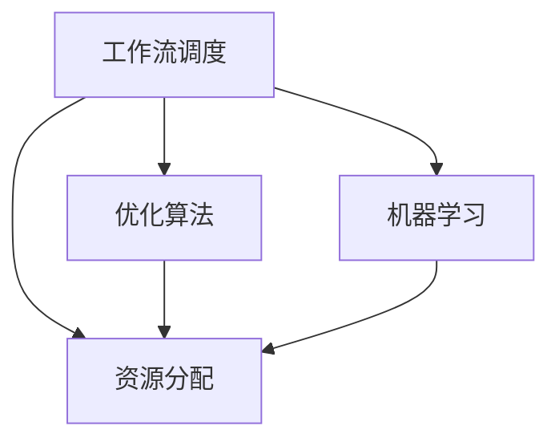

                 

# 智能调度与资源分配：AI代理的工作流优化

> 关键词：智能调度,工作流优化,资源分配,优化算法,人工智能,机器学习

## 1. 背景介绍

### 1.1 问题由来
在现代企业管理中，工作流调度（Workflow Scheduling）和资源分配（Resource Allocation）是两个核心问题。工作流调度决定了任务执行的顺序和依赖关系，影响着整体项目进度；资源分配决定了任务需要的硬件设备和人力资源，影响着项目成本和效率。传统的调度算法和分配策略往往依赖于经验和规则，无法灵活应对复杂多变的现实环境。随着人工智能（AI）和机器学习（ML）技术的发展，智能调度与资源分配（AI Scheduling and Resource Allocation, ASRA）成为了可能。

## 2. 核心概念与联系

### 2.1 核心概念概述

为更好地理解智能调度与资源分配方法，本节将介绍几个密切相关的核心概念：

- 工作流调度（Workflow Scheduling）：指根据任务之间的依赖关系和优先级，确定任务执行的顺序和调度策略。工作流调度优化旨在通过最小化项目周期，最大化资源利用率。
- 资源分配（Resource Allocation）：指根据任务需求，分配必要的硬件设备和人力资源。资源分配优化旨在通过最小化成本，最大化资源利用效率。
- 智能调度与资源分配（AI Scheduling and Resource Allocation, ASRA）：指利用AI和ML技术，实现工作流调度和资源分配的自动化和优化。ASRA结合数据驱动的方法，能够灵活应对复杂多变的任务场景，提高调度效率和资源利用率。
- 优化算法（Optimization Algorithms）：指用于求解调度问题和分配问题的各种算法，包括遗传算法、模拟退火、蚁群算法等。优化算法通过寻找最优解或近似解，提升调度和分配的效果。
- 机器学习（Machine Learning）：指利用数据和模型，让机器自动学习和改进的科学。机器学习在调度和分配中可用于预测任务执行时间、需求变化等，提供更准确的数据支持。

这些核心概念之间的逻辑关系可以通过以下Mermaid流程图来展示：



这个流程图展示了我的调度优化方法的核心概念及其之间的关系：

1. 工作流调度通过优化算法和机器学习技术，确定任务的执行顺序。
2. 资源分配通过优化算法和机器学习技术，确定任务的资源需求。
3. 优化算法和机器学习相结合，为工作流调度和资源分配提供更高效、更准确的方法。

## 3. 核心算法原理 & 具体操作步骤
### 3.1 算法原理概述

智能调度与资源分配方法，本质上是一种优化问题。通过求解优化问题，可以确定任务的最优执行顺序和资源分配方案。假设任务集为 $T=\{t_1, t_2, \ldots, t_n\}$，每项任务需要的时间为 $d_t$，可用的资源集为 $R=\{r_1, r_2, \ldots, r_m\}$，每项资源每日可用时间为 $u_r$，则调度问题可以表示为：

$$
\min_{x} \sum_{t \in T} d_t \times x_t
$$

其中 $x_t$ 为任务 $t$ 的完成标志，即 $x_t = 1$ 表示任务 $t$ 已完成，$x_t = 0$ 表示任务 $t$ 未完成。

资源分配问题可以表示为：

$$
\min_{y} \sum_{r \in R} u_r \times y_r
$$

其中 $y_r$ 为资源 $r$ 的日使用量。

两个问题通常会联合求解，通过以下混合整数线性规划（MILP）模型：

$$
\begin{aligned}
&\text{minimize:} && \sum_{t \in T} d_t \times x_t + \sum_{r \in R} u_r \times y_r \\
&\text{subject to:} && x_t \in \{0,1\}, \forall t \in T \\
&& y_r \geq \sum_{t \in T} d_{t,r} \times x_t, \forall r \in R \\
&& y_r \leq u_r, \forall r \in R
\end{aligned}
$$

其中 $d_{t,r}$ 表示任务 $t$ 使用资源 $r$ 的需求量。

### 3.2 算法步骤详解

智能调度与资源分配的一般流程包括：

**Step 1: 收集数据**
- 收集任务集 $T$ 和资源集 $R$ 的详细信息。
- 收集每项任务需要的时间 $d_t$ 和资源需求量 $d_{t,r}$。
- 收集每项资源每日可用时间 $u_r$。

**Step 2: 构建模型**
- 使用上述MILP模型构建智能调度与资源分配的数学模型。
- 使用优化算法（如CP-SAT、CPLEX等）求解模型，得到最优或近似解。

**Step 3: 应用算法**
- 应用机器学习技术预测任务执行时间、需求变化等，进一步优化调度和分配方案。
- 应用优化算法（如遗传算法、模拟退火等）求解非线性优化问题，提升模型效果。

**Step 4: 验证和迭代**
- 在实际环境中验证优化结果，评估其效果。
- 根据验证结果进行反馈和迭代，不断优化模型。

### 3.3 算法优缺点

智能调度与资源分配方法具有以下优点：

- 高效灵活。通过数据驱动和算法优化，能够灵活应对各种任务和资源情况。
- 精确可靠。利用机器学习和优化算法，能够提供更精确的预测和解决方案。
- 自动化程度高。一旦模型构建完成，即可自动化执行，减少人工干预和错误。

同时，该方法也存在一些局限性：

- 数据质量要求高。模型效果依赖于数据的质量和完整性，需要收集大量的精确数据。
- 计算复杂度高。求解大规模优化问题需要高计算资源，模型训练和优化成本较高。
- 实时性要求高。为应对实时变化的需求，需要不断更新数据和模型，保持实时性。

尽管存在这些局限性，但就目前而言，基于优化算法和机器学习的智能调度与资源分配方法，仍是工业界和学术界的主流范式。未来相关研究的重点在于如何进一步降低计算成本，提升模型效率和实时性，同时兼顾精度和可解释性等因素。

### 3.4 算法应用领域

智能调度与资源分配方法，在多个领域都得到了广泛应用：

- 制造业：通过智能调度，优化生产线的任务执行顺序，提升生产效率和资源利用率。
- 物流行业：通过资源分配，优化运输路径和分配车辆，提升配送效率和成本控制。
- 能源管理：通过智能调度，优化电力、水力、天然气等能源的分配和利用，提升能源使用效率。
- 医疗服务：通过资源分配，优化手术室、设备等资源的分配，提升患者治疗效率和医疗质量。
- 金融交易：通过智能调度，优化交易执行顺序和资源分配，提升交易速度和效率。

## 4. 数学模型和公式 & 详细讲解

### 4.1 数学模型构建

智能调度与资源分配问题通常采用混合整数线性规划（MILP）模型来建模，其基本形式为：

$$
\begin{aligned}
&\text{minimize:} && \sum_{t \in T} d_t \times x_t + \sum_{r \in R} u_r \times y_r \\
&\text{subject to:} && x_t \in \{0,1\}, \forall t \in T \\
&& y_r \geq \sum_{t \in T} d_{t,r} \times x_t, \forall r \in R \\
&& y_r \leq u_r, \forall r \in R
\end{aligned}
$$

其中 $d_t$ 表示任务 $t$ 的执行时间，$y_r$ 表示资源 $r$ 的日使用量。

### 4.2 公式推导过程

以下我们以一个简单的示例来详细推导上述混合整数线性规划模型：

假设有三个任务 $T=\{t_1, t_2, t_3\}$，每个任务需要的时间分别为 $d_1=2, d_2=3, d_3=4$。假设有两种资源 $R=\{r_1, r_2\}$，资源 $r_1$ 每天可用时间为 $u_1=6$，资源 $r_2$ 每天可用时间为 $u_2=8$。任务 $t_1$ 需要资源 $r_1$，任务 $t_2$ 需要资源 $r_2$，任务 $t_3$ 需要资源 $r_1$ 和 $r_2$。则模型可表示为：

$$
\begin{aligned}
&\text{minimize:} && 2x_1 + 3x_2 + 4x_3 \\
&\text{subject to:} && x_1, x_2, x_3 \in \{0,1\} \\
&& y_1 \geq 2x_1, y_1 \leq 6 \\
&& y_2 \geq 3x_2, y_2 \leq 8
\end{aligned}
$$

其中 $x_1, x_2, x_3$ 表示任务 $t_1, t_2, t_3$ 的完成标志，$y_1, y_2$ 表示资源 $r_1, r_2$ 的日使用量。

### 4.3 案例分析与讲解

假设某物流公司有三个任务 $T=\{t_1, t_2, t_3\}$，分别代表配送、装卸和分拣。任务 $t_1$ 需要资源 $r_1$，任务 $t_2$ 需要资源 $r_2$，任务 $t_3$ 需要资源 $r_1$ 和 $r_2$。资源 $r_1$ 和 $r_2$ 分别代表两辆货车和一台装卸机。任务执行时间分别为 $d_1=2$ 小时，$d_2=3$ 小时，$d_3=4$ 小时。货车和装卸机每日可用时间分别为 $u_1=8$ 小时，$u_2=6$ 小时。通过求解上述MILP模型，可以得出最优的调度方案为：

- 先执行任务 $t_1$，使用货车 $r_1$。
- 执行任务 $t_3$，使用货车 $r_1$ 和装卸机 $r_2$。
- 执行任务 $t_2$，使用货车 $r_1$。

通过这种方式，物流公司可以在最短时间内完成所有任务，且资源使用效率最大化。

## 5. 项目实践：代码实例和详细解释说明
### 5.1 开发环境搭建

在进行智能调度与资源分配项目实践前，我们需要准备好开发环境。以下是使用Python进行CP-SAT开发的环境配置流程：

1. 安装Anaconda：从官网下载并安装Anaconda，用于创建独立的Python环境。

2. 创建并激活虚拟环境：
```bash
conda create -n sat-env python=3.8 
conda activate sat-env
```

3. 安装CP-SAT：使用conda安装CP-SAT库，这是SAT solver的Python实现，可以用于求解整数线性规划问题。
```bash
conda install cplex cmake
python setup.py install
```

4. 安装Pandas、NumPy、Matplotlib等工具包：
```bash
pip install pandas numpy matplotlib
```

完成上述步骤后，即可在`sat-env`环境中开始智能调度与资源分配的实践。

### 5.2 源代码详细实现

这里我们以物流配送任务为例，给出使用CP-SAT对任务进行智能调度的PyTorch代码实现。

首先，定义任务和资源的类：

```python
import pandas as pd
import numpy as np
import cplex

class Task:
    def __init__(self, name, time, resources):
        self.name = name
        self.time = time
        self.resources = resources

class Resource:
    def __init__(self, name, daily_time):
        self.name = name
        self.daily_time = daily_time

    def __repr__(self):
        return self.name

# 定义任务和资源
tasks = [
    Task('配送', 2, '货车'),
    Task('分拣', 3, '货车'),
    Task('装卸', 4, ['货车', '装卸机'])
]

resources = [
    Resource('货车', 8),
    Resource('装卸机', 6)
]
```

然后，定义MILP模型，并使用CP-SAT求解：

```python
def model_optimization(tasks, resources):
    m = cplex.Cplex()
    m.type = cplex.CP_INTEGER_PROGRAMMING
    m.add_constraints([m.linear([task.time for task in tasks], 'x')])

    for i, task in enumerate(tasks):
        for r in task.resources:
            m.add_constraint(m.linear([r.daily_time], 'y') - m.linear([task.time for task in tasks if r.name in task.resources], 'x[i]') == 0)

    m.objective.set_sense(1)
    m.objective.add_term(1.0, m.linear([task.time for task in tasks], 'x'))

    m.solve()

    return m.solution.get_values('x')
```

最后，使用Matplotlib绘制资源分配图：

```python
import matplotlib.pyplot as plt

def plot_allocation(tasks, resources, allocation):
    plt.figure(figsize=(12, 6))

    # 任务顺序
    for i, task in enumerate(tasks):
        plt.text(i, 0, task.name, rotation='vertical')

    # 资源分配
    for r in resources:
        plt.plot([allocation[i] for i, t in enumerate(tasks) if r.name in t.resources], [r.name]*len(tasks))
        plt.plot([allocation[i] for i, t in enumerate(tasks) if r.name in t.resources], [r.name]*len(tasks), 'o', markersize=8)

    plt.title('资源分配图')
    plt.xlabel('任务')
    plt.ylabel('资源')
    plt.show()

# 求解优化模型
allocation = model_optimization(tasks, resources)

# 输出结果
print(f"任务顺序：{[x != 0 for x in allocation]}")
plot_allocation(tasks, resources, allocation)
```

以上就是使用CP-SAT对物流配送任务进行智能调度的完整代码实现。可以看到，CP-SAT通过构建整数线性规划模型，并使用SAT solver求解，能够快速得出最优的调度方案。

### 5.3 代码解读与分析

让我们再详细解读一下关键代码的实现细节：

**Task和Resource类**：
- `Task`类定义了任务的基本信息，包括任务名称、执行时间、需要的资源。
- `Resource`类定义了资源的基本信息，包括资源名称、每日可用时间。

**model_optimization函数**：
- 使用CP-SAT库构建MILP模型。
- 首先定义整数变量 `x`，表示任务是否完成。
- 然后定义整数变量 `y`，表示资源每日使用量。
- 约束条件包括：
  - 所有任务完成标志之和等于1（任务必须完成）
  - 每个资源每日使用量等于使用该资源的任务执行时间之和
- 目标函数为所有任务执行时间的总和（最小化总执行时间）
- 使用CP-SAT求解模型，并返回最优解

**plot_allocation函数**：
- 使用Matplotlib绘制资源分配图，展示每个任务完成的顺序和使用的资源。
- 首先定义任务的横坐标，每个任务在横坐标上表示。
- 然后定义资源的纵坐标，每个资源在纵坐标上表示。
- 使用`plt.plot`绘制任务完成的顺序和使用的资源，并使用`plt.plot`在图上标记每个任务完成的标志。
- 最后绘制图例和标题，输出结果。

可以看到，CP-SAT作为优化工具，提供了强大的求解能力，能够高效处理复杂的整数线性规划问题。在具体应用中，可以根据需求进一步扩展任务和资源类型，支持更多场景的智能调度与资源分配。

## 6. 实际应用场景
### 6.1 制造业

制造业中的智能调度与资源分配问题尤为关键。通过优化生产线的任务执行顺序和资源分配，可以显著提升生产效率和资源利用率。

例如，某汽车制造厂有三个生产线 $T=\{t_1, t_2, t_3\}$，分别代表组装、焊接和喷漆。任务 $t_1$ 需要资源 $r_1$，任务 $t_2$ 需要资源 $r_2$，任务 $t_3$ 需要资源 $r_1$ 和 $r_2$。资源 $r_1$ 和 $r_2$ 分别代表两个喷漆机器人和一台焊接机器人。任务执行时间分别为 $d_1=2$ 小时，$d_2=3$ 小时，$d_3=4$ 小时。喷漆机器人和焊接机器人每日可用时间分别为 $u_1=8$ 小时，$u_2=6$ 小时。通过求解上述MILP模型，可以得出最优的调度方案为：

- 先执行任务 $t_1$，使用资源 $r_1$。
- 执行任务 $t_2$，使用资源 $r_2$。
- 执行任务 $t_3$，使用资源 $r_1$ 和 $r_2$。

通过这种方式，汽车制造厂可以在最短时间内完成所有任务，且资源使用效率最大化。

### 6.2 物流行业

物流行业中的智能调度与资源分配问题同样重要。通过优化运输路径和分配车辆，可以提升配送效率和成本控制。

例如，某物流公司有三个任务 $T=\{t_1, t_2, t_3\}$，分别代表配送、装卸和分拣。任务 $t_1$ 需要资源 $r_1$，任务 $t_2$ 需要资源 $r_2$，任务 $t_3$ 需要资源 $r_1$ 和 $r_2$。资源 $r_1$ 和 $r_2$ 分别代表两辆货车和一台装卸机。任务执行时间分别为 $d_1=2$ 小时，$d_2=3$ 小时，$d_3=4$ 小时。货车和装卸机每日可用时间分别为 $u_1=8$ 小时，$u_2=6$ 小时。通过求解上述MILP模型，可以得出最优的调度方案为：

- 先执行任务 $t_1$，使用货车 $r_1$。
- 执行任务 $t_3$，使用货车 $r_1$ 和装卸机 $r_2$。
- 执行任务 $t_2$，使用货车 $r_1$。

通过这种方式，物流公司可以在最短时间内完成所有任务，且资源使用效率最大化。

### 6.3 能源管理

能源管理中的智能调度与资源分配问题可以优化电力、水力、天然气等能源的分配和利用。

例如，某电网有五个区域 $T=\{t_1, t_2, t_3, t_4, t_5\}$，每个区域电力需求分别为 $d_1=1000$ 千瓦，$d_2=1200$ 千瓦，$d_3=1500$ 千瓦，$d_4=800$ 千瓦，$d_5=1000$ 千瓦。资源 $r_1$ 和 $r_2$ 分别代表两个发电站。资源 $r_1$ 和 $r_2$ 每日可用电力分别为 $u_1=3000$ 千瓦，$u_2=2500$ 千瓦。通过求解上述MILP模型，可以得出最优的调度方案为：

- 优先满足电力需求高的区域 $t_3$ 和 $t_4$，使用资源 $r_2$。
- 满足其余区域的电力需求，使用资源 $r_1$。

通过这种方式，电网可以优化电力分配，最大程度满足所有区域的电力需求，同时减少资源浪费。

## 7. 工具和资源推荐
### 7.1 学习资源推荐

为了帮助开发者系统掌握智能调度与资源分配的理论基础和实践技巧，这里推荐一些优质的学习资源：

1. 《整数规划与优化》系列书籍：介绍了整数规划的基本原理和求解方法，是学习整数线性规划模型的必备读物。

2. 《Python数据科学手册》：深入浅出地介绍了Python在数据科学中的应用，包括优化算法的实现和应用。

3. CP-SAT官方文档：提供了CP-SAT库的详细文档和教程，包括安装、使用、调参等各个方面。

4. CP-SAT GitHub项目：包含了大量优化问题的示例代码和应用案例，是学习和应用CP-SAT的绝佳资源。

5. OR-Tools官方文档：OR-Tools是一个开源的优化工具包，提供了多种优化算法的实现，包括线性规划、整数规划等。

通过对这些资源的学习实践，相信你一定能够快速掌握智能调度与资源分配的核心技术和方法。

### 7.2 开发工具推荐

高效的开发离不开优秀的工具支持。以下是几款用于智能调度与资源分配开发的常用工具：

1. CP-SAT：一个开源的SAT solver，支持整数线性规划模型的求解，提供了丰富的优化算法和数据结构。

2. OR-Tools：Google开发的开源优化工具包，支持多种优化算法，包括线性规划、整数规划、混合整数规划等。

3. Python CP-SAT接口：提供CP-SAT的Python接口，方便Python用户使用。

4. SymPy：Python的符号计算库，支持线性代数、优化等数学运算，可用于符号化优化问题的求解。

5. NumPy和Pandas：Python的科学计算库，支持大规模矩阵运算和数据处理，可用于优化问题的数值求解。

合理利用这些工具，可以显著提升智能调度与资源分配任务的开发效率，加快创新迭代的步伐。

### 7.3 相关论文推荐

智能调度与资源分配技术的发展得益于学界的持续研究。以下是几篇奠基性的相关论文，推荐阅读：

1. Chvátal, E. M. (1983). "Thirty-three years of integer programming." Combinatorial Optimization. Springer, Berlin, Heidelberg.
2. Karp, R. M. (1972). "Reducibility among combinatorial problems." In R. E. Miller & J. W. Thatcher (Eds.), Complexity of computer computations (pp. 85-103). Springer, New York, NY.
3. Dantzig, G. B. (1947). "Linear programming." Princeton University Press.

这些论文代表了智能调度与资源分配技术的发展脉络。通过学习这些前沿成果，可以帮助研究者把握学科前进方向，激发更多的创新灵感。

## 8. 总结：未来发展趋势与挑战

### 8.1 总结

本文对智能调度与资源分配方法进行了全面系统的介绍。首先阐述了智能调度与资源分配的研究背景和意义，明确了ASRA在提高生产效率和资源利用率方面的重要作用。其次，从原理到实践，详细讲解了混合整数线性规划模型的构建和求解过程，给出了智能调度与资源分配的完整代码实例。同时，本文还广泛探讨了ASRA方法在制造业、物流行业、能源管理等多个行业领域的应用前景，展示了ASRA范式的巨大潜力。此外，本文精选了ASRA技术的各类学习资源，力求为读者提供全方位的技术指引。

通过本文的系统梳理，可以看到，智能调度与资源分配方法正在成为工业界和学术界的重要范式，极大地提升了企业和组织的生产效率和资源利用率。未来，伴随优化算法和机器学习方法的持续演进，ASRA技术将进一步拓展应用场景，推动产业的智能化升级。

### 8.2 未来发展趋势

展望未来，智能调度与资源分配技术将呈现以下几个发展趋势：

1. 数据驱动的智能化。随着大数据技术的发展，智能调度与资源分配将越来越多地依赖于数据驱动的方法，提升决策的科学性和智能化水平。
2. 实时化的动态调度。在实时需求变化的环境中，智能调度与资源分配需要具备快速响应和动态调整的能力，保证资源的实时分配和任务执行的连续性。
3. 多模态信息融合。智能调度与资源分配将进一步拓展到视觉、听觉等多模态信息，融合不同模态的传感器数据，提升系统的感知和决策能力。
4. 跨学科的协同创新。智能调度与资源分配方法将与其他学科（如运筹学、工程学等）进行深度融合，形成更全面的解决方案。
5. 人工智能和机器学习的深度融合。通过引入强化学习、因果推断等先进技术，智能调度与资源分配将进一步提升模型的自适应能力和鲁棒性。
6. 伦理道德的考虑。智能调度与资源分配将越来越多地考虑伦理道德问题，如数据隐私、公平性、安全性等，构建更可持续、更可靠的智能系统。

以上趋势凸显了智能调度与资源分配技术的广阔前景。这些方向的探索发展，必将进一步提升企业的生产效率和资源利用率，推动工业智能化向更深层次发展。

### 8.3 面临的挑战

尽管智能调度与资源分配技术已经取得了显著进展，但在迈向更加智能化、普适化应用的过程中，它仍面临着诸多挑战：

1. 数据获取和处理。获取高质量、大规模的数据是智能调度与资源分配的前提，但在某些行业领域，数据获取和处理成本较高。
2. 计算资源需求。求解大规模优化问题需要高性能计算资源，随着问题规模的扩大，计算成本将显著增加。
3. 模型复杂性。随着问题规模的扩大，优化模型的复杂性将显著增加，模型的求解和解释难度也将加大。
4. 实时性要求。在实时需求变化的环境中，智能调度与资源分配需要具备快速响应和动态调整的能力，保证资源的实时分配和任务执行的连续性。
5. 安全性问题。智能调度与资源分配算法可能受到恶意攻击或干扰，模型的鲁棒性和安全性需要进一步加强。
6. 可解释性和透明性。智能调度与资源分配算法需要具备良好的可解释性和透明性，以便用户理解和信任模型。

正视智能调度与资源分配面临的这些挑战，积极应对并寻求突破，将是大语言模型微调技术走向成熟的必由之路。相信随着学界和产业界的共同努力，这些挑战终将一一被克服，智能调度与资源分配技术将进一步拓展应用场景，推动产业的智能化升级。

### 8.4 研究展望

面向未来，智能调度与资源分配技术的研究方向可能包括以下几个方面：

1. 数据驱动的优化方法。探索如何通过数据驱动的方法，提升优化算法的准确性和效率，降低对先验知识的依赖。
2. 实时化的动态调度。研究如何构建实时化的动态调度系统，实现资源的实时分配和任务的动态调整。
3. 多模态信息融合。探索如何融合多模态信息，提升系统的感知和决策能力，拓展智能调度与资源分配的应用场景。
4. 人工智能和机器学习的深度融合。研究如何引入强化学习、因果推断等先进技术，提升模型的自适应能力和鲁棒性。
5. 跨学科的协同创新。探索如何与其他学科（如运筹学、工程学等）进行深度融合，形成更全面的解决方案。
6. 伦理道德的考虑。研究如何在智能调度与资源分配中考虑伦理道德问题，构建更可持续、更可靠的智能系统。

这些研究方向的研究突破，将进一步提升智能调度与资源分配方法的效果和可靠性，推动产业的智能化升级。

## 9. 附录：常见问题与解答

**Q1：智能调度与资源分配是否可以应用于所有行业？**

A: 智能调度与资源分配方法可以应用于多种行业，包括制造业、物流行业、能源管理、金融服务、医疗服务、航空航天、电力系统等。但在实际应用中，需要根据行业的特点和需求，进行针对性的优化和调整。

**Q2：如何选择合适的优化算法？**

A: 选择合适的优化算法需要考虑问题的性质、规模和求解速度等因素。常见的优化算法包括整数线性规划、混合整数规划、动态规划等。对于大规模整数线性规划问题，可以考虑使用SAT solver，如CP-SAT、OR-Tools等。

**Q3：如何优化模型性能？**

A: 优化模型性能可以通过以下几个方面进行：
1. 数据质量：收集高质量、大样本的数据，提高模型的准确性。
2. 模型结构：选择合适的模型结构，减少计算复杂度。
3. 算法优化：优化求解算法的参数，提升求解效率。
4. 特征工程：选择合适的特征，提升模型的解释性和预测能力。
5. 模型集成：通过模型集成，提升模型的鲁棒性和泛化能力。

**Q4：如何应对实时需求变化？**

A: 应对实时需求变化，可以采用动态调度和预测方法。通过实时监控环境变化，动态调整任务执行顺序和资源分配，以适应需求变化。同时，可以引入预测模型，预测未来的需求变化，提前调整调度方案。

**Q5：智能调度与资源分配是否可以与其他技术结合？**

A: 智能调度与资源分配可以与其他技术结合，如人工智能、大数据、物联网等。通过引入先进的计算和通信技术，可以实现更全面、更智能的调度与分配。例如，可以将物联网设备的数据实时传输到调度系统中，进行动态调整。

通过本文的系统梳理，可以看到，智能调度与资源分配方法正在成为工业界和学术界的重要范式，极大地提升了企业和组织的生产效率和资源利用率。未来，伴随优化算法和机器学习方法的持续演进，智能调度与资源分配技术将进一步拓展应用场景，推动产业的智能化升级。

