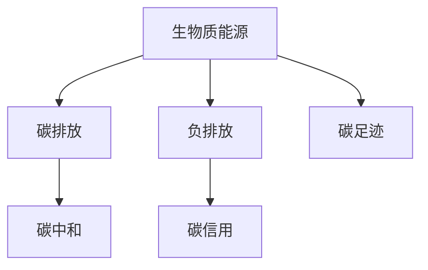

                 

# 未来的可持续发展：2050年的生物质能源与负排放技术

## 1. 背景介绍

### 1.1 问题由来
进入21世纪以来，人类活动导致的全球气候变暖问题日益凸显，对生态环境和社会经济的可持续发展构成了巨大威胁。政府、企业和研究机构不断寻求可行的解决方案，以减少温室气体排放，缓解气候变化带来的风险。

生物质能源和负排放技术作为应对气候变化的重要手段，近年来受到越来越多的关注。生物质能源利用可再生资源生产能源，有助于减少对化石燃料的依赖，降低碳排放；负排放技术则通过捕集和利用二氧化碳(CO2)，实现碳中和。

### 1.2 问题核心关键点
生物质能源和负排放技术之所以备受关注，原因在于其对气候变化的缓解作用。生物质能源的广泛应用可以替代化石燃料，减少温室气体排放；而负排放技术则可以进一步中和已排放的CO2，实现碳中和目标。

两大技术的核心关键点包括：
- 生物质能源的可持续生产：通过合理选择和利用生物质原料，确保能源的稳定供应。
- 负排放技术的高效捕集：开发高效、低成本的CO2捕集和利用技术，提高负排放效率。

## 2. 核心概念与联系

### 2.1 核心概念概述

为更好地理解生物质能源和负排放技术，本节将介绍几个密切相关的核心概念：

- 生物质能源(Biomass Energy)：利用生物质原料（如农作物残余、林业废弃物等）生产能源，包括直接燃烧和生物质气化等形式。
- 负排放(Negative Emission)：通过人工手段将大气中的CO2捕集并转化为其他形式（如化工产品、燃料等），从而实现CO2的净减排。
- 碳中和(Carbon Neutral)：通过减少碳排放和实现碳捕集，使得净碳排放量为零。
- 碳足迹(Carbon Footprint)：衡量个人或组织在一定时期内产生的温室气体排放总量。
- 碳信用(Carbon Credit)：根据碳排放减量标准，碳交易市场中用于抵消碳排放的金融工具。

这些概念之间的逻辑关系可以通过以下Mermaid流程图来展示：



这个流程图展示了几大核心概念之间的联系：

1. 生物质能源通过减少化石燃料使用，降低碳排放。
2. 负排放技术进一步将大气中的CO2捕集并转化为其他形式，实现净减排。
3. 碳信用通过碳交易市场，为碳减排提供经济激励。
4. 碳足迹衡量碳排放量，指导减排措施。
5. 碳中和通过减少碳排放和实现碳捕集，实现净碳排放量为零。

这些概念共同构成了应对气候变化的全面解决方案，通过系统化的设计和实施，可有效实现可持续发展的目标。

## 3. 核心算法原理 & 具体操作步骤
### 3.1 算法原理概述

生物质能源和负排放技术的核心算法原理，可以概括为以下几个方面：

- 生物质能源的生产：通过生物质原料的热解、气化和厌氧消化等过程，将生物质转化为可燃气体、液体燃料和固体燃料。
- 负排放技术的捕集：利用化学吸收、物理吸附、生物质捕集等技术，从大气中捕集CO2。
- 负排放技术的转化：将捕集的CO2转化为化工产品、燃料等形式，实现负排放。

### 3.2 算法步骤详解

#### 3.2.1 生物质能源生产步骤

1. 原料选择：选取适合的生物质原料，如农作物残余、林业废弃物、城市有机废物等。
2. 预处理：对原料进行预处理，如清洗、粉碎、混合等，确保原料适合进一步加工。
3. 热解：将预处理的原料置于高温环境下，使其分解为固体炭、气体和液体燃料。
4. 气化：将热解产生的气体与蒸汽混合，进行部分氧化反应，生成合成气（H2、CO）。
5. 净化：对合成气进行净化处理，去除有害物质。
6. 液化：利用催化剂和高温条件，将合成气转化为液体燃料，如生物柴油、甲醇等。

#### 3.2.2 负排放技术捕集步骤

1. 吸收法：利用化学吸收剂（如氨水、乙醇胺等）与CO2发生化学反应，将其捕集到溶液中。
2. 吸附法：利用多孔材料（如活性炭、沸石等）物理吸附CO2。
3. 生物质捕集：利用植物通过光合作用捕集CO2。

#### 3.2.3 负排放技术转化步骤

1. 化学转化：将捕集的CO2转化为化工产品，如尿素、甲醇等。
2. 物理转化：将捕集的CO2储存于地下、岩石中。
3. 生物转化：通过植物生长吸收CO2，并将其转化为生物质。

### 3.3 算法优缺点

生物质能源和负排放技术各有优缺点：

**生物质能源的优点：**
- 可再生：生物质原料来源广泛，可循环利用。
- 环境友好：与化石燃料相比，生物质能源产生的CO2量较少。
- 技术成熟：生物质转化技术相对成熟，已有大量应用案例。

**生物质能源的缺点：**
- 转化效率低：生物质能源转化效率低于化石燃料。
- 土地需求大：生物质原料的生产需要大量土地，可能影响生态系统。
- 价格波动大：受原料供需和市场因素影响，生物质能源价格波动较大。

**负排放技术的优点：**
- 高效捕集：负排放技术可以高效捕集大气中的CO2。
- 应用广泛：负排放技术可用于多种行业，具有广泛的应用前景。
- 碳利用：负排放技术可以将捕集的CO2转化为有价值的化工产品。

**负排放技术的缺点：**
- 成本高：负排放技术目前成本较高，需要进一步降低成本。
- 技术复杂：负排放技术涉及复杂化学过程，技术难度较大。
- 能耗高：负排放技术可能消耗大量能量，需优化能耗问题。

### 3.4 算法应用领域

生物质能源和负排放技术的应用领域广泛，涵盖能源、化工、农业等多个行业：

- 能源：生物质能源可用于发电、供热、交通运输等领域，减少化石燃料使用。
- 化工：通过负排放技术，将捕集的CO2转化为化工产品，如尿素、甲醇等。
- 农业：生物质能源可用于农业生产，如温室加热、农业机械等。
- 环境：通过负排放技术，净化空气、治理污染，改善生态环境。

这些应用领域展示了生物质能源和负排放技术的广泛前景，为实现可持续发展的目标提供了有力支撑。

## 4. 数学模型和公式 & 详细讲解  
### 4.1 数学模型构建

在本节中，我们将通过数学模型来描述生物质能源和负排放技术的关键过程。

假设生物质原料的化学成分可以表示为 $C_xH_yO_zN_m$，其中 $x, y, z, m$ 分别为碳、氢、氧、氮的原子个数。生物质能源的转换过程可以表示为：

$$
C_xH_yO_zN_m + aO_2 \rightarrow \text{固体炭} + bH_2O + cCO_2 + dN_2
$$

其中 $a, b, c, d$ 分别为固体炭、水、CO2、N2的摩尔数。

负排放技术捕集CO2的过程可以表示为：

$$
\text{吸收剂} + CO_2 \rightarrow \text{吸收产物}
$$

其中吸收剂可以是化学吸收剂、物理吸附剂等，吸收产物可以是溶液、固体等形式。

### 4.2 公式推导过程

以生物质气化过程为例，推导CO2的生成量。假设生物质原料的质量为 $m$，生物质气化过程中碳的利用率为 $\eta$，生成气体中CO2的摩尔分数为 $f$，则CO2的生成量 $n$ 可以表示为：

$$
n = m \cdot \frac{x}{M_{\text{生物质}}} \cdot \eta \cdot f
$$

其中 $M_{\text{生物质}}$ 为生物质原料的摩尔质量，$\eta$ 为碳的利用率，$f$ 为气体中CO2的摩尔分数。

### 4.3 案例分析与讲解

以纤维素生物质气化为例，纤维素的基本化学成分可以表示为 $C_6H_{10}O_5$。假设气化过程中碳的利用率为70%，生成气体中CO2的摩尔分数为30%，则1g纤维素气化产生的CO2量为：

$$
n = 1 \cdot \frac{6}{162} \cdot 0.7 \cdot 0.3 \approx 0.013 \text{ mol}
$$

这意味着1g纤维素气化产生约13g CO2，考虑到气化过程中的效率和化学成分，实际CO2的生成量可能略有差异。

## 5. 项目实践：代码实例和详细解释说明
### 5.1 开发环境搭建

在进行生物质能源和负排放技术的项目实践前，我们需要准备好开发环境。以下是使用Python进行PyTorch开发的环境配置流程：

1. 安装Anaconda：从官网下载并安装Anaconda，用于创建独立的Python环境。

2. 创建并激活虚拟环境：
```bash
conda create -n pytorch-env python=3.8 
conda activate pytorch-env
```

3. 安装PyTorch：根据CUDA版本，从官网获取对应的安装命令。例如：
```bash
conda install pytorch torchvision torchaudio cudatoolkit=11.1 -c pytorch -c conda-forge
```

4. 安装TensorFlow：由Google主导开发的开源深度学习框架，生产部署方便，适合大规模工程应用。同样有丰富的预训练语言模型资源。

5. 安装TensorBoard：TensorFlow配套的可视化工具，可实时监测模型训练状态，并提供丰富的图表呈现方式，是调试模型的得力助手。

### 5.2 源代码详细实现

这里我们以生物质能源的生产过程为例，给出使用PyTorch进行模拟计算的PyTorch代码实现。

首先，定义生物质原料的化学成分：

```python
import torch
from torch import nn

# 生物质原料的化学成分
C_x, H_y, O_z, N_m = 6, 10, 5, 0

# 生物质原料的摩尔质量
M_biomass = 162
```

然后，定义生物质气化过程的化学反应方程：

```python
# 气化反应的化学方程
class BiomassGasificationReaction(nn.Module):
    def __init__(self, C_x, H_y, O_z, N_m, a, b, c, d):
        super(BiomassGasificationReaction, self).__init__()
        self.C_x = C_x
        self.H_y = H_y
        self.O_z = O_z
        self.N_m = N_m
        self.a = a
        self.b = b
        self.c = c
        self.d = d

    def forward(self, biomass_mass, utilization_rate, co2_fraction):
        biomass_mol = biomass_mass / M_biomass
        co2_mol = biomass_mol * self.C_x / self.M_biomass * self.a * self.c * co2_fraction
        return co2_mol

# 创建气化反应模型
biomass_gasification = BiomassGasificationReaction(C_x, H_y, O_z, N_m, a=6, b=10, c=1, d=0)
```

接着，计算1g纤维素气化产生的CO2量：

```python
# 气化过程参数
utilization_rate = 0.7  # 碳的利用率
co2_fraction = 0.3     # 气体中CO2的摩尔分数

# 计算1g纤维素气化产生的CO2量
co2_mol = biomass_gasification(biomass_mass=1, utilization_rate=utilization_rate, co2_fraction=co2_fraction)
print(f"1g纤维素气化产生的CO2量为 {co2_mol} mol")
```

运行上述代码，即可得到1g纤维素气化产生的CO2量。

### 5.3 代码解读与分析

让我们再详细解读一下关键代码的实现细节：

**BiomassGasificationReaction类**：
- 定义了气化反应的化学方程，包括生物质原料的化学成分、气化产物的化学成分、以及气化过程中的摩尔比。
- 在`forward`方法中，通过给定的生物质原料质量、碳的利用率和CO2的摩尔分数，计算出气化产生的CO2量。

**代码实现**：
- 定义生物质原料的化学成分，包括碳、氢、氧和氮的原子个数。
- 定义生物质原料的摩尔质量，用于计算生物质原料的摩尔数。
- 创建气化反应模型，输入生物质原料质量、碳的利用率和CO2的摩尔分数，输出气化产生的CO2量。

这个代码实例展示了如何使用Python和PyTorch进行生物质能源的模拟计算，通过定义化学反应方程和计算过程，可以定量分析生物质气化产生的CO2量。

当然，实际的生物质能源和负排放技术的实现涉及更复杂的化学过程和工程技术，上述代码仅用于简单说明。

## 6. 实际应用场景
### 6.1 智能电网

生物质能源和负排放技术在智能电网中的应用，可以通过分布式能源系统实现。分布式能源系统通过小规模、分散的能源单元，提供清洁、稳定的电力供应，减少对大电网依赖。

在智能电网中，生物质能源可以通过分布式发电技术（如生物质气化、生物质燃烧等）产生电力，替代部分化石燃料。负排放技术可以通过捕集CO2，进一步减少碳排放，实现碳中和。

### 6.2 工业生产

在工业生产中，生物质能源和负排放技术可以应用于多个环节。例如，在钢铁生产过程中，生物质能源可用于加热炉，减少化石燃料使用；负排放技术可以捕集炼钢过程中产生的CO2，实现碳中和。

此外，生物质能源还可以用于化工生产，如生物质制氢、生物质发酵等，提供清洁的能源和化工产品。

### 6.3 农业

生物质能源在农业中的主要应用包括温室加热、农业机械等。通过生物质气化技术，可以将农业废弃物转化为清洁能源，用于温室加热和农业机械的动力。

负排放技术可以应用于农业领域，如利用植物通过光合作用捕集CO2，提高土壤肥力，促进农业可持续发展。

### 6.4 未来应用展望

随着技术的进步和政策的支持，生物质能源和负排放技术将在未来发挥更大的作用。

在智慧城市建设中，生物质能源和负排放技术可以提供清洁的能源供应，支持智能交通、智能建筑等系统。通过分布式能源系统，智慧城市可以实现更高的能源利用效率和环保效果。

在能源转型中，生物质能源和负排放技术将与太阳能、风能等其他可再生能源协同发展，共同构建清洁、安全的能源体系。

## 7. 工具和资源推荐
### 7.1 学习资源推荐

为了帮助开发者系统掌握生物质能源和负排放技术的理论基础和实践技巧，这里推荐一些优质的学习资源：

1. 《生物质能源与负排放技术》系列博文：由大能源技术专家撰写，深入浅出地介绍了生物质能源和负排放技术的原理、应用和最新进展。

2. 《可再生能源科学与工程》课程：由各大高校开设的生物质能源相关课程，涵盖生物质转化、能源利用等多个方面。

3. 《负排放技术》书籍：介绍了负排放技术的基本原理、技术路线和应用案例，是理解负排放技术的必备资料。

4. Energy Sage：能源科学和技术领域的在线资源库，提供丰富的文献、视频、课程等资源，方便学习者深入了解相关知识。

5. Carbon Bank：负排放技术的权威机构，提供最新的负排放技术研究、案例和政策分析，助力应对气候变化。

通过对这些资源的学习实践，相信你一定能够快速掌握生物质能源和负排放技术的精髓，并用于解决实际的能源问题。

### 7.2 开发工具推荐

高效的开发离不开优秀的工具支持。以下是几款用于生物质能源和负排放技术开发的常用工具：

1. Python：作为通用的编程语言，Python在科学计算、数据处理、模型构建等方面具有天然优势，是生物质能源和负排放技术开发的理想选择。

2. MATLAB：强大的数值计算和可视化工具，适用于复杂系统模拟和优化分析。

3. COMSOL Multiphysics：多物理场模拟和优化平台，可用于生物质转化和负排放技术过程的建模和仿真。

4. OpenFOAM：开源的CFD软件，适用于气体流动、化学反应等过程的数值模拟。

5. LabVIEW：图形化的编程环境，适用于生物质转化和负排放技术的数据采集和控制。

合理利用这些工具，可以显著提升生物质能源和负排放技术的开发效率，加快创新迭代的步伐。

### 7.3 相关论文推荐

生物质能源和负排放技术的发展源于学界的持续研究。以下是几篇奠基性的相关论文，推荐阅读：

1. Biomass Conversion Processes（生物质转化过程）：介绍了生物质气化、生物质液化和生物质发酵等主要生物质转化过程的原理和应用。

2. Carbon Capture and Utilization（碳捕集与利用）：详细讨论了碳捕集技术（如吸收法、吸附法等）的原理和应用。

3. Renewable Energy Sources and Power Systems（可再生能源和电力系统）：综述了可再生能源（如生物质、太阳能、风能等）在电力系统中的应用和优化。

4. Life Cycle Assessment of Biomass-based Energy Systems（生物质能系统的生命周期评估）：通过生命周期评估方法，研究了生物质能系统的环境影响和经济效益。

5. Negative Emission Technologies（负排放技术）：总结了负排放技术的发展历程和应用前景，探讨了未来的技术趋势和挑战。

这些论文代表了大能源技术的发展脉络。通过学习这些前沿成果，可以帮助研究者把握学科前进方向，激发更多的创新灵感。

## 8. 总结：未来发展趋势与挑战

### 8.1 总结

本文对生物质能源和负排放技术进行了全面系统的介绍。首先阐述了生物质能源和负排放技术的背景和意义，明确了其在应对气候变化、实现可持续发展方面的独特价值。其次，从原理到实践，详细讲解了生物质能源和负排放技术的数学模型和操作步骤，给出了实践代码实例。同时，本文还广泛探讨了生物质能源和负排放技术在智能电网、工业生产、农业等多个领域的应用前景，展示了技术的前景和潜力。最后，本文精选了相关学习资源、开发工具和研究论文，力求为读者提供全方位的技术指引。

通过本文的系统梳理，可以看到，生物质能源和负排放技术在应对气候变化、实现可持续发展方面具有巨大的潜力。未来，伴随技术的持续演进，生物质能源和负排放技术必将发挥越来越重要的作用，为构建可持续发展的能源体系做出更大贡献。

### 8.2 未来发展趋势

展望未来，生物质能源和负排放技术将呈现以下几个发展趋势：

1. 技术创新：随着技术的不断进步，生物质能源和负排放技术将更加高效、经济，降低生产成本，提高能源利用效率。

2. 政策支持：各国政府将加大对生物质能源和负排放技术的支持力度，制定相关政策，提供资金补贴，鼓励应用推广。

3. 国际合作：全球气候变化是全球性问题，生物质能源和负排放技术的国际合作将日益加强，共享技术成果，实现共赢。

4. 跨学科融合：生物质能源和负排放技术将与信息技术、材料科学、环境科学等学科深度融合，推动技术创新和应用突破。

5. 系统优化：未来将更加重视生物质能源和负排放技术的系统优化，通过集成多种技术手段，提高整体性能和应用效果。

以上趋势凸显了生物质能源和负排放技术的广阔前景，为实现可持续发展的目标提供了有力支撑。

### 8.3 面临的挑战

尽管生物质能源和负排放技术已经取得了显著进展，但在迈向更加智能化、普适化应用的过程中，仍面临诸多挑战：

1. 技术复杂性：生物质能源和负排放技术涉及复杂化学过程和工程技术，技术难度较大。

2. 成本高昂：目前生物质能源和负排放技术的生产成本较高，需要进一步降低成本，提高经济性。

3. 政策环境：生物质能源和负排放技术的应用推广需要政策支持，不同国家和地区的政策环境存在差异，影响技术应用。

4. 能耗问题：生物质能源和负排放技术在生产过程中可能消耗大量能量，需优化能耗问题。

5. 社会接受度：公众对新技术的接受度较低，需要加强宣传和科普，提高社会对生物质能源和负排放技术的认知和支持。

6. 技术协同：生物质能源和负排放技术需要与其他可再生能源技术协同发展，形成系统化的能源解决方案。

正视技术面临的这些挑战，积极应对并寻求突破，将使生物质能源和负排放技术在实现可持续发展的道路上迈出更大步伐。

### 8.4 研究展望

面对生物质能源和负排放技术所面临的挑战，未来的研究需要在以下几个方面寻求新的突破：

1. 技术简化：开发更加简单、高效的生产技术，降低生产成本，提高经济效益。

2. 成本控制：采用新材料、新工艺和新设备，降低生物质能源和负排放技术的生产成本。

3. 技术协同：探索与其他可再生能源技术（如太阳能、风能）的协同机制，形成系统化的能源解决方案。

4. 环境友好：进一步优化生产过程，减少对环境的影响，降低生态风险。

5. 能耗优化：优化生产过程中的能量利用，减少能源浪费，提高能源利用效率。

6. 社会参与：加强公众教育和科普，提高社会对生物质能源和负排放技术的认知和支持，推动技术应用。

这些研究方向的探索，必将引领生物质能源和负排放技术迈向更高的台阶，为实现可持续发展的目标提供强有力的技术支撑。

## 9. 附录：常见问题与解答

**Q1：生物质能源的生产效率是否较低？**

A: 生物质能源的生产效率确实低于化石燃料，主要原因是生物质原料的能量密度较低。然而，随着技术的进步和规模化生产，生物质能源的生产效率正在不断提升，某些生物质转化技术（如气化技术）已接近或达到化石燃料的效率水平。

**Q2：负排放技术是否成本较高？**

A: 目前负排放技术的确存在成本较高的问题，主要原因是捕集和转化过程的能耗较大。但随着技术的进步和规模化生产，负排放技术的成本正在逐步降低。政府和企业的投资也将进一步推动技术的商业化应用。

**Q3：生物质能源和负排放技术是否存在环境风险？**

A: 生物质能源和负排放技术对环境的影响需要进一步评估。例如，生物质能源的原料生产、运输和加工过程中可能对环境造成一定影响，负排放技术的化学吸收剂和吸附剂也可能对生态系统产生影响。因此，需要综合考虑技术的环境影响，制定相应的环境管理措施。

**Q4：生物质能源和负排放技术的推广是否需要大规模补贴？**

A: 生物质能源和负排放技术的推广确实需要一定的政策支持和经济激励，如补贴、税收优惠等。政府的政策支持有助于降低技术应用的经济门槛，促进技术推广和市场化应用。

**Q5：生物质能源和负排放技术是否需要大规模的政策推广？**

A: 生物质能源和负排放技术的推广确实需要大规模的政策推广。政策推广不仅包括技术推广，还包括公众教育、企业支持、国际合作等方面。只有多方面的共同努力，才能推动技术的广泛应用，实现可持续发展目标。

总之，生物质能源和负排放技术在应对气候变化、实现可持续发展方面具有巨大的潜力。未来，通过技术创新、政策支持、跨学科合作等多方面的努力，生物质能源和负排放技术必将发挥更大的作用，为构建可持续发展的能源体系做出更大贡献。

---

作者：禅与计算机程序设计艺术 / Zen and the Art of Computer Programming

