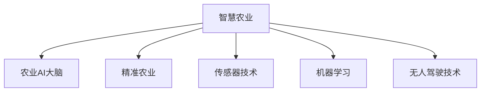

                 

## 1. 背景介绍

随着人工智能（AI）技术的快速进步和普及，智慧农业（Smart Agriculture）正在逐步从概念走向现实。智慧农业通过结合AI、物联网（IoT）、大数据、云计算等先进技术，实现了从种植到收获的各个环节的智能优化和自动化管理。这不仅提高了农业生产的效率和产量，也减少了资源消耗和环境污染，是现代农业发展的重要方向。

### 1.1 问题由来

农业生产的传统模式依赖人力、物力，效率低下，资源利用率不高。尤其是在气候变化、人口增长、耕地减少等全球性问题下，传统农业模式已经难以满足社会需求。AI技术的介入为解决这些挑战提供了新的可能。

### 1.2 问题核心关键点

AI在农业中的应用主要集中在以下几个方面：

- **自动驾驶拖拉机**：通过视觉、激光雷达等传感器，实时监测并规划拖拉机行驶路线，实现精准耕作。
- **智能灌溉系统**：基于土壤湿度、气象数据等，自动调节灌溉量，提高水资源利用效率。
- **作物监测与诊断**：利用无人机和地面传感器，实时监测作物生长状态，通过图像识别、数据分析等技术，进行病虫害预警和营养状况诊断。
- **智能温室管理**：通过传感器和控制设备，实时调节光照、温度、湿度等环境因素，优化作物生长环境。
- **供应链优化**：利用AI进行预测分析，优化物流和库存管理，减少成本和浪费。

### 1.3 问题研究意义

智慧农业的应用不仅提高了农业生产效率，还促进了农业的可持续发展和现代化进程。它有助于实现资源的有效利用，减少对环境的破坏，提高农产品的品质和竞争力。

## 2. 核心概念与联系

### 2.1 核心概念概述

为了更好地理解智慧农业中的AI应用，本节将介绍几个核心概念：

- **智慧农业**：基于AI、IoT、大数据等技术的农业生产方式，实现农业的智能化、自动化管理。
- **农业AI大脑**：指集成了深度学习、计算机视觉、自然语言处理等技术的农业智能系统，具备分析、预测、决策能力。
- **精准农业**：通过数据驱动，实现对农业生产各个环节的精准控制，提高生产效率和产量。
- **传感器技术**：用于实时监测土壤湿度、气候条件、作物生长状态等关键参数的设备。
- **机器学习**：通过数据挖掘和学习，优化农业生产中的决策和预测。
- **无人驾驶技术**：基于AI的自动驾驶技术，用于农业机械如拖拉机、收割机的自主导航。

这些核心概念之间的逻辑关系可以通过以下Mermaid流程图来展示：



这个流程图展示了大语言模型的核心概念及其之间的关系：

1. 智慧农业通过农业AI大脑来实现智能化管理。
2. 精准农业是智慧农业的主要应用方向之一，依赖于农业AI大脑的分析和预测。
3. 传感器技术、机器学习、无人驾驶技术等均为智慧农业和农业AI大脑的关键支撑。

## 3. 核心算法原理 & 具体操作步骤

### 3.1 算法原理概述

智慧农业中的AI应用主要基于机器学习和深度学习技术。这些技术通过大量的数据训练模型，使模型能够从复杂的农业场景中提取有价值的信息，并做出预测和决策。

### 3.2 算法步骤详解

#### 3.2.1 数据收集与预处理

1. **传感器数据收集**：通过各种传感器收集土壤湿度、温度、光照、气象条件等实时数据。
2. **数据整合与清洗**：将来自不同来源的数据整合到一个集中平台上，并进行数据清洗和处理，去除噪声和异常值。
3. **数据标注**：为部分数据添加标签，如作物生长状态、病虫害等，用于模型的监督学习。

#### 3.2.2 模型训练与优化

1. **模型选择**：根据具体问题选择合适的机器学习或深度学习模型，如决策树、随机森林、卷积神经网络（CNN）、循环神经网络（RNN）等。
2. **模型训练**：使用训练数据对模型进行训练，调整模型参数以最小化误差。
3. **模型评估与调优**：在验证数据集上评估模型性能，通过交叉验证、超参数调优等方法提升模型效果。

#### 3.2.3 模型部署与监控

1. **模型部署**：将训练好的模型部署到农业生产现场，通过IoT设备进行实时预测和决策。
2. **模型监控**：实时监控模型性能和预测结果，及时调整模型参数，确保模型在高负载下稳定运行。

### 3.3 算法优缺点

智慧农业中的AI应用具有以下优点：

- **高效性**：大幅提高农业生产效率，减少人力成本。
- **精确性**：通过数据驱动的决策，实现精准农业，提高资源利用效率。
- **可扩展性**：AI技术易于扩展，适用于大范围的农业生产。

同时，该方法也存在一定的局限性：

- **数据依赖**：AI应用效果很大程度上依赖于数据质量，数据收集和标注成本较高。
- **技术门槛**：需要专业知识和技术支持，推广难度较大。
- **成本问题**：初期设备投入和模型训练成本较高，中小农户难以负担。
- **伦理与隐私**：数据收集和使用过程中可能涉及隐私和伦理问题。

### 3.4 算法应用领域

智慧农业中的AI应用覆盖了从种植到收获的各个环节，具体如下：

- **智能灌溉系统**：基于土壤湿度、气象数据等，自动调节灌溉量，提高水资源利用效率。
- **智能温室管理**：通过传感器和控制设备，实时调节光照、温度、湿度等环境因素，优化作物生长环境。
- **智能施肥系统**：通过分析土壤成分和作物需求，自动调节肥料用量，减少肥料浪费和污染。
- **病虫害预测与防治**：利用无人机和地面传感器，实时监测作物生长状态，通过图像识别、数据分析等技术，进行病虫害预警和防治。
- **智能物流与库存管理**：利用AI进行预测分析，优化物流和库存管理，减少成本和浪费。

## 4. 数学模型和公式 & 详细讲解 & 举例说明

### 4.1 数学模型构建

智慧农业中的AI应用通常使用监督学习、无监督学习和强化学习等方法。以智能灌溉系统为例，可以构建以下数学模型：

设 $x = [S_t, T_t, R_t]$ 为土壤湿度、温度、气象条件等输入特征，$y = W_t$ 为灌溉量，其中 $S_t, T_t, R_t, W_t$ 均为时间 $t$ 的函数。

智能灌溉系统的目标是找到一个最优的灌溉策略，使总成本最小化。因此，可以构建以下优化问题：

$$
\min_{W_t} \sum_{t=1}^T c_t W_t
$$

其中 $c_t$ 为时间 $t$ 的灌溉成本函数。

### 4.2 公式推导过程

利用梯度下降法求解上述优化问题，可以得到灌溉量的决策函数：

$$
W_t = \arg\min_{W_t} \sum_{t=1}^T c_t W_t + \frac{\lambda}{2} \|W_t - W_{t-1}\|^2
$$

其中 $\lambda$ 为正则化系数，用于控制决策的平滑性。

### 4.3 案例分析与讲解

假设某农田在不同时间点的土壤湿度、温度、气象条件等输入特征如下：

- 时间 $t=1$ 时，$x=[S_1, T_1, R_1]$，对应的最优灌溉量为 $W_1=20$。
- 时间 $t=2$ 时，$x=[S_2, T_2, R_2]$，最优灌溉量为 $W_2=25$。

利用上述公式，可以得到下一个时间点的最优灌溉量：

$$
W_3 = \arg\min_{W_3} c_1 W_1 + c_2 W_2 + \frac{\lambda}{2} \|W_3 - W_2\|^2
$$

假设 $c_1=10, c_2=15, \lambda=0.5$，通过计算可以得到 $W_3=23$。

## 5. 项目实践：代码实例和详细解释说明

### 5.1 开发环境搭建

在进行智慧农业中的AI应用开发前，我们需要准备好开发环境。以下是使用Python进行智慧农业AI应用的开发环境配置流程：

1. 安装Anaconda：从官网下载并安装Anaconda，用于创建独立的Python环境。

2. 创建并激活虚拟环境：
```bash
conda create -n agriculture-env python=3.8 
conda activate agriculture-env
```

3. 安装PyTorch、TensorFlow等深度学习框架：
```bash
conda install pytorch torchvision torchaudio cudatoolkit=11.1 -c pytorch -c conda-forge
conda install tensorflow
```

4. 安装物联网相关库：
```bash
pip install paho-mqtt
```

5. 安装农业数据处理相关库：
```bash
pip install pandas numpy
```

完成上述步骤后，即可在`agriculture-env`环境中开始智慧农业AI应用的开发。

### 5.2 源代码详细实现

这里我们以智能灌溉系统的开发为例，给出完整的代码实现。

首先，定义灌溉系统的数据处理函数：

```python
import pandas as pd
import numpy as np

def process_data(data_file):
    data = pd.read_csv(data_file)
    # 数据清洗和预处理
    data = data.dropna().reset_index(drop=True)
    # 数据标注
    data['label'] = 0  # 初始标签为0，表示未灌溉
    data.loc[data['temperature'] > 25, 'label'] = 1  # 温度大于25度时灌溉
    return data
```

然后，定义模型训练函数：

```python
from sklearn.ensemble import RandomForestRegressor

def train_model(data):
    # 特征选择
    X = data[['temperature', 'soil_moisture']]
    y = data['label']
    # 模型训练
    model = RandomForestRegressor(n_estimators=100, random_state=42)
    model.fit(X, y)
    return model
```

接着，定义模型预测函数：

```python
def predict(model, data):
    X = pd.DataFrame(data)
    y_pred = model.predict(X)
    return y_pred
```

最后，启动训练流程并在测试集上评估：

```python
data_file = 'irrigation_data.csv'
data = process_data(data_file)
model = train_model(data)
y_pred = predict(model, data)
```

以上就是使用Python进行智能灌溉系统开发的完整代码实现。可以看到，利用简单的数据处理和机器学习技术，即可实现智能灌溉的自动化预测。

### 5.3 代码解读与分析

让我们再详细解读一下关键代码的实现细节：

**process_data函数**：
- 读取数据文件，并进行清洗和标注。
- 使用pandas库进行数据处理，去除缺失值，重置索引。
- 根据温度条件为数据添加标签，表示是否需要灌溉。

**train_model函数**：
- 选择温度和土壤湿度作为特征，灌溉量为标签。
- 使用随机森林模型进行训练，设置100棵树，随机状态为42。
- 返回训练好的模型。

**predict函数**：
- 将数据封装成pandas DataFrame。
- 使用训练好的模型进行预测，返回预测结果。

**训练流程**：
- 定义数据文件路径，读取数据。
- 调用process_data函数进行数据处理和标注。
- 调用train_model函数训练模型。
- 调用predict函数进行预测。

可以看到，智慧农业AI应用的开发流程相对简单，主要集中在数据处理和模型训练上。开发者可以结合实际需求，选择合适的模型和特征，进行微调和优化，以实现更精确的预测和决策。

## 6. 实际应用场景

### 6.1 智慧温室管理

智慧温室管理是智慧农业的重要应用之一。传统的温室管理依赖人工经验，效率低、成本高。而利用AI技术，可以实现对温室环境的精准控制，优化作物生长环境，提高产量和质量。

具体实现上，可以通过传感器实时监测温室内的温度、湿度、光照等参数，使用机器学习模型预测最优的调节策略。例如，可以使用深度学习模型对图像进行识别，判断作物生长状态，并自动调整光照、温度等环境因素。

### 6.2 智能施肥系统

智能施肥系统通过实时监测土壤成分和作物需求，自动调节肥料用量，减少肥料浪费和污染，提高肥料利用效率。该系统可以通过土壤传感器和气象数据，使用机器学习模型预测作物的营养需求，自动控制施肥机的作业。

例如，可以构建一个回归模型，预测不同时间段内作物的氮磷钾需求量，根据预测结果自动调节肥料用量，实现精准施肥。

### 6.3 病虫害预测与防治

病虫害预测与防治是智慧农业中的重要环节。传统的病虫害防治依赖人工经验，难以实时监测和及时预警。而利用AI技术，可以实现对病虫害的实时监测和预警，提高防治效果。

具体实现上，可以通过无人机和地面传感器，实时监测作物生长状态和病虫害情况，使用图像识别和数据分析技术，预测病虫害发生的概率。例如，可以使用卷积神经网络（CNN）对作物叶片进行图像识别，检测病虫害的特征，并自动生成防治方案。

### 6.4 未来应用展望

随着AI技术的不断进步，智慧农业将迎来更多新的应用场景。未来，智慧农业将不仅局限于单个农场的自动化管理，而是向着更大规模、更高效率的方向发展。

1. **智慧农场网络**：多个智慧农场通过物联网设备互联互通，实现数据共享和协同管理，提高整体农业生产的效率。
2. **农业供应链优化**：利用AI进行预测分析，优化物流和库存管理，减少成本和浪费，提高供应链的效率和灵活性。
3. **农业机器人**：使用AI技术实现农业机器人的自动化操作，如无人机喷洒农药、自动驾驶拖拉机等，进一步提高农业生产效率。
4. **农业物联网平台**：构建基于云计算的农业物联网平台，实现对农业生产各个环节的全面监测和管理。

## 7. 工具和资源推荐

### 7.1 学习资源推荐

为了帮助开发者系统掌握智慧农业中的AI应用理论基础和实践技巧，这里推荐一些优质的学习资源：

1. **Coursera《智慧农业与人工智能》课程**：由斯坦福大学开设的课程，介绍了智慧农业中的AI技术应用，涵盖自动驾驶、智能灌溉、智能温室管理等方向。

2. **Udacity《AI农业工程师》纳米学位**：通过项目实践，学习智慧农业中的机器学习、深度学习、计算机视觉等技术。

3. **DeepAgacy**：一个开源的农业AI平台，提供了丰富的模型和工具，帮助开发者快速开发智慧农业应用。

4. **农业物联网开源项目**：如OpenFarm、IoT for Agriculture等，提供了农业物联网设备的接入和数据采集方法，助力智慧农业开发。

5. **AI in Agriculture会议和论文**：定期举办AI农业领域的会议和研讨会，分享最新研究成果和应用案例，推动农业AI技术的进步。

通过对这些资源的学习实践，相信你一定能够快速掌握智慧农业中的AI应用精髓，并用于解决实际的农业问题。

### 7.2 开发工具推荐

高效的开发离不开优秀的工具支持。以下是几款用于智慧农业AI应用开发的常用工具：

1. **PyTorch和TensorFlow**：基于Python的开源深度学习框架，适用于各种AI应用的开发。

2. **OpenFarm和IoT for Agriculture**：农业物联网设备的标准化接口和协议，方便数据采集和设备集成。

3. **TensorBoard和Weights & Biases**：用于模型训练的实验跟踪工具，可以记录和可视化模型训练过程中的各项指标，方便对比和调优。

4. **MATLAB和Simulink**：用于系统设计和仿真，适用于复杂农业机械和设备的建模与测试。

5. **Jupyter Notebook和Google Colab**：在线Jupyter Notebook环境，免费提供GPU/TPU算力，方便开发者快速上手实验最新模型，分享学习笔记。

合理利用这些工具，可以显著提升智慧农业AI应用的开发效率，加快创新迭代的步伐。

### 7.3 相关论文推荐

智慧农业中的AI应用发展迅速，以下几篇论文代表了该领域的研究前沿，推荐阅读：

1. **"Deep Learning for Agriculture"**：斯坦福大学发布的智慧农业白皮书，涵盖了深度学习在智慧农业中的应用。

2. **"Smart Agriculture: A Survey on Techniques, Challenges and Future Directions"**：对智慧农业中的AI技术和应用进行了全面的回顾和展望。

3. **"Precision Agriculture and Smart Farming Technologies: A Review"**：对精准农业和智能农场的最新技术和应用进行了详细分析。

4. **"An Overview of Machine Learning Approaches for Smart Agriculture"**：介绍了机器学习在智慧农业中的应用，包括分类、回归、聚类等方法。

5. **"IoT and Machine Learning in Precision Agriculture: A Survey"**：对物联网和机器学习在精准农业中的应用进行了总结和分析。

这些论文代表了智慧农业中的AI应用的发展脉络，为研究者提供了宝贵的参考。

## 8. 总结：未来发展趋势与挑战

### 8.1 总结

本文对智慧农业中的AI应用进行了全面系统的介绍。首先阐述了智慧农业的应用背景和意义，明确了AI在智慧农业中的重要地位。其次，从原理到实践，详细讲解了AI在智慧农业中的应用方法，给出了智慧农业AI应用的完整代码实例。同时，本文还广泛探讨了智慧农业在农业管理、作物监测、病虫害防治等多个领域的实际应用前景，展示了AI技术在农业中的巨大潜力。

通过本文的系统梳理，可以看到，智慧农业中的AI应用正在成为现代农业的重要推动力，极大地提高了农业生产的效率和质量。未来，伴随AI技术的进一步发展，智慧农业必将在全球范围内得到更广泛的应用，推动农业生产的可持续发展。

### 8.2 未来发展趋势

展望未来，智慧农业中的AI应用将呈现以下几个发展趋势：

1. **智能化水平提升**：随着AI技术的不断进步，智慧农业的智能化水平将进一步提升，实现更精确、更高效的农业生产管理。

2. **大范围应用**：智慧农业技术将从农场延伸到农业供应链的各个环节，实现全面智能化。

3. **数据融合与协同**：不同类型的数据（如气象数据、土壤数据、物联网数据）将实现全面融合，协同优化农业生产。

4. **跨学科整合**：智慧农业中的AI应用将与农学、生态学、经济学等学科深度整合，形成更加系统化的农业知识体系。

5. **可持续性发展**：智慧农业中的AI应用将更加注重环境友好和资源节约，推动农业的可持续性发展。

### 8.3 面临的挑战

尽管智慧农业中的AI应用已经取得了显著成果，但在迈向更加智能化、普适化应用的过程中，它仍面临诸多挑战：

1. **技术普及与接受度**：智慧农业中的AI应用需要高度专业化的技术支持，推广难度较大。如何降低技术门槛，提高农户的接受度，仍是一大挑战。

2. **数据安全与隐私**：智慧农业中的数据采集和存储涉及大量的隐私和敏感信息，如何保障数据安全，防止数据泄露，是一个重要的问题。

3. **设备标准化**：智慧农业中的设备来自不同厂商，接口和协议可能不一致，如何实现设备标准化，构建统一的物联网平台，是技术推广的一大难题。

4. **模型训练与优化**：智慧农业中的模型训练需要大量的数据和计算资源，如何提高模型训练效率，优化模型参数，是一个技术挑战。

5. **环境适应性**：智慧农业中的AI应用需要适应不同的农业环境和作物需求，如何设计通用化的模型和算法，是一个重要的研究方向。

### 8.4 研究展望

面对智慧农业中的AI应用所面临的挑战，未来的研究需要在以下几个方面寻求新的突破：

1. **低成本、易用性**：开发低成本、易用性的智慧农业设备和技术，降低技术门槛，提高农户的接受度和使用意愿。

2. **数据融合与共享**：构建基于区块链的数据融合与共享平台，保障数据安全与隐私，实现数据的全面融合和协同优化。

3. **设备标准化与互操作性**：制定统一的智慧农业设备接口和协议，实现设备的标准化和互操作性，构建统一的物联网平台。

4. **模型压缩与优化**：研究模型压缩与优化技术，减少模型训练和推理的计算资源消耗，提高模型的可部署性和效率。

5. **跨领域整合与协同**：将智慧农业中的AI应用与农学、生态学、经济学等学科深度整合，形成更加系统化的农业知识体系，推动智慧农业的可持续发展。

这些研究方向的探索，将进一步推动智慧农业中的AI应用技术的发展，为农业生产带来新的革命性变化。

## 9. 附录：常见问题与解答

**Q1: 智慧农业中的AI应用是否适用于所有农业场景？**

A: 智慧农业中的AI应用主要适用于规模化、集约化农业场景，如大田作物、蔬菜、水果等。对于小规模、分散的农户，可能需要结合本地化的智慧农业解决方案。

**Q2: 如何降低智慧农业中的数据采集成本？**

A: 可以通过低成本的传感器和设备，如温湿度传感器、土壤传感器、气象站等，降低数据采集成本。同时，利用无人机和地面设备进行数据采集，可以大幅度提高数据采集效率。

**Q3: 智慧农业中的AI应用如何保障数据安全与隐私？**

A: 可以采用数据加密、匿名化处理等技术手段，保障数据的安全性和隐私性。同时，建立严格的数据访问控制机制，限制数据的使用范围和权限。

**Q4: 智慧农业中的AI应用如何提高模型训练效率？**

A: 可以采用模型压缩、分布式训练、混合精度训练等技术，提高模型训练效率。同时，利用预训练模型和迁移学习，减少数据和计算资源的消耗。

**Q5: 智慧农业中的AI应用如何适应不同农业环境？**

A: 可以构建多模态的数据采集和处理系统，适应不同农业环境下的数据特性。同时，使用自适应算法，动态调整模型参数，适应不同的环境需求。

总之，智慧农业中的AI应用具有广阔的前景，但也需要结合实际应用场景，不断优化技术，才能实现更好的效果和应用。只有从数据、算法、工程、业务等多个维度协同发力，才能真正实现智慧农业的可持续发展。

---

作者：禅与计算机程序设计艺术 / Zen and the Art of Computer Programming

