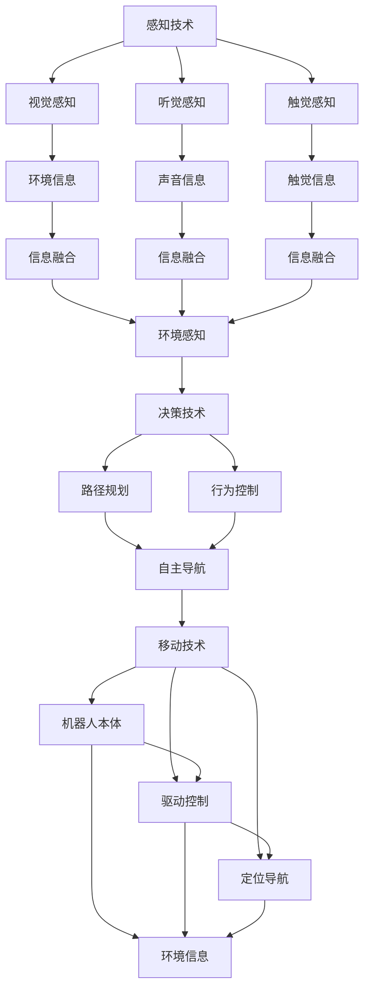

                 

## 1. 背景介绍

### 1.1 问题由来
智慧物业是智慧城市的重要组成部分，它将物联网、大数据、云计算、人工智能等现代信息技术应用到物业管理中，通过智能感知、数据分析、自动化控制等手段，提升物业管理的效率和水平。其中，智能安防机器人作为智慧物业的关键技术之一，通过实时监测、智能巡检、异常检测等功能，极大提升了物业的安全性和管理水平。

随着技术的不断进步和市场需求的增加，智能安防机器人技术得到了快速发展。然而，当前智能安防机器人还存在诸多问题，如感知能力有限、决策鲁棒性差、响应速度慢等，严重制约了其在智慧社区中的应用。

### 1.2 问题核心关键点
要解决当前智能安防机器人存在的问题，需要从以下几个方面入手：
1. 提升感知能力：通过多模态感知融合，增强机器人的视觉、听觉、触觉等多方面的感知能力。
2. 增强决策鲁棒性：引入因果推理、强化学习等技术，提升机器人的决策能力和鲁棒性。
3. 提高响应速度：优化算法和硬件设计，提升机器人的实时响应能力。
4. 增强协作能力：引入分布式计算和协同学习技术，增强机器人之间的协作与协同作业能力。

本文聚焦于智能安防机器人技术的最新进展和未来发展方向，特别是基于深度学习和多模态感知融合的智能安防机器人技术。通过详细讲解智能安防机器人的核心算法和实际应用场景，本文旨在为未来的智慧社区建设提供参考和指导。

## 2. 核心概念与联系

### 2.1 核心概念概述
智能安防机器人是指结合了人工智能技术、传感器技术、移动机器人技术的综合性设备，能够自主完成安防监控、异常检测、应急响应等任务。智能安防机器人的核心技术包括感知技术、决策技术、移动技术等。

- 感知技术：包括视觉感知、听觉感知、触觉感知等，用于获取环境信息和实时监测。
- 决策技术：包括智能决策、路径规划、行为控制等，用于实现自主导航和任务执行。
- 移动技术：包括机器人本体设计、驱动控制、定位导航等，用于实现机器人的自主移动和定位。

这些核心技术通过相互协作，共同实现智能安防机器人的智能感知、自主决策、自主移动等能力，从而提升物业的安全性和管理水平。

### 2.2 核心概念原理和架构的 Mermaid 流程图


## 3. 核心算法原理 & 具体操作步骤

### 3.1 算法原理概述
智能安防机器人的核心算法包括感知融合算法、路径规划算法、行为控制算法等。其中，感知融合算法用于将视觉、听觉、触觉等多模态信息进行融合，提升感知能力；路径规划算法用于生成最优路径，实现自主导航；行为控制算法用于实现任务的自动执行和决策。

### 3.2 算法步骤详解
#### 感知融合算法
感知融合算法包括视觉融合、听觉融合和触觉融合。以视觉融合为例，使用多个摄像头对同一场景进行采集，通过计算几何相似度、空间距离等指标，将多个摄像头采集到的图像进行融合，得到更准确的视觉信息。

#### 路径规划算法
路径规划算法包括A*算法、RRT算法等。以A*算法为例，首先将地图划分为网格，然后通过启发式函数和代价函数计算每一步的代价，最终生成最优路径。

#### 行为控制算法
行为控制算法包括行为树算法、深度强化学习等。以行为树算法为例，将任务分解为多个子任务，每个子任务对应一个行为节点，通过行为树的动态更新，实现任务的自动执行。

### 3.3 算法优缺点
智能安防机器人的核心算法具有以下优点：
- 提升感知能力：通过多模态感知融合，增强了机器人的感知能力，能够更全面地获取环境信息。
- 优化路径规划：通过路径规划算法，能够生成最优路径，实现高效的自主导航。
- 增强行为控制：通过行为控制算法，能够实现任务的自动执行和决策，提升机器人操作的精准度和鲁棒性。

同时，这些算法也存在一些缺点：
- 计算复杂度高：感知融合和路径规划算法通常计算复杂度较高，需要高效的算法和硬件支持。
- 实时性要求高：机器人需要实时处理环境信息和任务指令，对算法的实时性要求较高。
- 泛化能力有限：现有算法往往针对特定场景和任务进行优化，泛化能力有限，难以应对复杂多变的环境。

### 3.4 算法应用领域
智能安防机器人的核心算法可以应用于智慧社区、智能工厂、智慧物流等多个领域，实现自主巡检、异常检测、任务执行等任务。具体应用场景包括：
- 智慧社区：智能安防机器人可以用于小区巡检、异常检测、应急响应等任务。
- 智能工厂：智能安防机器人可以用于生产线巡检、设备维护、品质检测等任务。
- 智慧物流：智能安防机器人可以用于仓库巡检、货物搬运、异常检测等任务。

## 4. 数学模型和公式 & 详细讲解 & 举例说明

### 4.1 数学模型构建
智能安防机器人的核心算法可以建模为以下问题：
1. 感知模型：输入为传感器数据，输出为环境信息。
2. 路径规划模型：输入为地图和目标位置，输出为最优路径。
3. 行为控制模型：输入为任务和环境信息，输出为行为序列。

### 4.2 公式推导过程
以路径规划算法为例，使用A*算法进行建模，步骤如下：
1. 将地图划分为网格，定义每个网格的代价函数。
2. 通过启发式函数计算每一步的代价。
3. 生成最优路径。

### 4.3 案例分析与讲解
以智能安防机器人在智慧社区的应用为例，分析其核心算法在实际应用中的效果。

## 5. 项目实践：代码实例和详细解释说明

### 5.1 开发环境搭建
智能安防机器人的开发环境包括传感器设备、机器人本体、计算设备等。开发环境搭建步骤如下：
1. 搭建传感器设备：安装摄像头、麦克风、触觉传感器等设备，并进行校准和调试。
2. 搭建机器人本体：安装机器人本体和驱动设备，并进行调试和测试。
3. 搭建计算设备：安装计算机设备，并连接传感器和机器人本体。

### 5.2 源代码详细实现
以下是一个使用Python和OpenCV库实现智能安防机器人视觉感知的示例代码：
```python
import cv2
import numpy as np

# 加载摄像头
cap = cv2.VideoCapture(0)

# 初始化可视化窗口
cv2.namedWindow('Fusion Result')

while True:
    # 读取摄像头图像
    ret, frame = cap.read()

    # 使用多个摄像头进行图像采集
    images = []
    for i in range(4):
        image = cv2.resize(frame, (640, 480))
        images.append(image)

    # 将多个摄像头采集到的图像进行融合
    fusion = cv2.merge(images)

    # 显示融合结果
    cv2.imshow('Fusion Result', fusion)

    # 按下Q键退出
    if cv2.waitKey(1) & 0xFF == ord('q'):
        break

# 释放摄像头资源
cap.release()
cv2.destroyAllWindows()
```

### 5.3 代码解读与分析
上述代码实现了一个简单的智能安防机器人视觉感知功能，通过使用OpenCV库，将多个摄像头采集到的图像进行融合，得到更准确的视觉信息。代码中，`cap.read()`用于读取摄像头图像，`cv2.merge()`用于将多个图像进行融合，`cv2.imshow()`用于显示融合结果。

## 6. 实际应用场景
### 6.1 智能巡检
智能安防机器人在智慧社区中的应用之一是智能巡检。通过多模态感知融合和路径规划算法，智能安防机器人可以自主巡检社区内的各个角落，发现异常情况并及时报警。

### 6.2 异常检测
智能安防机器人在智慧社区中的应用还包括异常检测。通过行为控制算法和机器学习技术，智能安防机器人可以实时监测社区内的人员、车辆等活动，识别异常行为并及时报警。

### 6.3 应急响应
智能安防机器人在智慧社区中的应用还包括应急响应。通过路径规划算法和行为控制算法，智能安防机器人可以在紧急情况下快速响应，执行预定的应急任务。

### 6.4 未来应用展望
未来，智能安防机器人的发展方向包括：
- 提升感知能力：通过引入深度学习、多模态感知融合等技术，提升机器人的感知能力。
- 增强决策鲁棒性：通过引入因果推理、强化学习等技术，增强机器人的决策能力和鲁棒性。
- 提高响应速度：通过优化算法和硬件设计，提升机器人的实时响应能力。
- 增强协作能力：通过引入分布式计算和协同学习技术，增强机器人之间的协作与协同作业能力。

## 7. 工具和资源推荐
### 7.1 学习资源推荐
1. 《深度学习与机器人技术》：该书详细介绍了深度学习在机器人领域的应用，包括感知、决策、移动等核心技术。
2. 《机器人学习与控制》：该书介绍了机器人学习与控制的最新进展，涵盖了感知、决策、运动控制等关键技术。
3. Udacity《机器人编程与设计》课程：该课程通过实际项目，系统介绍了机器人编程与设计的各个方面，包括感知、决策、移动等。

### 7.2 开发工具推荐
1. ROS（Robot Operating System）：开源机器人操作系统，提供了丰富的传感器、机器人本体、计算设备等资源。
2. Python：Python语言简单易用，适合机器人开发。
3. OpenCV：计算机视觉库，用于图像处理和融合。

### 7.3 相关论文推荐
1. B. Thrun, W. Burgard, and D. Fox, *Probabilistic Robots*（概率机器人）。
2. A. Zhou, J. Hu, Z. C. Lerman, S. Zhang, and A. Torralba, *Robot Vision: A Survey*（机器人视觉综述）。
3. J. D. Eales, S. M. Beard, and S. Burkhart, *Coordinated Control of Heterogeneous Mobile Robots*（异构移动机器人的协同控制）。

## 8. 总结：未来发展趋势与挑战
### 8.1 研究成果总结
智能安防机器人技术在智慧社区中的应用得到了广泛关注和研究。通过多模态感知融合、路径规划、行为控制等核心算法，智能安防机器人可以自主完成巡检、异常检测、应急响应等任务，极大提升了物业的安全性和管理水平。

### 8.2 未来发展趋势
未来，智能安防机器人技术的发展方向包括：
- 提升感知能力：通过引入深度学习、多模态感知融合等技术，提升机器人的感知能力。
- 增强决策鲁棒性：通过引入因果推理、强化学习等技术，增强机器人的决策能力和鲁棒性。
- 提高响应速度：通过优化算法和硬件设计，提升机器人的实时响应能力。
- 增强协作能力：通过引入分布式计算和协同学习技术，增强机器人之间的协作与协同作业能力。

### 8.3 面临的挑战
智能安防机器人技术在实际应用中还面临以下挑战：
- 计算复杂度高：感知融合和路径规划算法通常计算复杂度较高，需要高效的算法和硬件支持。
- 实时性要求高：机器人需要实时处理环境信息和任务指令，对算法的实时性要求较高。
- 泛化能力有限：现有算法往往针对特定场景和任务进行优化，泛化能力有限，难以应对复杂多变的环境。

### 8.4 研究展望
未来，智能安防机器人技术需要在以下几个方面进行进一步研究：
- 提升感知能力：通过引入深度学习、多模态感知融合等技术，提升机器人的感知能力。
- 增强决策鲁棒性：通过引入因果推理、强化学习等技术，增强机器人的决策能力和鲁棒性。
- 提高响应速度：通过优化算法和硬件设计，提升机器人的实时响应能力。
- 增强协作能力：通过引入分布式计算和协同学习技术，增强机器人之间的协作与协同作业能力。

## 9. 附录：常见问题与解答
**Q1: 如何提升智能安防机器人的感知能力？**

A: 可以通过引入深度学习、多模态感知融合等技术来提升智能安防机器人的感知能力。例如，使用多个摄像头对同一场景进行采集，通过计算几何相似度、空间距离等指标，将多个摄像头采集到的图像进行融合，得到更准确的视觉信息。

**Q2: 如何优化智能安防机器人的路径规划算法？**

A: 可以通过引入A*算法、RRT算法等路径规划算法来优化智能安防机器人的路径规划。例如，使用A*算法生成最优路径，实现高效的自主导航。

**Q3: 如何增强智能安防机器人的决策鲁棒性？**

A: 可以通过引入因果推理、强化学习等技术来增强智能安防机器人的决策鲁棒性。例如，使用因果推理模型预测机器人执行某个行为的结果，增强决策的鲁棒性。

**Q4: 智能安防机器人有哪些实际应用场景？**

A: 智能安防机器人在智慧社区、智能工厂、智慧物流等领域有广泛应用，例如：
- 智慧社区：智能安防机器人可以用于小区巡检、异常检测、应急响应等任务。
- 智能工厂：智能安防机器人可以用于生产线巡检、设备维护、品质检测等任务。
- 智慧物流：智能安防机器人可以用于仓库巡检、货物搬运、异常检测等任务。

**Q5: 智能安防机器人未来发展方向是什么？**

A: 未来，智能安防机器人技术的发展方向包括：
- 提升感知能力：通过引入深度学习、多模态感知融合等技术，提升机器人的感知能力。
- 增强决策鲁棒性：通过引入因果推理、强化学习等技术，增强机器人的决策能力和鲁棒性。
- 提高响应速度：通过优化算法和硬件设计，提升机器人的实时响应能力。
- 增强协作能力：通过引入分布式计算和协同学习技术，增强机器人之间的协作与协同作业能力。

---

作者：禅与计算机程序设计艺术 / Zen and the Art of Computer Programming

