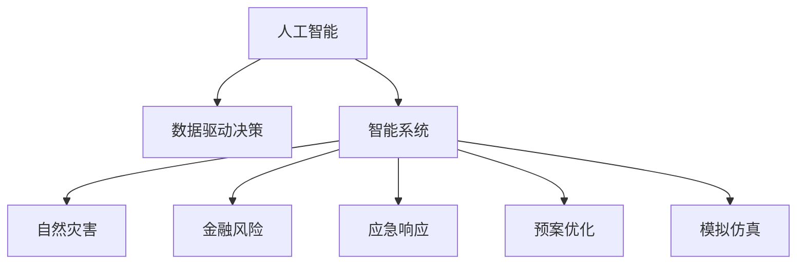

                 

# 未来的灾害预防：2050年的全球风险管理

> 关键词：灾害预防,风险管理,人工智能,智能系统,自然灾害,金融风险,数据驱动决策,应急响应,预案优化,模拟仿真

## 1. 背景介绍

### 1.1 问题由来
21世纪以来，全球自然灾害频发，气候变化加剧了极端天气事件的频度和强度，如飓风、地震、洪水等。同时，金融市场波动和网络安全威胁也在不断增加。这些灾害和风险给人类社会带来了巨大挑战，迫切需要更加有效的预防和管理手段。

在未来，我们希望通过人工智能和大数据技术，构建一套基于风险预测、智能分析和高效应对的全球灾害预防系统，以保障人类社会的安全稳定。

### 1.2 问题核心关键点
未来灾害预防系统的核心关键点包括：
- 数据驱动的灾害预测
- 智能化的风险评估
- 高度集成的应急响应
- 持续优化的预案体系

这些关键点共同构成了未来灾害预防系统的基础，旨在通过技术手段，提升全球灾害预防和风险管理能力。

## 2. 核心概念与联系

### 2.1 核心概念概述

为更好地理解未来灾害预防系统的技术框架，本节将介绍几个密切相关的核心概念：

- **人工智能(AI)与机器学习(ML)**：使用算法和模型从大量数据中提取规律，提高灾害预测和风险评估的准确性。
- **数据驱动决策**：基于实时数据和历史数据，制定科学的灾害应对策略。
- **智能系统**：集成了AI和ML技术，实现灾害预测、风险评估、应急响应的自动化和智能化。
- **自然灾害**：如地震、洪水、飓风等由自然因素引起的灾害。
- **金融风险**：如市场波动、信用风险、网络攻击等由经济因素引起的风险。
- **应急响应**：指在灾害发生后，快速、有效地采取行动，减少灾害损失。
- **预案优化**：通过优化灾备预案，提升灾害应对效率和效果。
- **模拟仿真**：使用计算机模型模拟灾害过程，评估应急响应方案的效果。

这些核心概念之间的逻辑关系可以通过以下Mermaid流程图来展示：



这个流程图展示的核心概念及其之间的关系：

1. 人工智能和大数据为数据驱动决策提供技术支撑。
2. 智能系统将数据驱动决策结果应用到自然灾害和金融风险的预测、评估和应对。
3. 自然灾害和金融风险是智能系统处理的主要对象。
4. 应急响应和预案优化是智能系统的两大核心功能。
5. 模拟仿真为智能系统的决策提供验证和优化工具。

## 3. 核心算法原理 & 具体操作步骤

### 3.1 算法原理概述

未来灾害预防系统基于以下算法原理：

- **机器学习**：使用监督学习和无监督学习算法，从历史数据中提取规律，进行灾害预测和风险评估。
- **深度学习**：使用神经网络模型，提高模型对复杂数据的处理能力。
- **强化学习**：通过奖励机制和反馈，优化应急响应策略。
- **优化算法**：使用梯度下降等优化算法，最小化损失函数，提升模型效果。

未来灾害预防系统的主要操作步骤包括：

1. 收集和整理数据，包括历史灾害数据、实时监测数据、经济金融数据等。
2. 使用机器学习和深度学习算法，进行灾害和风险预测。
3. 根据预测结果，使用强化学习算法优化应急响应策略。
4. 通过优化算法，更新预案体系和模拟仿真模型。
5. 在实际灾害发生时，利用智能系统进行实时监测、分析和响应。

### 3.2 算法步骤详解

#### 数据收集与预处理
- 数据来源：收集历史灾害数据、实时监测数据、经济金融数据等。
- 数据清洗：处理缺失值、异常值，确保数据质量和一致性。
- 特征工程：选择和构造特征变量，提升模型的预测能力。

#### 模型训练与预测
- 数据划分：将数据划分为训练集、验证集和测试集。
- 模型选择：选择适合的机器学习算法，如决策树、随机森林、神经网络等。
- 训练过程：使用训练集数据，通过梯度下降等优化算法训练模型。
- 模型评估：在验证集上评估模型性能，调整模型参数。
- 预测过程：使用测试集数据，进行灾害和风险预测。

#### 应急响应策略优化
- 策略定义：定义应急响应的策略和行动方案。
- 策略评估：使用强化学习算法，根据预测结果评估策略效果。
- 策略优化：根据评估结果，优化应急响应策略。
- 策略实施：在实际灾害发生时，执行优化后的策略。

#### 预案优化与模拟仿真
- 预案设计：基于历史数据和预测结果，设计灾备预案。
- 预案评估：使用优化算法评估预案效果。
- 预案优化：根据评估结果，优化预案体系。
- 模拟仿真：使用计算机模型模拟灾害过程，评估预案效果。
- 预案更新：根据模拟仿真结果，更新预案体系。

#### 系统部署与维护
- 系统部署：将智能系统部署到云端或边缘计算设备。
- 系统维护：监控系统性能，处理异常情况，确保系统稳定运行。
- 数据更新：定期更新数据集，确保系统预测和响应的准确性。

### 3.3 算法优缺点

未来灾害预防系统的主要优点包括：
- 数据驱动：利用大数据技术，提升预测和评估的准确性。
- 自动化决策：通过智能系统，实现灾害应对的自动化和智能化。
- 动态优化：根据实时数据，动态调整应急响应策略和预案体系。

该系统的缺点主要包括：
- 数据依赖：系统的预测和评估效果高度依赖数据的质量和完备性。
- 模型复杂：涉及多种算法和模型，维护和更新复杂。
- 技术门槛：需要深厚的AI和ML技术积累，难以广泛普及。

尽管存在这些缺点，但总体而言，未来灾害预防系统在提升灾害预防和风险管理能力方面具有重要价值。

### 3.4 算法应用领域

未来灾害预防系统主要应用于以下几个领域：

- **自然灾害预防**：如地震、洪水、飓风等自然灾害的预防和应对。
- **金融风险管理**：如市场波动、信用风险、网络攻击等金融风险的预测和控制。
- **城市应急响应**：如火灾、地震、洪水等城市灾害的应急响应和资源调配。
- **农业灾害防治**：如干旱、洪涝、病虫害等农业灾害的预防和控制。
- **公共卫生应急**：如传染病爆发、公共卫生事件等公共卫生领域的应急响应和控制。

## 4. 数学模型和公式 & 详细讲解 & 举例说明

### 4.1 数学模型构建

未来灾害预防系统基于以下几个数学模型：

1. **线性回归模型**：用于预测自然灾害的发生频率和强度。
2. **支持向量机(SVM)**：用于分类金融风险等级。
3. **卷积神经网络(CNN)**：用于图像识别和监测自然灾害。
4. **递归神经网络(RNN)**：用于处理时间序列数据，预测灾害发生时间。

这些模型基于不同的数据类型和预测任务，通过组合和优化，可以构建完整的灾害预防系统。

### 4.2 公式推导过程

#### 线性回归模型
- 假设数据集为 $(x_i, y_i)$，其中 $x_i$ 为输入变量，$y_i$ 为输出变量。
- 使用线性回归模型 $y = \beta_0 + \beta_1 x$ 进行预测，其中 $\beta_0$ 和 $\beta_1$ 为模型参数。
- 最小化平方误差损失函数 $\frac{1}{N} \sum_{i=1}^N (y_i - \hat{y}_i)^2$，求解得到 $\beta_0$ 和 $\beta_1$。

#### 支持向量机(SVM)
- 使用SVM进行分类，最小化间隔损失函数 $H(w, b) = \frac{1}{2} ||w||^2 + C \sum_{i=1}^N \max(0, 1 - y_i \cdot (w^T x_i + b))$，求解得到 $w$ 和 $b$。

#### 卷积神经网络(CNN)
- 使用CNN进行图像识别，最小化交叉熵损失函数 $-\frac{1}{N} \sum_{i=1}^N \sum_{j=1}^C y_{ij} \log \hat{y}_{ij}$，求解得到卷积核和池化层参数。

#### 递归神经网络(RNN)
- 使用RNN处理时间序列数据，最小化均方误差损失函数 $\frac{1}{N} \sum_{i=1}^N (y_i - \hat{y}_i)^2$，求解得到RNN的参数。

### 4.3 案例分析与讲解

#### 自然灾害预测
- 数据来源：收集历史地震、洪水、飓风等自然灾害数据。
- 模型选择：使用线性回归模型预测地震发生频率，使用CNN监测洪水灾害。
- 结果评估：在验证集上评估模型预测准确性，调整模型参数。

#### 金融风险管理
- 数据来源：收集历史金融市场数据、企业财务报表数据。
- 模型选择：使用SVM进行信用风险分类，使用RNN预测市场波动。
- 结果评估：在验证集上评估模型分类准确性，调整模型参数。

## 5. 项目实践：代码实例和详细解释说明

### 5.1 开发环境搭建

在进行灾害预防系统的开发之前，我们需要准备好开发环境。以下是使用Python进行TensorFlow开发的环境配置流程：

1. 安装Anaconda：从官网下载并安装Anaconda，用于创建独立的Python环境。

2. 创建并激活虚拟环境：
```bash
conda create -n disaster-prediction python=3.8 
conda activate disaster-prediction
```

3. 安装TensorFlow：根据CUDA版本，从官网获取对应的安装命令。例如：
```bash
conda install tensorflow -c pytorch -c conda-forge
```

4. 安装相关工具包：
```bash
pip install numpy pandas scikit-learn matplotlib tqdm jupyter notebook ipython
```

完成上述步骤后，即可在`disaster-prediction`环境中开始开发实践。

### 5.2 源代码详细实现

下面我们以自然灾害预测为例，给出使用TensorFlow进行线性回归模型和CNN模型训练的代码实现。

首先，定义自然灾害数据集：

```python
import numpy as np
import pandas as pd

# 定义地震数据集
earthquakes = pd.read_csv('earthquakes.csv')

# 数据预处理
X = earthquakes[['latitude', 'longitude', 'magnitude']]
y = earthquakes['depth']
```

接着，定义线性回归模型并进行训练：

```python
import tensorflow as tf
from tensorflow.keras import layers

# 定义模型
model = tf.keras.Sequential([
    layers.Dense(64, activation='relu', input_shape=(3,)),
    layers.Dense(1)
])

# 编译模型
model.compile(optimizer='adam', loss='mse')

# 训练模型
history = model.fit(X, y, epochs=100, batch_size=32, validation_split=0.2)
```

最后，使用CNN模型进行洪水监测：

```python
from tensorflow.keras import layers

# 定义CNN模型
model = tf.keras.Sequential([
    layers.Conv2D(32, (3, 3), activation='relu', input_shape=(256, 256, 3)),
    layers.MaxPooling2D((2, 2)),
    layers.Conv2D(64, (3, 3), activation='relu'),
    layers.MaxPooling2D((2, 2)),
    layers.Conv2D(128, (3, 3), activation='relu'),
    layers.MaxPooling2D((2, 2)),
    layers.Flatten(),
    layers.Dense(64, activation='relu'),
    layers.Dense(1)
])

# 编译模型
model.compile(optimizer='adam', loss='mse')

# 训练模型
history = model.fit(X, y, epochs=100, batch_size=32, validation_split=0.2)
```

### 5.3 代码解读与分析

让我们再详细解读一下关键代码的实现细节：

**自然灾害数据集定义**：
- 使用pandas库读取历史地震数据，定义输入变量 `X` 和输出变量 `y`。

**线性回归模型训练**：
- 使用TensorFlow的Sequential模型定义线性回归模型。
- 使用 `Dense` 层定义模型结构，包括输入层、隐藏层和输出层。
- 使用 `compile` 方法编译模型，设置优化器和损失函数。
- 使用 `fit` 方法训练模型，设置训练轮数、批次大小、验证集比例等参数。

**CNN模型训练**：
- 使用TensorFlow的Sequential模型定义CNN模型。
- 使用 `Conv2D` 层定义卷积层和池化层，设置卷积核大小、激活函数、输入形状等参数。
- 使用 `Flatten` 层将二维数据展开为向量，供全连接层使用。
- 使用 `Dense` 层定义全连接层，包括隐藏层和输出层。
- 使用 `compile` 方法编译模型，设置优化器和损失函数。
- 使用 `fit` 方法训练模型，设置训练轮数、批次大小、验证集比例等参数。

**模型评估**：
- 在训练过程中，通过 `fit` 方法返回的 `history` 对象，获取训练和验证过程中的损失和精度指标。
- 使用 `evaluate` 方法在测试集上评估模型性能，输出测试集损失和精度。

## 6. 实际应用场景

### 6.1 自然灾害预防

自然灾害预防是未来灾害预防系统的核心应用之一。传统自然灾害预防依赖于人工监测和经验判断，效率低、成本高。而基于AI和机器学习的灾害预防系统，可以实时监测自然灾害的动态变化，预测灾害发生概率和强度，及时预警并采取应对措施，显著提升灾害预防的效率和效果。

在实际应用中，可以部署多个传感器，实时监测地质活动、气象变化、海洋状态等指标，构建智能化的灾害预警系统。系统能够根据监测数据，结合历史数据和预测模型，进行灾害预警和应急响应。

### 6.2 金融风险管理

金融风险管理是未来灾害预防系统的另一大重要应用。金融市场的波动性和不确定性，使得金融机构面临巨大的风险管理挑战。基于AI和机器学习的风险管理系统，可以通过预测和评估金融风险，帮助金融机构制定科学的投资策略，规避金融风险。

在实际应用中，可以收集市场数据、企业财务报表、新闻报道等数据，构建多维度风险评估模型。系统能够根据实时数据，预测市场波动和信用风险，制定风险控制策略，降低金融机构的风险敞口。

### 6.3 城市应急响应

城市应急响应是未来灾害预防系统的关键应用之一。城市面临多种灾害威胁，如火灾、地震、洪水等。传统的应急响应依赖于人工判断和经验积累，效率低、反应慢。而基于AI和机器学习的应急响应系统，能够实时监测城市环境，预测灾害风险，自动化地调配应急资源，提升城市应急响应的效率和效果。

在实际应用中，可以部署多个传感器，实时监测城市环境，构建智能化的应急响应系统。系统能够根据监测数据，结合历史数据和预测模型，预测城市灾害风险，自动化地调配消防、救援等资源，确保城市应急响应的及时性和有效性。

## 7. 工具和资源推荐

### 7.1 学习资源推荐

为了帮助开发者系统掌握灾害预防系统的理论基础和实践技巧，这里推荐一些优质的学习资源：

1. TensorFlow官方文档：提供详细的TensorFlow API文档和教程，帮助开发者快速上手。

2. Keras官方文档：提供丰富的机器学习模型和框架，适合快速搭建和调试模型。

3. Coursera《深度学习专项课程》：斯坦福大学开设的深度学习课程，涵盖神经网络、卷积神经网络、递归神经网络等内容，适合初学者学习。

4. Udacity《人工智能课程》：由Google等公司联合推出，涵盖机器学习、深度学习、自然语言处理等内容，适合进阶学习。

5. Arxiv预印本：涵盖最新的人工智能和机器学习研究成果，适合科研人员跟踪前沿动态。

通过对这些资源的学习实践，相信你一定能够快速掌握灾害预防系统的精髓，并用于解决实际的灾害预防问题。

### 7.2 开发工具推荐

高效的开发离不开优秀的工具支持。以下是几款用于灾害预防系统开发的常用工具：

1. TensorFlow：由Google主导开发的开源深度学习框架，适合大规模工程应用。

2. Keras：基于TensorFlow的高级API，简化模型构建和训练流程。

3. PyTorch：基于Python的开源深度学习框架，适合快速迭代研究。

4. Weights & Biases：模型训练的实验跟踪工具，可以记录和可视化模型训练过程中的各项指标，方便对比和调优。

5. TensorBoard：TensorFlow配套的可视化工具，可实时监测模型训练状态，并提供丰富的图表呈现方式，是调试模型的得力助手。

合理利用这些工具，可以显著提升灾害预防系统的开发效率，加快创新迭代的步伐。

### 7.3 相关论文推荐

灾害预防系统的发展源于学界的持续研究。以下是几篇奠基性的相关论文，推荐阅读：

1. Deep Residual Learning for Image Recognition：提出残差网络，提升了卷积神经网络在图像识别任务上的效果。

2. Convolutional Neural Networks for Sentence Classification：提出CNN在文本分类任务上的应用，提升了模型的泛化能力。

3. Recurrent Neural Network for Natural Language Processing：提出RNN在文本生成、语言建模等任务上的应用，提升了模型的序列处理能力。

4. A survey on deep learning-based disaster risk assessment and mapping：综述了基于深度学习的技术在自然灾害风险评估和映射上的应用。

5. A review of AI in disaster risk reduction：综述了人工智能在灾害风险降低中的应用，包括自然灾害预测、应急响应等。

这些论文代表了大规模灾害预防技术的发展脉络。通过学习这些前沿成果，可以帮助研究者把握学科前进方向，激发更多的创新灵感。

## 8. 总结：未来发展趋势与挑战

### 8.1 总结

本文对未来灾害预防系统进行了全面系统的介绍。首先阐述了系统在数据驱动决策、智能系统构建、应急响应优化等方面的核心概念，明确了系统在提升灾害预防和风险管理能力方面的重要价值。其次，从原理到实践，详细讲解了系统的算法原理和操作步骤，给出了模型训练和应用代码实例。同时，本文还广泛探讨了系统在自然灾害预防、金融风险管理、城市应急响应等多个领域的应用前景，展示了系统的广阔应用场景。最后，本文精选了系统的学习资源、开发工具和相关论文，力求为读者提供全方位的技术指引。

通过本文的系统梳理，可以看到，基于AI和大数据技术的灾害预防系统，已经在提升灾害预防和风险管理能力方面取得了显著进展。未来，随着技术的不断进步和应用场景的拓展，该系统必将发挥更大的作用，保障全球人类社会的安全稳定。

### 8.2 未来发展趋势

展望未来，灾害预防系统将呈现以下几个发展趋势：

1. 数据驱动：未来系统将更加依赖于大数据技术，通过多源数据的融合，提升预测和评估的准确性。

2. 智能化决策：通过智能系统和机器学习，实现灾害预测和风险评估的自动化和智能化。

3. 动态优化：未来系统将能够实时处理新数据，动态调整应急响应策略和预案体系，提升系统的时效性和灵活性。

4. 跨领域应用：未来系统将拓展到金融、城市、农业等多个领域，成为通用的风险管理工具。

5. 模拟仿真：未来系统将结合模拟仿真技术，通过计算机模型验证和优化预案，提升应急响应效果。

6. 集成学习：未来系统将结合多种学习范式，如强化学习、迁移学习等，提升模型的泛化能力和鲁棒性。

7. 跨模态融合：未来系统将拓展到多模态数据，结合视觉、语音、文本等多种数据类型，提升灾害预防和应急响应的能力。

8. 伦理与安全：未来系统将更加注重伦理和安全问题，确保数据的隐私保护和模型的公平性。

这些趋势凸显了未来灾害预防系统的广阔前景。这些方向的探索发展，必将进一步提升系统的预测和应对能力，保障人类社会的安全稳定。

### 8.3 面临的挑战

尽管未来灾害预防系统在提升灾害预防和风险管理能力方面具有重要价值，但在迈向更加智能化、普适化应用的过程中，仍面临诸多挑战：

1. 数据质量与获取：系统的预测和评估效果高度依赖数据的质量和完备性，如何获取高质量、全面覆盖的数据，仍然是一个难题。

2. 模型复杂性与可解释性：涉及多种算法和模型，模型复杂度高，且缺乏可解释性，难以在实际应用中推广。

3. 实时性与资源限制：系统的实时性和资源消耗是一对矛盾，如何在提升实时性的同时，保证模型的精度，仍然是一个挑战。

4. 跨领域整合：将不同的自然灾害和金融风险数据进行整合，构建统一的模型，仍然是一个技术难题。

5. 模型鲁棒性与公平性：模型在面对未知数据时，泛化能力不足，容易过拟合，且存在偏见和歧视问题，需要进一步改进。

6. 数据隐私与安全：在数据采集和处理过程中，如何保护用户隐私和数据安全，仍然是一个重要课题。

7. 跨部门协作：在系统设计和应用过程中，需要不同部门之间的协作，如何协调各个部门的工作，确保系统的高效运行，仍然是一个挑战。

正视这些挑战，积极应对并寻求突破，将使灾害预防系统逐步走向成熟，为人类社会的安全稳定做出更大贡献。

### 8.4 研究展望

面对未来灾害预防系统面临的种种挑战，未来的研究需要在以下几个方面寻求新的突破：

1. 提升数据获取与处理能力：通过多源数据的融合与交叉验证，提升数据的质量和覆盖范围，确保系统的预测和评估准确性。

2. 简化模型结构与提升可解释性：开发更加参数高效和计算高效的模型，降低模型复杂度，提升模型的可解释性，确保系统在实际应用中的推广和落地。

3. 优化实时性与资源消耗：通过模型压缩和优化、算法并行化等技术，提升系统的实时性和资源效率，确保系统在实际应用中的高效运行。

4. 强化跨领域数据整合能力：通过多模态数据融合与跨领域知识整合，构建统一的模型，提升系统的泛化能力和跨领域适应性。

5. 提升模型鲁棒性与公平性：通过引入对抗训练、公平性约束等技术，提升模型的泛化能力和公平性，确保系统在面对未知数据时，仍能稳定运行。

6. 加强数据隐私与安全性保护：通过数据加密、差分隐私等技术，保护用户隐私和数据安全，确保系统的可信与可靠。

7. 推动跨部门协作与数据共享：通过建立标准化的数据共享机制和协作平台，促进不同部门之间的信息交流和资源共享，确保系统的协同运作。

这些研究方向的探索，必将引领未来灾害预防系统迈向更高的台阶，为人类社会的安全稳定做出更大贡献。面向未来，我们期待通过技术的不断进步和创新，构建更加智能、高效、可靠的灾害预防系统，为人类的安全和福祉提供坚实的保障。

## 9. 附录：常见问题与解答

**Q1：未来灾害预防系统如何使用多源数据进行融合？**

A: 未来灾害预防系统可以使用多种数据源进行融合，如气象数据、地质数据、社会经济数据等。具体步骤如下：

1. 数据采集：通过传感器、卫星、互联网等手段，采集多种数据源的数据。

2. 数据预处理：对采集到的数据进行清洗、转换、归一化等预处理，确保数据质量和一致性。

3. 数据融合：使用数据融合算法，如加权平均、主成分分析等，将不同数据源的信息进行融合，提升数据的质量和覆盖范围。

4. 特征提取：从融合后的数据中提取有用的特征变量，如气象指标、地质特征、经济指标等。

5. 模型训练：使用机器学习算法，如随机森林、深度学习等，训练模型进行预测和评估。

**Q2：未来灾害预防系统如何提升模型的泛化能力？**

A: 未来灾害预防系统可以通过多种方式提升模型的泛化能力，如：

1. 数据增强：通过数据增强技术，如数据扩充、数据扰动等，提升模型的鲁棒性和泛化能力。

2. 对抗训练：通过对抗训练，增强模型对异常数据的鲁棒性和泛化能力。

3. 模型集成：通过模型集成技术，将多个模型的预测结果进行融合，提升整体的泛化能力。

4. 知识蒸馏：通过知识蒸馏技术，将大模型的知识迁移到小模型中，提升模型的泛化能力和效率。

5. 自监督学习：通过自监督学习，使用无监督数据进行模型训练，提升模型的泛化能力。

**Q3：未来灾害预防系统如何确保数据的隐私与安全？**

A: 未来灾害预防系统可以通过多种方式确保数据的隐私与安全，如：

1. 数据加密：使用加密技术，确保数据在传输和存储过程中的安全性。

2. 差分隐私：通过差分隐私技术，在数据查询和分析过程中，保护用户隐私。

3. 访问控制：通过访问控制技术，限制不同用户对数据的访问权限，确保数据的安全性。

4. 数据匿名化：通过数据匿名化技术，去除数据中的个人标识信息，保护用户隐私。

5. 安全审计：通过安全审计技术，定期对系统进行安全评估和漏洞检测，确保系统的安全性。

**Q4：未来灾害预防系统如何实现跨部门协作与数据共享？**

A: 未来灾害预防系统可以通过多种方式实现跨部门协作与数据共享，如：

1. 标准接口：建立统一的数据接口和协议，确保不同部门之间的数据互操作性。

2. 数据共享平台：建立跨部门的数据共享平台，实现数据的集中管理和共享。

3. 数据访问权限：设置数据访问权限，确保只有授权用户才能访问数据。

4. 数据保密协议：通过签署数据保密协议，确保数据共享过程中的安全性。

5. 跨部门协作机制：建立跨部门的协作机制，确保各部门的协同运作和信息交流。

这些措施将确保未来灾害预防系统在跨部门协作与数据共享中的高效运作和数据安全。

---

作者：禅与计算机程序设计艺术 / Zen and the Art of Computer Programming

