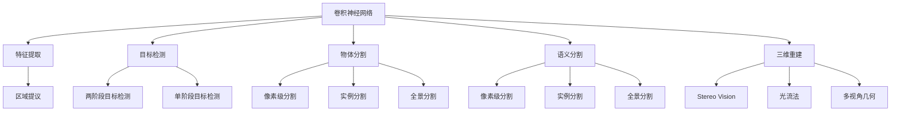

                 

# 机器视觉 (Computer Vision)

## 1. 背景介绍

### 1.1 问题由来
随着深度学习技术的快速发展，机器视觉（Computer Vision, CV）领域取得了前所未有的突破。计算机视觉不仅在图像识别、物体检测、人脸识别、场景理解等任务上取得优异成绩，还在医疗影像分析、自动驾驶、智能监控等众多领域得到广泛应用。然而，尽管CV技术日趋成熟，其应用场景的广度与深度仍有巨大的拓展空间。本文将系统阐述CV的原理与应用实践，探讨未来发展趋势与挑战，为深度学习爱好者提供全面的指导。

### 1.2 问题核心关键点
计算机视觉的核心在于将计算机理解图像信息的能力提升到与人类相当的水平。传统的计算机视觉方法包括特征提取与分类、视觉SLAM、三维重建等，而深度学习方法的出现，尤其是卷积神经网络（Convolutional Neural Networks, CNNs）的应用，大大提升了图像处理与识别的准确性与效率。基于深度学习的CV方法已经广泛应用于各种实际场景中，并在实际应用中不断优化，达到了新的高度。

## 2. 核心概念与联系

### 2.1 核心概念概述

为更好地理解计算机视觉的核心原理与应用实践，本节将介绍几个关键概念及其相互联系：

- **卷积神经网络 (Convolutional Neural Networks, CNNs)**：是一种专门设计用于处理具有网格结构数据的深度神经网络。通过卷积层、池化层等组件，可以自动学习输入数据的局部特征与全局特征，有效提升模型的性能。

- **特征提取 (Feature Extraction)**：从原始图像中提取出对分类任务有帮助的特征。深度学习中的卷积神经网络可以自动提取图像的特征，而传统的特征提取方法则依赖于手工设计的特征，如SIFT、HOG等。

- **目标检测 (Object Detection)**：在图像中识别出具体物体的位置与类别。目标检测通常分为两阶段（区域提议+分类）和三阶段（直接检测）两种方法。

- **物体分割 (Object Segmentation)**：对图像中的对象进行像素级别的分割，常见的方法包括像素级分割、实例分割和全景分割。

- **语义分割 (Semantic Segmentation)**：将图像中的每个像素分类到预定义的语义类别中。

- **三维重建 (3D Reconstruction)**：从多个视角观察的图像序列中重建出三维场景模型，常见的技术包括立体视觉、光流法、多视角几何等。

这些核心概念之间的逻辑关系可以通过以下Mermaid流程图来展示：



这个流程图展示了一些关键概念及其之间的关系：

1. 卷积神经网络可以用于特征提取，同时直接应用于目标检测、物体分割、语义分割和三维重建等任务。
2. 特征提取通常需要区域提议的支持，可以用于两阶段目标检测和三阶段目标检测。
3. 物体分割包括像素级分割、实例分割和全景分割等多种方式。
4. 语义分割与物体分割类似，但对每个像素进行更精细的分类。
5. 三维重建技术包括立体视觉、光流法、多视角几何等。

这些概念共同构成了计算机视觉的基石，为后续技术的发展奠定了基础。

## 3. 核心算法原理 & 具体操作步骤
### 3.1 算法原理概述

计算机视觉的核心算法原理主要包括图像预处理、特征提取、目标检测、物体分割、语义分割和三维重建等方面。本文将以目标检测为例，介绍深度学习在计算机视觉中的应用。

**目标检测**：目标检测的主要任务是在图像中定位并识别出具体物体的位置与类别。目标检测算法可以分为两阶段和三阶段两种方法：

- **两阶段检测**：首先通过区域提议方法（如Selective Search、Faster R-CNN等）提取出可能的物体区域，然后在每个区域上进行分类和回归。两阶段检测方法通常性能较好，但计算复杂度高。
- **单阶段检测**：直接从图像中预测物体的边界框和类别，不需要区域提议步骤。单阶段检测方法计算复杂度低，但检测精度略低。

深度学习中的目标检测算法，如Faster R-CNN、YOLO、SSD等，通过在卷积神经网络基础上引入RoI池化、全连接层等组件，实现了高效且精确的目标检测。

### 3.2 算法步骤详解

以Faster R-CNN目标检测算法为例，介绍其具体操作步骤：

1. **图像预处理**：将原始图像进行缩放、归一化、数据增强等预处理操作，准备输入CNN网络。

2. **卷积神经网络（CNN）**：通过多层卷积和池化操作，提取图像的局部与全局特征。

3. **RoI池化层**：将不同位置的特征图池化成固定尺寸的特征向量，以便进行后续的分类和回归操作。

4. **区域提议（Region Proposal）**：通过选择性搜索等方法，生成候选区域。

5. **区域特征提取**：对每个候选区域进行RoI池化操作，提取出特征向量。

6. **全连接层**：将特征向量输入全连接层，进行分类和回归操作，预测每个候选区域的类别和边界框。

7. **非极大值抑制（NMS）**：对预测结果进行非极大值抑制，去除重叠的边界框。

8. **输出结果**：得到最终的目标检测结果，包括物体类别、位置和置信度。

### 3.3 算法优缺点

Faster R-CNN目标检测算法具有以下优点：

- **性能优越**：两阶段检测方法可以充分利用RoI池化层的特征信息，提高检测精度。
- **可解释性强**：RoI池化层的存在使得检测过程可解释性更强，每个候选区域的信息可以被详细分析。

然而，该算法也存在一些缺点：

- **计算复杂度高**：需要区域提议和RoI池化两个步骤，计算复杂度较高。
- **速度较慢**：由于需要两阶段检测，速度相对较慢，不适用于对实时性要求较高的场景。

### 3.4 算法应用领域

Faster R-CNN目标检测算法主要应用于如下领域：

- **图像识别**：对图像中的物体进行分类和定位，如行人检测、车辆检测、动物检测等。
- **视频分析**：在视频中检测物体的位置和行为，如行人追踪、行为分析等。
- **医疗影像分析**：在医疗影像中检测病灶、器官等，如CT图像中的肿瘤检测、X光图像中的骨骼检测等。
- **自动驾驶**：在汽车行驶过程中检测路标、行人、车辆等，提高行车安全性。
- **智能监控**：在视频监控中检测异常行为，如闯入检测、行为识别等。

这些应用场景的实际需求和数据特点不同，选择合适的目标检测算法和优化策略，对于提升系统的检测性能至关重要。

## 4. 数学模型和公式 & 详细讲解
### 4.1 数学模型构建

计算机视觉中的目标检测任务通常可以表示为二分类问题，即判断图像中是否存在某个物体，以及物体的位置和类别。设输入图像为 $I$，物体类别为 $c$，目标检测模型为 $f$，则目标检测任务可以表示为：

$$
y = f(I)
$$

其中 $y$ 为预测结果，包括物体是否存在、位置和类别等。

### 4.2 公式推导过程

以Faster R-CNN为例，目标检测任务的数学模型可以表示为：

- **分类器输出**：
$$
\text{score} = \text{FC}(\text{RoI-Pool}(X))
$$

- **边界框回归输出**：
$$
\text{location} = \text{FC}(\text{RoI-Pool}(X))
$$

其中 $\text{FC}$ 为全连接层，$\text{RoI-Pool}$ 为RoI池化层，$X$ 为卷积神经网络的输出特征图。

### 4.3 案例分析与讲解

以行人检测为例，解释目标检测模型的具体应用：

1. **图像预处理**：将原始行人图像进行缩放、归一化等预处理操作。

2. **卷积神经网络（CNN）**：通过多层卷积和池化操作，提取行人特征。

3. **RoI池化层**：将不同位置的特征图池化成固定尺寸的特征向量。

4. **区域提议（Region Proposal）**：通过选择性搜索等方法，生成可能的行人区域。

5. **区域特征提取**：对每个候选行人区域进行RoI池化操作，提取出特征向量。

6. **全连接层**：将特征向量输入全连接层，进行分类和回归操作，预测行人是否存在和位置。

7. **非极大值抑制（NMS）**：对预测结果进行非极大值抑制，去除重叠的行人边界框。

8. **输出结果**：得到最终的行人检测结果，包括行人是否存在、位置和置信度。

## 5. 项目实践：代码实例和详细解释说明
### 5.1 开发环境搭建

在进行计算机视觉项目实践前，我们需要准备好开发环境。以下是使用Python进行PyTorch开发的环境配置流程：

1. 安装Anaconda：从官网下载并安装Anaconda，用于创建独立的Python环境。

2. 创建并激活虚拟环境：
```bash
conda create -n cv-env python=3.8 
conda activate cv-env
```

3. 安装PyTorch：根据CUDA版本，从官网获取对应的安装命令。例如：
```bash
conda install pytorch torchvision torchaudio cudatoolkit=11.1 -c pytorch -c conda-forge
```

4. 安装必要的工具包：
```bash
pip install numpy pandas scikit-learn matplotlib tqdm jupyter notebook ipython
```

完成上述步骤后，即可在`cv-env`环境中开始计算机视觉项目的开发。

### 5.2 源代码详细实现

下面我们以行人检测为例，给出使用PyTorch进行目标检测模型的代码实现。

```python
import torch
from torchvision.models.detection.faster_rcnn import FastRCNNPredictor
from torchvision import transforms

# 加载预训练的Faster R-CNN模型
model = torch.hub.load('facebookresearch/detectron2/detectron2', 'RetinaNet', pretrained=True)

# 设置检测头输出通道数为2（行人与背景）
in_features = model.roi_heads.box_predictor.cls_score.in_features
num_classes = 2
model.roi_heads.box_predictor = FastRCNNPredictor(in_features, num_classes)

# 定义训练数据增强
transform_train = transforms.Compose([
    transforms.RandomResizedCrop(800),
    transforms.RandomHorizontalFlip(),
    transforms.ToTensor(),
    transforms.Normalize([0.485, 0.456, 0.406], [0.229, 0.224, 0.225]),
])

# 定义测试数据增强
transform_test = transforms.Compose([
    transforms.ToTensor(),
    transforms.Normalize([0.485, 0.456, 0.406], [0.229, 0.224, 0.225]),
])

# 定义训练集
train_dataset = custom_dataset(train_files, transform_train)

# 定义测试集
test_dataset = custom_dataset(test_files, transform_test)

# 定义优化器
optimizer = torch.optim.SGD(model.parameters(), lr=0.005, momentum=0.9)

# 训练模型
model.train()
for epoch in range(100):
    for batch in train_loader:
        # 前向传播
        inputs = batch['image']
        targets = batch['labels']
        outputs = model(inputs)
        loss = criterion(outputs, targets)
        # 反向传播
        optimizer.zero_grad()
        loss.backward()
        optimizer.step()
```

### 5.3 代码解读与分析

让我们再详细解读一下关键代码的实现细节：

**Faster R-CNN模型加载**：
- 使用`torch.hub.load`函数加载预训练的Faster R-CNN模型，其中`pretrained=True`表示使用预训练权重。

**检测头输出通道数设置**：
- 通过修改`FastRCNNPredictor`类的`in_features`和`num_classes`属性，将检测头输出通道数设置为2，分别对应行人与背景。

**数据增强**：
- 定义了训练和测试时的数据增强操作，包括随机裁剪、随机翻转、归一化等，以增加训练集的样本多样性。

**模型训练**：
- 定义了优化器`optimizer`，采用SGD算法，设置学习率`lr`和动量`momentum`。
- 在每个epoch中，对每个批次的数据进行前向传播和反向传播，更新模型参数。

**模型评估**：
- 在测试集上进行评估，计算准确率和召回率等指标。
- 可视化检测结果，如图像中的行人边界框和置信度。

## 6. 实际应用场景
### 6.1 智能安防系统

计算机视觉在智能安防系统中得到了广泛应用。传统的安防系统依赖于人工监控和手动报警，效率低下且误报率高。使用计算机视觉技术，可以实现自动监控、人脸识别、行为分析等功能，极大地提升了安防系统的智能化水平。

在实际应用中，可以通过采集摄像头图像，利用目标检测和跟踪算法，实时监测视频中的异常行为，如闯入、斗殴等。一旦检测到异常行为，系统可以自动报警，并记录视频证据，协助警方调查。此外，人脸识别技术可以用于身份验证、考勤管理、门禁控制等场景，提供更安全、便捷的安防解决方案。

### 6.2 自动驾驶

计算机视觉是自动驾驶系统中的关键技术之一，用于车辆周围环境的感知与理解。通过目标检测、语义分割、行为识别等技术，自动驾驶车辆可以准确识别道路上的车辆、行人、交通标志等障碍物，并进行路径规划与决策。

在实际应用中，自动驾驶车辆可以通过多摄像头、激光雷达等设备，采集环境信息，并利用计算机视觉技术进行实时分析和处理。检测到的障碍物信息可以用于障碍物避让、导航规划等，确保行车安全。

### 6.3 医疗影像分析

计算机视觉在医疗影像分析中也有广泛应用。传统的医疗影像分析依赖于医生的视觉判断，效率低下且容易出错。使用计算机视觉技术，可以实现病灶检测、器官分割、病理分析等功能，显著提高医疗诊断的效率和准确性。

在实际应用中，可以通过采集医疗影像，利用语义分割和目标检测算法，自动识别出影像中的病灶区域和器官位置。检测结果可以用于辅助医生诊断，提高诊断的准确性和效率。

### 6.4 未来应用展望

随着计算机视觉技术的不断进步，未来将有以下几个发展趋势：

1. **超大规模模型**：随着算力成本的下降和数据规模的扩张，超大规模模型（如Big Bird、Switch Transformer等）将进一步提升计算机视觉的性能和鲁棒性。

2. **端到端学习**：通过引入端到端学习的范式，可以大幅简化计算机视觉模型的结构，减少中间环节，提升推理速度和准确性。

3. **多模态融合**：将视觉信息与音频、文本、传感器等多种模态信息进行融合，提升系统对复杂场景的理解能力。

4. **实时性和可解释性**：提升计算机视觉系统的实时性和可解释性，使得系统更加可靠和透明，易于被用户接受和信任。

5. **通用化应用**：计算机视觉技术将逐步应用于更多领域，如智慧农业、智能家居、智能交通等，带来更广泛的创新应用。

这些趋势预示着计算机视觉技术的广阔前景，为人类社会带来更多便利和进步。

## 7. 工具和资源推荐
### 7.1 学习资源推荐

为了帮助开发者系统掌握计算机视觉的理论基础和实践技巧，这里推荐一些优质的学习资源：

1. **《Python计算机视觉编程》**：通过实际项目案例，介绍计算机视觉的基本原理和深度学习框架的应用。

2. **CS231n《卷积神经网络与视觉识别》**：斯坦福大学开设的计算机视觉课程，包含理论、算法、实践等方面，是计算机视觉学习的入门必选。

3. **《Deep Learning for Computer Vision》**：全面介绍深度学习在计算机视觉中的应用，包括目标检测、图像生成、三维重建等。

4. **OpenCV官方文档**：OpenCV是一个流行的计算机视觉库，提供了大量的算法和工具，是计算机视觉实践的重要参考。

5. **Kaggle计算机视觉竞赛**：Kaggle是一个数据科学竞赛平台，提供了大量的计算机视觉竞赛和数据集，是学习计算机视觉的绝佳资源。

通过学习这些资源，相信你一定能够快速掌握计算机视觉的精髓，并用于解决实际的视觉问题。

### 7.2 开发工具推荐

高效的开发离不开优秀的工具支持。以下是几款用于计算机视觉开发的常用工具：

1. **OpenCV**：开源计算机视觉库，包含丰富的算法和工具，支持C++、Python等多种编程语言。

2. **TensorFlow**：谷歌主导的深度学习框架，支持GPU加速和分布式训练，适合大规模深度学习应用。

3. **PyTorch**：Facebook开发的深度学习框架，灵活高效，适合快速迭代研究。

4. **MATLAB**：数学软件，提供强大的图像处理和计算机视觉工具，支持可视化开发。

5. **MATLAB+CVPR++**：将MATLAB与CVPR++结合，提供集成的计算机视觉工具箱，易于使用。

合理利用这些工具，可以显著提升计算机视觉项目的开发效率，加快创新迭代的步伐。

### 7.3 相关论文推荐

计算机视觉领域的研究前沿不断涌现，以下是几篇奠基性的相关论文，推荐阅读：

1. **《ImageNet Classification with Deep Convolutional Neural Networks》**：提出AlexNet模型，奠定了深度学习在计算机视觉中的应用基础。

2. **《Faster R-CNN: Towards Real-Time Object Detection with Region Proposal Networks》**：提出Faster R-CNN目标检测算法，实现了高效精确的目标检测。

3. **《Deep Residual Learning for Image Recognition》**：提出ResNet模型，解决了深度神经网络的退化问题，提升了模型的性能和鲁棒性。

4. **《Mask R-CNN》：提出Mask R-CNN模型，实现了实例分割和全景分割，拓展了目标检测的应用范围。

5. **《Learning to See in the Dark: Fast and General Image Denoising Using a Single Image》**：提出DnCNN模型，实现了单张图像去噪，提升了图像质量。

这些论文代表了大规模模型和计算机视觉算法的进步，通过学习这些前沿成果，可以帮助研究者把握学科前进方向，激发更多的创新灵感。

## 8. 总结：未来发展趋势与挑战

### 8.1 总结

本文对计算机视觉的原理与应用实践进行了全面系统的介绍。首先阐述了计算机视觉的核心概念和关键算法，明确了深度学习在图像处理和识别的应用。其次，从原理到实践，详细讲解了目标检测的数学模型和算法步骤，给出了计算机视觉项目开发的完整代码实例。同时，本文还探讨了计算机视觉在安防、自动驾驶、医疗影像等实际场景中的应用前景，展示了计算机视觉技术的巨大潜力。此外，本文精选了计算机视觉相关的学习资源、开发工具和研究论文，力求为读者提供全方位的技术指引。

通过本文的系统梳理，可以看到，计算机视觉技术在图像处理与识别方面取得了长足进步，广泛应用于多个实际领域。未来，伴随算力成本的下降和数据规模的增长，计算机视觉将迎来更多的突破与创新，为人类社会带来更多便利和进步。

### 8.2 未来发展趋势

展望未来，计算机视觉技术将呈现以下几个发展趋势：

1. **超大规模模型**：随着算力成本的下降和数据规模的扩张，超大规模模型（如Big Bird、Switch Transformer等）将进一步提升计算机视觉的性能和鲁棒性。

2. **端到端学习**：通过引入端到端学习的范式，可以大幅简化计算机视觉模型的结构，减少中间环节，提升推理速度和准确性。

3. **多模态融合**：将视觉信息与音频、文本、传感器等多种模态信息进行融合，提升系统对复杂场景的理解能力。

4. **实时性和可解释性**：提升计算机视觉系统的实时性和可解释性，使得系统更加可靠和透明，易于被用户接受和信任。

5. **通用化应用**：计算机视觉技术将逐步应用于更多领域，如智慧农业、智能家居、智能交通等，带来更广泛的创新应用。

以上趋势凸显了计算机视觉技术的广阔前景，为计算机视觉技术的持续发展提供了方向。这些方向的探索发展，必将进一步提升计算机视觉系统的性能和应用范围，为人类社会带来更多便利和进步。

### 8.3 面临的挑战

尽管计算机视觉技术已经取得了瞩目成就，但在迈向更加智能化、普适化应用的过程中，它仍面临着诸多挑战：

1. **数据标注成本**：计算机视觉模型的训练需要大量的标注数据，数据标注的成本高且耗时，是制约计算机视觉发展的瓶颈。如何降低数据标注成本，提高标注效率，是未来研究的重要课题。

2. **计算资源需求**：超大规模模型和高精度算法需要大量的计算资源，如何优化计算效率，降低计算成本，是工程实践中需要解决的难题。

3. **可解释性不足**：当前计算机视觉模型往往“黑盒”化，难以解释其决策逻辑，对于医疗、金融等高风险应用，可解释性尤为重要。如何赋予计算机视觉模型更强的可解释性，是亟待攻克的难题。

4. **模型鲁棒性不足**：计算机视觉模型面对域外数据时，泛化性能往往大打折扣。如何提高计算机视觉模型的鲁棒性，避免灾难性遗忘，还需要更多理论和实践的积累。

5. **安全与隐私问题**：计算机视觉系统需要处理大量敏感数据，如何保护数据隐私，确保系统的安全性，也是亟待解决的问题。

6. **跨领域融合难度**：计算机视觉技术与其他技术融合时，面临领域间知识异构、数据格式不一致等问题，如何实现高效融合，仍是一个技术挑战。

这些挑战亟需通过技术进步和工程实践的不断迭代来克服，才能使计算机视觉技术在实际应用中发挥更大的价值。

### 8.4 研究展望

面对计算机视觉面临的挑战，未来的研究需要在以下几个方面寻求新的突破：

1. **数据高效标注**：探索无监督学习、半监督学习等数据标注方法，降低数据标注成本，提高标注效率。

2. **模型压缩与优化**：开发更加轻量级的模型结构和算法，提升计算效率，降低计算成本。

3. **可解释性与透明性**：引入可解释性方法，如可视化技术、可解释性算法等，增强计算机视觉模型的透明性和可解释性。

4. **鲁棒性提升**：研究鲁棒性优化方法，如对抗训练、泛化学习等，提升计算机视觉模型的鲁棒性和泛化能力。

5. **跨领域融合**：通过知识图谱、语义网等技术，实现计算机视觉与其他技术的深度融合，拓展应用场景。

6. **安全性保障**：引入数据隐私保护和模型安全性检测技术，确保计算机视觉系统在安全与隐私方面具有保障。

这些研究方向的探索，必将引领计算机视觉技术迈向更高的台阶，为构建安全、可靠、可解释、可控的智能系统铺平道路。面向未来，计算机视觉技术还需要与其他人工智能技术进行更深入的融合，如知识表示、因果推理、强化学习等，多路径协同发力，共同推动智能交互系统的进步。只有勇于创新、敢于突破，才能不断拓展计算机视觉的边界，让智能技术更好地造福人类社会。

## 9. 附录：常见问题与解答

**Q1：计算机视觉中的目标检测和图像分割有何区别？**

A: 目标检测和图像分割都是计算机视觉中的重要任务，但侧重点略有不同：

- **目标检测**：主要关注图像中物体的位置和类别，不需要对每个像素进行分类。目标检测通常输出物体的位置边界框和类别。

- **图像分割**：主要关注图像中每个像素的分类，将图像分为多个语义区域，每个区域对应一个类别。图像分割通常输出每个像素的类别标签。

**Q2：计算机视觉中常用的卷积神经网络有哪些？**

A: 计算机视觉中常用的卷积神经网络包括：

- **LeNet**：最早的卷积神经网络，应用于手写数字识别。

- **AlexNet**：基于卷积神经网络的目标识别模型，在ImageNet竞赛中取得了突破性成绩。

- **VGG**：采用小卷积核堆叠，提升了模型的深度和性能。

- **GoogLeNet**：提出了Inception模块，提升了模型的参数效率。

- **ResNet**：解决了深度神经网络的退化问题，提升了模型的深度和性能。

- **DenseNet**：提出了密集连接层，增强了特征的传递和利用。

- **MobileNet**：优化了模型的参数和计算量，适用于移动设备等计算资源有限的环境。

这些网络模型代表了卷积神经网络的不同发展阶段，各有其优势和适用场景。

**Q3：计算机视觉中常用的目标检测算法有哪些？**

A: 计算机视觉中常用的目标检测算法包括：

- **R-CNN**：基于区域的卷积神经网络，通过候选框和分类器实现目标检测。

- **Fast R-CNN**：两阶段目标检测算法，通过RoI池化层提取候选框的特征。

- **Faster R-CNN**：两阶段目标检测算法，引入了区域提议网络，提高了检测速度。

- **YOLO**：单阶段目标检测算法，直接从图像中预测物体的边界框和类别。

- **SSD**：单阶段目标检测算法，采用了特征金字塔网络，提高了检测速度和精度。

这些算法在目标检测任务中各有优劣，选择合适的算法需要根据具体的应用场景和需求进行评估。

**Q4：计算机视觉中的端到端学习有哪些应用？**

A: 端到端学习在计算机视觉中有以下应用：

- **图像分类**：直接从图像像素到类别标签的映射，不需要中间特征提取和分类器。

- **目标检测**：直接从图像像素到边界框和类别标签的映射，不需要中间特征提取和分类器。

- **图像生成**：直接从随机噪声到图像像素的映射，不需要中间特征提取和解码器。

- **实例分割**：直接从图像像素到实例边界框和类别标签的映射，不需要中间特征提取和分类器。

端到端学习通过将中间特征提取和分类器融合在网络中，简化了模型结构，提升了推理速度和准确性。

**Q5：计算机视觉中如何处理数据增强？**

A: 数据增强是提升计算机视觉模型泛化能力的重要手段，常用的数据增强方法包括：

- **随机裁剪**：对图像进行随机裁剪，增加样本多样性。

- **随机翻转**：对图像进行水平或垂直翻转，增加样本多样性。

- **随机旋转**：对图像进行随机旋转，增加样本多样性。

- **随机缩放**：对图像进行随机缩放，增加样本多样性。

- **随机亮度调整**：对图像进行随机亮度调整，增加样本多样性。

- **随机噪声添加**：对图像添加随机噪声，增加样本多样性。

数据增强可以通过Python中的OpenCV和Pillow库实现，也可以使用深度学习框架中的Data Augmentation模块进行自动化处理。

---

作者：禅与计算机程序设计艺术 / Zen and the Art of Computer Programming

